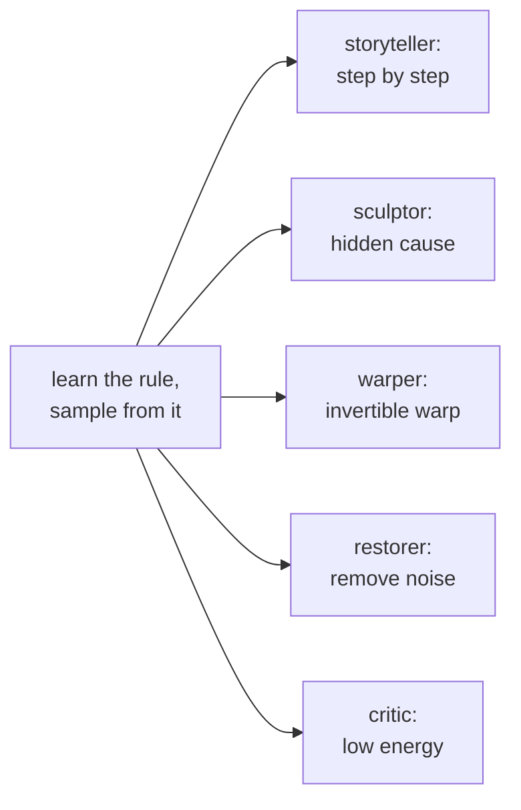
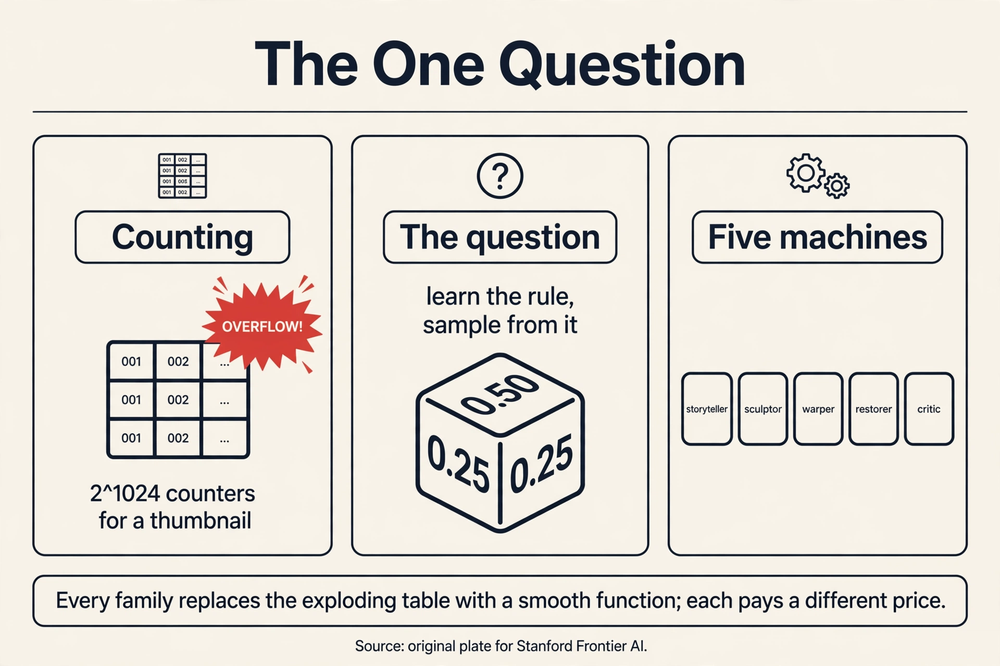

## The question

Every lesson in this course answers one question. Here it is,
stated plainly:

> You have samples from an unknown rule. Learn the rule. Then draw
> fresh samples from it.

A **distribution** is the rule. It assigns a probability to every
possible outcome. A loaded die has a distribution: face 1 comes up
half the time, faces 2 and 3 each come up a quarter of the time.
Written out:

```ascii
outcome:    1      2      3
P(outcome): 0.50   0.25   0.25
```

**Sampling** means rolling that die: pressing a button and getting
one fresh outcome, with face 1 appearing about half the time. A
**generative model** is a machine that learns the rule from samples
and then samples from it.

That is the whole job. The rest of this course is one question
with many machines. Each family of models is a different answer to
it. Before meeting the machines, watch the naive answer fail.

## First attempt: the counting machine

The simplest machine counts. Roll the die 20 times. Count the
faces. Divide by 20. Call the result the rule.

```ascii
20 rolls:  1,1,3,1,2,1,1,3,1,2,1,1,1,3,2,1,1,1,2,1

counts:    1 -> 13,   2 -> 4,   3 -> 3
rule:      P(1) = 0.65,  P(2) = 0.20,  P(3) = 0.15
```

To sample, the machine rolls its own rule: pick face 1 with
probability 0.65, and so on. It works. It learned a distribution
from samples and draws new ones. This is **density estimation**:
estimating the probabilities, then sampling from the estimate.

Two details matter. First, the machine stores one number per
outcome. Three faces, three counters. Second, the machine can only
produce outcomes it counted. It cannot invent face 4. For dice
that is fine. For images it is fatal.

## Where counting breaks: the table explodes

Count the outcomes for a real problem. Take a tiny black-and-white
image, 32 by 32 pixels. Each pixel is on or off. The number of
possible images is 2^(32x32) = 2^1024. That number has 309 digits.
A counting machine needs one counter per possible image: more
counters than atoms in the visible universe, for a thumbnail.

Scale to a color photo, 256 by 256 pixels, 256 shades per channel.
The outcome count is 256^(256x256x3). That number has about
473,000 digits. No machine counts that.

```ascii
problem              outcomes              counters needed
loaded die           3                     3
32x32 binary image   2^1024 (~10^308)      more than atoms exist
256x256 color photo  ~10^473000            impossible
```

The naive answer dies by counting. No table can hold the rule for
real data. So every real generative model cheats the table. It
assumes structure: the rule is not an arbitrary list of numbers,
but something with a shape that few parameters can describe. Each
family cheats differently. That is the entire taxonomy of this
course.

A second crack runs deeper. The counting machine treats similar
outcomes as strangers. A photo of a cat and the same photo shifted
one pixel get separate counters, sharing nothing. Real data has
smoothness: nearby outcomes have nearby probabilities. The naive
machine cannot use that. It learns each counter alone.

## The key question

What if, instead of one counting machine, there are several
different machines, each a different way to learn the rule and
draw from it?

## The five machines

Each family answers the one question with a different mechanism.
Here they are, in the order this course studies them.

**Machine 1: the storyteller (autoregressive).** Do not learn the
whole rule at once. Break the outcome into steps and learn each
step given the earlier ones. For the die, that is trivial. For a
photo, it means: predict pixel 1, then pixel 2 given pixel 1, then
pixel 3 given the first two, and so on. Sampling runs the same
steps: write one piece at a time. The machine behind every modern
language model.

**Machine 2: the sculptor (variational autoencoder).** Imagine a
hidden cause behind each outcome. A face photo is caused by hidden
settings: pose, lighting, identity. The machine learns two maps: an
encoder that guesses the hidden settings from a photo, and a
decoder that rebuilds a photo from settings. To sample, draw
random settings from a simple prior (a standard bell curve) and run
the decoder. The hidden settings are called **latent variables**:
variables the model invents, never observed in the data.

**Machine 3: the warper (normalizing flow).** Start with simple
noise, say uniform numbers. Learn a warping function that bends the
noise into data. The warp must be invertible: you can go from noise
to image and back. Because the warp is invertible, the machine can
compute exact probabilities through the **change of variables**
formula. No approximation in the density. The price is rigidity:
the warp must stay invertible, which limits its shape.

**Machine 4: the restorer (diffusion).** Take a photo and corrupt
it with noise, step by step, until it is pure static. Learn the
reverse: a machine that removes a little noise at each step. To
sample, start from pure static and run the reverser a thousand
times. The corruption is fixed and simple. Only the restoration is
learned.

**Machine 5: the critic (energy-based).** Assign every outcome an
**energy**: low energy for real-looking outcomes, high energy for
fake-looking ones. Real faces sit in valleys. Noise sits on hills.
To sample, wander downhill: start from noise and roll toward low
energy. The catch is normalization: turning energies into true
probabilities needs a sum over all outcomes, which is the same
exploding table. So this machine samples without ever computing
the true probabilities.



A sixth machine exists, the **adversarial** one (GAN): a generator
that fools a learned critic. Its mathematics belongs to the
sibling course (math-genai, Lessons 3-5). It appears here only in
the final comparison table.

## Mapping back: how each machine dodges the table

Each machine's trick answers one of the counting machine's
failures, by name:

| Counting failure | Machine | The dodge |
|---|---|---|
| Table explodes: 2^1024 counters | Storyteller | Never stores the table. Stores one small predictor per step. |
| Table explodes | Sculptor | Stores a decoder from a small latent space. Few knobs describe many outcomes. |
| Table explodes | Warper | Stores one warp. The change-of-variables formula gives exact densities with no table. |
| Table explodes | Restorer | Stores one denoiser reused across 1,000 steps. The corruption schedule is fixed. |
| Table explodes | Critic | Stores one energy function. Never sums over all outcomes. |
| Similar outcomes share nothing | All five | All use smooth neural maps: nearby inputs give nearby outputs by construction. |

The common move: replace the table of counters with a smooth
parameterized function. Nearby outcomes flow through nearby paths
of the function, so learning about one teaches the machine about
its neighbors. That is what "generalization" means here.

## The honest price

No machine is free. Each dodge has a price, and the price list is
the map of the course:

| Machine | Price |
|---|---|
| Storyteller (L02) | Sampling is serial. A 1,000-pixel image needs 1,000 steps, one after another. |
| Sculptor (L03) | The density is approximate, not exact. Samples blur. |
| Warper (L04) | The warp must be invertible with a cheap determinant. Architectures are rigid. |
| Restorer (L05, L06) | Sampling takes ~1,000 reverse steps. Slow to draw. |
| Critic (L07) | No normalized probabilities. Training needs careful negative sampling. |

Every lesson follows the same arc: the question restated, the
family's answer, a hand-worked toy, the failure demonstrated with
numbers, the price named. By L08 you will judge any generator by
asking which machine it is and whether it paid its price.

> [!QA]
> Q: What is the actual job of a generative model, in one sentence?
> A: Learn the probability rule behind observed samples, then produce fresh samples that follow that rule. The die toy shows both halves: the counts estimate the rule (0.65, 0.20, 0.15 from 20 rolls), and rolling the estimated rule draws new samples. Everything else in this course is a smarter way to do those two halves when the outcome space is too big to count.
> Follow-up: Why can the model not just memorize the dataset and replay it?
> A: Because replay assigns zero probability to anything new, and the job asks for the rule, not the samples. The sibling course (math-genai L01) demonstrates this with its memory machine. Here the counting argument shows the stronger failure: for a 256x256 color photo the outcome count is ~10^473000, so a memorize-and-replay table cannot even be stored.

> [!QA]
> Q: What is the difference between density estimation and sampling?
> A: Density estimation learns the numbers: given an outcome, what is its probability? Sampling runs the rule forward: produce a fresh outcome. The counting machine does both from one table. Real families often split them: the storyteller estimates densities step by step and samples the same way, while the critic (energy-based) samples by rolling downhill without ever computing normalized probabilities.
> Follow-up: Which families give exact densities?
> A: The storyteller and the warper. The storyteller's chain rule multiplies exact step probabilities. The warper's change-of-variables formula is exact by construction. The sculptor and restorer give only lower bounds (ELBO-style approximations), and the critic gives unnormalized energies. This exactness column is the first thing to check when comparing families.

> [!QA]
> Q: Why does every family replace the table with a smooth function?
> A: Because the table has two fatal properties: it needs one counter per outcome (2^1024 for a thumbnail), and each counter learns alone, so a shifted cat photo teaches nothing about the original. A smooth neural map shares: nearby inputs take nearby paths through the function, so one training example nudges the probabilities of its neighbors too. That sharing is what makes learning from finite data possible at all.
> Follow-up: Does smoothness ever hurt?
> A: Yes. It is an assumption, and wrong assumptions blur. The sculptor's smooth decoder is exactly why VAE samples look blurry: the model averages over plausible neighbors instead of picking one sharply. L03 demonstrates this with the KL penalty pulling reconstructions toward the average.



## Recap: the whole lesson on one screen

1. **The one question.** Learn the rule behind samples, then draw fresh samples from it.
2. **The rule, concretely.** A distribution: probabilities per outcome. The loaded die: 0.50, 0.25, 0.25.
3. **First attempt: counting.** 20 rolls give counts 13/4/3, rule 0.65/0.20/0.15. Works on dice.
4. **The table explodes.** A 32x32 binary image has 2^1024 outcomes. A color photo has ~10^473000. No table survives.
5. **Similar outcomes share nothing.** The counter for a cat photo teaches nothing about the same photo shifted one pixel.
6. **The key question.** What if several different machines answer the one question, each dodging the table differently?
7. **The five machines.** Storyteller (steps), sculptor (hidden cause), warper (invertible warp), restorer (denoise), critic (energy valleys).
8. **The price list.** Serial sampling, approximate density, rigid warps, 1,000 denoising steps, no normalization. Each lesson names its price.

## Official sources and further reading

**Official:**
- W1_L2: Introduction & problem setting (Prof. Prathosh A P, playlist PLZ2ps__7DhBa5xCmncgH7kPqLqMBq7xlu): the lecture this chapter's framing follows. [uncertain]: the exact lecture treatment of the family taxonomy is not verified. The five-family map is the course's standard arc, assembled here from the playlist's lecture sequence.

**Further reading:**
- Goodfellow et al., Generative Adversarial Nets (2014): https://arxiv.org/abs/1406.2661 — the sixth machine, covered in the sibling course.
- The sibling course math-genai L01-L03: the three-step recipe (parametric family, divergence, optimization) and the divergence zoo, which this course takes as given.

**Caveats from these sources.** The five-family split is a teaching map, not a law: hybrids exist (diffusion in latent space, flow-based priors in VAEs). The outcome counts (2^1024, ~10^473000) assume independent pixels. Real images live on a much smaller manifold, which is exactly why the smooth-function dodge works.

## Connections to the other courses

- **math-genai (sibling):** the math foundations this course builds on: KL and MLE (L02), f-divergences (L03), ELBO, GAN mathematics. Read it for the derivations. This course uses the results.
- **CS229 L10/L11:** EM and the latent-variable view behind the sculptor. The diffusion lesson's probabilistic framing.
- **CS229S L02:** the storyteller's engine: next-token prediction and attention, the mechanism that made autoregressive models scale.
- **CS336:** architecture discussions that the warper lesson connects to: invertibility constraints vs. the free-form transformer block.
