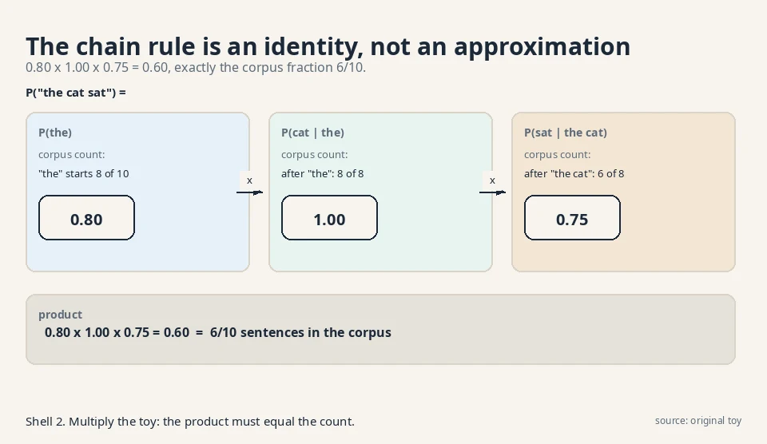
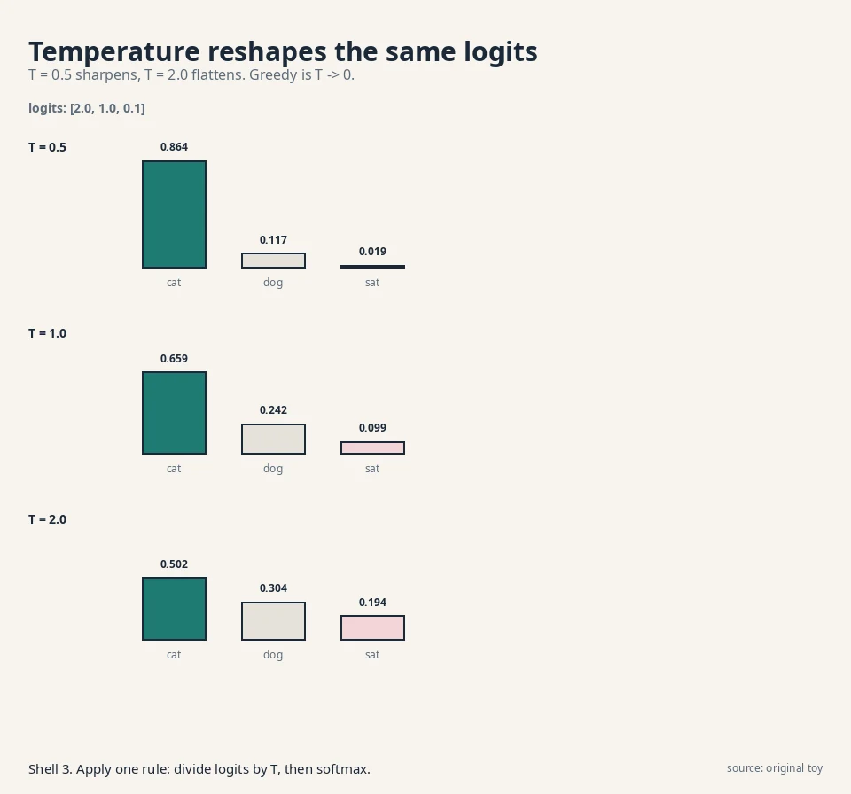
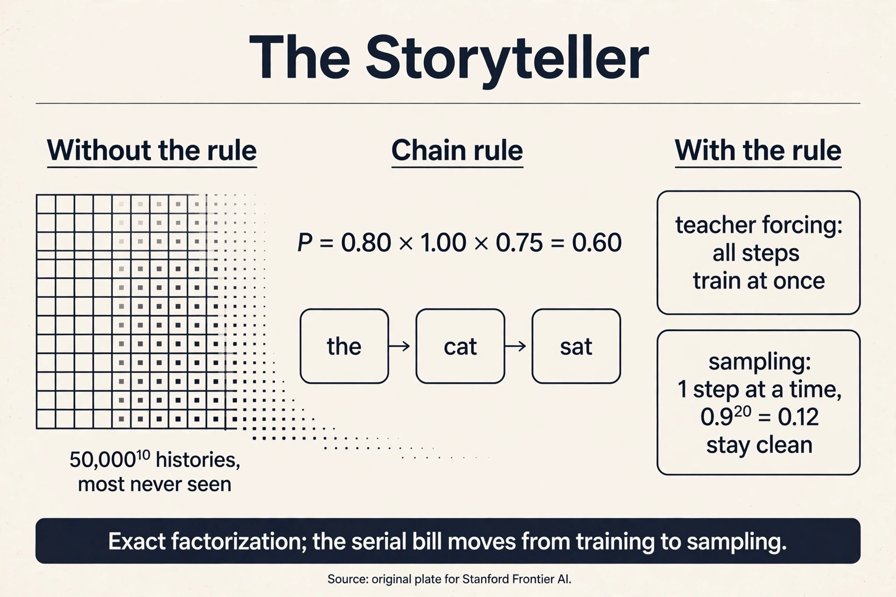

## The question, for sequences

Restate the one question for sequences: you have samples of
sequences (sentences, audio, pixel rows). Learn the rule behind
them. Draw fresh sequences from it.

The storyteller's answer: do not learn the whole sequence at once.
Tell it one word at a time. To write a sentence, predict the first
word, then the second word given the first, then the third given
the first two. Learning the rule means learning each of these
small prediction steps. Sampling means running the steps and
writing down what comes out.

## First attempt: count the conditionals

A **conditional probability** is a probability with a given past.
P(cat | the) reads "the probability of cat given that the came
before." Concretely, it is a fraction: among all the times "the"
appeared, how often did "cat" follow?

Watch it on a toy corpus of 10 sentences:

```ascii
"the cat sat"   x6
"the cat ran"   x2
"a  dog sat"    x2
```

The **chain rule** breaks a sequence probability into a product of
conditionals:

```ascii
P("the cat sat") = P(the) x P(cat | the) x P(sat | the cat)
```

Count each factor from the corpus:

```ascii
P(the)         = 8/10 = 0.80   ("the" starts 8 of 10 sentences)
P(cat | the)   = 8/8  = 1.00   (after "the", always "cat")
P(sat | the cat) = 6/8 = 0.75  (after "the cat", "sat" 6 of 8 times)

product: 0.80 x 1.00 x 0.75 = 0.60
```

Check against the corpus: 6 of 10 sentences are "the cat sat",
so the true fraction is 0.60. The chain rule reproduces it
exactly. The factorization is not an approximation. It is an
identity.



To sample, run it forward. Draw word 1 from P(word). Suppose "the".
Draw word 2 from P(word | the). Suppose "cat". Draw word 3 from
P(word | the cat). The machine wrote "the cat sat" one draw at a
time. That is an **autoregressive** model: each step regresses on
(depends on) the earlier steps.

### Subchapter: the factorization tree

Draw the chain rule as a tree. The root splits on the first word:
"the" with 0.80, "a" with 0.20. The "the" branch splits on the
second word: "cat" with 1.00. The "the cat" branch splits on the
third: "sat" with 0.75, "ran" with 0.25. Every root-to-leaf path
is one sentence, and its probability is the product along the
path. The tree has one leaf per distinct sentence in the corpus.

Two facts fall out. First, the tree is exact: path products equal
corpus fractions by construction, as the plate verifies. Second,
the tree is the table from L01 wearing a new shape: each node is
a conditional distribution, and the number of nodes grows with
the number of distinct histories. The tree makes the explosion
visible: depth 10 over a 50,000-word vocabulary has 50,000^10
paths. The neural storyteller replaces every node's counter with
one shared predictor.

## Where counting conditionals breaks

The counting machine needs one counter per history. To predict the
11th word from the previous 10, with a 50,000-word vocabulary,
there are 50,000^10 possible histories. That number has 47 digits.
Every history needs its own counter for the next word: another
factor of 50,000. The conditional table is the same exploding
table from L01, now with histories as rows.

```ascii
history length   rows in the table
1                50,000
5                50,000^5  (24 digits)
10               50,000^10 (47 digits)
```

Worse, most histories never appear. "the cat sat on the" might
appear never, yet the machine must still predict what follows.
The counter for an unseen history is empty. Counting cannot
generalize across histories.

## The key question

What if one smooth predictor learned all the conditionals at
once, trained on true histories, sharing strength between similar
pasts?

## The new idea: one predictor, forced teachers

Replace the table with a neural network. The network reads a
history and outputs a probability for every vocabulary word. One
set of weights serves all histories. Similar histories flow
through similar paths, so "the cat sat on the" borrows from "a dog
sat on the". The table is gone. The sharing from L01 does the
work.

Training uses **teacher forcing**. The name is literal: the teacher
(the true data) forces the correct history at every step. To train
on "the cat sat", the model never feeds its own guesses back in.
Each step gets the true past:

```ascii
step 1: input [START]            target: the
step 2: input [START, the]       target: cat
step 3: input [START, the, cat]  target: sat
```

The loss is the negative log probability of each true target,
summed. Log means the natural log (base e) everywhere in this
course. Suppose the model outputs:

```ascii
P(the | START)       = 0.70
P(cat | the)         = 0.90
P(sat | the cat)     = 0.50

loss = -(log 0.70 + log 0.90 + log 0.50)
     = -(-0.357 - 0.105 - 0.693)
     = 1.155 nats
```

A **nat** is the unit of information for natural logs, the way a
bit is the unit for base-2 logs.

**Perplexity** turns this into plain language: exp(average loss
per token) = exp(1.155/3) = exp(0.385) = 1.47. The model is as
confused as if choosing among 1.47 equally likely words. Lower is
better. Perplexity 1.47 on a 3-word toy. Real models report
perplexity on held-out text, and a few points of difference decide
leaderboards.

Teacher forcing has a second gift: parallelism. Every step's true
history is known upfront, so all steps train at once. The model
predicts all positions in one forward pass. This is why the
transformer trains fast: the chain rule's serial story becomes a
parallel computation, with a **causal mask** hiding the future
from each position.


### Subchapter: teacher forcing is maximum likelihood

The 1.155-nat loss is not just a training trick. It is the
negative log-likelihood of the training sentence under the model.
Minimizing it maximizes the probability the model assigns to real
text. Per position, it also minimizes the KL divergence between
the data's conditional and the model's conditional: the model is
pulled toward the true next-word distribution, one position at a
time. (The sibling course, math-genai L02, derives the MLE-KL
link. Here the working fact is enough: teacher forcing trains
each conditional to match the data's conditional.)

This reframes perplexity. Perplexity = exp(average NLL per
token). A model with perplexity 20 assigns, on average, the same
probability to the true next token as a 20-sided fair die assigns
to one face: 1/20. Every perplexity point is a statement about
probability mass on truth. When a leaderboard moves from 12.4 to
11.9, the model puts measurably more mass on real continuations.

### Subchapter: the exposure-bias fixes

If the disease is "the model never trains on its own mistakes,"
the obvious cure is to show it some. **Scheduled sampling** does
exactly that: during training, feed the model's own prediction as
the next input with probability p, and the true token with
probability 1 - p. Start p at 0 (pure teacher forcing) and raise
it as training proceeds. At p = 0.5, half the training steps run
on model-generated histories, so the model practices recovery.

The numbers are less kind than the idea. Scheduled sampling
breaks the likelihood interpretation: the training objective is
no longer clean MLE, and gradients through sampled tokens are
biased. **Professor forcing** tries a different cure: train a
discriminator to tell teacher-forced hidden states from
free-running ones, and penalize the difference adversarially. In
practice, large transformers mostly skip both fixes. Scale and
data blunt exposure bias enough that the cures cost more than
they buy. [uncertain]: whether the lecture covers these fixes.
They are included as the standard answers to the bias, marked as
extensions beyond the lecture.

The decision rule: reach for scheduled sampling only when your
model is small and your sequences are long, the regime where the
0.9^20 math bites hardest. At GPT scale, the field's answer is
more data and better decoding, not training hacks.

### Subchapter: decoding: greedy, sampling, temperature

Training produces a distribution per position. Sampling turns it
into a token. The choice of decoding rule changes the output as
much as the model does.

**Greedy** picks the argmax at each step: the single most likely
token. Fast, deterministic, and dull. It also amplifies bias:
once "the" beats "a" by a hair, every sentence starts with "the."

**Sampling** draws from the distribution. **Softmax** turns a vector
of raw scores into a probability vector: exponentiate each score,
then divide each exponential by the sum of all the exponentials,
so the results are positive and add to 1. **Logits** are the raw
scores a network outputs before softmax turns them into
probabilities. With logits [2.0, 1.0,
0.1], plain sampling picks "cat" 65.9% of the time, "dog" 24.2%,
"sat" 9.9%. **Temperature** reshapes before sampling: divide
logits by T, then softmax.



Read the plate. T = 0.5 sharpens "cat" to 86.4%: safer, more
repetitive. T = 2.0 flattens it to 50.2%: wilder, more diverse.
T = 1.0 is the model's raw distribution. Greedy is the limit
T -> 0. **Top-k** and **top-p (nucleus)** sampling add a guardrail:
keep only the k most likely tokens, or the smallest set whose
probabilities sum to p, then renormalize and sample. Top-p = 0.9
cuts the weird tail while keeping the choice.

The decision rule: temperature is the diversity knob, top-p is
the sanity guardrail. Chat products typically sample at T around
0.7 with top-p around 0.9: warm enough to vary, guarded enough to
stay sane. Code generation runs colder. Poetry runs hotter.

### Subchapter: the engineering answer to serial sampling

Sampling is serial: step t needs step t-1's output. Nothing
removes that. But the **KV cache** removes the repeated work.
When token 1,000 is generated, the keys and values of tokens
1..999 are unchanged from the previous step, so the model stores
them and computes only the new row of attention. Per-step cost
drops from O(N^2) to O(N). The 1,000-token sample still needs
1,000 sequential steps, but each step is one row, not the whole
matrix.

The cache has its own price: it stores two vectors per token per
layer per head. At long contexts it becomes the memory wall, and
the whole efficient-attention industry (GQA, MLA in CS229S L02's
table) exists to shrink it. (CS229S L04 builds the cache from
zero. Here the fact to keep is the tradeoff: the serial bill is
paid in latency, the cache bill in memory.)

## Tying to CS229S L02: the mask, worked

The gold standard lesson built attention by hand: for "frame" with
query [1,1], scores [1,1,2] became weights [0.21, 0.21, 0.58] and
output [0.79, 0.79]. That was full attention: every token sees
every token. The autoregressive transformer adds one rule: each
token sees only the past.

Run the same toy with a causal mask. Tokens: counselor = [1,0],
helped = [0,1], frame = [1,1]. Scores are dot products, as before.

```ascii
full score matrix:        masked (keep left + self):
counselor: [1, ., .]      counselor: [1]
helped:    [0, 1, .]      helped:    [0, 1]
frame:     [1, 1, 2]      frame:     [1, 1, 2]
```

Row by row, softmax over the kept scores:

```ascii
counselor: softmax([1])    = [1.00]            -> 1.00 x [1,0] = [1.00, 0]
helped:    softmax([0,1])   = [0.27, 0.73]      -> [0.27, 0.73]
frame:     softmax([1,1,2]) = [0.21, 0.21, 0.58] -> [0.79, 0.79]
```

"frame" is unchanged: its past is the whole toy. But "helped"
changed: with full attention it would mix all three tokens. Masked,
it mixes only counselor and itself into [0.27, 0.73]. The mask is
the chain rule wearing attention's clothes: position t predicts
from positions 1..t only. For more on the attention mechanism
itself, CS229S L02 is the full treatment. Here it serves the
storyteller.

<div class="video-block"><div class="video-wrap"><iframe src="https://www.youtube-nocookie.com/embed/kCc8FmEb1nY" title="Karpathy: Let's build GPT, from scratch, in code" allow="accelerometer; autoplay; clipboard-write; encrypted-media; gyroscope; picture-in-picture" allowfullscreen loading="lazy" referrerpolicy="strict-origin-when-cross-origin"></iframe></div><p class="video-cap">Explainer: Karpathy, Let's build GPT from scratch, in code. A character-level autoregressive transformer trained live: tokenization, the causal mask, teacher forcing, and sampling with temperature. Watch after the teacher-forcing section.</p></div>

## Mapping back: what each property fixes

| Counting failure | Storyteller answer | How |
|---|---|---|
| Conditional table explodes: 50,000^10 histories | One smooth predictor for all histories | Similar pasts share weights, so no per-history counter |
| Unseen histories have empty counters | Neural generalization | "the cat sat on the" borrows from seen neighbors |
| Training would be serial | Teacher forcing | True histories known upfront, so all positions train in one pass |

## The honest price: two bills

**Bill 1: exposure bias, demonstrated.** Training always shows
true histories. Sampling shows the model's own guesses. The first
mistake poisons every step after it. Work it out: suppose each
step has a 10% chance of picking a wrong token. The chance that a
20-token sample stays fully on track is 0.9^20 = 0.12. Only 12 in
100 samples avoid any mistake.


Watch one mistake compound on the toy. The model samples "dog"
after "the" (the 10% event). Now step 3 conditions on "the dog",
a history absent from training. The model's guess P(sat | the
dog) might be 0.10, against the true-history value P(sat | the
cat) = 0.75. One wrong step cut the next step's confidence more
than sevenfold. The model was never trained on its own mistakes,
so it handles them badly.

**Bill 2: sampling is serial, demonstrated.** Step t needs the
output of step t-1. A 1,000-token sample needs 1,000 sequential
forward passes. At 20 ms per pass, one sample takes 20 seconds.
Training parallelizes. Sampling does not. This is the mirror of
the RNN story in CS229S L02: there the serial chain hurt training,
here teacher forcing fixed training and the serial chain survives
in sampling.

## What is used where: the storyteller in production

The chain rule is the most deployed mathematics in this course.
Every fact below is public.

| System | How it uses the storyteller | Evidence |
|---|---|---|
| GPT-4, Claude, Gemini | Decoder-only transformers, next-token prediction, causal mask | Public: the standard LLM recipe |
| WaveNet (DeepMind, 2016) | Raw audio at 16kHz, one sample at a time, dilated causal convolutions | Public: arxiv 1609.03499 |
| PixelCNN / PixelRNN | Images pixel by pixel in raster order, masked convolutions | Public research: van den Oord et al., 2016 |
| DALL-E 1 | Autoregressive transformer over discrete VAE image codes, then a decoder | Public: Ramesh et al., 2021 |
| x264-style codecs [uncertain] | Context-adaptive binary arithmetic coding predicts each bit from its past | Classical compression, same chain-rule idea |

The pattern: wherever the data has a natural order (text, audio,
raster pixels), the storyteller is the default. Where order is
absent (a photo has no first pixel), the restorer usually wins.

> [!QA]
> Q: What is teacher forcing, exactly?
> A: During training, feed the model the true previous tokens at every step, never its own predictions. For "the cat sat", step 2 sees [START, the] even if the model would have guessed "a" at step 1. The loss sums negative log probabilities of the true targets: 1.155 nats on the toy, perplexity 1.47. It makes training parallel across positions and stable, because the model always conditions on clean histories.
> Follow-up: If teacher forcing is so good, why does sampling still fail?
> A: Because sampling removes the teacher. The model then conditions on its own guesses, which it never saw during training. With a 10% per-step error rate, only 0.9^20 = 12% of 20-token samples stay fully on track, and one wrong token ("the dog") can cut the next step's confidence from 0.75 to 0.10. This train-test mismatch is exposure bias.

> [!QA]
> Q: Why is the chain rule not an approximation?
> A: It is an identity of probability: P(A,B,C) = P(A) x P(B|A) x P(C|A,B) holds for any distribution, always. The toy verifies it numerically: 0.80 x 1.00 x 0.75 = 0.60 matches the corpus fraction 6/10 exactly. Approximation enters only when a model estimates the conditionals, never in the factorization itself.
> Follow-up: Then why do autoregressive models make mistakes the counting version would not?
> A: The counting version memorizes exact conditional fractions but needs 50,000^10 table rows for length-10 histories and fails on unseen histories. The neural version approximates every conditional with shared weights, so it generalizes to unseen histories but can misestimate seen ones. Exact factorization, approximate factors.

> [!QA]
> Q: What does the causal mask do to the CS229S attention toy?
> A: It restricts each token to its past. In the worked toy, "frame" keeps its full-context output [0.79, 0.79] because its past is the whole sequence, but "helped" drops from a three-way mix to [0.27, 0.73] over counselor and itself. The mask turns attention into the chain rule: position t may only use positions 1 through t.
> Follow-up: Why not just train left-to-right serially like an RNN?
> A: Because teacher forcing makes all true histories available upfront, so one masked forward pass computes every position's prediction simultaneously. The RNN's serial bottleneck was in training. The masked transformer trains in parallel and pays the serial price only at sampling time.

> [!QA]
> Q: Walk me through one teacher-forcing training step on "the cat sat".
> A: Three positions, one forward pass. Position 1 sees [START] and must output high probability on "the": say 0.70. Position 2 sees [START, the] and must output "cat": say 0.90. Position 3 sees [START, the, cat] and must output "sat": say 0.50. Loss = -(log 0.70 + log 0.90 + log 0.50) = 1.155 nats. The causal mask guarantees position 2 cannot peek at "cat". Backprop updates all three predictions at once. That is the whole step: true pasts in, true targets out, one loss.
> Follow-up: What would change without the causal mask?
> A: Position 2 would see "cat" in its own input and learn the identity function: output the input. Loss would drop to zero and the model would learn nothing. The mask is what makes the task real.

> [!QA]
> Q: How does temperature change sampling? Work it on logits [2.0, 1.0, 0.1].
> A: Divide by T, then softmax. At T = 1.0: [0.659, 0.242, 0.099]. At T = 0.5 the logits double to [4.0, 2.0, 0.2] and "cat" sharpens to 0.864: safer, more repetitive. At T = 2.0 they halve to [1.0, 0.5, 0.05] and "cat" flattens to 0.502: wilder, more diverse. Greedy decoding is the T -> 0 limit. The plate shows all three side by side.
> Follow-up: Why add top-p on top of temperature?
> A: Temperature reshapes but never removes the tail: at T = 2.0, "sat" still gets 0.194 and will occasionally derail a sentence. Top-p = 0.9 keeps only the smallest set of tokens covering 90% of the mass, then renormalizes. Temperature sets the mood, top-p cuts the nonsense.

> [!QA]
> Q: What is the KV cache, and what does it cost?
> A: During sampling, the keys and values of past tokens never change, so the model stores them instead of recomputing. Generating token 1,000 computes one new attention row over 999 cached pairs instead of the full 1000x1000 matrix: per-step cost drops from O(N^2) to O(N). The cost is memory: two vectors per token per layer per head. At long contexts the cache, not compute, is the wall, which is why Llama uses grouped-query attention to shrink it.
> Follow-up: Does the cache help training?
> A: No. Training computes all positions in one parallel pass with the full matrix. Nothing is repeated across steps. The cache exists only for the serial sampling loop.

> [!QA]
> Q: Applied: your autocomplete must respond in 50 ms. The model needs 20 ms per token. What do you do?
> A: Name the binding constraint: serial sampling. At 20 ms per token, 50 ms buys 2 tokens, so the design must fit. Options: a smaller model (5 ms per token buys 10 tokens), speculative decoding (a small model drafts, the big one verifies in parallel), or fewer tokens (complete the word, not the sentence). The interview signal: start from 1000 tokens x 20 ms = 20 s, show the budget math, then pick the lever that attacks latency, not quality.
> Follow-up: Why not just raise the temperature to finish faster?
> A: Temperature changes which token is picked, not how fast. Every token still costs one 20 ms forward pass. Speed comes from fewer passes or cheaper passes, never from the sampling rule.



## Recap: the whole lesson on one screen

1. **The question, for sequences.** Learn the rule behind sequences. Draw fresh ones.
2. **First attempt: count conditionals.** P("the cat sat") = 0.80 x 1.00 x 0.75 = 0.60, matching the corpus exactly. The chain rule is an identity. The factorization tree shows every path.
3. **The conditional table explodes.** 50,000^10 histories for length 10. Unseen histories have empty counters.
4. **The key question.** What if one smooth predictor learned all conditionals at once, trained on true histories?
5. **Teacher forcing.** Feed true pasts at every step. Toy loss 1.155 nats, perplexity 1.47. All positions train in parallel. The loss is negative log-likelihood.
6. **The mask, worked.** Causal masking on the CS229S toy: "helped" becomes [0.27, 0.73], "frame" stays [0.79, 0.79]. The chain rule in attention's clothes.
7. **Decoding.** Temperature reshapes: T = 0.5 sharpens "cat" to 0.864, T = 2.0 flattens it to 0.502. Top-p guards the tail.
8. **Bill 1: exposure bias.** 0.9^20 = 0.12 of 20-token samples stay clean. One wrong token cuts the next confidence 0.75 to 0.10. Fixes exist (scheduled sampling) but scale usually wins.
9. **Bill 2: serial sampling.** 1,000 tokens x 20 ms = 20 seconds per sample. Training parallelizes. Sampling does not. The KV cache cuts per-step work, not the serial wait.
10. **In production.** GPT, Claude, Gemini write left to right. WaveNet sings one sample at a time. DALL-E 1 painted with an autoregressive transformer before diffusion took over.

## Official sources and further reading

**Official:**
- W10L40: Auto-regressive models (video PtDFqdTbQUY): the lecture this chapter follows. [uncertain]: the lecture's exact toy examples are not verified. The corpus counts and the worked loss here are original toys built to the lecture's topic.

**Further reading:**
- CS229S L02 (this system): the attention mechanism and the causal mask's home. The worked [0.79, 0.79] toy is reused from there.
- Bengio et al., "A Neural Probabilistic Language Model" (2003): the original neural autoregressive model.
- Karpathy, "Let's build GPT" (video kCc8FmEb1nY): the full character-level build, embedded above.

**Caveats from these sources.** Perplexity 1.47 is a toy value on three tokens. Real perplexities are measured on held-out corpora with vocabularies in the tens of thousands. The 20 ms per step is illustrative. Real per-step latency depends on model size and hardware. Exposure bias is real but its practical severity is debated. Scheduled sampling and other fixes exist.

## Connections to the other courses

- **CS229S L02:** the gold standard: attention built by hand, the [0.21, 0.21, 0.58] weights, and why the transformer trains in parallel. This lesson's mask section is a worked extension of it.
- **CS229S L04:** the KV cache in full: the engineering answer to serial sampling, and why the cache becomes the memory wall.
- **CS336:** the transformer block in full: how the masked attention stack becomes a language model, and training at scale.
- **CS224N:** the same autoregressive story from the NLP side, with machine translation as the driving example.
- **math-genai (sibling):** MLE and KL: teacher forcing minimizes KL between the data conditionals and the model conditionals, one position at a time.
