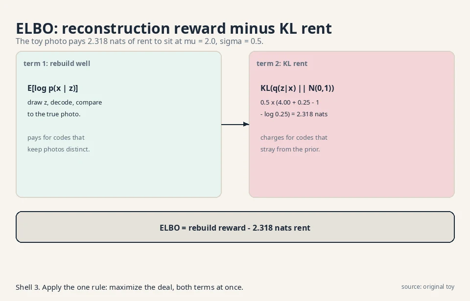
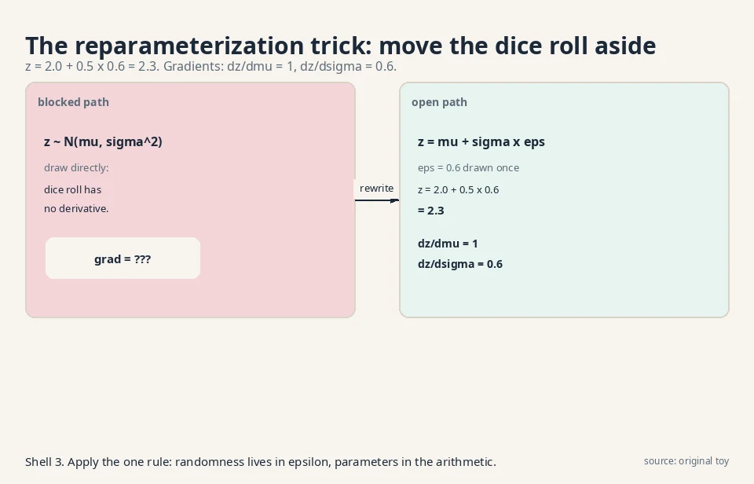
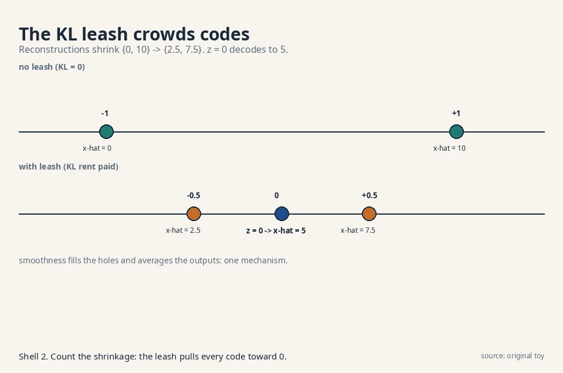
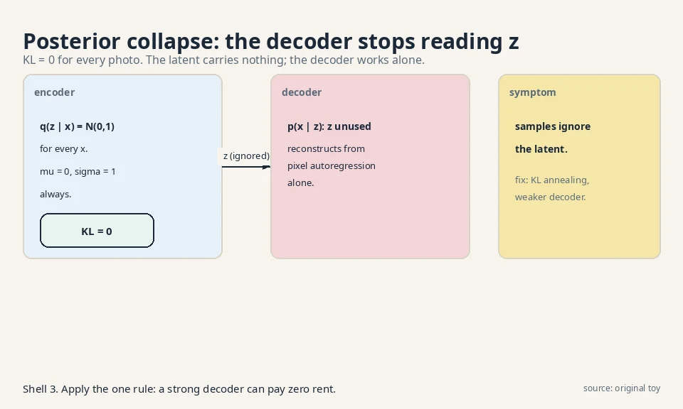
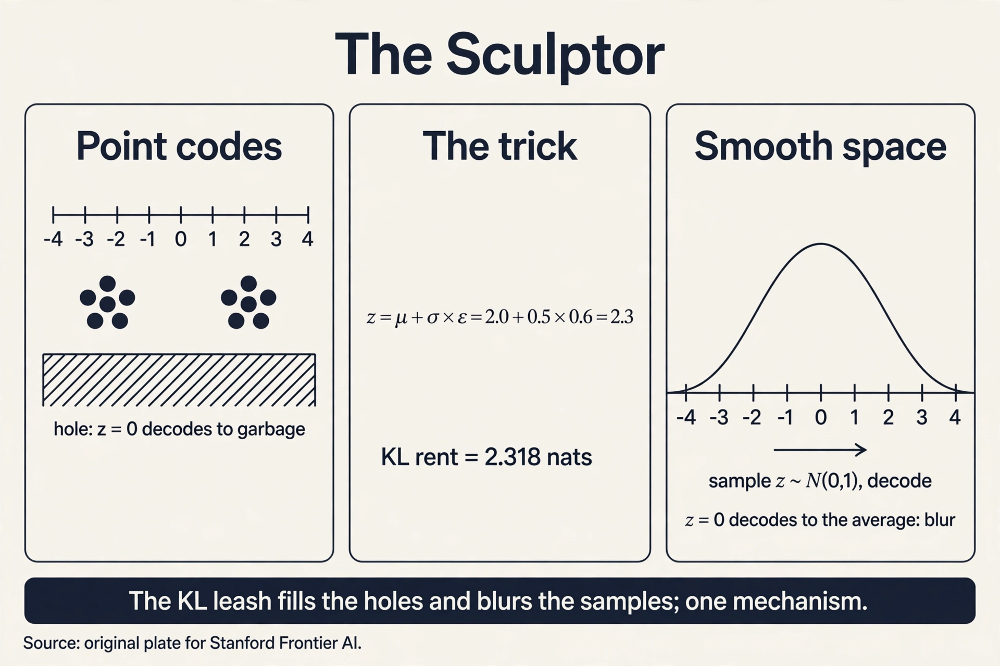

## The question, for hidden causes

Restate the one question: learn the rule behind samples, draw
fresh samples from it. The sculptor's answer: assume every outcome
has a hidden cause. A face photo is caused by hidden settings:
pose, lighting, age. Learn two maps. An **encoder** guesses the
settings from a photo. A **decoder** rebuilds a photo from
settings. To sample, draw random settings and run the decoder.
The hidden settings are **latent variables**: variables the model
invents, never seen in the data.

## First attempt: points in latent space

The naive sculptor trains an encoder and a decoder to reconstruct.
The encoder maps each photo to one point z (a short vector of
numbers). The decoder maps z back to a photo. The loss is
reconstruction error: how far the rebuilt photo is from the
original.

Watch it on a toy. Four training photos become four codes:

```ascii
photo A -> z = -3.1     photo B -> z = -2.9
photo C -> z = +2.9     photo D -> z = +3.1
```

Reconstruction works: feed -3.1 in, photo A comes out. Now try to
sample. Which z should you draw? The model learned no rule over
z. It learned four points. Draw z = 0, the midpoint. The decoder
never trained there. It outputs a smeared double image, half A and
half C. The latent space has holes: regions where the decoder was
never taught and produces garbage.

Two failures, both demonstrated. First, the holes: codes cluster
at -3 and +3, and z = 0 decodes to nonsense. Second, no sampling
rule: "draw a random z" is undefined because no distribution over
z was ever learned. The machine reconstructs but cannot create.

## The key question

What if the encoder output a distribution over codes instead of a
point, and every code distribution was pulled toward one shared,
simple prior?

## The new idea: distributions, not points

The variational autoencoder changes two things. First, the
encoder outputs the parameters of a distribution: a mean vector
mu and a spread vector sigma. For one photo, the code is not z =
2.0 but "z drawn from a bell curve centered at 2.0 with width
0.5." Second, a penalty pulls every photo's code distribution
toward one shared prior: the standard bell curve N(0,1), centered
at 0 with width 1. Now z = 0 is populated by construction, the
holes fill in, and the prior is the sampling rule: draw z from
N(0,1), run the decoder.

The training objective is the **ELBO**, the evidence lower bound.
It lower-bounds the true log-probability of a photo, and it has
two terms:

```ascii
ELBO = E[log p(x | z)]  -  KL(q(z | x) || p(z))
       ^^^^^^^^^^^^^^^     ^^^^^^^^^^^^^^^^^^^^
       reconstruction:     KL penalty:
       rebuild x well      keep codes near the prior
       from the drawn z    N(0,1)
```



Read it as a deal. The first term pays for good reconstructions.
The second term charges rent for code distributions that stray
from the prior. Maximizing the ELBO is maximizing a guaranteed
lower bound on log p(x). (The sibling course, math-genai L04,
derives this bound from Jensen's inequality. Here we use it.)

### Subchapter: the ELBO in one Jensen step

Where does the bound come from? Start from the true
log-probability, which integrates over all codes:

```ascii
log p(x) = log E_q[ p(x, z) / q(z | x) ]
```

The expectation is over the encoder's distribution q. Now apply
**Jensen's inequality**: the log of an average is at least the
average of the log, because log curves downward. Push the log
inside:

```ascii
log p(x) >= E_q[ log p(x, z) - log q(z | x) ] = ELBO
```

One inequality, and the intractable integral becomes a tractable
expectation the model can estimate with samples of z. Split
p(x, z) = p(x | z) p(z) and the two ELBO terms appear:
reconstruction plus the KL rent. The gap between log p(x) and the
ELBO is exactly the encoder's error: a perfect encoder
(q = the true posterior) would close it. Every VAE maximizes a
guarantee, and the guarantee's looseness is the encoder's fault.

The KL term has a closed form for bell curves, so it can be
computed by hand. For q = N(mu, sigma^2) against p = N(0,1):

```ascii
KL = 0.5 x (mu^2 + sigma^2 - 1 - log(sigma^2))
```

Work it for the toy photo with mu = 2.0, sigma = 0.5:

```ascii
KL = 0.5 x (4.00 + 0.25 - 1 - log(0.25))
   = 0.5 x (3.25 + 1.386)
   = 2.318 nats
```

The encoder pays 2.318 nats of rent to place this photo's code at
mu = 2.0 with width 0.5. A photo coded at mu = 0, sigma = 1 pays
zero rent: it already matches the prior. The KL term is a leash.
The reconstruction term pulls codes apart so photos stay
distinguishable. The leash pulls them back to the origin. Every
VAE lives in this tension.

### Subchapter: why diagonal Gaussians

The encoder outputs mu and sigma, not a full covariance matrix.
Three reasons, each practical. First, the reparameterization
trick needs a **location-scale** family: z = location + scale x
noise. Diagonal Gaussians are the simplest such family. Second,
a full covariance on a d-dimensional latent needs d^2 numbers.
Diagonal needs 2d. At d = 512, that is 262,144 vs 1,024. Third,
the KL to N(0,1) has the closed form used above only because
both are diagonal. A full-covariance KL needs a matrix log
determinant: the O(d^3) bill from L04, returned.

The price of diagonal: the encoder cannot model correlations
between latent axes. Axis 3 cannot say "when I am high, axis 7
is low." The decoder must absorb all the correlation structure.
In practice the decoder is a deep network and manages. The
decision rule: diagonal Gaussians are the default. Reach for
fuller posteriors (normalizing-flow posteriors, ironically) only
when the decoder is too weak to carry the correlations.

## The reparameterization trick, by hand

One problem remains. Training needs gradients through the random
draw z. But "draw a random number" has no derivative. You cannot
backpropagate through a dice roll.

The trick moves the randomness aside. Instead of drawing z
directly from N(mu, sigma^2), draw epsilon from N(0,1) and set:

```ascii
z = mu + sigma x epsilon
```



Watch it with the toy numbers. mu = 2.0, sigma = 0.5, and the
drawn epsilon = 0.6:

```ascii
z = 2.0 + 0.5 x 0.6 = 2.3
```

The draw still comes from the right distribution: shifting and
scaling a standard bell curve by mu and sigma gives N(mu,
sigma^2). But now the randomness lives in epsilon, which has no
parameters, and z is a plain arithmetic expression in mu and
sigma. Gradients flow:

```ascii
dz/dmu   = 1
dz/dsigma = epsilon = 0.6
```

Nudge mu up by 0.01 and z rises by 0.01. Nudge sigma up by 0.01
and z rises by 0.006. The dice roll became differentiable by
moving it out of the parameter path. That is the whole trick,
and it is why VAEs train with ordinary backpropagation.

## The sampling machine

Sampling is now one line. Draw z from the prior N(0,1). Run the
decoder. Watch it on a toy decoder, x = 3z + 1:

```ascii
draw z = 0.7   ->   x = 3 x 0.7 + 1 = 3.1
draw z = -1.2  ->   x = 3 x -1.2 + 1 = -2.6
```

Fresh z values, never seen in training, produce fresh outputs.
The holes are gone because the KL leash forced training codes to
cover the prior's territory. The sampling rule exists because the
prior is fixed and simple.

<div class="video-block"><div class="video-wrap"><iframe src="https://www.youtube-nocookie.com/embed/_LgMWM-Ok-c" title="Understanding and Visualising the Mathematics Behind Generative AI: VAEs" allow="accelerometer; autoplay; clipboard-write; encrypted-media; gyroscope; picture-in-picture" allowfullscreen loading="lazy" referrerpolicy="strict-origin-when-cross-origin"></iframe></div><p class="video-cap">Explainer: Mathematics of Machines, the mathematics behind VAEs. Latent variables, the reparameterization trick, KL divergence, and the ELBO derived, not just stated. Watch after the reparameterization section.</p></div>

## Mapping back: what each property fixes

| Point-code failure | VAE answer | How |
|---|---|---|
| Latent holes: z = 0 decodes to garbage | KL leash toward N(0,1) | Every code distribution overlaps the prior's territory. No region is untrained |
| No sampling rule over z | Fixed prior N(0,1) | Sample z from the prior, decode. The rule was chosen, not learned |
| Dice roll blocks gradients | z = mu + sigma x epsilon | Randomness moves to parameter-free epsilon. dz/dmu = 1, dz/dsigma = epsilon |

## The honest price: blur, demonstrated

The leash that fills the holes also blurs the samples. Work it on
the toy. Two training photos: x = 0 and x = 10. The decoder is the
smooth map x-hat = 5z + 5. To reconstruct perfectly, photo 0
needs code z = -1 and photo 10 needs z = +1. But the KL leash
charges rent for codes away from 0: KL(N(1,1) || N(0,1)) = 0.5
nats each way, and the model also pays for spread.

Suppose the leash wins partway and the codes settle at mu = -0.5
and mu = +0.5. The reconstructions become x-hat = 2.5 and x-hat
= 7.5: each photo pulled 2.5 units toward the middle. Now sample
z = 0, the most likely draw under the prior. The decoder outputs
x-hat = 5, the average of the two photos. It matches neither
training photo. It is a blurry compromise.



This is the VAE signature: smooth latent space, blurry samples.
The same smoothness that lets z = 0 decode to something sane
forces it to decode to an average. Sharpness would need the
decoder to jump discontinuously between neighbors, which the
KL-smoothed space forbids.

A second, quieter price: the ELBO is a bound, not the true
likelihood. The gap between log p(x) and the ELBO equals the
error of the encoder's approximation. The model maximizes a
guarantee, and the guarantee can be loose.

### Subchapter: posterior collapse, demonstrated

Give the decoder too much power and the latent dies. Suppose the
decoder is autoregressive over pixels: it can model every pixel
from the previous pixels alone. Then the best deal is to set
q(z|x) = N(0,1) for every photo. KL rent: exactly 0. The decoder
reconstructs everything and never reads z.



Watch the ELBO accept this. Reconstruction is perfect (the strong
decoder needs no help), KL is 0, so the ELBO is maximal. The
model found a loophole: the bound does not require the latent to
be useful. Samples from the prior decode to generic outputs that
ignore z entirely. This is **posterior collapse**: the
approximate posterior collapses onto the prior.

The fixes attack the loophole. **KL annealing**: start the KL
weight at 0 and raise it slowly, so the latent gets useful before
the rent arrives. **Weaker decoders**: deny the decoder
autoregression so it must read z. **Minimum KL budgets**: force
each latent axis to pay at least some rent (keep at least 0.5
nats per axis, say). The decision rule: if your latent
interpolations do nothing, check the KL per axis first. Zeros
mean collapse, not a bad prior.

### Subchapter: beta-VAE: the blur knob

The ELBO weights reconstruction and KL equally. **beta-VAE**
(Higgins et al., 2017) adds a knob: ELBO = E[log p(x|z)] -
beta x KL. Beta = 1 is the standard VAE. Beta < 1 loosens the
leash: codes drift outward, reconstructions sharpen, holes creep
back. Beta > 1 tightens it: codes crowd the origin, samples blur
further, but the latent axes disentangle (each axis tends to own
one factor of variation, since crowding punishes redundancy).

On the toy: beta = 0.1 cuts the rent at mu = 2.0, sigma = 0.5
from 2.318 to 0.232 nats. The codes settle near -0.9 and +0.9
instead of -0.5 and +0.5. Reconstructions: x-hat = 0.5 and 9.5,
nearly perfect. The price: z = 0.7 now sits between sparser
territory, and prior samples degrade. The knob trades sharpness
for hole-filling, continuously. There is no free setting.

### Subchapter: VQ-VAE: the discrete turn

What if the latent is discrete? **VQ-VAE** (van den Oord et al.,
2017) keeps a codebook of K vectors. The encoder outputs a
continuous vector, which is replaced by its nearest codebook
neighbor. The decoder sees only codebook entries. Gradients flow
through the quantization via the **straight-through estimator**:
copy the decoder's gradient to the encoder as if the
quantization were the identity.

The numbers: a 256x256 image becomes a 32x32 grid of codes from
a codebook of 8,192 entries. Each code costs log2(8192) = 13
bits. The latent is 1,024 x 13 bits = 13,312 bits, against
256x256x3x8 = 1,572,864 bits of pixels: 118x compression into
discrete tokens. Those tokens are exactly what DALL-E 1's
storyteller predicts autoregressively. VQ-VAE turned the
sculptor's continuous latent into the storyteller's vocabulary.

No KL rent here: the prior over codes is learned (a small
autoregressive model over the code grid), not fixed to N(0,1).
The holes problem is dodged differently: every code is a
codebook entry by construction, so every latent decodes to
something the decoder trained on. Posterior collapse cannot
happen either: the decoder gets nothing but the codes.

## What is used where: the sculptor in production

| System | How it uses the sculptor | Evidence |
|---|---|---|
| Stable Diffusion 1/2 | A KL-regularized VAE compresses 512x512x3 to 64x64x4 before diffusion runs | Public: Rombach et al., 2022, arxiv 2112.10752 |
| DALL-E 1 | A discrete VAE (dVAE) compresses images to tokens. A transformer predicts the tokens | Public: Ramesh et al., 2021 |
| VQGAN | VQ-VAE plus adversarial loss for high-quality image tokens | Public research: Esser et al., 2021 |
| VITS | Conditional VAE with flow-based priors for end-to-end text-to-speech | Public: Kim et al., 2021, arxiv 2106.06103 |
| beta-VAE | Disentangled representation learning in research | Public research: Higgins et al., 2017, arxiv 1606.05579 |

The pattern: pure VAEs rarely ship as the final generator (the
blur price). They ship as the **compressor**: the VAE builds the
latent room, and a restorer (diffusion) or storyteller
(transformer) dreams inside it.

## Tying to CS229 L10: the amortized E-step

CS229 L10 teaches EM for mixtures: alternate between guessing
hidden assignments (E-step) and fitting parameters (M-step). The
E-step is an optimization run per datapoint per iteration. For two
clusters with means 0 and 5 and a datapoint x = 4, the E-step
computes responsibilities:

```ascii
p(x=4 | cluster 1) ~ N(4; 0, 1) = 0.00013
p(x=4 | cluster 2) ~ N(4; 5, 1) = 0.242
responsibility of cluster 2 = 0.242 / (0.242 + 0.00013) = 0.9995
```

EM recomputes numbers like 0.9995 for every datapoint on every
iteration: 1M datapoints x 100 iterations = 100M E-steps. The
VAE's encoder is an **amortized** E-step: one network that guesses
q(z|x) in a single forward pass, for all x, with no per-datapoint
loop. The cost of inference is amortized (spread) across the
dataset into the encoder's weights. Same job as the E-step,
opposite schedule: EM optimizes per point at training time, the
VAE learns one guesser upfront.

> [!QA]
> Q: What does the reparameterization trick actually do?
> A: It makes the random draw differentiable by moving randomness out of the parameter path. Instead of sampling z from N(mu, sigma^2) directly, draw epsilon from N(0,1) and set z = mu + sigma x epsilon. With mu = 2.0, sigma = 0.5, epsilon = 0.6, z = 2.3, and gradients exist: dz/dmu = 1, dz/dsigma = 0.6. Backpropagation flows through mu and sigma while epsilon carries the dice roll.
> Follow-up: Why not just use a score-function estimator like REINFORCE instead?
> A: You can, but its gradient estimates have high variance: they depend on the sampled z multiplied by the loss, which swings wildly. The reparameterization gradient uses the pathwise derivative dz/dmu = 1, which is exact for the drawn epsilon and far less noisy. Lower variance means stable training with fewer samples per step.

> [!QA]
> Q: What are the two terms of the ELBO, and what does each cost?
> A: E[log p(x|z)] rewards faithful reconstruction from the drawn code. KL(q(z|x) || p(z)) charges rent for code distributions that stray from the prior N(0,1). On the toy, coding a photo at mu = 2.0, sigma = 0.5 costs 2.318 nats of KL rent. The model maximizes the sum, so it balances distinguishable codes against cheap ones.
> Follow-up: Why is the ELBO a lower bound and not the true likelihood?
> A: The true log p(x) requires integrating over all z, which is intractable. The ELBO replaces the true posterior p(z|x) with the encoder's approximation q(z|x), and Jensen's inequality turns the approximation into a guaranteed lower bound. The gap between the bound and the truth is exactly the encoder's error: a perfect encoder would close it. The sibling course (math-genai) carries the full derivation.

> [!QA]
> Q: Why are VAE samples blurry?
> A: The KL leash pulls all codes toward the prior, so the decoder must map a smooth, crowded latent space to distinct photos. On the toy, codes settle at mu = -0.5 and +0.5 instead of -1 and +1, reconstructions shrink from {0, 10} to {2.5, 7.5}, and the most likely sample z = 0 decodes to 5, the average of both photos. Smoothness fills the holes and averages the outputs. The two are the same mechanism.
> Follow-up: Can you fix the blur by weakening the KL term?
> A: That is the beta-VAE knob: scale the KL term by beta < 1. Reconstructions sharpen as the leash loosens, but the holes return: codes drift apart, unsampled regions reappear, and prior samples degrade. The tradeoff is intrinsic, not a bug. [uncertain]: whether the lecture covers beta-VAE. The knob follows directly from the ELBO form.

> [!QA]
> Q: Walk me through computing the ELBO for the toy photo.
> A: Photo x, encoder outputs mu = 2.0, sigma = 0.5. Step 1: draw epsilon = 0.6, form z = 2.0 + 0.5 x 0.6 = 2.3. Step 2: decode z to x-hat, score log p(x|z): say the reconstruction log-prob is -1.2 nats. Step 3: compute the KL rent in closed form: 0.5 x (4.00 + 0.25 - 1 - log 0.25) = 2.318 nats. ELBO = -1.2 - 2.318 = -3.518 nats. Training maximizes this over all photos: better reconstructions raise it, cheaper codes raise it.
> Follow-up: Why estimate the reconstruction term with a single z sample?
> A: Because the expectation over q(z|x) is intractable in closed form for a neural decoder. One sample per photo per step is noisy but unbiased, and averaging over many steps and photos washes the noise out. The reparameterization trick is what makes that single sample's gradient usable.

> [!QA]
> Q: What is posterior collapse, and how do you detect it?
> A: The decoder learns to reconstruct without reading z, and the encoder gives up: q(z|x) = N(0,1) for every x, KL = 0 everywhere. The ELBO accepts this because reconstruction is perfect and rent is zero. Detection: check the KL per latent axis. Axes at ~0 nats are dead. Also test latent interpolations: if sweeping z changes nothing in the output, the latent is decorative.
> Follow-up: Applied: your VAE's samples ignore the latent. Name two fixes and their costs.
> A: KL annealing: ramp the KL weight from 0 upward so the latent gets useful before rent arrives. It costs tuning the schedule. Weaker decoder: remove autoregression so the decoder must read z. It costs some reconstruction quality. Both attack the loophole directly: make ignoring z expensive or impossible.

> [!QA]
> Q: VQ-VAE vs VAE: when does discrete win?
> A: VQ-VAE replaces the Gaussian latent with a codebook of discrete entries and nearest-neighbor quantization. It wins when a downstream model wants tokens: DALL-E 1's transformer predicts codebook indices autoregressively, which needs discrete symbols. It also dodges posterior collapse structurally (the decoder sees only codes) and the holes problem (every latent is a trained codebook entry). It loses the smooth interpolation that makes Gaussian VAEs good for editing faces along continuous axes.
> Follow-up: Why does VQ-VAE need the straight-through estimator?
> A: Nearest-neighbor lookup has no derivative: tiny encoder changes do not change the chosen code until they cross a boundary. The straight-through estimator copies the decoder's gradient straight to the encoder, pretending the quantization was the identity. It is biased but works, and the codebook itself learns via a separate dictionary loss.

> [!QA]
> Q: Applied: design the latent space for a face generator. Continuous VAE or VQ-VAE?
> A: Depends on the downstream job. For editing (slide "smile" from 0 to 1), pick the continuous VAE: smooth axes give smooth edits, and beta > 1 disentangles the axes. For generation quality at scale, pick VQ-VAE plus a transformer prior: discrete tokens let the storyteller model the prior sharply, which is the DALL-E 1 recipe. The interview signal: name the tradeoff (smoothness and editability vs sharpness and token modeling), then match it to the product.
> Follow-up: Where does the KL rent show up in your design?
> A: In the continuous VAE, as the blur-vs-holes knob (beta). In VQ-VAE, nowhere: there is no KL to a fixed prior. The prior is a learned autoregressive model over codes, trained separately. That separation is VQ-VAE's architectural point.



## Recap: the whole lesson on one screen

1. **The question, for hidden causes.** Learn the rule. Draw fresh samples. Assume hidden settings cause each outcome.
2. **First attempt: point codes.** Encoder maps photos to points (-3.1, -2.9, +2.9, +3.1). Reconstruction works.
3. **Holes, demonstrated.** z = 0 was never trained. The decoder outputs a smeared double image. No distribution over z was learned, so sampling is undefined.
4. **The key question.** What if the encoder output a distribution over codes, all pulled toward one shared prior?
5. **The ELBO.** Reconstruction reward minus KL rent. One Jensen step turns the intractable integral into a bound. Toy KL at mu = 2.0, sigma = 0.5: 2.318 nats. Diagonal Gaussians keep it cheap.
6. **The trick, by hand.** z = 2.0 + 0.5 x 0.6 = 2.3. dz/dmu = 1, dz/dsigma = 0.6. The dice roll is differentiable.
7. **Sampling.** Draw z ~ N(0,1), decode: z = 0.7 -> x = 3.1. Holes gone, rule exists.
8. **The price: blur.** Codes shrink toward 0, reconstructions shrink {0,10} -> {2.5,7.5}, and z = 0 decodes to the average, 5. Plus the ELBO gap: a bound, not the likelihood.
9. **Failure modes.** Posterior collapse: KL = 0, the decoder ignores z. Fixes: KL annealing, weaker decoders. beta-VAE: the blur knob, beta < 1 sharpens, holes return.
10. **The discrete turn.** VQ-VAE: codebook, nearest neighbor, straight-through gradients. 8,192 codes, 13 bits each, 118x compression. The sculptor becomes the storyteller's tokenizer.
11. **In production.** VAEs ship as compressors: Stable Diffusion's VAE, DALL-E 1's dVAE, VITS speech. The restorer or storyteller dreams inside.

## Official sources and further reading

**Official:**
- W5L20: VAE (video RN3_gkjlYoA) and W6L21: VAE reparameterization (video blh_AnhwIpw): the lectures this chapter follows. [uncertain]: the exact toy numbers in the lectures are not verified. The worked values here are original toys built to the lectures' topics.
- Kingma & Welling, Auto-Encoding Variational Bayes (2013): https://arxiv.org/abs/1312.6114 (the original VAE paper).

**Further reading:**
- math-genai (sibling) ELBO lesson: the full Jensen derivation this chapter uses as a result.
- CS229 L10: EM and mixture models: the E-step this chapter's encoder amortizes.
- Higgins et al., beta-VAE (2017): https://arxiv.org/abs/1606.05579 (the blur knob).
- van den Oord et al., VQ-VAE (2017): https://arxiv.org/abs/1711.00937 (the discrete turn).

**Caveats from these sources.** The 1-D Gaussian toys are illustrative. Real VAEs use high-dimensional diagonal Gaussians and deep encoder/decoder networks. The blur analysis assumes a smooth decoder. Architectural choices (autoregressive decoders, hierarchical latents) change the sharpness tradeoff.

## Connections to the other courses

- **CS229 L10:** EM: the E-step the VAE encoder amortizes. Same hidden-variable job, opposite schedule.
- **math-genai (sibling):** the ELBO derivation via Jensen, and latent variable models as a family.
- **CS229S L02:** the transformer as a possible VAE decoder: autoregressive decoders sharpen samples by modeling pixel dependencies the smooth latent cannot.
- **CS336:** latent-space structure in large models. The KL tension reappears wherever a prior regularizes learned representations.
- **L05 (this course):** latent diffusion: the restorer dreams inside the sculptor's latent room.
