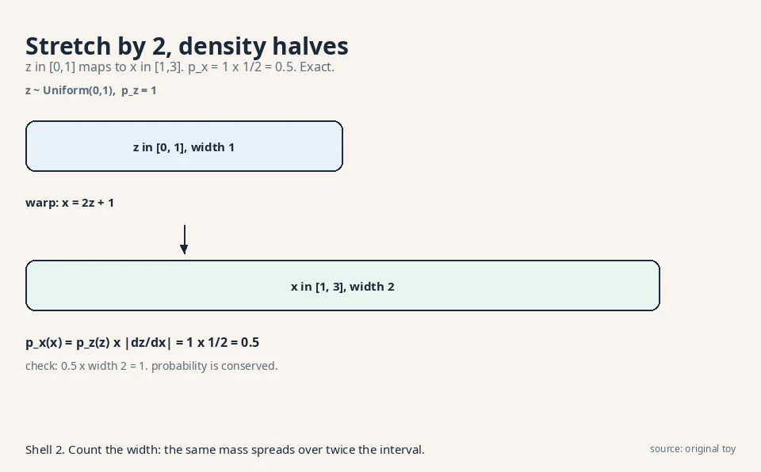
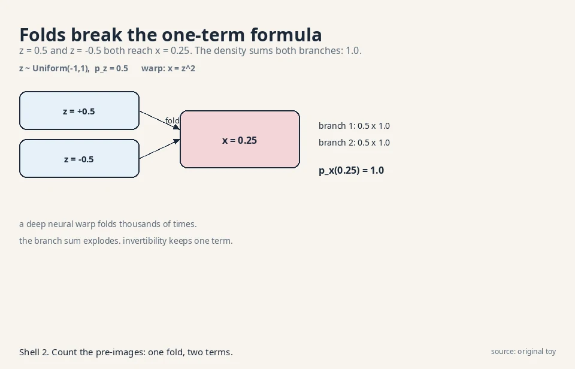
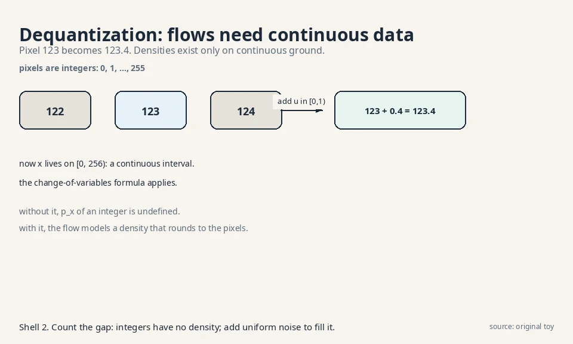
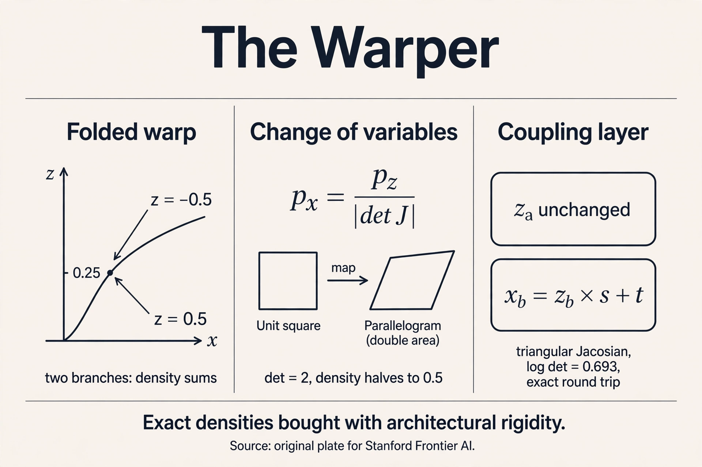

## The question, for warps

Restate the one question: learn the rule behind samples, draw
fresh samples from it. The warper's answer: start with simple
noise, say uniform numbers. Learn a warping function that bends
the noise into data. The warp must be **invertible**: every noise
point maps to exactly one data point and back. Because the warp
is invertible, the machine computes exact probabilities through
the change-of-variables formula. No lower bound. No
approximation. Exact density is the warper's prize.

## First attempt: bend noise, then count

Take the simplest warp. Noise z is uniform on [0,1]: p_z(z) = 1.
The warp stretches and shifts: x = 2z + 1. So z = 0 becomes x =
1, z = 1 becomes x = 3. The outputs fill [1,3].

What is the density of x? Probabilities are conserved: the chance
that x lands in a small interval equals the chance that z lands in
the corresponding pre-interval.

```ascii
z:  |--dz--|                    p_z = 1
         | warp: x = 2z + 1
         v
x:  |----dx----|                dx = 2 dz
```

A dz-wide slice of z maps to a dx-wide slice of x, with dx = 2
dz. The same probability mass spreads over twice the width, so the
density halves:

```ascii
p_x(x) dx = p_z(z) dz
p_x(x) = p_z(z) x |dz/dx| = 1 x 1/2 = 0.5,  for x in [1,3]
```

Check: the density 0.5 over a width-2 interval integrates to 1.
The formula p_x(x) = p_z(z) |dz/dx| is the **change of variables**:
density transforms by the inverse slope. Stretch by 2, density
halves. This is exact, not a bound.



## Where general warps break, part 1: folds

The formula assumed one z per x. Drop that and watch it break.
Take z uniform on [-1,1], so p_z = 0.5, and the warp x = z^2.
Now z = 0.5 and z = -0.5 both give x = 0.25. The warp folds.

Each branch contributes its own term. Near x = 0.25:

```ascii
branch 1: z = +sqrt(x),  |dz/dx| = 1/(2 sqrt(x)) = 1.0
branch 2: z = -sqrt(x),  |dz/dx| = 1/(2 sqrt(x)) = 1.0

p_x(0.25) = 0.5 x 1.0 + 0.5 x 1.0 = 1.0
```

Check: p_x(x) = 0.5/sqrt(x) on [0,1] integrates to
[sqrt(x)]_0^1 = 1. The math works, but the price is visible: the
density is a sum over pre-images, one term per fold. A deep neural
warp folds thousands of times. The branch count explodes, and the
exact formula becomes unusable. Invertibility is not a luxury. It
is what keeps the density to a single term.



## Where general warps break, part 2: the determinant bill

Move to 2-D. A warp maps (z1, z2) to (x1, x2). The slope becomes
a matrix, the **Jacobian**: J[i,j] = dx_i/dz_j. The density
formula uses its determinant, which measures volume change:

```ascii
p_x(x) = p_z(z) / |det J|
```

Work a toy. Warp: x1 = 2 z1, x2 = z1 + z2. The Jacobian:

```ascii
J = [ dx1/dz1  dx1/dz2 ]   =   [ 2  0 ]
    [ dx2/dz1  dx2/dz2 ]       [ 1  1 ]

det J = 2 x 1 - 0 x 1 = 2
```

The unit square (area 1) warps to a parallelogram of area 2, so
density halves: p_x = 1/2 = 0.5 with p_z = 1. The determinant is
the 2-D version of the stretch factor.

Now the bill. A general d x d determinant costs O(d^3)
operations. For d = 1,000 (a tiny image patch), that is 10^9
multiply-adds per density evaluation, versus one forward pass of
the network. Exact density through a free-form neural warp is
exact but unaffordable. The warper needs warps whose determinants
cost almost nothing.

## The key question

What if the warp is invertible by construction, with a Jacobian
whose determinant reads off in O(d) time?

## The new idea: coupling layers

Split the variables into two halves. Transform one half with a
function of the other half, and leave the other half untouched.
This is a **coupling layer** (Dinh et al., 2014, the design the
Papamakarios review systematizes):

```ascii
forward:   x_a = z_a
           x_b = z_b x s(z_a) + t(z_a)

inverse:   z_a = x_a
           z_b = (x_b - t(x_a)) / s(x_a)
```

s and t are small neural networks (scale and shift). The inverse
is free: x_a recovers z_a directly, then z_b follows by
arithmetic. No iteration, no solving.

The Jacobian is triangular, because x_a does not depend on z_b:

```ascii
J = [ I    0        ]
    [ *    diag(s)  ]

det J = product of s(z_a) entries
```

A triangular determinant is the product of its diagonal: O(d)
operations. Watch it on numbers. z = [0.5, 1.0], s(z_a) = 2,
t(z_a) = 1:

```ascii
forward:  x_a = 0.5,  x_b = 1.0 x 2 + 1 = 3.0
inverse:  z_a = 0.5,  z_b = (3.0 - 1) / 2 = 1.0   (round trip works)
log det J = log 2 = 0.693
p_x([0.5, 3.0]) = p_z([0.5, 1.0]) / 2
```

. Project: Stanford Frontier AI.")

Sampling runs the warp forward: draw z from a standard bell
curve, apply the layers, get x. Density runs it backward: map x
to z, evaluate p_z(z), divide by the determinant. Both directions
are exact. Stack many coupling layers, alternating which half
gets transformed, and the warp gains expressivity while every
layer stays invertible with a cheap determinant.

### Subchapter: autoregressive flows: triangular by ordering

Coupling is not the only triangular design. **Autoregressive
flows** order the variables and let each one depend only on the
earlier ones:

```ascii
x_i = z_i x s(x_1..x_{i-1}) + t(x_1..x_{i-1})
```

The Jacobian is triangular by construction: x_i never sees
z_j for j > i. Same O(d) determinant. But the direction of speed
flips. **MAF** (masked autoregressive flow) evaluates densities
fast (one parallel pass gives all s, t) and samples slowly (x_1
first, then x_2, serial: the storyteller's bill). **IAF**
(inverse autoregressive flow) is the mirror: sampling is fast,
density evaluation is serial.

This is the same tradeoff as L02, wearing flow clothes. The
decision rule: pick MAF when you score data (anomaly detection:
fast p(x) per point), IAF when you generate (fast sampling).
RealNVP's coupling layers sit in the middle: both directions
fast, less expressive per layer. The Papamakarios review maps the
whole family. The determinant bill decides every entry.

### Subchapter: Glow: 1x1 convolutions and ActNorm

Coupling layers freeze half the channels per layer. **Glow**
(Kingma and Dhariwal, 2018) adds two invertible ingredients so
every channel mixes. An **invertible 1x1 convolution** is a
learned matrix W applied at every pixel across channels:
x = W z per pixel. Its log determinant is h x w x log|det W|:
one small matrix determinant, broadcast over the image. An
**ActNorm** layer is per-channel scale and shift, initialized so
the first batch has zero mean and unit variance, then trained
freely: its log determinant is the sum of log scales.

Work the numbers on a 32x32 image with 64 channels. The 1x1
convolution's determinant is a 64x64 matrix determinant: O(64^3)
= 262,144 ops, computed once per layer, not per pixel. The
broadcast multiplies by 1,024 pixels for the log-det sum: still
O(d). Glow stacks actnorm, 1x1 conv, and coupling into one
"flow step" and repeats it dozens of times. The result generated
256x256 faces that rivaled GANs in 2018, with exact likelihoods
attached. [uncertain]: whether the lecture covers Glow. It is
included as the canonical image-flow architecture from the
cited papers.

### Subchapter: dequantization: flows need continuous data

Pixels are integers: 0, 1, ..., 255. The change-of-variables
formula needs continuous densities. An integer has no density.
The fix is **dequantization**: add uniform noise u in [0,1) to
each pixel. Pixel 123 becomes 123.4, living on the continuous
interval [0, 256).



Why uniform and not Gaussian? Uniform noise on [0,1) keeps the
model honest: the dequantized density, rounded back down,
reproduces a valid distribution over the original integers.
Gaussian noise would smear across pixel boundaries. The
decision rule: always dequantize discrete data before a flow,
and report likelihoods in **bits per dimension** (bpd) on the
dequantized scale so models compare fairly. Bits per dimension is
the average surprise per pixel per channel: minus log2 p(x),
divided by the number of dimensions. Lower is better. Skip this
step and the "exact
likelihood" is exact for the wrong object.

### Subchapter: continuous flows: layers become an ODE

Stack infinitely many infinitesimal coupling layers and the warp
becomes a differential equation: dx/dt = f_theta(x, t), from
t = 0 (noise) to t = 1 (data). This is a **neural ODE**
(FFJORD: Grathwohl et al., 2018): the network f_theta is the
velocity field, and integrating it moves noise to data.

### Subchapter: the trace replaces the determinant

The log determinant becomes an integral of the **trace** of the
Jacobian:

```ascii
log p(x_1) = log p(x_0) - integral_0^1 Tr(d f / d x) dt
```

The trace is the sum of the diagonal entries: how much the
velocity field stretches each coordinate, added up. The integral
accumulates that stretch along the path. No determinant, no
triangular restriction: any f_theta works.

### Subchapter: Hutchinson's estimator: the trace on a budget

The trace still needs the Jacobian's diagonal. **Hutchinson's
estimator** approximates the trace with random probes: average
z^T J z over random vectors z, and the average converges to the
trace. One backward pass per probe, O(d) work, no O(d^3)
determinant anywhere.

Sampling solves the ODE forward. Density solves it backward.
The price moves: no architectural constraints at all (f can be
any network), but every evaluation solves an ODE numerically,
tens to hundreds of function evaluations per density. The
discrete flows pay in rigidity. The continuous flow pays in
compute. This ODE view is also the bridge to L06: flow matching
trains the same velocity field without solving the ODE.

<div class="video-block"><div class="video-wrap"><iframe src="https://www.youtube-nocookie.com/embed/YPsIq_f_ihQ" title="Normalizing Flow (NFs) Generative AI Models Simply Explained" allow="accelerometer; autoplay; clipboard-write; encrypted-media; gyroscope; picture-in-picture" allowfullscreen loading="lazy" referrerpolicy="strict-origin-when-cross-origin"></iframe></div><p class="video-cap">Explainer: Normalizing Flows Simply Explained. Reversibility, the geometry of stretching probability, Jacobian bookkeeping, coupling layers, and continuous flows. Watch after the coupling-layers section.</p></div>

## Mapping back: what each property fixes

| General-warp failure | Coupling-layer answer | How |
|---|---|---|
| Folds: density sums over exploding branches | Invertible by construction | One z per x, always. The inverse is arithmetic |
| Determinant costs O(d^3): 10^9 ops at d = 1,000 | Triangular Jacobian | det = product of diagonal entries, O(d) |
| No sampling rule | Fixed base distribution N(0,I) | Draw z, warp forward |
| Discrete pixels have no density | Dequantization | Add uniform noise and model the continuous relaxation |

## The honest price: rigidity, demonstrated

The coupling constraint is strict: each layer leaves half the
variables untouched. One layer cannot change z_a at all. Work it:
with z = [0.5, 1.0] and the mask above, x_a = 0.5 no matter what
s and t learn. The layer's expressive power is confined to one
half. Real flows stack dozens of layers with alternating masks
and permutations so every variable gets transformed
eventually, but the constraint never lifts: the architecture
family is a small subset of all neural maps.

Two more prices, stated plainly. First, dimension is frozen: the
warp maps R^d to R^d, so flows cannot compress to a small latent
space the way the VAE's sculptor does. A 256x256 image needs a
196,608-dimensional warp. Second, the triangular structure
biases the function class: variables transformed early never see
variables transformed late within one layer. Expressivity
studies show flows need more depth than free-form networks for
the same fit.

## What is used where: the warper in production

| System | How it uses the warper | Evidence |
|---|---|---|
| WaveGlow (NVIDIA, 2018) | Flow-based neural vocoder: mel-spectrogram to raw audio waveform | Public: Prenger et al., 2018, arxiv 1811.00002 |
| Glow | 256x256 face generation with exact likelihoods, 1x1 convolutions | Public research: Kingma and Dhariwal, 2018, arxiv 1807.03039 |
| RealNVP | The coupling-layer blueprint every later flow builds on | Public research: Dinh et al., 2016, arxiv 1605.08803 |
| FFJORD | Continuous-time flows for density estimation | Public research: Grathwohl et al., 2018, arxiv 1810.01367 |
| VITS (speech) | Flow-based priors inside the VAE latent | Public: Kim et al., 2021, arxiv 2106.06103 |

The pattern: flows ship where exact density matters more than raw
sample quality. Speech vocoders (WaveGlow), anomaly detection,
lossless compression (bits-back coding needs exact
probabilities), scientific simulators with calibrated
uncertainties. **Bits-back coding** turns a latent-variable model
into a lossless compressor: the sender's net bit cost is the
model's negative ELBO, because the receiver recovers bits from the
transmitted latents. It needs honest probabilities, which is why
flows qualify. The warper is the density instrument. The restorer
is the sample artist.

## Tying to CS336: what flows cannot use

CS336 builds the transformer block: residual stream, layer norm,
multi-head attention, MLP. Every piece is free-form. A residual
block x + f(x) is not invertible in general: two different inputs
can map to one output, which is exactly the folding failure from
the toy. So flow architectures cannot borrow the transformer
block as-is. They use restricted pieces: coupling layers,
invertible 1x1 convolutions (Glow), activation normalization with
tractable determinants. The warper's exactness is bought with
architectural discipline that the storyteller's transformer never
needs.

> [!QA]
> Q: Why must a normalizing flow be invertible?
> A: Because the density formula p_x(x) = p_z(z) / |det J| assumes exactly one pre-image z per x. The folding toy shows the alternative: with x = z^2, both z = 0.5 and z = -0.5 give x = 0.25, and the density becomes a sum over branches (0.5 x 1.0 + 0.5 x 1.0 = 1.0). A deep network folds thousands of times, so the branch sum explodes. Invertibility keeps the formula to one term.
> Follow-up: Can a flow still be universal if every layer is so restricted?
> A: In the limit of many layers, yes: coupling layers with alternating masks are universal approximators of distributions under mild conditions. In practice, depth is the price: flows stack dozens of restricted layers where a free-form network might use a few. Exactness trades against parameter efficiency, not against ultimate expressivity.

> [!QA]
> Q: What is the Jacobian determinant actually measuring?
> A: How much the warp stretches volume. In the 1-D toy, x = 2z + 1 stretches by 2, so density halves: p_x = 0.5. In the 2-D toy, det J = 2 means the unit square becomes an area-2 parallelogram, so density halves again: p_x = 0.5. Probability mass is conserved. The determinant is the exchange rate between z-volume and x-volume.
> Follow-up: Why does a triangular Jacobian make the determinant cheap?
> A: The determinant of a triangular matrix is the product of its diagonal entries: d multiplications instead of O(d^3). The coupling layer's Jacobian is triangular because x_a = z_a does not depend on z_b, so the upper-right block is zero. At d = 1,000, that is 1,000 operations versus 10^9.

> [!QA]
> Q: If flows give exact likelihoods, why did diffusion models take over image generation?
> A: Exactness is not the same as sample quality per parameter. The rigidity price bites: coupling layers leave half the variables fixed per layer, dimensions cannot shrink, and matching diffusion's sample quality takes very deep stacks. Diffusion pays a different price (1,000 sampling steps) but uses free-form denoiser architectures with no invertibility constraint, which fit image data better in practice.
> Follow-up: Where are flows still the right tool?
> A: Wherever exact density matters more than raw sample quality: anomaly detection (exact p(x) flags outliers), lossless compression (bits-back coding needs exact probabilities), and scientific simulators that need calibrated uncertainties. The warper is the density instrument. The restorer is the sample artist.

> [!QA]
> Q: Walk me through one coupling layer, forward and inverse, on the toy.
> A: z = [0.5, 1.0], s(z_a) = 2, t(z_a) = 1. Forward: x_a = z_a = 0.5 (frozen). x_b = z_b x s + t = 1.0 x 2 + 1 = 3.0. Log det = log 2 = 0.693. Density: p_x([0.5, 3.0]) = p_z([0.5, 1.0]) / 2. Inverse: z_a = x_a = 0.5, then z_b = (x_b - t) / s = (3.0 - 1) / 2 = 1.0. Round trip exact. The plate shows the triangular Jacobian behind it.
> Follow-up: What breaks if s(z_a) = 0?
> A: The inverse divides by s, so s = 0 destroys invertibility. In practice s is parameterized as exp(s-hat): always positive, never zero. The log det becomes a clean sum of s-hat values. One more quiet constraint the architecture carries.

> [!QA]
> Q: MAF vs IAF vs RealNVP: which direction is fast?
> A: MAF (masked autoregressive flow): density evaluation is fast (one parallel pass), sampling is serial (x_1, then x_2, ...). IAF (inverse autoregressive flow): sampling is fast, density evaluation is serial. RealNVP coupling: both directions are fast arithmetic, but each layer is less expressive. Pick MAF for scoring data, IAF for generating, coupling for both-at-once with more layers.
> Follow-up: Why does this mirror the storyteller's tradeoff?
> A: Because autoregression is the same idea in both: each variable depends on earlier ones. The storyteller pays serial sampling for parallel training (L02). MAF pays serial sampling for parallel density evaluation. The chain rule's bill shows up wherever ordering appears.

> [!QA]
> Q: Why does a flow need dequantization for images?
> A: Pixels are integers, and the change-of-variables formula needs continuous densities. Dequantization adds uniform noise u in [0,1) to each pixel: 123 becomes 123.4 on [0, 256). Uniform (not Gaussian) keeps the model honest: rounding the dequantized density reproduces a valid distribution over the original integers. Skip it and the "exact likelihood" is exact for the wrong object.
> Follow-up: Does dequantization change the reported likelihood?
> A: Yes, legitimately: the model now reports bits per dimension on the continuous relaxation, which upper-bounds the discrete likelihood. All flow papers report this way, so comparisons stay fair as long as everyone dequantizes identically.

> [!QA]
> Q: Applied: build an anomaly detector for factory sensor readings. Why a flow?
> A: Because you need exact p(x) per reading, and only the storyteller and the warper give it. Sensor data has no natural order, so the storyteller's chain rule is awkward. The warper's p_x(x) = p_z(z) / |det J| scores each reading in one backward pass. Train on normal readings, flag anything with log-likelihood below a threshold picked on validation data. MAF is the pick: density evaluation is its fast direction.
> Follow-up: Why not a VAE or diffusion model?
> A: Both give bounds, not exact densities. A loose bound can rank anomalies wrong: a normal point with a loose bound looks anomalous. When the decision is a threshold on probability, exactness is not a luxury.



## Recap: the whole lesson on one screen

1. **The question, for warps.** Learn the rule. Draw fresh samples. Bend noise into data with an invertible map.
2. **Change of variables, by hand.** z ~ Uniform(0,1), x = 2z + 1: p_x = 1 x 1/2 = 0.5 on [1,3]. Stretch by 2, density halves. Exact.
3. **Folds break it, demonstrated.** x = z^2 on [-1,1]: two branches give p_x(0.25) = 1.0. Branch sums explode for deep nets.
4. **The determinant bill, demonstrated.** 2-D toy det J = 2, p_x = 0.5. General d x d determinants cost O(d^3): 10^9 ops at d = 1,000.
5. **The key question.** What if the warp is invertible by construction with an O(d) determinant?
6. **Coupling layers.** x_b = z_b x s(z_a) + t(z_a), inverse by arithmetic, triangular Jacobian. Toy: [0.5, 1.0] -> [0.5, 3.0], log det = 0.693, round trip exact.
7. **The family.** MAF/IAF: triangular by ordering, one fast direction each. Glow: 1x1 convolutions and ActNorm for images. Continuous flows: the ODE view, trace instead of determinant.
8. **Dequantization.** Pixels are integers: add uniform noise, model the continuous relaxation, report bits per dimension.
9. **The price: rigidity.** Each layer freezes half the variables. Dimensions cannot shrink. The architecture family is a strict subset of free-form nets.
10. **In production.** WaveGlow speaks, anomaly detectors score, compressors count bits. Exact density is the product.

## Official sources and further reading

**Official:**
- Papamakarios et al., Normalizing Flows for Probabilistic Modeling and Inference (2021): https://arxiv.org/abs/1912.02762 (the review this chapter follows: coupling, autoregressive, and residual flow designs with their determinant costs).
- Dinh, Krueger & Bengio, NICE (2014): https://arxiv.org/abs/1410.8516 (the coupling layer origin).

**Further reading:**
- Dinh, Sohl-Dickstein & Bengio, RealNVP (2016): https://arxiv.org/abs/1605.08803 (alternating masks and multi-scale stacking).
- Kingma & Dhariwal, Glow (2018): https://arxiv.org/abs/1807.03039 (invertible 1x1 convolutions for images).
- Grathwohl et al., FFJORD (2018): https://arxiv.org/abs/1810.01367 (the continuous-time flow).

**Caveats from these sources.** [uncertain]: normalizing flows do not appear in the Prathosh playlist's topic sequence (weeks 1-12 cover GANs, VAE, DDPM, AR models, RL). This lesson is grounded in the Papamakarios review and the NICE/RealNVP papers instead. The universality claim for coupling stacks holds under smoothness conditions stated in the review, not unconditionally.

## Connections to the other courses

- **CS336:** the transformer block: free-form where flows are disciplined. The residual x + f(x) folding argument.
- **math-genai (sibling):** exact vs. approximate density: flows and autoregressive models are the only families with exact likelihoods. The ELBO lessons show what everyone else settles for.
- **CS229 L11:** the change-of-variables formula generalizes the Gaussian conditioning algebra: densities transform, parameters follow.
- **L05/L06 (this course):** continuous-time flows (neural ODEs, flow matching) reunite the warper with the restorer. The determinant bill is why diffusion won the sampling race.
