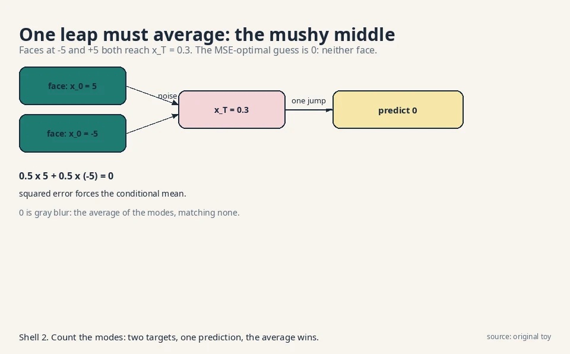

## The question, for restoration

Restate the one question: learn the rule behind samples, draw
fresh samples from it. The restorer's answer: take a photo and
corrupt it with noise, step by step, until it is pure static.
Learn the reverse: a machine that removes a little noise at each
step. To sample, start from pure static and run the reverser a
thousand times. The corruption is fixed and simple. Only the
restoration is learned.

## First attempt: one giant leap

The naive restorer skips the steps. Train one network to map pure
noise directly to a photo in a single jump. Watch it fail on a
toy. Two training "faces" live at x_0 = 5 and x_0 = -5, one
number each. Both diffuse to pure noise. Sometimes both produce
x_T = 0.3.

The network sees input 0.3 and must output one number. The true
conditional is bimodal: P(x_0 = 5 | x_T = 0.3) = 0.5 and P(x_0 =
-5 | x_T = 0.3) = 0.5. Trained with squared error, the network
outputs the conditional mean:

```ascii
prediction = 0.5 x 5 + 0.5 x (-5) = 0
```

Zero is neither face. It is gray blur. The one-step map must
invent everything at once from static, and squared error forces
it to average the possibilities. This is the same averaging trap
as the VAE's blur, wearing a new mask: whenever the target given
the input is multimodal, one point prediction becomes the mushy
middle.



## The key question

What if the corruption happens in a thousand tiny steps, so each
reverse step only has to remove a speck of noise, with a nearly
unimodal target?

## The new idea: destroy slowly, learn to un-destroy

The **forward process** is fixed destruction. Each step shrinks
the signal slightly and adds a whisper of Gaussian noise:

```ascii
x_t = sqrt(1 - beta_t) x_{t-1} + sqrt(beta_t) epsilon,  epsilon ~ N(0,1)
```

**Beta_t** is the **noise schedule**: small numbers, 10^-4 growing
to 10^-2. (The lecture writes alpha_t = 1 - beta_t, so the step
reads x_t = sqrt(alpha_t) x_{t-1} + sqrt(1 - alpha_t) epsilon.
Same step, two notations.)

Work it by hand, continuing the toy from CS229 L11. One pixel,
x_0 = 0.8, beta_1 = 0.01, drawn epsilon_1 = 0.5:

```ascii
x_1 = sqrt(0.99) x 0.8 + sqrt(0.01) x 0.5
    = 0.99499 x 0.8 + 0.1 x 0.5
    = 0.796 + 0.05 = 0.846
```

Barely changed. Step 2, with beta_2 = 0.01 and drawn epsilon_2 =
-0.4:

```ascii
x_2 = sqrt(0.99) x 0.846 + sqrt(0.01) x (-0.4)
    = 0.84177 - 0.04 = 0.80177
```

After 1,000 such steps the pixel is standard Gaussian noise,
independent of the 0.8 it started from. The signal factor after T
steps is the product of the shrinkages: with beta = 0.01 each
step, 0.99^1000 = 0.000043. The original is gone.

### Subchapter: the noise schedule: why beta grows

Beta starts at 10^-4 and grows to 2e-2 linearly (Ho et al.,
2020). Why not constant? Early steps must be gentle: the image
still has structure, and a big noise jump would destroy the
fine details the reverser needs to learn. Late steps can be
rough: the signal is nearly gone, so larger betas finish the
job. The schedule is a curriculum: whisper first, shout later.

. Project: Stanford Frontier AI.")

Read the plate: at t = 100, alpha-bar is 0.90 (90% of signal
variance remains). At t = 500, it is 0.08. At t = 1000, 4e-5:
pure noise. The **cosine schedule** (Nichol and Dhariwal, 2021)
is the popular alternative: it keeps the signal alive longer in
the middle, which helps small images where the linear schedule
destroys too fast. The decision rule: linear is the default, cosine
when your images are 64x64 or smaller. Either way, the schedule
is fixed before training: it is a hyperparameter, not learned.

The forward process needs no learning, and Gaussians compose, so
x_t can be sampled from x_0 in closed form, skipping the chain.
With alpha-bar_t = (1 - beta_1)(1 - beta_2)...(1 - beta_t):

```ascii
x_t = sqrt(alpha-bar_t) x_0 + sqrt(1 - alpha-bar_t) epsilon
```

Check against the toy at t = 2: alpha-bar_2 = 0.99^2 = 0.9801,
sqrt = 0.99, sqrt(1 - 0.9801) = 0.14107. Then x_2 = 0.99 x 0.8 +
0.14107 x epsilon = 0.792 + 0.14107 x epsilon. For x_2 =
0.80177, epsilon = 0.0693. Consistent with the two-step walk.
Training pairs at every noise level are free: take a real image,
jump to any t in one formula.

The **reverse process** is the learned part. Model
p_theta(x_{t-1} | x_t): given the noisy image and the timestep t,
predict one step cleaner. The network (usually a U-Net) predicts
the noise epsilon that was added. Training is plain regression:

```ascii
true epsilon_1 = 0.5,  predicted epsilon-hat = 0.42
loss = (0.5 - 0.42)^2 = 0.0064
```

^2 = 0.0064. Shell 2. Source: original toy. Project: Stanford Frontier AI.")

Mean squared error between true and predicted noise, averaged
over timesteps and images. The lecture's bottom line: diffusion
trains as a pile of regression problems, one per noise level,
with weights shared across levels and t as an input. No
adversary. No mode collapse games.

### Subchapter: three parameterizations: x_0, epsilon, v

The network must output something from which x_{t-1} follows.
Three choices, all algebraically equivalent:

- **Predict x_0** (the clean image). Direct, but the target's
  scale swings with t: near t = T it is a wild guess from pure
  noise.
- **Predict epsilon** (the noise). The target is always standard
  Gaussian: same scale at every timestep. Stable gradients. The
  Ho et al. default, and this lesson's choice.
- **Predict v** (velocity): v = sqrt(alpha-bar_t) epsilon -
  sqrt(1 - alpha-bar_t) x_0. Used in Imagen and video models.
  It behaves well at both ends of the schedule: near t = 0 it
  looks like epsilon prediction, near t = T like x_0 prediction.

From x_t and epsilon, x_0 is determined, since x_t =
sqrt(alpha-bar_t) x_0 + sqrt(1 - alpha-bar_t) epsilon rearranges
to x_0 = (x_t - sqrt(1 - alpha-bar_t) epsilon) /
sqrt(alpha-bar_t). Predicting the noise is predicting the clean
image in disguise, but the target epsilon is always standard
Gaussian, the same scale at every timestep. Stable targets train
stably. The decision rule: epsilon by default, v when the
schedule's ends misbehave (high-resolution images, video).

### Subchapter: the ELBO over steps, in one paragraph

DDPM is a hierarchical VAE with T latent layers (x_1 ... x_T)
and a fixed encoder. Its ELBO is a sum over timesteps of KL
terms, one per reverse step, plus a reconstruction term and a
prior term. Ho et al. simplify it aggressively: drop the
per-step weights, keep the plain MSE on epsilon. The resulting
**L_simple** is no longer a true bound, but it trains better
samples. The weighting it drops emphasized the noisiest
timesteps, which matter for likelihood but not for looks. The
decision rule this buys: train on L_simple for sample quality,
keep the full weighted ELBO when you report likelihoods. The
two objectives disagree, and L08 explains why the field mostly
stopped reporting likelihoods for diffusion models.

Sampling runs the chain backward:

```ascii
draw x_T ~ N(0,1)
for t = T down to 1:
    x_{t-1} = mu_theta(x_t, t) + sigma_t z,   z ~ N(0,1)
output x_0
```

Each step removes a speck of noise, guided by the network. The
lecture's framing: a DDPM is a hierarchical VAE with a fixed
encoder. The latents are the whole chain x_1...x_T, the encoder
is the fixed corruption (no parameters), and only the decoder
(the reverser) is learned.

### Subchapter: latent diffusion: DDPM in a VAE's basement

Diffusion on 512x512 pixels is 786,432 numbers per step. **Latent
diffusion** (Rombach et al., 2022) runs the whole DDPM inside a
VAE's latent room instead. The VAE (the sculptor from L03)
compresses 512x512x3 to 64x64x4: 16,384 numbers, 48x fewer. The
denoiser never sees full pixels. After sampling, the VAE decoder
renders the latent back to pixels.

. Project: Stanford Frontier AI.")

This is the architecture behind Stable Diffusion 1 and 2, and
the reason a 1,000-step sampler became practical: each step
costs 48x less. The VAE is trained once, frozen, and shared.
The diffusion model learns the distribution of latents, not
pixels. Two courses' machines compose: the sculptor compresses,
the restorer dreams. L06's guidance steers the dreaming.

<div class="video-block"><div class="video-wrap"><iframe src="https://www.youtube-nocookie.com/embed/7juab9uDvJ4" title="How AI Generates Images (Diffusion Models Explained)" allow="accelerometer; autoplay; clipboard-write; encrypted-media; gyroscope; picture-in-picture" allowfullscreen loading="lazy" referrerpolicy="strict-origin-when-cross-origin"></iframe></div><p class="video-cap">Explainer: How AI Generates Images, diffusion models explained. DDPM forward and reverse, the noise schedule, the ELBO, latent diffusion, and classifier-free guidance in one pipeline. Watch after the latent-diffusion section.</p></div>

## Mapping back: what each property fixes

| One-leap failure | DDPM answer | How |
|---|---|---|
| One-step target is multimodal. MSE averages to blur (0, not +-5) | 1,000 tiny steps | Each reverse step's target is near-unimodal Gaussian. No averaging trap |
| Learning destruction wastes parameters | Fixed forward process | Corruption is arithmetic. All learning concentrates in the reverser |
| Training pairs would need a learned corrupter | Closed-form jumps | x_t from x_0 in one formula. Free (noisy, clean) pairs at every level |
| Pixel diffusion costs 786k numbers per step | Latent diffusion | VAE compresses 48x. DDPM runs in the latent room |

## The honest price: a thousand sequential steps

Sampling needs T network evaluations, one per reverse step, and
each step needs the previous step's output. With T = 1,000 and 50
ms per evaluation, one image takes 50 seconds. The machine that
trains as stable parallel regression samples as a slow serial
chain. This is the storyteller's serial bill from L02, returned
in a new form.

Why not destroy in 10 big steps instead? CS229 L11 gives two
reasons, both about learnability. First, a tiny step's reversal
is near-Gaussian and easy to fit. A giant leap's reversal is
multimodal and the network cannot fit it (the one-leap failure,
recursed). Second, the ELBO is tight only when each step's
reversal stays close to the true posterior. Small steps keep the
approximation honest. T large is not a whim. It is what makes the
reverser learnable. The field's whole few-step sampler industry
(L06: DDIM) exists to pay this price down.

## What is used where: the restorer in production

| System | How it uses the restorer | Evidence |
|---|---|---|
| Stable Diffusion 1/2 | Latent diffusion: VAE to 64x64x4, DDPM/DDIM sampling, classifier-free guidance | Public: Rombach et al., 2022, arxiv 2112.10752 |
| DALL-E 2 | Diffusion prior over CLIP image embeddings plus diffusion decoder (unCLIP) | Public: Ramesh et al., 2022, arxiv 2204.06125 |
| Imagen | Cascaded diffusion: 64x64 base plus super-resolution diffusion stages | Public: Saharia et al., 2022, arxiv 2205.11487 |
| Sora | Diffusion transformer: patches as tokens, diffusion over video latents | Public: OpenAI technical report, Feb 2024 |
| Stable Diffusion 3 | Rectified flow in latent space (the straight-line cousin, L06) | Public: Esser et al., 2024, arxiv 2403.03206 |

The pattern: text-to-image and text-to-video are diffusion
territory. The sampler varies (DDPM, DDIM, DPM-Solver), the
guidance is almost always classifier-free, and the diffusion
runs in a latent room. When someone says "diffusion model" in
production, they mean this stack.

> [!QA]
> Q: What is the forward process, exactly?
> A: Fixed, learning-free destruction: x_t = sqrt(1 - beta_t) x_{t-1} + sqrt(beta_t) epsilon, with betas from 10^-4 to 10^-2. On the worked toy, x_0 = 0.8 becomes x_1 = 0.846 after one step (barely changed) and reaches pure noise after 1,000 steps (signal factor 0.99^1000 = 0.000043). Gaussians compose, so x_t can be sampled from x_0 in closed form: x_t = sqrt(alpha-bar_t) x_0 + sqrt(1 - alpha-bar_t) epsilon.
> Follow-up: Why is the forward process fixed instead of learned?
> A: Destruction needs no intelligence. Adding noise is arithmetic. Fixing it makes training pairs free at every noise level and keeps the ELBO tractable. A learned forward process would add parameters with zero benefit. All intelligence concentrates in the reverse denoiser.

> [!QA]
> Q: Why does the network predict noise instead of the clean image?
> A: The two targets are algebraically equivalent: x_0 = (x_t - sqrt(1 - alpha-bar_t) epsilon) / sqrt(alpha-bar_t), so predicting epsilon determines x_0. But epsilon is always standard Gaussian, the same scale at every timestep, while x_0's scale varies with t. Same-scale targets give stable gradients. The toy loss shows the mechanism: (0.5 - 0.42)^2 = 0.0064, plain regression.
> Follow-up: Is noise prediction the only choice?
> A: No. Predicting x_0 or the velocity v are equivalent reparameterizations of the same reverse step. Noise prediction won in practice because of the stable target scale, and the lecture presents it as the practical parameterization. v-prediction takes over for high-resolution images and video, where the schedule's ends misbehave.

> [!QA]
> Q: Why does DDPM training avoid the GANs' instability?
> A: The objective is mean squared error on noise prediction: a pile of regression problems with a fixed target at each noise level. No adversary, no saddle point, no discriminator to balance. The toy loss 0.0064 is computed against ground-truth noise the forward process itself added, so the supervision is exact. The price moved elsewhere: 1,000 serial sampling steps.
> Follow-up: Then why did anyone use GANs after 2020?
> A: Sampling speed. A GAN draws a sample in one forward pass. DDPM needs 1,000. For interactive applications the 50-second bill (at 50 ms per step) was disqualifying until few-step samplers (DDIM, distillation) cut it down. The field chose trainability for quality, then spent years buying back speed.

> [!QA]
> Q: Walk me through one full training step.
> A: Pick a real image x_0 and a random timestep t, say t = 1. Jump in closed form: draw epsilon = 0.5, form x_1 = sqrt(0.99) x_0 + sqrt(0.01) x 0.5 = 0.846. Feed (x_1, t = 1) to the network. It predicts epsilon-hat = 0.42. Loss = (0.5 - 0.42)^2 = 0.0064. Backprop. That is the whole step: one image, one timestep, one regression. Repeat millions of times across timesteps and images, and the network learns to denoise at every noise level.
> Follow-up: Why train on random t instead of sweeping t = 1..T per image?
> A: Cost. T = 1,000 forward passes per image per step is unaffordable. Random t gives an unbiased estimate of the average over timesteps: each step teaches one noise level, and over training all levels get covered. Same logic as minibatches over images, applied to time.

> [!QA]
> Q: Why does the beta schedule grow instead of staying constant?
> A: Early steps must whisper: the image still has structure, and a big noise jump would erase the fine details the reverser must learn to restore. Late steps can shout: the signal is nearly gone anyway. The linear schedule (1e-4 to 2e-2) encodes this curriculum. The plate shows the effect: alpha-bar is 0.90 at t = 100, 0.08 at t = 500, 4e-5 at t = 1000. The cosine schedule keeps the middle alive longer for small images.
> Follow-up: What breaks with a bad schedule?
> A: Too aggressive early: fine details never get learned, samples look plasticky. Too gentle late: x_T is not really noise, so sampling from pure N(0,1) starts off-distribution and the first reverse steps misbehave. The schedule is the curriculum. A bad curriculum teaches badly.

> [!QA]
> Q: What is latent diffusion, and why 48x?
> A: Run the DDPM inside a VAE's latent room instead of on pixels. The VAE compresses 512x512x3 = 786,432 numbers to 64x64x4 = 16,384 numbers. 786,432 / 16,384 = 48. Each denoising step costs roughly 48x less. The VAE is trained once and frozen. The diffusion model learns the latent distribution. The decoder renders pixels at the end. This is Stable Diffusion 1 and 2.
> Follow-up: Does the VAE's blur infect the samples?
> A: Less than you would fear. The VAE only needs to reconstruct well, not to sample well: the diffusion model handles the distribution. A slightly blurry VAE decoder is acceptable because the latents it decodes are sharp samples from the diffusion model, not averages. The jobs split cleanly: the sculptor compresses, the restorer dreams.

> [!QA]
> Q: Applied: you have a 2-second budget per image and a 50 ms denoiser. Design the sampler.
> A: 2 seconds / 50 ms = 40 network calls. DDPM's 1,000 steps do not fit. Use DDIM (L06): 40 jumps from the same trained denoiser, deterministic (eta = 0). Expect a small quality cost vs 1,000 steps. Add classifier-free guidance (w around 7) to keep prompt match strong at few steps. If quality still lags, distill: train a student to mimic 2 DDIM steps in 1, halving the calls again. The interview signal: start from the 50-second bill, divide the budget, name the tool that cuts steps without retraining.
> Follow-up: Why not just train with T = 40 from the start?
> A: Because large T is what makes the reversal learnable: each step's target stays near-Gaussian. Train at T = 1,000 for learnability, sample at 40 jumps for speed. DDIM exists precisely to separate the two.


## Recap: the whole lesson on one screen

1. **The question, for restoration.** Learn the rule. Draw fresh samples. Corrupt data to noise, learn to reverse.
2. **First attempt: one giant leap.** Faces at +-5 both reach x_T = 0.3. MSE-optimal prediction is 0, the average of the modes. Blur by averaging.
3. **The key question.** What if corruption runs in a thousand tiny steps, each reverse step nearly unimodal?
4. **Forward, by hand.** x_0 = 0.8 -> x_1 = 0.846 -> x_2 = 0.80177. Signal factor 0.99^1000 = 0.000043. Closed form: x_t = sqrt(alpha-bar_t) x_0 + sqrt(1 - alpha-bar_t) epsilon.
5. **The schedule.** Beta grows 1e-4 to 2e-2: whisper early, shout late. alpha-bar: 0.90 at t = 100, 0.08 at t = 500, 4e-5 at t = 1000. Cosine for small images.
6. **Reverse.** Network predicts the added noise. Toy loss (0.5 - 0.42)^2 = 0.0064. Noise, x_0, and v are equivalent targets. Epsilon has the stablest scale.
7. **The ELBO over steps.** A sum of per-step KL terms. L_simple drops the weights: better samples, no longer a bound.
8. **Sampling.** x_T ~ N(0,1), then T reverse steps. A hierarchical VAE with a fixed encoder.
9. **Latent diffusion.** 512x512x3 -> 64x64x4: 48x fewer numbers per step. The sculptor compresses, the restorer dreams. Stable Diffusion's stack.
10. **The price: serial sampling.** 1,000 steps x 50 ms = 50 seconds per image. T is large because small steps keep the reversal learnable and the ELBO tight.
11. **In production.** Stable Diffusion, DALL-E 2, Imagen, Sora: latent diffusion plus classifier-free guidance, with DDIM-family samplers.

## Official sources and further reading

**Official:**
- W7L26: DDPMs (video N0OOnTKMYJE) and W7L27: DDPM formulation (video P8AiIW0Gg0s): the lectures this chapter follows. The forward-step algebra and the hierarchical-VAE framing are confirmed from the lecture transcripts.
- Ho, Jain & Abbeel, DDPM (2020): https://arxiv.org/abs/2006.11239 (the original paper).

**Further reading:**
- CS229 L11 (this system): the same forward process with beta notation, the 0.846 toy extended here, and the "why T is large" argument.
- Sohl-Dickstein et al., "Deep Unsupervised Learning using Nonequilibrium Thermodynamics" (2015): https://arxiv.org/abs/1503.03585 (the original diffusion idea).
- Rombach et al., Latent Diffusion (2022): https://arxiv.org/abs/2112.10752 (the 48x trick behind Stable Diffusion).
- Lilian Weng, "What are Diffusion Models?": https://lilianweng.github.io/posts/2021-07-11-diffusion-models/ (the written reference this lesson tracks).
- Hugging Face, "Annotated Diffusion": https://huggingface.co/blog/annotated-diffusion (the code companion: DDPM line by line).

**Caveats from these sources.** The 1-D pixel toys are illustrative. Real DDPMs use T = 1,000 on high-dimensional images with a learned variance schedule. The 50 ms per step is illustrative. Real latency depends on model size and hardware. The noise-prediction equivalence holds exactly only for the Gaussian forward process.

## Connections to the other courses

- **CS229 L11:** the sibling telling of this story: same beta notation, same 0.846 toy, the ELBO decomposition over steps, and text conditioning.
- **math-genai (sibling):** the ELBO for DDPM in full derivation. This lesson uses the resulting MSE objective.
- **CS229 L10:** the hierarchical-VAE view: latents x_1...x_T, fixed encoder, learned decoder.
- **L06 (this course):** the score view of the same machine, DDIM's shortcut through the 1,000 steps, and guidance.
