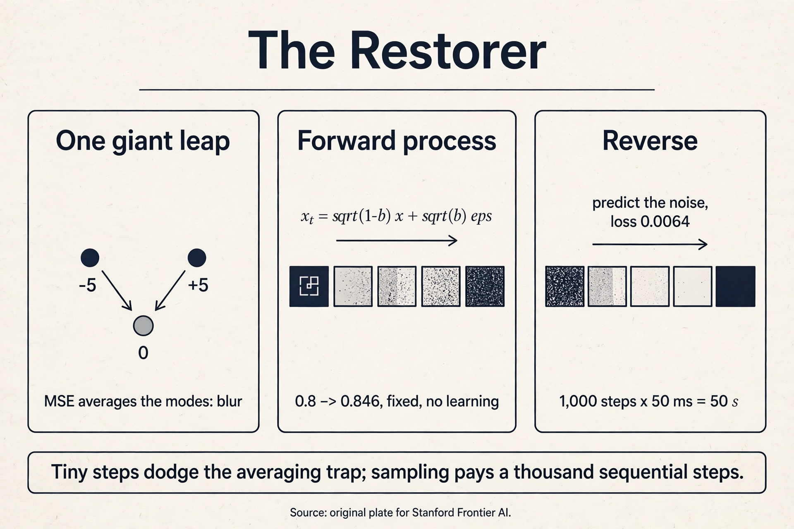

## The question, for restoration

Restate the one question: learn the rule behind samples, draw
fresh samples from it. The restorer's answer: take a photo and
corrupt it with noise, step by step, until it is pure static.
Learn the reverse: a machine that removes a little noise at each
step. To sample, start from pure static and run the reverser a
thousand times. The corruption is fixed and simple. Only the
restoration is learned.

## First attempt: one giant leap

The naive restorer skips the steps. Train one network to map pure
noise directly to a photo in a single jump. Watch it fail on a
toy. Two training "faces" live at x_0 = 5 and x_0 = -5, one
number each. Both diffuse to pure noise. Sometimes both produce
x_T = 0.3.

The network sees input 0.3 and must output one number. The true
conditional is bimodal: P(x_0 = 5 | x_T = 0.3) = 0.5 and P(x_0 =
-5 | x_T = 0.3) = 0.5. Trained with squared error, the network
outputs the conditional mean:

```ascii
prediction = 0.5 x 5 + 0.5 x (-5) = 0
```

Zero is neither face. It is gray blur. The one-step map must
invent everything at once from static, and squared error forces
it to average the possibilities. This is the same averaging trap
as the VAE's blur, wearing a new mask: whenever the target given
the input is multimodal, one point prediction becomes the mushy
middle.

## The key question

What if the corruption happens in a thousand tiny steps, so each
reverse step only has to remove a speck of noise, with a nearly
unimodal target?

## The new idea: destroy slowly, learn to un-destroy

The **forward process** is fixed destruction. Each step shrinks
the signal slightly and adds a whisper of Gaussian noise:

```ascii
x_t = sqrt(1 - beta_t) x_{t-1} + sqrt(beta_t) epsilon,  epsilon ~ N(0,1)
```

**Beta_t** is the **noise schedule**: small numbers, 10^-4 growing
to 10^-2. (The lecture writes alpha_t = 1 - beta_t, so the step
reads x_t = sqrt(alpha_t) x_{t-1} + sqrt(1 - alpha_t) epsilon.
Same step, two notations.)

Work it by hand, continuing the toy from CS229 L11. One pixel,
x_0 = 0.8, beta_1 = 0.01, drawn epsilon_1 = 0.5:

```ascii
x_1 = sqrt(0.99) x 0.8 + sqrt(0.01) x 0.5
    = 0.99499 x 0.8 + 0.1 x 0.5
    = 0.796 + 0.05 = 0.846
```

Barely changed. Step 2, with beta_2 = 0.01 and drawn epsilon_2 =
-0.4:

```ascii
x_2 = sqrt(0.99) x 0.846 + sqrt(0.01) x (-0.4)
    = 0.84177 - 0.04 = 0.80177
```

After 1,000 such steps the pixel is standard Gaussian noise,
independent of the 0.8 it started from. The signal factor after T
steps is the product of the shrinkages: with beta = 0.01 each
step, 0.99^1000 = 0.000043. The original is gone.

The forward process needs no learning, and Gaussians compose, so
x_t can be sampled from x_0 in closed form, skipping the chain.
With alpha-bar_t = (1 - beta_1)(1 - beta_2)...(1 - beta_t):

```ascii
x_t = sqrt(alpha-bar_t) x_0 + sqrt(1 - alpha-bar_t) epsilon
```

Check against the toy at t = 2: alpha-bar_2 = 0.99^2 = 0.9801,
sqrt = 0.99, sqrt(1 - 0.9801) = 0.14107. Then x_2 = 0.99 x 0.8 +
0.14107 x epsilon = 0.792 + 0.14107 x epsilon. For x_2 =
0.80177, epsilon = 0.0693. Consistent with the two-step walk.
Training pairs at every noise level are free: take a real image,
jump to any t in one formula.

The **reverse process** is the learned part. Model
p_theta(x_{t-1} | x_t): given the noisy image and the timestep t,
predict one step cleaner. The network (usually a U-Net) predicts
the noise epsilon that was added. Training is plain regression:

```ascii
true epsilon_1 = 0.5,  predicted epsilon-hat = 0.42
loss = (0.5 - 0.42)^2 = 0.0064
```

Mean squared error between true and predicted noise, averaged
over timesteps and images. The lecture's bottom line: diffusion
trains as a pile of regression problems, one per noise level,
with weights shared across levels and t as an input. No
adversary. No mode collapse games.

Why predict noise instead of the clean image? Algebra: from x_t
and epsilon, x_0 is determined, since x_t = sqrt(alpha-bar_t)
x_0 + sqrt(1 - alpha-bar_t) epsilon rearranges to x_0 = (x_t -
sqrt(1 - alpha-bar_t) epsilon) / sqrt(alpha-bar_t). Predicting
the noise is predicting the clean image in disguise, but the
target epsilon is always standard Gaussian, the same scale at
every timestep. Stable targets train stably.

Sampling runs the chain backward:

```ascii
draw x_T ~ N(0,1)
for t = T down to 1:
    x_{t-1} = mu_theta(x_t, t) + sigma_t z,   z ~ N(0,1)
output x_0
```

Each step removes a speck of noise, guided by the network. The
lecture's framing: a DDPM is a hierarchical VAE with a fixed
encoder. The latents are the whole chain x_1...x_T, the encoder
is the fixed corruption (no parameters), and only the decoder
(the reverser) is learned.

## Mapping back: what each property fixes

| One-leap failure | DDPM answer | How |
|---|---|---|
| One-step target is multimodal; MSE averages to blur (0, not +-5) | 1,000 tiny steps | Each reverse step's target is near-unimodal Gaussian; no averaging trap |
| Learning destruction wastes parameters | Fixed forward process | Corruption is arithmetic; all learning concentrates in the reverser |
| Training pairs would need a learned corrupter | Closed-form jumps | x_t from x_0 in one formula; free (noisy, clean) pairs at every level |

## The honest price: a thousand sequential steps

Sampling needs T network evaluations, one per reverse step, and
each step needs the previous step's output. With T = 1,000 and 50
ms per evaluation, one image takes 50 seconds. The machine that
trains as stable parallel regression samples as a slow serial
chain. This is the storyteller's serial bill from L02, returned
in a new form.

Why not destroy in 10 big steps instead? CS229 L11 gives two
reasons, both about learnability. First, a tiny step's reversal
is near-Gaussian and easy to fit. A giant leap's reversal is
multimodal and the network cannot fit it (the one-leap failure,
recursed). Second, the ELBO is tight only when each step's
reversal stays close to the true posterior. Small steps keep the
approximation honest. T large is not a whim. It is what makes the
reverser learnable. The field's whole few-step sampler industry
(L06: DDIM) exists to pay this price down.

> [!QA]
> Q: What is the forward process, exactly?
> A: Fixed, learning-free destruction: x_t = sqrt(1 - beta_t) x_{t-1} + sqrt(beta_t) epsilon, with betas from 10^-4 to 10^-2. On the worked toy, x_0 = 0.8 becomes x_1 = 0.846 after one step (barely changed) and reaches pure noise after 1,000 steps (signal factor 0.99^1000 = 0.000043). Gaussians compose, so x_t can be sampled from x_0 in closed form: x_t = sqrt(alpha-bar_t) x_0 + sqrt(1 - alpha-bar_t) epsilon.
> Follow-up: Why is the forward process fixed instead of learned?
> A: Destruction needs no intelligence. Adding noise is arithmetic. Fixing it makes training pairs free at every noise level and keeps the ELBO tractable. A learned forward process would add parameters with zero benefit. All intelligence concentrates in the reverse denoiser.

> [!QA]
> Q: Why does the network predict noise instead of the clean image?
> A: The two targets are algebraically equivalent: x_0 = (x_t - sqrt(1 - alpha-bar_t) epsilon) / sqrt(alpha-bar_t), so predicting epsilon determines x_0. But epsilon is always standard Gaussian, the same scale at every timestep, while x_0's scale varies with t. Same-scale targets give stable gradients. The toy loss shows the mechanism: (0.5 - 0.42)^2 = 0.0064, plain regression.
> Follow-up: Is noise prediction the only choice?
> A: No. Predicting x_0 or the score (L06) are equivalent reparameterizations of the same reverse step. Noise prediction won in practice because of the stable target scale, and the lecture presents it as the practical parameterization.

> [!QA]
> Q: Why does DDPM training avoid the GANs' instability?
> A: The objective is mean squared error on noise prediction: a pile of regression problems with a fixed target at each noise level. No adversary, no saddle point, no discriminator to balance. The toy loss 0.0064 is computed against ground-truth noise the forward process itself added, so the supervision is exact. The price moved elsewhere: 1,000 serial sampling steps.
> Follow-up: Then why did anyone use GANs after 2020?
> A: Sampling speed. A GAN draws a sample in one forward pass. DDPM needs 1,000. For interactive applications the 50-second bill (at 50 ms per step) was disqualifying until few-step samplers (DDIM, distillation) cut it down. The field chose trainability for quality, then spent years buying back speed.



## Recap: the whole lesson on one screen

1. **The question, for restoration.** Learn the rule. Draw fresh samples. Corrupt data to noise, learn to reverse.
2. **First attempt: one giant leap.** Faces at +-5 both reach x_T = 0.3. MSE-optimal prediction is 0, the average of the modes. Blur by averaging.
3. **The key question.** What if corruption runs in a thousand tiny steps, each reverse step nearly unimodal?
4. **Forward, by hand.** x_0 = 0.8 -> x_1 = 0.846 -> x_2 = 0.80177. Signal factor 0.99^1000 = 0.000043. Closed form: x_t = sqrt(alpha-bar_t) x_0 + sqrt(1 - alpha-bar_t) epsilon.
5. **Reverse.** Network predicts the added noise. Toy loss (0.5 - 0.42)^2 = 0.0064. Noise prediction equals clean-image prediction by algebra, with stable target scale.
6. **Sampling.** x_T ~ N(0,1), then T reverse steps. A hierarchical VAE with a fixed encoder.
7. **The price: serial sampling.** 1,000 steps x 50 ms = 50 seconds per image. T is large because small steps keep the reversal learnable and the ELBO tight.
8. **Map back.** Tiny steps dodge the averaging trap. The fixed forward makes training pairs free. All learning sits in the reverser.

## Official sources and further reading

**Official:**
- W7L26: DDPMs (video N0OOnTKMYJE) and W7L27: DDPM formulation (video P8AiIW0Gg0s): the lectures this chapter follows. The forward-step algebra and the hierarchical-VAE framing are confirmed from the lecture transcripts.
- Ho, Jain & Abbeel, DDPM (2020): https://arxiv.org/abs/2006.11239 — the original paper.

**Further reading:**
- CS229 L11 (this system): the same forward process with beta notation, the 0.846 toy extended here, and the "why T is large" argument.
- Sohl-Dickstein et al., "Deep Unsupervised Learning using Nonequilibrium Thermodynamics" (2015): the original diffusion idea.

**Caveats from these sources.** The 1-D pixel toys are illustrative. Real DDPMs use T = 1,000 on high-dimensional images with a learned variance schedule. The 50 ms per step is illustrative. Real latency depends on model size and hardware. The noise-prediction equivalence holds exactly only for the Gaussian forward process.

## Connections to the other courses

- **CS229 L11:** the sibling telling of this story: same beta notation, same 0.846 toy, the ELBO decomposition over steps, and text conditioning.
- **math-genai (sibling):** the ELBO for DDPM in full derivation. This lesson uses the resulting MSE objective.
- **CS229 L10:** the hierarchical-VAE view: latents x_1...x_T, fixed encoder, learned decoder.
- **L06 (this course):** the score view of the same machine, DDIM's shortcut through the 1,000 steps, and guidance.
