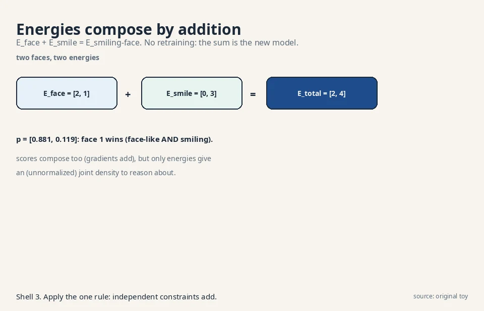
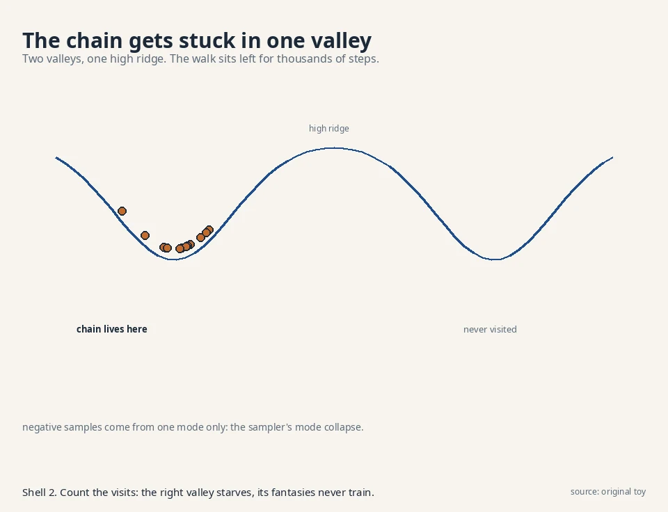
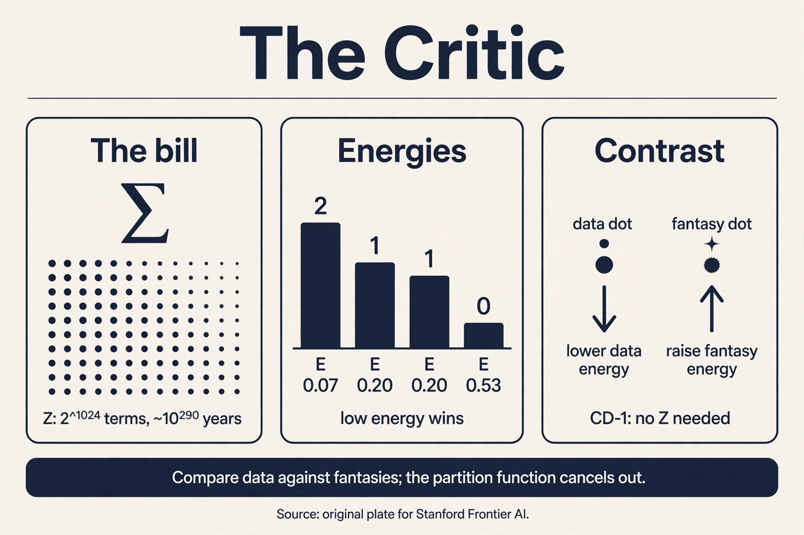

## The question, for valleys

Restate the one question: learn the rule behind samples, draw
fresh samples from it. The critic's answer: assign every outcome
an **energy**, a single number. Low energy for real-looking
outcomes, high energy for the rest. Real faces sit in valleys. Noise sits on hills. To sample, start from noise and roll
downhill toward low energy. The model never writes a probability
table. It sculpts an energy surface.

## First attempt: energies into probabilities

Energies become probabilities through the Boltzmann formula:

```ascii
p(x) = exp(-E(x)) / Z,    Z = sum over all x of exp(-E(x))
```

**Z**, the **partition function**, normalizes: it is the sum that
makes the probabilities add to 1. Work it on 4 faces with
energies E = [2, 1, 1, 0]:

```ascii
exp(-E) = [0.1353, 0.3679, 0.3679, 1.0000]
Z = 0.1353 + 0.3679 + 0.3679 + 1.0000 = 1.8711
p = [0.0723, 0.1966, 0.1966, 0.5345]
```

Face 4 has the lowest energy and the highest probability,
0.5345. The machine works: energies in, probabilities out. To
sample, roll downhill: start at a random face, step toward lower
energy, add a little noise so you explore.

 = exp(-E(x)) / Z. Face 4 has the lowest energy and p = 0.5345. Shell 2. Source: original toy. Project: Stanford Frontier AI.")

## Where it breaks: the partition bill

Z sums over all outcomes. For the 4-face toy that is 4 terms.
For a 32x32 binary image it is 2^1024 terms, each needing an
energy evaluation. At a billion evaluations per second, 2^1024
evaluations take about 10^290 years. The partition function is
the exploding table from L01 wearing a sum sign.

The bill infects training too. Maximum likelihood wants the
gradient of log p(x) = -E(x) - log Z. Differentiate:

```ascii
d/dtheta log p(x) = - dE(x)/dtheta + E_model[dE/dtheta]
                    ^^^^^^^^^^^^^^   ^^^^^^^^^^^^^^^^^^
                    positive phase:  negative phase:
                    lower energy     raise energy of what
                    of real data     the model likes
```

The positive phase is easy: one data point, one gradient. The
negative phase is an expectation under the model itself, which
needs Z. You cannot train without Z, and you cannot compute Z.
The naive critic is stuck.

## The key question

What if we train the energy without ever computing Z, by
comparing real data against the model's own fantasies?

## The new idea: contrastive divergence

Read the gradient again. It is a contrast: the energy slope on
data minus the energy slope on model samples. Push energy down
where data sits. Push it up where the model currently puts mass.
If the model's fantasies match the data, the two terms cancel
and learning stops. At that point the energy surface's valleys
coincide with the data, with Z never computed.

The remaining problem is the model expectation: sampling from
the model needs MCMC, and MCMC needs many steps to mix.
**Contrastive divergence** (Hinton, 2002) cuts the chain short:
start the chain at a data point, run k steps (often just 1), and
use the landing spot as the negative sample. The chain does not
reach the model's true distribution, but it reaches the model's
*current* fantasies near the data, which is where the contrast
matters.

Work CD-1 by hand. Four faces, energies E_i = -theta_i, data
probs [0.1, 0.2, 0.3, 0.4]. Start theta = [0,0,0,0], so the model
is uniform: p = [0.25, 0.25, 0.25, 0.25].

Take data point x = 4. Positive phase: lower E(4), i.e. raise
theta_4. Run one MCMC step from x = 4 under the uniform model.
suppose it lands on face 2. Negative phase: raise E(2), i.e.
lower theta_2. With step size eta = 0.1:

```ascii
theta: [0, 0, 0, 0] -> [0, -0.1, 0, 0.1]

new unnormalized: [1.0000, 0.9048, 1.0000, 1.1052],  Z = 4.0100
new p = [0.2494, 0.2256, 0.2494, 0.2756]
```

. Project: Stanford Frontier AI.")

One contrastive step moved mass from the fantasy (face 2: 0.25
-> 0.2256) to the data (face 4: 0.25 -> 0.2756). Repeat over the
dataset and the valleys migrate onto the data, one fantasy at a
time. The full-batch gradient behind it, for the record: with
theta = 0, the data term E_data[dE/dtheta] = -0.3 and the model
term E_model[dE/dtheta] = -0.5, giving gradient -(-0.3 + 0.5) =
-0.2 on the shared slope parameter, pushing the model away from
over-producing face 2's region. CD-1 approximates that model
term with the one-step fantasy.

Sampling uses the same downhill walk as L06's Langevin dynamics,
because the score is minus the energy gradient: s(x) = -grad
E(x). The critic's sampler and the score model's sampler are one
algorithm. Score models (L06) are EBMs that skipped learning E
and learned its gradient directly.

### Subchapter: score matching trains EBMs without Z

Contrastive divergence is not the only Z-free trainer.
**Score matching** (Hyvarinen, 2005) trains the energy by
matching its gradient to the data's score: minimize the squared
difference between -grad E(x) and the true score, estimated via
denoising (Vincent, 2011). The partition function never appears
because differentiation kills constants: grad log p = -grad E
- grad log Z, and grad log Z = 0.

This is the same denoising score matching from L06, pointed at
an energy instead of a bare score network. The difference is
what you keep: score matching on E gives you the energy
(composable, below) plus its gradient. Score matching on a bare
network gives only the slope. The price is the same bias L06
named: the denoising target equals the true score only in
expectation, and the objective needs the trace of the Hessian
of E, which Hutchinson's estimator approximates. Two Z-free
trainers, one shared idea: Z is a constant, and constants die
under differentiation.

### Subchapter: persistent CD: the replay buffer

CD-1 starts every chain from data. **Persistent CD** (Tieleman,
2008) keeps a **replay buffer** of fantasies across batches:
each training step continues the chains from where they landed
last time, instead of restarting at data. The chains are
"persistent": they live across the whole training run.

Why it helps: a chain that survives 1,000 steps across 1,000
batches mixes far better than 1,000 one-step chains. The
negative samples approach the model's true distribution, and
the bias shrinks. The numbers: with a buffer of 10,000
fantasies and batch size 100, each fantasy gets revisited every
100 steps, accumulating roughly 10 steps of Langevin per
revisit. After 10 epochs the average chain age is hundreds of
steps: close to mixed.

The price: stale fantasies. Early in training the energy
changes fast, and a 500-step-old fantasy was drawn from an
ancient model. Practitioners refresh a fraction of the buffer
from noise or data each step (5% is typical). The decision
rule: CD-1 for quick experiments, persistent CD when the bias
shows up as spurious valleys that never fill.

### Subchapter: product of experts: energies add

The critic's surviving superpower is composition. Energies of
independent constraints add, no retraining:

```ascii
E_face  = [2, 1]     (face 1 is more face-like)
E_smile = [0, 3]     (face 1 smiles more)
E_total = [2, 4]

p = [e^-2, e^-4] / (e^-2 + e^-4) = [0.881, 0.119]
```



Face 1 wins with 0.881: it is the most face-like AND the most
smiling. Two separately trained critics composed into a
"smiling face" model by addition. Scores compose too (gradients
add), but only energies give an (unnormalized) joint density to
reason about. No other family in this course composes this
cleanly: you cannot add two VAEs or two diffusion models and
get a meaningful joint. This is why the critic survives in
research despite losing the image-generation race.

### Subchapter: modern EBMs: the diffusion reunion

Two results brought EBMs back into the conversation. **JEM**
(Grathwohl et al., 2020): a standard image classifier's logits
are secretly energies. The logit for class y is -E(x, y). Sum
over y and you get -E(x): an energy for the image itself.
Train the classifier with the usual cross-entropy plus an EBM
term, and it both classifies and generates (via Langevin on the
energy). One model, two jobs.

**Du and Mordatch (2019)** showed deep EBMs can generate
ImageNet-scale images with plain Langevin sampling, no
diffusion schedule, no 1,000-step chain design. The samples
rival early GANs. The catch, as always: mixing. Their chains
need careful step sizes and long runs, and the models never
matched diffusion's quality-per-compute. [uncertain]: whether
the lecture covers JEM or Du and Mordatch. They are included
as the modern EBM landmarks from the cited papers.

<div class="video-block"><div class="video-wrap"><iframe src="https://www.youtube-nocookie.com/embed/_aqf65c14kI" title="Energy Based Generative Models Explained Through an Example" allow="accelerometer; autoplay; clipboard-write; encrypted-media; gyroscope; picture-in-picture" allowfullscreen loading="lazy" referrerpolicy="strict-origin-when-cross-origin"></iframe></div><p class="video-cap">Explainer: Energy-Based Generative Models Through an Example. A tiny 1D EBM trained from scratch: the loss as a difference of two expectations, Monte Carlo model samples, and gradient descent recovering the true distribution. Watch after the contrastive-divergence section.</p></div>

## Mapping back: what each property fixes

| Naive-critic failure | Contrastive-divergence answer | How |
|---|---|---|
| Z needs 2^1024 terms. Training needs Z | Gradient as a contrast | Positive phase on data, negative phase on fantasies. Z cancels out of the difference |
| Model expectation needs perfect MCMC | CD-k: k-step chains from data | Short chains reach the model's current fantasies near data, where the contrast bites |
| Stale short chains bias the negative phase | Persistent CD | Replay buffer keeps chains alive across batches. Fantasies approach the true model |
| No sampling rule | Downhill Langevin walk | x <- x - (delta/2) grad E + sqrt(delta) z. Valleys attract |
| Models cannot combine | Energies add | E_total = E_face + E_smile. Composition without retraining |

## The honest price: biased, blind, and stuck

**Price 1: the gradient is biased, demonstrated.** CD-1's
negative sample came from a 1-step chain, not the model's true
distribution. A single fantasy estimates the model expectation
with huge variance: on the 2-outcome toy the one-sample estimate
of E_model[dE/dtheta] is either 0 or -1 against the true -0.5, a
variance of 0.25 per sample. Short chains plus few samples mean
noisy, biased gradients. The theory says CD-k is not even the
gradient of any fixed objective. It works in practice the way a
compass works in a storm.

**Price 2: no normalized probabilities.** Z was never computed,
so p(x) is unknown. The critic samples beautifully and cannot
answer "how likely is this image?" The warper (L04) keeps the
exact-density crown. The critic trades it away.

**Price 3: the sampler gets stuck, demonstrated.** The downhill
walk explores one valley at a time. If the surface has two
valleys separated by a high ridge, the chain sits in one valley
for thousands of steps before crossing.



Multimodal data means multimodal valleys, and Langevin mixes
slowly across them. The negative samples then come from one mode
only, and the contrast teaches the energy about that mode alone.
This is the sampler's version of mode collapse, and tempering
(running hot and cold chains) is the standard, fiddly fix.

## What is used where: the critic in the wild

Honesty first: at the time of writing, no major deployed product
runs on an energy-based generative model. The row below is the
research record, not a production map.

| Work | What it showed | Evidence |
|---|---|---|
| Du & Mordatch (2019) | Deep EBMs generate ImageNet-scale images with Langevin sampling | Public: arxiv 1909.08750 |
| JEM (Grathwohl et al., 2020) | Classifier logits are energies: one model classifies and generates | Public: arxiv 1912.03263 |
| Product of experts (Hinton, 2002) | The CD algorithm. Energies compose by addition | Public: Neural Computation 14(8) |
| Energy-based OOD detection | Energy scores flag out-of-distribution inputs | Public research: arxiv 2010.03759 |

Why the lab keeps the critic: compositionality (energies add),
the Z-free training ideas (score matching migrated to diffusion),
and the conceptual clarity (every generative model is an energy
model with a different Z strategy: the warper computes Z's
analog exactly, the restorer sidesteps it, the critic ignores
it). The critic lost the product race and won the conceptual
one.

> [!QA]
> Q: What is the partition function, and why is it the whole problem?
> A: Z = sum_x exp(-E(x)) normalizes energies into probabilities. On the 4-face toy it is 1.8711, computed exactly. On a 32x32 binary image it has 2^1024 terms: at a billion energy evaluations per second, about 10^290 years. Training needs Z through the negative phase of the gradient, so the naive maximum-likelihood critic cannot even start.
> Follow-up: If Z is intractable, how does anything about EBMs work at all?
> A: The gradient splits into data term minus model term, and Z cancels in the difference. Contrastive divergence approximates the model term with short MCMC chains started at data points. You never need Z's value, only the direction in which data and fantasies disagree. The price is bias and variance, not impossibility.

> [!QA]
> Q: What is contrastive divergence, mechanically?
> A: For each data point: lower its energy (positive phase), run k MCMC steps starting from it (often k = 1), raise the landing spot's energy (negative phase). The worked CD-1 step moved theta from [0,0,0,0] to [0,-0.1,0,0.1], shifting probability from the fantasy face 2 (0.25 to 0.2256) to the data face 4 (0.25 to 0.2756). Learning stops when fantasies match data and the two phases cancel.
> Follow-up: Why start the chain at the data instead of from scratch?
> A: A chain from scratch needs thousands of steps to mix into the model's distribution. A chain from data starts where the contrast matters and one step already produces a useful fantasy. The bias this introduces is the method's known price: CD-k does not follow the gradient of any fixed objective, but the short-chain fantasies point the right way in practice.

> [!QA]
> Q: How are EBMs and score models related?
> A: The score is minus the energy gradient: s(x) = -grad E(x). Langevin sampling on energies (x <- x - (delta/2) grad E + sqrt(delta) z) is identical to L06's score Langevin. A score model is an EBM that skipped learning E and learned grad E directly, dodging Z the same way. The EBM keeps the energy (useful for composing models: energies add). The score model keeps only the slope.
> Follow-up: When would you prefer the energy over the score?
> A: When models must compose. Energies of independent constraints add: E_total = E_face + E_smiling gives a "smiling face" model with no retraining. Scores compose too (gradients add), but only energies give a (unnormalized) joint density to reason about. Compositionality is the critic's surviving superpower.

> [!QA]
> Q: Walk me through CD-1 vs persistent CD on the 4-face toy.
> A: CD-1: take data point x = 4, lower E(4) (theta_4: 0 -> +0.1). Run one MCMC step from x = 4 under the current model. It lands on face 2. Raise E(2) (theta_2: 0 -> -0.1). Done: one fantasy, one step, biased but cheap. Persistent CD: instead of restarting at x = 4, continue last batch's chain from wherever it landed, say face 1 after 40 accumulated steps. The fantasy is closer to the model's true distribution, so the bias shrinks. The cost: bookkeeping a replay buffer and refreshing stale fantasies.
> Follow-up: When does CD-1's bias actually hurt?
> A: When the model distribution is far from the data early in training, or multimodal late in training. One-step fantasies near data cannot represent a model that puts mass far from data, so the negative phase pushes the wrong places. Spurious valleys that never fill are the symptom. Persistent chains see further.

> [!QA]
> Q: How does score matching train an energy without Z?
> A: Match the energy's gradient to the data's score: the loss compares -grad E(x) against the denoising target, and Z never appears because differentiation kills constants (grad log Z = 0). It is L06's denoising score matching pointed at an energy instead of a bare score network. You keep the energy (composable) plus its gradient. The price: the objective needs the Hessian trace of E, approximated by Hutchinson's estimator, and the denoising target is exact only in expectation.
> Follow-up: If score matching works, why bother with CD?
> A: Score matching needs second derivatives (the Hessian trace) and careful noise-level design. CD needs only first derivatives and a sampler. CD is the practitioner's default for shallow energies. Score matching is the theorist's choice that later grew into diffusion. History picked the gradient of the energy over the energy's contrast.

> [!QA]
> Q: Applied: combine a face model and a smile detector into a smiling-face generator without retraining.
> A: Add the energies: E_total(x) = E_face(x) + E_smile(x). On the toy: E_face = [2,1], E_smile = [0,3], total [2,4], giving p = [0.881, 0.119]: face 1 wins as most face-like and most smiling. Then sample with Langevin on E_total. No other family composes this cleanly: adding VAE decoders or diffusion denoisers has no such meaning.
> Follow-up: What is the catch?
> A: The sum is unnormalized: you get samples but no probabilities, and the two energies must be on comparable scales or one dominates. Calibrating the relative weight (a temperature per energy) is the fiddly part. Composition is exact in form, approximate in practice.

> [!QA]
> Q: Applied: why did EBMs lose image generation to diffusion?
> A: Three prices, each fatal at scale. Biased gradients (CD) vs diffusion's exact regression targets. Slow mixing across modes vs diffusion's fixed schedule that visits every noise level by construction. No likelihoods vs diffusion's ELBO (however loose). Diffusion kept the critic's best idea (the score, the Langevin walk) and replaced the energy with a direct score network trained by denoising. The student beat the teacher by skipping the hard part.
> Follow-up: Is there anything the EBM still does better?
> A: Composition and conceptual economy. Energies add. Scores of composed models need care. And every generative model is now readable as an energy model with a Z strategy: exact (flows), bounded (VAEs, diffusion), ignored (EBMs). The critic is the lens, even where it is not the product.



## Recap: the whole lesson on one screen

1. **The question, for valleys.** Learn the rule. Draw fresh samples. Sculpt an energy surface: valleys for real, hills for noise.
2. **Energies to probabilities, by hand.** E = [2,1,1,0], Z = 1.8711, p = [0.0723, 0.1966, 0.1966, 0.5345]. Face 4 wins.
3. **The partition bill, demonstrated.** Z over 2^1024 image outcomes: ~10^290 years at a billion evals per second. Training's negative phase needs Z.
4. **The key question.** What if we train without Z, contrasting data against the model's fantasies?
5. **Contrastive divergence, by hand.** CD-1: theta [0,0,0,0] -> [0,-0.1,0,0.1]. Mass moves fantasy face 2 -> data face 4 (0.2256 vs 0.2756).
6. **Two Z-free trainers.** CD (contrast of fantasies) and score matching (differentiation kills Z). Persistent CD keeps chains alive in a replay buffer.
7. **Composition.** E_face + E_smile = E_total: [2,4] -> p = [0.881, 0.119]. No retraining. The critic's superpower.
8. **Modern landmarks.** JEM: classifier logits are energies. Du and Mordatch: deep EBMs generate ImageNet images with Langevin.
9. **Sampling.** Downhill Langevin. The score is -grad E, so L06's sampler is this sampler.
10. **The price.** Biased noisy gradients (variance 0.25 per one-sample estimate). No normalized probabilities. Chains get stuck in one valley.
11. **In the wild.** Research stage, no verified production deployment. The critic won the conceptual race: every family is an energy model with a Z strategy.

## Official sources and further reading

**Official:**
- Hinton (2002), Training Products of Experts by Minimizing Contrastive Divergence: https://www.cs.toronto.edu/~hinton/absps/tr00-004.pdf (the CD algorithm).
- LeCun et al. (2006), A Tutorial on Energy-Based Learning: https://web-wp.archive.org/web/20250902133800/http://yann.lecun.com/exdb/publis/pdf/lecun-06.pdf (the energy framing this chapter follows. Archived mirror: original link dead as of Oct 2026).

**Further reading:**
- Du & Mordatch, Implicit Generation and Generalization in EBMs (2019): https://arxiv.org/abs/1909.08750 (modern EBM image modeling with Langevin sampling).
- Grathwohl et al., Your Classifier is Secretly an Energy Based Model (2020): https://arxiv.org/abs/1912.03263 (energies from classifiers).
- Tieleman, Training RBMs with Persistent CD (2008): the replay-buffer idea behind persistent CD.

**Caveats from these sources.** [uncertain]: energy-based models do not appear in the Prathosh playlist's topic sequence (weeks 1-12). This lesson is grounded in Hinton 2002 and LeCun et al. 2006. The toy chains are illustrative. Real CD runs k-step Langevin in high dimensions with persistent chains. CD-k's bias is analyzed in the literature. The "compass in a storm" characterization is this chapter's, not the papers'.

## Connections to the other courses

- **L06 (this course):** the score is -grad E. Annealed Langevin is the critic's sampler. Score models are EBMs without the energy.
- **L04 (this course):** the exact-density alternative: the warper computes Z's analog (the determinant) exactly. The critic gives up and samples.
- **math-genai (sibling):** the divergence view: CD minimizes the KL between data and model distributions approximately, one fantasy at a time.
- **CS229 L09:** mixture models as the tractable cousin: exact posteriors where the critic needs MCMC.
