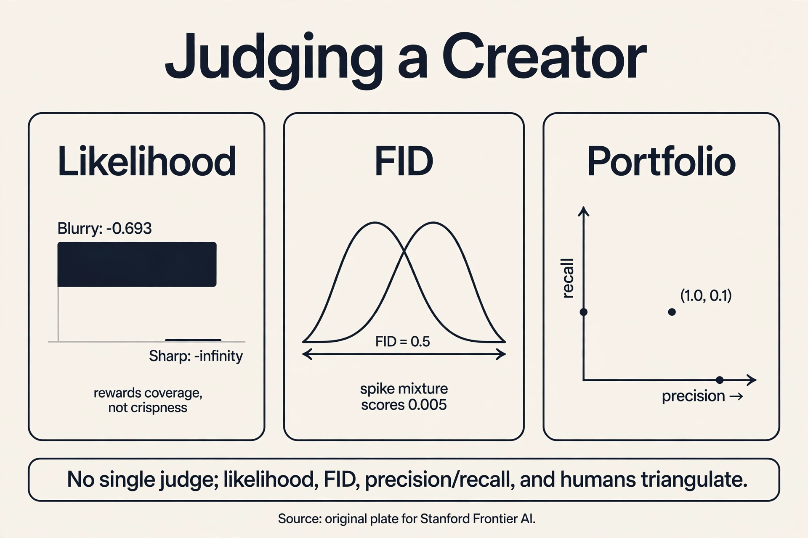

## The question needs a judge

Eight lessons, five machines, one question: learn the rule,
sample from it. Now the uncomfortable part: which machine
learned it? "The samples look good" is not a metric. Two models
can both produce sharp faces while one memorized the training
set and the other learned the rule. The judge must measure
distributions, not samples, and every judge has a blind spot.
This lesson works each metric by hand and demonstrates each
blind spot with numbers.

## First attempt: ask humans

The naive judge is human rating: show people samples, ask for
scores. It fails three ways, each countable. First, cost: 50
raters x 100 images x 30 seconds per judgment = 41 hours of
human time per model comparison. Second, irreproducibility: a
different rater pool gives a different ranking, and nobody can
re-run your raters. Third, and fatally, humans reward the wrong
thing. L01's parrot, the memory machine that replays training
photos, gets 5/5 from every rater: its outputs are real photos.
Perfect human score, zero learning. A judge that cannot tell
memorization from generalization is not a judge.

## The key question

What if we measure the distance between distributions with
metrics that see what eyes miss: coverage, likelihood, and
feature statistics?

## Metric 1: likelihood, the coverage judge

Models with exact densities (the storyteller, the warper) can be
scored by **likelihood**: the probability they assign to
held-out data they never trained on. Higher is better. Work it
on L02's toy. Model A gives P("the cat sat") = 0.60, model B
gives 0.40:

```ascii
log-lik A = log 0.60 = -0.511 nats
log-lik B = log 0.40 = -0.916 nats
A wins by 0.405 nats
```

Likelihood is the only metric that asks "did you learn the whole
rule?" But it has a demonstrated blind spot: it rewards coverage
over sharpness. True data: faces at -5 and +5, half each. Model
Sharp puts all mass at +5: gorgeous samples, misses half the
data. Model Blurry puts 0.5 on each: dull, correct coverage.

```ascii
held-out face at -5:
  Sharp:  log p = log(0+) = -infinity
  Blurry: log p = log 0.5 = -0.693
Blurry wins by infinity
```

One missed mode costs infinite nats. Likelihood punishes a
dropped mode infinitely and barely punishes blur. So the blurry
VAE beats the sharp GAN on likelihood while losing every beauty
contest. Likelihood measures "did you cover everything,"
never "are your samples crisp." And three of our five machines
(VAE bound, diffusion bound, EBM unnormalized) cannot even
report it exactly.

## Metric 2: FID, the feature judge

The **Frechet Inception Distance** compares real and generated
images in the feature space of an Inception network pretrained
on ImageNet. Fit a Gaussian to each set's features, then take
the Frechet (Wasserstein) distance between the Gaussians:

```ascii
FID^2 = ||mu_r - mu_g||^2 + Tr(Sigma_r + Sigma_g - 2 (Sigma_r Sigma_g)^{1/2})
```

mu_r, Sigma_r: mean and covariance of real features. mu_g,
Sigma_g: the same for generated. Lower is better. Work it on
2-D toys. Real features N([0,0], I), generated N([0.5,0], I):

```ascii
FID^2 = 0.25 + Tr(I + I - 2I) = 0.25 + 0 = 0.25
FID = 0.5
```

Now give the generator the right mean but double the spread,
Sigma_g = 4I. (Sigma_r Sigma_g)^{1/2} = 2I:

```ascii
FID^2 = 0.25 + Tr(I + 4I - 4I) = 0.25 + Tr(I) = 2.25
FID = 1.5
```

FID sees both failures: shifted means (0.5) and wrong spreads
(1.5 vs 0.5). It correlates with human judgment better than any
earlier metric, which is why the field adopted it.

Three blind spots, each demonstrated. First, memorization: FID
between the training set and itself is 0. The parrot scores
perfectly. FID never asks whether samples are new. Second, the
Gaussian assumption: FID fits one bell curve per set and is
blind to shape differences the bell curve erases. Real features
N(0,1). Generated features a 50/50 mix of spikes at -1 and +1
with width 0.1. Same mean 0, variance 1.01 vs 1.00:

```ascii
FID^2 = 0 + (1 + 1.01 - 2 sqrt(1.01)) = 2.01 - 2.0100 = 0.0000
FID ~ 0.005
```

Nearly perfect FID for a generator that makes only two spikes
and misses everything between. Third, the features: the
Inception layer is a hyperparameter, and ImageNet features judge
dog photos well and medical scans poorly. FID measures distance
in someone else's feature space.

## Metric 3: Inception Score, the sharpness-diversity judge

The **Inception Score** never looks at real data. It asks two
things of generated samples: is each sample confidently one
thing (sharp), and do the samples cover many things (diverse)?
With p(y|x) the classifier's label distribution per sample and
p(y) the average:

```ascii
IS = exp( E[ KL(p(y|x) || p(y)) ] )
```

Its blind spot is memorization at scale, demonstrated. A model
that outputs exactly one memorized photo per ImageNet class,
cycling through all 1,000 classes: each p(y|x) is one-hot, so
KL = log 1000 = 6.9 nats per sample, and p(y) is uniform:

```ascii
IS = exp(6.9) = 1000
```

A perfect score for a 1,000-photo memory machine. IS also
rewards anything the classifier finds confident, including sharp
images of nothing real. The field keeps it for quick checks and
trusts FID more.

## The honest price: no single judge

The lecture's warning frames everything: after training,
P_theta* is not P_X. Sample averages stand in for the true
distribution, lower bounds stand in for likelihoods, gradient
descent stops early. Every metric measures the trained artifact,
not the platonic model, and every metric is blind somewhere:

| Metric | Measures | Blind spot, demonstrated |
|---|---|---|
| Human rating | True visual quality | Parrot scores 5/5; 41 hours per comparison |
| Likelihood | Full-distribution coverage | Blurry beats Sharp by infinity; 3 of 5 families cannot report it |
| FID | Feature-space distance | Memorization scores 0; spike-mixture scores 0.005; ImageNet features |
| Inception Score | Sharpness + diversity | 1,000-photo memory machine scores 1000; never sees real data |

The working answer is a portfolio. **Precision and recall**
disentangle what FID averages: precision = fraction of
generated samples near the real manifold (quality), recall =
fraction of real modes the generator covers (coverage). Count it
on a toy: 10 generated faces, 8 near real faces, and 10 real
face types, 5 imitated:

```ascii
precision = 8/10 = 0.8,   recall = 5/10 = 0.5
```

A mode-collapsed generator that makes one perfect face: precision
1.0, recall 0.1. The pair catches what any single number hides.
Use likelihood where it exists, FID for the leaderboard,
precision/recall for the diagnosis, humans for the final word.
No metric replaces the question. Together they triangulate it.

> [!QA]
> Q: Why can a blurry model beat a sharp model on likelihood?
> A: Likelihood punishes missed coverage infinitely and blur barely. On the toy, true data is faces at -5 and +5. Model Sharp puts all mass at +5 and scores log(0+) = -infinity on a held-out -5 face, while Model Blurry's 0.5/0.5 split scores -0.693. Likelihood asks "did you cover everything," never "are samples crisp." That is why VAEs win likelihood contests and lose beauty contests.
> Follow-up: Should we then ignore likelihood?
> A: No. It is the only metric that checks the whole distribution, and it is exact for the storyteller and the warper. But it cannot rank a GAN against a diffusion model (neither reports exact likelihoods), and it disagrees with human judgment on sharpness. Use it where it exists, for what it measures: coverage.

> [!QA]
> Q: What does FID actually compute?
> A: Fit a Gaussian to Inception features of real images (mu_r, Sigma_r) and another to generated images (mu_g, Sigma_g), then take the Frechet distance: ||mu_r - mu_g||^2 + Tr(Sigma_r + Sigma_g - 2(Sigma_r Sigma_g)^{1/2}). On the 2-D toy, a mean shift of 0.5 gives FID 0.5. Doubling the spread gives FID 1.5. Lower is better. It sees both location and spread errors in feature space.
> Follow-up: Why is FID blind to memorization?
> A: FID compares two feature distributions. If the generated set equals the training set, the Gaussians match exactly and FID = 0. Nothing in the formula asks whether a sample is new. Detecting memorization needs nearest-neighbor tests against the training set, a separate check the lecture's evaluation pipeline does not include.

> [!QA]
> Q: When is precision/recall better than FID?
> A: When you need the diagnosis, not just the ranking. FID is one number mixing quality and coverage. Precision/recall splits them. The toy mode-collapsed generator (one perfect face) shows why: precision 1.0, recall 0.1. FID would report a single mediocre number. The pair names the disease: perfect quality, no coverage. For model development the pair beats the scalar.
> Follow-up: Can precision/recall be gamed too?
> A: Yes. Both depend on a neighborhood rule in feature space (which Inception layer, what radius), and a generator can inflate recall by scattering noisy samples near many modes. No metric survives adversarial optimization against itself. That is why the honest answer is a portfolio plus human judgment, not a single number.



## Recap: the whole lesson on one screen

1. **The question needs a judge.** Five machines, one question. "Looks good" is not a metric.
2. **Humans fail, counted.** The parrot scores 5/5. 41 rater-hours per comparison. Irreproducible.
3. **Likelihood, by hand.** log 0.6 = -0.511 beats log 0.4 = -0.916. Blind spot: Blurry beats Sharp by infinity (-0.693 vs -infinity). Coverage, not crispness.
4. **FID, by hand.** Mean shift 0.5 -> FID 0.5. Doubled spread -> FID 1.5. The field's standard.
5. **FID's blind spots, numbered.** Memorization: FID 0. Spike mixture: FID 0.005 with same mean/variance. ImageNet features judge dogs, not scans.
6. **Inception Score, gamed.** A 1,000-photo memory machine scores IS = 1000. Never sees real data.
7. **The key question.** What if metrics see what eyes miss? Answer: a portfolio.
8. **Precision/recall.** Toy: precision 0.8, recall 0.5. Mode collapse: 1.0 and 0.1. The pair diagnoses. No scalar does.

## Official sources and further reading

**Official:**
- W4L16: Evaluation of Generative Models (video 5Mchnh2xedI): the lecture this chapter follows. The FID formula, the Inception-feature construction, and the post-training P_theta* != P_X warning are confirmed from the lecture transcript.
- Heusel et al. (2017): https://arxiv.org/abs/1706.08500 — FID.

**Further reading:**
- Salimans et al., Improved Techniques for Training GANs (2016): the Inception Score.
- Sajjadi et al. (2018), Kynkäänniemi et al. (2019): precision and recall for generative models.

**Caveats from these sources.** The 2-D Gaussian toys are illustrative. Real FID uses 2,048-dimensional Inception features over tens of thousands of images. The spike-mixture FID of 0.005 assumes matched first two moments. Real feature distributions differ in subtler ways FID partially sees. IS = 1000 is the theoretical maximum for the memory machine, not a reported result.

## Connections to the other courses

- **math-genai (sibling):** the divergence view of evaluation: FID is a Wasserstein distance between fitted Gaussians. The f-divergence lessons explain what likelihood optimizes.
- **L01-L07 (this course):** every price named in this course is priced again here: the metric that catches each family's failure mode.
- **CS229 L11:** the quality-vs-likelihood tension in diffusion: the best-looking samplers are rarely the best likelihood models.
- **CS336:** evaluation at scale: why leaderboards standardize on FID despite its blind spots, and the cost of human eval for frontier models.
