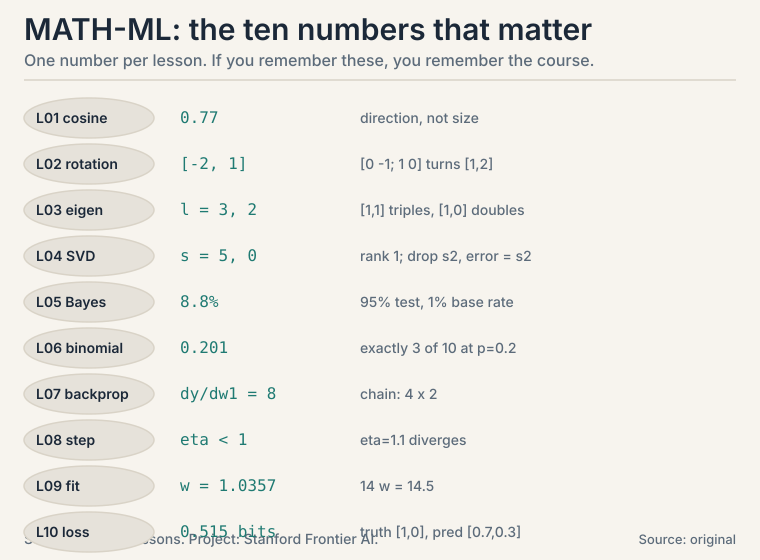

## The ten numbers



## Vectors (L01)

```ascii
dot product:       x . y = x1*y1 + ... + xn*yn
norm:              ||x|| = sqrt(x1^2 + ... + xn^2)
cosine similarity: (x . y) / (||x|| * ||y||)     in [-1, 1]
```

Dot product mixes agreement with size. Cosine divides size out.
Parallel = 1, perpendicular = 0, opposite = -1.
**Mnemonic:** "Dot dives deep, cosine compares clean." Dot keeps
everything. Cosine cleans out the size.

## Matrices (L02)

```ascii
(Mv)_i = row_i(M) . v              (rows dot the vector)
Mv = v1*col_1 + ... + vn*col_n      (mix of columns)
(AB)^T = B^T A^T
projection of b onto a:  ((a . b) / (a . a)) * a
```

Columns of M are where the axes land. Projection splits any
vector into along-part plus perpendicular leftover.
**Never-confuse:** AB != BA (order matters). (AB)^T = B^T A^T
(order flips).

## Eigen-decomposition (L03)

```ascii
Av = lambda v                       (direction kept, scaled by lambda)
det(A - lambda I) = 0               (characteristic equation)
A = V Lambda V^-1                   (change basis, stretch, change back)
```

Symmetric matrices: eigenvectors perpendicular, always complete.
Covariance eigenvectors = PCA directions. Eigenvalues = variance
per direction.
**Mnemonic:** "Eigenvectors stand still while the matrix moves
everything else."

## SVD (L04)

```ascii
A = U Sigma V^T                     (rotation, stretch, rotation)
sigma_i = sqrt(eigenvalues of A^T A)
rank = count of nonzero sigma_i
best rank-k approx: keep top k pieces; error = sigma_{k+1}
||A||_F = sqrt(sum of a_ij^2)       (Frobenius norm)
```

Eckart-Young: truncating the SVD is the optimal low-rank
approximation. Works on every matrix, square or not.
**Never-confuse:** rank (used directions) vs dimension (room
size).

## Probability (L05)

```ascii
P(A|B) = P(A and B) / P(B)
Bayes: P(H|E) = P(E|H) * P(H) / P(E)
E[X] = sum of x_i * p_i
Var(X) = E[(X - E[X])^2] = E[X^2] - (E[X])^2
E[X + Y] = E[X] + E[Y]              (always, no independence needed)
```

Posterior = likelihood x prior, renormalized. Base rates dominate
rare-event posteriors: 95%-accurate test, 1% prevalence ->
8.8% posterior.
**Mnemonic:** "Prior times likelihood, renormalized." Say it
before every Bayes computation.

## Distributions (L06)

```ascii
Bernoulli(p):  mean p, var p(1-p)
Binomial(n,p): P(K=k) = C(n,k) p^k (1-p)^(n-k); mean np, var np(1-p)
Gaussian:      68-95-99.7 rule (1, 2, 3 sigma)
MLE:           maximize P(data | params); Bernoulli MLE = sample mean
Cov(X,Y) = E[(X-E[X])(Y-E[Y])]
Var(X+Y) = Var(X) + Var(Y) + 2 Cov(X,Y)
```

Gaussian noise -> least squares is MLE. Zero covariance !=
independence.
**Never-confuse:** likelihood P(E|H) vs posterior P(H|E). The
test's view vs your question.

## Calculus (L07)

```ascii
partial:  df/dx freezes all other variables
gradient: grad f = [df/dx1, ..., df/dxn]   (steepest increase)
Jacobian: J_ij = dg_i/dx_j                  (m x n for R^n -> R^m)
chain:    d/dx f(g(x)) = f'(g(x)) * g'(x); Jacobians multiply in order
backprop: one backward sweep; each weight gets local deriv x incoming signal
```

Backprop toy: x=2, w1=3, w2=4 -> dy/dw2 = 6, dy/dw1 = 8.
**Mnemonic:** "Backward brings the signal." Each layer multiplies
its local derivative by what arrives from downstream.

## Optimization (L08)

```ascii
convex: f'' >= 0; Hessian eigenvalues >= 0   (one valley)
GD:     x_new = x_old - eta * grad
stable: eta < 2 / L   (L = max curvature)
SGD:    noisy cheap steps; momentum: 0.9 running average; Adam: per-coordinate adaptive
logistic loss: -[y log p + (1-y) log(1-p)], convex in w
precision = true positives / predicted positives
recall    = true positives / actual positives
```

GD toy on (x-3)^2, eta=0.1: 0 -> 0.6 -> 1.08 -> 1.464. Loss x0.64
per step. eta=1.1 diverges: 9.0 -> 26.87.
**Decision rule:** loss explodes -> halve eta first, ask questions
later.

## Least squares (L09)

```ascii
min ||Xw - y||^2
normal equation: X^T X w = X^T y
w = (X^T X)^-1 X^T y     (when invertible)
ridge: (X^T X + lambda I) w = X^T y   (always invertible)
geometry: prediction = projection of y onto column space of X
```

Spring toy: w = 14.5/14 = 1.0357. Residual perpendicular to
columns: X^T(Xw - y) = 0. Singular X^T X -> infinite solutions.
**Never-confuse:** closed form O(d^3) vs iteration: economics,
not math, chooses.

## Information theory (L10)

```ascii
surprise:      -log2 p
entropy:       H = -sum p log2 p        (fair coin: 1 bit)
KL:            KL(p||q) = sum p log2(p/q)   (>= 0, asymmetric)
cross-entropy: H(p,q) = -sum p log2 q = H(p) + KL(p||q)
perplexity:    2^(cross-entropy)
```

Classification loss: truth [1,0], pred [0.7,0.3] -> 0.515 bits.
Confident-wrong [0.01,0.99] -> 6.64 bits. Never let q hit zero:
smooth.
**Mnemonic:** "Cross-entropy is the bill. KL is the overcharge."
Total = irreducible uncertainty + your wrongness.

## Decision rules: if this, then that


## Never-confuse pairs


- dot product vs cosine similarity: size included vs divided out
- KL(p||q) vs KL(q||p): direction of the wrongness
- variance vs standard deviation: squared units vs same units
- gradient vs Jacobian: one output row vs m rows
- likelihood P(E|H) vs posterior P(H|E): test's view vs your question
- zero covariance vs independence: no linear link vs no link at all
- accuracy vs precision/recall: lies on rare classes vs tells the truth
- convex vs non-convex: one valley vs traps
- rank vs dimension: used directions vs room size
- MLE vs MAP: no prior vs prior included
