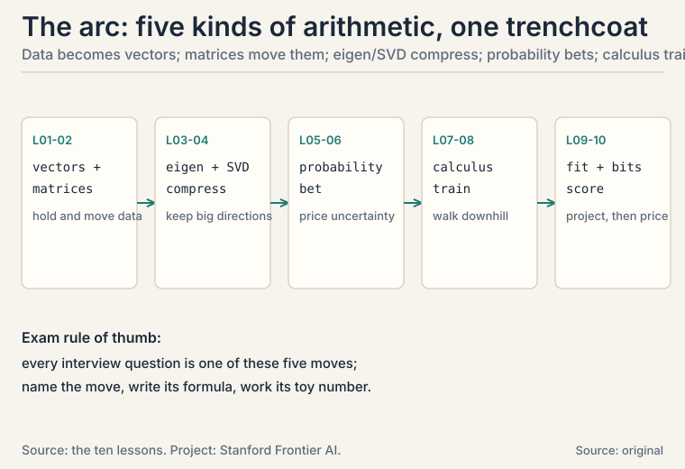
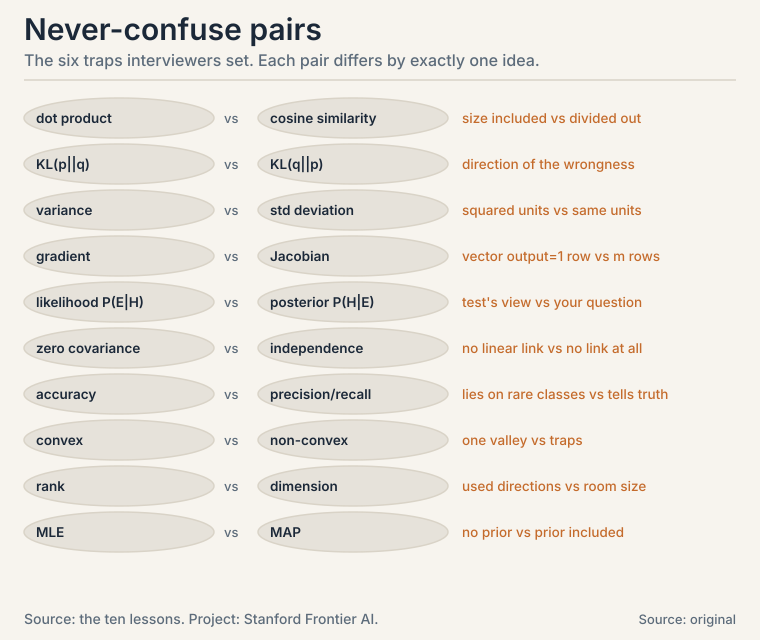
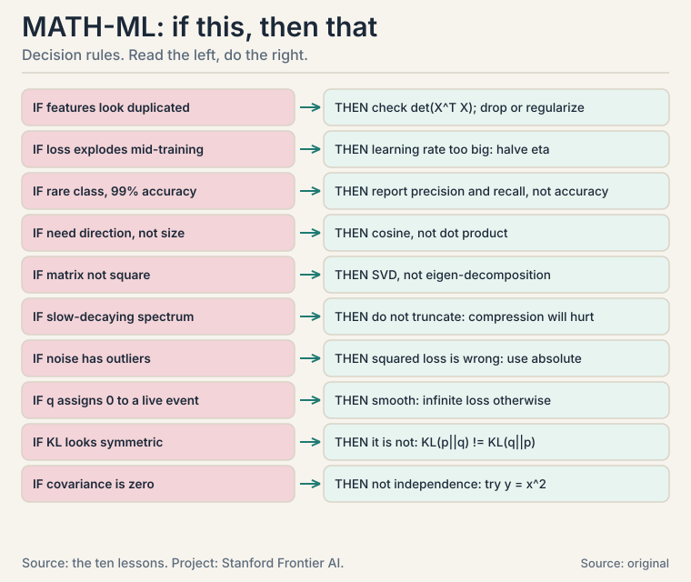

## The arc in one picture

Machine learning is five kinds of arithmetic wearing one
trenchcoat. Each lesson below is one idea plus the one number
that proves it. Read the number, trust the idea, follow the link
for the full story.

**1. Vectors hold data. The dot product compares it.** Two
reviews score agreement 3 by dot product. But a tripled review
scores 9 with no new content: length fooled the meter. Divide
both lengths out and both score 0.77: cosine similarity compares
direction alone. ([L01](l01-vectors-as-data.md))

**2. Matrices transform data. Projection is their kindest act.**
[3, 4] projected onto the x-axis is [3, 0]. The leftover [0, 4]
is perpendicular. Every prediction-error split in ML is this
picture in high dimensions. ([L02](l02-matrices-as-machines.md))

**3. Eigenvectors are the directions a matrix only stretches.**
For [2 1. 0 3]: [1, 1] triples, [1, 0] doubles. PCA
eigen-decomposes the covariance matrix and keeps the top
directions: four points with covariance [2 0. 0 0.5] compress
2-D to 1-D keeping 80% of the variance.
([L03](l03-eigendecomposition-pca.md))

**4. The SVD works on every matrix: rotation, stretch,
rotation.** A = [4 0. 3 0] splits into stretches 5 and 0: rank 1,
one dead direction. Drop a small singular value and the error
equals exactly what you dropped: the cheapest optimal
compression in ML. ([L04](l04-svd-low-rank.md))

**5. Bayes flips what tests tell you into what you want to know.**
A 95%-accurate test on a 1% disease gives an 8.8% posterior, not
95%: 990 false alarms drown 95 true hits. Posterior = likelihood
x prior, renormalized. ([L05](l05-probability-bayes.md))

**6. Three distributions run ML: Bernoulli, Binomial, Gaussian.**
Exactly 3 spam in 10 emails at p = 0.2: 0.201. Fitting parameters
by maximum likelihood is counting: 2 clicks in 5 impressions ->
p = 0.4. Covariance 1.33 on three collinear points. Correlated
features inflate variance. ([L06](l06-distributions-covariance.md))

**7. The chain rule trains networks.** Two weights, x = 2:
dy/dw2 = 6, dy/dw1 = 8, each verified by nudging. Backprop is the
chain rule run backward with reuse: one sweep gradients every
weight. ([L07](l07-calculus-gradients-chainrule.md))

**8. Convexity guarantees the valley. The step size decides if
you reach it.** On (x-3)^2 with eta = 0.1: 0 -> 0.6 -> 1.08, loss
x0.64 per step. With eta = 1.1: divergence, loss 9.0 -> 26.87.
Logistic regression's loss is convex: one bowl, no traps.
([L08](l08-convexity-gradient-descent.md))

**9. Least squares is projection with a formula.** Normal
equation X^T X w = X^T y: spring data gives w = 1.0357, residual
perpendicular to the features. Duplicate a feature and the
matrix goes singular: infinite solutions.
([L09](l09-least-squares-regression.md))

**10. Cross-entropy prices predictions in bits.** Truth [1,0],
prediction [0.7, 0.3]: 0.515 bits. Confident and wrong
[0.01, 0.99]: 6.64 bits. This loss trains logistic regression,
softmax classifiers, and every language model.
([L10](l10-information-theory.md)) [uncertain: supplement beyond
the playlist]

## One-glance formula table

| # | Name | Formula | The number |
|---|---|---|---|
| 1 | Cosine | (x.y)/(||x|| ||y||) | 0.77 |
| 2 | Projection | ((a.b)/(a.a)) a | [3, 0] |
| 3 | Eigen | Av = lv; det(A - lI) = 0 | l = 3, 2 |
| 4 | SVD | A = U S V^T; error = dropped s | s = 5, 0 |
| 5 | Bayes | P(H|E) = P(E|H)P(H)/P(E) | 8.8% |
| 6 | Binomial | C(n,k) p^k (1-p)^(n-k) | 0.201 |
| 7 | Backprop | downstream x local | dy/dw1 = 8 |
| 8 | GD | x -= eta * grad; eta < 2/L | eta = 1.1 diverges |
| 9 | Normal eq | X^T X w = X^T y | w = 1.0357 |
| 10 | Cross-entropy | -sum p log2 q | 0.515 bits |

## Memory aids

**Mnemonics (one per lesson):**

- L01: "Dot dives deep, cosine compares clean."
- L02: "Columns are where the axes land."
- L03: "Eigenvectors stand still while the matrix moves everything else."
- L04: "Rotation, stretch, rotation: every map, every matrix."
- L05: "Prior times likelihood, renormalized."
- L06: "Ways times per-way probability."
- L07: "Backward brings the signal."
- L08: "Loss explodes: halve eta first, ask later."
- L09: "Prediction is the shadow. Error is perpendicular."
- L10: "Cross-entropy is the bill. KL is the overcharge."

**Never-confuse pairs:**

**If-this-then-that:**

## Rapid-fire self-tests

Answer from memory, then check. If you miss one, re-read that
lesson: the number next to it tells you where.

**1.** A = [2,1,0], B = [1,1,1]. Dot product? Cosine?

Answer
Dot: 2+1+0 = 3. Cosine: 3/(2.24*1.73) = 0.77.

**2.** M = [0 -1. 1 0], v = [1,2]. Mv? What transformation is M?

Answer
[-2, 1]. Rotation by 90 degrees.

**3.** Eigenvalues of [2 1. 0 3]? Eigenvectors?

Answer
l = 3 with [1,1]; l = 2 with [1,0]. det gives (2-l)(3-l) = 0.

**4.** SVD of [4 0. 3 0]: singular values? Rank?

Answer
A^T A = [25 0; 0 0]: singular values 5 and 0. Rank 1.

**5.** 95%-accurate test, 1% prevalence, positive result. P(sick)?

Answer
8.8%. 95 true positives vs 990 false alarms: 95/1085.

**6.** P(exactly 3 spam of 10) at p = 0.2?

Answer
C(10,3) * 0.2^3 * 0.8^7 = 120 * 0.008 * 0.2097 = 0.201.

**7.** x = 2, w1 = 3, w2 = 4, y = w2*w1*x. dy/dw1?

Answer
8. Chain: dy/dh = 4, dh/dw1 = 2, product 8.

**8.** GD on (x-3)^2, x0 = 0. eta = 0.1: x1? eta = 1.1: what happens?

Answer
x1 = 0.6. eta = 1.1 exceeds the stability limit 1: diverges, loss 9.0 -> 26.87.

**9.** Spring data (1,1.1),(2,1.9),(3,3.2), model y = w x. Best w?

Answer
w = 14.5/14 = 1.0357 from X^T X w = X^T y.

**10.** Truth [1,0], prediction [0.7,0.3]. Cross-entropy in bits?

Answer
-log2(0.7) = 0.515 bits.

**11.** KL(p||q) = 0.189 for p = [0.25,0.75], q = [0.5,0.5]. Is KL(q||p) the same?

Answer
No: 0.208. KL is asymmetric, not a distance.

**12.** 100 features, 10 examples, least squares. What breaks?

Answer
X^T X is 100x100 with rank <= 10: singular, infinite solutions. Regularize or drop features.

## Exam-day checklist

- [ ] I can write every row of the formula table from memory, with its number.
- [ ] I can derive the normal equation in under two minutes.
- [ ] I can do the Bayes 8.8% computation without looking.
- [ ] I can state the never-confuse pairs and the one difference in each.
- [ ] I can name where each idea appears in a real system (the used-where tables).

## What to read next

- Training a classifier tomorrow? L05 -> L08 -> L10.
- Debugging embeddings or attention? L01 -> L02 -> L07.
- Compressing a model? L03 -> L04.
- The interview version? Every lesson ends with Q&A blocks
  written as an interviewer would ask them.
