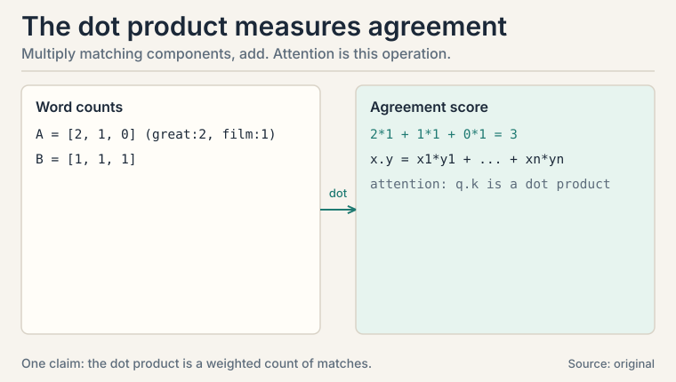
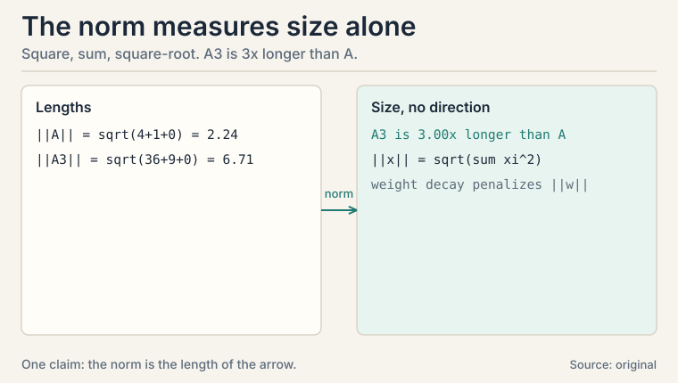
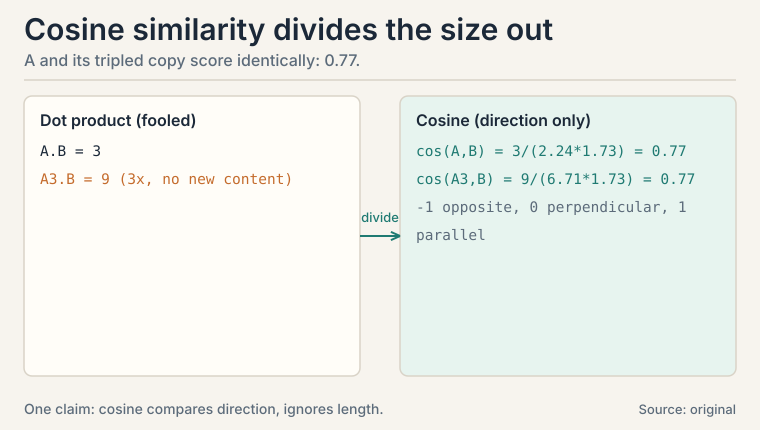
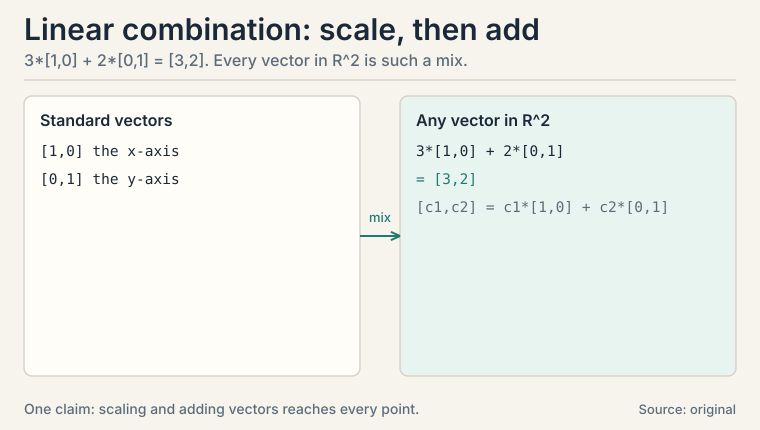
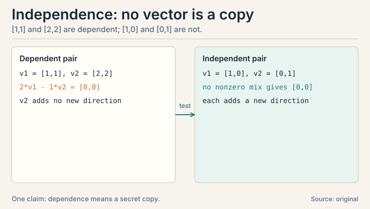
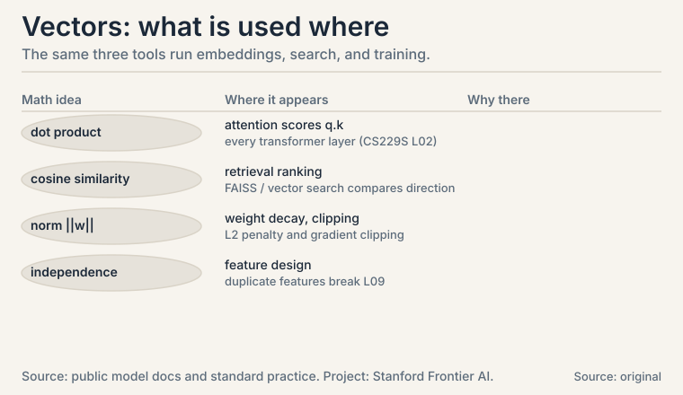

## The task: turn the world into numbers a machine can compare

A machine learning model cannot read a review, look at a photo, or hear
a word. It can only do arithmetic. So every modern ML system starts
with the same move: turn each object into a list of numbers. That list
is a **vector**.

```ascii
movie review -->  [ 0.9, -0.4,  0.2 ]   "glowing review"
movie review -->  [-0.8,  0.7, -0.3 ]   "angry review"
photo pixel  -->  [ 214,  96,  31 ]    orange-red pixel
```

A vector is an ordered list of numbers. Order matters: [1, 2] and
[2, 1] are different vectors. Each number is a **component**. A vector
with n components lives in a space called R^n, read "R n": R^2 is the
plane, R^3 is ordinary 3-D space, and language models live in R^12,288.
The vectors that turn words into lists of numbers are called
**embeddings**, and attention scores in the transformer are dot
products of embeddings (CS229S L02).

This lesson builds the three tools every ML system uses on vectors:
multiply two vectors together to measure agreement, measure a vector's
size, and compare directions while ignoring size.

## First attempt: count shared words

The simplest way to compare two documents is to count words. Make a
vector of word counts and compare the counts.

```ascii
review A: "great film, great acting"   --> [ great:2, film:1, boring:0 ]
review B: "great film, boring plot"    --> [ great:1, film:1, boring:1 ]
```

How similar are A and B? The shared words are "great" and "film".
Count them with weights: multiply the counts component by component
and add.

```ascii
agreement = 2*1 + 1*1 + 0*1 = 2 + 1 + 0 = 3
```

This operation has a name: the **dot product**. For vectors
x = [x1, x2, ..., xn] and y = [y1, y2, ..., yn],

```ascii
x . y = x1*y1 + x2*y2 + ... + xn*yn
```

It is the single most used operation in machine learning. Attention
compares queries to keys with it. Neurons sum weighted inputs with
it. Classifiers score examples with it.

But raw counts hide a trap. Watch what happens when one review is
just longer.

## Where counts break: size confuses the comparison

Take review A and a copy of it pasted three times, call it A3.

```ascii
A:  [2, 1, 0]
A3: [6, 3, 0]    (same opinions, three times the words)
B:  [1, 1, 1]
```

Score each against B with the dot product:

```ascii
A  . B = 2*1 + 1*1 + 0*1 = 3
A3 . B = 6*1 + 3*1 + 0*1 = 9
```

A3 scores three times higher, but it says nothing new. The dot
product mixed two things together: how much the directions agree,
and how long the vectors are. A long vector always wins, even when
it carries no extra meaning.

So we need a separate measure of size: the **norm**. The norm of a
vector is the square root of the sum of squared components:

```ascii
||x|| = sqrt(x1^2 + x2^2 + ... + xn^2)

||A||  = sqrt(4 + 1 + 0) = sqrt(5)  = 2.24
||A3|| = sqrt(36 + 9 + 0) = sqrt(45) = 6.71
```

(||x|| is the notation for "the norm of x".) The norm is the length
of the arrow if you draw the vector. A3 is three times longer than
A, which is exactly the trap: the dot product rewarded length.

### Subchapter: the dot product, by hand

Slow the operation down. Two vectors meet component by component.
Each pair multiplies: a large-times-large pair contributes a lot,
a large-times-small pair contributes little, and opposite signs
subtract. The sum is the total agreement.

```ascii
x = [ 3, -1, 2 ],  y = [ 2, 4, 1 ]

x . y = 3*2 + (-1)*4 + 2*1 = 6 - 4 + 2 = 4
```

Read 4: mostly agreement, partly canceled by the -1 vs 4 clash.
Now the zero case: x = [1, 0], y = [0, 1]. Dot product 0. The
vectors are perpendicular: no shared direction at all. And the
negative case: x = [1, 1], y = [-1, -1]. Dot product -2: pure
opposition.

Three facts to carry. The dot product is symmetric: x.y = y.x.
It is linear in each argument: doubling x doubles the answer.
And it is zero exactly when the vectors are perpendicular, which
is why "orthogonal" appears everywhere in ML: it means "these
two carry no shared signal."



### Subchapter: the norm, by hand

The norm answers one question: how big is this vector, ignoring
where it points. Square each component (signs vanish: -3 and 3
contribute equally), add, take the square root.

```ascii
v = [3, -4]:  ||v|| = sqrt(9 + 16) = sqrt(25) = 5
```

That is the 3-4-5 triangle: the norm is literally the arrow's
length. Two norms matter in ML beyond this default (the L2 norm).
The **L1 norm** sums absolute values: ||v||_1 = |3| + |-4| = 7.
The **max norm** takes the largest absolute component: 4. The L1
norm encourages sparsity (many exact zeros), which is why L1
regularization selects features. The L2 norm encourages small
weights everywhere, which is why L2 regularization (weight decay)
is the default.

Norms also police training. **Gradient clipping** rescales a
gradient when its norm exceeds a threshold: if ||g|| > 5, replace
g with 5 * g / ||g||. Without this, one bad batch can detonate
the weights. The norm is the fuse box.



## The key question

How do you compare two vectors by direction alone, so that a long
vector and a short vector pointing the same way count as identical?

### Subchapter: cosine similarity, by hand

The fix is one division. Divide the dot product by both norms.
The result is the **cosine similarity**, a number between -1 and 1
that measures direction only:

```ascii
cosine(x, y) = (x . y) / (||x|| * ||y||)

cosine(A, B)  = 3 / (2.24 * 1.73) = 3 / 3.88 = 0.77
cosine(A3, B) = 9 / (6.71 * 1.73) = 9 / 11.6 = 0.77
```

Identical. The length canceled out, as it should: A and A3 point
the same way. Cosine similarity is why a short tweet and a long
article about the same topic can be recognized as the same topic.
Search engines and recommendation systems live on this ratio.

The name comes from geometry: the dot product also equals
||x|| * ||y|| * cos(theta), where theta is the angle between the
two vectors. Parallel vectors give 1, perpendicular vectors give
0, opposite vectors give -1.

The trap inside the fix: cosine throws away size, and sometimes
size is the signal. A long detailed review may deserve more weight
than a two-word one. A common compromise: use cosine for ranking,
but keep the norm as a separate feature. Know what you discarded.



## Building blocks: linear combination and independence

Two more ideas complete the vector toolkit. Each is one small step
past the last.

### Subchapter: linear combination

A **linear combination** mixes vectors by scaling and adding. For
scalars c1, c2 and vectors v1, v2, the vector c1*v1 + c2*v2 is a
linear combination. The lecture's own example: in R^2, every vector
[c1, c2] is c1*[1,0] + c2*[0,1]. The vectors [1,0] and [0,1] are the
**standard vectors**. They are the pure axes.

```ascii
3 * [1, 0] + 2 * [0, 1] = [3, 0] + [0, 2] = [3, 2]
```

Every point in the plane is reachable this way. The set of all
points reachable from a set of vectors is their **span**. The span
of [1,0] and [0,1] is the whole plane. The span of [1,1] alone is
the diagonal line. Span answers: how much room do these vectors
cover.



### Subchapter: linear independence

**Linear independence** asks whether one vector in a set is secretly
a copy of the others. Vectors v1, ..., vk are **dependent** if some
mix c1*v1 + ... + ck*vk equals the zero vector with at least one
nonzero coefficient. The lecture's example: [1,1] and [2,2] are
dependent, because 2*[1,1] - 1*[2,2] = [0,0]. One is just twice the
other, so it adds no new direction.

Why does this matter for ML? A dataset where one feature is twice
another (say, price in dollars and price in cents) carries no extra
information. The second feature is a dependent vector. It wastes a
dimension and, as L09 shows, it can make regression break: the
normal equation goes singular.

The test: stack the vectors as rows of a matrix and row-reduce. A
zero row means dependence. The lecture works this on [1,1,8,1],
[1,0,3,0], [3,1,14,1] and finds a zero row: dependent [uncertain:
exact lecture arithmetic not recovered].



### Subchapter: embeddings, where vectors learn their components

So far the components were given: word counts, pixel values. The
modern move is to **learn** them. An **embedding** is a vector
whose components are trained, not counted. Word2vec trained
embeddings where king - man + woman lands near queen: directions
in the space encode meaning. The components have no names a human
assigned. Position 47 tracks whatever the training found useful.

This closes the loop on the lesson. Embeddings are compared with
the dot product (attention scores) and with cosine similarity
(retrieval ranking). Their norms are regularized during training.
And if two embedding dimensions become dependent, the model
wastes capacity: the same redundancy this lesson flagged in
count vectors.

| Tool | Formula | What it measures |
|---|---|---|
| Dot product | x . y = sum of xi*yi | Agreement, but mixed with size |
| Norm | \|\|x\|\| = sqrt(sum of xi^2) | Size only |
| Cosine similarity | (x . y) / (\|\|x\|\| \|\|y\|\|) | Direction only, between -1 and 1 |
| Linear combination | c1*v1 + ... + ck*vk | Mixing vectors by scaling and adding |
| Independence | no nonzero mix gives zero | Whether a vector adds a new direction |

## What is used where: the real systems

| Math idea | Where it appears | Why there |
|---|---|---|
| Dot product | Attention scores q.k (CS229S L02) | every transformer layer compares queries to keys |
| Dot product | Neuron: w.x + b | weighted sum is the neuron's whole job |
| Cosine similarity | Vector search (FAISS, Pinecone) | rank by direction; a tweet matches an article |
| Cosine similarity | Contrastive loss (CLIP) | pull matching pairs to cosine 1 |
| Norm | Weight decay (L2) | penalize \|\|w\|\| to keep weights small |
| Norm | Gradient clipping | rescale when \|\|g\|\| exceeds the threshold |
| Independence | Feature design | duplicate features break L09's normal equation |



> [!QA]
> Q: What is a vector, and why does ML use them for everything?
> A: A vector is an ordered list of numbers, like [0.9, -0.4, 0.2]. ML uses vectors because arithmetic is all a computer can do: a review, a pixel, or a word must become numbers before a model can touch it. Embeddings turn words into vectors in R^12,288, and attention scores are dot products between them.
> Follow-up: Why ordered? Why is [1, 2] different from [2, 1]?
> A: Because each position has a fixed meaning. In a word-count vector, position 1 might mean "great" and position 2 "boring". Swapping them swaps the meaning. In an embedding, position 47 tracks some learned property. Scrambling positions destroys the code.

> [!QA]
> Q: Walk me through the dot product on a concrete pair. What does each part do?
> A: Take x = [3, -1, 2], y = [2, 4, 1]. Multiply matching components: 3*2 = 6 (strong agreement), -1*4 = -4 (clash: opposite signs subtract), 2*1 = 2 (mild agreement). Sum: 6 - 4 + 2 = 4. The total says "mostly agreement, partly canceled." Each product is one feature's vote. The sum is the election.
> Follow-up: What does a dot product of zero mean geometrically?
> A: The vectors are perpendicular: they share no direction. In ML this reads as "no shared signal." Attention exploits it: a near-zero score becomes a near-zero weight after softmax, so the token is ignored.

> [!QA]
> Q: When do you use the dot product and when do you use cosine similarity?
> A: Use the dot product inside the model: attention scores, neuron sums, classifier margins. Use cosine similarity when comparing finished vectors, like ranking search results or measuring how close two embeddings are. In the worked toy, A and its tripled copy A3 scored 3 and 9 by dot product but both scored 0.77 by cosine. Cosine ignores the length. The dot product does not.
> Follow-up: Can the dot product be negative?
> A: Yes. A negative dot product means the vectors point in opposing directions: mostly disagreement. Cosine similarity maps this to -1. In attention this matters: a strongly negative score becomes a near-zero weight after softmax, so the model ignores that token.

> [!QA]
> Q: What does the norm measure, and why are there several of them?
> A: The default L2 norm measures the arrow's length: sqrt of summed squares. [3, -4] has norm 5. The L1 norm sums absolute values (7 here) and encourages sparsity: many exact zeros, which is why L1 regularization selects features. The L2 norm spreads shrinkage across all components, which is why L2 (weight decay) is the default regularizer.
> Follow-up: Where does the norm act as a safety device?
> A: Gradient clipping. If a gradient's norm exceeds a threshold, rescale it to the threshold. One bad batch can otherwise produce a giant gradient that detonates the weights. The norm is the fuse box of training.

> [!QA]
> Q: What does linear independence mean for a dataset?
> A: It means no feature is a copy of the others. [1,1] and [2,2] are dependent because 2*[1,1] - [2,2] = [0,0]. In a dataset, price-in-dollars and price-in-cents are dependent features: the second adds no direction. Dependent features waste dimensions and can make regression singular, which L09 demonstrates.
> Follow-up: How do you test it on real vectors?
> A: Stack them as rows of a matrix and row-reduce. If any row becomes all zeros, the set is dependent. The lecture works this exact procedure on [1,1,8,1], [1,0,3,0], [3,1,14,1] and finds a zero row: dependent.

> [!QA]
> Q: What is an embedding, and how is it different from a word-count vector?
> A: A word-count vector has human-assigned components: position 3 means "boring." An embedding's components are learned: training adjusts all 12,288 numbers so that useful directions emerge. Word2vec showed king - man + woman lands near queen: the space itself encodes meaning. Same vector arithmetic, but the machine chose the axes.
> Follow-up: Why do embeddings need so many dimensions?
> A: Each dimension is one learned property, and language has thousands of overlapping properties: tense, topic, sentiment, formality. Too few dimensions and independent meanings collide into dependent mush. The dimension is a capacity choice, and these lessons' tools (norms, cosine, independence) are how you audit whether the capacity is well used.

> [!QA]
> Q: Design a related-articles widget. Dot product or cosine?
> A: Cosine. Articles vary wildly in length, and the dot product would rank long articles above short relevant ones: the A3 trap at product scale. Compute embeddings once, store them, and rank candidates by cosine similarity to the current article. Keep the norms as a secondary signal if length correlates with quality in your domain.
> Follow-up: A new article arrives every second. How do you keep it fast?
> A: Precompute and index. Exact cosine over millions of vectors is too slow per query, so use an approximate nearest-neighbor index (FAISS, ScaNN): it partitions the space so each query checks a fraction of candidates. The math is still cosine. The index just skips the hopeless comparisons.

## Recap: the whole lesson on one screen

1. **The task.** Machines only do arithmetic, so objects become vectors: ordered lists of numbers.
2. **First attempt.** Compare documents by multiplying matching word counts and adding: the dot product, x . y = 3 in the toy.
3. **Where it breaks.** Length confuses the score: a tripled review scores 3x higher (9 vs 3) with no new content.
4. **Measure size separately.** The norm ||x|| = sqrt(sum of squares): ||A|| = 2.24, ||A3|| = 6.71. L1 sparsifies, L2 shrinks.
5. **The key question.** How to compare direction alone?
6. **The fix.** Cosine similarity divides out both sizes: 0.77 for A and A3 alike. Geometry agrees: it is the cosine of the angle. It discards size, so keep the norm as a separate signal when size matters.
7. **The building blocks.** Linear combinations mix vectors (span). Independence means no vector is a copy of the rest.
8. **Embeddings.** Learned vectors: the machine chooses the axes. Compared with dot products and cosines, regularized by norms.
9. **The price and the bridge.** Cosine throws away size, which sometimes matters. Keep both tools. L02 turns vectors into matrices: machines that transform whole datasets at once.

## Go deeper

<div style="position:relative;padding-bottom:56.25%;height:0;overflow:hidden;max-width:100%;margin:16px 0;">
<iframe style="position:absolute;top:0;left:0;width:100%;height:100%;" src="https://www.youtube-nocookie.com/embed/fNk_zzaMoSs" title="3Blue1Brown: Vectors, what even are they? (Essence of linear algebra, chapter 1)" frameborder="0" allow="accelerometer; autoplay; clipboard-write; encrypted-media; gyroscope; picture-in-picture" allowfullscreen></iframe>
</div>

- 3Blue1Brown, "Vectors, what even are they?" (Essence of linear algebra, ch. 1; the embed above): https://www.youtube.com/watch?v=fNk_zzaMoSs
- The NPTEL lecture for this lesson (frontmatter video): https://www.youtube.com/watch?v=Y1Gndz4sNeE
- Deisenroth, Faisal, Ong, "Mathematics for Machine Learning", ch. 2 (free): https://mml-book.github.io: vectors, norms, dot products, independence.
- Strang, "Introduction to Linear Algebra", ch. 1: the geometric view.

## Official sources and further reading

**Official:**
- "Essential Mathematics for Machine Learning" playlist, Lecture 01 (this lesson's video): [paper](https://www.youtube.com/watch?v=Y1Gndz4sNeE)
- NPTEL course page (111107137): https://nptel.ac.in/courses/111107137

**Further reading:**
- Deisenroth, Faisal, Ong, "Mathematics for Machine Learning", ch. 2 (free):
  - [vectors, norms, dot products, independence.](https://mml-book.github.io)
- Strang, "Introduction to Linear Algebra", ch. 1: the geometric view.

**Caveats.** The lecture-1 transcript was recovered in full. Its vector definitions, dot product, linear combination, and independence examples are quoted above as the lecture presents them. The cosine-similarity framing is standard material consistent with Lectures 01/07. The exact toy numbers are the lesson's own. [uncertain]

## Connections to the other courses

- **CS229S L02:** attention scores are dot products of query and key embeddings. This lesson is the arithmetic underneath.
- **CS336:** token embeddings are vectors in R^d. Cosine similarity ranks nearest neighbors in embedding space.
- **CS229 L10:** PCA starts by centering data vectors. Norms measure reconstruction error.
