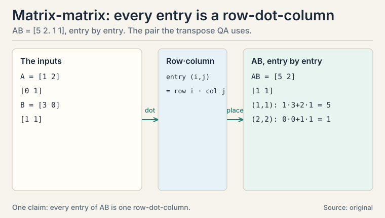
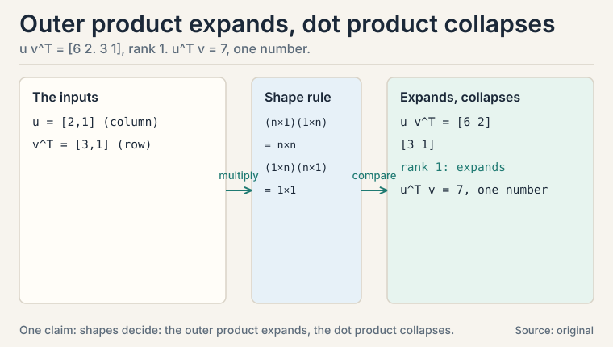
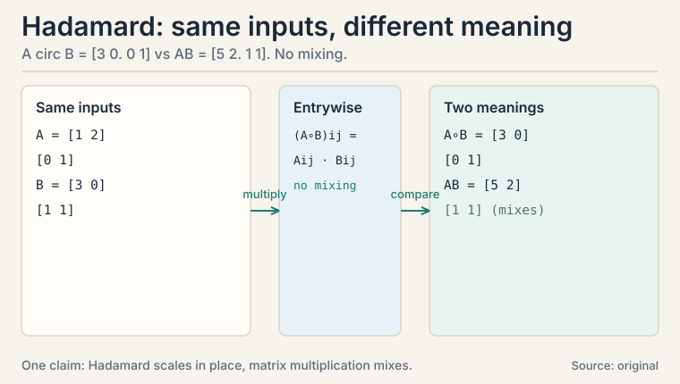
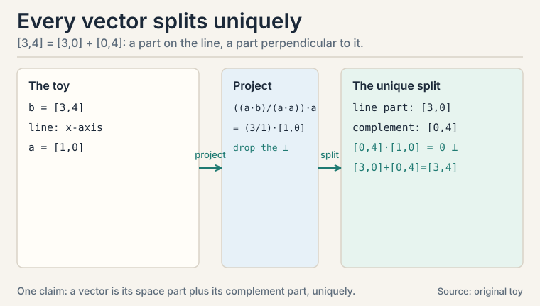

## The task: transform a whole dataset at once

L01 turned objects into vectors. Now a harder job: transform every
vector in a dataset the same way. Rotate all photos by 90 degrees.
Compress all embeddings from 512 numbers to 50. Score all examples
with one classifier.

Doing this vector by vector is slow and unreadable. The lecture's
answer is a **matrix**: a rectangular grid of numbers that acts as
a machine. Feed it a vector, it returns a transformed vector. Feed
it a million vectors, it transforms all of them.

```ascii
matrix M (2 x 2)      vector v        result
[ 0  -1 ]             [ 1 ]           [ 0*1 + -1*2 ]   [ -2 ]
[ 1   0 ]    x        [ 2 ]    =      [ 1*1 +  0*2 ] = [  1 ]
```

That matrix rotated [1, 2] by 90 degrees. The rule for the
multiplication: each row of the matrix takes a dot product with the
vector. Row 1 dot v is the first answer, row 2 dot v is the second.
A 2x2 matrix maps R^2 to R^2. An m x n matrix maps R^n to R^m:
n numbers in, m numbers out.

A matrix is also a **linear transformation**: it keeps straight
lines straight and the origin fixed. Doubling the input doubles the
output. Adding two inputs then transforming equals transforming
then adding. That is all "linear" means here.

## First attempt: write the transformation as code

Before matrices, you might write the rotation as a function:

```ascii
rotate(v): return [-v[1], v[0]]
```

This works for one transformation. But now compose two: rotate,
then scale by 2. The code becomes nested calls, and for a
10,000-dimensional embedding it is unreadable. Worse, a GPU cannot
see the structure: it needs the transformation as data, not as
code, so it can run it on thousands of vectors in parallel.

## Where code breaks: composition and batches

Two problems. First, chaining transformations by hand is error
prone: three nested functions for rotate-scale-project, each with
its own index bugs. Second, hardware wants rectangles. A GPU
multiplies matrices millions of times per second. It cannot
accelerate your custom Python loop.

The matrix fixes both. Composition becomes multiplication: to apply
A then B, multiply the matrices once (BA) and apply the result.
Batching becomes free: stack vectors as columns of a matrix X, and
MX transforms the whole batch in one call.

## The key question

What is the one multiplication rule from which rotation, scaling,
projection, and every neural network layer all follow?

### Subchapter: the multiplication rule, by hand

Watch the rule once, slowly, on a 2x2 matrix:

```ascii
M = [ 2  1 ]    v = [ 3 ]       M v = [ 2*3 + 1*4 ] = [ 10 ]
    [ 0  3 ]        [ 4 ]             [ 0*3 + 3*4 ]   [ 12 ]
```

Read it two ways. Row view: each row dots with v. Column view:
M v = 3 * [2, 0] + 4 * [1, 3]. The answer is a linear combination
of the matrix's columns, weighted by v's components. So the
columns of M are where the axes land: the x-axis [1, 0] lands on
column 1, the y-axis [0, 1] lands on column 2. A matrix is fully
described by where it sends the axes.

Which view when? The row view computes: it is how code does it.
The column view understands: it shows what the transformation
does to space. Interviewers switch views mid-question. Practice
both until the switch is instant.


### Subchapter: matrix-matrix multiplication, by hand

The same rule handles matrix times matrix. Each entry of the
answer is one row-dot-column:

```ascii
A = [ 1  2 ]    B = [ 3  0 ]
    [ 0  1 ]        [ 1  1 ]

AB = [ 1*3+2*1  1*0+2*1 ] = [ 5  2 ]
     [ 0*3+1*1  0*0+1*1 ]   [ 1  1 ]
```

Read entry (1,1): row 1 of A dots column 1 of B: 1*3 + 2*1 = 5.
Entry (2,2): row 2 of A dots column 2 of B: 0*0 + 1*1 = 1. Four
entries, four dot products. This is the same pair the transpose
QA below uses: verify AB once here and the (AB)^T identity
follows.

The cost law: multiplying two n x n matrices takes n^3 multiply
adds with the naive rule. That cubic cost is why batch sizes,
layer widths, and attention's n^2 memory all become engineering
budgets in the systems courses.



### Subchapter: the four matrices you will meet everywhere

```ascii
identity: [ 1 0 ]          scale x by 2: [ 2 0 ]
          [ 0 1 ]                         [ 0 1 ]

rotation 90 deg: [ 0 -1 ]  projection onto x-axis: [ 1 0 ]
                 [ 1  0 ]                          [ 0 0 ]
```

The identity does nothing: Iv = v. The scaler stretches one axis.
The rotation turns the plane. The projection kills the y-component:
[3, 4] becomes [3, 0]. The vector's shadow on the x-axis.

Memorize these four the way you memorize multiplication tables.
Every matrix you meet in ML is a combination of these moves, and
recognizing them by sight is the difference between reading a
formula and understanding it.

### Subchapter: composition is multiplication

Apply A (rotate 90) then B (scale by 2) to v = [1, 2]:

```ascii
A v = [-2, 1]          (rotate)
B(Av) = [-4, 2]        (scale)
```

Now multiply the matrices once: BA = [0 -2. 2 0]. Apply to v:
(BA)v = [-4, 2]. Same answer. The product BA is the single matrix
that does both steps. This is why matrix multiplication is defined
the "strange" way: rows times columns is exactly the rule that
makes (BA)v = B(Av) come out right.

Order matters. AB means "apply B first, then A": the rightmost
matrix acts first. And AB almost never equals BA: rotate-then-scale
differs from scale-then-rotate. Assuming commutativity is the
classic bug in derivations.


### Subchapter: the outer product, a matrix from two vectors

Multiply a column vector by a row vector and you get a matrix.
This is the **outer product**: u v^T.

```ascii
u = [ 2 ]    v^T = [ 3  1 ]
    [ 1 ]

u v^T = [ 2*3  2*1 ] = [ 6  2 ]
        [ 1*3  1*1 ]   [ 3  1 ]
```

Every column is a scaled copy of u: the matrix has rank 1. Do not
confuse it with the dot product: u^T v is one number (2*3 + 1*1
= 7), while u v^T is a whole matrix. The dot product collapses.
The outer product expands.

Where it appears: attention's score matrix QK^T is built from
outer products. Each query-key pair contributes one outer
product to the grid. Rank-1 updates in optimizers and LoRA (defined in L04) are outer
products too: BA is a sum of r outer products, one
per rank. Interviewers test the distinction with
one question: "u^T v or u v^T?" The shapes decide: (n x 1) times
(1 x n) gives n x n.



### Subchapter: the Hadamard product, elementwise is not matrix multiplication

A third "multiplication" exists: the **Hadamard product**, also
called the elementwise product. It multiplies matching entries
only, with no mixing across rows and columns:

```ascii
A = [ 1  2 ]    B = [ 3  0 ]
    [ 0  1 ]        [ 1  1 ]

A circ B = [ 1*3  2*0 ] = [ 3  0 ]
           [ 0*1  1*1 ]   [ 0  1 ]
```

Compare with AB = [5 2. 1 1] from the earlier subchapter. Same
inputs, different answer, different meaning. Matrix
multiplication mixes rows with columns: it composes
transformations. The Hadamard product never mixes: it scales each
entry in place.

Where it appears: gating. An LSTM's forget gate multiplies the
cell state elementwise: each memory cell is scaled by its own
gate value, with no cross-talk between cells. Attention masks
work the same way. Decision rule: when a formula says
"multiply," check the shapes. Identical shapes and no mixing
intended: elementwise. Inner dimensions meeting (m x n times
n x p): matrix multiplication.



### Subchapter: batching is free

Stack 1,000 vectors as columns of a 2x1000 matrix X. One call, MX,
transforms all of them. The GPU sees a rectangle and parallelizes
across columns. This is why neural networks process batches, not
examples: the hardware's native language is matrix-matrix
multiplication, and a batch is just a wide matrix.

## Projection by hand: the shadow formula

**Projection** answers: what is the closest point on a line to a
given vector? Drop the perpendicular from the vector to the line.
The foot of that perpendicular is the projection.

Project b = [3, 4] onto the direction a = [1, 0] (the x-axis).
The formula: scale a by the amount of b that lies along a.

```ascii
projection = ((a . b) / (a . a)) * a

a . b = 1*3 + 0*4 = 3
a . a = 1*1 + 0*0 = 1
projection = (3 / 1) * [1, 0] = [3, 0]
```

The leftover, b minus the projection = [0, 4], is perpendicular to
the line. That leftover has a name: it lives in the **orthogonal
complement**, the set of all vectors perpendicular to the line.
Every vector splits into a part along the line and a part
perpendicular to it. Nothing is lost: [3, 0] + [0, 4] = [3, 4].

Now the payoff. Least squares regression (L09) is exactly this
picture in high dimensions. The data vector y usually does not lie
in the column space of the feature matrix X. So you project y onto
that space. The projection is the prediction. The leftover is the
error, perpendicular to everything the model can express. The
normal equation X^T X w = X^T y is the projection formula written
in matrix form.


### Subchapter: the orthogonal complement

The orthogonal complement of a line in R^2 is the perpendicular
line. Of a plane in R^3, the perpendicular line. In general: the
set of all vectors perpendicular to every vector in the space.
Dimension check: a k-dimensional space in R^n has an (n-k)
dimensional complement. Nothing overlaps, nothing is missing:
every vector splits uniquely into a part in the space and a part
in its complement, and the two parts add back to the original.

Why care? The complement is where the error lives. In least
squares, the residual is perpendicular to the column space: it
sits entirely in the complement. "The error is orthogonal to the
model's reach" is the geometric sentence the normal equation
encodes.



### Subchapter: the transpose

The **transpose** M^T flips a matrix across its diagonal: rows
become columns. [2, 1. 0, 3]^T = [2, 0. 1, 3]. Two facts matter:

- (AB)^T = B^T A^T. Order flips, like taking off shoes then socks.
- M^T M is always symmetric and never has negative eigenvalues.
  Covariance matrices are built this way: X^T X.

The transpose is the quiet hero of the next lessons: it appears in
the normal equation (L09), in covariance (L03), and in the SVD
(L04). Whenever you see M^T M, read "M measuring itself": the
(i,j) entry is column i dot column j, the agreement between two
features.

^T = B^T A^T: both equal [5 1. 2 1]. Order flips. Shell 2. Source: original toy. Project: Stanford Frontier AI.")

### Subchapter: (AB)^T = B^T A^T, proved entry by entry

The toy check proved the identity for one pair. Prove it for
every n by n pair. You need one notation: M_ij names the entry
in row i, column j. In this language, the transpose swaps the
indices: (M^T)_ij = M_ji. The entry in row i, column j of the
flipped matrix is the entry in row j, column i of the original.

Matrix multiplication reads the same way:

```ascii
(AB)_ij = sum_k A_ik B_kj        (k runs 1..n)
```

Entry (i,j) of the product is row i of A dotted with column j
of B. The index k picks out one term of that dot product.

Run the lesson's toy through the index form. A = [1 2. 0 1],
B = [3 0. 1 1]. With n = 2, each entry sums two terms:

```ascii
(AB)_11 = A_11 B_11 + A_12 B_21 = 1*3 + 2*1 = 5
(AB)_12 = A_11 B_12 + A_12 B_22 = 1*0 + 2*1 = 2
```

The earlier check that AB = [5 2. 1 1] was this formula with
n = 2: nothing more.

Now drop the 2. Left side: the (i,j) entry of the transposed
product. ((AB)^T)_ij = (AB)_ji by the transpose rule, and
(AB)_ji = sum_k A_jk B_ki by the multiplication rule. Read it
slowly: the entry (i,j) of the flipped product is row j of A
dotted with column i of B.

Right side: the (i,j) entry of B^T A^T. The multiplication
rule gives (B^T A^T)_ij = sum_k (B^T)_ik (A^T)_kj. Swap each
transposed entry back to the original: (B^T)_ik = B_ki and
(A^T)_kj = A_jk. So (B^T A^T)_ij = sum_k B_ki A_jk.

Compare the two sums term by term. Left: sum_k A_jk B_ki.
Right: sum_k B_ki A_jk. The k-th term of each is the product
of the same two numbers in different order. Ordinary numbers
commute, so every term matches, so the sums match. The (i,j)
entries agree for every i and j. Two matrices with equal
entries are equal. So (AB)^T = B^T A^T, for every n.

The shoes-socks intuition survives the proof. Reversing a
product of operations must reverse their order, and the index
algebra shows exactly where the reversal happens: (AB)_ji
pairs row j of A with column i of B, while (B^T A^T)_ij pairs
row i of B^T with column j of A^T, the same pairs in reversed
order. The carry: when a matrix identity is in doubt, write
both sides as entry sums and compare. That is the move every
derivation in the coming lessons uses.

| Matrix | What it does to [1, 2] | Columns = images of axes |
|---|---|---|
| Identity | [1, 2], unchanged | axes stay put |
| [2 0; 0 1] | [2, 2], x stretched | x-axis doubles |
| [0 -1; 1 0] | [-2, 1], rotated 90 deg | axes swap and flip |
| [1 0; 0 0] | [1, 0], shadow on x-axis | y-axis collapses to zero |

## What is used where: the real systems

| Math idea | Where it appears | Why there |
|---|---|---|
| Matrix multiply | Linear layers (every network) | Wx + b is the layer; batches make it matrix-matrix |
| Wq, Wk, Wv | Attention (CS229S L02) | three learned projections per layer |
| Embedding table | Token lookup (CS336) | a matrix whose rows are token vectors |
| Composition BA | Deep stacks | layers compose by multiplication |
| Projection | Least squares (L09) | prediction is the shadow on the column space |
| M^T M | Covariance, normal equation | symmetric, nonnegative eigenvalues |

)) one at a time, the GPU idles. Center: the product: AB entry = row dot column, AB = [5 2; 1 1]. Right: matrix-matrix: X is 2x1000, one call MX, GPU parallelizes columns. Bottom: the rectangle must fit the hardware; composition is paid once, then amortized. Dense chapter plate. Source: original synthesis of the lesson. Project: Stanford Frontier AI.")

> [!QA]
> Q: What does it mean to say a matrix is a linear transformation?
> A: It means the matrix keeps the origin fixed and straight lines straight. Doubling the input doubles the output. Transforming a sum equals the sum of the transforms. In the toy, M = [2 1. 0 3] sent [3, 4] to [10, 12], and it would send [6, 8] to [20, 24]: exactly double. Neural network layers are matrices plus a nonlinearity, so this linearity is the skeleton under every layer.
> Follow-up: Is every function from R^n to R^m a matrix?
> A: No. Only the linear ones. The moment you add a constant shift or a curve (like a sigmoid), no single matrix can express it. That is why neural nets alternate: matrix, nonlinearity, matrix, nonlinearity.

> [!QA]
> Q: Walk me through matrix-vector multiplication two ways.
> A: Take M = [2 1. 0 3], v = [3, 4]. Row view: row 1 dots v: 2*3 + 1*4 = 10. Row 2 dots v: 0*3 + 3*4 = 12. Answer [10, 12]. Column view: 3 * [2, 0] + 4 * [1, 3] = [6, 0] + [4, 12] = [10, 12]. Same answer. The row view is how you compute. The column view shows the answer is a mix of the columns, weighted by v.
> Follow-up: What does that tell you about the columns?
> A: They are where the axes land. Column 1 is M[1, 0] = [2, 0]: the x-axis lands there. Column 2 is M[0, 1] = [1, 3]: the y-axis lands there. A matrix is fully described by where it sends the axes.

> [!QA]
> Q: Why is matrix multiplication defined so strangely, rows times columns?
> A: Because it means composition. If M rotates and N scales, then NM applied to v means "scale, then rotate", and the row-times-column rule makes (NM)v = N(Mv) come out right. The column view is the intuitive one: Mv is a linear combination of M's columns, weighted by v.
> Follow-up: Does AB equal BA?
> A: Almost never. Rotate then scale differs from scale then rotate. Matrix multiplication is associative, (AB)C = A(BC), but not commutative. Interviewers probe this because assuming commutativity is the classic bug in derivations.

> [!QA]
> Q: What is a projection, and why does least squares need it?
> A: A projection drops a perpendicular from a vector onto a line or plane and takes the landing point. In the toy, [3, 4] projected onto the x-axis is [3, 0], with leftover [0, 4] perpendicular to the axis. Least squares is this in high dimensions: the target vector y rarely lies in the feature matrix's column space, so you project it there. The projection is the prediction. The perpendicular leftover is the error.
> Follow-up: What is the orthogonal complement?
> A: Everything perpendicular to the given space. For the x-axis in R^2, it is the y-axis. Every vector splits uniquely into a part in the space and a part in its complement, and the two parts add back to the original. No information is lost in the split.

> [!QA]
> Q: Prove (AB)^T = B^T A^T on a concrete pair.
> A: Take A = [1 2. 0 1], B = [3 0. 1 1]. AB = [5 2. 1 1], so (AB)^T = [5 1. 2 1]. Now B^T A^T = [3 1. 0 1] [1 0. 2 1] = [5 1. 2 1]. Equal. The intuition: transposing reverses the order of operations, like undoing "socks then shoes" as "shoes then socks."
> Follow-up: Why is M^T M special?
> A: It is always symmetric, and its eigenvalues are never negative. The (i,j) entry is column i dot column j: the matrix measuring its own columns' agreements. Covariance matrices and the normal equation's X^T X are built exactly this way, which is why both inherit those nice properties.

> [!QA]
> Q: Why do neural networks process batches instead of single examples?
> A: Because the hardware's native language is matrix-matrix multiplication. Stack 1,000 vectors as columns of X. One call MX transforms all of them, and the GPU parallelizes across columns. Single-example loops leave thousands of cores idle. Batching is not a convenience: it is how you feed the machine rectangles.
> Follow-up: Does batching change the math?
> A: No. Each column is transformed independently: column j of MX is M times column j of X. The batch is just bookkeeping that the hardware can parallelize. Gradients average over the batch the same way.

> [!QA]
> Q: A formula multiplies two vectors. How do you know which multiplication it means?
> A: Check the shapes. Same shape in, same shape out: Hadamard (elementwise), like a gate scaling each memory cell. Inner dimensions meeting (m x n times n x p): matrix multiplication, which mixes rows with columns and composes transformations. Column times row (n x 1 times 1 x n): outer product, which builds a rank-1 matrix. In the toy, AB = [5 2. 1 1] but A circ B = [3 0. 0 1]: same inputs, different operations, different answers.
> Follow-up: Where do outer products appear in transformers?
> A: The attention score matrix QK^T is a sum of outer products: each entry is a query-key dot product, and the whole grid is queries times keys-transposed. LoRA's update BA is also a sum of outer products: rank r means r rank-1 pieces added together.

> [!QA]
> Q: You need to apply "rotate 90, then scale x by 2, then project onto the x-axis" to a million vectors. How?
> A: Multiply the three matrices once, then apply the single product to the batch. R = [0 -1. 1 0], S = [2 0. 0 1], P = [1 0. 0 0]. The composed matrix PSR = [0 -2. 0 0]: one multiplication per vector instead of three, and one batched call for all million. Composition first, application second: that order is the whole point of the multiplication rule.
> Follow-up: The pipeline changes per request. Now what?
> A: Then precomputation buys nothing and you apply the matrices in sequence. The decision rule: compose when the pipeline is fixed and reused. Stream when it varies. Same math, different economics.

## Recap: the whole lesson on one screen

1. **The task.** Transform whole datasets at once: rotate, scale, project, score.
2. **First attempt.** Write each transformation as code. It works once.
3. **Where it breaks.** Chaining by hand breeds index bugs. GPUs need rectangles, not loops.
4. **The key question.** One multiplication rule for rotation, scaling, projection, and network layers?
5. **The new idea.** Rows dot the vector. Equivalently, the answer is a mix of the columns weighted by the input. Columns are where the axes land.
6. **The four matrices.** Identity, scale, rotation, projection: memorize by sight.
7. **Composition.** (BA)v = B(Av). Order matters. AB != BA. Batching is free: MX transforms all columns at once. Matrix-matrix: each entry is a row-dot-column, at n^3 cost. Outer product expands to a rank-1 matrix. Hadamard scales entries in place with no mixing.
8. **Projection by hand.** [3, 4] onto the x-axis: ((a.b)/(a.a)) * a = [3, 0]. Leftover [0, 4] is perpendicular. The complement holds the error.
9. **The transpose.** (AB)^T = B^T A^T, verified on numbers. M^T M is symmetric with nonnegative eigenvalues.
10. **The price and the bridge.** Matrices only do linear maps. Curves need nonlinearities between layers. L03 asks what happens when a matrix acts on its own favorite vectors: eigenvalues.

## Go deeper

<div style="position:relative;padding-bottom:56.25%;height:0;overflow:hidden;max-width:100%;margin:16px 0;">
<iframe style="position:absolute;top:0;left:0;width:100%;height:100%;" src="https://www.youtube-nocookie.com/embed/kYB8IZa5AuE" title="3Blue1Brown: Linear transformations and matrices (Essence of linear algebra, chapter 3)" frameborder="0" allow="accelerometer; autoplay; clipboard-write; encrypted-media; gyroscope; picture-in-picture" allowfullscreen></iframe>
</div>

- 3Blue1Brown, "Linear transformations and matrices" (Essence of linear algebra, ch. 3, the embed above): https://www.youtube.com/watch?v=kYB8IZa5AuE
- The NPTEL lecture for this lesson (frontmatter video): https://www.youtube.com/watch?v=VviJTNbznjE
- Deisenroth, Faisal, Ong, "Mathematics for Machine Learning", ch. 2.3-2.4 (free): https://mml-book.github.io: matrix multiplication, transpose, linear maps.
- Strang, "Introduction to Linear Algebra", ch. 2 (elimination), ch. 4 (orthogonality, projections).

## Official sources and further reading

**Official:**
- "Essential Mathematics for Machine Learning" playlist, Lecture 02 (this lesson's video): [paper](https://www.youtube.com/watch?v=VviJTNbznjE)
- NPTEL course page (111107137): https://nptel.ac.in/courses/111107137

**Further reading:**
- Deisenroth, Faisal, Ong, "Mathematics for Machine Learning", ch. 2.3-2.4 (free):
  - [matrix multiplication, transpose, linear maps.](https://mml-book.github.io)
- Strang, "Introduction to Linear Algebra", ch. 2 (elimination), ch. 4 (orthogonality, projections).

**Caveats.** Projection formula and transpose identities are standard. The toy numbers are the lesson's own. The lecture's exact worked examples are [uncertain] (transcripts for L02/L06/L08 were not recovered).

## Connections to the other courses

- **CS229 L02/L03:** least squares is projection. The normal equation is the projection formula in matrix form. L09 works it.
- **CS229S L02:** the attention score matrix QK^T is a matrix product. Softmax (defined in L01: it turns scores into weights that sum to 1) converts each score row into a weight row. Each output row is then a linear combination of the value rows.
- **CS336:** every linear layer is a matrix multiply. The embedding table is a matrix whose rows are token vectors.

## Coverage map

Every lecture concept, and where this lesson covers it:

| Lecture concept | Covered in | Lines |
|---|---|---|
| matrix as machine, linear transformation | The task: transform a whole dataset at once | l02:28-56 |
| transformation as code, first attempt | First attempt: write the transformation as code | l02:57-70 |
| where code breaks: composition, batches, GPUs | Where code breaks | l02:71-83 |
| matrix-vector multiplication, row view and column view | Subchapter: the multiplication rule, by hand | l02:89-113 |
| matrix-matrix multiplication by hand, n^3 cost law | Subchapter: matrix-matrix multiplication, by hand | l02:114-139 |
| identity, scale, rotation, projection matrices | Subchapter: the four matrices | l02:140-158 |
| composition as multiplication, AB vs BA | Subchapter: composition is multiplication | l02:159-180 |
| outer product, rank-1, dot vs outer | Subchapter: the outer product | l02:181-208 |
| Hadamard (elementwise) product, gating | Subchapter: the Hadamard product | l02:209-238 |
| batching as matrix-matrix multiplication | Subchapter: batching is free | l02:239-246 |
| projection formula, worked on [3, 4] | Projection by hand: the shadow formula | l02:247-279 |
| orthogonal complement, error lives there | Subchapter: the orthogonal complement | l02:280-295 |
| transpose, (AB)^T = B^T A^T, M^T M | Subchapter: the transpose | l02:296-319 |
| what is used where: layers, attention, least squares | What is used where | l02:320-332 |
| 8 interview Q&As with follow-ups | QA blocks | l02:333-380 |
| full-lesson recap | Recap | l02:381-392 |
