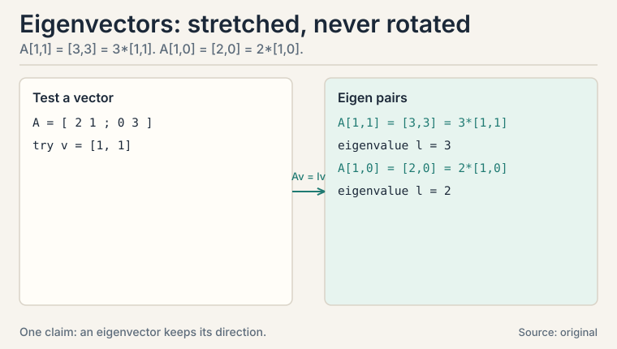
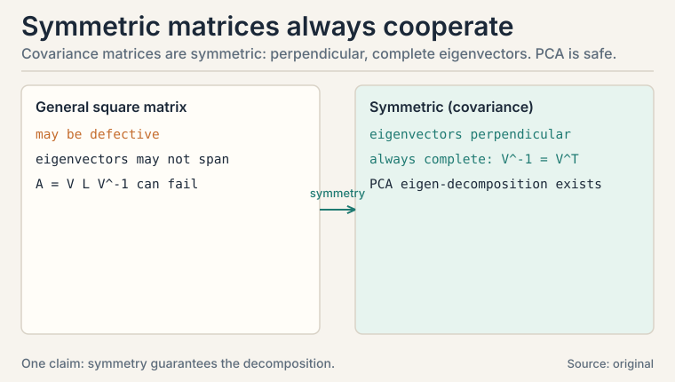
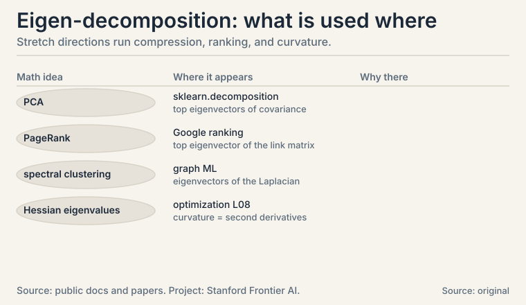

## The task: find the directions a matrix leaves alone

Apply a matrix to a vector and the vector usually rotates to a new
direction. But some matrices have special vectors that refuse to
rotate: the matrix only stretches or shrinks them. Those vectors
are **eigenvectors**, and the stretch factors are **eigenvalues**.

Why hunt for them? Because a matrix's action on its eigenvectors
reveals its whole character. In ML the starring example is the
**covariance matrix** of a dataset. Its eigenvectors are the
directions of greatest spread in the data, and its eigenvalues say
how much spread each direction holds. That is **PCA**, principal
component analysis: the most used dimensionality reduction in ML
(CS229 L10).

### Subchapter: the diagonal case, where it is trivial

Take the simplest matrix, a diagonal one:

```ascii
A = [ 2  0 ]    v = [ 1 ]        A v = [ 2*1 + 0*0 ] = [ 2 ] = 2 * [ 1 ]
    [ 0  3 ]        [ 0 ]              [ 0*1 + 3*0 ]   [ 0 ]         [ 0 ]
```

The x-axis vector [1, 0] stays on the x-axis, stretched by 2. The
y-axis vector [0, 1] stays on the y-axis, stretched by 3. Both are
eigenvectors. The eigenvalues are 2 and 3. For a diagonal matrix,
life is easy: the axes are the eigenvectors and the diagonal holds
the eigenvalues.

But real covariance matrices are not diagonal. The data's spread
runs at an angle. So we need the general method.

## The key question

Given any square matrix, how do you find the vectors it only
stretches, and by how much?

### Subchapter: the defining equation

An eigenvector v and eigenvalue lambda (the Greek letter lambda)
satisfy one equation:

```ascii
A v = lambda * v
```

The matrix acts, and the vector comes back pointing the same way,
scaled by lambda. Rearranged: (A - lambda*I) v = 0, where I is the
identity. A nonzero v solves this only when (A - lambda*I) squashes
some direction flat, which happens exactly when its determinant is
zero. That condition, det(A - lambda*I) = 0, is the **characteristic
equation**. Its roots are the eigenvalues.



### Subchapter: the characteristic equation, step by step

Watch it on a real 2x2, by hand. The matrix stretches x by 2 and
shears upward:

```ascii
A = [ 2  1 ]
    [ 0  3 ]

step 1, characteristic equation:
  det([ 2-lambda,  1        ]) = (2-lambda)(3-lambda) - 0 = 0
     ([ 0,         3-lambda ])
  eigenvalues: lambda1 = 3, lambda2 = 2
```

The determinant of a 2x2 is ad - bc: (2-lambda)(3-lambda) - 1*0.
Set it to zero, solve: lambda = 2 or 3. For larger matrices the
characteristic equation is a higher-degree polynomial, and you
solve it numerically: nobody hand-solves a 100x100 characteristic
polynomial.

 = (2-l)(3-l) = 0 gives l = 3 and l = 2. Shell 3. Source: original toy. Project: Stanford Frontier AI.")

### Subchapter: eigenvectors by hand, verified

```ascii
step 2, eigenvector for lambda1 = 3:
  [ 2-3  1 ] [ x ] = [ -x + y ] = [ 0 ]   -->  y = x
  [ 0   0 ] [ y ]   [   0    ]   [ 0 ]
  eigenvector: v1 = [ 1, 1 ]     check: A v1 = [ 3, 3 ] = 3 * v1

step 3, eigenvector for lambda2 = 2:
  [ 0  1 ] [ x ] = [ y ] = [ 0 ]   -->  y = 0
  [ 0  1 ] [ y ]   [ y ]   [ 0 ]
  eigenvector: v2 = [ 1, 0 ]     check: A v2 = [ 2, 0 ] = 2 * v2
```

Read the result. Along [1, 1] the matrix triples everything. Along
[1, 0] it doubles everything. Every other vector is a mix of these
two, so the matrix's whole behavior is captured by two directions
and two numbers. Note the scale freedom: [2, 2] is the same
eigenvector as [1, 1]. Eigenvectors have a direction, not a length.

That capture has a name: the **eigen-decomposition** (or **spectral
decomposition** for symmetric matrices),

```ascii
A = V Lambda V^-1
```

V holds the eigenvectors as columns, Lambda is diagonal with the
eigenvalues. The matrix equals: change into the eigenvector basis,
stretch each axis by its eigenvalue, change back.

### Subchapter: why symmetric matrices are safe

Two honest limits. First, only square matrices have eigenvalues in
this sense. A 3x2 data matrix has no eigenvectors. That is why L04
builds the SVD instead. Second, some square matrices are
**defective**: they do not have enough independent eigenvectors to
fill V.

For symmetric matrices, which include every covariance matrix,
neither problem occurs: the eigenvectors are perpendicular and
complete. That is the **spectral theorem**, and it is why PCA
always works. When you see a symmetric matrix in ML, read it as
"safe to decompose."



## PCA by hand: four points, real variance numbers

Now the payoff. Four 2-D data points, already centered (mean
subtracted):

```ascii
points: p1 = [ 2, 0 ], p2 = [ -2, 0 ], p3 = [ 0, 1 ], p4 = [ 0, -1 ]
```

### Subchapter: the covariance matrix

**Covariance** measures how two coordinates vary together: the
average of (x_i * y_i) over the points. The covariance matrix
stores every pair:

```ascii
var(x) = (4 + 4 + 0 + 0) / 4 = 2
var(y) = (0 + 0 + 1 + 1) / 4 = 0.5
cov(x,y) = (0 + 0 + 0 + 0) / 4 = 0

C = [ 2    0  ]
    [ 0   0.5 ]
```

The diagonal holds each coordinate's variance. The off-diagonal
holds the co-movement. Here it is zero: x and y vary
independently. Center first, always: without centering, the first
component chases the mean instead of the spread.

### Subchapter: read the eigen-decomposition as the answer

Eigen-decompose C. It is diagonal: eigenvalues 2 and 0.5,
eigenvectors [1, 0] and [0, 1]. The first principal component is
the x-axis: it carries variance 2 out of 2.5 total, i.e. 80% of the
data's spread. Drop the y-axis and each point keeps 80% of the
information while the data shrinks from 2-D to 1-D. That is PCA:
keep the top eigenvectors of the covariance matrix, project the
data onto them, discard the rest.

In real PCA the covariance is not diagonal, so the components run
at angles, but the recipe is identical: eigen-decompose the
covariance, sort by eigenvalue, keep the top k. The eigenvalues
tell you exactly how much variance each kept direction preserves:
no guessing, a number per direction.

 holds 80% of the variance. Keep it, drop the rest. Shell 3. Source: original toy. Project: Stanford Frontier AI.")

| Concept | Definition | In the toy |
|---|---|---|
| Eigenvector | v with Av = lambda v, direction unchanged | [1, 1] and [1, 0] |
| Eigenvalue | the stretch factor lambda | 3 and 2 |
| Eigen-decomposition | A = V Lambda V^-1 | change basis, stretch, change back |
| Covariance matrix | C_ij = average of (coord_i * coord_j) | [2 0; 0 0.5] |
| PCA | keep top eigenvectors of C | x-axis keeps 80% of variance |

## What is used where: the real systems

| Math idea | Where it appears | Why there |
|---|---|---|
| PCA | sklearn.decomposition.PCA | top covariance eigenvectors; the standard compressor |
| Top eigenvector | PageRank | the web's link matrix ranks by its top eigenvector |
| Eigenvectors | Spectral clustering | Laplacian eigenvectors reveal graph communities |
| Hessian eigenvalues | Optimization (L08) | eigenvalues of second derivatives = curvature |
| Power iteration | Large-scale eigen solvers | multiply repeatedly; the top direction emerges |



> [!QA]
> Q: What is an eigenvector, in one concrete picture?
> A: A vector a matrix only stretches, never rotates. In the toy, A = [2 1. 0 3] sends [1, 1] to [3, 3]: same direction, triple the length. So [1, 1] is an eigenvector with eigenvalue 3. Every matrix action decomposes into stretches along its eigenvectors, which is why A = V Lambda V^-1 tells you everything about A.
> Follow-up: Can eigenvalues be negative or zero?
> A: Yes. Negative means the matrix flips the direction (a 180-degree turn plus stretch). Zero means the matrix crushes that direction flat: the eigenvector lands on the zero vector. A zero eigenvalue of a covariance matrix means the data has no spread at all in that direction, so PCA drops it for free.

> [!QA]
> Q: Walk me through finding eigenvalues and eigenvectors of [2 1. 0 3].
> A: Step 1: form A - lambda I = [2-lambda, 1, 0, 3-lambda]. Step 2: determinant = (2-lambda)(3-lambda) - 0 = 0, so lambda = 3 or 2. Step 3: for lambda = 3, solve [-1 1. 0 0][x;y] = 0: -x + y = 0, so v = [1,1]. Verify: A[1,1] = [3,3] = 3[1,1]. Step 4: for lambda = 2, [0 1. 0 1][x;y] = 0 gives y = 0, v = [1,0]. Verify: A[1,0] = [2,0] = 2[1,0].
> Follow-up: Why verify by multiplying?
> A: Because the algebra has many sign-error traps, and Av = lambda v is the definition: the check is one multiplication against the thing you claim. In interviews, the verification step is what separates a memorized procedure from understanding.

> [!QA]
> Q: How does PCA actually reduce dimensions?
> A: It finds the directions of greatest variance and keeps only those. In the four-point toy, the covariance matrix [2 0. 0 0.5] has eigenvalues 2 and 0.5: the x-axis holds 80% of the variance, the y-axis 20%. Keeping only the x-component shrinks each point from 2 numbers to 1 while preserving 80% of the spread. Real PCA does the same with a non-diagonal covariance.
> Follow-up: Why the covariance matrix and not the data matrix itself?
> A: Because variance is the question. PCA asks "along which directions does the data spread most?" and the covariance matrix stores exactly the spread in every direction pair. Its eigenvectors are the spread directions, its eigenvalues the spread amounts. The data matrix is not square, so it has no eigenvectors at all: that gap is what the SVD in L04 fills.

> [!QA]
> Q: Why do symmetric matrices get special treatment?
> A: Because their eigenvectors are perpendicular and complete: every symmetric matrix decomposes cleanly with no defective cases. Covariance matrices are symmetric by construction (C = X^T X up to scaling), so PCA's eigen-decomposition always exists and the components come out orthogonal. That orthogonality is why PCA features are uncorrelated, which later models appreciate.
> Follow-up: What breaks if you skip centering the data before PCA?
> A: The first component chases the mean instead of the spread. Without centering, the direction from the origin to the data cloud dominates the variance, and PCA reports "the data sits over there" rather than "the data spreads along this axis". Always subtract the mean first.

> [!QA]
> Q: What does A = V Lambda V^-1 actually say?
> A: Three steps in one formula. V^-1 changes into the eigenvector basis: it rewrites the input in the matrix's favorite coordinates. Lambda stretches each coordinate by its eigenvalue: the only real work. V changes back to the original coordinates. The matrix is just "stretch along special axes," with bookkeeping on both sides.
> Follow-up: When does V^-1 become V^T?
> A: When the eigenvectors are orthonormal: perpendicular and unit length. That is exactly the symmetric case. Then inversion is free (a transpose), which is one more reason symmetric matrices are the well-behaved citizens of ML.

> [!QA]
> Q: Your data has 10,000 features and you need 50. Walk me through the PCA decision.
> A: Step 1: center the data (subtract the mean per feature). Step 2: form the covariance (or better, SVD the centered data directly: same components, more stable). Step 3: eigen-decompose, sort eigenvalues descending. Step 4: check the cumulative variance: if the top 50 eigenvalues hold 95% of the total, keep 50. The eigenvalues give you the exact kept-variance number: no guessing.
> Follow-up: The top 50 hold only 60%. Now what?
> A: Then the data has no low-dimensional linear structure, and PCA is the wrong tool: keeping 50 throws away 40% of the spread. Either keep more components, or admit the structure is nonlinear and reach for a nonlinear method. The eigenvalues told you this before you wasted a week.

> [!QA]
> Q: How is PCA related to the SVD in L04?
> A: For centered data, the SVD of the data matrix gives the PCA directly: the right singular vectors are the principal components, and the squared singular values (divided by n) are the eigenvalues of the covariance. PCA is the SVD wearing a statistician's hat. In practice, compute PCA via SVD: forming X^T X squares the condition number and loses precision.
> Follow-up: Why does squaring the condition number matter?
> A: Small singular values get squared into oblivion: 1e-8 becomes 1e-16, below float precision. The SVD works on X directly and never squares anything, so it resolves small directions accurately. Same answer, better arithmetic.

## Recap: the whole lesson on one screen

1. **The task.** Find the directions a matrix only stretches: they reveal its character.
2. **First attempt.** Diagonal matrices make it trivial: axes are eigenvectors, diagonal holds eigenvalues.
3. **The key question.** How to find them for any square matrix?
4. **The new idea.** Solve Av = lambda v via det(A - lambda I) = 0. Toy: eigenvalues 3 and 2, eigenvectors [1, 1] and [1, 0], each verified by multiplication.
5. **The capture.** A = V Lambda V^-1: change basis, stretch, change back.
6. **Symmetric safety.** Perpendicular, complete eigenvectors. Covariance matrices always cooperate: PCA is safe.
7. **PCA by hand.** Four points, covariance [2 0. 0 0.5], top component holds 80% of variance. Drop the rest.
8. **The price and the bridge.** Eigen-decomposition needs square matrices. Real data matrices are rectangular. L04 generalizes the idea to every matrix: the SVD.

## Go deeper

<div style="position:relative;padding-bottom:56.25%;height:0;overflow:hidden;max-width:100%;margin:16px 0;">
<iframe style="position:absolute;top:0;left:0;width:100%;height:100%;" src="https://www.youtube-nocookie.com/embed/PFDu9oVAE-g" title="3Blue1Brown: Eigenvectors and eigenvalues (Essence of linear algebra, chapter 14)" frameborder="0" allow="accelerometer; autoplay; clipboard-write; encrypted-media; gyroscope; picture-in-picture" allowfullscreen></iframe>
</div>

- 3Blue1Brown, "Eigenvectors and eigenvalues" (Essence of linear algebra, ch. 14; the embed above): https://www.youtube.com/watch?v=PFDu9oVAE-g
- The NPTEL lecture for this lesson (frontmatter video): https://www.youtube.com/watch?v=vsb_Y4rNBCc
- Deisenroth, Faisal, Ong, "Mathematics for Machine Learning", ch. 4 (free): https://mml-book.github.io: eigendecomposition, PCA derivation.
- Strang, "Introduction to Linear Algebra", ch. 6: eigenvalues, symmetric matrices, PCA.

## Official sources and further reading

**Official:**
- "Essential Mathematics for Machine Learning" playlist, Lecture 09 (this lesson's video): [paper](https://www.youtube.com/watch?v=vsb_Y4rNBCc)
- NPTEL course page (111107137): https://nptel.ac.in/courses/111107137

**Further reading:**
- Deisenroth, Faisal, Ong, "Mathematics for Machine Learning", ch. 4 (free):
  - [eigendecomposition, PCA derivation.](https://mml-book.github.io)
- Strang, "Introduction to Linear Algebra", ch. 6: eigenvalues, symmetric matrices, PCA.

**Caveats.** The toy matrices and the four-point PCA are the lesson's own worked examples. The lecture's exact examples are [uncertain] (transcripts for L09-L11, L16-L17 were not recovered). The PCA recipe (eigen-decompose covariance, keep top components) matches the playlist's lecture titles and standard treatment.

## Connections to the other courses

- **CS229 L10:** PCA and factor analysis, the full ML treatment. This lesson is its math prerequisite.
- **CS229S L06:** low-rank approximation via SVD generalizes this lesson's truncation idea to non-square matrices.
- **CS336:** embedding matrices are often compressed with the same eigen/SVD tools.
