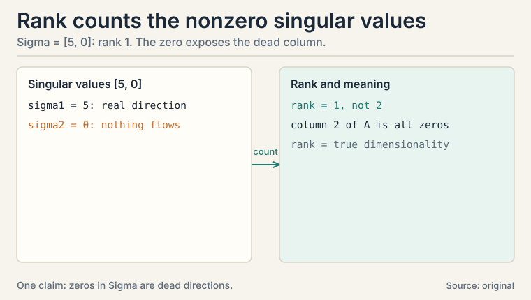
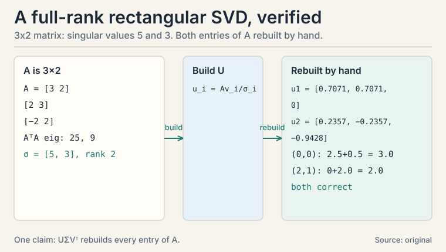
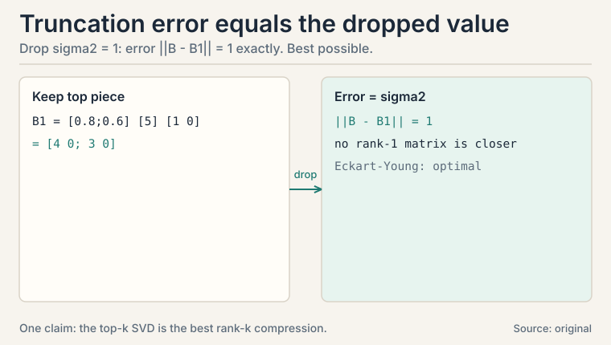
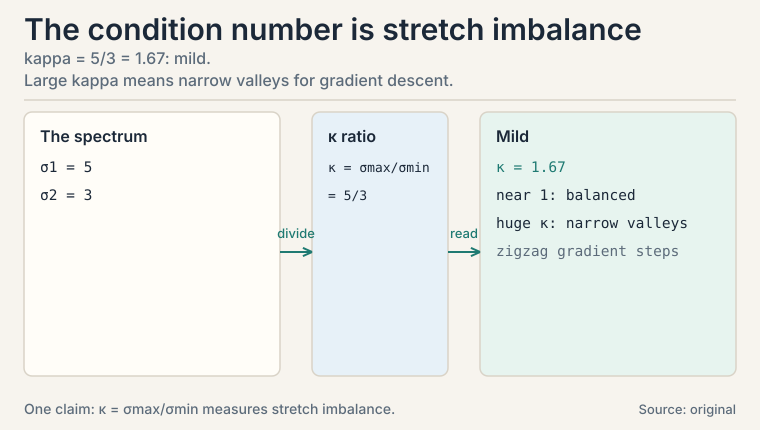
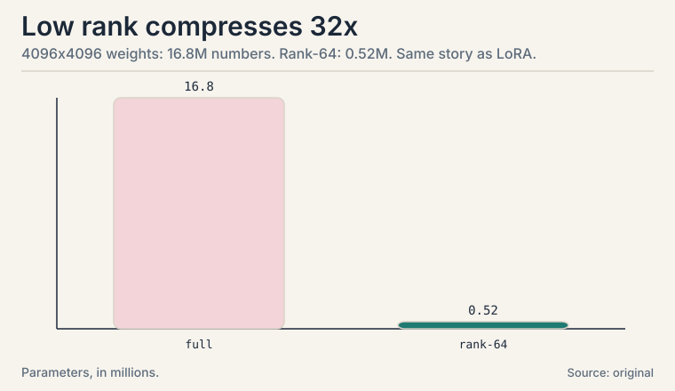

## The task: decompose the matrices eigen-decomposition cannot touch

L03's eigen-decomposition needs a square matrix. But the matrices
that matter in ML are rarely square. A dataset with 1,000 examples
and 50 features is a 1000x50 matrix. A weight layer mapping 512
inputs to 128 outputs is 128x512. None of them have eigenvectors.

The **singular value decomposition**, the SVD, is the
generalization that works on every matrix: every m x n matrix
splits into three simple pieces,

```ascii
A = U Sigma V^T

U:      m x m, a rotation (columns perpendicular, unit length)
Sigma:  m x n, a stretch (diagonal, nonnegative numbers)
V^T:    n x n, a rotation
```

Read it right to left as an action on a vector: rotate into a
special basis (V^T), stretch each axis by a **singular value**
(Sigma), rotate into the output space (U). Every linear map is a
rotation, then a stretch, then a rotation. Nothing else.

## First attempt: force eigenvectors on a rectangle

You might try the eigen trick on A^T A instead. For our data
matrix A, the matrix A^T A is square, symmetric, and has
eigenvectors. That gives V and the singular values (their square
roots). But it loses U: the output-side directions. Half a
decomposition is not enough to rebuild A.

## The key question

What are the input directions and output directions such that A
maps each input direction to exactly one output direction, scaled
by a single number?

### Subchapter: the recipe, from A^T A

The recipe, worked by hand on a small matrix. Take

```ascii
A = [ 4  0 ]
    [ 3  0 ]
```

Two columns: [4, 3] and [0, 0]. One column is dead. Intuition says
this matrix is really one-dimensional. The SVD will prove it.

Step 1, form A^T A (square, symmetric, eigenvectors guaranteed):

```ascii
A^T A = [ 4 3 ] [ 4 0 ] = [ 25  0 ]
        [ 0 0 ] [ 3 0 ]   [  0  0 ]
```

Step 2, eigen-decompose it. Diagonal already: eigenvalues 25 and
0. Singular values are the square roots: sigma1 = 5, sigma2 = 0.
Eigenvectors: v1 = [1, 0], v2 = [0, 1]. These are the columns of V.

: 0.8*5*1 = 4. Shell 2. Source: original toy. Project: Stanford Frontier AI.")

### Subchapter: build U, one column at a time

Step 3, build U's columns: u_i = A v_i / sigma_i.

```ascii
u1 = A [1,0] / 5 = [4, 3] / 5 = [0.8, 0.6]
u2: sigma2 = 0, division impossible -- pick any unit vector
     perpendicular to u1: u2 = [-0.6, 0.8]
```

The formula u_i = A v_i / sigma_i is the heart of the SVD: it says
"A maps the i-th input direction exactly onto the i-th output
direction, stretched by sigma_i." When sigma_i is zero, A kills
that direction, so any perpendicular unit vector completes U.

Step 4, assemble:

```ascii
A = U Sigma V^T

    [ 0.8  -0.6 ] [ 5  0 ] [ 1  0 ]
  = [ 0.6   0.8 ] [ 0  0 ] [ 0  1 ]

check the (1,1) entry: 0.8*5*1 + (-0.6)*0*0 = 4.  correct.
check the (2,1) entry: 0.6*5*1 + 0.8*0*0 = 3.    correct.
```

The matrix is exactly rotation-stretch-rotation.

### Subchapter: rank counts the survivors

The zero singular value exposes the dead column: nothing flows
through that direction. The **rank** of a matrix is its number of
nonzero singular values. This matrix has rank 1.

Rank is the true dimensionality hiding inside the nominal
dimensions. A 2x2 matrix has 4 entries of room, but this one uses
1 direction. A 1000x50 data matrix has 50,000 entries but might
have rank 10: ten true directions, the rest noise or redundancy.



### Subchapter: a rectangular, full-rank SVD, start to finish

The hand recipe also handles rectangles with no zero singular
values. Take a 3x2 data matrix:

```ascii
A = [  3  2 ]
    [  2  3 ]
    [ -2  2 ]

step 1, A^T A:
  [ 3 2 -2 ] [  3  2 ]   [ 9+4+4   6+6-4 ]   [ 17  8 ]
  [ 2 3  2 ] [  2  3 ] = [ 6+6-4   4+9+4 ] = [  8 17 ]
             [ -2  2 ]

step 2, eigen-decompose:
  det([17-lambda, 8; 8, 17-lambda]) = (17-lambda)^2 - 64 = 0
  lambda = 17 + 8 = 25,   lambda = 17 - 8 = 9
  singular values: sigma1 = 5, sigma2 = 3
  v1 = [1, 1] / sqrt(2) = [0.7071, 0.7071]
  v2 = [1, -1] / sqrt(2) = [0.7071, -0.7071]

step 3, u_i = A v_i / sigma_i:
  u1 = A [0.7071, 0.7071] / 5 = [3.5355, 3.5355, 0] / 5
     = [0.7071, 0.7071, 0]
  u2 = A [0.7071, -0.7071] / 3 = [0.7071, -0.7071, -2.8284] / 3
     = [0.2357, -0.2357, -0.9428]

step 4, verify two entries of A = U Sigma V^T:
  entry (0,0): 5 * 0.7071 * 0.7071 + 3 * 0.2357 * 0.7071
             = 2.5 + 0.5 = 3.0   correct.
  entry (2,1): 5 * 0 * 0.7071 + 3 * (-0.9428) * (-0.7071)
             = 0 + 2.0 = 2.0     correct.
```

Every direction carries weight here: sigma = [5, 3], no zeros, so
the matrix is full rank 2. Truncating to rank 1 would cost
sigma2 = 3 in Frobenius error: three times the toy's earlier cost.
The spectrum decides whether truncation is cheap or fatal.



## Where the SVD earns its keep: low-rank approximation

Here is the turn that matters for ML. Suppose the singular values
are 5 and 1 instead of 5 and 0:

```ascii
B = [ 0.8  -0.6 ] [ 5  0 ] [ 1  0 ]
    [ 0.6   0.8 ] [ 0  1 ] [ 0  1 ]
```

B is full rank. But the second direction carries little: sigma2 =
1 against sigma1 = 5. Drop it. Keep only the rank-1 piece:

```ascii
B_1 = [ 0.8 ] [ 5 ] [ 1  0 ] = [ 4  0 ]
      [ 0.6 ]                     [ 3  0 ]
```

B_1 stores 2 numbers per side plus 1 stretch instead of 4 full
entries. The error, measured by the **Frobenius norm** (square root
of the sum of squared entries, the matrix version of L01's vector
norm), is exactly the dropped singular value:

```ascii
||B - B_1|| = sigma2 = 1
```

### Subchapter: Eckart-Young, the optimality guarantee

This is the **Eckart-Young** result: the best rank-k approximation
of a matrix is its top k SVD pieces, and the error equals the first
dropped singular value. No other rank-k matrix is closer. In the
toy, dropping sigma2 = 1 gives error exactly 1. No other
2-number-per-side approximation beats it. Compression becomes a
solved optimization, not a heuristic.

The failure mode: when the singular values decay slowly. If sigma1
= 5 and sigma2 = 4.9, dropping one direction loses nearly half the
energy. Image and weight matrices in practice have fast-decaying
spectra, which is why LoRA works. Always look at the spectrum
before truncating.



### Subchapter: the condition number, the ratio that predicts optimization pain

The ratio of the largest to the smallest singular value has a
name: the **condition number**, kappa = sigma_max / sigma_min.
For the rectangular toy above: kappa = 5 / 3 = 1.67.

Read it as stretch imbalance. The matrix stretches one direction
1.67 times harder than the other. When kappa is near 1, every
direction is treated equally. When kappa is huge (10^6 or more),
one direction dominates and the rest barely register.

Why this matters for ML: gradient descent on a quadratic with
Hessian H converges at a rate set by kappa(H). A large condition
number means the loss surface is a long narrow valley: gradient
steps zigzag across the valley walls and crawl along its floor.
Preconditioning and second-order methods exist to fight exactly
this ratio. L08 meets it again. When a matrix is singular, the
smallest singular value is zero and kappa is infinite: the valley
has no floor at all.



### Subchapter: the 4096x4096 compression, in numbers

A 4096x4096 weight matrix holds 16,777,216 numbers. Keep the top
64 SVD pieces: each piece needs one 4096-vector from U, one from
V, and one singular value: 64 * (4096 + 4096 + 1) = 524,352
numbers. That is 0.5M against 16.8M: a 32x compression. This is
the low-rank compression behind LoRA fine-tuning and behind
CS229S L06.

LoRA's version: instead of updating a frozen 4096x4096 weight W,
train two small matrices B (4096x8) and A (8x4096): the update is
BA, rank 8. Trainable numbers: 8 * 8192 = 65,536 against 16.8M.
Same rank idea, applied to the update instead of the weight (Hu et
al., 2021).



## The honest price

The SVD of a big matrix is expensive to compute: roughly cubic in
the dimensions. You never SVD a billion-entry matrix directly.
Practical code uses randomized or iterative methods that find only
the top k pieces. And truncation is lossy by design: if the
singular values decay slowly, dropping pieces costs real accuracy.
The spectrum decides whether compression is free or fatal.

| Idea | Formula | Meaning |
|---|---|---|
| SVD | A = U Sigma V^T | rotation, stretch, rotation; works on any matrix |
| Singular values | sqrt of eigenvalues of A^T A | stretch per direction; sorted largest first |
| Rank | count of nonzero singular values | true dimensionality of the map |
| Best rank-k approx | keep top k pieces | error = first dropped singular value |
| Frobenius norm | sqrt of sum of squared entries | the ruler that measures the error |

## What is used where: the real systems

| Math idea | Where it appears | Why there |
|---|---|---|
| LoRA | LLM fine-tuning (Hu et al., 2021) | rank-8 updates: 65K trainable vs 16.8M |
| Truncated SVD | Model compression (CS229S L06) | keep top-k pieces, error = first dropped |
| Matrix factorization | Recommender systems | user/item factors are the SVD pieces |
| PCA via SVD | sklearn.decomposition.PCA | SVD of centered data = components, stabler |
| Image compression | JPEG-style pipelines | drop small singular values |

. Dense chapter plate. Source: original synthesis of the lesson. Project: Stanford Frontier AI.")

> [!QA]
> Q: What does the SVD actually say, in plain words?
> A: Every linear map is a rotation, then a per-axis stretch, then another rotation. For A = [4 0. 3 0], the pieces are U = [0.8 -0.6. 0.6 0.8], Sigma = [5 0. 0 0], V = identity: stretch the x-axis by 5, rotate it to [0.8, 0.6], kill the y-axis entirely. The zeros in Sigma expose dead directions. Their count is the rank.
> Follow-up: Why not just use eigenvalues of A directly?
> A: Because A is usually not square. Eigenvalues need square matrices. The SVD's trick is to eigen-decompose A^T A, which is always square and symmetric, then recover both rotations. For square symmetric A the two coincide: singular values are the absolute eigenvalues.

> [!QA]
> Q: Walk me through the SVD of [4 0. 3 0] by hand.
> A: Step 1: A^T A = [25 0. 0 0]. Step 2: eigenvalues 25 and 0, so singular values 5 and 0, with V = identity. Step 3: u1 = A[1,0]/5 = [4,3]/5 = [0.8, 0.6]. Sigma2 = 0, so pick u2 = [-0.6, 0.8] perpendicular to u1. Step 4: assemble U Sigma V^T and check entries: 0.8*5*1 = 4 and 0.6*5*1 = 3. Both recovered.
> Follow-up: What do you do when sigma_i is zero?
> A: You cannot divide by it, so u_i = A v_i / sigma_i fails. But a zero singular value means A kills that direction entirely, so any unit vector perpendicular to the existing U columns completes the rotation. The choice does not matter: that direction carries nothing.

> [!QA]
> Q: Why is truncating the SVD the best compression, not just a decent one?
> A: Because of Eckart-Young: among all rank-k matrices, the top-k SVD pieces minimize the Frobenius error, and the error equals the first dropped singular value. In the toy, dropping sigma2 = 1 from B gives error exactly 1. No other 2-number-per-side approximation beats it. Compression becomes a solved optimization, not a heuristic.
> Follow-up: When does low-rank compression fail?
> A: When the singular values decay slowly. If sigma1 = 5 and sigma2 = 4.9, dropping one direction loses nearly half the energy. Image and weight matrices in practice have fast-decaying spectra, which is why LoRA works. Always look at the spectrum before truncating.

> [!QA]
> Q: What is rank, really?
> A: The number of independent directions a matrix actually uses: the count of nonzero singular values. The toy A has rank 1 despite being 2x2, because its second column is all zeros. Rank is the true dimensionality hiding inside the nominal dimensions, and low-rank approximation exploits the gap between them.
> Follow-up: How is rank different from dimension?
> A: Dimension is the size of the room (2x2 lives in a 4-dimensional space of matrices). Rank is how much of the room the matrix occupies (1 direction). A 1000x50 data matrix has dimension 50,000 entries but might have rank 10: ten true directions, the rest noise or redundancy.

> [!QA]
> Q: How does LoRA use the SVD idea without computing an SVD?
> A: LoRA never decomposes anything. It exploits the same insight: weight updates during fine-tuning are effectively low-rank. So instead of training a full 4096x4096 update (16.8M numbers), it trains B (4096x8) times A (8x4096): 65,536 numbers whose product is a rank-8 update. The base weights stay frozen. Same rank economics as truncation, applied to the delta.
> Follow-up: Why does a rank-8 update suffice?
> A: Because fine-tuning adapts rather than rebuilds: the pretrained model already knows language, and the task-specific change lives in a small subspace. Empirically, rank 8 to 64 matches full fine-tuning on many tasks (Hu et al., 2021). If the task needs genuinely new capabilities, the rank must rise.

> [!QA]
> Q: SVD or eigen-decomposition: which and when?
> A: Eigen-decomposition when the matrix is square and you want its action on its own space: covariance matrices, PageRank, Hessians. SVD for everything else: rectangular data matrices, any compression task, rank questions. For square symmetric matrices they agree (singular values = |eigenvalues|). When in doubt, SVD: it never fails to exist.
> Follow-up: Why is PCA computed via SVD in practice?
> A: Forming X^T X squares the condition number: a singular value of 1e-8 becomes 1e-16, below float precision. The SVD works on X directly and resolves small directions accurately. Same components, better arithmetic. sklearn's PCA uses the SVD for exactly this reason.

> [!QA]
> Q: A 4096x4096 weight matrix must shrink 30x for deployment. Walk me through it.
> A: Step 1: compute (or approximate) the SVD and look at the spectrum: if the top 64 singular values dominate, truncation is safe. Step 2: keep U_64, Sigma_64, V_64: 64*(4096+4096+1) = 524,352 numbers, a 32x cut. Step 3: the error is exactly sigma_65 (Eckart-Young): check it against your accuracy budget. Step 4: if the spectrum decays slowly, do not truncate: the error will exceed budget and you need quantization or distillation instead.
> Follow-up: Full SVD of 4096x4096 is cubic. How do you actually get the top 64?
> A: Randomized or iterative methods (randomized SVD, Lanczos): they find the top-k pieces without the full decomposition, in roughly O(mn k) time. You never pay the cubic price for the pieces you throw away.

> [!QA]
> Q: What does the condition number tell you that the singular values alone do not?
> A: The imbalance: kappa = sigma_max / sigma_min. The rectangular toy has kappa = 5/3 = 1.67: mild imbalance, every direction pulls its weight. A kappa of 10^6 means one direction is stretched a million times harder than another: gradient descent zigzags across the steep walls and crawls along the flat floor. If sigma_min is zero, kappa is infinite and the matrix is singular.
> Follow-up: How do you fix a huge condition number?
> A: Precondition: multiply by an approximate inverse of the curvature so the transformed problem has kappa near 1. Or regularize: adding lambda I to X^T X lifts every singular value by lambda, which bounds kappa. Both are the same move: make the valley rounder.

## Recap: the whole lesson on one screen

1. **The task.** Decompose non-square matrices: data tables, weight layers.
2. **First attempt.** Eigen-decompose A^T A. It gives V and the stretches but loses U.
3. **The key question.** Which input directions map to which output directions, each scaled by one number?
4. **The new idea.** A = U Sigma V^T, built from the eigen-decomposition of A^T A plus u_i = A v_i / sigma_i. Toy verified entry by entry: 4 and 3 recovered.
5. **Rank.** Nonzero singular values: the toy has rank 1. The zero exposes the dead column. A rectangular 3x2 worked start to finish: sigma = [5, 3], full rank 2, two entries rebuilt by hand. Truncation here would cost sigma2 = 3.
6. **Low-rank approximation.** Drop small singular values. Eckart-Young: the top-k pieces are the best rank-k approximation. Error = first dropped value (1 in the toy). The condition number kappa = sigma_max/sigma_min = 1.67 measures stretch imbalance: huge kappa means narrow valleys for gradient descent (L08).
7. **The ML payoff.** A 4096x4096 weight matrix compresses to 64 directions: 16.8M to 0.52M numbers, 32x. LoRA trains rank-8 updates: 65K numbers.
8. **The price.** Full SVD is cubic. Use iterative top-k methods. Slow-decaying spectra resist compression.

## Go deeper

<div style="position:relative;padding-bottom:56.25%;height:0;overflow:hidden;max-width:100%;margin:16px 0;">
<iframe style="position:absolute;top:0;left:0;width:100%;height:100%;" src="https://www.youtube-nocookie.com/embed/nbBvuuNVfco" title="Steve Brunton: Singular Value Decomposition, Mathematical Overview" frameborder="0" allow="accelerometer; autoplay; clipboard-write; encrypted-media; gyroscope; picture-in-picture" allowfullscreen></iframe>
</div>

- Steve Brunton, "Singular Value Decomposition (SVD): Mathematical Overview" (the embed above): https://www.youtube.com/watch?v=nbBvuuNVfco
- The NPTEL lecture for this lesson (frontmatter video): https://www.youtube.com/watch?v=igG1egOAsRM
- Hu et al., "LoRA: Low-Rank Adaptation of Large Language Models" (2021): https://arxiv.org/abs/2106.09685: the rank-8 update.
- Deisenroth, Faisal, Ong, "Mathematics for Machine Learning", ch. 4.5 (free): https://mml-book.github.io: SVD, low-rank approximation.

## Official sources and further reading

**Official:**
- "Essential Mathematics for Machine Learning" playlist, Lecture 12 (this lesson's video): [paper](https://www.youtube.com/watch?v=igG1egOAsRM)
- NPTEL course page (111107137): https://nptel.ac.in/courses/111107137

**Further reading:**
- Deisenroth, Faisal, Ong, "Mathematics for Machine Learning", ch. 4.5 (free):
  - [SVD, low-rank approximation.](https://mml-book.github.io)
- Strang, "Introduction to Linear Algebra", ch. 7: the SVD chapter.

**Caveats.** The toy matrices, the hand computation, and the 4096/LoRA numbers are the lesson's own. The lecture's exact worked examples are [uncertain] (transcripts for L12-L14 were not recovered). Eckart-Young is the standard result behind the playlist's "Low Rank Approximations" lecture.

## Connections to the other courses

- **CS229S L06:** low-rank weight compression and efficient inference. This lesson is the math it rests on.
- **CS229 L10:** PCA via SVD: for centered data, the SVD of the data matrix gives the principal components directly.
- **CS336:** LoRA fine-tuning keeps pretrained weights frozen and trains low-rank updates.

## Coverage map

Every lecture concept, and where this lesson covers it:

| Lecture concept | Covered in | Lines |
|---|---|---|
| SVD: rotation, stretch, rotation, any matrix | The task: decompose the matrices eigen-decomposition cannot touch | l04:28-51 |
| first attempt: eigen-decompose A^T A, loses U | First attempt: force eigenvectors on a rectangle | l04:52-59 |
| the recipe from A^T A, singular values as sqrt of eigenvalues | Subchapter: the recipe, from A^T A | l04:66-90 |
| build U via u_i = A v_i / sigma_i, the zero case | Subchapter: build U, one column at a time | l04:91-119 |
| rank as count of nonzero singular values | Subchapter: rank counts the survivors | l04:120-132 |
| rectangular full-rank SVD start to finish, verified | Subchapter: a rectangular, full-rank SVD | l04:133-174 |
| low-rank approximation, Frobenius error = dropped value | Where the SVD earns its keep | l04:175-201 |
| Eckart-Young optimality, slow-spectrum failure mode | Subchapter: Eckart-Young | l04:202-218 |
| condition number, stretch imbalance, optimization pain | Subchapter: the condition number | l04:219-240 |
| 4096x4096 compression: 32x, LoRA rank-8 update | Subchapter: the 4096x4096 compression, in numbers | l04:241-257 |
| honest price: cubic cost, randomized top-k, lossy truncation | The honest price | l04:258-274 |
| what is used where: LoRA, recommenders, PCA via SVD | What is used where | l04:275-286 |
| 8 interview Q&As with follow-ups | QA blocks | l04:287-334 |
| full-lesson recap | Recap | l04:335-344 |
