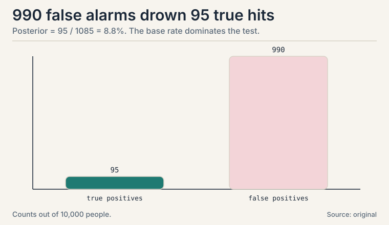
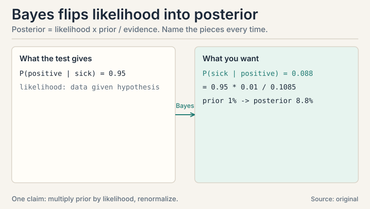
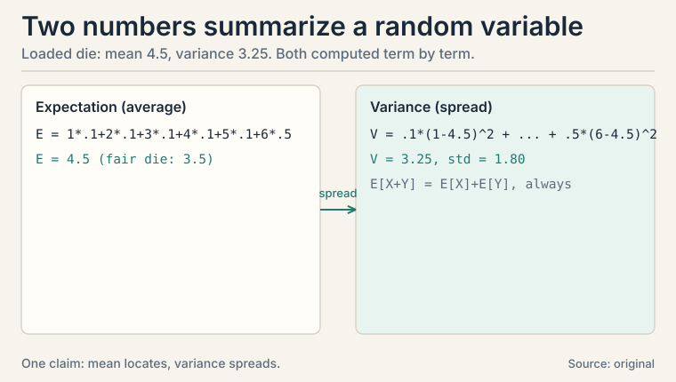
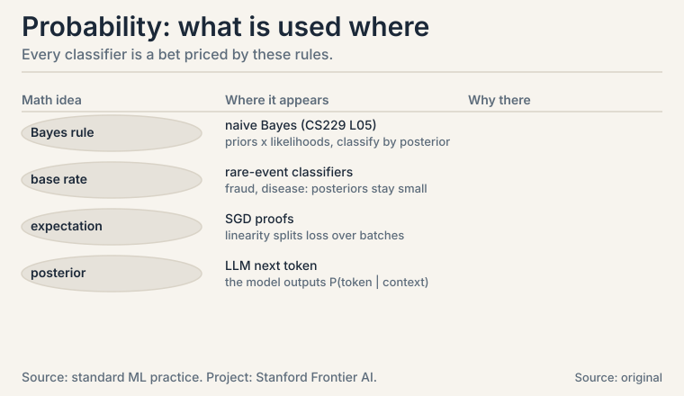

## The task: reason under uncertainty

Every ML prediction is a bet. The model sees symptoms and bets on
the disease. It sees an email and bets on spam. It sees pixels and
bets on "cat". The mathematics of betting correctly is
**probability**: numbers between 0 and 1 that obey three rules.

A **random variable** is a quantity whose value is uncertain: the
outcome of a die roll, tomorrow's temperature, whether an email is
spam. Write X for the variable and x for a value it takes. P(X = x)
is the probability it takes that value. The three rules:

```ascii
1. P(anything) is between 0 and 1.
2. P(all possibilities) = 1.  Something happens.
3. P(A or B) = P(A) + P(B) when A and B cannot both happen.
```

That is the whole foundation. Everything in this lesson is built
on these three.

## First attempt: trust the test result

A patient tests positive for a rare disease. The test is 95%
accurate. How likely is the patient sick?

The gut answer: 95%. This is the trap the lesson exists to fix.
The test's accuracy is P(positive | sick): the chance of a positive
* given * sickness. The question asks the reverse: P(sick |
positive). Confusing the two is the **base-rate fallacy**, and it
is the most expensive probability mistake in applied ML.

### Subchapter: conditional probability restricts the world

**Conditional probability** P(A | B) means the probability of A
given that B happened: restrict the world to B, then measure A.

```ascii
P(A | B) = P(A and B) / P(B)
```

Read it as a two-step procedure. Step 1: throw away every outcome
where B did not happen. Step 2: measure A inside what remains. The
denominator P(B) is the renormalization: it rescales the surviving
world back to probability 1.

Concrete: a deck of cards. P(ace | red card): restrict to the 26
red cards, count the 2 red aces: 2/26 = 1/13. Same as the
unconditional P(ace) = 4/52 = 1/13 here, because color and rank are
independent. When they are not independent, conditioning changes
everything: that is the whole next section.

 = P(A and B) / P(B). First keep only B, then measure A. Shell 2. Source: original toy. Project: Stanford Frontier AI.")

## Where the gut breaks: the base rate dominates

Run the numbers. 10,000 people. 1% carry the disease: 100 sick,
9,900 healthy.

```ascii
sick and test positive:    100 * 0.95 = 95
healthy but test positive: 9,900 * 0.10 = 990   (10% false alarm rate)

total positives: 95 + 990 = 1,085
P(sick | positive) = 95 / 1,085 = 0.0876 = 8.8%
```

A positive result on a 95%-accurate test means an 8.8% chance of
being sick. The 990 false alarms drown the 95 true hits because
the disease is rare. The base rate, the 1%, dominated the test's
95% accuracy. Anyone deploying a classifier on rare events who
ignores this ships a false-alarm machine.



## The key question

How do you flip a conditional probability: turn P(evidence |
hypothesis), which tests and models give you, into P(hypothesis |
evidence), which is what you actually want?

### Subchapter: Bayes' theorem, piece by piece

**Bayes' theorem** is the flip:

```ascii
P(H | E) = P(E | H) * P(H) / P(E)
```

Name each piece every time you use it:

- **P(H), the prior.** Belief before the evidence. 1% sick.
- **P(E | H), the likelihood.** How data looks if H is true. 95%
  of sick patients test positive. This is the model's job: it
  predicts what data each hypothesis produces.
- **P(E), the evidence.** Total chance of seeing this evidence:
  95 true positives + 990 false alarms, over 10,000 people. It
  just renormalizes so the posteriors sum to 1.
- **P(H | E), the posterior.** Belief after. 8.8%.

Learning, in the Bayesian view, is prior times likelihood,
renormalized. In ML this is the engine of **naive Bayes** (CS229
L05): the prior is how common each class is, the likelihood is how
each class generates features, and classification picks the class
with the highest posterior. "Naive" because it assumes features are
independent given the class, which factorizes one big likelihood
into a product of small ones.



### Subchapter: two tests are better than one

A second independent positive test multiplies the likelihoods.
After one positive: posterior 8.8%. Treat 8.8% as the new prior,
apply the test again: P(sick | ++) = (0.95 * 0.088) / (0.95*0.088
+ 0.10*0.912) = 0.0836 / 0.1748 = 47.8%. Two positives: 47.8%.
The evidence accumulates multiplicatively. This is why real
diagnosis retests, and why naive Bayes multiplies per-feature
likelihoods: each feature is one more "test."

## Expectation and variance: summarize a random variable in two numbers

A random variable's full distribution can be complex. Two numbers
summarize most of what you need.

### Subchapter: expectation, the long-run average

**Expectation**, E[X], is the long-run average. For values x_i with
probabilities p_i: E[X] = sum of x_i * p_i.

A loaded die, worked by hand. Faces 1-5 are fair-ish, face 6 is
heavy:

```ascii
P(1..5) = 0.1 each,  P(6) = 0.5

E[X] = 1*.1 + 2*.1 + 3*.1 + 4*.1 + 5*.1 + 6*.5
     = 0.1 + 0.2 + 0.3 + 0.4 + 0.5 + 3.0 = 4.5
```

Mean 4.5, above the fair die's 3.5, pulled by the heavy 6.

### Subchapter: variance, the spread

**Variance**, Var(X), is the average squared distance from the
mean: E[(X - E[X])^2]. It measures spread. Its square root is the
**standard deviation**.

```ascii
Var(X) = E[(X-4.5)^2]
  = .1*(1-4.5)^2 + .1*(2-4.5)^2 + .1*(3-4.5)^2
    + .1*(4-4.5)^2 + .1*(5-4.5)^2 + .5*(6-4.5)^2
  = .1*12.25 + .1*6.25 + .1*2.25 + .1*0.25 + .1*0.25 + .5*2.25
  = 1.225 + 0.625 + 0.225 + 0.025 + 0.025 + 1.125 = 3.25
```

Variance 3.25, standard deviation 1.80. Two numbers capture the
loading. Why square the distances? So that overshoots and
undershoots do not cancel: spread must count both directions.



### Subchapter: the three expectation facts ML reuses

```ascii
E[aX + b] = a E[X] + b            (linearity: constants pass through)
E[X + Y] = E[X] + E[Y]            (sums split, always, no independence needed)
Var(X) = E[X^2] - (E[X])^2        (the computational shortcut)
```

Linearity of expectation needs no independence assumption. That
is why it appears in every other proof in ML: you can always split
an expectation of a sum. Most quantities in ML are sums: the loss
over a dataset, the gradient over a batch, the return over an
episode. Variance does not split so cleanly: Var(X + Y) = Var(X)
+ Var(Y) + 2 Cov(X, Y). The extra term is why L06 exists.

| Idea | Formula | Role |
|---|---|---|
| Conditional probability | P(A\|B) = P(A,B)/P(B) | restrict the world, then measure |
| Bayes' theorem | P(H\|E) = P(E\|H)P(H)/P(E) | flip likelihood into posterior |
| Prior / likelihood / posterior | belief before / evidence model / belief after | the vocabulary of learning |
| Expectation | sum of x_i * p_i | long-run average; splits over sums |
| Variance | E[(X - mean)^2] | spread; sqrt is standard deviation |

## What is used where: the real systems

| Math idea | Where it appears | Why there |
|---|---|---|
| Bayes' rule | Naive Bayes (CS229 L05) | priors x likelihoods; classify by posterior |
| Base rate | Fraud/disease classifiers | rare events: posteriors stay small |
| Two-test update | Ensemble methods | independent evidence multiplies |
| Expectation linearity | SGD theory | split loss and gradient over batches |
| Posterior | LLM next token | the model outputs P(token \| context) |



> [!QA]
> Q: A test is 95% accurate and I tested positive. Am I 95% likely to be sick?
> A: No: about 8.8% in the worked example. The 95% is P(positive | sick). You want P(sick | positive). With 1% prevalence, 100 sick people yield 95 true positives but 9,900 healthy people yield 990 false alarms, so 95 out of 1,085 positives are truly sick. The base rate dominates. This is the base-rate fallacy, and it bites every rare-event classifier.
> Follow-up: How do you fix it in a real classifier?
> A: Two levers. Raise the decision threshold so fewer healthy cases trigger alarms, or gather more evidence (a second independent test multiplies the likelihoods). Naive Bayes handles it automatically: the prior P(spam) is small, so the posterior stays small unless the likelihood ratio is overwhelming.

> [!QA]
> Q: Walk me through Bayes' theorem on the medical test, naming each piece.
> A: Prior P(sick) = 0.01: one in a hundred people is sick, before any test. Likelihood P(positive | sick) = 0.95: the test catches 95% of sick patients. Evidence P(positive) = (95 + 990)/10,000 = 0.1085: about 11% of everyone tests positive. Posterior = 0.95 * 0.01 / 0.1085 = 0.088: after the positive, 8.8%. Prior times likelihood, renormalized.
> Follow-up: Where does P(E), the denominator, come from?
> A: It is the total probability of the evidence under all hypotheses: P(E) = sum over H of P(E|H) P(H). In the toy: 95 true positives + 990 false alarms, over 10,000 people. It just rescales so the posteriors sum to 1. When comparing two hypotheses you can often ignore it, since it is the same for both.

> [!QA]
> Q: What do prior, likelihood, and posterior actually mean?
> A: The prior is what you believed before seeing data: 1% disease prevalence. The likelihood is how each hypothesis generates data: 95% of sick patients test positive. The posterior is the updated belief: 8.8% after a positive test. Bayes' theorem multiplies prior by likelihood and renormalizes. Training a generative classifier is estimating likelihoods. Predicting is computing posteriors.
> Follow-up: A second positive test arrives. Now what?
> A: Update again, using 8.8% as the new prior: posterior = 0.95*0.088 / (0.95*0.088 + 0.10*0.912) = 47.8%. Evidence accumulates multiplicatively. This is the mechanism inside naive Bayes: each feature is another "test" multiplying into the posterior.

> [!QA]
> Q: Why is linearity of expectation such a big deal?
> A: Because E[X + Y] = E[X] + E[Y] holds with zero assumptions: no independence needed. Most quantities in ML are sums or averages: the loss over a dataset, the gradient over a batch, the return over an episode. Linearity lets you push expectations inside sums everywhere, which is why proofs about stochastic gradient descent and generalization start with it.
> Follow-up: Does Var(X + Y) = Var(X) + Var(Y)?
> A: Only if X and Y are uncorrelated. In general Var(X+Y) = Var(X) + Var(Y) + 2 Cov(X,Y). The extra term is why L06 exists: correlated features inflate variance, and covariance measures exactly that inflation.

> [!QA]
> Q: Compute the mean and variance of the loaded die by hand.
> A: P(1..5) = 0.1 each, P(6) = 0.5. Mean: 1*.1 + 2*.1 + 3*.1 + 4*.1 + 5*.1 + 6*.5 = 4.5. Variance: average squared distance from 4.5: .1*12.25 + .1*6.25 + .1*2.25 + .1*0.25 + .1*0.25 + .5*2.25 = 3.25. Standard deviation 1.80. The heavy 6 pulls the mean above the fair 3.5 and inflates the spread.
> Follow-up: Why square the distances in variance?
> A: So overshoots and undershoots do not cancel. Without squaring, the average signed distance from the mean is always exactly zero: useless as a spread measure. Squaring (or absolute value) makes both directions count.

> [!QA]
> Q: Your fraud classifier flags 1% of transactions with 99% precision on the test set. In production, precision collapses. Why?
> A: Base-rate shift. Precision depends on prevalence: the same likelihood ratio produces far more false alarms when fraud is rarer in production than in the test set. This is the medical-test lesson at scale: 990 false alarms drowned 95 true hits at 1% prevalence. Recalibrate the threshold on production prevalence, or reweight by the new prior.
> Follow-up: How do you detect base-rate shift before it burns you?
> A: Monitor the flagged rate. If the model flags 5% of traffic but the historical fraud rate is 0.1%, either fraud exploded or the threshold is wrong for current prevalence. Track P(flagged) against the known base rate. Divergence is the alarm.

> [!QA]
> Q: Explain the difference between P(A|B) and P(B|A) to a non-technical stakeholder.
> A: P(positive | sick) is "how good is the test at catching sick people": the lab's number, 95%. P(sick | positive) is "I tested positive, how worried should I be": your number, 8.8%. The first describes the test. The second describes you. Mixing them up is a billion-dollar mistake in screening programs.
> Follow-up: When are they equal?
> A: When the base rates match: P(A|B) = P(B|A) exactly when P(A) = P(B). Otherwise the rarer event's conditional is the smaller one. If a stakeholder quotes the lab's 95% as your risk, ask for the prevalence: that is the missing number.

## Recap: the whole lesson on one screen

1. **The task.** Bet correctly under uncertainty: three rules, random variables, probabilities.
2. **First attempt.** Trust the 95%-accurate test: a positive means 95% sick.
3. **Where it breaks.** Base rate: 990 false alarms drown 95 true hits. Posterior is 8.8%, not 95%.
4. **The key question.** How to flip P(evidence | hypothesis) into P(hypothesis | evidence)?
5. **The new idea.** Bayes' theorem: posterior = likelihood times prior, renormalized. Name the pieces every time. A second test multiplies in: 47.8%.
6. **The ML engine.** Naive Bayes (CS229 L05): priors over classes, factorized likelihoods over features, classify by highest posterior.
7. **Summarize in two numbers.** Expectation (loaded die: 4.5) and variance (3.25), computed by hand. Linearity splits sums with no assumptions.
8. **The price and the bridge.** Bayes needs a prior and a likelihood. Bad priors or wrong likelihoods give confident wrong answers. L06 builds the distributions those likelihoods come from.

## Go deeper

<div style="position:relative;padding-bottom:56.25%;height:0;overflow:hidden;max-width:100%;margin:16px 0;">
<iframe style="position:absolute;top:0;left:0;width:100%;height:100%;" src="https://www.youtube-nocookie.com/embed/9wCnvr7Xw4E" title="StatQuest: Bayes' Theorem, Clearly Explained" frameborder="0" allow="accelerometer; autoplay; clipboard-write; encrypted-media; gyroscope; picture-in-picture" allowfullscreen></iframe>
</div>

- StatQuest, "Bayes' Theorem, Clearly Explained" (the embed above): https://www.youtube.com/watch?v=9wCnvr7Xw4E
- The NPTEL lecture for this lesson (frontmatter video): https://www.youtube.com/watch?v=0UxcDQz4sWQ
- Bishop, "Pattern Recognition and Machine Learning", ch. 1: probability rules, Bayes, expectation.
- Deisenroth, Faisal, Ong, "Mathematics for Machine Learning", ch. 6 (free): https://mml-book.github.io: discrete and continuous probability.

## Official sources and further reading

**Official:**
- "Essential Mathematics for Machine Learning" playlist, Lecture 49 (this lesson's video): [paper](https://www.youtube.com/watch?v=0UxcDQz4sWQ)
- NPTEL course page (111107137): https://nptel.ac.in/courses/111107137

**Further reading:**
- Bishop, "Pattern Recognition and Machine Learning", ch. 1: probability rules, Bayes, expectation.
- Deisenroth, Faisal, Ong, "Mathematics for Machine Learning", ch. 6 (free):
  - [discrete and continuous probability.](https://mml-book.github.io)

**Caveats.** The medical-test numbers and the loaded die are the lesson's own worked examples, in the standard textbook style. The lecture's exact examples are [uncertain] (transcripts for L47-L50 were not recovered). The lecture-1 transcript confirms the course frames probability as underpinning all ML algorithms.

## Connections to the other courses

- **CS229 L05:** naive Bayes classifier: priors, likelihoods, the independence assumption, Laplace smoothing.
- **CS229 L08:** the Bayesian view of regularization: priors over weights become penalty terms.
- **CS329H:** choice theory and Bayesian decision theory build directly on posterior reasoning.
