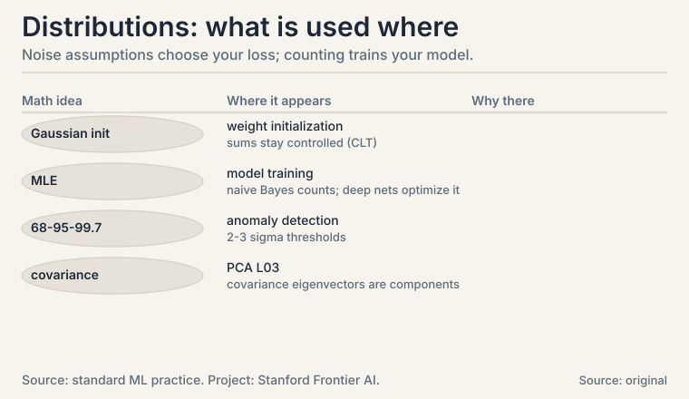

## The task: name the shapes uncertainty takes

L05 gave the rules of probability. Now the vocabulary: the specific
distributions that appear in nearly every ML model. A
**distribution** assigns a probability to every possible value of a
random variable. Discrete variables get a **probability mass
function** (a list of probabilities that sum to 1). Continuous
variables get a **probability density function** (a curve; areas
under it are probabilities).

Three distributions cover most of ML. Each gets a worked example.

### Subchapter: Bernoulli, the single yes/no

One trial, two outcomes. A coin flip, a click, spam or not spam.

```ascii
X ~ Bernoulli(p):   P(X=1) = p,   P(X=0) = 1-p

fair coin: p = 0.5.  biased ad click: p = 0.03.
E[X] = p.  Var(X) = p(1-p).
```

The variance formula is worth reading: p(1-p) is largest at p =
0.5 (maximum uncertainty) and zero at p = 0 or 1 (certainty). For
the ad with p = 0.03: variance = 0.03 * 0.97 = 0.0291. Rare events
have small variance because the answer is almost always "no".

Why does the variance peak exactly at 0.5? Differentiate p(1-p) =
p - p^2: derivative 1 - 2p = 0 gives p = 0.5. Symmetry forces it:
the yes/no question is hardest when both answers are equally
likely.

: maximum uncertainty at 0.5, zero at certainty. Ad click p=0.03: 0.0291. Shell 2. Source: original arithmetic. Project: Stanford Frontier AI.")

### Subchapter: Binomial, the count of yeses

Repeat n Bernoulli trials. Count the successes.

```ascii
K ~ Binomial(n, p):  P(K=k) = C(n,k) * p^k * (1-p)^(n-k)

10 emails, each spam with p = 0.2.  P(exactly 3 spam)?
C(10,3) = 120.  P = 120 * 0.2^3 * 0.8^7
       = 120 * 0.008 * 0.2097 = 0.201
```

About a 20% chance of exactly 3 spam emails. E[K] = np = 2,
Var(K) = np(1-p) = 1.6. The Binomial is the distribution behind
every "k out of n" question: k conversions out of n visitors, k
defects out of n parts.

Read the formula in three parts. C(n,k): the number of orders the
k yeses can appear in. p^k: the probability of one specific order
with k yeses. (1-p)^(n-k): the nos fill the rest. Ways times
per-way probability: the same pattern as the plate shows.

 = 120 * 0.2^3 * 0.8^7 = 0.201. Mean 2, variance 1.6. Shell 2. Source: original toy. Project: Stanford Frontier AI.")

### Subchapter: Gaussian, the bell curve

The **Gaussian** or **normal** distribution is the continuous
workhorse: measurement noise, heights, test scores, and the
initialization of every neural network weight.

```ascii
X ~ N(mu, sigma^2):  bell centered at mu, width set by sigma

68-95-99.7 rule: P(|X - mu| < sigma)   = 0.68
                 P(|X - mu| < 2 sigma) = 0.95
                 P(|X - mu| < 3 sigma) = 0.997
```

Human heights: mu = 170 cm, sigma = 10 cm. About 95% of people fall
between 150 and 190 cm. About 0.3% fall outside 140-200 cm. The
rule turns "two standard deviations" into a plain-English rarity
claim, which is why anomaly detectors threshold at 2 or 3 sigma.

Why is the Gaussian everywhere? The **central limit theorem**: a
sum of many small independent effects looks Gaussian no matter
what the pieces look like. Measurement error is the sum of many
tiny disturbances, so it is Gaussian. A neural layer sums hundreds
of weighted inputs, so its pre-activation is near-Gaussian: this
is the deep reason weight initialization samples Gaussians and the
sums stay controlled. This is the deep reason the normal
distribution models noise across science and ML.

: 95% fall between 150 and 190 cm. Shell 2. Source: original arithmetic. Project: Stanford Frontier AI.")

## Maximum likelihood: fit the distribution to data

You observe data. Which parameters make the data most probable?
That is **maximum likelihood estimation**, MLE: pick the parameters
that maximize P(data | parameters).

### Subchapter: Bernoulli MLE is counting

Bernoulli MLE, worked by hand. Five ad impressions, clicks on the
1st and 4th: data = [1, 0, 0, 1, 0]. The likelihood of p is

```ascii
L(p) = p * (1-p) * (1-p) * p * (1-p) = p^2 (1-p)^3
```

Try p = 0.4: L = 0.16 * 0.216 = 0.0346. Try p = 0.5: L = 0.25 *
0.125 = 0.0313. Try p = 0.3: L = 0.09 * 0.343 = 0.0309. The winner
near 0.4 is no accident: the MLE for Bernoulli is the sample mean,
2/5 = 0.4. Counting is estimating. This one fact underlies naive
Bayes training (CS229 L05): estimate each likelihood by counting.

 = p^2 (1-p)^3 peaks at p = 0.4, the sample mean. Shell 3. Source: original arithmetic. Project: Stanford Frontier AI.")

### Subchapter: Gaussian MLE is the sample mean and variance

The same idea on the Gaussian: given data points x_1..x_n, the
(mu, sigma) maximizing the likelihood are the sample mean and the
sample variance. Data [2, 4, 4, 4, 5, 5, 7, 9]: mean = 5,
variance = 4. No search needed: closed forms. This is why "fit a
Gaussian" in code is two lines: compute the mean, compute the
variance. MLE turns distribution-fitting into arithmetic.

The pattern to carry: write the likelihood, maximize it, read off
the estimator. Bernoulli gives counting. Gaussian gives
mean-and-variance. Each distribution's MLE is a different summary
of the data: always derive it, never guess.

## Joint distributions and covariance: when variables move together

A **joint distribution** P(X, Y) describes two variables at once.
From it you can read each variable alone (**marginal**) or one
given the other (**conditional**). The number that summarizes how
two variables move together is the **covariance**:

```ascii
Cov(X, Y) = E[(X - E[X])(Y - E[Y])]
```

Positive: above-average X comes with above-average Y. Negative:
they move oppositely. Zero: no linear relationship.

### Subchapter: covariance by hand

Three points, by hand: (1, 2), (2, 4), (3, 6). Means: E[X] = 2,
E[Y] = 4.

```ascii
Cov = [(1-2)(2-4) + (2-2)(4-4) + (3-2)(6-4)] / 3
    = [( -1)(-2) + 0 + (1)(2)] / 3
    = (2 + 0 + 2) / 3 = 1.33
```

Positive, as expected: the points lie on a rising line. Now the
L05 follow-up made concrete: Var(X + Y) = Var(X) + Var(Y) + 2
Cov(X, Y). Here Var(X) = 2/3, Var(Y) = 8/3, so Var(X+Y) = 2/3 +
8/3 + 2*1.33 = 6. The covariance term contributed nearly half.
Correlated features inflate the variance of their sum. Portfolio
managers and ML regularizers both fight this term.

 = 6: the +2Cov term added 2.67. Shell 3. Source: original arithmetic. Project: Stanford Frontier AI.")

### Subchapter: correlation, the normalized version

Covariance has units: it scales with X and Y. Divide it out:

```ascii
correlation = Cov(X, Y) / (std(X) * std(Y))    in [-1, 1]
```

Toy: std(X) = sqrt(2/3) = 0.816, std(Y) = sqrt(8/3) = 1.633,
correlation = 1.33 / (0.816 * 1.633) = 1.33 / 1.333 = 1.0. Perfect
linear relationship, as the collinear points promise. Correlation
is cosine similarity (L01) wearing a statistician's hat: both
divide a raw agreement by the sizes. Use correlation to compare
relationships across different units. Use covariance inside
formulas like Var(X+Y).

| Distribution | Models | Key numbers |
|---|---|---|
| Bernoulli(p) | one yes/no | mean p, var p(1-p) |
| Binomial(n, p) | count of yeses in n trials | mean np, var np(1-p); toy: P(3 spam of 10) = 0.201 |
| Gaussian(mu, sigma^2) | continuous noise, measurements | 68-95-99.7 rule; toy: 95% of heights in 150-190 cm |
| MLE | fit parameters to data | Bernoulli: sample mean; Gaussian: mean and variance |
| Covariance | joint movement | toy: 1.33 on three collinear points |
| Correlation | normalized covariance | in [-1, 1]; toy: 1.0 |

## What is used where: the real systems

| Math idea | Where it appears | Why there |
|---|---|---|
| Gaussian init | Weight initialization | sums of weights stay controlled (CLT) |
| MLE | All model training | naive Bayes counts; deep nets optimize the likelihood |
| 68-95-99.7 | Anomaly detection | 2-3 sigma thresholds |
| Covariance | PCA (L03) | covariance eigenvectors are the components |
| Bernoulli | Binary classification | one yes/no per example |
| Binomial | A/B testing | k conversions out of n visitors |



> [!QA]
> Q: Why do ML courses keep assuming Gaussian noise?
> A: Two reasons. The central limit theorem: sums of many small independent effects look Gaussian, and measurement error is such a sum. And the math is kind: the Gaussian is fully described by mean and variance, its MLE has a closed form (sample mean, sample variance), and Gaussians stay Gaussian under linear maps. In the toy, heights N(170, 100) give the 95% interval 150-190 cm directly from the 68-95-99.7 rule.
> Follow-up: What breaks if the noise is not Gaussian?
> A: Least squares stops being the MLE. Squared error is the MLE only under Gaussian noise; with heavy-tailed noise (outliers), it chases the outliers. That is why robust regression swaps the square for the absolute value. The loss function encodes a noise assumption: always ask which one.

> [!QA]
> Q: What is maximum likelihood estimation, concretely?
> A: Pick the parameters that make the observed data most probable. Five ad impressions with 2 clicks: the likelihood p^2 (1-p)^3 peaks at p = 0.4, the sample mean. For Bernoulli, MLE is counting. For Gaussian, MLE is the sample mean and sample variance. Training a generative model is usually MLE wearing fancier clothes.
> Follow-up: Is the MLE always the sample mean?
> A: No. It is the sample mean for Bernoulli and Gaussian means because their likelihoods peak there. For other distributions it differs: the MLE of a uniform [0, theta] distribution's endpoint is the maximum observed value, not any mean. Always derive it from the likelihood. Never guess.

> [!QA]
> Q: Walk me through the Binomial probability for exactly 3 spam out of 10.
> A: Each email is spam with p = 0.2. Step 1: count the orders: C(10,3) = 120 ways to choose which 3 are spam. Step 2: one specific order, say SSSNNNNNNN, has probability 0.2^3 * 0.8^7 = 0.008 * 0.2097. Step 3: multiply: 120 * 0.008 * 0.2097 = 0.201. Ways times per-way probability. Mean np = 2, variance np(1-p) = 1.6.
> Follow-up: When does Binomial become Gaussian?
> A: When n is large: the Binomial(n,p) approaches N(np, np(1-p)) by the central limit theorem. Rule of thumb: np and n(1-p) both above 5. That is why large-sample counts get z-tests instead of exact Binomial arithmetic.

> [!QA]
> Q: Covariance is positive. So what?
> A: It means above-average X travels with above-average Y, linearly. In the toy, three points on a rising line give Cov = 1.33. The practical bite: Var(X+Y) includes +2 Cov(X,Y), so correlated features inflate variance. That inflation is why L01's dependent features are dangerous and why regularization (CS229 L08) penalizes large weights on correlated inputs.
> Follow-up: Does zero covariance mean independence?
> A: No. Zero covariance means no *linear* relationship. Y = X^2 with symmetric X has zero covariance but perfect dependence: knowing X determines Y exactly. Independence implies zero covariance. The reverse fails. Interviewers love this trap.

> [!QA]
> Q: Correlation vs covariance: which do you report?
> A: Correlation when comparing across units: it is unitless, in [-1, 1]. Covariance inside formulas: Var(X+Y) needs the raw Cov, not the normalized version. In the toy, Cov = 1.33 but correlation = 1.0: the first feeds the variance formula, the second tells a human "perfect linear relationship."
> Follow-up: What is the correlation between a feature and itself?
> A: Exactly 1: Cov(X,X) = Var(X), divided by std(X)*std(X) = Var(X). The correlation matrix has 1s on the diagonal: each variable perfectly tracks itself. Off-diagonals are the interesting part.

> [!QA]
> Q: Your model assumes Gaussian noise but the residuals have huge outliers. Diagnose and fix.
> A: The Gaussian's thin tails make least squares chase outliers: one wild point dominates the squared error. Diagnose with a residual histogram or Q-Q plot: heavy tails show as points far off the line. Fix: switch to a heavy-tailed noise model, which means swapping squared error for absolute error (Laplace noise MLE), or Huber loss as the compromise. The loss encodes the noise assumption: change the assumption, change the loss.
> Follow-up: Why not always use absolute error then?
> A: It is not differentiable at zero, which complicates gradient methods, and it is less efficient than least squares when the noise really is Gaussian. Huber loss splits the difference: quadratic near zero, linear in the tails. Match the loss to the noise you actually have.

> [!QA]
> Q: Explain the central limit theorem in one paragraph and name where it bites in ML.
> A: Sums of many small independent effects look Gaussian regardless of the pieces. A neural layer sums hundreds of weighted inputs: its pre-activation is near-Gaussian, which is why weight initialization samples Gaussians and the sums stay controlled. Measurement noise is a sum of tiny disturbances: Gaussian, which is why least squares is the default fit. It bites wherever sums appear: initialization, noise models, and large-sample statistics.
> Follow-up: What breaks the CLT?
> A: Dependence or heavy tails. If the summed effects are strongly correlated, the sum keeps the correlation structure. If individual pieces have infinite variance (Cauchy-like tails), the sum never becomes Gaussian. Check independence and tail weight before invoking it.

## Recap: the whole lesson on one screen

1. **The task.** Name the shapes uncertainty takes: mass functions for discrete, densities for continuous.
2. **Bernoulli.** One yes/no: P(X=1) = p. Ad click p = 0.03, variance 0.0291. Variance peaks at p = 0.5.
3. **Binomial.** Count of yeses: P(exactly 3 spam of 10) = 0.201, computed term by term. Ways times per-way probability.
4. **Gaussian.** The bell: 68-95-99.7 rule. 95% of N(170,100) heights fall in 150-190 cm. Central limit theorem explains its ubiquity: sums of small effects.
5. **MLE.** Parameters that maximize P(data | params). Bernoulli toy: p^2(1-p)^3 peaks at the sample mean 0.4. Gaussian MLE: sample mean and variance. Counting is estimating.
6. **Covariance.** E[(X-mean)(Y-mean)]: 1.33 on three collinear points. Correlated features inflate Var(X+Y) through the +2Cov term. Correlation normalizes to [-1, 1]: the toy gives 1.0.
7. **The price.** Every distribution is an assumption. Gaussian MLE gives least squares. Wrong noise model gives wrong loss.
8. **The bridge.** Distributions describe data. Calculus (L07) optimizes over parameters. Together they train models.

## Go deeper

<div style="position:relative;padding-bottom:56.25%;height:0;overflow:hidden;max-width:100%;margin:16px 0;">
<iframe style="position:absolute;top:0;left:0;width:100%;height:100%;" src="https://www.youtube-nocookie.com/embed/rzFX5NWojp0" title="StatQuest: The Normal Distribution, Clearly Explained" frameborder="0" allow="accelerometer; autoplay; clipboard-write; encrypted-media; gyroscope; picture-in-picture" allowfullscreen></iframe>
</div>

- StatQuest, "The Normal Distribution, Clearly Explained" (the embed above): https://www.youtube.com/watch?v=rzFX5NWojp0
- The NPTEL lecture for this lesson (frontmatter video): https://www.youtube.com/watch?v=qDIK0wR41Ic
- Bishop, "Pattern Recognition and Machine Learning", ch. 1.2, 2: Bernoulli, Binomial, Gaussian, MLE.
- Deisenroth, Faisal, Ong, "Mathematics for Machine Learning", ch. 6 (free): https://mml-book.github.io: distributions, covariance.

## Official sources and further reading

**Official:**
- "Essential Mathematics for Machine Learning" playlist, Lecture 51 (this lesson's video): [paper](https://www.youtube.com/watch?v=qDIK0wR41Ic)
- NPTEL course page (111107137): https://nptel.ac.in/courses/111107137

**Further reading:**
- Bishop, "Pattern Recognition and Machine Learning", ch. 1.2, 2: Bernoulli, Binomial, Gaussian, MLE.
- Deisenroth, Faisal, Ong, "Mathematics for Machine Learning", ch. 6 (free):
  - [distributions, covariance.](https://mml-book.github.io)

**Caveats.** The lecture titles promise discrete, continuous, and joint distributions with covariance. The specific worked examples (spam emails, heights, ad clicks) are the lesson's own. Exact lecture examples are [uncertain].

## Connections to the other courses

- **CS229 L05:** naive Bayes trains by MLE counting. Gaussian discriminant analysis fits Gaussians per class.
- **CS229 L02:** least squares is Gaussian MLE. The 68-95-99.7 rule justifies sigma-based anomaly thresholds.
- **CS336:** weight initialization samples Gaussians. The central limit theorem explains why sums of weights stay controlled.
