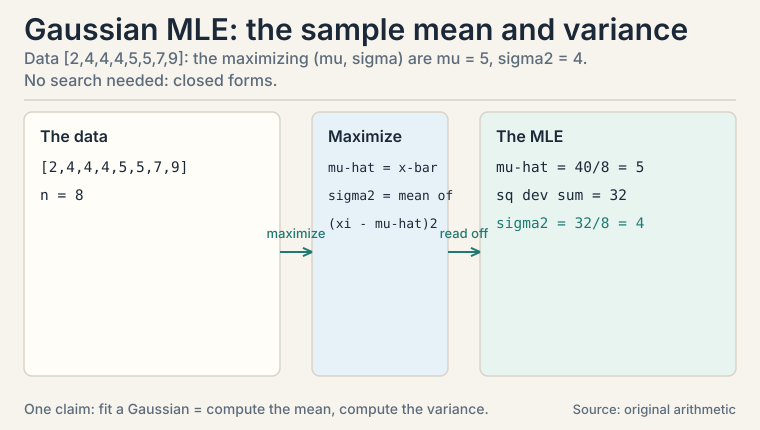

## The task: name the shapes uncertainty takes

L05 gave the rules of probability. Now the vocabulary: the specific
distributions that appear in nearly every ML model. A
**distribution** assigns a probability to every possible value of a
random variable. Discrete variables get a **probability mass
function** (a list of probabilities that sum to 1). Continuous
variables get a **probability density function** (a curve whose
areas are probabilities).

Three distributions cover most of ML. Each gets a worked example.

### Subchapter: Bernoulli, the single yes/no

One trial, two outcomes. A coin flip, a click, spam or not spam.

```ascii
X ~ Bernoulli(p):   P(X=1) = p,   P(X=0) = 1-p

fair coin: p = 0.5.  biased ad click: p = 0.03.
E[X] = p.  Var(X) = p(1-p).
```

The variance formula is worth reading: p(1-p) is largest at p =
0.5 (maximum uncertainty) and zero at p = 0 or 1 (certainty). For
the ad with p = 0.03: variance = 0.03 * 0.97 = 0.0291. Rare events
have small variance because the answer is almost always "no".

Why does the variance peak exactly at 0.5? Differentiate p(1-p) =
p - p^2: derivative 1 - 2p = 0 gives p = 0.5. Symmetry forces it:
the yes/no question is hardest when both answers are equally
likely.

: maximum uncertainty at 0.5, zero at certainty. Ad click p=0.03: 0.0291. Shell 2. Source: original arithmetic. Project: Stanford Frontier AI.")

### Subchapter: Binomial, the count of yeses

Repeat n Bernoulli trials. Count the successes.

```ascii
K ~ Binomial(n, p):  P(K=k) = C(n,k) * p^k * (1-p)^(n-k)

10 emails, each spam with p = 0.2.  P(exactly 3 spam)?
C(10,3) = 120.  P = 120 * 0.2^3 * 0.8^7
       = 120 * 0.008 * 0.2097 = 0.201
```

About a 20% chance of exactly 3 spam emails. E[K] = np = 2,
Var(K) = np(1-p) = 1.6. The Binomial is the distribution behind
every "k out of n" question: k conversions out of n visitors, k
defects out of n parts.

Read the formula in three parts. C(n,k): the number of orders the
k yeses can appear in. p^k: the probability of one specific order
with k yeses. (1-p)^(n-k): the nos fill the rest. Ways times
per-way probability: the same pattern as the plate shows.

 = 120 * 0.2^3 * 0.8^7 = 0.201. Mean 2, variance 1.6. Shell 2. Source: original toy. Project: Stanford Frontier AI.")

### Subchapter: Poisson, rare events over time

The Binomial needs a fixed n: trials you can count. What about
events in continuous time: support calls per minute, server hits
per second, clicks per hour? There is no n. The **Poisson**
distribution takes over. One parameter, lambda, the average rate:

```ascii
K ~ Poisson(lambda):  P(K = k) = e^(-lambda) * lambda^k / k!

mean = lambda,  variance = lambda
```

Toy: a support desk averages 3 calls per minute. Probability of
exactly 5 calls in the next minute:

```ascii
P(5) = e^(-3) * 3^5 / 120 = 0.0498 * 243 / 120 = 0.1008
```

About a 10% chance. Mean 3, variance 3: one number does both
jobs. The Poisson is the Binomial's limit when n is large and p
is small with n*p = lambda: chop each minute into a thousand
tiny slices, each slice a trial with tiny p. That is why rare
events are Poisson: each instant is a trial, almost all of them
"no."

The hinge the Poisson raises: it counts events in a fixed
window. What if you care about the wait *between* events?

### Subchapter: Exponential, the waiting time

If calls arrive as a Poisson process at rate lambda, the wait
between consecutive calls is **Exponential** with mean 1/lambda.
Toy: buses arrive on average every 10 minutes. Probability the
wait exceeds 15 minutes:

```ascii
P(wait > 15) = e^(-15/10) = e^(-1.5) = 0.2231
```

About 22%. Now the strange property, verified with numbers.
You have already waited 10 minutes. Probability you wait 15
*more*:

```ascii
P(wait > 25 | waited 10) = P(wait > 15) = 0.2231
```

The past wait tells you nothing. This is **memorylessness**:
only the Exponential (continuous) and the Geometric (discrete)
have it. Where it bites: reliability modeling, queueing theory,
request timeouts. Where it breaks: anything with aging. A
10-year-old machine is more likely to fail than a new one, so
its lifetime is not Exponential. Check memorylessness before
assuming it.

### Subchapter: Multinomial, the many-sided die

The Binomial counts one face's yeses. The **Multinomial** counts
all faces at once: n rolls, k1 of face 1, k2 of face 2, and so
on:

```ascii
P(k1, k2, ...) = n! / (k1! k2! ...) * p1^k1 * p2^k2 * ...
```

Toy: 10 rolls of a fair die. Probability of exactly 3 sixes
(the other faces unrestricted):

```ascii
P = C(10,3) * (1/6)^3 * (5/6)^7 = 120 * 0.00463 * 0.2791 = 0.1550
```

About 15.5%. Read it as the Binomial pattern generalized:
count the orders, multiply by per-order probability.

The ML payoff is immediate. A language model's next-token
prediction is a Multinomial with n = 1: one draw, tens of
thousands of faces. The softmax output (CS229 L04) is the
probability vector p1, p2, .... Sampling the next token *is*
sampling this Multinomial. Temperature reshapes the p_i before
the draw: lower temperature sharpens the favorite, higher
temperature flattens toward uniform. Every token any LM ever
emits comes from this distribution. CS336's sampling chapter
lives here.

### Subchapter: Gaussian, the bell curve

The **Gaussian** or **normal** distribution is the continuous
workhorse: measurement noise, heights, test scores, and the
initialization of every neural network weight.

```ascii
X ~ N(mu, sigma^2):  bell centered at mu, width set by sigma

68-95-99.7 rule: P(|X - mu| < sigma)   = 0.68
                 P(|X - mu| < 2 sigma) = 0.95
                 P(|X - mu| < 3 sigma) = 0.997
```

Human heights: mu = 170 cm, sigma = 10 cm. About 95% of people fall
between 150 and 190 cm. About 0.3% fall outside 140-200 cm. The
rule turns "two standard deviations" into a plain-English rarity
claim, which is why anomaly detectors threshold at 2 or 3 sigma.

Why is the Gaussian everywhere? The **central limit theorem**: a
sum of many small independent effects looks Gaussian no matter
what the pieces look like. Measurement error is the sum of many
tiny disturbances, so it is Gaussian. A neural layer sums hundreds
of weighted inputs, so its pre-activation is near-Gaussian: this
is the deep reason weight initialization samples Gaussians and the
sums stay controlled. This is the deep reason the normal
distribution models noise across science and ML.

: 95% fall between 150 and 190 cm. Shell 2. Source: original arithmetic. Project: Stanford Frontier AI.")

### Subchapter: z-scores, one ruler for all Gaussians

Every Gaussian becomes the standard one via the **z-score**:

```ascii
z = (x - mu) / sigma
```

Height 190 cm with mu = 170, sigma = 10: z = 2. "Two sigma
above the mean" is now one number, comparable across any
Gaussian anywhere. The 68-95-99.7 rule is really a statement
about z: P(|z| < 1) = 0.68, P(|z| < 2) = 0.95, P(|z| < 3) =
0.997. Anomaly detectors threshold |z| > 3 because only 0.3% of
honest data lands there. Feature standardization (subtract the
mean, divide by the std) converts every feature to z-scores so
that gradient descent (L08) sees all directions at the same
scale. Without it, one feature measured in millimeters
dominates one measured in kilometers.

### Subchapter: the central limit theorem, by the numbers

The draft states the CLT. Watch it work. Roll 30 fair dice. One
die: mean 3.5, variance 35/12 = 2.917. The sum S of 30 dice:
mean 30 * 3.5 = 105, variance 30 * 2.917 = 87.5, std 9.35. The
CLT says S is near-Gaussian. Test it: probability the sum
exceeds 120?

```ascii
z = (120 - 105) / 9.35 = 1.60
P(S > 120) ~ P(Z > 1.60) = 0.055
```

About a 5.5% chance. The pieces are flat: each die is uniform,
no bell anywhere. The sum is a bell anyway. That is the whole
theorem: add enough independent pieces and the shape of the
pieces is forgotten. Only the mean and the variance survive.
Two conditions, both load-bearing: the pieces must be
independent (correlated pieces keep their correlation), and no
single piece may dominate (one huge piece drags the sum with
it). Heavy-tailed pieces with infinite variance break it
entirely.

### Subchapter: the multivariate Gaussian

One Gaussian per dimension misses how dimensions move together.
The **multivariate Gaussian** N(mu, Sigma) fixes it: mu is the
mean vector, Sigma the **covariance matrix**. Build one from
four points: (1,2), (2,3), (3,5), (4,4). Means: (2.5, 3.5).

```ascii
Var(X) = [(1-2.5)^2 + (2-2.5)^2 + (3-2.5)^2 + (4-2.5)^2] / 4
       = (2.25 + 0.25 + 0.25 + 2.25) / 4 = 1.25
Var(Y) = 1.25   (same arithmetic on the second coordinates)
Cov(X,Y) = [(1-2.5)(2-3.5) + (2-2.5)(3-3.5)
          + (3-2.5)(5-3.5) + (4-2.5)(4-3.5)] / 4
       = (2.25 + 0.25 + 0.75 + 0.75) / 4 = 1.0

Sigma = [ 1.25  1.00 ]
        [ 1.00  1.25 ]
```

Read the matrix: the diagonal holds each dimension's variance,
the off-diagonal the pairwise covariance. Symmetric, always.
Positive semidefinite, always: for any vector v, v^T Sigma v =
Var(v^T X) >= 0 (L03's eigenvalue test: here the eigenvalues
are 2.25 and 0.25, both positive). Where it bites: CS229 L09's
Gaussian mixture models fit one multivariate Gaussian per
cluster. The covariance matrix *is* the cluster's shape:
round, stretched, tilted. L03's PCA diagonalizes this matrix.
its eigenvectors are the principal components.

## Maximum likelihood: fit the distribution to data

You observe data. Which parameters make the data most probable?
That is **maximum likelihood estimation**, MLE: pick the parameters
that maximize P(data | parameters).

### Subchapter: Bernoulli MLE is counting

Bernoulli MLE, worked by hand. Five ad impressions, clicks on the
1st and 4th: data = [1, 0, 0, 1, 0]. The likelihood of p is

```ascii
L(p) = p * (1-p) * (1-p) * p * (1-p) = p^2 (1-p)^3
```

Try p = 0.4: L = 0.16 * 0.216 = 0.0346. Try p = 0.5: L = 0.25 *
0.125 = 0.0313. Try p = 0.3: L = 0.09 * 0.343 = 0.0309. The winner
near 0.4 is no accident: the MLE for Bernoulli is the sample mean,
2/5 = 0.4. Counting is estimating. This one fact underlies naive
Bayes training (CS229 L05): estimate each likelihood by counting.

 = p^2 (1-p)^3 peaks at p = 0.4, the sample mean. Shell 3. Source: original arithmetic. Project: Stanford Frontier AI.")

### Subchapter: Gaussian MLE is the sample mean and variance

The same idea on the Gaussian: given data points x_1..x_n, the
(mu, sigma) maximizing the likelihood are the sample mean and the
sample variance. Data [2, 4, 4, 4, 5, 5, 7, 9]: mean = 5,
variance = 4. No search needed: closed forms. This is why "fit a
Gaussian" in code is two lines: compute the mean, compute the
variance. MLE turns distribution-fitting into arithmetic.

The pattern to carry: write the likelihood, maximize it, read off
the estimator. Bernoulli gives counting. Gaussian gives
mean-and-variance. Each distribution's MLE is a different summary
of the data: always derive it, never guess.



### Subchapter: always maximize the log

Real likelihoods multiply hundreds of tiny probabilities. A
thousand coin flips at p = 0.5: L = 0.5^1000 = 9.3e-302.
Push to 1100 flips and float64 underflows to exactly 0.0. The
maximizer is then undefined: every candidate scores 0. The fix
is the **log-likelihood**: log is monotone, so maximizing L is
the same as maximizing log L, and products become sums:

```ascii
log L = sum of log p(x_i | params)
```

A thousand flips: 1000 * log(0.5) = -693.1. A perfectly
ordinary number, no underflow. Every MLE in ML code maximizes
the log-likelihood. Its negation is the **negative
log-likelihood**, NLL: the loss function. Cross-entropy (L10)
*is* the NLL of a categorical model. When you minimize
cross-entropy, you are doing MLE with the log already taken.

### Subchapter: the Gaussian MLE, derived properly

The draft stated the Gaussian closed forms without showing
them: mean 5, variance 4 on [2, 4, 4, 4, 5, 5, 7, 9]. Derive
them. First the density. For one data point x, center mu,
squared width sigma^2:

```ascii
N(x | mu, sigma^2) = (2 pi sigma^2)^(-1/2) * exp( -(x-mu)^2 / (2 sigma^2) )
```

Three symbols, defined at first use. mu is the center of the
bell. sigma^2 is its squared width. x is one observed point.
pi is the circle constant 3.14159, appearing in the bell
curve's normalization. The exp term peaks at x = mu and falls
off symmetrically on both sides. The (2 pi sigma^2)^(-1/2)
factor scales the curve so the probabilities sum to 1.

For n independent points x_1..x_n, the likelihood multiplies
the density n times. The log-likelihood ell turns the product
into a sum:

```ascii
ell = -(n/2) log(2 pi sigma^2) - sum_i (x_i - mu)^2 / (2 sigma^2)
```

Two terms. The first comes from the n copies of the
normalization factor. The second adds one squared-distance
penalty per point.

Differentiate with respect to mu and set to zero. The first
term has no mu. The second gives:

```ascii
d ell / d mu = sum_i (x_i - mu) / sigma^2 = 0
sum_i x_i - n mu = 0  -->  mu-hat = (sum_i x_i) / n
```

The maximizer is the sample mean. On the toy: sum =
2+4+4+4+5+5+7+9 = 40, so mu-hat = 40/8 = 5.

Differentiate with respect to sigma^2 and set to zero. Write
v = sigma^2 to keep the derivative clean: ell = -(n/2)
log(2 pi v) - sum_i (x_i - mu)^2 / (2 v). Then:

```ascii
d ell / d v = -n/(2v) + sum_i (x_i - mu)^2 / (2 v^2) = 0
-n v + sum_i (x_i - mu)^2 = 0  -->  v-hat = sum_i (x_i - mu)^2 / n
```

Evaluate at mu = mu-hat, the maximizer just found: the
variance is the mean squared distance from the fitted center,
dividing by n. On the toy: deviations from 5 are -3, -1, -1,
-1, 0, 0, 2, 4. Squares: 9, 1, 1, 1, 0, 0, 4, 16. Sum: 32.
So sigma^2-hat = 32/8 = 4.

The derivative route agrees with the arithmetic, as it must.
The Bernoulli derivation gave counting. This one gives
mean-and-variance. Same pattern, different distribution. This
is also why numpy's var returns 4.0 on the toy: numpy divides
by n, the MLE answer, while pandas' 4.5714 divides by n-1,
the classical correction the next subchapter explains.

### Subchapter: the Bernoulli MLE, derived properly

The draft found p = 0.4 by trying values. Derive it. L(p) =
p^2 (1-p)^3. Take the log: 2 log p + 3 log(1-p). Differentiate
and set to zero:

```ascii
d/dp [2 log p + 3 log(1-p)] = 2/p - 3/(1-p) = 0
2(1-p) = 3p  -->  2 = 5p  -->  p = 0.4
```

The derivative route agrees with the grid search, as it must.
Generalize: k ones in n trials give log L = k log p + (n-k)
log(1-p), derivative k/p - (n-k)/(1-p) = 0, solution p = k/n.
The sample mean, always, for any dataset. This is the
derivation behind naive Bayes training (CS229 L05): each
class-conditional probability is a Bernoulli MLE, which is a
count.

### Subchapter: the n vs n-1 question

The Gaussian MLE variance on [2,4,4,4,5,5,7,9] divides by n:
32/8 = 4.0. Statistics courses divide by n-1: 32/7 = 4.5714.
Both are "the variance." Why do they differ? The sample mean 5
was fit to the same data, so deviations from it understate the
true spread: the data never gets to surprise its own mean.
Dividing by n gives a **biased** estimator (its expectation is
(n-1)/n times the truth). Dividing by n-1, **Bessel's
correction**, unbiases it.

Decision rule: use the MLE (divide by n) when n is large (the
bias is 1/n, negligible) or when consistency with the
likelihood matters, as in model training. Use n-1 for small
samples in classical statistics. numpy's var defaults to n.
pandas' defaults to n-1. Now you know why they disagree, and
that the disagreement vanishes as n grows.

| Estimator | Formula on the toy | Value | Bias | Use when |
|---|---|---|---|---|
| MLE variance (divide by n) | 32 / 8 | 4.0 | biased: expectation is (n-1)/n = 0.875 of the truth | n large, or model training (matches the likelihood) |
| Bessel's correction (divide by n-1) | 32 / 7 | 4.5714 | unbiased | small samples in classical statistics |

numpy's `var` divides by n (4.0); pandas' divides by n-1 (4.5714). The disagreement vanishes as n grows.

## Joint distributions and covariance: when variables move together

A **joint distribution** P(X, Y) describes two variables at once.
From it you can read each variable alone (**marginal**) or one
given the other (**conditional**). The number that summarizes how
two variables move together is the **covariance**:

```ascii
Cov(X, Y) = E[(X - E[X])(Y - E[Y])]
```

Positive: above-average X comes with above-average Y. Negative:
they move oppositely. Zero: no linear relationship.

### Subchapter: covariance by hand

Three points, by hand: (1, 2), (2, 4), (3, 6). Means: E[X] = 2,
E[Y] = 4.

```ascii
Cov = [(1-2)(2-4) + (2-2)(4-4) + (3-2)(6-4)] / 3
    = [( -1)(-2) + 0 + (1)(2)] / 3
    = (2 + 0 + 2) / 3 = 1.33
```

Positive, as expected: the points lie on a rising line. Now the
L05 follow-up made concrete: Var(X + Y) = Var(X) + Var(Y) + 2
Cov(X, Y). Here Var(X) = 2/3, Var(Y) = 8/3, so Var(X+Y) = 2/3 +
8/3 + 2*1.33 = 6. The covariance term contributed nearly half.
Correlated features inflate the variance of their sum. Portfolio
managers and ML regularizers both fight this term.

 = 6: the +2Cov term added 2.67. Shell 3. Source: original arithmetic. Project: Stanford Frontier AI.")

### Subchapter: correlation, the normalized version

Covariance has units: it scales with X and Y. Divide it out:

```ascii
correlation = Cov(X, Y) / (std(X) * std(Y))    in [-1, 1]
```

Toy: std(X) = sqrt(2/3) = 0.816, std(Y) = sqrt(8/3) = 1.633,
correlation = 1.33 / (0.816 * 1.633) = 1.33 / 1.333 = 1.0. Perfect
linear relationship, as the collinear points promise. Correlation
is cosine similarity (L01) wearing a statistician's hat: both
divide a raw agreement by the sizes. Use correlation to compare
relationships across different units. Use covariance inside
formulas like Var(X+Y).

### Subchapter: zero covariance does not mean independence, worked

The classic trap, with every number shown. X takes values
{-2, -1, 0, 1, 2}. Y = X^2, a deterministic function of X:
perfect dependence. Means: X-bar = 0, Y-bar = (4+1+0+1+4)/5 =
2.

```ascii
Cov = (1/5) * sum of x * (y - 2)
    = (1/5)[ (-2)(2) + (-1)(-1) + (0)(-2) + (1)(-1) + (2)(2) ]
    = (1/5)[ -4 + 1 + 0 - 1 + 4 ] = 0
```

Exactly zero. Knowing X determines Y completely, yet the
covariance sees nothing. Why? Covariance measures *linear*
co-movement: above-average X with above-average Y. The parabola
is symmetric: the left arm contributes -4 and +1, the right arm
+4 and -1. They cancel. The lesson is one-directional:
independence implies zero covariance (independent variables
cannot co-move, linearly or otherwise). Zero covariance implies
nothing. For jointly Gaussian variables the reverse holds too,
which is why the Gaussian case is special. Everywhere else,
test independence with mutual information (L10), not with
covariance.

| Distribution | Models | Key numbers |
|---|---|---|
| Bernoulli(p) | one yes/no | mean p, var p(1-p) |
| Binomial(n, p) | count of yeses in n trials | mean np, var np(1-p); toy: P(3 spam of 10) = 0.201 |
| Poisson(lambda) | events per unit time | mean = var = lambda; toy: P(5 calls at rate 3) = 0.1008 |
| Exponential(lambda) | waiting time between events | memoryless; toy: P(wait > 15 min at 10-min mean) = 0.2231 |
| Multinomial(n, p) | counts across many faces | n=1 is the LM next-token draw; toy: P(3 sixes in 10 rolls) = 0.1550 |
| Gaussian(mu, sigma^2) | continuous noise, measurements | 68-95-99.7 rule; toy: 95% of heights in 150-190 cm |
| Multivariate Gaussian(mu, Sigma) | correlated continuous vectors | Sigma = covariance matrix; toy: [[1.25, 1.0],[1.0, 1.25]] |
| MLE | fit parameters to data | Bernoulli: sample mean; Gaussian: mean and variance; always maximize the log |
| Covariance | joint movement | toy: 1.33 on three collinear points; zero does not mean independent |
| Correlation | normalized covariance | in [-1, 1]; toy: 1.0 |

## What is used where: the real systems

| Math idea | Where it appears | Why there |
|---|---|---|
| Gaussian init | Weight initialization | sums of weights stay controlled (CLT) |
| MLE | All model training | naive Bayes counts; deep nets optimize the likelihood |
| 68-95-99.7 | Anomaly detection | 2-3 sigma thresholds |
| Covariance matrix | PCA (L03), GMM (CS229 L09) | eigenvectors are the components; the matrix is the cluster shape |
| Multivariate Gaussian | Gaussian mixtures (CS229 L09) | one Gaussian per cluster, covariance = shape |
| Bernoulli | Binary classification | one yes/no per example |
| Binomial | A/B testing | k conversions out of n visitors |
| Multinomial | LM token sampling (CS336) | softmax output is the face probabilities; temperature reshapes them |
| Poisson | Rate modeling | requests per minute, events per window |
| z-scores | Feature standardization | equal scales for gradient descent (L08) |
| Log-likelihood | Every training loss | products underflow; logs turn them into sums |

, 1000 flips = -693.1, NLL is the loss. Right: closed forms: Bernoulli p = 0.4 by counting, Gaussian mean 5 variance 4. Bottom: MLE divides by n (4.0, biased 7/8); n-1 (4.5714) unbiases. Dense chapter plate. Source: original synthesis of the lesson. Project: Stanford Frontier AI.")

> [!QA]
> Q: Why do ML courses keep assuming Gaussian noise?
> A: Two reasons. The central limit theorem: sums of many small independent effects look Gaussian, and measurement error is such a sum. And the math is kind: the Gaussian is fully described by mean and variance, its MLE has a closed form (sample mean, sample variance), and Gaussians stay Gaussian under linear maps. In the toy, heights N(170, 100) give the 95% interval 150-190 cm directly from the 68-95-99.7 rule.
> Follow-up: What breaks if the noise is not Gaussian?
> A: Least squares stops being the MLE. Squared error is the MLE only under Gaussian noise; with heavy-tailed noise (outliers), it chases the outliers. That is why regression with the absolute value swaps the square for a loss that resists outliers. The loss function encodes a noise assumption: always ask which one.

> [!QA]
> Q: What is maximum likelihood estimation, concretely?
> A: Pick the parameters that make the observed data most probable. Five ad impressions with 2 clicks: the likelihood p^2 (1-p)^3 peaks at p = 0.4, the sample mean. For Bernoulli, MLE is counting. For Gaussian, MLE is the sample mean and sample variance. Training a generative model is usually MLE wearing fancier clothes.
> Follow-up: Is the MLE always the sample mean?
> A: No. It is the sample mean for Bernoulli and Gaussian means because their likelihoods peak there. For other distributions it differs: the MLE of a uniform [0, theta] distribution's endpoint is the maximum observed value, not any mean. Always derive it from the likelihood. Never guess.

> [!QA]
> Q: Walk me through the Binomial probability for exactly 3 spam out of 10.
> A: Each email is spam with p = 0.2. Step 1: count the orders: C(10,3) = 120 ways to choose which 3 are spam. Step 2: one specific order, say SSSNNNNNNN, has probability 0.2^3 * 0.8^7 = 0.008 * 0.2097. Step 3: multiply: 120 * 0.008 * 0.2097 = 0.201. Ways times per-way probability. Mean np = 2, variance np(1-p) = 1.6.
> Follow-up: When does Binomial become Gaussian?
> A: When n is large: the Binomial(n,p) approaches N(np, np(1-p)) by the central limit theorem. Rule of thumb: np and n(1-p) both above 5. That is why large-sample counts get z-tests instead of exact Binomial arithmetic.

> [!QA]
> Q: Covariance is positive. So what?
> A: It means above-average X travels with above-average Y, linearly. In the toy, three points on a rising line give Cov = 1.33. The practical bite: Var(X+Y) includes +2 Cov(X,Y), so correlated features inflate variance. That inflation is why L01's dependent features are dangerous and why regularization (CS229 L06) penalizes large weights on correlated inputs.
> Follow-up: Does zero covariance mean independence?
> A: No. Zero covariance means no *linear* relationship. Y = X^2 with symmetric X has zero covariance but perfect dependence: knowing X determines Y exactly. Independence implies zero covariance. The reverse fails. Interviewers love this trap.

> [!QA]
> Q: Correlation vs covariance: which do you report?
> A: Correlation when comparing across units: it is unitless, in [-1, 1]. Covariance inside formulas: Var(X+Y) needs the raw Cov, not the normalized version. In the toy, Cov = 1.33 but correlation = 1.0: the first feeds the variance formula, the second tells a human "perfect linear relationship."
> Follow-up: What is the correlation between a feature and itself?
> A: Exactly 1: Cov(X,X) = Var(X), divided by std(X)*std(X) = Var(X). The correlation matrix has 1s on the diagonal: each variable perfectly tracks itself. Off-diagonals are the interesting part.

> [!QA]
> Q: Your model assumes Gaussian noise but the residuals have huge outliers. Diagnose and fix.
> A: The Gaussian's thin tails make least squares chase outliers: one wild point dominates the squared error. Diagnose with a residual histogram or Q-Q plot: heavy tails show as points far off the line. Fix: switch to a heavy-tailed noise model, which means swapping squared error for absolute error (Laplace noise MLE), or Huber loss as the compromise. The loss encodes the noise assumption: change the assumption, change the loss.
> Follow-up: Why not always use absolute error then?
> A: It is not differentiable at zero, which complicates gradient methods, and it is less efficient than least squares when the noise really is Gaussian. Huber loss splits the difference: quadratic near zero, linear in the tails. Match the loss to the noise you actually have.

> [!QA]
> Q: Explain the central limit theorem in one paragraph and name where it bites in ML.
> A: Sums of many small independent effects look Gaussian regardless of the pieces. A neural layer sums hundreds of weighted inputs: its pre-activation is near-Gaussian, which is why weight initialization samples Gaussians and the sums stay controlled. Measurement noise is a sum of tiny disturbances: Gaussian, which is why least squares is the default fit. It bites wherever sums appear: initialization, noise models, and large-sample statistics.
> Follow-up: What breaks the CLT?
> A: Dependence or heavy tails. If the summed effects are strongly correlated, the sum keeps the correlation structure. If individual pieces have infinite variance (Cauchy-like tails), the sum never becomes Gaussian. Check independence and tail weight before invoking it.

> [!QA]
> Q: A language model outputs a probability for each of 50,000 tokens. Which distribution is that, and what does sampling mean?
> A: A Multinomial with n = 1: one draw, 50,000 faces. The softmax layer produces the face probabilities p1 through p50000. Sampling the next token draws once from this Multinomial. Temperature reshapes the probabilities before the draw: T below 1 sharpens the favorite, T above 1 flattens toward uniform. Greedy decoding (temperature 0) skips the draw and takes the argmax. Every token any LM emits is one draw from this distribution.
> Follow-up: Why does the n = 1 case matter more than large n?
> A: Because generation is sequential: each step draws exactly one token, then conditions on it. Large-n Multinomials count faces across many draws (10 die rolls). The n = 1 case is the single-draw building block that, repeated autoregressively, produces whole texts. The sampling chapter of CS336 is this distribution applied 50,000 times in a row.

## Recap: the whole lesson on one screen

1. **The task.** Name the shapes uncertainty takes: mass functions for discrete, densities for continuous.
2. **Bernoulli.** One yes/no: P(X=1) = p. Ad click p = 0.03, variance 0.0291. Variance peaks at p = 0.5.
3. **Binomial.** Count of yeses: P(exactly 3 spam of 10) = 0.201, computed term by term. Ways times per-way probability.
4. **Gaussian.** The bell: 68-95-99.7 rule. 95% of N(170,100) heights fall in 150-190 cm. Central limit theorem explains its ubiquity: sums of small effects.
5. **MLE.** Parameters that maximize P(data | params). Bernoulli toy: p^2(1-p)^3 peaks at the sample mean 0.4. Gaussian MLE: sample mean and variance. Counting is estimating.
6. **Covariance.** E[(X-mean)(Y-mean)]: 1.33 on three collinear points. Correlated features inflate Var(X+Y) through the +2Cov term. Correlation normalizes to [-1, 1]: the toy gives 1.0.
7. **The price.** Every distribution is an assumption. Gaussian MLE gives least squares. Wrong noise model gives wrong loss.
8. **The wider family.** Poisson counts events in time (P(5 calls at rate 3) = 0.1008). Exponential prices waits (memoryless: P(wait > 15) = 0.2231). Multinomial counts many faces. With n = 1 it is the LM next-token draw.
9. **Standardize and sum.** z-scores put every Gaussian on one ruler. The CLT, by the numbers: 30 dice sum to mean 105, std 9.35. P(sum > 120) = 0.055. Pieces forgotten, only mean and variance survive.
10. **The multivariate Gaussian.** N(mu, Sigma): the covariance matrix is the shape. Toy Sigma = [[1.25, 1.0],[1.0, 1.25]], eigenvalues 2.25 and 0.25.
11. **MLE done right.** Maximize the log: 1000 flips give -693.1, not 9.3e-302. Bernoulli derived: 2/p - 3/(1-p) = 0 gives p = 0.4. Variance: divide by n for the MLE (4.0), by n-1 to unbias (4.5714).
12. **The trap, worked.** Y = X^2 on {-2,-1,0,1,2}: covariance exactly 0, dependence perfect. Zero covariance never proves independence.
13. **The bridge.** Distributions describe data. Calculus (L07) optimizes over parameters. Together they train models.

## Go deeper

<div style="position:relative;padding-bottom:56.25%;height:0;overflow:hidden;max-width:100%;margin:16px 0;">
<iframe style="position:absolute;top:0;left:0;width:100%;height:100%;" src="https://www.youtube-nocookie.com/embed/rzFX5NWojp0" title="StatQuest: The Normal Distribution, Clearly Explained" frameborder="0" allow="accelerometer; autoplay; clipboard-write; encrypted-media; gyroscope; picture-in-picture" allowfullscreen></iframe>
</div>

- StatQuest, "The Normal Distribution, Clearly Explained" (the embed above): https://www.youtube.com/watch?v=rzFX5NWojp0
- The NPTEL lecture for this lesson (frontmatter video): https://www.youtube.com/watch?v=qDIK0wR41Ic
- Bishop, "Pattern Recognition and Machine Learning", ch. 1.2, 2: Bernoulli, Binomial, Gaussian, MLE.
- Deisenroth, Faisal, Ong, "Mathematics for Machine Learning", ch. 6 (free): https://mml-book.github.io: distributions, covariance.

## Official sources and further reading

**Official:**
- "Essential Mathematics for Machine Learning" playlist, Lecture 51 (this lesson's video): [paper](https://www.youtube.com/watch?v=qDIK0wR41Ic)
- NPTEL course page (111107137): https://nptel.ac.in/courses/111107137

**Further reading:**
- Bishop, "Pattern Recognition and Machine Learning", ch. 1.2, 2: Bernoulli, Binomial, Gaussian, MLE.
- Deisenroth, Faisal, Ong, "Mathematics for Machine Learning", ch. 6 (free):
  - [distributions, covariance.](https://mml-book.github.io)

**Caveats.** The lecture titles promise discrete, continuous, and joint distributions with covariance. The specific worked examples (spam emails, heights, ad clicks) are the lesson's own. Exact lecture examples are [uncertain].

## Connections to the other courses

- **CS229 L09:** Gaussian mixture models. Each cluster is a multivariate Gaussian from this lesson: EM fits its mean and its covariance matrix. The covariance matrix is the cluster's shape.
- **CS229 L10:** EM and PCA. EM generalizes this lesson's MLE to hidden variables. PCA diagonalizes the covariance matrix built here.
- **CS229 L04:** the softmax output is a Multinomial's probability vector. Multinomial sampling with n = 1 draws one class.
- **CS229 L05:** naive Bayes trains by MLE counting. Gaussian discriminant analysis fits Gaussians per class.
- **CS229 L02:** least squares is Gaussian MLE. The 68-95-99.7 rule justifies sigma-based anomaly thresholds.
- **CS336:** weight initialization samples Gaussians. The central limit theorem explains why sums of weights stay controlled. Token sampling draws from a Multinomial with n = 1 at every step.
- **CS329H:** discrete choice models (logit) are Multinomial models of human decisions.

## Coverage map: every lecture concept and where it lives

The playlist lecture (L51, discrete distributions) promises
Bernoulli and Binomial. Worked examples marked "lesson toy" are the lesson's own. The lecture's
exact examples are [uncertain] (transcripts not recovered).

| Lecture concept | Covered in | File line |
|---|---|---|
| PMF vs PDF, discrete vs continuous | The task: name the shapes uncertainty takes | L28 |
| Bernoulli: P(X=1) = p, mean p, var p(1-p) | Bernoulli, the single yes/no | L40 |
| Bernoulli variance peaks at p = 0.5 (lesson toy: 0.0291 at p = 0.03) | Bernoulli, the single yes/no | L40 |
| Binomial: C(n,k) p^k (1-p)^(n-k); toy P(3 spam of 10) = 0.201 | Binomial, the count of yeses | L63 |
| Poisson: e^-lambda lambda^k / k!; toy P(5 calls at rate 3) = 0.1008 | Poisson, rare events over time | L87 |
| Exponential waiting time; memorylessness; toy P(wait > 15) = 0.2231 | Exponential, the waiting time | L117 |
| Multinomial; n = 1 is the LM next-token draw; toy P(3 sixes) = 0.1550 | Multinomial, the many-sided die | L144 |
| Gaussian, 68-95-99.7; heights toy N(170,100) | Gaussian, the bell curve | L174 |
| z-scores; standardization for gradient descent | z-scores, one ruler for all Gaussians | L204 |
| Central limit theorem; 30-dice toy: mean 105, std 9.35, P(>120) = 0.055 | the central limit theorem, by the numbers | L223 |
| Multivariate Gaussian; covariance matrix toy [[1.25,1.0],[1.0,1.25]] | the multivariate Gaussian | L246 |
| MLE: Bernoulli counting toy p^2(1-p)^3 peaks at 0.4 | Bernoulli MLE is counting | L281 |
| MLE: Gaussian sample mean and variance; toy mean 5, var 4.0 | Gaussian MLE is the sample mean and variance | L298 |
| Log-likelihood; underflow: 0.5^1000 = 9.3e-302 vs log -693.1 | always maximize the log | L312 |
| Bernoulli MLE derived: 2/p - 3/(1-p) = 0 gives p = 0.4 | the Bernoulli MLE, derived properly | L332 |
| Bessel's correction: 4.0 (n) vs 4.5714 (n-1) on the toy data | the n vs n-1 question | L351 |
| Joint, marginal, conditional distributions | Joint distributions and covariance | L369 |
| Covariance by hand: 1.33 on three collinear points; Var(X+Y) = 6 | covariance by hand | L383 |
| Correlation in [-1,1]; toy 1.0; covariance vs correlation rule | correlation, the normalized version | L403 |
| Zero covariance trap: Y = X^2, Cov = 0 exactly, perfect dependence | zero covariance does not mean independence, worked | L419 |
| Covariance matrix; PSD; PCA/GMM links (CS229 L09/L10) | the multivariate Gaussian; What is used where | L246, L457 |
| Multinomial token sampling; temperature (CS336) | Multinomial; What is used where | L144, L457 |
