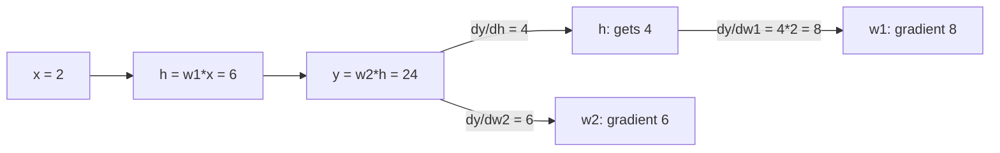

## The task: optimize functions of a million variables

A neural network's loss is one number computed from millions of
weights. Training means adjusting every weight to lower that
number. School calculus differentiates functions of one variable.
ML needs the same idea for functions of a million variables, built
in layers.

The lecture builds this in five parts (Lectures 31-35). This
lesson rebuilds each part from zero, then aims them all at one
target: **backpropagation**, the algorithm that trains every neural
network (CS229 L08).

## Partial derivatives: change one variable, freeze the rest

Take f(x, y) = x^2 + 3xy + y^2. How fast does f change when x
moves? Treat y as a constant number and differentiate normally.
That is the **partial derivative** with respect to x, written
df/dx:

```ascii
f(x, y) = x^2 + 3xy + y^2

df/dx = 2x + 3y        (y frozen: derivative of 3xy is 3y)
df/dy = 3x + 2y        (x frozen)

at (x, y) = (2, 1):  df/dx = 4 + 3 = 7,  df/dy = 6 + 2 = 8
```

At the point (2, 1), nudging x up by 0.01 raises f by about 0.07;
nudging y up by 0.01 raises f by about 0.08. Each partial
derivative is a one-variable slope with everything else held
still.

## The gradient: all slopes in one vector

Stack the partial derivatives into a vector. That vector is the
**gradient**, written with an upside-down triangle, nabla:

```ascii
grad f = [ df/dx, df/dy ] = [ 2x + 3y, 3x + 2y ]

at (2, 1): grad f = [ 7, 8 ]
```

The gradient points in the direction of steepest increase. Its
length says how steep. Walk opposite the gradient and you descend
fastest: that is gradient descent, the subject of L08. The
playlist's own multivariable lectures (W9-W10 of the IITM BS
course; Lectures 31-35 here) prove the directional-derivative
formula that makes this true [uncertain: exact lecture proof
unknown].

## The Jacobian: the gradient grows a matrix

What if the output is also a vector? A layer maps R^n to R^m: n
inputs, m outputs. Each output has its own gradient (a row of n
partial derivatives). Stack the m rows. The result is the
**Jacobian** matrix, m x n:

```ascii
g(x, y) = [ x^2 + y,  3xy ]      (R^2 -> R^2)

J = [ dg1/dx  dg1/dy ] = [ 2x   1  ]
    [ dg2/dx  dg2/dy ]   [ 3y  3x  ]

at (2, 1):  J = [ 4  1 ]
                [ 3  6 ]
```

The Jacobian is the linear approximation of the whole map near a
point: g(p + small step) is about g(p) + J * step. When m = 1 the
Jacobian is a single row: the gradient, transposed. One idea, two
shapes.

## The chain rule: derivatives compose like functions

Neural networks are compositions: loss of prediction of layer of
layer of input. The **chain rule** differentiates compositions:

```ascii
one variable:  d/dx f(g(x)) = f'(g(x)) * g'(x)
many:          multiply the Jacobians in order
```

Each layer contributes its Jacobian; the full derivative is their
product. Backpropagation is the chain rule computed
backwards, reusing each layer's result so no work repeats.

## Backprop by hand: a tiny network, real numbers

The whole lesson converges here. A two-weight network, no
nonlinearity (keep the arithmetic visible; the chain rule is the
same with one):

```ascii
forward:   x = 2 --[w1=3]--> h = 6 --[w2=4]--> y = 24
           y = w2 * w1 * x

backward, one question per weight: how does y change when this weight moves?

step 1, dy/dw2:  y = w2 * h, h frozen  -->  dy/dw2 = h = 6
step 2, dy/dw1:  chain through h.
  dy/dh = w2 = 4            (how y responds to h)
  dh/dw1 = x = 2            (how h responds to w1)
  dy/dw1 = (dy/dh) * (dh/dw1) = 4 * 2 = 8
```

Check by brute force: bump w1 to 3.01. Then h = 6.02, y = 24.08.
The change is 0.08 for a 0.01 bump: slope 8. The chain rule
agrees.

Now see why it runs backward. dy/dw1 needed dy/dh, which was
computed on the way back from the output. Each layer's backward
pass needs only its local derivative and the signal arriving from
the layer after it. That locality is backprop: one forward sweep
stores the intermediates, one backward sweep multiplies the
Jacobians, every weight gets its gradient. Cost: about the same as
two forward passes, no matter how deep the network.



## Where it breaks: the chain rule multiplies, and products misbehave

L08's optimization story starts from a crack visible right here.
The gradient of a deep network is a product of many Jacobians.
Each factor below 1 shrinks the signal (vanishing gradients);
each above 1 grows it (exploding gradients). The RNN chapter of
CS229S L02 demonstrates both with 0.9^10 = 0.35 and 1.1^10 =
2.59. The chain rule that makes learning possible also makes it
fragile. Architectures like residuals and normalization exist to
keep these products near 1.

| Idea | Shape | Meaning |
|---|---|---|
| Partial derivative | number | slope along one axis, rest frozen |
| Gradient | vector (n) | direction of steepest increase; length is steepness |
| Jacobian | matrix (m x n) | linear approximation of a vector-valued map |
| Chain rule | product of Jacobians | derivative of a composition |
| Backprop | backward pass | chain rule with reuse; one gradient per weight |

> [!QA]
> Q: What is the gradient, and why does ML care?
> A: The gradient stacks all partial derivatives into one vector. For f(x,y) = x^2 + 3xy + y^2 at (2,1), it is [7, 8]: nudging x raises f at rate 7, nudging y at rate 8. It points in the direction of steepest increase, so walking opposite it is the fastest way down. Every gradient-descent optimizer in ML is a machine for walking opposite gradients.
> Follow-up: Gradient vs. derivative: what is the difference?
> A: The derivative is the one-variable case: one number. The gradient is the multi-variable case: a vector of partial derivatives, one per input. Same idea, more dimensions. The Jacobian generalizes once more, to vector-valued outputs.

> [!QA]
> Q: Work backprop on a tiny example.
> A: Network: x = 2, w1 = 3, w2 = 4, y = w2*w1*x = 24. Backward: dy/dw2 = h = 6 (freeze h, differentiate w2*h). dy/dw1 chains through h: dy/dh = 4 times dh/dw1 = 2, giving 8. Verified by brute force: bumping w1 by 0.01 raises y by 0.08. Each layer needs only its local derivative times the incoming signal, so one backward sweep gradients every weight.
> Follow-up: Why backward instead of forward?
> A: Because each weight's gradient chains through everything after it. Going backward, the signal dy/dh arrives exactly when layer 1 needs it, already containing all downstream factors. Going forward you would recompute the downstream chain separately for every weight: O(n^2) work instead of O(n).

> [!QA]
> Q: What is the Jacobian, concretely?
> A: The matrix of all first-order partial derivatives of a vector-valued function. For g(x,y) = [x^2+y, 3xy] at (2,1), J = [4 1; 3 6]. It is the linear approximation of the map near that point: small input steps map to J times the step. A layer with n inputs and m outputs has an m x n Jacobian; the gradient is the m = 1 case.
> Follow-up: Do you ever form the full Jacobian in deep learning?
> A: Rarely. It is enormous (millions squared). Backprop never builds it: it multiplies Jacobian-vector products layer by layer, which needs only O(weights) memory. Forming the full matrix is the classic beginner inefficiency.

## Recap: the whole lesson on one screen

1. **The task.** Differentiate a million-variable loss built in layers.
2. **Partial derivatives.** Freeze all but one variable: df/dx = 2x+3y, df/dy = 3x+2y; at (2,1): 7 and 8.
3. **Gradient.** Stack them: [7, 8] points steepest uphill. Walk opposite to descend.
4. **Jacobian.** Vector outputs need a matrix of partials: [4 1; 3 6] in the toy. The linear approximation of the map.
5. **Chain rule.** Derivatives of compositions multiply: layer Jacobians in order.
6. **Backprop by hand.** y = 24 from x = 2, w1 = 3, w2 = 4. dy/dw2 = 6, dy/dw1 = 8, verified by a 0.01 bump test.
7. **Why backward.** The downstream signal arrives exactly when each layer needs it: O(n) not O(n^2).
8. **The price.** Products of Jacobians vanish or explode: 0.9^10 = 0.35, 1.1^10 = 2.59. L08 turns the gradient into an optimizer that must survive this.

## Official sources and further reading

**Official:**
- "Essential Mathematics for Machine Learning" playlist, Lectures 31-36:
  https://www.youtube.com/playlist?list=PLLy_2iUCG87D1CXFxE-SxCFZUiJzQ3IvE
- NPTEL course page (111107137): https://archive.nptel.ac.in/courses/111/107/111107137/

**Further reading:**
- Deisenroth, Faisal, Ong, "Mathematics for Machine Learning", ch. 5 (free):
  https://mml-book.github.io — differentiation, Jacobians, chain rule.
- CS229 L08 lecture notes (backpropagation) — the ML consumer of this lesson.

**Caveats.** The toy functions and the two-weight network are the lesson's own. The lecture's exact examples across L31-L36 are [uncertain] (transcripts not recovered).

## Connections to the other courses

- **CS229 L08:** backpropagation in full: the chain rule on real networks with nonlinearities.
- **CS229S L02:** vanishing/exploding gradients demonstrated numerically on the RNN chain.
- **CS336:** autograd engines mechanize this lesson: every tensor operation records its local Jacobian-vector product.
