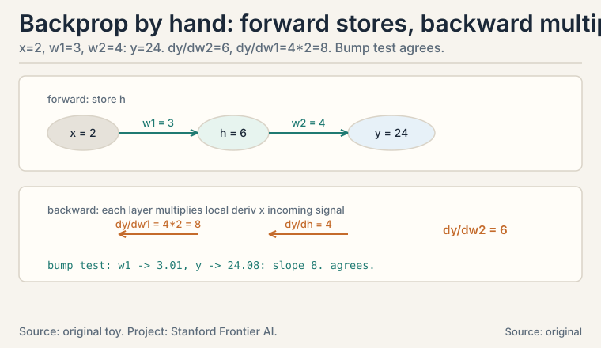
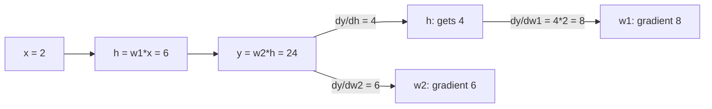

## The task: optimize functions of a million variables

A neural network's loss is one number computed from millions of
weights. Training means adjusting every weight to lower that
number. School calculus differentiates functions of one variable.
ML needs the same idea for functions of a million variables, built
in layers.

The lecture builds this in five parts (Lectures 31-35). This
lesson rebuilds each part from zero, then aims them all at one
target: **backpropagation**, the algorithm that trains every neural
network (CS229 L08).

### Subchapter: partial derivatives, one variable moves

Take f(x, y) = x^2 + 3xy + y^2. How fast does f change when x
moves? Treat y as a constant number and differentiate normally.
That is the **partial derivative** with respect to x, written
df/dx:

```ascii
f(x, y) = x^2 + 3xy + y^2

df/dx = 2x + 3y        (y frozen: derivative of 3xy is 3y)
df/dy = 3x + 2y        (x frozen)

at (x, y) = (2, 1):  df/dx = 4 + 3 = 7,  df/dy = 6 + 2 = 8
```

At the point (2, 1), nudging x up by 0.01 raises f by about 0.07.
nudging y up by 0.01 raises f by about 0.08. Each partial
derivative is a one-variable slope with everything else held
still.

Verify the nudge: f(2.01, 1) = 4.0401 + 6.03 + 1 = 11.0701
against f(2, 1) = 4 + 6 + 1 = 11. The rise is 0.0701 for a 0.01
nudge: slope 7.01, matching df/dx = 7. The derivative is not
magic: it is the nudge ratio, in the limit.

: df/dx = 7, df/dy = 8. Nudge x by 0.01, f rises ~0.07. Shell 2. Source: original toy. Project: Stanford Frontier AI.")

### Subchapter: the gradient, all slopes in one vector

Stack the partial derivatives into a vector. That vector is the
**gradient**, written with an upside-down triangle, nabla:

```ascii
grad f = [ df/dx, df/dy ] = [ 2x + 3y, 3x + 2y ]

at (2, 1): grad f = [ 7, 8 ]
```

The gradient points in the direction of steepest increase. Its
length says how steep. Walk opposite the gradient and you descend
fastest: that is gradient descent, the subject of L08.

Why steepest? The **directional derivative**: the slope along any
unit direction u is grad f dot u, which is largest when u aligns
with grad f (L01's dot product, maximized at cosine 1). The
gradient is not just a list of slopes: it is the direction itself.

. Walk opposite: that is gradient descent. Shell 2. Source: original toy. Project: Stanford Frontier AI.")

### Subchapter: the Jacobian, the gradient grown into a matrix

What if the output is also a vector? A layer maps R^n to R^m: n
inputs, m outputs. Each output has its own gradient (a row of n
partial derivatives). Stack the m rows. The result is the
**Jacobian** matrix, m x n:

```ascii
g(x, y) = [ x^2 + y,  3xy ]      (R^2 -> R^2)

J = [ dg1/dx  dg1/dy ] = [ 2x   1  ]
    [ dg2/dx  dg2/dy ]   [ 3y  3x  ]

at (2, 1):  J = [ 4  1 ]
                [ 3  6 ]
```

The Jacobian is the linear approximation of the whole map near a
point: g(p + small step) is about g(p) + J * step. When m = 1 the
Jacobian is a single row: the gradient, transposed. One idea, two
shapes.

Check the approximation: g(2.01, 1) = [4.0401 + 1, 6.03] =
[5.0401, 6.03]. The linear prediction: g(2,1) + J*[0.01, 0] =
[5, 6] + [0.04, 0.03] = [5.04, 6.03]. Matches to the second
decimal. The Jacobian is the map's local linear shadow.

: J = [4 1. 3 6]. Small steps map to J times the step. Shell 2. Source: original toy. Project: Stanford Frontier AI.")

### Subchapter: the Hessian, curvature in a matrix

First derivatives say which way is downhill. Second derivatives
say how the slope itself changes: the curvature. Differentiate
each partial derivative again. For f(x, y) = x^2 + 3xy + y^2:

```ascii
H = [ d2f/dx2   d2f/dxdy ] = [ 2  3 ]
    [ d2f/dydx  d2f/dy2  ]   [ 3  2 ]
```

The **Hessian** is symmetric (mixed partials agree) and square.
Its eigenvalues are the curvatures along the principal
directions (L03's eigenvalues return as shape detectors). Here
they are 5 and -1. Negative eigenvalue: the surface curves
*down* along one direction. This toy f is not a bowl at all: it
is a saddle. The gradient [7, 8] points uphill, but uphill from
a saddle leads along a ridge, not to a peak. L08 will make this
the central drama of optimization: the Hessian decides whether
a stationary point is a minimum, a maximum, or a saddle. For a
contrast, g(x, y) = x^2 + 2y^2 has Hessian diag(2, 4),
eigenvalues 2 and 4, both positive: a true bowl.

### Subchapter: Taylor's approximation, the linear shadow upgraded

The Jacobian gave a linear approximation. Add the Hessian and
you get the quadratic one. **Taylor's theorem**: near a point p,

```ascii
f(p + h) ~ f(p) + grad f(p) . h + (1/2) h^T H(p) h
```

Worked on g(x, y) = x^2 + 2y^2 at p = (1, 1), step h = (0.1,
0.05). True value at (1.1, 1.05): 1.21 + 2*1.1025 = 3.4150.
Linear (Jacobian only): 3 + [2, 4] . [0.1, 0.05] = 3 + 0.2 +
0.2 = 3.4000. Quadratic: add (1/2)(2*0.01 + 4*0.0025) = 0.015,
total 3.4150. Exact to four decimals. The quadratic term fixed
the linear error of 0.015. Newton's method (L08's Lecture 45)
minimizes this quadratic model in one step. Trust-region
methods refuse steps where the model and the function
disagree. Every second-order optimizer is Taylor's theorem
with a budget.

### Subchapter: the three gradients ML uses daily

Three vector-calculus facts appear in nearly every ML
derivation. All follow from "differentiate one coordinate,
stack the results." Worked with w = [2, -1], x = [3, 4]:

```ascii
1. grad_w (w . x) = x.           Check: w.x = 2*3 + (-1)*4 = 2.
   d/dw1 = x1 = 3, d/dw2 = x2 = 4.  grad = [3, 4] = x.
2. grad_x (w . x) = w.           Symmetric: d/dx1 = w1 = 2.
3. grad_w ||w||^2 = 2w.          ||w||^2 = 4 + 1 = 5.
   d/dw1 = 2*w1 = 4, d/dw2 = 2*w2 = -2.  grad = [4, -2] = 2w.
```

Fact 1 is the linear layer's weight gradient: the input x
flows straight into the gradient. Fact 3 is the ridge penalty
(L09): its gradient 2w pulls weights toward zero with force
proportional to their size. Memorize all three as reflexes.
Derivations that take a page without them take a line with
them.

## The chain rule: derivatives compose like functions

Neural networks are compositions: loss of prediction of layer of
layer of input. The **chain rule** differentiates compositions:

```ascii
one variable:  d/dx f(g(x)) = f'(g(x)) * g'(x)
many:          multiply the Jacobians in order
```

Each layer contributes its Jacobian. The full derivative is their
product. Work the one-variable case by hand: f(g) = g^2, g(x) =
3x + 1. At x = 2: g = 7, f = 49. df/dx = 2g * 3 = 42. Check:
f(x) = (3x+1)^2 = 9x^2 + 6x + 1, derivative 18x + 6 = 42 at x =
2. The chain rule agrees with direct differentiation, as it must.

Backpropagation is the chain rule computed backwards, reusing each
layer's result so no work repeats.

### Subchapter: the multivariable chain rule, worked

One-variable chain rule multiplies two numbers. The
multivariable version multiplies Jacobians. Work it on a
two-stage map. Stage 1: h = W x with W = [[1, 2],[3, 0]] and x
= [1, 2]. Stage 2: y = h1^2 + h2^2 (sum of squares).

```ascii
forward:  h = [1*1 + 2*2, 3*1 + 0*2] = [5, 3]
          y = 25 + 9 = 34
```

Question: dy/dx, the 1x2 Jacobian. Chain the stage Jacobians:

```ascii
J1 = dh/dx = W = [ 1  2 ]        (linear map: Jacobian is W)
                 [ 3  0 ]
J2 = dy/dh = [ 2*h1, 2*h2 ] = [ 10, 6 ]     (1x2 row)

dy/dx = J2 * J1 = [ 10, 6 ] [ 1  2 ] = [ 10*1+6*3, 10*2+6*0 ]
                                [ 3  0 ]   [ 28, 20 ]
```

Check directly: y = (x1 + 2 x2)^2 + (3 x1)^2 = (x1+2x2)^2 +
9 x1^2. dy/dx1 = 2(x1+2x2) + 18 x1 = 2*5 + 18 = 28. dy/dx2 =
4(x1+2x2) = 20. The product of Jacobians agrees. This is
exactly what backprop does layer by layer: each layer hands
the next one its Jacobian, and the running product accumulates
the full derivative. The order matters: J2 * J1, downstream
first. That order is the whole reason the backward pass runs
backward.

## Backprop by hand: a tiny network, real numbers

The whole lesson converges here. A two-weight network, no
nonlinearity (keep the arithmetic visible. The chain rule is the
same with one):

```ascii
forward:   x = 2 --[w1=3]--> h = 6 --[w2=4]--> y = 24
           y = w2 * w1 * x
```

### Subchapter: the backward pass, one weight at a time

One question per weight: how does y change when this weight moves?

```ascii
step 1, dy/dw2:  y = w2 * h, h frozen  -->  dy/dw2 = h = 6
step 2, dy/dw1:  chain through h.
  dy/dh = w2 = 4            (how y responds to h)
  dh/dw1 = x = 2            (how h responds to w1)
  dy/dw1 = (dy/dh) * (dh/dw1) = 4 * 2 = 8
```

Check by brute force: bump w1 to 3.01. Then h = 6.02, y = 24.08.
The change is 0.08 for a 0.01 bump: slope 8. The chain rule
agrees.



### Subchapter: why backward, not forward

Now see why it runs backward. dy/dw1 needed dy/dh, which was
computed on the way back from the output. Each layer's backward
pass needs only its local derivative and the signal arriving from
the layer after it. That locality is backprop: one forward sweep
stores the intermediates, one backward sweep multiplies the
Jacobians, every weight gets its gradient. Cost: about the same as
two forward passes, no matter how deep the network.

Going forward you would recompute the downstream chain separately
for every weight: O(n^2) work instead of O(n). The backward order
is not a convention: it is the complexity difference between
training a network and not training it.



### Subchapter: backprop with a nonlinearity, by hand

The draft's toy was linear. Real networks have nonlinearities.
Add a sigmoid and watch what changes. Sigmoid: s(z) =
1/(1+e^-z), derivative s'(z) = s(z)(1 - s(z)). Network: x = 2,
w1 = 3, h = 6, a = s(6), w2 = 1, y = w2 * a, target t = 0.5,
loss L = (y - t)^2 / 2.

```ascii
forward:   a = s(6) = 0.9975
           y = 1 * 0.9975 = 0.9975
           L = (0.4975)^2 / 2 = 0.1238

backward:  dL/dy = y - t = 0.4975
           dL/dw2 = dL/dy * a = 0.4975 * 0.9975 = 0.4963
           dL/da  = dL/dy * w2 = 0.4975
           da/dh  = a(1-a) = 0.9975 * 0.0025 = 0.0025
           dL/dw1 = dL/da * da/dh * dh/dw1
                  = 0.4975 * 0.0025 * 2 = 0.0025
```

Compare: dL/dw2 = 0.4963, dL/dw1 = 0.0025. The early weight
gets 200 times less signal. The culprit is da/dh = 0.0025: the
sigmoid at h = 6 is saturated, nearly flat. The chain rule
multiplied by a near-zero factor, and the gradient nearly
died. This is the vanishing gradient, caught red-handed in
four lines of arithmetic. It is why modern networks use ReLU.
ReLU (rectified linear unit) is max(0, z): its derivative is 0
or 1, never a small fraction. One exception: at exactly z = 0
the graph has a kink and no derivative exists. Frameworks pick
a subgradient there (typically 0), and either choice is valid.
Exact 0.0 is a measure-zero event, so the 0-or-1 claim holds
everywhere else. That is also why initialization keeps
pre-activations near zero, where the sigmoid's derivative is
largest (0.25 at z = 0).

### Subchapter: finite differences, the gradient checker

How do you know a hand-derived or autograd gradient is right?
Check it against brute force. The **central difference**:

```ascii
df/dx ~ [ f(x + eps) - f(x - eps) ] / (2 eps)
```

On f(x) = (x-3)^2 at x = 0 with eps = 1e-5: (f(1e-5) -
f(-1e-5)) / 2e-5 = -6.000000. True derivative -6. Agreement
to six decimals. The decision rule: relative error below 1e-7
means the analytic gradient passes. Two failure modes: eps too
large and the curvature pollutes the estimate (truncation
error grows with eps^2. Eps too small and floating-point
subtraction cancels the digits (roundoff). 1e-5 sits between
them for float64. Gradient checking is slow (two evaluations
per parameter) so it runs on tiny models only, once, before
training. Every serious training pipeline runs it. A wrong
gradient trains confidently in the wrong direction: the
checker is the cheapest insurance in ML.

## Where it breaks: the chain rule multiplies, and products misbehave

L08's optimization story starts from a crack visible right here.
The gradient of a deep network is a product of many Jacobians.
Each factor below 1 shrinks the signal (vanishing gradients).
each above 1 grows it (exploding gradients). The RNN chapter of
CS229S L02 demonstrates both with 0.9^10 = 0.35 and 1.1^10 =
2.59. The chain rule that makes learning possible also makes it
fragile. Architectures like residuals and normalization exist to
keep these products near 1.

### Subchapter: two ways to multiply, and the complexity that picks one

Backprop never forms the full Jacobian. It multiplies
Jacobian-vector products. There are two orders. **Forward
mode** (JVP): push a tangent vector (a small change to the inputs, one input direction) forward through the
Jacobians, one input direction at a time. Cost: one pass per
input. **Reverse mode** (VJP): pull a cotangent vector (how the loss shifts when one output shifts) backward,
one output at a time. Cost: one pass per output. Backprop is
reverse mode.

```ascii
forward mode cost  ~  n_inputs  passes
reverse mode cost  ~  n_outputs passes
```

The decision rule is pure arithmetic. A neural net has millions
of inputs (weights) and one output (the loss): reverse mode
needs one pass, forward mode needs millions. That is why every
deep learning framework differentiates in reverse. The reverse
case flips for few inputs and many outputs: differentiating a
3-parameter physics simulation that outputs a million-pixel
image wants forward mode. JAX exposes both (jacfwd, jacrev).
PyTorch's autograd is reverse mode. The draft's O(n) vs O(n^2)
claim is this table with n_inputs = n and n_outputs = 1.

| Idea | Shape | Meaning |
|---|---|---|
| Partial derivative | number | slope along one axis, rest frozen |
| Gradient | vector (n) | direction of steepest increase; length is steepness |
| Jacobian | matrix (m x n) | linear approximation of a vector-valued map |
| Hessian | matrix (n x n) | curvature; eigenvalues are principal curvatures; toy: 5 and -1, a saddle |
| Taylor quadratic | scalar model | f + grad.h + 1/2 h^T H h; toy: 3.4150 exact to 4 decimals |
| Chain rule | product of Jacobians | derivative of a composition; downstream first |
| Backprop | backward pass | chain rule with reuse; one gradient per weight |
| Reverse vs forward mode | complexity choice | 1 pass vs n_inputs passes; reverse wins for one loss |
| Finite differences | scalar check | central difference, eps = 1e-5, relative error < 1e-7 |
| ML staple gradients | vector facts | grad_w(w.x) = x; grad_w\|\|w\|\|^2 = 2w |

## What is used where: the real systems

| Math idea | Where it appears | Why there |
|---|---|---|
| Gradient | Every optimizer | descent walks against it (L08) |
| Chain rule | Backprop (CS229 L08) | one backward sweep trains the network |
| Jacobian-vector products | Autograd (PyTorch, JAX) | never form the full matrix |
| Hessian | Second-order methods, saddle analysis | curvature; Newton's method (L08) |
| Taylor expansion | Trust-region and Newton optimizers | quadratic model of the loss |
| Finite differences | Gradient checking | verify analytic gradients before training |
| Partial derivatives | Sensitivity analysis | which input moves the output most |

(dh/dw1) = 4 x 2 = 8, ordered product of Jacobians. Right: backprop: one forward, one backward; dy/dw2 = 6, dy/dw1 = 8. Bottom: activations are stored for the backward pass; 0.9^10 = 0.35 vanishes, 1.1^10 = 2.59 explodes. Dense chapter plate. Source: original synthesis of the lesson. Project: Stanford Frontier AI.")

> [!QA]
> Q: What is the gradient, and why does ML care?
> A: The gradient stacks all partial derivatives into one vector. For f(x,y) = x^2 + 3xy + y^2 at (2,1), it is [7, 8]: nudging x raises f at rate 7, nudging y at rate 8. It points in the direction of steepest increase, so walking opposite it is the fastest way down. Every gradient-descent optimizer in ML is a machine for walking opposite gradients.
> Follow-up: Gradient vs. derivative: what is the difference?
> A: The derivative is the one-variable case: one number. The gradient is the multi-variable case: a vector of partial derivatives, one per input. Same idea, more dimensions. The Jacobian generalizes once more, to vector-valued outputs.

> [!QA]
> Q: Work backprop on a tiny example.
> A: Network: x = 2, w1 = 3, w2 = 4, y = w2*w1*x = 24. Backward: dy/dw2 = h = 6 (freeze h, differentiate w2*h). dy/dw1 chains through h: dy/dh = 4 times dh/dw1 = 2, giving 8. Verified by brute force: bumping w1 by 0.01 raises y by 0.08. Each layer needs only its local derivative times the incoming signal, so one backward sweep gradients every weight.
> Follow-up: Why backward instead of forward?
> A: Because each weight's gradient chains through everything after it. Going backward, the signal dy/dh arrives exactly when layer 1 needs it, already containing all downstream factors. Going forward you would recompute the downstream chain separately for every weight: O(n^2) work instead of O(n).

> [!QA]
> Q: What is the Jacobian, concretely?
> A: The matrix of all first-order partial derivatives of a vector-valued function. For g(x,y) = [x^2+y, 3xy] at (2,1), J = [4 1; 3 6]. It is the linear approximation of the map near that point: small input steps map to J times the step. A layer with n inputs and m outputs has an m x n Jacobian; the gradient is the m = 1 case.
> Follow-up: Do you ever form the full Jacobian in deep learning?
> A: Rarely. It is enormous (millions squared). Backprop never builds it: it multiplies Jacobian-vector products layer by layer, which needs only O(weights) memory. Forming the full matrix is the classic beginner inefficiency.

> [!QA]
> Q: Why does the gradient point in the direction of steepest increase?
> A: The slope along any unit direction u is the directional derivative: grad f dot u. By L01's geometry, a dot product with a unit vector is maximized when the vectors align (cosine 1). So the direction maximizing the slope is grad f itself. The gradient is not just a list of slopes: the dot-product geometry promotes it to a direction.
> Follow-up: What is the slope along the gradient direction?
> A: The gradient's own length: grad f dot (grad f / ||grad f||) = ||grad f||. At (2,1), walking along [7,8] climbs at rate sqrt(49+64) = 10.6 per unit step. Steepest direction, and the number says how steep.

> [!QA]
> Q: Verify the Jacobian approximation numerically on the toy.
> A: g(2,1) = [5, 6]. Nudge x by 0.01: true g(2.01, 1) = [5.0401, 6.03]. Linear prediction: g(2,1) + J [0.01, 0] = [5,6] + [0.04, 0.03] = [5.04, 6.03]. Agreement to the second decimal. The Jacobian is the map's local linear shadow: exact for infinitesimal steps, excellent for small ones.
> Follow-up: When does the linear approximation fail?
> A: When the step is large or the curvature is high. The approximation drops the second-order terms, which grow with step^2. Backprop's learning rate must stay small partly for this reason: each update trusts the local linear shadow, which is only valid nearby.

> [!QA]
> Q: A network has a million weights. How many backward passes to get all gradients?
> A: One. That is the whole point of backprop: the backward sweep computes every weight's gradient in a single pass, reusing each layer's downstream signal. Forward-mode differentiation would need one pass per weight: a million passes. The backward order turns an impossible computation into two sweeps.
> Follow-up: When would you use forward mode instead?
> A: When there are few inputs and many outputs: then forward mode's per-input passes are cheaper than backward mode's per-output passes. Deep learning has few outputs (one loss) and millions of inputs (weights), so backward mode wins. The choice is pure complexity arithmetic.

> [!QA]
> Q: Where do vanishing gradients come from, mechanically?
> A: From the chain rule multiplying many Jacobians. A 50-layer network's gradient is a product of 50 matrices. If each shrinks vectors slightly (spectral norm, the largest singular value of the matrix, below 1), the product collapses: 0.9^50 is 0.005. Early layers get no learning signal. Sigmoids saturate (derivative near 0), which is why ReLU (derivative 0 or 1, except at the kink z = 0 where frameworks return a subgradient, typically 0) and residuals (gradient highways) replaced them.
> Follow-up: Why do residuals fix it?
> A: The residual connection adds the input to the layer's output: y = x + F(x). The gradient gets a direct +1 path through the addition at every layer, so the product always contains a term that never shrinks. The signal rides the highway even when F's Jacobian vanishes.

> [!QA]
> Q: Work backprop through a sigmoid by hand, and explain the vanishing gradient it reveals.
> A: Network: x = 2, w1 = 3, h = 6, a = sigmoid(6) = 0.9975, w2 = 1, y = 0.9975, target 0.5, loss (y-t)^2/2 = 0.1238. Backward: dL/dy = 0.4975. dL/dw2 = 0.4975 * 0.9975 = 0.4963. dL/dw1 = 0.4975 * a(1-a) * 2 = 0.4975 * 0.0025 * 2 = 0.0025. The early weight gets 200 times less signal because the saturated sigmoid's derivative is 0.0025. The chain rule multiplied by a near-zero factor and the gradient nearly died. That is the vanishing gradient in four lines.
> Follow-up: How do modern networks avoid this?
> A: Two fixes. ReLU has derivative 0 or 1, never a small fraction, so the signal passes undiminished. The one exception is the kink at exactly z = 0: no derivative exists there, so frameworks return a subgradient (typically 0). Either choice is valid, and exact 0.0 is a measure-zero event. And initialization keeps pre-activations near zero, where the sigmoid's derivative is largest (0.25 at z = 0). Both are engineering answers to this lesson's arithmetic.

## Recap: the whole lesson on one screen

1. **The task.** Differentiate a million-variable loss built in layers.
2. **Partial derivatives.** Freeze all but one variable: df/dx = 2x+3y, df/dy = 3x+2y. At (2,1): 7 and 8. Nudge-verified: 7.01.
3. **Gradient.** Stack them: [7, 8] points steepest uphill (directional derivative: grad f dot u). Walk opposite to descend.
4. **Jacobian.** Vector outputs need a matrix of partials: [4 1. 3 6] in the toy. The linear approximation of the map, verified to the second decimal.
5. **Hessian.** Curvature in a matrix. The toy f has eigenvalues 5 and -1: a saddle, not a bowl. g = x^2+2y^2 has 2 and 4: a bowl.
6. **Taylor.** f + grad.h + 1/2 h^T H h. On the quadratic toy: 3.4150, exact to four decimals. Newton's method minimizes this model.
7. **The three reflexes.** grad_w(w.x) = x, grad_x(w.x) = w, grad_w||w||^2 = 2w. Worked on w = [2,-1], x = [3,4].
8. **Chain rule.** Derivatives of compositions multiply: layer Jacobians in order. One-variable check: 42 both ways. Multivariable check: [28, 20] both ways.
9. **Backprop by hand.** y = 24 from x = 2, w1 = 3, w2 = 4. dy/dw2 = 6, dy/dw1 = 8, verified by a 0.01 bump test.
10. **Backprop with sigmoid.** Saturated at h = 6: dL/dw1 = 0.0025 vs dL/dw2 = 0.4963. The vanishing gradient, caught in four lines.
11. **Why backward.** The downstream signal arrives exactly when each layer needs it: O(n) not O(n^2). Reverse mode: one pass per output. Forward mode: one per input. One output means reverse wins.
12. **Gradient checking.** Central difference, eps = 1e-5, relative error below 1e-7. Slow, runs once on tiny models, catches wrong gradients before they train confidently wrong.
13. **The price.** Products of Jacobians vanish or explode: 0.9^10 = 0.35, 1.1^10 = 2.59. L08 turns the gradient into an optimizer that must survive this.

## Go deeper

<div style="position:relative;padding-bottom:56.25%;height:0;overflow:hidden;max-width:100%;margin:16px 0;">
<iframe style="position:absolute;top:0;left:0;width:100%;height:100%;" src="https://www.youtube-nocookie.com/embed/YG15m2VwSjA" title="3Blue1Brown: Visualizing the chain rule and product rule (Essence of calculus, chapter 4)" frameborder="0" allow="accelerometer; autoplay; clipboard-write; encrypted-media; gyroscope; picture-in-picture" allowfullscreen></iframe>
</div>

- 3Blue1Brown, "Visualizing the chain rule and product rule" (Essence of calculus, ch. 4; the embed above): https://www.youtube.com/watch?v=YG15m2VwSjA
- The NPTEL lecture for this lesson (frontmatter video): https://www.youtube.com/watch?v=YTWUicjqul0
- Deisenroth, Faisal, Ong, "Mathematics for Machine Learning", ch. 5 (free): https://mml-book.github.io: differentiation, Jacobians, chain rule.

## Official sources and further reading

**Official:**
- "Essential Mathematics for Machine Learning" playlist, Lecture 31 (this lesson's video): [paper](https://www.youtube.com/watch?v=YTWUicjqul0)
- NPTEL course page (111107137): https://nptel.ac.in/courses/111107137

**Further reading:**
- Deisenroth, Faisal, Ong, "Mathematics for Machine Learning", ch. 5 (free):
  - [differentiation, Jacobians, chain rule.](https://mml-book.github.io)
- CS229 L08 lecture notes (backpropagation): the ML consumer of this lesson.

**Caveats.** The toy functions and the two-weight network are the lesson's own. The lecture's exact examples across L31-L36 are [uncertain] (transcripts not recovered).

## Connections to the other courses

- **CS229 L08:** backpropagation in full: the chain rule on real networks with nonlinearities.
- **CS229 L02:** the normal equation's derivation differentiates ||Xw - y||^2 with this lesson's reflexes: grad = 2 X^T (Xw - y).
- **CS229 L06:** the ridge penalty's gradient 2 lambda w comes from grad_w||w||^2 = 2w.
- **CS229S L02:** vanishing/exploding gradients demonstrated numerically on the RNN chain.
- **CS336:** autograd engines mechanize this lesson: every tensor operation records its local Jacobian-vector product.

## Coverage map: every lecture concept and where it lives

Lectures 31-35 promise basic calculus through the chain rule.
Each concept below maps to its section. Worked toys are the
lesson's own. The lectures' exact examples are [uncertain]
(transcripts not recovered).

| Lecture concept | Covered in | File line |
|---|---|---|
| Partial derivatives; freeze-all-but-one; toy df/dx = 7, df/dy = 8 at (2,1) | partial derivatives, one variable moves | L39 |
| Nudge verification: 0.01 nudge gives slope 7.01 | partial derivatives, one variable moves | L39 |
| Gradient as stacked partials; steepest ascent via grad f dot u | the gradient, all slopes in one vector | L67 |
| Jacobian m x n; toy [4 1. 3 6]; linear approximation verified | the Jacobian, the gradient grown into a matrix | L89 |
| Hessian; eigenvalues 5 and -1 on the toy f (saddle); 2 and 4 on x^2+2y^2 | the Hessian, curvature in a matrix | L118 |
| Taylor quadratic; toy: linear 3.4000, quadratic 3.4150 exact | Taylor's approximation, the linear shadow upgraded | L141 |
| grad_w(w.x) = x; grad_x(w.x) = w; grad_w\|\|w\|\|^2 = 2w; worked | the three gradients ML uses daily | L161 |
| Chain rule one-variable: 42 both ways | The chain rule: derivatives compose like functions | L182 |
| Multivariable chain rule: J2*J1 = [28, 20], verified directly | the multivariable chain rule, worked | L201 |
| Backprop two-weight net: dy/dw2 = 6, dy/dw1 = 8, bump-tested | the backward pass, one weight at a time | L244 |
| Why backward: O(n) vs O(n^2); downstream signal arrives on time | why backward, not forward | L262 |
| Sigmoid backprop: dL/dw1 = 0.0025 vs dL/dw2 = 0.4963; saturation | backprop with a nonlinearity, by hand | L286 |
| Finite differences: eps 1e-5, -6.000000 vs -6, 1e-7 rule | finite differences, the gradient checker | L317 |
| Vanishing/exploding: 0.9^10 = 0.35, 1.1^10 = 2.59 (CS229S L02) | Where it breaks | L339 |
| Reverse vs forward mode: 1 pass vs n_inputs passes; decision rule | two ways to multiply, and the complexity that picks one | L350 |
| Normal-equation derivation link (CS229 L02); ridge gradient (CS229 L06) | Connections to the other courses | L489 |
