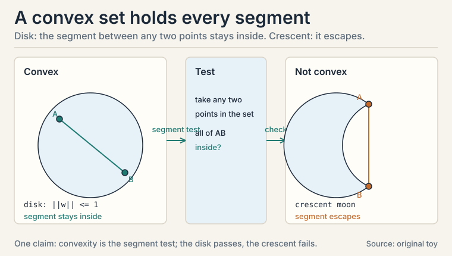
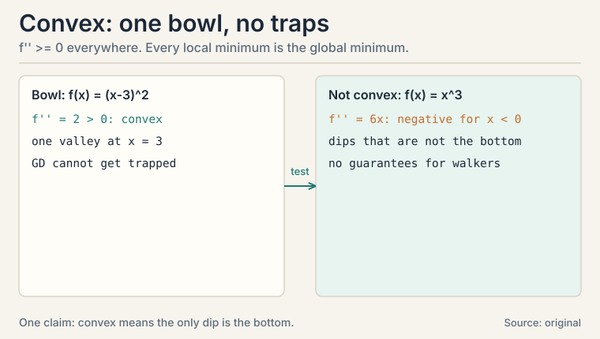
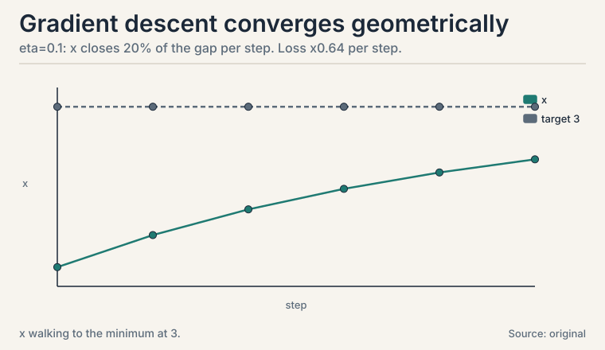
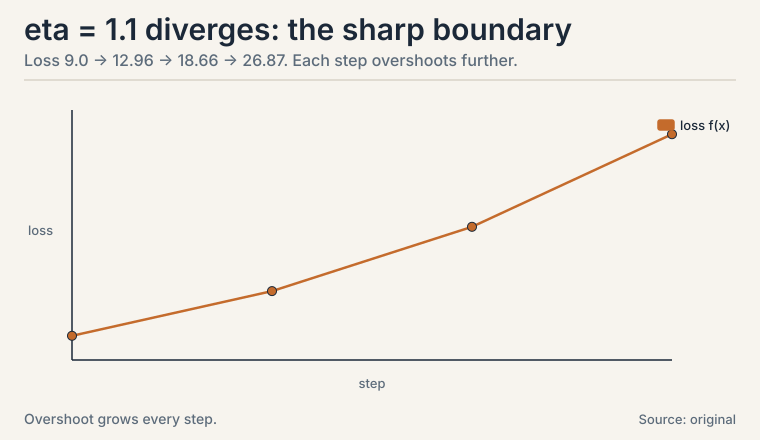
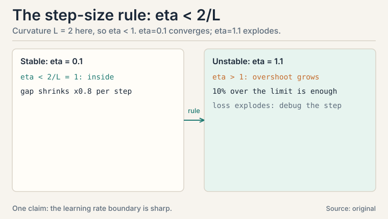
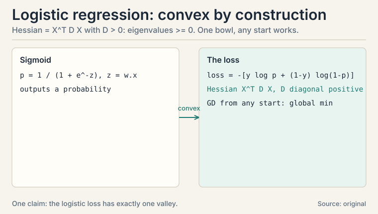

## The task: walk downhill without getting trapped

L07 built the gradient: a compass pointing uphill. Training a
model means walking the other way, downhill, until the loss
bottoms out. But downhill walks can end in a shallow dip while a
deeper valley sits nearby. How do you know the valley you found is
the best one?

**Convexity** answers. A **convex function** is shaped like a
bowl: the line segment between any two points on its graph sits
above the graph. One valley, no traps. For convex functions, every
local minimum is the global minimum, and gradient descent with a
sane step size finds it. Logistic regression's loss is convex.
That is why it trains reliably.

### Subchapter: convex sets, the domain version

A **convex set** contains the whole segment between any two of its
points. A solid disk is convex. A crescent moon is not. Why care?
Constraints in optimization are usually convex sets: "weights with
norm at most 1" is a disk, convex. Projecting back onto a convex
set after each gradient step keeps the walk inside the allowed
region without breaking convergence. Non-convex constraints create
traps at the boundary.



### Subchapter: the second-derivative test

Test for convex functions of one variable: f''(x) >= 0
everywhere. f(x) = (x-3)^2 has f'' = 2 > 0: convex. f(x) = x^3 has
f'' = 6x, negative for x < 0: not convex.

In higher dimensions the test uses the Hessian, the matrix of
second derivatives: convex means the Hessian never has a negative
eigenvalue (L03's eigenvalues return as curvature detectors).
Gradient descent on a convex function with eta < 2/L, where L is
the maximum curvature, converges to the global minimum. No traps,
one theorem, and the step-size rule that explains the disaster in
the next section: L = 2, so eta must stay below 1.



### Subchapter: the tangent lies below

A second test for convexity, often more useful: a convex
function sits above its own tangent lines. Formally, f(y) >=
f(x) + f'(x)(y - x) for all x, y. Worked on the bowl f(x) =
(x-3)^2 at x = 0. Tangent: f(0) + f'(0)(y - 0) = 9 - 6y. Check
y = 1: tangent says 3, function says 4. 3 <= 4, holds. Check y
= 5: tangent says -21, function says 4. Holds. The bowl always
stays above every tangent. Why this test matters: gradient
descent steps along the tangent's direction. If the function
lies above its tangents, the linear model never overpromises:
stepping downhill on the tangent cannot overshoot into
something worse than the model predicts, as long as eta
respects the curvature. The eta < 2/L rule is this geometric
fact quantified.

### Subchapter: Jensen's inequality

Convexity has a probabilistic twin. For convex f: E[f(X)] >=
f(E[X]). The average of the function beats the function of the
average. Worked: f(x) = x^2, X uniform on {1, 3}. E[f(X)] =
(1 + 9)/2 = 5. f(E[X]) = f(2) = 4. 5 >= 4. The spread of X
adds 1 extra. Equality holds only when X has no spread or f is
linear. Where it bites: the EM algorithm (CS229 L10) builds a
lower bound on the log-likelihood with Jensen, then maximizes
the bound. Variational inference does the same. Risk aversion
in economics is Jensen on a concave utility function: a gamble
with the same expected payoff is worth less than the sure
thing. Whenever an expectation meets a convex function, Jensen
tells you which side is larger, before any computation.

## First attempt: follow the slope with fixed steps

The algorithm is three lines. Start somewhere. Repeat: step
opposite the gradient. The step length is the **learning rate**,
eta.

```ascii
x_new = x_old - eta * f'(x_old)
```

### Subchapter: the trace, by hand

Watch it on the simplest bowl: f(x) = (x - 3)^2, minimum at x =
3. f'(x) = 2(x - 3). Start at x0 = 0, eta = 0.1:

```ascii
x0 = 0.0     f = 9.0
x1 = 0 - 0.1 * 2(0-3)   = 0.6     f = 5.76
x2 = 0.6 - 0.1 * 2(0.6-3) = 1.08  f = 3.69
x3 = 1.08 - 0.1 * 2(1.08-3) = 1.464   f = 2.36
x4 = 1.464 - 0.1 * 2(1.464-3) = 1.771 f = 1.51
```

Each step covers 20% of the remaining distance: the gap shrinks by
(1 - 2*eta) = 0.8 per step. After 20 steps the gap is 0.8^20 =
0.0115 of the original 3: x is within 0.035 of the minimum.
Geometric convergence, visible in the numbers: 9.0, 5.76, 3.69,
2.36, 1.51. Every step multiplies the loss by 0.64.



### Subchapter: the step size that blows up

Now eta = 1.1, slightly too large. The curvature here is f'' = 2,
and stability needs eta < 1 (half the inverse curvature, in
general: eta < 2 / max curvature):

```ascii
x0 = 0.0
x1 = 0 - 1.1 * 2(0-3)    = 6.6     f = 12.96
x2 = 6.6 - 1.1 * 2(6.6-3) = -1.32  f = 18.66
x3 = -1.32 - 1.1 * 2(-1.32-3) = 8.18  f = 26.87
```

Each step overshoots the valley and lands further out. The loss
grows: 9.0, 12.96, 18.66, 26.87. Divergence, from a step size just
10% past the stability limit: 1.1 instead of 1.0. Too small a
change to eyeball. The learning rate is
the most consequential hyperparameter in ML because the boundary
between convergence and explosion is this sharp. (Newton's method,
Lecture 45, adapts the step using curvature. Steepest descent,
Lecture 44, is this fixed-step walk.)





## The key question

Which losses guarantee that downhill walking ends at the global
best, and how do you recognize them?

## The new idea: convex means one valley

The test is the Hessian: no negative eigenvalues, no traps. The
guarantee: gradient descent with eta < 2/L converges to the global
minimum. The recognition rule: sums of convex functions are
convex, so a loss that sums per-example convex losses over the
dataset is convex. Logistic regression's loss is exactly such a
sum.

### Subchapter: the GD family, beyond vanilla

Vanilla GD uses the full dataset per step: accurate, slow. The
family trades accuracy for speed:

- **SGD** (stochastic GD): one example (or mini-batch) per step.
  The gradient is noisy but each step is cheap. The noise can even
  kick the walk out of shallow dips. The price: the loss jitters,
  and the learning rate usually must shrink over time.
- **Momentum**: keep a running average of past gradients and step
  with that. Ravines get traversed faster (consistent directions
  accumulate), oscillations cancel. One new hyperparameter: the
  averaging weight, typically 0.9.
- **Adam**: per-coordinate adaptive step sizes. Each weight gets
  its own effective learning rate from its gradient history:
  frequent large gradients get smaller steps, rare small ones get
  larger steps. The default optimizer for deep networks, and the
  reason most practitioners rarely hand-tune eta.

None of them fix a too-large base step: the 1.1 lesson applies to
every variant. They change the walk's character, not the
stability boundary.

### Subchapter: the ravine, traced

One-dimensional bowls are kind. Real losses are ravines: steep
in some directions, flat in others. Toy: f(x, y) = x^2 +
25y^2. Curvature 2 along x, 50 along y. The stability limit is
set by the worst direction: eta < 2/50 = 0.04. Take eta = 0.03
and start at (5, 1):

```ascii
step 0:  (5.0000,  1.0000)   f = 50.0000
step 1:  (4.7000, -0.5000)   f = 28.3400
step 2:  (4.4180,  0.2500)   f = 21.0812
step 3:  (4.1529, -0.1250)   f = 17.6374
step 4:  (3.9037,  0.0625)   f = 15.3369
step 5:  (3.6695, -0.0312)   f = 13.4898
```

Watch y: 1, -0.5, 0.25, -0.125. It zigzags across the ravine,
halving each time. Watch x: 5, 4.7, 4.418. It crawls: each
step covers only 6% of the remaining x-distance. One eta cannot
serve both directions. The ratio of worst to best curvature is
the **condition number**: 25 here. Large condition number
means zigzag plus crawl. This is the mechanical reason
momentum exists (averaging cancels the zigzag) and the reason
Adam exists (per-coordinate steps serve each direction its own
eta). Ill-conditioned problems are the norm in ML, not the
exception: features at different scales create ravines
automatically. Standardize features (L06's z-scores) or pay
in steps.

### Subchapter: Newton in one step

Gradient descent uses the slope. **Newton's method** uses the
slope and the curvature: x_new = x - f'(x)/f''(x). On the bowl
f(x) = (x-3)^2 from x0 = 0: x1 = 0 - (-6)/2 = 3. Done. One
step, exact. Why? Newton's method minimizes the Taylor
quadratic model (L07), and for a true quadratic the model is
the function. The price: the Hessian costs O(n^2) to form and
O(n^3) to invert. For a million weights, that is impossible.
Newton rules small convex problems (CS229 L03 fits logistic
regression with it). Quasi-Newton methods (L-BFGS) approximate
the Hessian from gradient history: Newton's direction at
gradient descent's price. The decision rule: Newton below
thousands of parameters, L-BFGS below hundreds of thousands,
first-order above.

 = (x-3)^2 from x0 = 0: x1 = 0 - (-6)/2 = 3. Exact. Shell 3. Source: original arithmetic. Project: Stanford Frontier AI.")

### Subchapter: schedules and guardrails

Three practices every training run uses. **Learning-rate
schedules** shrink eta over time: large steps early for speed,
small steps late for settling. Cosine decay over 10 steps from
0.1: 0.1, 0.05, 0.0 at steps 0, 5, 10. Smooth, one knob (the
total steps). Step decay halves eta every k epochs: cruder,
two knobs. **Gradient clipping** caps the step when gradients
explode: if ||grad|| = 12.5 and the cap is 1.0, scale the whole
gradient by 0.08. Direction preserved, magnitude tamed. LLM
training (CS336) clips every step: exploding gradients are a
when, not an if, at that scale. **Warmup** starts eta near zero
and ramps up: early gradients are the noisiest, so the first
steps are the most dangerous. Decision rules: always schedule
on long runs (constant eta wastes the endgame). Always clip
when training is unstable (the cost is one line). Always warm
up large models (the first thousand steps decide the run).

## The non-convex reality: saddles, not just valleys

Deep networks are not convex. The Hessian test from L07
already warned us: the toy f(x, y) = x^2 + 3xy + y^2 had
eigenvalues 5 and -1. Meet the pure case: f(x, y) = x^2 - y^2.
Hessian diag(2, -2), eigenvalues 2 and -1. At the origin the
gradient is exactly zero: gradient descent stops. But the
origin is not a minimum: walk along y and the function falls.

```ascii
start (0.5, 0.1), eta = 0.1:
step 0:  (0.5000, 0.1000)   f = 0.2400
step 1:  (0.4000, 0.1200)   f = 0.1456
step 2:  (0.3200, 0.1440)   f = 0.0817
step 3:  (0.2560, 0.1728)   f = 0.0357
```

x shrinks toward 0 (positive curvature pulls in). y grows:
0.1, 0.12, 0.144, 0.1728 (negative curvature pushes out).
Gradient descent *escapes* the saddle along the negative
curvature direction, automatically, unless it lands exactly on
the stable manifold (probability zero with any noise). The
practical lesson inverts the old fear: in high dimensions,
saddles vastly outnumber minima (a stationary point needs all
n curvatures positive to be a minimum. One negative makes it a
saddle). Training a deep net is mostly escaping saddles, not
avoiding bad minima. The noise in SGD helps: it kicks the walk
off the knife's edge. This is why deep learning works despite
non-convexity, and why the convex guarantees of this lesson
are the special case, not the rule.

## The payoff: logistic regression is convex

**Logistic regression** classifies with probabilities. For label y
in {0, 1} and score z = w . x, it predicts P(y=1) = 1 / (1 +
e^-z), the sigmoid. The loss for one example:

```ascii
loss = -[ y log(p) + (1-y) log(1-p) ]    (cross-entropy, L10)
```

This loss is convex in w. Proof sketch via the Hessian test: the
second derivative matrix equals X^T D X with D diagonal and
positive, so its eigenvalues are nonnegative (L02's transpose
fact: M^T M never has negative eigenvalues). One bowl. Gradient
descent from any start, with a sane eta, reaches the single global
minimum. That reliability is why logistic regression is the first
classifier every ML course teaches (CS229 L03).



### Subchapter: metrics, because accuracy lies

Classification **metrics** judge the result: accuracy (fraction
correct), precision (of predicted positives, how many were truly
positive), recall (of true positives, how many were found). A
rare-disease classifier that always says "healthy" has 99%
accuracy and 0% recall: L05's base-rate lesson wearing a new hat.

The decision rule: on balanced classes, accuracy suffices. On rare
classes, report precision and recall always. On ranked lists
(search, recommendations), precision-at-k. The metric is part of
the model specification: choose it before training, not after.

| Metric | Formula | Always-healthy score | What it hides |
|---|---|---|---|
| Accuracy | (TP + TN) / total | 99 / 100 = 99% | looks perfect |
| Recall | TP / (TP + FN) | 0 / 1 = 0% | found none of the sick |
| Precision | TP / (TP + FP) | 0 / 0: undefined | predicted no positives at all |

On 100 patients (1 sick), always saying "healthy" scores 99% accuracy and 0% recall. On rare classes, report precision and recall always.

### Subchapter: F1 and the threshold knob

Precision and recall trade off: raising the classification
threshold boosts precision (fewer false alarms) and hurts
recall (more missed cases). The **F1 score** is their harmonic
mean: F1 = 2PR/(P+R). Toy: precision 0.8, recall 0.4. F1 =
2*0.8*0.4/1.2 = 0.533. The harmonic mean punishes imbalance:
a model with P = 1.0, R = 0.1 scores F1 = 0.18, not the
arithmetic 0.55. Use F1 when false positives and false
negatives cost roughly equally and you need one number. The
threshold is a business decision, not a math one: a cancer
screen sets the threshold low (recall matters, false alarms
are cheap). A spam filter sets it high (false positives hide
real email). Tune the threshold on validation data against the
metric you chose. Never tune it on the test set.

| Idea | Test | Consequence |
|---|---|---|
| Convex function | f'' >= 0; Hessian eigenvalues >= 0 | one valley; local min = global min |
| First-order condition | f(y) >= f(x) + f'(x)(y-x) | the function sits above its tangents; toy: 3 <= 4 |
| Jensen | E[f(X)] >= f(E[X]) | spread adds cost; toy: 5 >= 4 |
| Gradient descent | x -= eta * grad | converges if eta < 2/L |
| Too-large eta | toy: 1.1 vs stability limit 1 | overshoot, divergence: 9.0 -> 26.87 |
| Ravine | condition number 25 toy | zigzag + crawl: y halves each step, x covers 6% |
| SGD / momentum / Adam | noisy / averaged / adaptive steps | speed and character, not the stability boundary |
| Newton | x -= f'/f'' | one step on quadratics; toy: 0 -> 3 exactly |
| Schedules / clipping | cosine 0.1->0.0; clip scale 0.08 | settle the endgame; tame explosions |
| Saddle | Hessian eigenvalues 2, -1 | GD escapes along negative curvature: y 0.1 -> 0.1728 |
| Logistic loss | Hessian = X^T D X, D > 0 | convex; GD cannot get trapped |
| Precision / recall / F1 | predicted-true vs true-found; 2PR/(P+R) | accuracy lies on rare classes; toy F1 = 0.533 |

## What is used where: the real systems

| Math idea | Where it appears | Why there |
|---|---|---|
| Convexity | Logistic regression, SVM | global optimum guaranteed |
| eta < 2/L | All training runs | the boundary every tuner respects |
| Adam | Deep network training | default: adaptive per-coordinate steps |
| Momentum | Ravine-heavy losses | accumulates consistent directions |
| Newton | Logistic regression (CS229 L03) | exact on small convex problems |
| Jensen | EM (CS229 L10) | the lower bound the algorithm maximizes |
| Gradient clipping | LLM training (CS336) | explosions are a when, not an if |
| Schedules | Long training runs | settle the endgame after fast early steps |
| Precision/recall/F1 | Rare-class eval | accuracy lies; these do not |

 zigzag and crawl without momentum. Dense chapter plate. Source: original synthesis of the lesson. Project: Stanford Frontier AI.")

> [!QA]
> Q: Why does convexity matter for training?
> A: It guarantees the valley you walk into is the only valley. For a convex loss, every local minimum is the global minimum, and gradient descent with eta below 2/L converges to it. Logistic regression's loss is convex (its Hessian X^T D X has nonnegative eigenvalues), so it trains reliably from any start. Non-convex losses like deep networks offer no such promise: hence restarts, schedules, and momentum.
> Follow-up: Is the step-size bound eta < 2/L usable in practice?
> A: Rarely directly: L, the maximum curvature, is unknown and changes during training. Practitioners tune eta by search or use adaptive methods (Adam scales each coordinate by its history). But the bound explains every divergence you will ever see: the toy blew up at eta = 1.1 against a limit of 1.0. When loss explodes, the step was too big. Always.

> [!QA]
> Q: Work one gradient descent trace by hand.
> A: f(x) = (x-3)^2, x0 = 0, eta = 0.1. Gradient 2(x-3). Steps: 0 -> 0.6 -> 1.08 -> 1.464 -> 1.771, losses 9.0 -> 5.76 -> 3.69 -> 2.36 -> 1.51. Each step closes 20% of the gap. The loss multiplies by 0.64 per step. After 20 steps x is within 0.035 of the minimum 3. Geometric convergence you can watch.
> Follow-up: Why did eta = 1.1 diverge?
> A: Stability needs eta < 2/L with L = max curvature = f'' = 2, so eta < 1. At 1.1 each step overshoots: 0 -> 6.6 -> -1.32 -> 8.18, losses 9.0 -> 12.96 -> 18.66 -> 26.87. The overshoot grows because the gradient at the landing point is larger than at takeoff. Eleven percent over the limit is enough.

> [!QA]
> Q: Why is logistic regression the canonical first classifier?
> A: Because its loss is convex: one bowl, one minimum, gradient descent cannot get trapped. The model outputs calibrated probabilities via the sigmoid, and the cross-entropy loss penalizes confident wrong answers heavily. It is the simplest model where probability (L05), calculus (L07), and optimization (this lesson) meet.
> Follow-up: Accuracy 99% but the model is useless. How?
> A: Rare classes. A disease classifier that always predicts "healthy" scores 99% accuracy on 1% prevalence with 0% recall: it finds no patients. Report precision and recall alongside accuracy, always. This is L05's base-rate fallacy as a metric.

> [!QA]
> Q: SGD vs full-batch GD: what changes, exactly?
> A: Full-batch GD computes the exact gradient over all data: one accurate, expensive step. SGD estimates it from one example or mini-batch: noisy, cheap steps. The noise means the loss jitters instead of decreasing monotonically, but you take thousands of steps in the time of one full-batch step. On convex losses both converge. SGD usually needs a shrinking learning rate to settle.
> Follow-up: Why mini-batches and not single examples?
> A: Hardware. A mini-batch of 32 or 256 is still one matrix multiply (L02): the GPU parallelizes it for free. Single examples waste the hardware. Full batches waste time. Mini-batch SGD is the economic optimum, not a mathematical one.

> [!QA]
> Q: What does momentum do, mechanically?
> A: It keeps a running average of past gradients: v = 0.9 * v + gradient, then steps with v instead of the raw gradient. Consistent directions accumulate (ravines get crossed faster). Oscillating directions cancel (less zigzag). On the toy bowl it would reach x = 3 in fewer steps. The 0.9 is the memory: higher remembers longer, lower reacts faster.
> Follow-up: Can momentum overshoot like a too-large eta?
> A: Yes, and for the same reason: the effective step grows as consistent gradients accumulate. Momentum 0.9 with eta 0.1 behaves like a larger eta in steady directions. Tune them together. Raising one usually means lowering the other.

> [!QA]
> Q: What does Adam do that SGD does not?
> A: Per-coordinate adaptive step sizes. Adam tracks each weight's gradient history: weights with consistently large gradients get smaller effective steps, weights with rare small gradients get larger ones. SGD uses one global eta for all weights. Adam is the default for deep networks because different layers live at different scales, and one eta cannot serve them all.
> Follow-up: When would you NOT use Adam?
> A: On convex problems where you want the exact optimum: Adam's adaptivity can converge to worse solutions than well-tuned SGD with momentum. Practitioners often train with Adam then fine-tune with SGD. And Adam has more hyperparameters to mis-set: the defaults are good, but they are still hyperparameters.

> [!QA]
> Q: Training loss explodes to NaN at step 10,000. Walk me through the debug.
> A: Step 1: suspect the learning rate first: it is the most common cause, and the 1.1 toy shows how sharp the boundary is. Halve eta and rerun: if it survives, that was it. Step 2: check for gradient explosion: log the gradient norm per step (L01's norm as fuse box). A sudden spike before the NaN confirms it. Step 3: add gradient clipping as the guardrail. Step 4: check the data: one corrupt batch (NaN inputs, extreme values) can detonate any eta.
> Follow-up: Loss decreases but validation accuracy is flat. Different problem?
> A: Yes: that is not divergence, it is a metric/loss mismatch or overfitting. The optimizer is working. The objective or the data split is wrong. Check class balance (precision/recall, not accuracy), then check for train/test leakage or distribution shift.

> [!QA]
> Q: Gradient descent stops when the gradient is zero. Is that point always a minimum?
> A: No. f(x, y) = x^2 - y^2 has gradient zero at the origin, but the origin is a saddle: the Hessian diag(2, -2) has eigenvalues 2 and -1. Walk along y and the function falls. Traced from (0.5, 0.1) with eta = 0.1: x shrinks (0.5 to 0.256) while y grows (0.1 to 0.1728). Gradient descent escapes along the negative-curvature direction on its own. A zero gradient means stationary, not minimal: check the Hessian's eigenvalues before celebrating.
> Follow-up: If deep losses are full of saddles, why does training work at all?
> A: Because saddles are escapable and minima are what trap you. In high dimensions a stationary point needs all n curvatures positive to be a minimum; a single negative curvature makes it a saddle, and gradient descent slides off along that direction. SGD's noise helps by kicking the walk off knife's edges. The old fear was bad local minima. The real loss surface is mostly saddles, and the optimizer walks through them.

## Recap: the whole lesson on one screen

1. **The task.** Walk downhill to the loss minimum without getting trapped in a dip.
2. **Convexity.** Bowl-shaped: segment between any two graph points sits above the graph. One valley. Sets too: disks yes, crescents no.
3. **The tests.** f'' >= 0. Hessian eigenvalues >= 0. First-order: the function sits above its tangents (toy: 3 <= 4). Jensen: E[f(X)] >= f(E[X]) (toy: 5 >= 4).
4. **Gradient descent.** x -= eta * grad. Toy trace: 0 -> 0.6 -> 1.08 -> 1.464 -> 1.771. Loss 9.0 -> 1.51 in four steps. X0.64 per step.
5. **Where it breaks.** eta = 1.1 against stability limit 1.0: overshoot grows, loss 9.0 -> 26.87. The learning rate boundary is sharp.
6. **The ravine.** f = x^2 + 25y^2, condition number 25: y zigzags (1, -0.5, 0.25), x crawls (5, 4.7, 4.418). One eta cannot serve both. Momentum cancels the zigzag. Adam serves each direction its own eta.
7. **The family.** SGD (noisy, cheap), momentum (running average, 0.9), Adam (per-coordinate adaptive). They change the walk, not the stability boundary.
8. **Newton.** x -= f'/f'': one exact step on quadratics (0 -> 3). O(n^3) keeps it on small problems. L-BFGS approximates.
9. **Schedules and guardrails.** Cosine decay 0.1 -> 0.05 -> 0.0. Clip at norm 1.0 (scale 0.08 on a 12.5 gradient). Warm up large models.
10. **The non-convex reality.** Saddles outnumber minima in high dimensions. f = x^2 - y^2: GD escapes on its own, y 0.1 -> 0.1728. Zero gradient means stationary, not minimal.
11. **The payoff.** Logistic regression's loss is convex (Hessian X^T D X, D positive). Reliable training from any start. Metrics: precision, recall, F1 = 0.533 on the toy. Thresholds are business decisions.
12. **The price and the bridge.** Deep networks are not convex: no guarantees, hence the optimizer zoo. L09 applies least squares' closed form where no walking is needed. L10 explains the cross-entropy loss logistic regression minimizes.

## Go deeper

<div style="position:relative;padding-bottom:56.25%;height:0;overflow:hidden;max-width:100%;margin:16px 0;">
<iframe style="position:absolute;top:0;left:0;width:100%;height:100%;" src="https://www.youtube-nocookie.com/embed/IHZwWFHWa-w" title="3Blue1Brown: Gradient descent, how neural networks learn (Deep Learning, chapter 2)" frameborder="0" allow="accelerometer; autoplay; clipboard-write; encrypted-media; gyroscope; picture-in-picture" allowfullscreen></iframe>
</div>

- 3Blue1Brown, "Gradient descent, how neural networks learn" (Deep Learning, ch. 2; the embed above): https://www.youtube.com/watch?v=IHZwWFHWa-w
- The NPTEL lecture for this lesson (frontmatter video): https://www.youtube.com/watch?v=RmobQRYxu0g
- Boyd and Vandenberghe, "Convex Optimization", ch. 2-3 (free): https://web.stanford.edu/~boyd/cvxbook/: convex sets, functions, optimality.
- Deisenroth, Faisal, Ong, "Mathematics for Machine Learning", ch. 7 (free): https://mml-book.github.io: continuous optimization, gradient descent.

## Official sources and further reading

**Official:**
- "Essential Mathematics for Machine Learning" playlist, Lecture 44 (this lesson's video): [paper](https://www.youtube.com/watch?v=RmobQRYxu0g)
- NPTEL course page (111107137): https://nptel.ac.in/courses/111107137

**Further reading:**
- Boyd and Vandenberghe, "Convex Optimization", ch. 2-3 (free):
  - [convex sets, functions, optimality.](https://web.stanford.edu/~boyd/cvxbook/)
- Deisenroth, Faisal, Ong, "Mathematics for Machine Learning", ch. 7 (free):
  - [continuous optimization, gradient descent.](https://mml-book.github.io)

**Caveats.** The GD traces, the stability numbers, and the metric examples are the lesson's own. The lecture's exact demos (L44 steepest descent, L24-26 logistic regression) are [uncertain] (transcripts not recovered).

## Connections to the other courses

- **CS229 L02:** least squares is convex: the normal equation is the closed-form global minimum. This lesson is why no iteration is needed there.
- **CS229 L03:** logistic regression and Newton's method. This lesson is why its training converges.
- **CS229 L06:** bias-variance. The tradeoff chapter: this lesson's optimizers minimize training loss, L06 explains why that is not the whole story.
- **CS229 L08:** deep networks abandon convexity. Backprop (L07) plus the optimizer zoo takes over.
- **CS229 L10:** EM's lower bound is Jensen's inequality applied to the log-likelihood.
- **CS229S:** learning-rate tuning at scale. The eta boundary governs thousand-GPU training runs.
- **CS336:** gradient clipping and warmup schedules in LLM training runs.

## Coverage map: every lecture concept and where it lives

Lectures 44-45 (steepest descent, Newton) plus the logistic
regression block (L24-26) supply this lesson. Each concept maps
below. Traces and toys are the lesson's own. The lectures' exact
demos are [uncertain] (transcripts not recovered).

| Lecture concept | Covered in | File line |
|---|---|---|
| Convex sets: disk yes, crescent no; projection onto convex sets | convex sets, the domain version | L44 |
| Second-derivative test: f'' >= 0; toy (x-3)^2 convex, x^3 not | the second-derivative test | L54 |
| Hessian eigenvalue test; eta < 2/L rule | the second-derivative test | L54 |
| First-order condition: function above its tangents; toy 3 <= 4 | the tangent lies below | L70 |
| Jensen's inequality: E[f(X)] >= f(E[X]); toy 5 >= 4; EM link | Jensen's inequality | L86 |
| Gradient descent: x -= eta * grad | First attempt: follow the slope with fixed steps | L101 |
| GD trace by hand: 0 -> 1.771, loss 9.0 -> 1.51, x0.64 per step | the trace, by hand | L111 |
| Divergence at eta = 1.1: loss 9.0 -> 26.87 | the step size that blows up | L132 |
| SGD / momentum (0.9) / Adam: character, not stability boundary | the GD family, beyond vanilla | L171 |
| Ravine trace: condition number 25; zigzag + crawl numbers | the ravine, traced | L194 |
| Newton's method: x -= f'/f''; one exact step 0 -> 3; O(n^3) price | Newton in one step | L224 |
| Cosine schedule 0.1 -> 0.0; clipping scale 0.08; warmup | schedules and guardrails | L240 |
| Saddles: f = x^2 - y^2, eig 2 and -1; GD escapes, y 0.1 -> 0.1728 | The non-convex reality | L258 |
| Logistic loss convex: Hessian X^T D X, D > 0; sigmoid; cross-entropy | The payoff: logistic regression is convex | L289 |
| Precision, recall, accuracy-lies toy; decision rules | metrics, because accuracy lies | L309 |
| F1 = 2PR/(P+R) = 0.533; threshold as business decision | F1 and the threshold knob | L322 |
| Least-squares convexity link (CS229 L02); bias-variance (CS229 L06) | Connections to the other courses | L457 |
