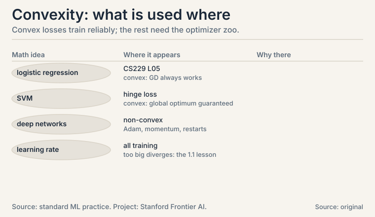

## The task: walk downhill without getting trapped

L07 built the gradient: a compass pointing uphill. Training a
model means walking the other way, downhill, until the loss
bottoms out. But downhill walks can end in a shallow dip while a
deeper valley sits nearby. How do you know the valley you found is
the best one?

**Convexity** answers. A **convex function** is shaped like a
bowl: the line segment between any two points on its graph sits
above the graph. One valley, no traps. For convex functions, every
local minimum is the global minimum, and gradient descent with a
sane step size finds it. Logistic regression's loss is convex.
That is why it trains reliably.

### Subchapter: convex sets, the domain version

A **convex set** contains the whole segment between any two of its
points. A solid disk is convex. A crescent moon is not. Why care?
Constraints in optimization are usually convex sets: "weights with
norm at most 1" is a disk, convex. Projecting back onto a convex
set after each gradient step keeps the walk inside the allowed
region without breaking convergence. Non-convex constraints create
traps at the boundary.

### Subchapter: the second-derivative test

Test for convex functions of one variable: f''(x) >= 0
everywhere. f(x) = (x-3)^2 has f'' = 2 > 0: convex. f(x) = x^3 has
f'' = 6x, negative for x < 0: not convex.

In higher dimensions the test uses the Hessian, the matrix of
second derivatives: convex means the Hessian never has a negative
eigenvalue (L03's eigenvalues return as curvature detectors).
Gradient descent on a convex function with eta < 2/L, where L is
the maximum curvature, converges to the global minimum. No traps,
one theorem, and the step-size rule that explains the disaster in
the next section: L = 2, so eta must stay below 1.


## First attempt: follow the slope with fixed steps

The algorithm is three lines. Start somewhere. Repeat: step
opposite the gradient. The step length is the **learning rate**,
eta.

```ascii
x_new = x_old - eta * f'(x_old)
```

### Subchapter: the trace, by hand

Watch it on the simplest bowl: f(x) = (x - 3)^2, minimum at x =
3. f'(x) = 2(x - 3). Start at x0 = 0, eta = 0.1:

```ascii
x0 = 0.0     f = 9.0
x1 = 0 - 0.1 * 2(0-3)   = 0.6     f = 5.76
x2 = 0.6 - 0.1 * 2(0.6-3) = 1.08  f = 3.69
x3 = 1.08 - 0.1 * 2(1.08-3) = 1.464   f = 2.36
x4 = 1.464 - 0.1 * 2(1.464-3) = 1.771 f = 1.51
```

Each step covers 20% of the remaining distance: the gap shrinks by
(1 - 2*eta) = 0.8 per step. After 20 steps the gap is 0.8^20 =
0.0115 of the original 3: x is within 0.035 of the minimum.
Geometric convergence, visible in the numbers: 9.0, 5.76, 3.69,
2.36, 1.51. Every step multiplies the loss by 0.64.


### Subchapter: the step size that blows up

Now eta = 1.1, slightly too large. The curvature here is f'' = 2,
and stability needs eta < 1 (half the inverse curvature, in
general: eta < 2 / max curvature):

```ascii
x0 = 0.0
x1 = 0 - 1.1 * 2(0-3)    = 6.6     f = 12.96
x2 = 6.6 - 1.1 * 2(6.6-3) = -1.32  f = 18.66
x3 = -1.32 - 1.1 * 2(-1.32-3) = 8.18  f = 26.87
```

Each step overshoots the valley and lands further out. The loss
grows: 9.0, 12.96, 18.66, 26.87. Divergence, from a step size 11x
instead of 10x: too small a change to eyeball. The learning rate is
the most consequential hyperparameter in ML because the boundary
between convergence and explosion is this sharp. (Newton's method,
Lecture 45, adapts the step using curvature. Steepest descent,
Lecture 44, is this fixed-step walk.)


## The key question

Which losses guarantee that downhill walking ends at the global
best, and how do you recognize them?

## The new idea: convex means one valley

The test is the Hessian: no negative eigenvalues, no traps. The
guarantee: gradient descent with eta < 2/L converges to the global
minimum. The recognition rule: sums of convex functions are
convex, so a loss that sums per-example convex losses over the
dataset is convex. Logistic regression's loss is exactly such a
sum.

### Subchapter: the GD family, beyond vanilla

Vanilla GD uses the full dataset per step: accurate, slow. The
family trades accuracy for speed:

- **SGD** (stochastic GD): one example (or mini-batch) per step.
  The gradient is noisy but each step is cheap. The noise can even
  kick the walk out of shallow dips. The price: the loss jitters,
  and the learning rate usually must shrink over time.
- **Momentum**: keep a running average of past gradients and step
  with that. Ravines get traversed faster (consistent directions
  accumulate), oscillations cancel. One new hyperparameter: the
  averaging weight, typically 0.9.
- **Adam**: per-coordinate adaptive step sizes. Each weight gets
  its own effective learning rate from its gradient history:
  frequent large gradients get smaller steps, rare small ones get
  larger steps. The default optimizer for deep networks, and the
  reason most practitioners rarely hand-tune eta.

None of them fix a too-large base step: the 1.1 lesson applies to
every variant. They change the walk's character, not the
stability boundary.

## The payoff: logistic regression is convex

**Logistic regression** classifies with probabilities. For label y
in {0, 1} and score z = w . x, it predicts P(y=1) = 1 / (1 +
e^-z), the sigmoid. The loss for one example:

```ascii
loss = -[ y log(p) + (1-y) log(1-p) ]    (cross-entropy, L10)
```

This loss is convex in w. Proof sketch via the Hessian test: the
second derivative matrix equals X^T D X with D diagonal and
positive, so its eigenvalues are nonnegative (L02's transpose
fact: M^T M never has negative eigenvalues). One bowl. Gradient
descent from any start, with a sane eta, reaches the single global
minimum. That reliability is why logistic regression is the first
classifier every ML course teaches (CS229 L05).


### Subchapter: metrics, because accuracy lies

Classification **metrics** judge the result: accuracy (fraction
correct), precision (of predicted positives, how many were truly
positive), recall (of true positives, how many were found). A
rare-disease classifier that always says "healthy" has 99%
accuracy and 0% recall: L05's base-rate lesson wearing a new hat.

The decision rule: on balanced classes, accuracy suffices. On rare
classes, report precision and recall always. On ranked lists
(search, recommendations), precision-at-k. The metric is part of
the model specification: choose it before training, not after.

| Idea | Test | Consequence |
|---|---|---|
| Convex function | f'' >= 0; Hessian eigenvalues >= 0 | one valley; local min = global min |
| Gradient descent | x -= eta * grad | converges if eta < 2/L |
| Too-large eta | toy: 1.1 vs stability limit 1 | overshoot, divergence: 9.0 -> 26.87 |
| SGD / momentum / Adam | noisy / averaged / adaptive steps | speed and character, not the stability boundary |
| Logistic loss | Hessian = X^T D X, D > 0 | convex; GD cannot get trapped |
| Precision / recall | predicted-true vs true-found | accuracy lies on rare classes |

## What is used where: the real systems

| Math idea | Where it appears | Why there |
|---|---|---|
| Convexity | Logistic regression, SVM | global optimum guaranteed |
| eta < 2/L | All training runs | the boundary every tuner respects |
| Adam | Deep network training | default: adaptive per-coordinate steps |
| Momentum | Ravine-heavy losses | accumulates consistent directions |
| Precision/recall | Rare-class eval | accuracy lies; these do not |



> [!QA]
> Q: Why does convexity matter for training?
> A: It guarantees the valley you walk into is the only valley. For a convex loss, every local minimum is the global minimum, and gradient descent with eta below 2/L converges to it. Logistic regression's loss is convex (its Hessian X^T D X has nonnegative eigenvalues), so it trains reliably from any start. Non-convex losses like deep networks offer no such promise: hence restarts, schedules, and momentum.
> Follow-up: Is the step-size bound eta < 2/L usable in practice?
> A: Rarely directly: L, the maximum curvature, is unknown and changes during training. Practitioners tune eta by search or use adaptive methods (Adam scales each coordinate by its history). But the bound explains every divergence you will ever see: the toy blew up at eta = 1.1 against a limit of 1.0. When loss explodes, the step was too big. Always.

> [!QA]
> Q: Work one gradient descent trace by hand.
> A: f(x) = (x-3)^2, x0 = 0, eta = 0.1. Gradient 2(x-3). Steps: 0 -> 0.6 -> 1.08 -> 1.464 -> 1.771, losses 9.0 -> 5.76 -> 3.69 -> 2.36 -> 1.51. Each step closes 20% of the gap. The loss multiplies by 0.64 per step. After 20 steps x is within 0.035 of the minimum 3. Geometric convergence you can watch.
> Follow-up: Why did eta = 1.1 diverge?
> A: Stability needs eta < 2/L with L = max curvature = f'' = 2, so eta < 1. At 1.1 each step overshoots: 0 -> 6.6 -> -1.32 -> 8.18, losses 9.0 -> 12.96 -> 18.66 -> 26.87. The overshoot grows because the gradient at the landing point is larger than at takeoff. Eleven percent over the limit is enough.

> [!QA]
> Q: Why is logistic regression the canonical first classifier?
> A: Because its loss is convex: one bowl, one minimum, gradient descent cannot get trapped. The model outputs calibrated probabilities via the sigmoid, and the cross-entropy loss penalizes confident wrong answers heavily. It is the simplest model where probability (L05), calculus (L07), and optimization (this lesson) meet.
> Follow-up: Accuracy 99% but the model is useless. How?
> A: Rare classes. A disease classifier that always predicts "healthy" scores 99% accuracy on 1% prevalence with 0% recall: it finds no patients. Report precision and recall alongside accuracy, always. This is L05's base-rate fallacy as a metric.

> [!QA]
> Q: SGD vs full-batch GD: what changes, exactly?
> A: Full-batch GD computes the exact gradient over all data: one accurate, expensive step. SGD estimates it from one example or mini-batch: noisy, cheap steps. The noise means the loss jitters instead of decreasing monotonically, but you take thousands of steps in the time of one full-batch step. On convex losses both converge. SGD usually needs a shrinking learning rate to settle.
> Follow-up: Why mini-batches and not single examples?
> A: Hardware. A mini-batch of 32 or 256 is still one matrix multiply (L02): the GPU parallelizes it for free. Single examples waste the hardware. Full batches waste time. Mini-batch SGD is the economic optimum, not a mathematical one.

> [!QA]
> Q: What does momentum do, mechanically?
> A: It keeps a running average of past gradients: v = 0.9 * v + gradient, then steps with v instead of the raw gradient. Consistent directions accumulate (ravines get crossed faster). Oscillating directions cancel (less zigzag). On the toy bowl it would reach x = 3 in fewer steps. The 0.9 is the memory: higher remembers longer, lower reacts faster.
> Follow-up: Can momentum overshoot like a too-large eta?
> A: Yes, and for the same reason: the effective step grows as consistent gradients accumulate. Momentum 0.9 with eta 0.1 behaves like a larger eta in steady directions. Tune them together. Raising one usually means lowering the other.

> [!QA]
> Q: What does Adam do that SGD does not?
> A: Per-coordinate adaptive step sizes. Adam tracks each weight's gradient history: weights with consistently large gradients get smaller effective steps, weights with rare small gradients get larger ones. SGD uses one global eta for all weights. Adam is the default for deep networks because different layers live at different scales, and one eta cannot serve them all.
> Follow-up: When would you NOT use Adam?
> A: On convex problems where you want the exact optimum: Adam's adaptivity can converge to worse solutions than well-tuned SGD with momentum. Practitioners often train with Adam then fine-tune with SGD. And Adam has more hyperparameters to mis-set: the defaults are good, but they are still hyperparameters.

> [!QA]
> Q: Training loss explodes to NaN at step 10,000. Walk me through the debug.
> A: Step 1: suspect the learning rate first: it is the most common cause, and the 1.1 toy shows how sharp the boundary is. Halve eta and rerun: if it survives, that was it. Step 2: check for gradient explosion: log the gradient norm per step (L01's norm as fuse box). A sudden spike before the NaN confirms it. Step 3: add gradient clipping as the guardrail. Step 4: check the data: one corrupt batch (NaN inputs, extreme values) can detonate any eta.
> Follow-up: Loss decreases but validation accuracy is flat. Different problem?
> A: Yes: that is not divergence, it is a metric/loss mismatch or overfitting. The optimizer is working. The objective or the data split is wrong. Check class balance (precision/recall, not accuracy), then check for train/test leakage or distribution shift.

## Recap: the whole lesson on one screen

1. **The task.** Walk downhill to the loss minimum without getting trapped in a dip.
2. **Convexity.** Bowl-shaped: segment between any two graph points sits above the graph. One valley. Sets too: disks yes, crescents no.
3. **The test.** f'' >= 0. Hessian eigenvalues >= 0. Converges for eta < 2/L.
4. **Gradient descent.** x -= eta * grad. Toy trace: 0 -> 0.6 -> 1.08 -> 1.464 -> 1.771. Loss 9.0 -> 1.51 in four steps. X0.64 per step.
5. **Where it breaks.** eta = 1.1 against stability limit 1.0: overshoot grows, loss 9.0 -> 26.87. The learning rate boundary is sharp.
6. **The family.** SGD (noisy, cheap), momentum (running average, 0.9), Adam (per-coordinate adaptive). They change the walk, not the stability boundary.
7. **The payoff.** Logistic regression's loss is convex (Hessian X^T D X, D positive). Reliable training from any start. Metrics: precision and recall, because accuracy lies on rare classes.
8. **The price and the bridge.** Deep networks are not convex: no guarantees, hence the optimizer zoo. L09 applies least squares' closed form where no walking is needed. L10 explains the cross-entropy loss logistic regression minimizes.

## Go deeper

<div style="position:relative;padding-bottom:56.25%;height:0;overflow:hidden;max-width:100%;margin:16px 0;">
<iframe style="position:absolute;top:0;left:0;width:100%;height:100%;" src="https://www.youtube-nocookie.com/embed/IHZwWFHWa-w" title="3Blue1Brown: Gradient descent, how neural networks learn (Deep Learning, chapter 2)" frameborder="0" allow="accelerometer; autoplay; clipboard-write; encrypted-media; gyroscope; picture-in-picture" allowfullscreen></iframe>
</div>

- 3Blue1Brown, "Gradient descent, how neural networks learn" (Deep Learning, ch. 2; the embed above): https://www.youtube.com/watch?v=IHZwWFHWa-w
- The NPTEL lecture for this lesson (frontmatter video): https://www.youtube.com/watch?v=RmobQRYxu0g
- Boyd and Vandenberghe, "Convex Optimization", ch. 2-3 (free): https://web.stanford.edu/~boyd/cvxbook/: convex sets, functions, optimality.
- Deisenroth, Faisal, Ong, "Mathematics for Machine Learning", ch. 7 (free): https://mml-book.github.io: continuous optimization, gradient descent.

## Official sources and further reading

**Official:**
- "Essential Mathematics for Machine Learning" playlist, Lecture 44 (this lesson's video): [paper](https://www.youtube.com/watch?v=RmobQRYxu0g)
- NPTEL course page (111107137): https://nptel.ac.in/courses/111107137

**Further reading:**
- Boyd and Vandenberghe, "Convex Optimization", ch. 2-3 (free):
  - [convex sets, functions, optimality.](https://web.stanford.edu/~boyd/cvxbook/)
- Deisenroth, Faisal, Ong, "Mathematics for Machine Learning", ch. 7 (free):
  - [continuous optimization, gradient descent.](https://mml-book.github.io)

**Caveats.** The GD traces, the stability numbers, and the metric examples are the lesson's own. The lecture's exact demos (L44 steepest descent, L24-26 logistic regression) are [uncertain] (transcripts not recovered).

## Connections to the other courses

- **CS229 L05:** logistic regression and Newton's method. This lesson is why its training converges.
- **CS229 L08:** deep networks abandon convexity. Backprop (L07) plus the optimizer zoo takes over.
- **CS229S:** learning-rate tuning at scale. The eta boundary governs thousand-GPU training runs.
