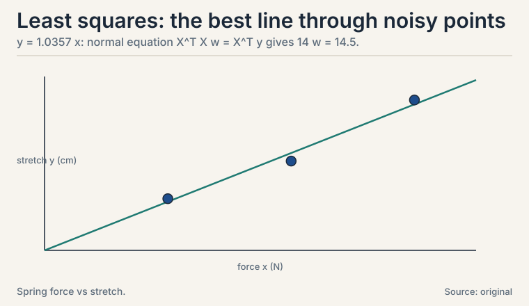
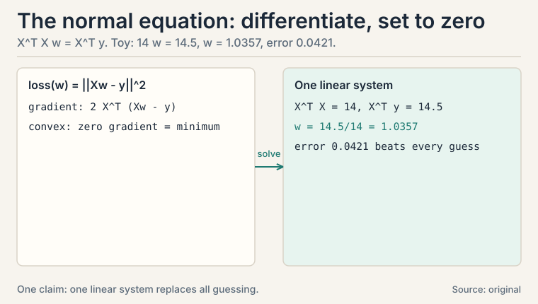
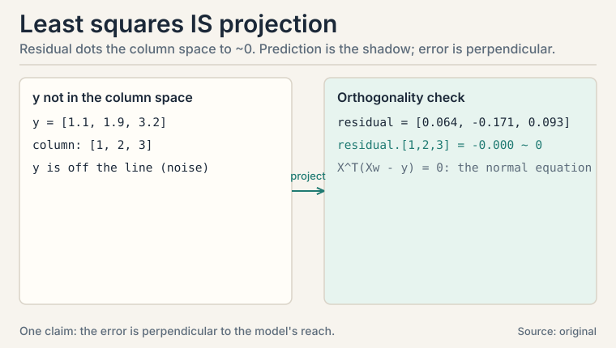
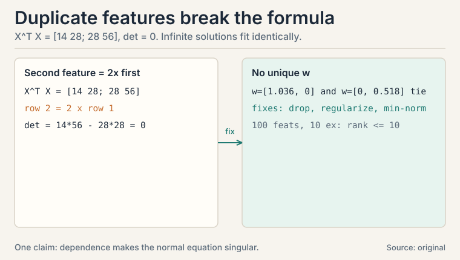
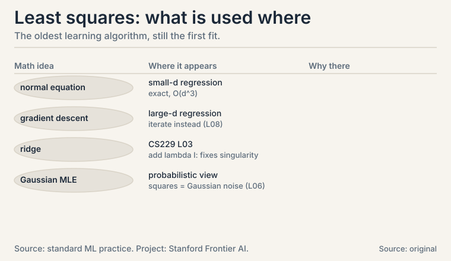

## The task: draw the best line through noisy points

Three measurements of a spring: force x (newtons), stretch y (cm).

```ascii
(1, 1.1), (2, 1.9), (3, 3.2)
```

Hooke's law says stretch is proportional to force: y = w x. Find
the w that best explains the data. "Best" needs a definition
first: minimize the sum of squared errors.

```ascii
loss(w) = (w*1 - 1.1)^2 + (w*2 - 1.9)^2 + (w*3 - 3.2)^2
```

### Subchapter: why squares

Three reasons: they punish large errors more, they are smooth
(differentiable, unlike absolute value), and under Gaussian noise
they are the maximum likelihood estimator (L06). Least squares is
the oldest learning algorithm in statistics, and it is still the
first model every ML course fits (CS229 L02).

The third reason is the deep one. If each measurement has Gaussian
noise, the likelihood of the data given w is a product of
Gaussians, and maximizing it is exactly minimizing the sum of
squared errors. The loss function is a noise model in disguise:
squares mean "I believe the noise is Gaussian." L06's warning
applies: outliers break this belief, and the fit chases them.



## First attempt: guess and check

Try w = 1.0: errors -0.1, -0.1, -0.2. Squared sum = 0.01 + 0.01 +
0.04 = 0.06. Try w = 1.05: predictions 1.05, 2.1, 3.15. Errors
-0.05, -0.2, -0.05. Squared sum = 0.0025 + 0.04 + 0.0025 = 0.045.
Better. Try w = 1.1: predictions 1.1, 2.2, 3.3. Errors 0, -0.3,
-0.1. Squared sum = 0 + 0.09 + 0.01 = 0.10. Worse. The best w sits
near 1.05. Guessing works on one parameter. With 50 features it is
hopeless.

## The key question

Is there a formula for the best w, no guessing, no iteration?

### Subchapter: the loss in matrix form

For the general problem, write it in matrix form. X is the n x d
feature matrix, y the n targets:

```ascii
loss(w) = ||Xw - y||^2
```

Xw is the prediction vector: each row of X dots w (L02). The loss
is the squared norm of the error vector (L01). Two lessons
collide in one formula: matrices make the predictions, the norm
scores them.

### Subchapter: differentiate and set to zero

The loss is convex in w (a sum of squares, L08's bowl). So the
minimum is where the derivative is zero:

```ascii
gradient:  2 X^T (Xw - y) = 0
normal equation:  X^T X w = X^T y
```

One linear system solves all of regression. If X^T X is
invertible: w = (X^T X)^-1 X^T y. No iteration, no learning rate,
exact answer.

### Subchapter: the spring toy, solved

X = [1, 2, 3]^T, y = [1.1, 1.9, 3.2]^T:

```ascii
X^T X = 1 + 4 + 9 = 14
X^T y = 1*1.1 + 2*1.9 + 3*3.2 = 1.1 + 3.8 + 9.6 = 14.5
w = 14.5 / 14 = 1.0357
```

Best slope: 1.036 cm per newton. Squared error at this w:
predictions 1.036, 2.071, 3.107. Errors 0.064, -0.171, -0.093.
sum of squares = 0.0041 + 0.0294 + 0.0086 = 0.0421. Lower than
every guess. The formula beat the guessing.



## The geometry: it was projection all along

L02 promised this. The vector y = [1.1, 1.9, 3.2] lives in R^3.
The model's predictions Xw live in the column space of X: here,
the line spanned by [1, 2, 3]. y is not on that line (the points
are noisy). Least squares projects y onto the line. The projection
is the prediction. The leftover is perpendicular to the line.

### Subchapter: verify the perpendicularity

Prediction p = 1.0357 * [1, 2, 3] = [1.036, 2.071, 3.107].
Leftover r = y - p = [0.064, -0.171, 0.093]. Dot with the line
direction [1, 2, 3]:

```ascii
r . [1,2,3] = 0.064*1 + (-0.171)*2 + 0.093*3
            = 0.064 - 0.342 + 0.279 = 0.001 ~ 0
```

Zero (up to rounding). The error is perpendicular to everything
the model can express. That is the normal equation's geometric
meaning: X^T (Xw - y) = 0 says the residual is orthogonal to every
column of X.



## Where it breaks: more features than sense

Two failure modes, both with numbers.

### Subchapter: dependent features

Add a second feature that is twice the first: X = [[1, 2], [2, 4],
[3, 6]]. Then X^T X = [[14, 28], [28, 56]]: row 2 is twice row 1.
Determinant: 14*56 - 28*28 = 784 - 784 = 0. Not invertible. The
normal equation has infinitely many solutions: w = [1.036, 0] and
w = [0, 0.518] fit identically. L01's linear dependence returns as
a singular matrix.

### Subchapter: more features than examples

100 features, 10 examples. X^T X is 100x100 but built from 10
outer products: rank at most 10 (L04). Ninety directions are
unconstrained. Infinite solutions fit the training data perfectly
and generalize terribly. This is overfitting in its purest form.
The playlist's "minimum normed solution" (Lecture 21) picks the
shortest w among the infinite candidates [uncertain: exact lecture
treatment unknown].

### Subchapter: the fixes

Three fixes, in order of preference. Drop the duplicate: the
cheapest, when you can identify it. **Regularize** (ridge): solve
(X^T X + lambda I) w = X^T y instead. The lambda I term makes the
matrix invertible no matter what: it adds lambda to every
eigenvalue (L03), so none can be zero. The price: the solution is
biased toward small weights. Take the **minimum-norm** solution:
among all perfect fits, pick the shortest w. This is what the
Moore-Penrose pseudoinverse computes, and it is gradient descent's
implicit choice too.



| Idea | Formula | Meaning |
|---|---|---|
| Least squares | min \|\|Xw - y\|\|^2 | best linear fit under squared error |
| Normal equation | X^T X w = X^T y | one linear system; exact solution |
| Geometry | project y onto column space of X | prediction is the shadow; error perpendicular |
| Dependent features | det(X^T X) = 0 | infinite solutions; drop or regularize |
| Ridge | (X^T X + lambda I) w = X^T y | lambda per eigenvalue: always invertible |
| Min-norm solution | shortest w among fits | the tie-breaker when data underdetermines w |

## What is used where: the real systems

| Math idea | Where it appears | Why there |
|---|---|---|
| Normal equation | Small-d regression | exact solution, O(d^3) |
| Gradient descent | Large-d regression | iterate instead of inverting (L08) |
| Ridge | CS229 L03 | lambda I fixes singularity |
| Gaussian MLE | Probabilistic view | squares = Gaussian noise (L06) |
| Projection | Residual analysis | error orthogonal to the model's reach |



> [!QA]
> Q: Derive the normal equation.
> A: Start from loss(w) = ||Xw - y||^2. Differentiate with respect to w: the gradient is 2 X^T (Xw - y). The loss is convex, so the minimum is where the gradient is zero: X^T X w = X^T y. In the spring toy, X^T X = 14 and X^T y = 14.5, giving w = 1.0357 directly. No iteration needed.
> Follow-up: When does the normal equation have no unique solution?
> A: When X^T X is singular: dependent columns (a duplicate feature makes the determinant zero, as in the [[14,28],[28,56]] toy) or more features than examples (rank at most n < d). Then infinite weight vectors fit equally well. The standard fixes are dropping redundant features, regularization, or the minimum-norm solution.

> [!QA]
> Q: What does least squares have to do with projection?
> A: Everything: least squares IS projection. The target y rarely lies in the feature matrix's column space, so you project it there. The projection is the prediction. In the toy, the residual [0.064, -0.171, 0.093] dots with the column [1, 2, 3] to give ~0: the error is perpendicular to the model's reach. The normal equation X^T(Xw - y) = 0 is exactly this orthogonality statement.
> Follow-up: Why minimize squared error rather than absolute error?
> A: Three reasons: squares punish large errors more, squares are smooth (absolute value has a kink at zero, breaking gradient methods), and under Gaussian noise least squares is the MLE (L06). Absolute error handles outliers better but is harder to optimize: the classic accuracy-robustness trade.

> [!QA]
> Q: 100 features, 10 examples. What goes wrong?
> A: X^T X is 100x100 with rank at most 10: 90 directions unconstrained. Infinite weight vectors fit the 10 training points perfectly, most of them wild. Training error zero, test error catastrophic: overfitting in pure form. The minimum-norm solution picks the shortest such w, and regularization (CS229 L03) penalizes large weights to choose among the candidates sensibly.
> Follow-up: How do you detect this before training?
> A: Compare n and d. If d > n, expect singularity. Numerically, check the smallest eigenvalue of X^T X (L03): near zero means trouble. In practice, regularize by default when features outnumber examples.

> [!QA]
> Q: How does ridge regression fix a singular X^T X?
> A: It solves (X^T X + lambda I) w = X^T y instead. Adding lambda I adds lambda to every eigenvalue of X^T X (L03's shift rule), so no eigenvalue can be zero: the matrix is always invertible. The price is bias: the solution shrinks toward zero, trading a little bias for a lot of stability. Lambda is the knob.
> Follow-up: What happens as lambda goes to 0? To infinity?
> A: Lambda to 0 recovers ordinary least squares (and its singularity). Lambda to infinity drives w to zero: the model predicts the mean of y. Somewhere between is the bias-variance sweet spot, found by cross-validation.

> [!QA]
> Q: Normal equation or gradient descent: which do you use?
> A: The normal equation inverts a d x d matrix: O(d^3). For d = 50, instant and exact. For d = 1,000,000, impossible: iterate with gradient descent instead. The decision rule is pure economics: closed form below a few thousand features, iteration above. Ridge keeps the closed form alive a bit longer by guaranteeing invertibility.
> Follow-up: Is there a middle ground?
> A: Yes: conjugate gradient and other iterative linear solvers. They solve X^T X w = X^T y without forming the inverse, in O(d^2) per iteration, and converge in at most d iterations (fewer in practice). The SVD (L04) is the exact middle: stable for singular cases, slower than Cholesky.

> [!QA]
> Q: Walk me through the perpendicularity check. Why does it matter?
> A: Prediction p = [1.036, 2.071, 3.107], residual r = y - p = [0.064, -0.171, 0.093]. Dot r with the column [1, 2, 3]: 0.064 - 0.342 + 0.279 = 0.001, zero up to rounding. It matters because it is the normal equation in disguise: X^T(Xw - y) = 0 is exactly "residual perpendicular to every column." If your residual is not perpendicular, your "solution" is not the least-squares one: the check catches implementation bugs.
> Follow-up: What does a non-perpendicular residual mean geometrically?
> A: That you stopped short of the projection: sliding the prediction along the column space would still reduce the error. The perpendicular foot is the unique closest point. Anywhere else leaves reducible error on the table.

> [!QA]
> Q: You fit y = w x and get w = 1.0357, but the residuals grow with x. Diagnose.
> A: Heteroscedasticity: the noise variance grows with x, violating the constant-variance assumption behind ordinary least squares. The fit over-weights the noisy large-x points. Diagnose with a residual-vs-x plot: a fan shape confirms it. Fix: weighted least squares (weight each point by 1/variance), or transform y (log) to stabilize the variance. The normal equation generalizes: X^T W X w = X^T W y with a weight matrix W.
> Follow-up: The residuals curve instead of fanning. Different diagnosis?
> A: Then the model is wrong, not the noise: y = w x cannot bend, and the data bends. Add features (x^2: polynomial regression) or admit nonlinearity. Fan means noise problem. Curve means model problem. The residual plot distinguishes them.

## Recap: the whole lesson on one screen

1. **The task.** Fit y = w x to three spring measurements. Loss: sum of squared errors. Squares = Gaussian noise MLE.
2. **First attempt.** Guess w: 1.0 gives 0.06, 1.05 gives 0.045, 1.1 gives 0.10. Works for one parameter.
3. **The key question.** A formula, no guessing?
4. **The new idea.** Differentiate, set to zero: X^T X w = X^T y. Toy: w = 14.5/14 = 1.0357, error 0.0421, beating every guess.
5. **The geometry.** Projection: residual dots the column space to ~0. Prediction is the shadow. Error is perpendicular.
6. **Where it breaks.** Dependent features: det = 0, infinite solutions. More features than examples: rank <= n < d, overfitting in pure form.
7. **The fixes.** Drop duplicates, ridge (lambda I: always invertible), or the minimum-norm solution.
8. **The price and the bridge.** Closed form costs O(d^3) via matrix inversion. With millions of features, iterate (L08) instead. L10 names the loss logistic regression minimizes when squares are the wrong noise model.

## Go deeper

<div style="position:relative;padding-bottom:56.25%;height:0;overflow:hidden;max-width:100%;margin:16px 0;">
<iframe style="position:absolute;top:0;left:0;width:100%;height:100%;" src="https://www.youtube-nocookie.com/embed/7ArmBVF2dCs" title="StatQuest: Linear Regression, Clearly Explained" frameborder="0" allow="accelerometer; autoplay; clipboard-write; encrypted-media; gyroscope; picture-in-picture" allowfullscreen></iframe>
</div>

- StatQuest, "Linear Regression, Clearly Explained" (the embed above): https://www.youtube.com/watch?v=7ArmBVF2dCs
- The NPTEL lecture for this lesson (frontmatter video): https://www.youtube.com/watch?v=0Dg_yvVgmQo
- Strang, "Introduction to Linear Algebra", ch. 4.3-4.4: least squares as projection.
- Deisenroth, Faisal, Ong, "Mathematics for Machine Learning", ch. 9 (free): https://mml-book.github.io: linear regression, MLE view.

## Official sources and further reading

**Official:**
- "Essential Mathematics for Machine Learning" playlist, Lecture 21 (this lesson's video): [paper](https://www.youtube.com/watch?v=0Dg_yvVgmQo)
- NPTEL course page (111107137): https://nptel.ac.in/courses/111107137

**Further reading:**
- Strang, "Introduction to Linear Algebra", ch. 4.3-4.4: least squares as projection.
- Deisenroth, Faisal, Ong, "Mathematics for Machine Learning", ch. 9 (free):
  - [linear regression, MLE view.](https://mml-book.github.io)

**Caveats.** The spring toy and all numbers are the lesson's own. The lecture's exact examples (L21-L23) are [uncertain] (transcripts not recovered).

## Connections to the other courses

- **CS229 L02/L03:** linear regression, the normal equation, regularization, and the probabilistic (Gaussian MLE) interpretation.
- **CS229 L10:** PCA uses the same projection machinery on the covariance matrix.
- **CS336:** linear layers solve least-squares-like problems at every step. The projection view explains residual streams.
