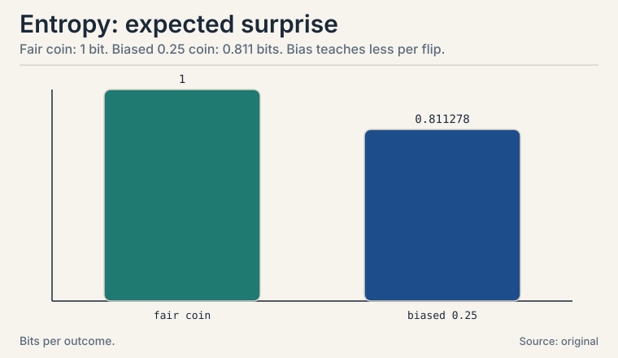
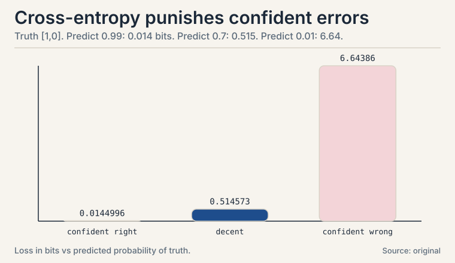
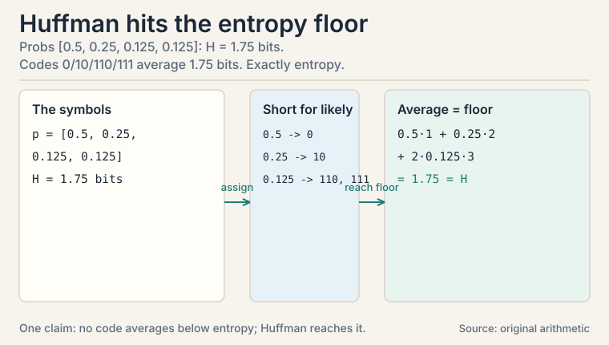
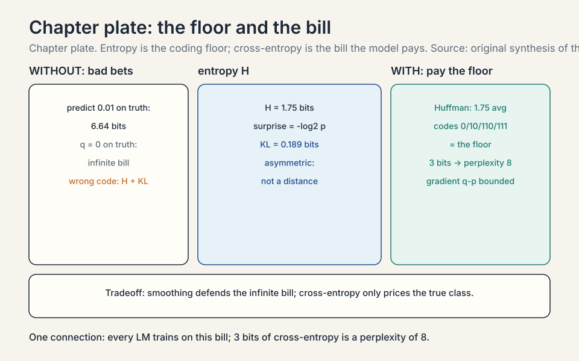

## [uncertain] A supplement beyond the playlist

The playlist has no dedicated information theory lecture: its
probability block (L48-L53) stops at joint distributions and
covariance. This lesson is a synthesis from standard references,
marked [uncertain] throughout. It earns its place because one
quantity, **cross-entropy**, is the loss function of logistic
regression (L08), softmax classifiers, and every language model in
this system (CS229 L08, CS336). You cannot read ML without it.

## The task: price a prediction in bits

A model predicts the next word. How do you score the prediction?
"Right or wrong" is too coarse: a model that assigned 49% to the
right word is better than one that assigned 1%. You need a score
that rewards good probabilities, not just good guesses.

**Information theory** prices uncertainty in **bits**. One bit is
the information in the answer to one yes/no question. The core
idea: surprising events carry more information than expected ones.
A fair coin flip tells you 1 bit. A double-headed coin flip tells
you 0 bits: you knew the answer.

### Subchapter: surprise

Define the **surprise** of an event with probability p as
-log2(p). A fair coin's heads: -log2(0.5) = 1 bit. A 1-in-1024
event: 10 bits. An impossible event would be infinitely
surprising, which is why models must never assign probability
exactly zero to anything possible.

Why the logarithm? Because information should add: two independent
1-bit events carry 2 bits, and log(p1 * p2) = log(p1) + log(p2).
The log turns "and" into "plus." Base 2 sets the unit: one yes/no
question.

: a 50/50 event is 1 bit. A 1% event is 6.64 bits. Shell 2. Source: original arithmetic. Project: Stanford Frontier AI.")

### Subchapter: entropy, the expected surprise

**Entropy** is the expected surprise: the average bits per outcome.

```ascii
H(X) = -sum of p(x) * log2 p(x)

fair coin:  H = -(0.5*log2 0.5 + 0.5*log2 0.5) = -(-0.5 - 0.5) = 1 bit
```

A biased coin, p(heads) = 0.25, worked by hand:

```ascii
log2 0.25 = -2,  log2 0.75 = -0.415
H = -(0.25 * -2 + 0.75 * -0.415) = -(-0.5 - 0.311) = 0.811 bits
```

Less than 1 bit: the bias makes outcomes more predictable, so each
flip teaches you less. Entropy is maximized by the uniform
distribution and minimized (zero) by certainty. It measures how
much you do not know.

The uniform-maximum fact has teeth: among all distributions with
the same support, the uniform one is the hardest to predict. This
is the **maximum entropy principle**: when you know nothing, the
honest prior is uniform. L05's priors inherit this logic.



### Subchapter: joint and conditional entropy

Two variables carry joint entropy H(X, Y): the expected
surprise of the pair. And **conditional entropy** H(Y|X): the
surprise left in Y after X is known. They obey the **chain
rule**:

```ascii
H(X, Y) = H(X) + H(Y|X)
```

Toy: X is a fair coin. Y copies X correctly with probability
0.9, flips it with 0.1. Joint table: P(0,0) = 0.45, P(0,1) =
0.05, P(1,0) = 0.05, P(1,1) = 0.45.

```ascii
H(X, Y) = -(2 * 0.45 * log2 0.45 + 2 * 0.05 * log2 0.05)
        = -(-1.037 - 0.432) = 1.4690 bits
H(Y|X)  = H(X, Y) - H(X) = 1.4690 - 1 = 0.4690 bits
```

Knowing X leaves only 0.469 bits of surprise in Y: the 10%
flip rate. Two rules fall out. Conditioning reduces entropy:
H(Y|X) <= H(Y), with equality only when X tells you nothing
about Y. And independence adds: H(X, Y) = H(X) + H(Y) exactly
when X and Y are independent. The gap between the sum and the
joint is the next subchapter's subject.

### Subchapter: mutual information

**Mutual information** is what X tells you about Y, in bits:

```ascii
I(X;Y) = H(Y) - H(Y|X) = H(X) + H(Y) - H(X, Y)
```

Toy: I(X;Y) = 1 - 0.4690 = 0.5310 bits. Symmetric: I(X;Y) =
I(Y;X). Zero exactly when X and Y are independent. Unlike
correlation (L06), it catches every dependence, linear or
not: Y = X^2 with symmetric X has zero correlation but
positive mutual information. Where it bites: **contrastive
learning** (CS229 L13). The InfoNCE loss maximizes a lower
bound on the mutual information between two views of the same
data (two crops of one image, a question and its answer). The
model learns representations that preserve what the views
share and discard what they do not. CLIP's image-text
alignment is mutual information maximization wearing a
contrastive loss. Decision rule: correlation for linear
relationships, mutual information when the dependence might
bend.

## KL divergence: the price of the wrong distribution

You believe the coin is fair: q = [0.5, 0.5]. It is actually
biased: p = [0.25, 0.75]. How much does your wrong belief cost?
The **KL divergence** measures the extra bits you pay for coding
data from p with q's expectations:

```ascii
KL(p || q) = sum of p(x) * log2(p(x) / q(x))

p = [0.25, 0.75], q = [0.5, 0.5]:
KL = 0.25 * log2(0.25/0.5) + 0.75 * log2(0.75/0.5)
   = 0.25 * (-1) + 0.75 * 0.585
   = -0.25 + 0.439 = 0.189 bits
```

Your wrong model costs 0.189 extra bits per flip.

### Subchapter: the asymmetry

Two properties matter. First, KL >= 0 always, and KL = 0 only when
p = q: you cannot beat the truth. Second, it is **not symmetric**:
KL(p||q) != KL(q||p). Flip the arguments: KL(q||p) = 0.5 *
log2(0.5/0.25) + 0.5 * log2(0.5/0.75) = 0.5 - 0.292 = 0.208 bits.
Different question, different price: 0.189 vs 0.208. KL measures
"wrongness of q when the world is p", direction included.
Treating it as a distance is the classic mistake.

 = 0.189 bits, KL(q||p) = 0.208 bits. Not a distance. Shell 3. Source: original arithmetic. Project: Stanford Frontier AI.")

## Cross-entropy: the loss function

**Cross-entropy** is entropy plus the KL price:

```ascii
H(p, q) = H(p) + KL(p || q) = -sum of p(x) * log2 q(x)
```

Read it: the true distribution is p, you predict q, and you pay
the average surprise of your predictions on real data. In
classification, p is the one-hot truth ([1, 0] for "cat") and q is
the model's probabilities ([0.7, 0.3]):

```ascii
loss = -(1 * log2 0.7 + 0 * log2 0.3) = -log2 0.7 = 0.515 bits
```

### Subchapter: the punishment curve

Confident and right ([0.99, 0.01]): -log2 0.99 = 0.014 bits.
Confident and wrong ([0.01, 0.99]): -log2 0.01 = 6.64 bits. The
loss explodes for confident errors: that is the behavior you want
in a loss. This is exactly L08's logistic loss, now in bits. Every
softmax classifier and every language model minimizes
cross-entropy between the true next token and the predicted
distribution (CS336, CS229 L08).

Why not just use accuracy? Because accuracy is blind to
confidence: 49% and 1% on the right answer both count as "wrong."
Cross-entropy rewards the 49%: it prices the probabilities, not
the argmax. Training on accuracy would give no gradient for
"almost right": the loss must be smooth in the probabilities.



### Subchapter: the gradient of cross-entropy

Minimizing cross-entropy needs its gradient: what L07's
backprop differentiates through. For logits z with softmax q
and one-hot truth p, the gradient is famously simple. The
clean form below uses the natural log:

```ascii
dL/dz = q - p        (prediction minus truth)
```

Toy: q = [0.7, 0.3], truth p = [1, 0]. Gradient: [0.7 - 1,
0.3 - 0] = [-0.3, 0.3]. The update pushes z1 up (toward the
truth) and z2 down, each in proportion to the error. Three
consequences. Confident-wrong ([0.01, 0.99] on truth [1,0])
gives gradient [-0.99, 0.99]: huge, matching the 6.64-bit
punishment. Confident-right gives near-zero gradient: the
model stops pushing. And the gradient is bounded in [-1, 1]:
cross-entropy never explodes the way squared error on logits
can. The [-1, 1] bound is for this natural-log gradient. Under
this lesson's log2 loss the gradient is (q - p)/ln 2, so the
bound is 1/ln 2 ≈ 1.44. This bounded, self-scaling gradient is
part of why softmax + cross-entropy trains so well. CS229 L08's
backprop derivation ends exactly here: every weight's
gradient chains through this vector.

### Subchapter: softmax, then the q - p proof

The earlier subchapter stated dL/dz = q - p without ever
defining q. Fix that. Log-base note first: this proof uses
the natural log. Every log below is ln, not log2. The lesson
measures cross-entropy in bits (log2), so the loss here and
the loss above differ by a constant factor. The conversion
note follows the proof. The model produces raw scores
z_1..z_k, one per class. These are called logits. They can be
any number, positive or negative, large or small. They are
not probabilities: they can be negative and they do not sum
to 1.

**Softmax** turns the logits into probabilities in two steps.
Step one: make every score positive with the exponential
function, e^{z_i}, which is positive for any real z_i. Step
two: normalize so the results sum to 1, by dividing each by
the total:

```ascii
q_i = e^{z_i} / sum_j e^{z_j}
```

The denominator sums the exponentials over all classes j.
Each q_i is positive, and the q_i sum to 1 by construction.
That is the whole definition: scores, then exp, then divide
by the sum.

Cross-entropy is L = -sum_k p_k log q_k, with p the one-hot
truth. Differentiate with respect to one logit z_i. The
chain rule:

```ascii
dL/dz_i = sum_k (dL/dq_k)(dq_k/dz_i)
        = sum_k -p_k * d(log q_k)/dz_i
```

The key step is d(log q_k)/dz_i. Write log q_k = z_k -
log(sum_j e^{z_j}). The derivative of the first term is
delta_ki: 1 if k = i, 0 otherwise, because z_k responds only
to its own logit. The derivative of the second term is
e^{z_i} / sum_j e^{z_j} = q_i. The symbol delta_ki is the
**Kronecker delta**: 1 when k equals i, 0 otherwise. So:

```ascii
d(log q_k)/dz_i = delta_ki - q_i
```

Assemble. dL/dz_i = sum_k -p_k (delta_ki - q_i) = -p_i +
q_i sum_k p_k. The delta picks out the single term k = i.
The remaining sum, sum_k p_k, equals 1 because p is a
probability distribution. So:

```ascii
dL/dz_i = q_i - p_i
```

Prediction minus truth, for every class i.

Evaluate on the lesson's toy: q = [0.7, 0.3], p = [1, 0].
dL/dz = [0.7 - 1, 0.3 - 0] = [-0.3, 0.3]. Exactly the number
the earlier subchapter quoted without proof. The proof shows
where the simple form comes from: the -p_i term punishes the
true class through its log, and the +q_i term spreads the
normalizer's correction across all classes.

**Log-base conversion.** Change of base: log2 q = ln q / ln 2.
The lesson's loss uses log2, so differentiating it gives
dL/dz = (q - p) / ln 2. Same direction as q - p, scaled by
1/ln 2 ≈ 1.44. On the toy: [-0.3, 0.3]/0.6931 = [-0.433,
0.433]. Frameworks absorb the 1.44 into the learning rate,
which is why the clean q - p form is the one everyone
quotes.

### Subchapter: perplexity, the LM score

Language models report **perplexity**: 2^(cross-entropy). A model
with cross-entropy 3 bits has perplexity 8: it is as confused as
if it chose uniformly among 8 words at each step. Lower is better.
Perplexity translates the abstract bit-bill into "how many options
the model hesitates between." A perplexity of 20 on open text is
strong. 200 is weak. Same loss, human-readable scale.

| Cross-entropy (bits) | Perplexity = 2^H | Reads as |
|---|---|---|
| 1 | 2 | as confused as choosing uniformly among 2 words |
| 2 | 4 | as confused as choosing uniformly among 4 words |
| 3 | 8 | as confused as choosing uniformly among 8 words |
| 4.32 | 20 | strong on open text |
| 7.64 | 200 | weak |

Perplexity 8 = cross-entropy 3 bits. Same loss, human-readable scale: lower is better.

## Where it breaks: zero probabilities and infinite bills

If q assigns 0 to an event that occurs, -log2(0) is infinite: one
impossible prediction bankrupts the whole average. Real systems
defend with **smoothing**: mix a little uniform distribution into
q so no probability hits exactly zero. Laplace smoothing in naive
Bayes (CS229 L05) is this defense. The second crack: cross-entropy
only cares about the probability assigned to the true class. A
model can be perfectly calibrated on truth-class probabilities and
wild elsewhere. Calibration metrics exist to catch that.

### Subchapter: Huffman coding, entropy as the limit

Entropy is not just a score: it is the coding limit. Four
symbols with probabilities [0.5, 0.25, 0.125, 0.125]. Entropy:
H = -(0.5*(-1) + 0.25*(-2) + 2*0.125*(-3)) = 1.75 bits.
**Huffman coding** assigns shorter codes to likelier symbols:
0, 10, 110, 111. Average length: 0.5*1 + 0.25*2 + 0.125*3 +
0.125*3 = 1.75 bits. Exactly entropy. **Shannon's source
coding theorem**: no uniquely decodable code averages below
the entropy. Entropy is the floor. The price of the wrong
code is KL: code for q when the truth is p, and the average
length is H(p) + KL(p||q). Every compressor (gzip, PNG,
tokenizers) lives between entropy and entropy-plus-KL.
**Arithmetic coding** approaches the floor without
integer-length codes. Byte-pair encoding (CS336's
tokenization) is Huffman-adjacent: frequent pairs get short
tokens. Compression and prediction are the same problem:
a good predictor is a good compressor.



### Subchapter: Jensen-Shannon, the symmetric fix

KL's asymmetry bothers distance-users. The **Jensen-Shannon
divergence** symmetrizes: mix m = (p+q)/2, average the two
KLs:

```ascii
JS(p, q) = (1/2) KL(p||m) + (1/2) KL(q||m)
```

Coin toy: m = [0.375, 0.625]. KL(p||m) = 0.25*log2(0.25/0.375)
+ 0.75*log2(0.75/0.625) = 0.0510. KL(q||m) = 0.0466. JS =
0.5*(0.0510 + 0.0466) = 0.0488 bits. Symmetric by
construction: JS(p,q) = JS(q,p).
Bounded: with base-2 logs, JS sits in [0, 1]. Zero exactly
when p = q. Where it bites: evaluating generative models
(how far is the generated distribution from the real one),
and the original GAN objective (which minimizes a JS
divergence between real and generated distributions). The
price of symmetry: JS loses KL's direction, the
mode-seeking vs mode-covering distinction the RLHF Q&A
exploited. Choose KL when direction matters, JS when you need
a symmetric score.

### Subchapter: differential entropy, the continuous warning

Entropy extends to continuous variables as **differential
entropy**: h(X) = -integral of p(x) log p(x) dx. The warning:
it can be negative. Uniform on [0, 0.5]: h = log2(0.5) = -1
bit. Negative information sounds absurd because the discrete
intuition ("bits to describe the outcome") assumed finite
precision. Continuous outcomes need infinite precision to
name exactly. Differential entropy measures relative
spread, not absolute information. Differences of differential
entropies are meaningful (mutual information stays
nonnegative). Absolute values are not. Decision rule: use
differential entropy for comparisons (which Gaussian is more
spread out), never for "how many bits" claims about
continuous data. Quantize first if you need honest bits.

| Idea | Formula | Meaning |
|---|---|---|
| Surprise | -log2 p | bits in one outcome; rarer = more bits |
| Entropy | -sum p log2 p | expected surprise; fair coin = 1, biased 0.25-coin = 0.811 |
| Joint / conditional entropy | H(X,Y) = H(X) + H(Y\|X) | toy: 1.4690 = 1 + 0.4690; conditioning reduces |
| Mutual information | H(Y) - H(Y\|X) | what X tells about Y; toy: 0.5310; InfoNCE maximizes it |
| KL divergence | sum p log2(p/q) | extra bits for believing q when truth is p; toy: 0.189 vs 0.208 |
| Cross-entropy | -sum p log2 q | the loss: truth p, prediction q; confident-wrong = 6.64 bits |
| CE gradient | q - p | prediction minus truth; bounded in [-1, 1] (natural log; 1/ln 2 ≈ 1.44 under log2) |
| Perplexity | 2^(cross-entropy) | effective number of options the model hesitates between |
| Huffman | frequent = short codes | entropy is the floor; toy: 1.75 bits exactly |
| Jensen-Shannon | (KL(p\|\|m) + KL(q\|\|m))/2 | symmetric; toy: 0.0488; the GAN objective |
| Differential entropy | -integral p log p | can be negative; Uniform(0,0.5) = -1 bit |
| Smoothing | mix in uniform | never let q hit exactly zero |

## What is used where: the real systems

| Math idea | Where it appears | Why there |
|---|---|---|
| Cross-entropy | LM training (CS336) | next-token loss on every batch |
| CE gradient q - p | Backprop (CS229 L08) | the vector every weight's gradient chains through |
| Perplexity | LM evaluation | 2^CE: the standard reported number |
| KL penalty | RLHF | keep the policy near the reference model |
| Mutual information | Contrastive learning (CS229 L13) | InfoNCE maximizes it between views |
| Bits | Compression | entropy is the coding limit (Shannon) |
| Huffman | Tokenization (CS336) | frequent pairs get short tokens |
| JS divergence | Generative eval, GANs | symmetric distance between distributions |
| Smoothing | Naive Bayes, LM outputs | Laplace: no exact zeros |



> [!QA]
> Q: What is entropy, in plain words?
> A: The average surprise per outcome, in bits. A fair coin has entropy 1: each flip teaches you one bit. A coin with p(heads) = 0.25 has entropy 0.811: the bias makes flips more predictable, so each teaches less. Entropy is highest for uniform distributions and zero when the outcome is certain. It measures how much you do not know.
> Follow-up: Why log base 2?
> A: Because the unit is the bit: one yes/no question. log2(0.5) = -1, so a 50/50 event carries exactly 1 bit. Natural log gives nats, base 10 gives dits: same idea, different ruler. ML uses nats (natural log) in code and bits in explanations. The loss is identical up to a constant factor, but the gradient scales by that same constant: under the natural log dL/dz = q - p, under log2 dL/dz = (q - p)/ln 2. Same direction, scaled by 1/ln 2 ≈ 1.44.

> [!QA]
> Q: Walk me through the KL divergence computation for the biased coin.
> A: Truth p = [0.25, 0.75], belief q = [0.5, 0.5]. KL = 0.25 * log2(0.25/0.5) + 0.75 * log2(0.75/0.5) = 0.25 * (-1) + 0.75 * 0.585 = -0.25 + 0.439 = 0.189 bits. Each term: the true probability times the log-ratio of true to believed. Positive ratios (you underrated) add cost. Negative ratios (you overrated) subtract, but the total never goes below zero.
> Follow-up: Now flip it: KL(q||p)?
> A: 0.5 * log2(0.5/0.25) + 0.5 * log2(0.5/0.75) = 0.5 * 1 + 0.5 * (-0.585) = 0.208 bits. Different: 0.189 vs 0.208. The direction matters because the weighting distribution changed: the first averages the log-ratio under p, the second under q.

> [!QA]
> Q: Why is cross-entropy the standard classification loss?
> A: Because it prices the model's predicted probabilities on real data: -sum of p log q. Truth [1, 0], prediction [0.7, 0.3]: loss 0.515 bits. Prediction [0.01, 0.99]: loss 6.64 bits. Confident wrong answers pay explosively, which is exactly the incentive you want. Minimizing cross-entropy is minimizing KL(p||q), since H(p) is constant: it drives the model's distribution toward the truth.
> Follow-up: What is the difference between KL divergence and cross-entropy?
> A: Cross-entropy = entropy of truth + KL divergence: H(p,q) = H(p) + KL(p||q). Since H(p) does not depend on the model, minimizing one minimizes the other. KL isolates the model's wrongness (0.189 bits in the coin toy). Cross-entropy is the total bill including irreducible uncertainty.

> [!QA]
> Q: Is KL divergence a distance?
> A: No. It is nonnegative and zero only when the distributions match, which tempts the word "distance", but it is not symmetric: KL(p||q) = 0.189 differs from KL(q||p) = 0.208. It has a direction: "cost of believing q when the world is p". Symmetric versions exist (Jensen-Shannon), but plain KL's asymmetry is a feature: in variational inference the direction you choose changes the answer.
> Follow-up: What happens with a zero predicted probability?
> A: Infinite loss: -log2(0) is undefined. One impossible prediction bankrupts the average. Defend with smoothing: mix a small uniform component into q. This is why naive Bayes uses Laplace smoothing and why softmax never outputs exact zeros.

> [!QA]
> Q: What is perplexity, and what does a perplexity of 20 mean?
> A: Perplexity is 2^(cross-entropy in bits): the effective number of options the model hesitates between. Perplexity 20 means the model's uncertainty equals choosing uniformly among 20 words at each step. It translates the bit-bill into a human scale: lower is better, 1.0 is perfect, vocabulary size is random guessing.
> Follow-up: Can you compare perplexities across different tokenizers?
> A: No, not directly. Perplexity is per-token, and different tokenizers split text into different numbers of tokens. Finer tokenization inflates the token count and usually lowers per-token perplexity artificially. Compare in bits per character or per byte instead: tokenizer-independent.

> [!QA]
> Q: Where does KL divergence appear in RLHF?
> A: As the leash. RLHF optimizes a reward model, but unconstrained optimization drifts the policy into gibberish that games the reward. The fix: penalize KL(policy || reference) in the objective, keeping the tuned model near the original. The KL price from this lesson becomes a regularization term: reward minus beta times KL. Beta is the leash length.
> Follow-up: Why KL(policy || reference) and not the reverse?
> A: Direction chooses the failure mode. KL(policy || reference) punishes the policy for putting mass where the reference has none: it keeps the policy inside the reference's support (mode-seeking). The reverse would punish the policy for missing the reference's mass (mode-covering). For safety you want the first: no wandering off the known-good map.

> [!QA]
> Q: Your classifier has great cross-entropy but users complain the probabilities feel wrong. Diagnose.
> A: Calibration. Cross-entropy only rewards the probability on the true class. A model can minimize it while being systematically overconfident elsewhere. Diagnose with a reliability diagram: bin predictions by confidence, plot accuracy per bin. Points below the diagonal mean overconfidence. Fix: temperature scaling (one parameter, fitted on validation) or isotonic regression. The loss trained the ranking. Calibration fixes the numbers.
> Follow-up: Why does temperature scaling work?
> A: It divides all logits by a single T before softmax: T > 1 softens, T < 1 sharpens. One parameter cannot change the ranking (accuracy stays), but it rescales confidence to match observed accuracy. It is the cheapest calibration fix because miscalibration is usually a global scale error.

> [!QA]
> Q: What is mutual information, and why does contrastive learning maximize it?
> A: I(X;Y) = H(Y) - H(Y|X): the bits X tells you about Y. In the toy, X is a fair coin and Y copies it with 90% fidelity: H(Y|X) = 0.4690, so I(X;Y) = 1 - 0.4690 = 0.5310 bits. It is symmetric and zero exactly under independence, and unlike correlation it catches nonlinear dependence. Contrastive learning (CS229 L13) trains on two views of the same data: two crops of one image. The InfoNCE loss maximizes a lower bound on the mutual information between the views' representations. The model keeps what the views share and discards the rest. That is how CLIP aligns images with text.
> Follow-up: Correlation vs mutual information: when does the choice matter?
> A: When the dependence bends. Y = X^2 on symmetric X has zero correlation (L06's trap, worked: Cov = 0 exactly) but positive mutual information: knowing X still tells you Y. Correlation is the linear special case. Mutual information is the general case. Report correlation for linear relationships; reach for mutual information when the relationship might curve.

## Recap: the whole lesson on one screen

1. **The task.** Score predicted probabilities, not just right/wrong guesses.
2. **Surprise.** -log2(p): rarer events carry more bits. Logs turn "and" into "plus."
3. **Entropy.** Expected surprise: fair coin 1 bit. 0.25-biased coin 0.811 bits, computed term by term. Uniform maximizes it.
4. **Joint and conditional.** H(X,Y) = H(X) + H(Y|X). Toy: 1.4690 = 1 + 0.4690. Conditioning reduces entropy. Independence adds.
5. **Mutual information.** H(Y) - H(Y|X) = 0.5310 in the toy. Symmetric, zero iff independent, catches nonlinear dependence. InfoNCE maximizes it between views (CS229 L13).
6. **KL divergence.** Extra bits for the wrong belief: 0.189 bits for q = fair when p = [0.25, 0.75]. Nonnegative, asymmetric (reverse: 0.208), not a distance.
7. **Cross-entropy.** H(p) + KL: the loss. Confident-right 0.014 bits, decent 0.515, confident-wrong 6.64 bits. This is logistic regression's loss and every LM's loss. Accuracy is blind to confidence. Cross-entropy is not.
8. **The gradient.** dL/dz = q - p: prediction minus truth (natural-log form). Bounded in [-1, 1] for the natural-log form; under this lesson's log2 loss the bound is 1/ln 2 ≈ 1.44. Self-scaling: confident-wrong pushes hard, confident-right rests.
9. **Perplexity.** 2^CE: effective options hesitated between. The LM scoreboard number.
10. **Entropy as the limit.** Huffman on [0.5, 0.25, 0.125, 0.125]: 1.75 bits, exactly entropy. No code beats it. Compression is prediction.
11. **Jensen-Shannon.** The symmetric fix: 0.0488 on the coin toy, bounded in [0, 1]. The GAN objective. Loses KL's direction.
12. **Where it breaks.** Zero predicted probability means infinite loss: smooth. Cross-entropy ignores non-truth classes: check calibration. Differential entropy can go negative: compare, never count bits.
13. **[uncertain]** The playlist has no info-theory lecture. This lesson synthesizes MacKay and the MML book.
14. **The bridge.** The math arc is complete: vectors (L01) hold data, matrices (L02) transform it, eigen/SVD (L03-L04) compress it, probability (L05-L06) models uncertainty, calculus (L07) differentiates, convexity (L08) guarantees, least squares (L09) fits, information theory prices predictions.

## Go deeper

<div style="position:relative;padding-bottom:56.25%;height:0;overflow:hidden;max-width:100%;margin:16px 0;">
<iframe style="position:absolute;top:0;left:0;width:100%;height:100%;" src="https://www.youtube-nocookie.com/embed/R4OlXb9aTvQ" title="Art of the Problem: Shannon's Information Entropy (Physical Analogy)" frameborder="0" allow="accelerometer; autoplay; clipboard-write; encrypted-media; gyroscope; picture-in-picture" allowfullscreen></iframe>
</div>

- Art of the Problem, "Shannon's Information Entropy (Physical Analogy)" (the embed above; also this lesson's frontmatter video): https://www.youtube.com/watch?v=R4OlXb9aTvQ
- MacKay, "Information Theory, Inference, and Learning Algorithms", ch. 1-2 (free): http://www.inference.org.uk/itila/: entropy, KL, cross-entropy from zero.
- Deisenroth, Faisal, Ong, "Mathematics for Machine Learning", ch. 6.6 (free): https://mml-book.github.io: information theory for ML.

## Official sources and further reading

**Official:**
- "Essential Mathematics for Machine Learning" playlist, Lectures 48-53 (probability prerequisite): [paper](https://www.youtube.com/playlist?list=PLLy_2iUCG87D1CXFxE-SxCFZUiJzQ3IvE)
- NPTEL course page (111107137): https://nptel.ac.in/courses/111107137

**Further reading:**
- MacKay, "Information Theory, Inference, and Learning Algorithms", ch. 1-2 (free):
  - [entropy, KL, cross-entropy from zero.](http://www.inference.org.uk/itila/)
- Deisenroth, Faisal, Ong, "Mathematics for Machine Learning", ch. 6.6 (free):
  - [information theory for ML.](https://mml-book.github.io)

**Caveats.** This entire lesson is [uncertain] with respect to the playlist: no information-theory lecture exists in it. All numbers are the lesson's own, verified by hand. Content follows MacKay's standard treatment.

## Connections to the other courses

- **CS229 L08:** softmax + cross-entropy: the loss every neural classifier minimizes. Its gradient q - p is what backprop chains through.
- **CS229 L13:** contrastive learning. InfoNCE maximizes a mutual-information lower bound between views. CLIP is this lesson applied to images and text.
- **CS229 L16/L17:** RLHF penalizes KL(policy || reference): this lesson's divergence as the leash.
- **CS336:** language modeling IS next-token cross-entropy minimization. Perplexity is 2^(cross-entropy). Tokenization is Huffman-adjacent compression.
- **CS229 L03:** logistic regression's loss is binary cross-entropy (L08 of this course).

## Coverage map: every lecture concept and where it lives

[uncertain] No information-theory lecture exists in the
playlist. This lesson synthesizes MacKay (ch. 1-2) and MML
book (ch. 6.6). Every standard concept maps below. All numbers
are the lesson's own, verified by hand and in python3.

| Lecture concept | Covered in | File line |
|---|---|---|
| Bits; surprise -log2(p); log turns "and" into "plus" | surprise | L52 |
| Entropy -sum p log2 p; fair coin 1 bit; 0.25-coin 0.811 | entropy, the expected surprise | L67 |
| Joint entropy; conditional entropy; chain rule H(X,Y) = H(X)+H(Y\|X); toy 1.4690 = 1 + 0.4690 | joint and conditional entropy | L96 |
| Mutual information; toy 0.5310; symmetric; InfoNCE (CS229 L13) | mutual information | L124 |
| KL divergence; toy 0.189 bits; KL >= 0 | KL divergence: the price of the wrong distribution | L147 |
| KL asymmetry: 0.189 vs 0.208; not a distance | the asymmetry | L165 |
| Cross-entropy = H(p) + KL; one-hot toy 0.515 bits | Cross-entropy: the loss function | L177 |
| Punishment curve: 0.014 / 0.515 / 6.64 bits; why not accuracy | the punishment curve | L194 |
| CE gradient: q - p = [-0.3, 0.3]; bounded, self-scaling | the gradient of cross-entropy | L212 |
| Perplexity 2^CE; tokenizer comparison warning | perplexity, the LM score | L235 |
| Zero probabilities: infinite loss; smoothing; calibration | Where it breaks | L244 |
| Huffman: 1.75 bits = entropy; Shannon floor; tokenization link | Huffman coding, entropy as the limit | L255 |
| Jensen-Shannon: 0.0488; symmetric; GAN objective | Jensen-Shannon, the symmetric fix | L274 |
| Differential entropy: Uniform(0,0.5) = -1 bit; compare, do not count | differential entropy, the continuous warning | L298 |
| RLHF KL leash | Q&A: Where does KL divergence appear in RLHF? | L375 |
| Temperature scaling for calibration | Q&A: classifier with great cross-entropy but wrong-feeling probabilities | L383 |
