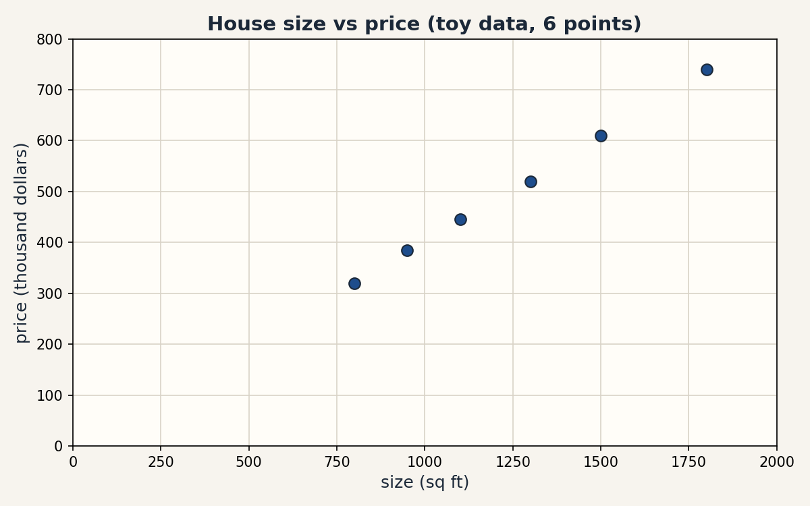

# Lesson 01, Mathematical language and computational setup

Unit: math-ml-U01. Leaf concepts: math-ml-U01-C01 to C12.
Date: 2026-10-06. Baseline: October 6, 2026.

## Source mapping

This lesson is locally authored prerequisite bridge content. It does not
claim to reproduce the instructor's lectures. Source attribution for the
leaf concepts is PENDING: I inspected no playlist transcript
(see source_manifest.md SRC-04, source_gaps.md G2). The playlist's Tutorial 1
covers Python basics by title. Its content is not inspected.

## Scope and objectives

Scope: the working language of the whole course. Sets and functions,
notation, units, sums, products, logs, exponents, vectors, axes, tiny
numerical code, honest plots, assertions, precision, and reproducibility.

Objectives: after this lesson the learner can name every object with its
unit and shape, compute a toy by hand and in code, check the result with
an assertion, and state what breaks when one rule is dropped.

Dependencies: prerequisites.md R1-R10. No later unit is used.

## How to read this lesson

Each section follows one chain. A concrete question opens. A first attempt
from zero follows. The attempt breaks with numbers. One hinge question
names the gap. The new idea is built from zero. A computed example uses the
same objects. Code, checks, costs, alternatives, and a failure case close.
Figures carry one claim each. The audit table lives in visual_audit.md.

---

## C01, sets and functions

Motivating question: how do we name a pile of items and the rule that
turns each item into a new value?

Start from zero. Four houses have sizes 1, 2, 3, 4 (in thousand sq ft).
A rule doubles the size and adds 3. Write the rule as f(x) = 2x + 3.

Mental model. A set is a bag of distinct items. Order does not matter.
A function is a machine with one input slot and one output chute. Each
item that goes in comes out as exactly one value. That last sentence is
the whole contract.

Variables. x names the input slot. f names the rule. D = {1, 2, 3, 4}
is the domain, the set of allowed inputs. The outputs {5, 7, 9, 11} are
the image. |D| = 4 counts the items.

Why the contract matters. Suppose a rule says g(2) = 7 and also
g(2) = 8. Then g is not a function. A training set with two different
prices for the same size gives the model two targets for one input, and
no squared-error update can satisfy both at once. The definition exists
to rule that out.

Computed example, same objects.

    f(1) = 2*1 + 3 = 5
    f(2) = 2*2 + 3 = 7
    f(3) = 2*3 + 3 = 9
    f(4) = 2*4 + 3 = 11

The image has 4 items, so no two inputs collided here.

Figure f01 (ASCII). The domain maps to the image, one arrow per item.

    D = {1, 2, 3, 4}          f(x) = 2x + 3          image = {5, 7, 9, 11}
      1 -----------> 5
      2 -----------> 7
      3 -----------> 9
      4 -----------> 11

    Caption: one input, one output, no shared arrows. Shell 3. Source: original toy.

Implementation. A list comprehension is the function in code.

```python
def f(x):
    return 2 * x + 3

domain = [1, 2, 3, 4]
image = [f(x) for x in domain]
assert image == [5, 7, 9, 11]
```

Correctness check. Recompute f(2 * 2) and f(4): both give 11, so the rule
is consistent. Expected output: [5, 7, 9, 11].

Costs. Each call of f on n items costs O(n) time and O(n) memory for the
output list.

Nearest alternative. A relation drops the one-output contract and allows
g(2) = {7, 8}. Selection boundary: use relations to describe data, but a
model must be a function, or training has no single target per input.

Failure case. Define h(1) = 5, h(1) = 6. The membership test "is 5 the
output of h at 1" has no answer. Counterexample: any lookup table with a
repeated key and different values is not a function.

Assessment. See exercises E01-E04 and ladder L01 in this lesson. Keys in
lessons/u01/keys.md.

---

## C02, notation

Motivating question: how do we read a formula in seconds instead of
minutes?

Notation is compressed language. Each symbol has a contract: what it
means, what it takes, what it returns. Learn the contract once, then read
fast forever. The full symbol registry lives in notation_and_shapes.md.

Mental model. A formula is a sentence. Symbols are its nouns and verbs.
An undefined symbol is a word you do not know: stop and look it up.

The U01 contracts, each with one tiny use.

Figure f02 (table). The claim is a comparison of symbols to meanings.

| Symbol | Contract | Tiny use |
|---|---|---|
| x | names a quantity | x = 7 |
| f(x) | output of rule f at input x | f(2) = 7 |
| {1, 2, 3} | set of the listed items | 2 in {1, 2, 3} |
| |S| | count of items in S | |{1, 2, 3}| = 3 |
| R | the real numbers | x in R |
| sum x_i | add the items x_1 ... x_n | sum = 2 + 5 + 7 = 14 |
| prod x_i | multiply the items | prod = 2 * 5 * 7 = 70 |
| log_b(x) | b to what power gives x | log_2(8) = 3 |
| [3, 4] | vector with items 3, 4 | length 2 |
| ||x|| | length of vector x | ||[3,4]|| = 5 |

Caption: every symbol used in this lesson, with its contract. Shell 2. Source: original.

Computed example. Expand the sum contract on the C01 image set.

    sum_{i=1}^{4} y_i = 5 + 7 + 9 + 11 = 32

Check: 5 + 7 = 12, 12 + 9 = 21, 21 + 11 = 32.

Costs. Notation costs nothing to run. It costs confusion when skipped.
One undefined symbol can waste an hour of reading.

Nearest alternative. Words instead of symbols ("the sum of the first four
outputs"). Selection boundary: symbols for formulas you manipulate. Words for ideas you explain once.

Failure case. Use x for a scalar on one line and a vector on the next.
The expression x + 1 then has two meanings. Counterexample: in code,
x = 7 then x = [7] silently changes every later line. Name the kind at
first use.

Assessment. See exercises E05-E06. Keys in lessons/u01/keys.md.

---

## C03, units

Motivating question: how do we catch a wrong formula before it runs?

Numbers without units mislead. A unit is a tag on a number: meters,
dollars, seconds. Only quantities with the same unit may add. The unit of
a product is the product of the units.

Concrete problem. Six houses: sizes in sq ft, prices in thousand dollars.
Two points: (800, 320) and (950, 385). The slope is

    (385 - 320) / (950 - 800) = 65 / 150 = 0.4333

The unit of the slope is (thousand dollars) / (sq ft). Read it as: each
extra square foot adds about 0.4333 thousand dollars, or 433.33 dollars,
to the price.

Mental model. A unit is a noun attached to a number. "5" is nothing.
"5 meters" is a length. "5 dollars" is a price. The noun decides which
operations are legal.

Derivation of the check. Take f(x) = 2x + 3 with x in meters. Then 2x is
in meters. The constant 3 must also be in meters, and f(x) is in meters.
If x were in meters and 3 in seconds, the formula mixes units and the
result has no meaning.

Figure f03 (equation block). Before: bare numbers. After: units checked.

    Before:  f(x) = 2x + 3, x = 4        -> f = 11, unit unknown
    Rule:     tag every term with its unit
    After:   f(x) = 2x + 3, x = 4 meters -> f = 11 meters. The 3 is 3 meters

    Caption: the rule is one tag per term. Shell 3. Source: original toy.

Computed example, same objects. Price per sq ft from the two points:
65 thousand dollars / 150 sq ft = 0.4333 thousand dollars per sq ft.
Multiply back: 0.4333 * 150 = 65.0 thousand dollars. The round trip
closes, so the unit arithmetic is consistent.

Costs. Unit checks cost a few seconds of thought and catch whole classes
of wrong formulas. Automated unit libraries exist but are rare in ML code. The discipline is manual.

Nearest alternative. Dimensionless ratios (price divided by mean price).
Selection boundary: use ratios for comparison across markets. Keep units
for any formula that must predict a real quantity.

Failure case. Add 800 sq ft and 320 thousand dollars. The sum 1120 has no
unit and no meaning. ML version: a raw pixel count (0 to 255) added to a
normalized feature (0 to 1) lets the pixel count dominate every distance
computation. Counterexample: two features with units meters and dollars
fed to a nearest-neighbor rule with no scaling. The dollar feature wins
every tie by magnitude alone.

Assessment. See exercises E07-E08. Keys in lessons/u01/keys.md.

---

## C04, sums and products

Motivating question: how do we collapse a whole list into one number?

Machine learning aggregates lists constantly: total loss over examples,
total count of tokens, product of probabilities. Two operations do most
of this work: sum and product.

First attempt from zero. Add [2, 5, 7] by hand: 2 + 5 = 7, 7 + 7 = 14.
Multiply: 2 * 5 = 10, 10 * 7 = 70.

Mental model. A sum piles items into one heap. A product scales a running
total, one factor at a time.

Variables. x_i is the item at index i. n counts the items. The sum runs
i = 1 to n. The product runs the same range.

It breaks with numbers. Change one item: [2, 5, 9]. The sum moves from
14 to 16. The product jumps from 70 to 90. One changed input moved the
product by 20 while the sum moved by 2. Products amplify single changes.

Hinge question: is there a way to keep the product's information without
its explosive range?

Computed example, same objects. Take logs base 10 of the factors of 70:

    log10(2) + log10(5) + log10(7) = 0.30103 + 0.69897 + 0.84510 = 1.84510
    log10(70) = 1.84510

The sum of the logs equals the log of the product. This identity is the
bridge to C05, and it is exact on these numbers.

Figure f04 (ASCII). One trace of the accumulation.

    items:   2       5       7
    sum:     2  ->   7  ->  14
    product: 2  ->  10  ->  70

    Caption: each step folds one item into the running total. Shell 3. Source: original toy.

Implementation.

```python
xs = [2, 5, 7]
total = 0
for v in xs:
    total = total + v
assert total == 14
prod = 1
for v in xs:
    prod = prod * v
assert prod == 70
```

Correctness checks. Reorder the list: sum and product do not change.
Expected output: 14 and 70.

Costs. One pass over n items: O(n) time, O(1) extra memory.

Nearest alternatives. Mean = sum / n (14 / 3 = 4.667). Max = 7.
Selection boundary: sums for totals, means for comparison across lists
of different length, products for combined independent factors.

Failure case. The product of many large numbers overflows the float
range and becomes infinity. The product of an empty list is 1 by
convention. The sum of an empty list is 0. Code that starts a product
accumulator at 0 always returns 0. Counterexample: prod = 0. Then every
later multiply keeps 0.

Assessment. See exercises E09-E10. Keys in lessons/u01/keys.md.

---

## C05, logs and exponents

Motivating question: how do we multiply hundreds of tiny probabilities
without the answer collapsing to zero?

Concrete problem. A model assigns probability 0.1 to each of 400
independent events. The joint probability is 0.1^400. Computed directly,
the product is 0.0: the float underflows to zero. The true value is
positive but far below the smallest representable float.

Mental model. A logarithm counts "orders of smallness". log10(0.1) = -1,
so each factor contributes -1, and 400 factors contribute -400. An
exponent undoes a log: 10^(-400) would be the answer if the float could
hold it.

Derivation, justified. log_b(a * c) = log_b(a) + log_b(c), because logs
count exponents and exponents add when bases multiply. Verified above:
log10(200) = 2.3010299956639813, and log10(2) + log10(100) = 0.30103 +
2 = 2.3010299956639813. Same number, two paths.

Computed example, same objects. Stay in log space:

    log of each factor: log(0.1) = -2.302585092994046
    total over 400 factors: 400 * -2.302585092994046 = -921.0340371976182

The sum -921.0340371976182 is finite and exact enough to compare two
models. The exp step gives 0.0 again, so the lesson is: do not
exponentiate back. Compare in log space.

Second computed example. Three coin flips, each with probability 0.5:

    product: 0.5 * 0.5 * 0.5 = 0.125
    log space: 3 * log(0.5) = -2.0794415416798357
    exp(-2.0794415416798357) = 0.125

Both paths agree here because 0.125 is representable.

Figure f05 (table). The claim compares direct and log-space paths.

| Path | Computation | Result |
|---|---|---|
| direct product | 0.1 multiplied 400 times | 0.0 (underflow) |
| log-space sum | 400 * log(0.1) | -921.0340371976182 (finite) |
| exp of the sum | exp(-921.0340371976182) | 0.0 (underflow again) |

Caption: log space keeps the value usable. Shell 3. Source: original toy, computed 2026-10-06.

Implementation. Use math.fsum for an accurate log sum.

```python
import math
logs = [math.log(0.1)] * 400
total = math.fsum(logs)
assert abs(total - (-921.0340371976182)) < 1e-9
```

Correctness check. exp(log(x)) == x for x = 0.125 within 1e-12.

Costs. One log per factor: O(n), same as the product, with no underflow.

Nearest alternative. Direct multiplication. Selection boundary: direct
products for a handful of factors. Log space for chains of ten or more,
and always for likelihoods.

Failure case. log(0) is undefined and raises an error. Log of a negative
number is undefined in real arithmetic. Models add a tiny epsilon, for
example log(p + 1e-12), to avoid the crash. Counterexample: a predicted
probability of exactly 0 in a log-loss gives negative infinity loss.

Why ML lives in log space. Likelihoods multiply one factor per data
point. Datasets have thousands of points. The log-likelihood is a sum,
its gradient is a sum of per-example terms, and the numbers stay finite.
This one move underlies MLE, cross-entropy, and every probabilistic loss
in U04.

Assessment. See exercises E11-E13 and ladder L02. Keys in lessons/u01/keys.md.

---

## C06, vectors

Motivating question: how do we hold one data point as one object?

A house is not one number. It has size, rooms, age. A vector packs the
list [size, rooms, age] into one object that formulas can move as a unit.

Mental model. A vector is an arrow: it has a direction and a length. The
list [3, 4] points 3 right and 4 up. Its length comes from Pythagoras.

Variables. v = [3, 4]. v_1 = 3, v_2 = 4. n = 2 items.

Derivation of the norm. Length squared = 3^2 + 4^2 = 9 + 16 = 25.
Length = sqrt(25) = 5.0.

Computed example, same objects. Let w = [2, -1].

    v + w = [3 + 2, 4 + (-1)] = [5, 3]
    3v = [9, 12]
    v dot w = 3*2 + 4*(-1) = 6 - 4 = 2
    ||3v|| = sqrt(81 + 144) = sqrt(225) = 15 = 3 * ||v||

Figure f06 (ASCII). Addition moves the arrow head to head.

    v = [3,4]  w = [2,-1]
    v + w: start at (0,0), follow v to (3,4), then w to (5,3)

    (0,4) .       . (3,4) -> w -> (5,3)
          .     .
    (0,0) . . . . .

    Caption: vector addition chains arrows. Shell 3. Source: original toy.

Implementation.

```python
import math
v = [3.0, 4.0]
norm = math.sqrt(sum(t * t for t in v))
assert norm == 5.0
w = [2.0, -1.0]
dot = sum(a * b for a, b in zip(v, w))
assert dot == 2.0
```

Correctness check. ||3v|| = 15.0 = 3 * 5.0. A scaled vector keeps its direction, and its length scales by the same factor.

Costs. Each operation touches n items once: O(n) time, O(n) memory.

Nearest alternatives. Tuples (immutable, fine for fixed records). Plain
lists (mutable, no vector operations built in). Selection boundary:
tuples for records, NumPy arrays for math at scale, plain lists for
teaching the mechanics.

Failure case. v + u with v of length 2 and u of length 3 has no meaning. Code raises a shape error. In NumPy, mismatched shapes can broadcast
silently instead of erroring, which is worse. Counterexample:
[3, 4] + [1, 2, 3] must fail loudly, never guess.

Assessment. See exercises E14-E15. Keys in lessons/u01/keys.md.

---

## C07, axes

Motivating question: when a table has two directions, how do we say
which one a reduction collapses?

A table of 2 houses by 3 features:

    M = [[0, 1, 2],
         [3, 4, 5]]

Axis 0 runs down the rows. Axis 1 runs across the columns.

Mental model. Reducing along an axis deletes that axis from the shape.
Sum along axis 0: the 2 rows collapse into 1 row of 3 column totals.
Sum along axis 1: the 3 columns collapse into 1 column of 2 row totals.

Computed example, same objects.

    sum over axis 0: [0+3, 1+4, 2+5] = [3, 5, 7], shape (2,3) -> (3,)
    sum over axis 1: [0+1+2, 3+4+5] = [3, 12],   shape (2,3) -> (2,)

Check: 3 + 5 + 7 = 15 and 3 + 12 = 15. Both paths give the same grand
total, so the axis arithmetic is consistent.

Figure f07 (ASCII). Before and after each reduction.

    axis 0 (down):        axis 1 (across):
    [0 1 2]               [0 1 2] -> 3
    [3 4 5]  -> [3 5 7]   [3 4 5] -> 12
    shape (2,3) -> (3,)    shape (2,3) -> (2,)

    Caption: the named axis disappears from the shape. Shell 3. Source: original toy.

Implementation.

```python
import numpy as np
M = np.arange(6).reshape(2, 3)
a0 = M.sum(axis=0)
a1 = M.sum(axis=1)
assert list(a0) == [3, 5, 7] and a0.shape == (3,)
assert list(a1) == [3, 12] and a1.shape == (2,)
```

Correctness check. a0.sum() == a1.sum() == 15.

Costs. One pass over all items: O(rows * columns).

Nearest alternative. Explicit Python loops over rows or columns.
Selection boundary: loops for teaching, axis reductions for real code.

Failure case. axis=2 on a 2D table raises an error. The silent version:
taking the mean over axis 0 when you meant axis 1 averages across the
batch instead of across features, and every downstream number is wrong
with no error raised. Counterexample: with M above, mean(axis=0) =
[1.5, 2.5, 3.5] (column means). Mean(axis=1) = [1.0, 4.0] (row means).
Different answers, no warning.

Assessment. See exercises E16-E17. Keys in lessons/u01/keys.md.

---

## C08, coding numerical toys

Motivating question: how do we turn a formula into code we trust?

Every formula in this course becomes code. The discipline: write the
smallest version, feed it numbers with known answers, and assert the
answers. The toy below computes a vector norm from zero, with no library.

First attempt from zero. The norm of [3, 4] is 5. Write it:

```python
import math

def vector_norm(xs):
    total = 0.0
    for t in xs:
        total = total + t * t
    return math.sqrt(total)

assert vector_norm([3.0, 4.0]) == 5.0
assert vector_norm([0.0, 0.0]) == 0.0
assert abs(vector_norm([1.0, 1.0, 1.0]) - math.sqrt(3.0)) < 1e-12
```

It breaks with numbers. Delete the sqrt line and return total instead.
The test then compares 25.0 to 5.0 and fails. The assertion names the
exact wrong value, 25.0, so the fix is obvious.

Mental model. A toy is a contract in code: inputs with known outputs.
The assert is the judge. If the judge stays silent, the code earned
trust for exactly those inputs.

Hinge question: what does the test not prove? It does not prove the
function works for length-1000 vectors, for negative items, or for
non-list inputs. Tests prove the tested cases, nothing more.

Figure f08 (code block, 12 lines). The claim is the trace: three inputs,
three asserted outputs.

    vector_norm([3,4])     -> 5.0            (3-4-5 triangle)
    vector_norm([0,0])     -> 0.0            (zero vector)
    vector_norm([1,1,1])   -> 1.732050807... (sqrt of 3)

    Caption: known answers judge the code. Shell 5. Source: original toy.

Correctness checks. Expected outputs above. Run: python3 lesson toy.
Status: executed 2026-10-06, all asserts pass.

Costs. O(n) time for n items. Writing the toy costs minutes. Debugging
without one costs hours.

Nearest alternative. numpy.linalg.norm: one call, fast, opaque for
learning. Selection boundary: hand code to learn the mechanism. NumPy
for real workloads.

Failure case. An empty list returns 0.0, which is correct for the zero
vector but may hide a data bug upstream. A list with a string raises a
type error at t * t. Counterexample: vector_norm([]) passes silently
while the caller expected 4 features.

Assessment. See exercises E18-E19 and the debug task D01. Keys in
lessons/u01/keys.md.

---

## C09, plotting honest data

Motivating question: how do we draw a picture that does not lie?

A plot is a claim. The axis limits are part of the claim. A y-axis that
starts at 300 makes a rise from 320 to 385 look like a doubling. An axis
that starts at 0 shows the true proportion.

Concrete data. Six houses, sizes in sq ft, prices in thousand dollars:

    (800, 320), (950, 385), (1100, 445), (1300, 520), (1500, 610), (1800, 740)

Implementation. The exact code that produced the lesson figure:

```python
import matplotlib
matplotlib.use("Agg")
import matplotlib.pyplot as plt

x = [800, 950, 1100, 1300, 1500, 1800]
y = [320, 385, 445, 520, 610, 740]
fig, ax = plt.subplots(figsize=(8, 5))
ax.scatter(x, y, s=64)
ax.set_xlabel("size (sq ft)")
ax.set_ylabel("price (thousand dollars)")
ax.set_title("House size vs price (toy data, 6 points)")
ax.set_xlim(0, 2000)
ax.set_ylim(0, 800)
fig.savefig("f09_honest_scatter.png", dpi=150)
```

Figure f09 (PNG, rendered and verified 2026-10-06). Six dots, both axes
start at 0, labels carry units. File: visuals/u01/f09_honest_scatter.png.

Mental model. Ink on the page is evidence. Every dot must trace back to
a row of data, and every axis must show its full range or say why not.

Correctness checks. Count the dots: 6. Read one dot: (800, 320) matches
the first row. Axes start at 0. Labels name the units.

Costs. A plot costs seconds and can replace a paragraph of description.

Nearest alternative. A table of the six rows: exact, but the trend is
harder to see. Selection boundary: tables for exact values, plots for
shape and trend, both for important claims.

Failure case. Truncate the y-axis to [300, 750] and the cheapest house
sits at the bottom edge while the priciest touches the top: the eye
reads a 2.3x price range as a 10x range. Counterexample: same six dots,
y from 300, and the visual story flips from "steady climb" to
"explosive growth". Always show the axis limits or state them.

Assessment. See exercises E20-E21. Keys in lessons/u01/keys.md.

---

## C10, assertions

Motivating question: how do we catch a wrong number at the exact line
where it goes wrong?

An assertion states what must be true at a point in the code. If the
statement is false, the program stops and names the line. The bug cannot
travel downstream and corrupt ten more numbers first.

Concrete problem. A classifier outputs probabilities for 3 classes:
p = [0.2, 0.3, 0.5]. Probabilities must be non-negative and sum to 1.

```python
def check_prob_vector(p, tol=1e-9):
    assert all(v >= 0.0 for v in p), "negative probability in %r" % (p,)
    s = sum(p)
    assert abs(s - 1.0) < tol, "probabilities sum to %r, not 1" % (s,)
    return True

check_prob_vector([0.2, 0.3, 0.5])
```

Mental model. An assertion is a guard at a door. Every value that passes
has shown its papers.

Computed check. sum([0.2, 0.3, 0.5]) = 1.0 exactly in float64 here, so the
tolerance 1e-9 passes. Feed [0.2, 0.3, 0.4]: the sum is 0.9, the message
reads "probabilities sum to 0.9, not 1", and the failure names the value.

Figure f10 (truth table). The claim lists inputs and verdicts.

| Input p | sum | Verdict |
|---|---|---|
| [0.2, 0.3, 0.5] | 1.0 | passes |
| [0.2, 0.3, 0.4] | 0.9 | fails: sum is 0.9, not 1 |
| [0.5, 0.5, -0.1] | 0.9 | fails: negative probability |

Caption: the guard names the bad value. Shell 5. Source: original toy.

Costs. Each check is O(n) for n items, run once per call. In hot loops,
guard the batch, not each item.

Nearest alternatives. Unit tests (check after the run). Type hints
(check the kind, not the value). Selection boundary: assertions for
invariants that must hold every run. Tests for behavior across runs.

Failure case. A tolerance of 0.5 passes sums from 0.5 to 1.5 and guards
nothing. An assertion inside a tight loop over a million items adds real
time. Counterexample: assert with tol=1e-16 fails on legitimate float
noise and trains the team to delete assertions.

Assessment. See exercises E22-E23. Keys in lessons/u01/keys.md.

---

## C11, precision

Motivating question: why does 0.1 + 0.1 + ... (ten times) not equal 1.0?

Floats are finite. A float32 holds about 7 decimal digits. A float64
holds about 16. The number 0.1 has no exact binary form, so each format
stores the nearest representable neighbor.

Computed example, same objects.

    float32: 0.1 added ten times = 1.0000001192092896
    float64: 0.1 added ten times = 1.0
    (1/3) * 3 in float64 = 1.0
    (1/3) * 3 in float32 = 1.0000000298023224

The float64 sum lands exactly on 1.0 here by rounding luck. The float32
sum misses by about 1.2e-7. Both are approximations. Only the size of
the error differs.

Mental model. A float is scientific notation with a fixed digit budget.
float32 spends fewer digits, so its steps between representable numbers
are coarser.

It breaks with numbers. Catastrophic cancellation: (1e16 + 1) - 1e16.
The true answer is 1.0. In float64 the sum 1e16 + 1 rounds back to 1e16,
so the computed answer is 0.0. Sixteen digits of budget cannot hold a 1
seventeen digits down from the leading digit.

Figure f11 (table). The claim compares the two formats on the same sums.

| Computation | float32 | float64 |
|---|---|---|
| ten times 0.1 | 1.0000001192092896 | 1.0 |
| (1/3) * 3 | 1.0000000298023224 | 1.0 |
| (1e16 + 1) - 1e16 | 0.0 | 0.0 |

Caption: fewer digits, larger error. Cancellation defeats both. Shell 7. Source: original toy, computed 2026-10-06.

Correctness rule. Never compare floats with ==. Compare with a tolerance:
abs(a - b) < 1e-9 for float64-scale work.

Costs. float32 uses half the memory and often runs faster on GPUs. It
buys that with coarser steps. float64 is the default for science code.

Nearest alternative. Python decimals or fractions: exact for decimal and
rational arithmetic, far slower. Selection boundary: float64 for
learning and debugging numerics, float32 for large-scale training where
memory and speed matter, exact types only for money and counts.

Failure case. A training loss compared with == never triggers the
"converged" branch. A probability of 1e-40 in float32 rounds to 0, and
log(0) then crashes. Counterexample: the C05 log-space lesson exists
because float32 cannot hold 0.1^400.

Assessment. See exercises E24-E25. Keys in lessons/u01/keys.md.

---

## C12, reproducibility

Motivating question: how do we make random code give the same answer
twice?

A random generator is deterministic: a seed fixes the whole sequence.
Same seed, same numbers, every run, on every machine.

Computed example, same objects.

```python
import numpy as np
rng = np.random.default_rng(7)
print(rng.random(4))   # [0.62509547 0.8972138  0.77568569 0.22520719]
rng = np.random.default_rng(7)
print(rng.random(4))   # [0.62509547 0.8972138  0.77568569 0.22520719]
```

Both runs print the identical four numbers. Without a seed, each run
prints different numbers.

Mental model. The seed is a save slot. Loading slot 7 replays the exact
same game.

Implementation discipline. Seed once at the start of the program. Log
the seed with the results. Never seed inside a loop.

Figure f12 (table). The claim shows seed in, sequence out.

| Setup | First four outputs |
|---|---|
| default_rng(7), run 1 | 0.62509547, 0.8972138, 0.77568569, 0.22520719 |
| default_rng(7), run 2 | 0.62509547, 0.8972138, 0.77568569, 0.22520719 |
| default_rng() unseeded | varies per run |

Caption: the seed fixes the sequence. Shell 3. Source: original toy, computed 2026-10-06 (numpy 1.26.4).

Correctness check. Assert the two seeded runs are element-wise equal.

Costs. Seeding costs one line. Not seeding costs every debugging session
that cannot replay a failure.

Nearest alternative. Fixed datasets instead of random draws.
Selection boundary: seeds for stochastic code. Fixed data for unit tests.

Failure case. Seeding inside the training loop resets the generator each
iteration, so every batch draws the "first" random numbers and the data
order never varies. Forgetting to seed at all means a colleague cannot
reproduce your numbers. Counterexample: two runs of the same script give
different accuracies and nobody knows which change caused it.

Assessment. See exercises E26-E27. Keys in lessons/u01/keys.md.

---

## Chapter plate

Figure f13. Left: cost without the rule. Center: the stored object.
Right: cost with the rule. Bottom: the tradeoff in one line.

    WITHOUT THE RULE                          WITH THE RULE
    bare numbers, no units, no shapes         every quantity named, tagged, checked
    - wrong formula runs silently             - unit check kills it in seconds
    - 0.1^400 silently becomes 0.0            - log space keeps -921.034 finite
    - axis mix-up, no error raised            - shape assert fails at the line
    - "it worked on my machine"               - seed 7 replays everywhere

    Center object: one quantity card per value: name, unit, shape, check.

    Tradeoff: a few seconds of naming and checking per quantity buys back
    hours of silent wrong numbers.

Caption: the U01 rule connects all twelve plates. Chapter plate. Source: original.

## Lesson exercises (questions. Answers in lessons/u01/keys.md)

E01. List the image of f(x) = x^2 + 1 on domain {-2, -1, 0, 1, 2}. What is
|image|?
E02. Give a rule on {1, 2} that is not a function. Explain which contract
line it breaks.
E03. A dataset maps house id to price, but id 7 appears twice with two
prices. Is the mapping a function? What breaks in training?
E04. Write the sum of the image of f(x) = 2x + 3 on {1, 2, 3, 4} in sigma
notation and compute it.
E05. Expand sum_{i=1}^{3} (2*i) and compute the value.
E06. In one derivation, x is a scalar count and later a vector of counts.
Name the failure and fix the notation.
E07. A model predicts time in seconds from distance in meters. What unit
must its slope carry? Show the check.
E08. A feature "age in years" (0-100) and a feature "income in dollars"
(0-200000) feed a distance rule with no scaling. Which feature decides
nearly every neighbor pair, and why?
E09. Compute the sum and product of [3, 4, 5]. Then change 5 to 6 and
recompute both. Which moved more in relative terms?
E10. Prove with numbers that log10(a*b) = log10(a) + log10(b) for
a = 4, b = 25.
E11. A password generator picks each of 8 characters uniformly from 64
symbols. Compute the log10 of the total count two ways: direct then log,
and log-sum. Which path survives?
E12. Three independent tests each pass with probability 0.9. Compute the
joint pass probability directly and in log space. Do the paths agree?
E13. Your log-likelihood is -921.034. A colleague exponentiates it and
gets 0.0, then concludes the model assigns zero probability to the data.
What is wrong with the conclusion?
E14. Compute ||[6, 8]|| by hand. Then compute ||2 * [3, 4]|| and state
the scaling rule.
E15. v = [1, 2], w = [3, 4]. Compute v dot w. Then compute (v + w) dot
(v + w) and verify it equals ||v||^2 + ||w||^2 + 2(v dot w).
E16. M is 3 rows by 4 columns. You sum over axis 0. What is the shape of
the result? What does each entry mean in words?
E17. A batch of 32 images has shape (32, 3, 64, 64). You want the mean
pixel value per image. Which axis or axes do you reduce, and what shape
comes out?
E18. Write total(xs) that sums a list with a loop. Test it on [2, 5, 7]
and on []. What does the empty case return, and is that the right
convention?
E19. Write prod(xs) with a loop. A colleague initializes the accumulator
to 0. Show the failing test that catches it.
E20. You plot the six house points with y from 300 to 750. Describe in
one sentence how the visual story changes versus the honest plot, and why
the honest version is required.
E21. A plot has 6 dots but the data file has 7 rows. Name two honest
ways to handle the mismatch.
E22. Write check_unit_sum(v) that asserts the items of v sum to 1 within
1e-9 and each item is non-negative. Give one passing and two failing
inputs.
E23. An assertion with tolerance 1e-16 keeps failing on correct code.
Explain the cause and pick a better tolerance with a reason.
E24. Compute (0.1 + 0.2) in float64 and compare to 0.3 with ==. What
happens, and what is the correct comparison?
E25. Explain why (1e16 + 1) - 1e16 = 0.0 in float64, using the digit
budget idea.
E26. Two runs of default_rng(7).random(4) print identical numbers.
A third script calls default_rng() with no seed. Will its numbers match?
Why?
E27. A training script seeds the RNG inside the epoch loop. Describe the
observable symptom in the batch order across epochs.

## Deep oral ladders (questions. Answers in lessons/u01/keys.md)

L01 (functions). Define a function. -> Give the C01 toy in your own
words. -> Show the computation of f(3). -> Code the mapping and its
check. -> Compare functions to relations and state the selection
boundary. -> Debug: a lookup table has key 7 twice with different values. What breaks and where? -> Critique: when is "exactly one output" too
strict for real data?

L02 (logs). Define log_b(x) in one sentence. -> Compute log10(200) two
ways. -> Derive log(ab) = log(a) + log(b) from the exponent rule. ->
Implement the 400-factor log-sum and its check. -> Compare direct product
to log space under equal budgets. -> Debug: log(0) crashes a loss. Name
two fixes and their prices. -> Critique: when does log space hide a real
modeling problem instead of a numerical one?

## Implementation and debug task

D01. The norm function below fails one of the three lesson tests. Find
the bug, fix it, and state which test caught it.

```python
import math

def vector_norm(xs):
    total = 0.0
    for t in xs:
        total = total + t
    return math.sqrt(total)
```

## Changed-constraint scenarios

S01. The house data gains a second feature, rooms: each house is now a
vector [size, rooms]. Rewrite the C06 toy with v = [3, 4] replaced by a
house vector, and recompute norm, dot with w = [2, -1], and the shape
rules. What changes in the code?
S02. The probability factors are no longer tiny: 400 factors of 0.99.
Does the direct product still underflow? Compute both paths and state
when you would still choose log space.

## Research-critique question

R01. "Float32 is always fine for ML because neural networks tolerate
noise." Attack this claim with two computed counterexamples from this
lesson, then state the precise conditions under which float32 is safe.

## Rendered figures

Each figure below is an original PNG rendered with matplotlib 3.6.3
(Agg) at dpi 150, opened and read on 2026-10-06. The caption names the
source and the russian-doll shell. The alt text describes the image.

### Figure f09 (honest axes)



Caption: Six dots on honest axes that start at zero, each axis labeled with units. Source: original. Shell: 3 (computed before/after).

## Not-yet-understood dependency list (for RUN 2)

1. Formal limit definition of the derivative (needed for U03).
2. Joint and conditional probability notation (needed for U04).
3. Matrix multiplication mechanics (needed for U02).
4. Expectation as a weighted sum (needed for U04).
5. Convexity (needed for U03/U05).

Each will get a local bridge in its lesson. Nothing is deferred without
a named home.
