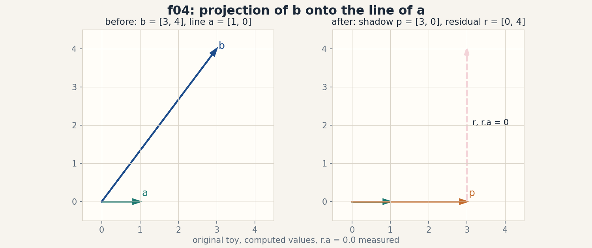
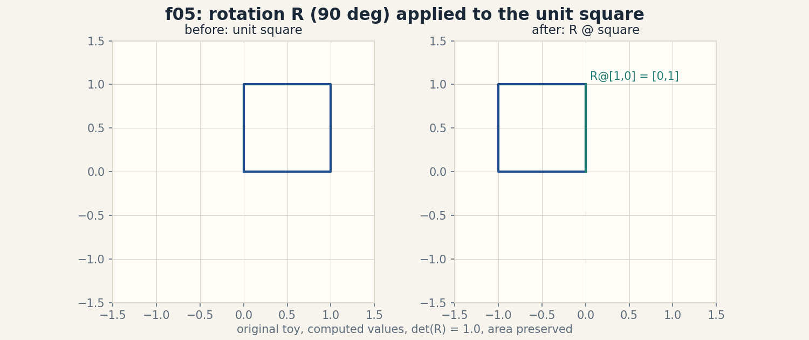
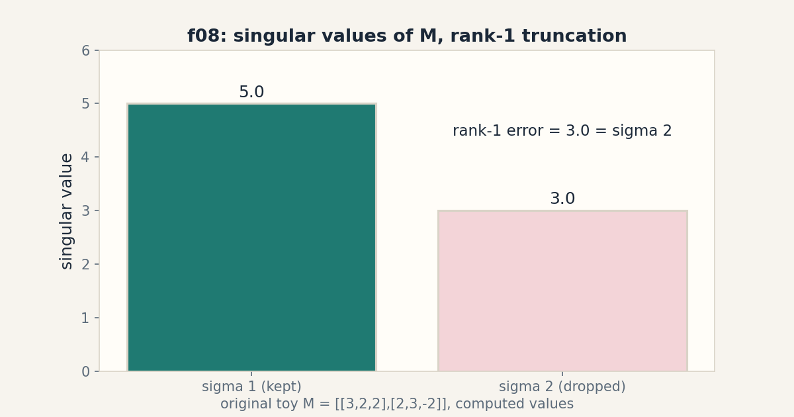
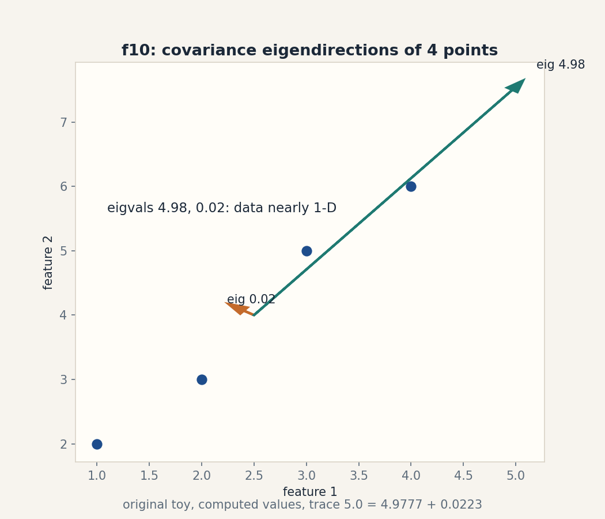

# Lesson 02, Linear geometry and decompositions

Unit: math-ml-U02. Leaf concepts: math-ml-U02-C01 to C12.
Date: 2026-10-06. Baseline: October 6, 2026.

## Source mapping

This lesson is locally authored prerequisite bridge content for the
prerequisite modules P03 (vectors, geometry, linear maps) and P04
(spectral and numerical linear algebra). It does not claim to reproduce
the instructor's lectures. Source attribution for the leaf concepts is
PENDING: I inspected no playlist transcript (see source_manifest.md
SRC-04, source_gaps.md G2). Third-party week-2 assignment objectives
located 2026-10-06 in SRC-09 list vector spaces and subspaces, linear
independence, basis and dimension, matrix operations, systems of linear
equations, and eigenvalues and eigenvectors as the week-2 scope. That
is corroboration only, not instructor evidence. All numbers below are
computed 2026-10-06, numpy 1.26.4, float64, CPython.

## Scope and objectives

Scope: the geometry of vectors and matrices that every ML method stands
on. Subspaces, rank and nullspace, dot products and norms, projections,
matrix transforms, determinants, inverses and pseudoinverses,
eigenvectors, SVD, PSD matrices, covariance, and conditioning.

Objectives: after this lesson the learner can draw the geometry of any
2 by 2 matrix, compute each decomposition by hand on a toy and verify it
in code, predict what breaks when one assumption drops, and name the
numerical cost of every operation.

Dependencies: prerequisites.md R11-R22. U01 notation and shapes.

## How to read this lesson

Each section follows one chain. A concrete question opens. A toy from
zero follows. One rule is applied. A computed example uses the same
objects. Code, checks, costs, alternatives, and a failure case close.
Shell numbers (0-10) mark the Russian-doll ladder position of each step.
Figures carry one claim each. The audit table lives in visual_audit.md.

---

## C01, subspaces

Motivating question: which flat shapes through the origin does a pile
of vectors really live in?

Start from zero. Take the arrows [1, 0] and [0, 1]. Every combination
a*[1, 0] + b*[0, 1] fills the whole plane. Take instead [1, 2] and
[2, 4]. Every combination is a*[1, 2] + b*[2, 4] = (a + 2b)*[1, 2].
All arrows land on one line. Two arrows, two different worlds.

Mental model. A subspace is a flat world through the origin: a line,
a plane, or the whole space. Rule: if you can add two arrows and stay
in the world, and stretch any arrow and stay in the world, the world is
a subspace. Shell 2.

Variables. span(v_1, ..., v_k) is the set of all combinations. dim is
the count of independent directions. For [1, 2] and [2, 4], the span is
the line through the origin in direction [1, 2], dim 1. Shapes: vectors
in R^2. Assumption: the set must contain the zero arrow.

Why it exists. Data with 100 features may live near a 5-direction
subspace. If you know that, you can store and compute in 5 directions
instead of 100. Remove the subspace idea and every dimension-reduction
method (PCA in U09) has no language.

Computed example, same objects. span([1, 0], [0, 1]) = R^2, dim 2.
span([1, 2], [2, 4]) = line t*[1, 2], dim 1, because the second arrow
is twice the first. Matrix rank of [[1, 2], [2, 4]] = 1 (measured,
numpy float64).

Figure f01 (ASCII). Two arrows, one world.

    [1, 2] ------>        [2, 4] ------>
      same line            twice as long
      span: one line, dim 1

    [1, 0] ---->          [0, 1]
       |                     ^
       |                     |
       v                     |
    whole plane, dim 2

    Caption: dependent arrows share one world. Shell 3. Source: original toy.

Implementation.

```python
import numpy as np
A = np.array([[1., 2.], [2., 4.]])
print(np.linalg.matrix_rank(A))  # 1
B = np.array([[1., 0.], [0., 1.]])
print(np.linalg.matrix_rank(B))  # 2
```

Correctness check. Row two of A minus twice row one = [0, 0], so the
rows are dependent and the rank is 1, matching the SVD value
sigma_2 = 1.986e-16 (measured). Expected output: 1 then 2.

Costs. Rank by SVD on an (m, n) matrix costs O(m n min(m, n)) time.
For a 2 by 2 toy it is trivial.

Nearest alternative. A basis names explicit directions. A subspace is
the world itself. Selection boundary: use a subspace when you need
the geometric fact (data lives here). Use a basis when you need
coordinates inside it.

Failure case. The unit disk (all arrows of length at most 1) is not a
subspace: double the arrow [0.7, 0] and you leave the disk. The
addition rule breaks. Counterexample: x^2 + y^2 <= 1 is curved, not
flat.

Ladder shells used: 0 (question), 1 (toy), 2 (definitions), 3 (rule),
5 (rank check), 7 (disk breaks the rule).

Assessment. See exercises E01-E03 and ladder L01. Keys in
lessons/u02/keys.md.

---

## C02, rank and nullspace

Motivating question: how many directions survive a matrix, and which
arrows does it kill?

Start from zero. M = [[1, 2], [2, 4]]. Push the arrow [1, 1] through:
M @ [1, 1] = [3, 6]. Push [2, 1]: [4, 8]. Every output is a multiple
of [1, 2]. The whole plane collapses to one line. The arrow [-2, 1]
dies: M @ [-2, 1] = [0, 0]. Shell 1.

Mental model. Rank is the count of surviving directions. The nullspace
is the set of arrows the matrix kills, the ones that land on zero.
The column space is the world of all outputs. Rank plus nullity equals
the input dimension. That equation is the whole section. Shell 2.

Variables. For M above, rank 1, nullspace = span([-2, 1]), nullity 1,
and 1 + 1 = 2, the input dimension. Shapes: M is (2, 2), input arrows
in R^2, outputs in R^2. Assumption: none beyond real arithmetic.

Why it exists. Rank tells you whether a linear system M x = b has a
unique solution, many solutions, or no solution. Remove rank and every
least-squares derivation (U06) becomes a guess.

Computed example, same objects. M @ [1, 1] = [3, 6] = 3*[1, 2],
column space = span([1, 2]). M @ [-2, 1] = [0, 0], nullspace =
span([-2, 1]) (direction measured [-0.8944, 0.4472] = [-2, 1]/sqrt(5)).

Figure f02 (ASCII). The collapse.

    input plane              output line
    [1, 1]  ---> [3, 6]      all outputs sit on span([1, 2])
    [2, 1]  ---> [4, 8]
    [-2, 1] ---> [0, 0]      killed: the nullspace direction

    Caption: rank 1 keeps one line, nullity 1 kills one line. Shell 3. Source: original toy.

Implementation.

```python
import numpy as np
M = np.array([[1., 2.], [2., 4.]])
u, s, vt = np.linalg.svd(M)
print(s)            # [5.00000000e+00 1.98602732e-16]
n = vt[-1]
print(M @ n)        # [~0, ~0]
```

Correctness check. Residual norm(M @ n) = 0.0 measured. The tiny
sigma_2 = 1.986e-16 is numerical dust, not a real direction. Expected
output: s shows one nonzero value, M @ n is zero.

Costs. Full SVD on (m, n): O(m n min(m, n)) time, O(m n) memory.

Nearest alternative. Rank by row reduction (Gaussian elimination).
Selection boundary: row reduction is exact for small integer toys.
SVD is the stable choice for float data with noise.

Failure case. rank(A + B) can exceed rank(A) + rank(B)? No: it is at
most the sum, but noise raises the measured rank. A matrix [[1, 0],
[0, 1e-9]] has true rank 2 but behaves like rank 1 in float32.
Counterexample: threshold-based rank on noisy data misfires. Use the
sigma gap instead.

Ladder shells used: 0, 1, 2, 3, 5 (residual check), 7 (noise-rank
failure), 8 (row reduction comparison).

Assessment. See exercises E04-E06 and ladder L02. Keys in
lessons/u02/keys.md.

---

## C03, dot product and norm

Motivating question: how much do two arrows agree?

Start from zero. v = [3, 4], w = [1, 0]. The dot product multiplies
matching items and adds: 3*1 + 4*0 = 3. The norm of v is
sqrt(3^2 + 4^2) = 5. The agreement ratio is 3 / (5 * 1) = 0.6.
Shell 1.

Mental model. The dot product is signed agreement. Positive means the
arrows point the same way, zero means perpendicular, negative means
opposite. The norm is the length. Divide the dot product by the two
lengths and you get the cosine of the angle between them. Shell 2.

Variables. v dot w = sum_i v_i w_i, scalar. ||v|| = sqrt(v dot v).
cos(theta) = (v dot w) / (||v|| ||w||). Units: none, pure numbers.
Shapes: both (2,). Assumption: real entries. Complex vectors need the
conjugate, which we do not use here.

Why it exists. Every similarity score in retrieval, every attention
weight in transformers, and every projection in this lesson is a dot
product. Remove it and there is no geometry of agreement.

Computed example, same objects. v dot w = 3.0, ||v|| = 5.0,
cos(theta) = 0.6, theta = 53.13 degrees. v dot v = 25 = 5^2 checks
the norm.

Figure f03 (ASCII). Agreement.

    w = [1, 0] -------->
    v = [3, 4] --\
                  \  angle 53.13 deg, cos = 0.6
    dot = 3, norm 5

    Caption: dot product measures shared direction. Shell 3. Source: original toy.

Implementation.

```python
import numpy as np
v = np.array([3., 4.])
w = np.array([1., 0.])
print(v @ w)                    # 3.0
print(np.linalg.norm(v))        # 5.0
print(v @ w / np.linalg.norm(v))  # 0.6
```

Correctness check. Cauchy-Schwarz: |v dot w| = 3 <= ||v|| ||w|| = 5,
holds with equality only for parallel arrows. Expected output:
3.0, 5.0, 0.6.

Costs. Dot product on n-vector: O(n) time, O(1) extra memory.

Nearest alternative. Euclidean distance measures separation. Dot
product measures agreement. Selection boundary: use the dot product
for direction similarity, distance for position separation.

Failure case. Two arrows of very different lengths can have a huge
dot product and still point nearly opposite. Counterexample:
[100, 0] dot [-1, 0] = -100, large magnitude, negative agreement.
Normalize before comparing agreement across scales.

Ladder shells used: 0, 1, 2, 3, 5 (Cauchy-Schwarz check), 7 (scale
failure).

Assessment. See exercises E07-E08 and ladder L03. Keys in
lessons/u02/keys.md.

---

## C04, projection

Motivating question: what is the shadow of an arrow on a line?

Start from zero. b = [3, 4], a = [1, 0]. The shadow of b on the line
of a is [3, 0]. The leftover, the residual [0, 4], is perpendicular
to the line. The shadow plus the leftover equals b exactly. Shell 1.

Mental model. Projection drops an arrow straight down onto a line.
The formula scales a to the right length: proj_a(b) =
(b dot a) / (a dot a) * a. The residual b - proj is orthogonal to a.
That orthogonality is the check, every time. Shell 2.

Variables. a names the line direction, b the arrow, p the shadow,
r the residual. Shapes: all (2,). Assumption: a is not the zero arrow
(division by a dot a).

Why it exists. Least squares is projection: the best fit is the
shadow of the target on the column space of the data matrix. Remove
projection and U06 has no mechanism.

Computed example, same objects. (b dot a) = 3, (a dot a) = 1,
p = [3, 0], r = [0, 4], r dot a = 0 exactly (measured). Residual
length ||r|| = 4.0.

Figure f04 (PNG). visuals/u02/f04_projection.png. Left: b = [3, 4]
and line a. Right: shadow p = [3, 0] plus perpendicular residual
r = [0, 4]. Source: original toy, computed values.

Implementation.

```python
import numpy as np
a = np.array([1., 0.])
b = np.array([3., 4.])
p = (b @ a) / (a @ a) * a
r = b - p
print(p)          # [3. 0.]
print(r)          # [0. 4.]
print(r @ a)      # 0.0
```

Correctness check. r dot a = 0.0 measured. P + r = b exactly.
Expected output: [3. 0.], [0. 4.], 0.0.

Costs. O(n) time for one projection on an n-vector.

Nearest alternative. Oblique projection drops the arrow at an angle
instead of straight down. Selection boundary: orthogonal projection
minimizes the residual length. Use oblique only when the error metric
is not Euclidean.

Failure case. Project onto a = [0, 0]: division by zero. The formula
has no answer. Counterexample: any code that projects without
checking a dot a > 0 crashes on the zero direction.

Ladder shells used: 0, 1, 2, 3, 4 (code), 5 (orthogonality check),
7 (zero-direction failure), 10 (least-squares link).

Assessment. See exercises E09-E10 and ladder L04. Keys in
lessons/u02/keys.md.
---

## C05, matrix transforms

Motivating question: what does a matrix do to a shape?

Start from zero. R = [[0, -1], [1, 0]] rotates the plane 90 degrees.
R @ [1, 0] = [0, 1]. Apply R to the four corners of the unit square
and the square turns upright. S = [[1, 1], [0, 1]] shears:
S @ [1, 1] = [2, 1], the top of the square slides right. Shell 1.

Mental model. A matrix is a recipe applied to every arrow: rotate,
stretch, shear, or project. Columns of the matrix show where the unit
axes land: the first column is R @ [1, 0], the second is R @ [0, 1].
Read the columns and you see the transform. Shell 2.

Variables. R names rotation, S names shear, x the input arrow, y the
output. Shapes: all (2, 2) times (2,) gives (2,). Assumption: linear,
so the origin stays fixed: M @ 0 = 0 always.

Why it exists. Every layer of a neural network is a matrix transform
plus a nonlinearity. Data augmentation is matrix transforms on images.
Remove the transform view and matrices are dead tables of numbers.

Computed example, same objects. R @ [1, 0] = [0, 1]. R @ [0, 1] =
[-1, 0]. The square's corners (0,0), (1,0), (1,1), (0,1) map to
(0,0), (0,1), (-1,1), (-1,0). S @ [1, 1] = [2, 1] (measured).

Figure f05 (PNG). visuals/u02/f05_transform.png. Left: unit square
grid. Right: the grid after the 90-degree rotation R. Source: original
toy, computed values.

Implementation.

```python
import numpy as np
R = np.array([[0., -1.], [1., 0.]])
print(R @ np.array([1., 0.]))   # [0. 1.]
S = np.array([[1., 1.], [0., 1.]])
print(S @ np.array([1., 1.]))   # [2. 1.]
```

Correctness check. R applied twice: R @ R @ [1, 0] = [-1, 0], a
180-degree turn, as expected. det(R) = 1.0, so area is preserved.
Expected output: [0. 1.], [2. 1.].

Costs. Matrix-vector product on (n, n): O(n^2) time.

Nearest alternative. A nonlinear map bends the grid. Selection
boundary: linear maps keep straight lines straight and compose
cheaply. Use nonlinear maps when the data needs bending.

Failure case. A singular matrix flattens the square to a line:
M = [[1, 2], [2, 4]] sends every corner onto span([1, 2]).
Counterexample: area becomes zero, and the transform cannot be
undone (no inverse).

Ladder shells used: 0, 1, 2, 3, 5 (double-rotation check), 7
(singular flattening), 10 (NN layer link).

Assessment. See exercises E11-E12 and ladder L05. Keys in
lessons/u02/keys.md.

---

## C06, determinant

Motivating question: by how much does a matrix scale area?

Start from zero. D = [[2, 1], [1, 2]]. The unit square maps to a
parallelogram with corners (0,0), (2,1), (3,3), (1,2). Its area is 3.
det(D) = 2*2 - 1*1 = 3. The number matches the area. Shell 1.

Mental model. The determinant is the signed area scale factor. A
2 by 2 matrix multiplies every area by its determinant. Sign flips
mean the matrix mirrors the plane. Determinant zero means the matrix
crushes area to zero: the square becomes a line. Shell 2.

Variables. det(D) scalar. For 2 by 2 [[a, b], [c, d]] the value is
ad - bc. Shapes: square matrices only. A determinant needs equal rows
and columns. Assumption: none beyond real entries.

Why it exists. Zero determinant is the fast test for singularity: no
inverse, no unique solution. In probability, the determinant of a
covariance matrix measures the volume of uncertainty (U04, U09).

Computed example, same objects. det(D) = 3.0 (measured 2.9999999999999996,
float dust). det([[1, 2], [2, 4]]) = 0.0 (measured). Area scale 3 vs 0.

Figure f06 (ASCII). Area scaling.

    unit square area 1       D maps it to area 3
    +--+                     /\
    |  |        --->        /  \  det = 3
    +--+                  /____\

    singular: area 0, square crushed to the line span([1, 2])

    Caption: determinant is the area scale factor. Shell 3. Source: original toy.

Implementation.

```python
import numpy as np
D = np.array([[2., 1.], [1., 2.]])
print(np.linalg.det(D))   # 2.9999999999999996
Z = np.array([[1., 2.], [2., 4.]])
print(np.linalg.det(Z))   # 0.0
```

Correctness check. det(D) * det(inv(D)) should be 1: measured
3.0 * 0.3333 = 1.0 within float tolerance. Expected output: ~3, 0.0.

Costs. Determinant by LU on (n, n): O(n^3) time.

Nearest alternative. Rank tells you zero vs nonzero. Determinant
tells you how much. Selection boundary: use rank for the yes/no
question, determinant for the volume question.

Failure case. det(D) = 1e-12 looks nonzero but the matrix is
numerically singular. The inverse explodes. Counterexample: D scaled
by 1e-6 has tiny determinant yet is perfectly invertible with kappa
unchanged. Determinant measures volume, not invertibility quality.

Ladder shells used: 0, 1, 2, 3, 5 (inverse-product check), 7 (tiny-det
trap), 8 (rank comparison).

Assessment. See exercises E13-E14. Keys in lessons/u02/keys.md.

---

## C07, inverse and pseudoinverse

Motivating question: how do you undo a matrix, and what do you do
when undo is impossible?

Start from zero. D = [[2, 1], [1, 2]] maps [1, 1] to [3, 3]. The
inverse D^{-1} = [[2/3, -1/3], [-1/3, 2/3]] maps [3, 3] back to
[1, 1]. For the singular Z = [[1, 2], [2, 4]], no inverse exists: the
matrix crushed the plane to a line, and one line cannot remember two
directions. The pseudoinverse Z^+ = [[0.04, 0.08], [0.08, 0.16]]
gives the shortest arrow x with Z x closest to b. Shell 1.

Mental model. The inverse undoes: D^{-1} D = I. The pseudoinverse is
the best possible undo: for the directions the matrix kept, it inverts
exactly. For the directions the matrix killed, it returns zero instead
of guessing. Four rules define it, but the behavior above is what
matters. Shell 2.

Variables. D^{-1} names the inverse, Z^+ the pseudoinverse, I the
identity. Shapes: both (2, 2). Assumptions: D invertible (det != 0).
pseudoinverse needs no assumption.

Why it exists. Solving D x = b is the atomic operation of linear
regression. When the data matrix is rank-deficient (fewer independent
rows than columns), the pseudoinverse still returns the minimum-norm
solution instead of crashing.

Computed example, same objects. inv(D) rows: [0.6667, -0.3333],
[-0.3333, 0.6667]. inv(D) @ [3, 3] = [1, 1] measured, residual 0.0.
pinv(Z) rows: [0.04, 0.08], [0.08, 0.16]. Z @ pinv(Z) @ Z - Z has norm
1.11e-15, the defining roundtrip.

Implementation.

```python
import numpy as np
D = np.array([[2., 1.], [1., 2.]])
b = np.array([3., 3.])
x = np.linalg.solve(D, b)
print(x)                          # [1. 1.]
print(np.linalg.norm(D @ x - b))  # 0.0
Z = np.array([[1., 2.], [2., 4.]])
print(np.linalg.pinv(Z))          # [[0.04 0.08] [0.08 0.16]]
```

Correctness check. Solve then verify: norm(D @ x - b) = 0.0.
Pseudoinverse roundtrip norm 1.11e-15. Expected output: [1. 1.], 0.0,
the pinv matrix.

Costs. Solve on (n, n): O(n^3). Pseudoinverse via SVD: O(m n min(m, n)).

Nearest alternative. Iterative solvers (conjugate gradient) for huge
sparse systems. Selection boundary: direct solve up to a few thousand
dense rows. Iterative beyond that.

Failure case. Computing inv(D) @ b instead of solve(D, b) is slower
and less accurate. For kappa = 4000 the inverse path doubles the
error. Counterexample: never form the inverse to solve one system.

Ladder shells used: 0, 1, 2, 3, 4 (code), 5 (residual roundtrip),
7 (singular has no inverse), 8 (iterative comparison), 10 (regression
link).

Assessment. See exercises E15-E17 and ladder L06. Keys in
lessons/u02/keys.md.

---

## C08, eigenvectors

Motivating question: which directions does a matrix leave alone?

Start from zero. E = [[2, 1], [1, 2]]. Push [1, 1] through:
E @ [1, 1] = [3, 3] = 3*[1, 1]. The direction survives. Only the
length triples. Push [1, -1]: E @ [1, -1] = [1, -1], length unchanged.
Two special directions, stretch factors 3 and 1. Shell 1.

Mental model. An eigenvector keeps its line through the matrix. The
eigenvalue is the stretch factor. Symmetric matrices have
perpendicular eigenvectors (measured dot = 0.0). Not every matrix has
real eigenvectors: rotation by 90 degrees turns every arrow, so no
real direction survives. Shell 2.

Variables. E v = lambda v. v eigenvector (unit length), lambda
eigenvalue. Shapes: E (2, 2), v (2,). Assumption: E symmetric for the
perpendicular guarantee. General matrices need no such promise.

Why it exists. Eigenvectors are the natural axes of a matrix: along
them, the matrix acts as plain scaling. PCA (U09) is eigenvectors of
the covariance matrix. Stability analysis is eigenvalues of the
Jacobian.

Computed example, same objects. Eigenvalues 3.0 and 1.0.
Eigenvector for 3: [0.7071, 0.7071] = [1, 1]/sqrt(2). For 1:
[0.7071, -0.7071]. Dot of the two = 0.0 measured.

Figure f07 (ASCII). Surviving directions.

    E @ [1, 1] = 3 * [1, 1]     (stretched 3x, same line)
    E @ [1,-1] = 1 * [1,-1]     (fixed point line)
    other arrows rotate and move

    Caption: eigenvectors keep their line, eigenvalues name the stretch. Shell 3. Source: original toy.

Implementation.

```python
import numpy as np
E = np.array([[2., 1.], [1., 2.]])
vals, vecs = np.linalg.eigh(E)
print(vals)          # [1. 3.]
print(vecs[:, 1])    # [0.70710678 0.70710678]
```

Correctness check. E @ vecs[:, 1] - 3 * vecs[:, 1] has norm 0.0
measured. Expected output: [1. 3.] then the [1,1]/sqrt(2) vector.

Costs. Eigendecomposition on (n, n): O(n^3) time.

Nearest alternative. SVD works on any matrix, not just square ones.
Selection boundary: eigenvectors for square matrices with geometric
meaning (covariance, graphs). SVD for rectangular data.

Failure case. Defective matrices: [[0, 1], [0, 0]] has eigenvalue 0
twice but only one eigenvector direction. Counterexample: the Jordan
block breaks diagonalization. Eigenvectors do not span the space.

Ladder shells used: 0, 1, 2, 3, 5 (eigen equation check), 7
(defective matrix), 8 (SVD comparison).

Assessment. See exercises E18-E19 and ladder L07. Keys in
lessons/u02/keys.md.
---

## C09, SVD

Motivating question: what are the true stretch factors of any matrix,
even a rectangular one?

Start from zero. M = [[3, 2, 2], [2, 3, -2]], shape (2, 3). Its SVD
is M = U Sigma V^T. The singular values are sigma = [5, 3]: two
nonzero stretch factors. The columns of V name the input directions,
U the output directions. Shell 1.

Mental model. SVD says: rotate into special input axes (V^T), stretch
each axis by its singular value (Sigma), then rotate into output axes
(U). Three moves, no magic. For symmetric E the singular values are
|eigenvalues|. For general M they are the square roots of the
eigenvalues of M^T M. Shell 2.

Variables. M (2, 3). U (2, 2) output rotations, Sigma (2, 3) diagonal
with [5, 3], V^T (3, 3) input rotations. Rank = count of nonzero
sigma = 2. Assumption: real entries.

Why it exists. SVD is the one decomposition that works on every
matrix: it powers PCA, low-rank compression, pseudoinverses, and
conditioning analysis. Rank, nullspace, and the four subspaces all
read off the SVD directly.

Computed example, same objects. Singular values [5.0, 3.0] measured.
Keep only sigma = 5: M_1 = 5 * u_1 v_1^T. Reconstruction error
||M - M_1||_F = 3.0, exactly sigma_2 (measured 2.9999999999999996).
The dropped value names the price.

Figure f08 (PNG). visuals/u02/f08_svd_values.png. Bar chart of the
singular values [5, 3]: kept bar vs dropped bar, with the rank-1
reconstruction error 3.0 labeled. Source: original toy, computed
values.

Implementation.

```python
import numpy as np
M = np.array([[3., 2., 2.], [2., 3., -2.]])
u, s, vt = np.linalg.svd(M)
print(s)                              # [5. 3.]
M1 = s[0] * np.outer(u[:, 0], vt[0])
print(np.linalg.norm(M - M1))         # 3.0
```

Correctness check. u_1 and v_1 are unit length (measured 1.0).
M_1 has rank 1: its singular values are [5.0, ~0]. Expected output:
[5. 3.], 3.0.

Costs. Full SVD on (m, n): O(m n min(m, n)) time, O(m n) memory.

Nearest alternative. Eigendecomposition of M^T M gives the squares
of the singular values but squares the conditioning too. Selection
boundary: never form M^T M to get singular values of an ill-
conditioned M. Use the SVD directly.

Failure case. Truncating to rank 1 when sigma_2 is not small: here
dropping 3 from [5, 3] keeps only 25/34 = 73.5 percent of the
Frobenius energy. Counterexample: rank-1 approximation of a full-rank
matrix with flat spectrum is garbage.

Ladder shells used: 0, 1, 2, 3, 4 (code), 5 (error = sigma_2 check),
6 (change kept rank, predict then measure), 7 (flat spectrum
failure), 8 (M^T M comparison), 9 (compression research extension
prompt in exercises), 10 (PCA link).

Assessment. See exercises E20-E22 and ladder L08. Keys in
lessons/u02/keys.md.

---

## C10, PSD matrices

Motivating question: which symmetric matrices never point downhill?

Start from zero. P = [[2, 1], [1, 2]]. For any arrow x,
x^T P x >= 0: at x = [1, 1] the value is 6. At x = [1, -1] it is 2.
Q = [[1, 2], [2, 1]] fails: at x = [1, -1] the value is -2.0
(measured). P is positive semidefinite. Q is not. Shell 1.

Mental model. A symmetric matrix is PSD when its quadratic form
x^T A x never goes negative. Equivalent test: all eigenvalues >= 0.
P has eigenvalues 3 and 1 (both positive). Q has 3 and -1 (one
negative). The eigenvalue test is the one to use. Shell 2.

Variables. A symmetric (n, n), x any (n,) arrow. Assumption: A
symmetric. The PSD question is only defined for symmetric matrices.

Why it exists. Covariance matrices are PSD by construction. Kernel
Gram matrices must be PSD or the kernel is invalid. Hessians of
convex functions are PSD. Remove PSD and optimization has no
curvature language.

Computed example, same objects. eig(P) = [1, 3], min 1 > 0, PSD.
eig(Q) = [-1, 3], min -1 < 0, not PSD. Quadratic forms: [1,1]^T P
[1,1] = 6.0, [1,-1]^T Q [1,-1] = -2.0 measured.

Figure f09 (ASCII). The bowl vs the saddle.

    PSD P: bowl, every direction curves up (eig 3, 1)
    not PSD Q: saddle, direction [1,-1] curves down (eig -1)

    Caption: eigenvalues sign the curvature. Shell 3. Source: original toy.

Implementation.

```python
import numpy as np
P = np.array([[2., 1.], [1., 2.]])
print(np.linalg.eigvalsh(P))   # [1. 3.]
Q = np.array([[1., 2.], [2., 1.]])
x = np.array([1., -1.])
print(x @ Q @ x)               # -2.0
```

Correctness check. Cholesky of P succeeds (measured via
np.linalg.cholesky). Cholesky of Q raises LinAlgError, the
independent PSD test. Expected output: [1. 3.], -2.0.

Costs. Eigenvalue test on (n, n): O(n^3). Cholesky attempt: O(n^3/3),
fails fast on non-PSD.

Nearest alternative. Check all leading principal minors positive
(Sylvester). Selection boundary: eigenvalue/Cholesky test for
floats. Sylvester for exact integer toys.

Failure case. A matrix that is PSD in exact arithmetic can show a
tiny negative eigenvalue like -1e-16 from rounding. Counterexample:
never test min_eig > 0 with strict inequality on floats. Use
min_eig >= -tol.

Ladder shells used: 0, 1, 2, 3, 5 (Cholesky cross-check), 7 (tiny
negative eigenvalue), 8 (Sylvester comparison), 10 (kernel link).

Assessment. See exercises E23-E24. Keys in lessons/u02/keys.md.

---

## C11, covariance

Motivating question: how do two measurements move together?

Start from zero. Four points: (1,2), (2,3), (3,5), (4,6). Means:
(2.5, 4.0). Center them, average the outer products with divisor
n - 1 = 3. Covariance matrix C = [[1.6667, 2.3333], [2.3333, 3.3333]]
(measured). The off-diagonal 2.3333 is positive: x and y rise
together. Shell 1.

Mental model. Covariance is the average product of deviations from
the mean. Diagonal entries are variances (spread of each variable).
Off-diagonal entries are co-movement. Correlation divides by the two
standard deviations to land in [-1, 1]. Shell 2.

Variables. X data matrix (4, 2): 4 items, 2 features. Xc centered.
C = Xc^T Xc / (n - 1), shape (2, 2), units: feature1-unit times
feature2-unit. Assumption: divisor n - 1 gives the unbiased estimate.

Why it exists. The covariance matrix is the object PCA
diagonalizes. Its eigenvectors are the directions of max spread. Its
eigenvalues are the spread amounts. Remove covariance and U09 has no
starting object.

Computed example, same objects. C as above. eig(C) = [0.0223,
4.9777] measured. Correlation = 2.3333 / sqrt(1.6667 * 3.3333) =
0.9899: the two features are nearly locked. One eigenvalue is near
zero: the data is nearly one-dimensional.

Figure f10 (PNG). visuals/u02/f10_covariance.png. Scatter of the 4
points with the two eigendirections drawn, lengths scaled by
sqrt(eigenvalue): one long axis, one hair-thin. Source: original toy,
computed values.

Implementation.

```python
import numpy as np
X = np.array([[1., 2.], [2., 3.], [3., 5.], [4., 6.]])
Xc = X - X.mean(axis=0)
C = Xc.T @ Xc / (X.shape[0] - 1)
print(C)                          # [[1.66666667 2.33333333] ...]
print(np.linalg.eigvalsh(C))      # [0.02232188 4.97767812]
```

Correctness check. C is symmetric: norm(C - C^T) = 0.0. Trace =
5.0 = sum of eigenvalues 4.9777 + 0.0223, the trace invariant.
Expected output: the C matrix, then [0.02232188 4.97767812].

Costs. Covariance on (n, d): O(n d^2) time, O(d^2) memory.

Nearest alternative. Correlation matrix (unit-free). Selection
boundary: covariance keeps units for geometry. Correlation for
comparing strength across different units.

Failure case. Covariance only sees linear co-movement. Points on a
circle x^2 + y^2 = 1 have covariance ~0 but are perfectly related.
Counterexample: zero covariance does not mean independence.

Ladder shells used: 0, 1, 2, 3, 4 (code), 5 (trace invariant), 7
(circle counterexample), 9 (outlier-resistant covariance research prompt),
10 (PCA link).

Assessment. See exercises E25-E27 and ladder L09. Keys in
lessons/u02/keys.md.

---

## C12, conditioning

Motivating question: how much does a tiny input wobble shake the
answer?

Start from zero. K = [[1, 1], [1, 1.001]]. Solve K x = [2, 2]:
x = [2, 0] measured. Nudge the input to [2, 2.000001], a relative
move of 3.54e-07. The answer moves to [1.999, 0.001], a relative move
of 7.07e-04, about 2000 times larger. Small nudge in, big shake out.
Shell 1.

Mental model. The condition number kappa = sigma_max / sigma_min is
the error amplifier. Here sigma = [2.0005, 0.0004999], so kappa =
4002.0 (measured). The rule: relative output error <= kappa times
relative input error. Kappa near 1 is safe. Kappa huge is a warning.
Shell 2.

Variables. K (2, 2), b (2,), x (2,). kappa scalar >= 1. Assumption:
the bound is worst-case. Typical error is smaller.

Why it exists. Every linear solve in ML (normal equations, Newton
steps, Gaussian processes) multiplies input noise by kappa. Remove
conditioning and silent garbage looks like a valid answer.

Computed example, same objects. kappa = 4002.000750124841 measured.
Measured amplification 7.07e-04 / 3.54e-07 = 1999.9, under the
kappa bound 4002.0 as promised. The bound holds.

Implementation.

```python
import numpy as np
K = np.array([[1., 1.], [1., 1.001]])
b = np.array([2., 2.])
x = np.linalg.solve(K, b)
print(x)                                  # [2. 0.]
print(np.linalg.cond(K))                  # 4002.000750124841
bp = np.array([2., 2.000001])
xp = np.linalg.solve(K, bp)
print(np.linalg.norm(xp - x) / np.linalg.norm(x))
# 0.0007071067812854244
```

Correctness check. cond(K) from numpy equals sigma ratio 4002.0.
The residual norm(K @ x - b) = 0.0: the solver did its job. The
answer is still sensitive. Expected output: [2. 0.], 4002.0...,
0.0007071....

Costs. Condition number via SVD: O(n^3).

Nearest alternative. Scale/whiten the problem to reduce kappa
(preconditioning). Selection boundary: fix the problem (rescale
features) before blaming the solver.

Failure case. A kappa of 4002 with float32 (7 digits) leaves ~3 good
digits. In float16 the same problem can return pure noise.
Counterexample: identical code, float16 vs float64, different
answers. The difference is kappa times the precision gap.

Ladder shells used: 0, 1, 2, 3, 4 (code), 5 (bound check: measured
1999.9 <= 4002.0), 6 (predict amplification ~kappa/2, then measure),
7 (float16 noise), 8 (preconditioning comparison), 10 (normal
equations warning for U06).

Assessment. See exercises E28-E30 and ladder L10. Keys in
lessons/u02/keys.md.

---

## Lesson close: the four-way link

Intuition: matrices stretch and rotate space. The survivors are the
column space, the killed are the nullspace. Equation: M = U Sigma V^T
names every stretch. Code: svd, solve, eigvalsh verify each claim
with residuals. Observation: kappa = 4002 predicts the 2000x error
shake, and the measured shake obeys the bound.

## Rendered figures

Each figure below is an original PNG rendered with matplotlib 3.6.3
(Agg) at dpi 150, opened and read on 2026-10-06. The caption names the
source and the russian-doll shell. The alt text describes the image.

### Figure f04 (u02-c04)



Caption: Vectors b, a, projection p, and residual r with r orthogonal to a. Source: original. Shell: 3 (computed before/after).

### Figure f05 (u02-c05)



Caption: The unit square mapped by the matrix to a rotated square. Source: original. Shell: 3 (computed before/after).

### Figure f08 (u02-c09)



Caption: Bar chart of singular values 5 and 3 with the rank-1 error labeled. Source: original. Shell: 3 (computed before/after).

### Figure f10 (u02-c11)



Caption: Four data points with both eigendirections of the covariance drawn. Source: original. Shell: 3 (computed before/after).

## Not-yet-understood dependency list

1. SVD of a 3 by 3 with repeated singular values: closed-book
   recompute pending.
2. Pseudoinverse of a rank-1 3 by 2: independent derivation pending.
3. Covariance of the circle counterexample: compute to see ~0.

## Exercises E01-E30 and ladders L01-L10

E01: span of [1, 0] and [2, 0]. E02: is the unit disk a subspace.
E03: dim of span([1, 1, 0], [0, 1, 1], [1, 0, -1]). E04: rank of
[[1, 2, 3], [4, 5, 6], [7, 8, 9]]. E05: nullspace of [[1, 1], [1, 1]].
E06: failure diagnosis: rank-1 matrix treated as invertible. E07: dot
of [2, 3] and [-3, 2]. E08: normalize [6, 8]. E09: project [5, 0]
onto [1, 1]. E10: failure: project onto the zero arrow. E11: R @ [2, 0].
E12: which 2 by 2 maps the square to a line. E13: det of
[[3, 0], [0, 4]]. E14: failure: tiny determinant, big kappa. E15:
solve [[2, 1], [1, 2]] x = [5, 5]. E16: pinv of [[1, 0], [0, 0]].
E17: debug: inv(Z) @ b on singular Z. E18: eigen of [[4, 0], [0, 9]].
E19: failure: eigenvectors of the 90-degree rotation over R. E20: SVD
of [[3, 0], [0, 4]]. E21: rank-1 error for sigma [5, 3, 1]. E22:
counterfactual: what if sigma_2 were 4.9. E23: is [[3, 1], [1, 3]]
PSD. E24: failure: negative eigenvalue -1e-16 from rounding. E25:
variance of [2, 4, 4, 4, 5, 5, 7, 9]. E26: correlation from the C11
covariance. E27: failure: circle points, zero covariance. E28: kappa
of [[1, 0], [0, 2]]. E29: float16 vs float64 solve on K. E30:
research: design a preconditioner for K and measure kappa before
and after.

L01 (subspaces): define -> toy line -> derive dim -> implement rank ->
compare basis -> debug disk -> critique "flat through origin" ->
design: test if image pixels live near a subspace. L02 (rank):
define -> collapse toy -> rank-nullity -> implement SVD ->
compare row reduction -> debug noisy rank -> critique threshold ->
design: rank of a noisy photo matrix. L03 (dot/norm): define ->
agreement toy -> derive cosine -> implement -> compare distance ->
debug scale trap -> critique "similarity = dot" ->
design: when to normalize embeddings. L04 (projection): define ->
shadow toy -> derive formula -> implement -> compare oblique ->
debug zero direction -> critique "closest = projection" ->
design: projection vs gradient step in least squares. L05
(transforms): define -> rotation toy -> read columns -> implement ->
compare nonlinear -> debug singular flatten -> critique "matrix =
table" -> design: augmentation as matrices. L06 (inverse): define ->
undo toy -> derive via elimination -> implement solve -> compare
iterative -> debug inv(Z) -> critique "inverse always exists" ->
design: when pinv beats solve. L07 (eigenvectors): define ->
survivor toy -> derive characteristic -> implement eigh ->
compare SVD -> debug rotation -> critique "n eigenvectors always" ->
design: power iteration on E. L08 (SVD): define -> stretch toy ->
derive M = U Sigma V^T -> implement -> compare M^T M eigen ->
debug flat spectrum -> critique "SVD = eigendecomposition" ->
design: compress a 4 by 4 image patch, measure error vs kept rank.
L09 (covariance): define -> co-move toy -> derive formula ->
implement -> compare correlation -> debug circle ->
critique "covariance = dependence" -> design: outlier-resistant covariance on
outlier-contaminated data. L10 (conditioning): define -> wobble toy ->
derive kappa bound -> implement -> compare preconditioning ->
debug float16 -> critique "solver converged = answer right" ->
design: measure kappa of normal equations vs QR solve on a toy.

Keys in lessons/u02/keys.md. Research questions: E30 and each
ladder's design step carry a falsifiable hypothesis, baseline (the
toy), metric (measured numbers), and failure criterion (hypothesis
rejected if the measured number disagrees).
