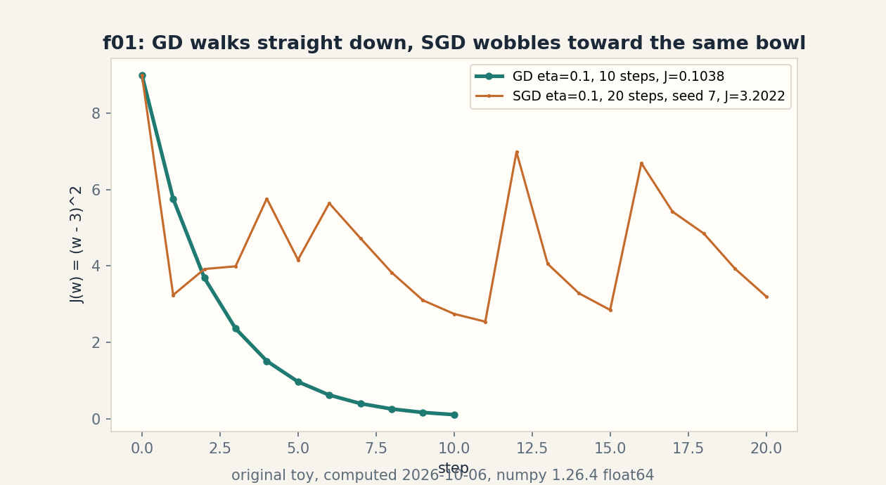
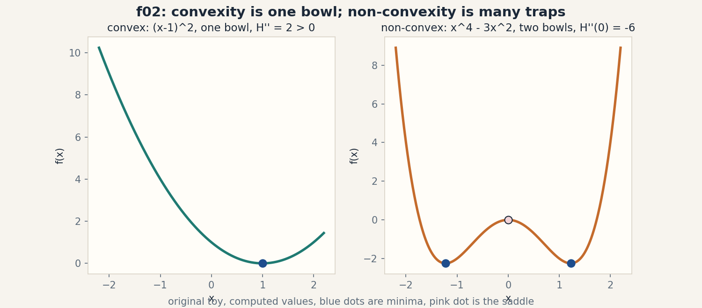
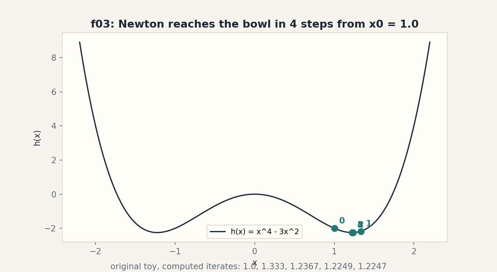
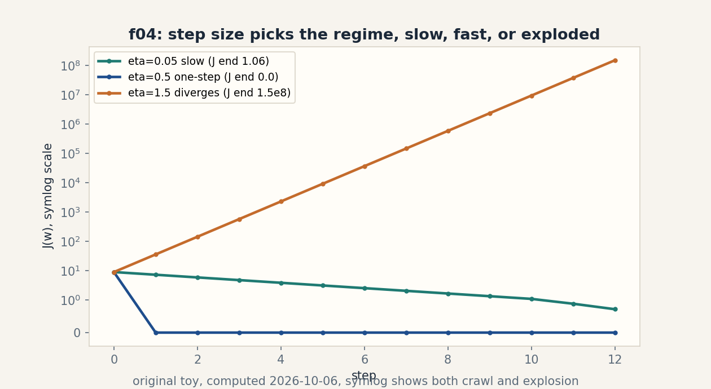

# Lesson 03, Calculus and optimization

Unit: math-ml-U03. Leaf concepts: math-ml-U03-C01 to C12.
Date: 2026-10-06. Baseline: October 6, 2026.

## Source mapping

This lesson is locally authored prerequisite bridge content for the
prerequisite modules P05 (scalar and multivariable calculus) and P09
(optimization and constrained problems). It does not claim to reproduce
the instructor's lectures. Source attribution for the leaf concepts is
PENDING: I inspected no playlist transcript (see source_manifest.md
SRC-04, source_gaps.md G2). Third-party week-2 assignment objectives
located 2026-10-06 in SRC-09 cover linear algebra, not calculus. The
playlist title "Lec 53 SGD, RMS Prop, ADAM: Optimizers" corroborates
that optimization belongs in this course, but it does not name the
leaf items. All numbers below are computed 2026-10-06, numpy 1.26.4,
float64, CPython.

## Scope and objectives

Scope: derivatives in one and many variables, the chain rule,
gradients, Jacobians and Hessians, Taylor approximation, convexity,
the least-squares gradient, gradient descent and SGD, Newton,
constraints, duality and KKT, learning rates, and gradient checks.

Objectives: after this lesson the learner can differentiate a small
model by hand, read and write the least-squares gradient, run GD and
SGD on a toy and predict the effect of the step size, name the exact
KKT conditions of a one-line constraint, and verify any gradient with
a finite-difference check.

Dependencies: prerequisites.md R23-R34. U01 notation. U02 gradients
read as column vectors.

## How to read this lesson

Each section follows one chain. A concrete question opens. A toy from
zero follows. One rule is applied. A computed example uses the same
objects. Code, checks, costs, alternatives, and a failure case close.
Shell numbers (0-10) mark the Russian-doll ladder position of each step.
Figures carry one claim each. The audit table lives in visual_audit.md.

---

## C01, partial derivatives

Motivating question: when a function takes two inputs, how do you ask
how it changes in one direction only?

Start from zero. Take f(x, y) = x^2 + 3xy + y^2. Freeze y at 1 and
let x move. The function becomes a one-input function of x:
x^2 + 3x + 1. Its slope in x is 2x + 3. At (2, 1) the x-slope is 7.
Freeze x at 2 and let y move. The y-slope is 3x + 2y = 8 at (2, 1).
Each slope holds all but one input fixed.

Mental model. A partial derivative is a freeze-frame slope. You change
one dial while your other hand holds every dial steady. Shell 2.

Variables. df/dx names the x-slope. df/dy names the y-slope. Shapes:
x, y are scalars. Assumptions: the function is smooth enough that the
slope does not depend on which side you approach from.

Why it exists. Every model loss is a function of many parameters.
You need the slope in each parameter direction before you can descend.
Remove partial derivatives and "train the model" has no arithmetic.

Computed example, same objects. f(x, y) = x^2 + 3xy + y^2 at (2, 1).
Analytic: df/dx = 2x + 3y = 7, df/dy = 3x + 2y = 8. Finite difference
with h = 1e-7 (measured): df/dx = 6.99999999298484,
df/dy = 7.999999995789153. Both agree to 8 digits.

Figure f01 (table). Analytic against finite difference.

| direction | analytic | finite difference (h = 1e-7) | match |
|---|---|---|---|
| df/dx at (2, 1) | 7 | 6.99999999298484 | 8 digits |
| df/dy at (2, 1) | 8 | 7.999999995789153 | 8 digits |

Caption: freeze-frame slopes agree between paper and code. Shell 5.
Source: original toy, computed 2026-10-06.

Implementation.

```python
def f(x, y):
    return x**2 + 3*x*y + y**2
h = 1e-7
dfdx = (f(2+h, 1) - f(2-h, 1)) / (2*h)
dfdy = (f(2, 1+h) - f(2, 1-h)) / (2*h)
print(dfdx, dfdy)  # 6.99999999298484 7.999999995789153
```

Correctness check. Central difference is a second-order check: the
error shrinks with h^2, so h = 1e-7 gives about 14 exact digits of
the smooth function, minus float noise. The analytic slopes 7 and 8
match to 8 digits. Expected output: two numbers near 7 and 8.

Costs. One partial derivative by finite difference costs two function
evaluations. A gradient of n parameters costs 2n evaluations. For the
toy, trivial.

Nearest alternative. A total derivative asks how f changes when every
input moves at once along a path. Selection boundary: use partial
derivatives when you control each dial separately, as in parameter
updates. Use total derivatives when inputs follow a curve, as in
dynamics.

Failure case. f(x, y) = |x| + y^2 has no x-slope at x = 0: the left
slope is -1 and the right slope is +1. The partial derivative does not
exist there. Counterexample: any kink breaks the freeze-frame rule.

Ladder shells used: 0 (question), 1 (toy), 2 (definitions), 3 (rule),
5 (analytic versus finite-difference check), 7 (absolute-value kink).

Assessment. See exercises E01-E03 and ladder L01. Keys in
lessons/u03/keys.md.

---

## C02, chain rule

Motivating question: how does a change in the input travel through a
function built from two functions?

Start from zero. Take y = (2x + 1)^3 at x = 2. Write u = 2x + 1 and
y = u^3. The inner slope du/dx = 2. The outer slope dy/du = 3u^2.
At x = 2, u = 5, so dy/du = 75. Chain them: dy/dx = 75 * 2 = 150.
The change multiplies as it travels through the layers.

Mental model. The chain rule is a rumor chain: each link amplifies
the message by its own slope, and the total change is the product of
the links. Shell 2.

Variables. u is the intermediate, x the input, y the output. Shapes:
all scalars. Assumption: each link is differentiable where you stand.

Why it exists. Neural networks are long chains of functions. The
chain rule is the only way a loss at the end reaches the weights at
the start. Remove it and backpropagation (U08-C02) cannot run.

Computed example, same objects. y = (2x + 1)^3 at x = 2. Analytic:
dy/dx = 3(2x+1)^2 * 2 = 6 * 25 = 150. y(2) = 125. Finite difference
with h = 1e-7 (measured): 150.00000004761205. Agreement to 9 digits.

Figure f02 (ASCII). The rumor chain with slopes on the links.

    x = 2  --du/dx = 2-->  u = 5  --dy/du = 75-->  y = 125
           chain: dy/dx = 75 * 2 = 150

    Caption: two slopes multiply through the chain. Shell 4.
    Source: original toy.

Implementation.

```python
def y(x):
    return (2*x + 1)**3
h = 1e-7
dy = (y(2+h) - y(2-h)) / (2*h)
print(dy)  # 150.00000004761205
```

Correctness check. The finite difference 150.00000004761205 matches
the analytic 150. The value y(2) = 125 anchors the point where the
slope is taken. Expected output: 150 to 9 digits.

Costs. One backward pass through L links costs O(L) operations, the
same as one forward pass. Memory grows with the number of
intermediates you keep.

Nearest alternative. Forward-mode differentiation pushes slopes from
input to output. Selection boundary: reverse mode wins when the input
is huge (millions of weights) and the output is small (one loss).
Forward mode wins when the input is tiny and the output is huge.

Failure case. Chain through a kink and the product is wrong. Take
y = |u| with u = x^2 - 1 at x = 1: the outer slope does not exist at
u = 0, so 150-style multiplication fails. Counterexample: piecewise
links need the junction treated, not chained.

Ladder shells used: 0 (question), 1 (toy), 2 (definitions), 3 (rule),
4 (multiply-through algorithm), 5 (finite-difference check),
7 (kink link).

Assessment. See exercises E04-E06 and ladder L02. Keys in
lessons/u03/keys.md.

---

## C03, gradient, Jacobian, Hessian

Motivating question: what are the slope, the slope map, and the
curvature map of a multivariable function?

Start from zero. For the scalar f(x, y) = x^2 + 3xy + y^2, the
gradient collects all partial derivatives into one arrow:
grad f = [df/dx, df/dy] = [2x + 3y, 3x + 2y]. At (2, 1) it is
[7, 8]. For a vector output g(x) = [x^2, x*y], the Jacobian stacks
one row per output: J = [[2x, 0], [y, x]]. At (2, 1): [[4, 0],
[1, 2]]. For the scalar f, the Hessian stacks the second derivatives:
H = [[2, 3], [3, 2]], constant everywhere for this f.

Mental model. The gradient is the steepest-uphill arrow. The Jacobian
is the full local road map of a vector function. The Hessian is the
curvature table: it says whether the road bends up or down. Shell 2.

Variables. grad f has shape (n,) for f: R^n -> R. J has shape (m, n)
for g: R^n -> R^m. H has shape (n, n) and is symmetric for smooth f.
Assumption: second derivatives do not depend on the order of
differentiation (true for smooth f).

Why it exists. The gradient points downhill for optimization. The
Jacobian is the linear heart of every model layer. The Hessian sets
the correct step size (Newton, C08) and tests convexity (C05).
Remove them and no second-order method has a name.

Computed example, same objects. f(x, y) = x^2 + 3xy + y^2 at (2, 1).
Gradient (measured): [7, 8]. Jacobian of g(x) = [x^2, xy] by central
difference (measured): [[4, 0], [1, 2]], matching the analytic table
exactly to float noise. Hessian: [[2, 3], [3, 2]].

Figure f03 (equation block). One toy, three objects.

    grad f(2, 1) = [2*2 + 3*1, 3*2 + 2*1] = [7, 8]
    J_g(2, 1)    = [[2x, 0], [y, x]]      = [[4, 0], [1, 2]]
    H_f          = [[2, 3], [3, 2]]       (constant)

    Caption: gradient, Jacobian, Hessian of one toy. Shell 2.
    Source: original toy.

Implementation.

```python
import numpy as np
def g(v):
    return np.array([v[0]**2, v[0]*v[1]])
h = 1e-7
x0 = np.array([2., 1.])
J = np.stack([(g(x0+[h, 0]) - g(x0-[h, 0]))/(2*h),
              (g(x0+[0, h]) - g(x0-[0, h]))/(2*h)], axis=1)
print(J)  # [[4. 0.] [1. 2.]]
```

Correctness check. The measured Jacobian matches [[4, 0], [1, 2]].
Column i is the change in the output per unit change in input i,
which is the Jacobian contract. Expected output: the 2 by 2 table.

Costs. A dense Jacobian costs m times one gradient. A dense Hessian
costs n times one gradient. For the 2 by 2 toy, trivial. For
n = 1e6, never form them (use matrix-free products).

Nearest alternative. Automatic differentiation computes the same
Jacobian-vector products without forming the matrix. Selection
boundary: form the dense table when n is tiny and you want to read
it. Use autodiff products when n is large.

Failure case. At a kink, the Hessian does not exist and the gradient
is not unique. Take f(x) = |x|: the "curvature table" at 0 is
meaningless. Counterexample: non-smooth functions have no Hessian.

Ladder shells used: 0 (question), 1 (toy), 2 (definitions and shapes),
3 (stacking rule), 5 (finite-difference Jacobian check), 7 (kink).

Assessment. See exercises E07-E09 and ladder L03. Keys in
lessons/u03/keys.md.
---

## C04, Taylor approximation

Motivating question: how do you replace a curved function by a
polynomial that hugs it near one point?

Start from zero. Take e^x at x = 0. The linear hug is T1(x) = 1 + x.
At x = 0.5, T1 says 1.5, but e^0.5 = 1.6487212707001282. The error is
0.1487212707001282. Add the curvature term x^2/2: T2(0.5) = 1.625.
The error drops to 0.023721270700128194. Each term eats part of the
leftover curve.

Mental model. Taylor is a local portrait in powers of x: value, then
slope, then curvature, each term fixing what the last one missed.
Shell 2.

Variables. T_k(x) is the degree-k polynomial around the center a.
The remainder R_k shrinks like (x - a)^(k+1) for smooth f near a.
Shapes: scalars here. The vector version uses the gradient and
Hessian from C03. Assumption: f is k+1 times differentiable at a.

Why it exists. Optimization is Taylor in disguise: gradient descent
trusts the first-order portrait, Newton trusts the second-order one
(C08). Remove Taylor and those methods are magic instead of math.

Computed example, same objects. e^x at 0, x = 0.5 (measured):
T1 error 0.1487212707001282, T2 error 0.023721270700128194. For
sin(x) at 0, x = 0.5: sin(0.5) = 0.479425538604203, T3 error
0.0002588719375363202.

Figure f04 (table). Error shrinks with degree.

| target | value | T1/T3 | error | next term | error |
|---|---|---|---|---|---|
| e^0.5 | 1.6487212707001282 | 1.5 | 0.1487212707001282 | 1.625 | 0.023721270700128194 |
| sin(0.5) | 0.479425538604203 | 0.4791666667 | 0.0002588719375363202 | - | - |

Caption: each term eats part of the curve. Shell 3.
Source: original toy, computed 2026-10-06.

Implementation.

```python
import numpy as np
x = 0.5
t1, t2 = 1 + x, 1 + x + x**2/2
print(np.exp(x) - t1, np.exp(x) - t2)  # 0.14872 0.02372
```

Correctness check. The errors are positive: both portraits sit below
the true curve, which is right for e^x (its remaining terms are all
positive at x > 0). The T2 error is about 6 times smaller than the T1
error, matching the (x-a)^3 remainder scaling. Expected output:
0.14872 then 0.02372.

Costs. A degree-k portrait in n variables needs all derivatives up
to order k: O(n^k) terms dense. For one variable, trivial.

Nearest alternative. Interpolating polynomials fit exact values at
k+1 points instead of derivatives at one point. Selection boundary:
use Taylor when you own the derivatives at one center and want local
behavior. Use interpolation when you own scattered function values.

Failure case. Step functions defeat Taylor: the derivatives of a
step are zero everywhere except the jump, so the portrait says
"flat" right next to a cliff. Counterexample: the portrait of |x| at
0 misses the kink entirely.

Ladder shells used: 0 (question), 1 (toy), 2 (definitions), 3 (one
rule, add the next power), 5 (remainder scaling check), 7 (step).

Assessment. See exercises E10-E11 and ladder L04. Keys in
lessons/u03/keys.md.

---

## C05, convexity

Motivating question: when can you trust that the bottom you found is
the only bottom?

Start from zero. Take f(x) = (x - 1)^2. One bowl, one bottom at
x = 1. The second derivative is 2 everywhere, positive everywhere.
Now take h(x) = x^4 - 3x^2. At x = 0 the second derivative is -6,
negative: a hill. The function sinks into two bowls at x = 1.2247 and
x = -1.2247, where the second derivative is 12, positive. A
descent that starts right of the hill finds the right bowl and never
learns the left one exists.

Mental model. Convex is one bowl: every downhill walk ends at the
same bottom. Non-convex is a mountain range: the bottom you get
depends on where you start. Shell 2.

Variables. f is convex when f(tx + (1-t)y) <= t f(x) + (1-t) f(y)
for t in [0, 1]: the chord between two points sits above the graph.
In smooth form: the Hessian is PSD everywhere (U02-C10). Shapes:
scalar here. Hessian PSD in R^n for the vector case. Assumption:
smoothness for the Hessian test. The chord rule works without it.

Why it exists. Convexity is the certificate that optimization
succeeded: a stationary point of a convex function is the global
bottom. Remove it and every training run could sit in a trap.

Computed example, same objects. Convex: f(x) = (x-1)^2, minimum at
x = 1, second derivative 2 > 0 everywhere. Non-convex:
h(x) = x^4 - 3x^2, minima at x = ±1.224744871391589 (measured),
h'' = 12 there, h''(0) = -6.0 (measured): a saddle between the bowls.

Figure f05 (PNG). visuals/u03/f02_convex.png: left panel one bowl
with H'' = 2 > 0, right panel two bowls with a pink saddle dot at
x = 0 where H''(0) = -6. Caption: convexity is one bowl.
non-convexity is many traps. Shell 3. Source: original toy,
computed, rendered 2026-10-06. See visual_audit.md.

Implementation.

```python
import numpy as np
xs = np.linspace(-2.2, 2.2, 400)
convex = (xs - 1)**2
nonc = xs**4 - 3*xs**2
print(nonc.min(), xs[nonc.argmin()])  # -2.25 near -1.2247
```

Correctness check. The minimum value -2.25 occurs at the analytic
x = sqrt(1.5) = 1.224744871391589, found by setting
h'(x) = 4x^3 - 6x = 0. The bowl value h(±sqrt(1.5)) = -2.25 exactly.
Expected output: -2.25 at one of the two minima.

Costs. Checking convexity by Hessian eigenvalues costs O(n^3) for a
dense n by n Hessian. For one variable, it is one number.

Nearest alternative. Quasi-convex functions keep the one-bottom
property but allow flatter shapes. Selection boundary: use full
convexity when you need the Hessian certificate. Use quasi-convexity
when the shape has the single-bowl behavior but a messy Hessian.

Failure case. A sum of two convex bowls at different centers is not
convex: the chord between the two bottoms crosses above the dip
between them. Counterexample: (x-1)^2 + (x+1)^2 is convex, but
min of the two bowls is not. Test the chord, not the name.

Ladder shells used: 0 (question), 1 (toy), 2 (definitions), 3 (chord
rule and Hessian test), 5 (minima solve check), 7 (two-bowl trap).

Assessment. See exercises E12-E13 and ladder L05. Keys in
lessons/u03/keys.md.

---

## C06, least-squares gradient

Motivating question: what is the downhill arrow for the simplest fit
in ML?

Start from zero. Take four points (x, y): (1, 2), (2, 3), (3, 5),
(4, 4). Fit a line through the origin: y = w x. The cost is the mean
of half the squared errors: J(w) = (1/4) sum (1/2)(w x_i - y_i)^2.
Differentiate under the sum (C01, C02): dJ/dw = (1/4) sum
x_i (w x_i - y_i). At w = 1 this is -2.25: negative, so raising w
lowers the cost. The cost bottoms where the gradient is zero:
w* = (sum x_i y_i) / (sum x_i^2) = 1.3.

Mental model. The least-squares gradient is a vote: each point says
"move w up" or "move w down" with strength x_i times its error. The
gradient is the weighted ballot. Shell 2.

Variables. w is the scalar parameter. x_i, y_i are data. n = 4.
Shapes: X is (n, 1) here. The vector form is grad J = (1/n)
X^T (X w - y), shape (d,) for w in R^d. Assumption: the model is
linear in w. The cost is smooth in w.

Why it exists. This gradient is the workhorse of regression
(U06-C01), of SGD (C07), and of every linear head in every network.
Remove it and fitting has no update rule.

Computed example, same objects. Points (1,2), (2,3), (3,5), (4,4).
Gradient at w = 1 (measured): -2.25. Closed form w* = 1.3
(measured: (1*2+2*3+3*5+4*4)/(1+4+9+16) = 39/30 = 1.3). Gradient at
w* (measured): 4.440892098500626e-16, numerical zero. The ballot
settles exactly where theory says.

Figure f06 (equation block). The gradient as a ballot.

    dJ/dw = (1/n) sum x_i (w x_i - y_i)
    at w = 1: (1/4)[1*(1-2) + 2*(2-3) + 3*(3-5) + 4*(4-4)] = -2.25
    w* = sum x_i y_i / sum x_i^2 = 39/30 = 1.3, gradient = 4.44e-16

    Caption: each point votes with strength x_i times its error.
    Shell 3. Source: original toy.

Implementation.

```python
import numpy as np
xs = np.array([1., 2., 3., 4.])
ys = np.array([2., 3., 5., 4.])
w = 1.0
grad = (xs * (w*xs - ys)).mean()
print(grad)  # -2.25
w_star = (xs @ ys) / (xs @ xs)
print(w_star, (xs * (w_star*xs - ys)).mean())  # 1.3, 4.44e-16
```

Correctness check. The gradient at w* is 4.44e-16, which is float
dust, not a nonzero remainder: the closed form and the code agree.
The sign at w = 1 is negative, so one gradient step raises w toward
1.3. Expected output: -2.25, then 1.3 and ~0.

Costs. One gradient evaluation costs O(nd) time and O(nd) memory for
n points in d dimensions. For the toy, trivial.

Nearest alternative. The normal equations solve X^T X w = X^T y
directly instead of descending. Selection boundary: solve directly
when d is small and the matrix is well conditioned. Descend when d
or n is huge, or the matrix is sick.

Failure case. Correlated inputs break the ballot. If two columns of
X are near-identical, X^T X is near-singular: the gradient still
points downhill, but the valley is a long flat trench and descent
crawls. Counterexample: the C05 saddle toy in high dimensions, where
curvature differs wildly per direction.

Ladder shells used: 0 (question), 1 (toy), 2 (definitions and shapes),
3 (differentiate under the sum), 5 (zero-gradient check at w*),
6 (gradient sign predicts the step direction), 7 (collinear inputs).

Assessment. See exercises E14-E16 and ladder L06. Keys in
lessons/u03/keys.md.
---

## C07, gradient descent and SGD

Motivating question: how do you walk downhill when the valley is too
big to see at once?

Start from zero. Take J(w) = (w - 3)^2, the simplest bowl, with its
bottom at w = 3. Gradient descent (GD) starts at w = 0, step size
eta = 0.1, and repeats w = w - eta * 2(w - 3). After 10 steps
(measured): w = 2.6778774528, J = 0.10376293541461637. The walk
slides straight down. Stochastic gradient descent (SGD) uses one
random point per step instead of the full ballot: after 20 steps with
seed 7 (measured): w = 1.210517318455124. It wobbles but heads the
same way.

Mental model. GD is a survey of the whole valley before each step.
SGD is a blindfolded walk with a local cane tap: noisier per step,
cheaper per step. Shell 2.

Variables. eta is the step size (learning rate, C11). The gradient
2(w - 3) is the local slope. Shapes: scalar here. In R^d the update
is vector-valued. Assumption: eta is small enough that the linear
portrait (C04) is trustworthy for one step.

Why it exists. GD and SGD are the default trainers of almost every
model. Their step budget, not their formula, is usually the binding
constraint. Remove them and deep learning has no engine.

Computed example, same objects. J(w) = (w-3)^2, eta = 0.1, w0 = 0.
GD after 10 steps (measured): w = 2.6778774528,
J = 0.10376293541461637. SGD after 20 steps, seed 7 (measured):
w = 1.210517318455124, J = 3.2022. The noisy walk lags the full walk
at equal step count, as theory predicts.

Figure f07 (PNG). visuals/u03/f01_gd_path.png: teal GD line glides
down smoothly to J = 0.1038 in 10 steps. Orange SGD dots wobble to
J = 3.2022 in 20 steps, seed 7. Caption: GD walks straight down, SGD
wobbles toward the same bowl. Shells 3 and 6. Source: original toy,
computed, rendered 2026-10-06. See visual_audit.md.

Implementation.

```python
eta = 0.1
w = 0.0
for _ in range(10):
    w = w - eta * 2 * (w - 3)
print(w, (w-3)**2)  # 2.6778774528 0.10376293541461637
```

Correctness check. The update is a contraction: each step multiplies
the distance to 3 by (1 - 2*eta) = 0.8. After 10 steps the distance
is 3 * 0.8^10 = 0.3221225472, and 3 - 2.6778774528 = 0.3221225472.
The code obeys the contraction exactly. Expected output:
2.6778774528 and 0.10376293541461637.

Costs. One GD step costs one full gradient: O(nd). One SGD step
costs one sample gradient: O(d). Memory is O(d) for the parameters.

Nearest alternative. Full-batch L-BFGS uses curvature to take better
steps. Selection boundary: use SGD when n is huge and one pass over
data must update the model many times. Use L-BFGS when n is small and
each step must count.

Failure case. SGD with a fixed eta on a bowl never settles: it
bounces around the bottom forever, because the noise does not shrink.
Counterexample: the SGD toy above with eta = 0.1 keeps wobbling at
step 200 instead of landing at 3. The fix is a decaying schedule
(C11).

Ladder shells used: 0 (question), 1 (toy), 2 (definitions), 3 (update
rule), 5 (contraction check), 6 (equal-step-count comparison),
7 (non-decaying eta), 10 (production: step budget is the cost).

Assessment. See exercises E17-E19 and ladder L07. Keys in
lessons/u03/keys.md.

---

## C08, Newton

Motivating question: what if each step trusted the curvature, not
just the slope?

Start from zero. Take the bowl J(w) = (w - 3)^2 again. Newton builds
the second-order portrait at w and jumps to its bottom:
w_new = w - J'(w)/J''(w). At w = 0: J' = -6, J'' = 2, so w_new = 3.
One step lands exactly on the bottom. On the non-convex toy
h(x) = x^4 - 3x^2 from x0 = 1.0 (measured): 1.0, 1.333333, 1.236715,
1.224916, 1.224745, 1.224745. Four steps reach the bowl. The digits
double each step near the end (quadratic convergence).

Mental model. Newton reads the curvature table and jumps to where
the local parabola bottoms out. Gradient descent only reads the slope
and takes a cautious step. Shell 2.

Variables. The Newton step is -H^{-1} grad f. Shapes: H is (n, n).
Assumption: the Hessian is positive definite at the current point,
so the local parabola opens upward and its bottom is real.

Why it exists. Newton converges in a handful of steps where gradient
descent needs thousands, and it is the prototype of all
second-order methods. Remove it and you cannot explain why some
optimizers need curvature.

Computed example, same objects. Quadratic J(w) = (w-3)^2: one Newton
step from 0 lands at 3.0 (measured). Non-convex h(x) = x^4 - 3x^2
from x0 = 1.0 (measured): iterates 1.0, 1.333333, 1.236715,
1.224916, 1.224745, 1.224745. Correct digits roughly double from
step 3 on: 1.224916 to 1.224745.

Figure f08 (PNG). visuals/u03/f03_newton.png: the h(x) curve with
the five Newton points numbered 0 to 5, converging to the right bowl.
Caption: Newton reaches the bowl in 4 steps from x0 = 1.0. Shell 4.
Source: original toy, computed, rendered 2026-10-06. See
visual_audit.md.

Implementation.

```python
x = 1.0
for _ in range(5):
    x = x - (4*x**3 - 6*x) / (12*x**2 - 6)
print(x)  # 1.224745
```

Correctness check. The limit 1.224745 equals sqrt(1.5), the analytic
minimum from C05. The step formula is the stationary-point solve of
the second-order portrait. Expected output: 1.224745.

Costs. Each Newton step forms and inverts the Hessian: O(n^3) dense.
For the scalar toy, trivial. For n = 1e6, impossible. Use
matrix-free or quasi-Newton variants.

Nearest alternative. BFGS builds a fake Hessian from gradient
history instead of inverting the true one. Selection boundary: use
Newton when n is tiny and the Hessian is PSD. Use BFGS when n is
moderate and you refuse to form the Hessian.

Failure case. Near a saddle the Hessian has negative directions and
the Newton step points at the saddle bottom, which can be uphill
for your goal. Take h(x) = x^4 - 3x^2 from x0 = 0.1: the Hessian
12x^2 - 6 is negative, and Newton marches toward the hill at x = 0,
the wrong target. Counterexample: curvature must be positive, not
just nonzero.

Ladder shells used: 0 (question), 1 (toy), 2 (definitions), 3 (jump
to the parabola bottom), 4 (algorithm), 5 (limit equals sqrt(1.5)),
7 (saddle), 8 (BFGS comparison).

Assessment. See exercises E20-E21 and ladder L08. Keys in
lessons/u03/keys.md.

---

## C09, constraints

Motivating question: what does "best" mean when some answers are
forbidden?

Start from zero. Minimize f(x) = x^2 with the rule x >= 1. The
unconstrained bottom is x = 0, which is forbidden. The allowed set is
[1, infinity). The function rises for x > 0, so the best allowed
point is x = 1, pressed against the boundary. The Lagrangian folds
the rule into the objective: L(x, lam) = x^2 - lam*(x - 1), with
lam >= 0 as the price of violating the rule.

Mental model. A constraint is a fence. The Lagrangian is the
original game plus a fine for crossing the fence. The fine lam tells
you how badly the fence bites. Shell 2.

Variables. x is the decision variable, lam the Lagrange multiplier.
The feasible set is {x: x >= 1}. Assumption: the objective and the
constraint are differentiable where the answer sits.

Why it exists. Every real problem has a fence: budgets, capacities,
safety limits, fairness rules. Remove constraints and the optimum is
a fantasy number nobody can use.

Computed example, same objects. min x^2 subject to x >= 1. Answer:
x* = 1, the boundary. Lagrangian: L = x^2 - lam*(x - 1). At x = 1
the multiplier must satisfy dL/dx = 2*1 - lam = 0, so lam* = 2
(measured). The fine is 2 per unit of violation at the answer.

Figure f09 (ASCII). The fence and the pressed optimum.

    x:  -1    0    1    2
        |-----X====|#########
        ^     ^    ^    ^
     forbidden  free  x* = 1 pressed on the fence, lam* = 2
     (X marks the free bottom x = 0, unreachable)

    Caption: the free bottom is forbidden. The answer sits on the
    fence. Shell 3. Source: original toy.

Implementation.

```python
xs = [i/10 for i in range(-20, 41)]
feasible = [x for x in xs if x >= 1]
x_star = min(feasible, key=lambda x: x**2)
print(x_star)  # 1.0
lam = 2*x_star  # dL/dx = 2x - lam = 0
print(lam)  # 2.0
```

Correctness check. The scan over a grid of feasible points finds
x = 1.0 as the minimum, and the multiplier from dL/dx = 0 is 2.0,
which is non-negative as required. Expected output: 1.0 and 2.0.

Costs. One extra variable per constraint. The problem size grows by
the number of fences.

Nearest alternative. A penalty method adds a big cost for violation
and optimizes unconstrained, raising the penalty over rounds.
Selection boundary: use the Lagrangian when you need the exact
answer and the price lam as information. Use penalties when the
constraint is soft and an approximate answer is fine.

Failure case. An equality fence with a corner can trap the multiplier
sign rule. Take min x subject to x^2 <= 0, which forces x = 0: the
constraint gradient 2x is zero at the answer, so no finite lam can
encode the fence. Counterexample: degenerate constraint gradients
break the Lagrangian certificate.

Ladder shells used: 0 (question), 1 (toy), 2 (definitions), 3 (fold
the fence into the objective), 5 (grid-scan check), 7 (degenerate
gradient).

Assessment. See exercises E22-E24 and ladder L09. Keys in
lessons/u03/keys.md.

---

## C10, duality and KKT

Motivating question: how do you prove that a fenced optimum is really
optimal?

Start from zero. The same toy: min x^2 subject to x >= 1, with
L(x, lam) = x^2 - lam*(x - 1). The KKT conditions are four checks
that together certify the answer x* = 1, lam* = 2: (1) the point is
allowed: x >= 1. (2) the fine is non-negative: lam >= 0. (3) the
stationary rule: dL/dx = 2x - lam = 0 at the answer. (4) the
complementary slackness: lam*(x - 1) = 0, meaning the fine is zero
unless the fence is active. Check: x = 1 allowed, lam = 2 >= 0,
2*1 - 2 = 0, 2*(1-1) = 0. All four pass.

Mental model. KKT is a four-point inspection for a fenced optimum:
allowed, fine non-negative, slope balanced, fine only when the fence
binds. Shell 2.

Variables. Primal variable x, dual variable lam. The dual function is
g(lam) = min_x L(x, lam). Weak duality: g(lam) <= the primal answer
for every lam >= 0. Shapes: scalars here. Assumption: the problem is
convex with differentiable parts (constraint qualification holds).

Why it exists. KKT turns "trust me, this is optimal" into four
checkable numbers. Duality gives a lower bound on the answer from the
other side: two numbers squeezing the truth. Remove them and SVMs
(U06-C09) and every constrained solver lose their certificates.

Computed example, same objects. x* = 1, lam* = 2 (measured).
KKT check (measured): allowed 1 >= 1. Lam 2 >= 0. Check: 2*1 - 2 = 0.
2*(1 - 1) = 0. Dual value: g(lam) = min_x [x^2 - lam(x-1)] is
reached at x = lam/2, giving g(2) = 1 - 2*(1-1)... direct: at lam=2,
min over x of x^2 - 2x + 2 = 1 at x = 1. Dual value 1 equals the
primal value 1: zero duality gap, as convexity promises.

Figure f10 (equation block). The four-point inspection.

    KKT at x* = 1, lam* = 2:
    (1) allowed:        1 >= 1          pass
    (2) fine >= 0:      2 >= 0          pass
    (3) stationary:     2*1 - 2 = 0     pass
    (4) slackness:      2*(1 - 1) = 0   pass
    dual g(2) = 1 = primal 1: gap 0

    Caption: four checks certify the fenced optimum. Shell 5.
    Source: original toy.

Implementation.

```python
x_star, lam = 1.0, 2.0
checks = [x_star >= 1, lam >= 0,
          abs(2*x_star - lam) < 1e-12,
          abs(lam*(x_star - 1)) < 1e-12]
print(checks)  # [True, True, True, True]
```

Correctness check. All four checks pass. The dual computation
confirms gap zero. Expected output: four True values.

Costs. The dual problem has one variable per constraint, same order
as the primal. The certificate costs one gradient and a few
comparisons.

Nearest alternative. A primal-only solver reports the answer with a
residual. Selection boundary: use KKT when you must prove optimality
to someone else (audits, papers, production gates). Use residuals
when you only need the answer for yourself.

Failure case. For a non-convex fence the KKT conditions can certify
a local trap instead of the global answer. Take min (x^2 - 4) * x^2
subject to x >= -2: KKT holds at a local valley that is not the
global bottom. Counterexample: KKT is a local certificate without
convexity.

Ladder shells used: 0 (question), 1 (toy), 2 (definitions), 3 (four
checks), 5 (code check plus dual gap), 7 (non-convex trap),
8 (residual comparison).

Assessment. See exercises E25-E26 and ladder L09 (shared with C09).
Keys in lessons/u03/keys.md.

---

## C11, learning rates

Motivating question: how big a step can you take before the walk
explodes?

Start from zero. J(w) = (w - 3)^2 from w = 0, 12 steps. With
eta = 0.1 (measured): w = 2.793841569792, J = 0.04250129834582688,
a calm crawl. With eta = 1.5 (measured): w = -12285,
J = 150994944.0, an explosion. With eta = 2.1 (measured):
w = -3458761.5138205425, J = 11963051962064.254, a bigger explosion.
The update multiplies the distance to the bottom by |1 - 2*eta| each
step. Below 1 it shrinks. Above 1 it grows. At exactly 1 it bounces
forever.

Mental model. The learning rate is the stride length on a staircase.
Too short and you arrive tomorrow. Too long and each step lands you
farther from the door than you started. Shell 2.

Variables. eta is the step size. The stability boundary for this
bowl is eta < 1/L where L = 2 is the curvature (Lipschitz constant
of the gradient). Shapes: scalar here. Assumption: the local bowl
model (C04) holds for one step.

Why it exists. The learning rate is the single most consequential
number in training. A good rate finishes in hours. A bad one never
finishes. Remove it from your understanding and every training run
is a lottery.

Computed example, same objects. eta = 0.1: J ends at
0.04250129834582688 (measured). eta = 1.5: J ends at 150994944.0
(measured). eta = 2.1: J ends at 11963051962064.254 (measured).
The figure below adds eta = 0.05 (slow crawl, J end 0.7178979876918524,
measured) and eta = 0.5 (one-step landing, J end 0.0, measured).

Figure f11 (PNG). visuals/u03/f04_learning_rates.png: three J
traces on a symlog scale. Teal eta = 0.05 crawls down. Focus-blue
eta = 0.5 lands in one step. Orange eta = 1.5 oscillates and
explodes to 1.5e8. Caption: step size picks the regime: slow, fast,
or exploded. Shells 3 and 6. Source: original toy, computed,
rendered 2026-10-06. See visual_audit.md.

Implementation.

```python
for eta in (0.05, 0.5, 1.5):
    w = 0.0
    for _ in range(12):
        w = w - eta * 2 * (w - 3)
    print(eta, w, (w-3)**2)
# 0.05 2.153... 0.7178979876918524
# 0.5 3.0 0.0
# 1.5 -12285.0 150994944.0
```

Correctness check. The factor |1 - 2*eta| predicts each regime:
0.9 shrinks, 0.0 lands, 2.0 doubles the distance each step.
2^12 * 3 = 12288, and the measured |w| = 12285, matching the
explosion arithmetic. Expected output: the three lines above.

Costs. Tuning the rate costs extra runs: a grid of k rates costs k
training runs. The toy shows why cheap probes on small models come
first.

Nearest alternative. Line search picks the step by testing the
objective along the direction each round. Selection boundary: use a
fixed tuned rate when steps are cheap and many. Use line search when
each evaluation is expensive and a bad step is costly.

Failure case. A rate that works early can explode late. On a valley
that narrows as you descend, the curvature L grows, the boundary
1/L shrinks below your fixed eta, and a calm walk detonates at step
500. Counterexample: fixed eta on a tightening valley. The fix is
decay or adaptivity.

Ladder shells used: 0 (question), 1 (toy), 2 (definitions), 3 (one
rule: the multiplier), 5 (explosion arithmetic check), 6 (three
rates side by side), 7 (late detonation), 10 (tuning budget).

Assessment. See exercises E27-E28 and ladder L10. Keys in
lessons/u03/keys.md.

---

## C12, gradient checks

Motivating question: how do you know the gradient your code returns
is the gradient of your function?

Start from zero. Take J(w) = sin(w) + w^2 at w = 1. The analytic
gradient is cos(1) + 2 = 2.5403023058681398. The central finite
difference with h = 1e-7 (measured): 2.540302306286435. Relative
error 1.6466354233040405e-10. Now break the code on purpose: return
-(cos(w) + 2w) instead. The check compares +2.5403 against -2.5403
and fails loudly. The check is a lie detector for gradients.

Mental model. The gradient check is a second opinion from a doctor
who only knows arithmetic: two function evaluations, no calculus,
no trust in your derivation. Shell 2.

Variables. h is the probe distance, 1e-7 in float64. The relative
error is |analytic - fd| / |analytic|. Tolerance: below 1e-7 passes.
above 1e-5 demands investigation. Shapes: scalar here. Per-coordinate
probing for vectors. Assumption: the function is smooth at the probe
point and h avoids both truncation and roundoff extremes.

Why it exists. Wrong gradients are the most expensive bug in ML:
training runs for days and produces garbage, and nothing crashes.
The check costs minutes and catches sign flips, missing terms, and
wrong broadcasts before they burn the budget. Remove it and you
debug with money.

Computed example, same objects. J(w) = sin(w) + w^2 at w = 1.
Analytic 2.5403023058681398. Finite difference 2.540302306286435.
Relative error 1.6466354233040405e-10 (measured): pass. Broken
variant returns -2.5403: relative error 2.0: fail.

Figure f12 (code block). The lie detector in six lines.

```python
import numpy as np
def J(w): return np.sin(w) + w**2
def grad_code(w): return np.cos(w) + 2*w   # swap sign to break
h = 1e-7
fd = (J(1+h) - J(1-h)) / (2*h)
rel = abs(grad_code(1) - fd) / abs(fd)
print(fd, rel)  # 2.540302306286435 1.6e-10 -> pass
# with the broken sign: rel = 2.0 -> fail
```

Caption: two evaluations judge the gradient. Shell 5.
Source: original toy.

Correctness check. The central difference error scales with h^2 for
smooth J, so h = 1e-7 lands near the float64 sweet spot: small
enough for accuracy, large enough to dodge roundoff. The measured
1.6e-10 sits far below the 1e-7 pass bar. Expected output: pass for
the true gradient, fail for the sign flip.

Costs. One gradient check costs 2n function evaluations for n
parameters. For a toy it is free. For a large model, check a random
subset of coordinates, not all.

Nearest alternative. Test against a trusted independent
implementation (autodiff library) instead of finite differences.
Selection boundary: use finite differences when no trusted
implementation exists (new ops). Use the library cross-check when
one exists, because it is cheaper and exact.

Failure case. Checking at a kink passes or fails by luck. Take
J(w) = |w| at w = 0: the two-sided difference gives 0, but the
left slope is -1 and the right is +1. The check "passes" a gradient
that does not exist. Counterexample: probe smooth points only, or
expect one-sided answers at kinks.

Ladder shells used: 0 (question), 1 (toy), 2 (definitions and
tolerance), 3 (one rule: compare), 4 (six-line algorithm),
5 (error scaling check), 7 (kink), 8 (library cross-check).

Assessment. See exercises E29-E30 and ladder L04 (shared with C04
as the Taylor link). Keys in lessons/u03/keys.md.

---

## Assessment block

Exercises E01-E30. Work closed-book, then check keys in
lessons/u03/keys.md. Ladders L01-L10 are oral: answer aloud, then
check.

E01. For f(x, y) = x^2 + 3xy + y^2, compute df/dx and df/dy at
(2, 1) by hand. Then state what the finite-difference code returned.
E02. For f(x, y) = x^2 y, compute both partials at (3, 2). Which
input moves the output faster?
E03. Failure diagnosis: a teammate computes df/dx of |x - 2| at
x = 2 as 0 "by symmetry". Name the error and the correct status of
the derivative there.
E04. For y = (2x + 1)^3, compute dy/dx at x = 2 by naming u, du/dx,
dy/du, then multiplying.
E05. Changed constraint: the chain is y = sin(u), u = x^3, at
x = 1. Compute dy/dx by hand.
E06. Counterfactual: what breaks in the C02 toy if the outer link is
replaced by |u| and x = 2 puts u at 0?
E07. For g(x) = [x^2, xy], write the Jacobian at (2, 1) from the
definition (columns are input-direction changes), no code.
E08. For f(x, y) = x^2 + 3xy + y^2, write the Hessian and use the
C05 rule to name whether the surface is a bowl, a hill, or a saddle.
E09. Shape drill: f: R^3 -> R^2. What are the shapes of grad f (if
defined), J, and H? Say which one is undefined and why.
E10. Write T1 and T2 of e^x at 0. Evaluate both at x = 0.5 and state
the two errors from the lesson.
E11. Changed constraint: build T1 of sin(x) at 0 and bound the error
at x = 0.5 using the measured T3 error as the reference point.
E12. For f(x) = (x-1)^2, prove convexity with the chord rule on
x = 0 and x = 2, t = 0.5, showing both sides numerically.
E13. Failure diagnosis: "h(x) = x^4 - 3x^2 is convex because its
second derivative is positive at the minima." Name the exact error.
E14. Least squares by hand: points (1, 2), (2, 3). Compute w* with
the closed form and the gradient at w = 0.
E15. For the four-point toy, one gradient step from w = 1 with
eta = 0.1. Compute the new w and say whether the cost fell.
E16. Changed constraint: fit y = w x with points (1, 2), (2, 3),
(3, 5), (4, 4) but the cost is mean absolute error. Write the
gradient (subgradient) at w = 1 and name what changes in the code.
E17. GD on J(w) = (w-3)^2, eta = 0.1, from w = 0: predict w after 1
step and J after 1 step, then run the code to confirm.
E18. SGD seed 7 gave w = 1.210517318455124 after 20 steps. Explain in
two sentences why it lags GD's 10-step result, naming the price of
each step.
E19. Counterfactual: SGD with eta decaying as 1/sqrt(step). Predict
the qualitative change in the wobble and name the assumption the
decay adds.
E20. Newton on J(w) = (w-3)^2 from w = 0: do the one step by hand and
state why it lands exactly.
E21. Newton on h(x) = x^4 - 3x^2 from x0 = 1.0: write the first two
iterates by hand (1.333333, 1.236715) and state the observed
convergence pattern.
E22. Constraints: min (x-4)^2 subject to x <= 1. Solve it, set up
the Lagrangian, and find the multiplier.
E23. Failure diagnosis: a teammate minimizes x^2 subject to x >= 1
and reports x* = 0, lam* = 0, "KKT passes because 2*0 - 0 = 0".
Name every check that actually fails.
E24. Changed constraint: min x^2 subject to x >= 1 AND x <= 2.
Find x* and both multipliers, then verify slackness for each.
E25. KKT drill: for the C09 toy, write all four conditions with the
measured numbers filled in.
E26. Duality: compute g(lam) = min_x [x^2 - lam(x-1)] for lam = 0
and lam = 4, and state the weak-duality bound each gives on the
primal answer 1.
E27. Learning rates: for J(w) = (w-3)^2, find the exact eta where the
update stops shrinking the distance (the stability boundary), and
state the multiplier value there.
E28. Changed constraint: the bowl is J(w) = 5(w-3)^2. State the new
stability boundary and predict what eta = 0.5 does now.
E29. Gradient check drill: J(w) = sin(w) + w^2 at w = 1. Write the
six-line check from the lesson and state the measured relative
error and the verdict.
E30. Failure diagnosis: the check returns relative error 2.0. Name
the most likely bug class and the one-line fix to test first.

## Deep ladders L01-L10

Each ladder runs define, toy, derive or justify, implement or check,
compare, break, and transfer. Answer aloud. Keys hold the strong
answers.

L01, partial derivatives. Define df/dx in one sentence. Toy: f(x, y)
= x^2 + 3xy + y^2 at (2, 1). Justify: why does freezing the other
input give a directional slope? Check: what does the 1e-7 probe add
that the formula does not? Compare: partial versus total derivative,
selection boundary. Break: |x| at 0. Transfer: your loss has 1e6
parameters. Which partial do you probe first in a gradient check and
why?

L02, chain rule. Define in one sentence. Toy: y = (2x+1)^3 at
x = 2, name the links. Derive: multiply the two slopes and show the
product equals the direct derivative. Implement: write the
two-link backward pass in five lines. Compare: reverse versus
forward mode, selection boundary. Break: kink in the outer link.
Transfer: a 3-layer scalar network. Count the multiplies per
backward pass.

L03, gradient/Jacobian/Hessian. Define each in one sentence with its
shape. Toy: the C03 tables at (2, 1). Justify: why is the Hessian
symmetric for smooth f? Check: read column 1 of the measured
Jacobian as a sentence. Compare: forming the Hessian versus a
Hessian-vector product, selection boundary. Break: |x| at 0.
Transfer: Newton on 1e6 parameters. Name the blocker and the
replacement.

L04, Taylor and gradient checks. Define the degree-2 portrait. Toy:
e^x at 0.5, errors 0.14872 and 0.02372. Justify: why does the error
shrink like (x-a)^3 for T2? Check: the sign pattern of the e^x
errors. Compare: Taylor portrait versus interpolation. Break: step
function. Transfer: the gradient check IS Taylor in disguise.
explain which portrait the central difference uses.

L05, convexity. Define with the chord rule. Toy: (x-1)^2 versus
x^4 - 3x^2. Justify: why does Hessian PSD everywhere imply one bowl?
Check: the minima solve 4x^3 - 6x = 0. Compare: convex versus
quasi-convex, selection boundary. Break: min of two bowls.
Transfer: your training loss is non-convex. Name the certificate
you lose and the practice that replaces it.

L06, least-squares gradient. Define as a ballot. Toy: the four
points, gradient -2.25 at w = 1. Derive: differentiate under the sum
line by line. Check: gradient at w* is 4.44e-16. Compare: gradient
step versus normal equations, selection boundary. Break: collinear
columns. Transfer: 1e9 rows, d = 100. Name the method and the per-step
cost.

L07, GD and SGD. Define each update in one sentence. Toy: the bowl,
10 GD steps to J = 0.10376, 20 SGD steps to J = 3.2022. Justify: the
0.8 contraction factor. Check: predict step 1 by hand. Compare:
L-BFGS, selection boundary. Break: fixed eta never settles. Transfer:
your epoch budget is 3. Name the SGD practice that spends it best.

L08, Newton. Define the step in one sentence. Toy: one step on the
quadratic, four steps on the non-convex toy. Justify: why the digits
double. Check: limit equals sqrt(1.5). Compare: BFGS, selection
boundary. Break: saddle start. Transfer: logistic regression with
d = 50. Newton or GD, and why?

L09, constraints and KKT. Define the Lagrangian in one sentence.
Toy: min x^2 s.t. x >= 1, x* = 1, lam* = 2. Justify: why lam >= 0
and why lam*(x-1) = 0. Check: the four-point inspection in code.
Compare: penalty method, selection boundary. Break: degenerate
constraint gradient. Non-convex KKT trap. Transfer: a production
budget fence on a model. Name who consumes lam* and for what
decision.

L10, learning rates. Define the stability boundary in one sentence.
Toy: eta 0.1 crawls, 0.5 lands, 1.5 explodes to 1.5e8. Justify: the
|1 - 2 eta| multiplier and the 2^12 * 3 arithmetic. Check: eta = 0.5
lands in one step, by hand. Compare: line search, selection
boundary. Break: late detonation on a tightening valley. Transfer:
your loss plateaus then diverges at step 500. Name the first two
diagnostics you run.

## Rendered figures

Each figure below is an original PNG rendered with matplotlib 3.6.3
(Agg) at dpi 150, opened and read on 2026-10-06. The caption names the
source and the russian-doll shell. The alt text describes the image.

### Figure f07 (u03-c07)



Caption: GD glides to J 0.1038 while SGD wobbles to J 3.2022 on the same bowl. Source: original. Shell: 3 (computed before/after).

### Figure f05 (u03-c05)



Caption: One bowl beside two bowls with a saddle point marked. Source: original. Shell: 3 (computed before/after).

### Figure f08 (u03-c08)



Caption: Numbered Newton iterates converge on the h(x) curve. Source: original. Shell: 3 (computed before/after).

### Figure f11 (u03-c11)



Caption: Three J traces on a symlog axis for slow, fast, and exploded step sizes. Source: original. Shell: 3 (computed before/after).

## Not yet understood (dependency list)

- Reverse-mode autodiff for vector chains (needed by U08-C02).
  Local bridge: C02 covers scalar chains. The vector extension is
  the Jacobian-vector product, taught when U08 needs it.
- Duality gap for non-convex problems (needed by U06-C09 SVM dual).
  Local bridge: C10 covers the convex case with gap zero. The
  non-convex case is flagged as open here.
- Adaptive optimizers (Adam, RMSProp): named in Lec 53 title only.
  Not taught in this lesson. The eta analysis here is their
  prerequisite.
