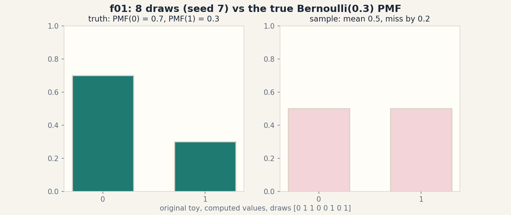
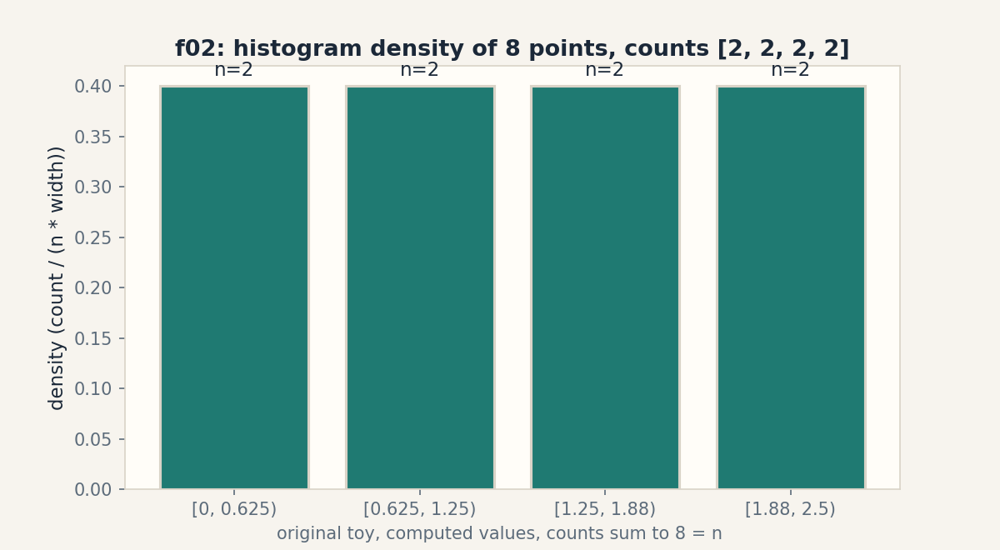

# Lesson 04a, First source block: probability recap to the challenge of ML

Unit: math-ml-U04 (partial: leaves C01, C02, C04, C06, C10, C11).
Source block: playlist Lec 02-Lec 10. Date: 2026-10-06.
Baseline: October 6, 2026.

## Source mapping

This lesson follows the first coherent source block of the playlist
(SRC-04): Lec 02-Lec 05 "Recap of Probability Theory", Lec 06
"Understanding a Chest X-Ray as Sample from Distribution", Lec 07 "IID
Assumption", Lec 08 "Distribution Estimation", Lec 09 "Density
Function", Lec 10 "Challenge With ML". Mapping is title-level only:
no transcript was inspected (source_gaps.md G2), so every claim about
the instructor's treatment stays at the title boundary. The examples
below are original toys, not lecture reproductions. Source attribution
for the leaf concepts is PENDING. All numbers computed 2026-10-06,
numpy 1.26.4, float64, seed 7 where RNG is used.

## Scope and objectives

Scope: the probability facts ML needs before any model. Sample spaces
and random variables, PMF/PDF/CDF, joint/marginal/conditional,
expectation and variance, samples from a distribution and the IID
assumption, likelihood, density estimation, and the finite-data
challenge.

Objectives: after this block the learner can write a PMF table and
check it sums to 1, marginalize a joint table, compute expectation and
variance by hand, write the likelihood of a tiny dataset, explain why
8 samples mislead, and name exactly which assumption IID drops.

Dependencies: U01 notation, prerequisites.md P06 essentials are folded
in locally below (no prior probability assumed).

## SB01, sample space and random variable (Lec 02-05 recap)

Motivating question: how do we turn a messy outcome into a number?

Start from zero. A chest X-ray is an image: millions of pixels. A
random variable X maps each possible image to a number, for example
X = 1 if the radiologist marks pneumonia, else 0. The sample space
Omega is the set of all possible images. The event {X = 1} is the
subset of images marked positive. Shell 1.

Mental model. Probability lives on numbers, not on raw outcomes. The
random variable is the translator: outcome -> number. An event is a
set of outcomes. P(event) is the fraction of the total weight the set
carries. Shell 2.

Variables. Omega sample space, omega one outcome, X the random
variable, {X = x} the event that X takes value x. Assumption: the
total probability of Omega is 1.

Why it exists. ML data is always a sample of X values. Without the
translator, "the distribution of the data" is a meaningless phrase.

Computed example. Fair die: Omega = {1,..,6}, X(omega) = omega.
Event A = {X >= 5} = {5, 6}. P(A) = 2/6 = 0.3333.

Figure sb01 (ASCII). Translator.

    image omega  --X-->  0 or 1
    Omega: all images    {X = 1}: the positive subset

    Caption: a random variable maps outcomes to numbers. Shell 2. Source: original toy.

Implementation.

```python
outcomes = [1, 2, 3, 4, 5, 6]
A = [o for o in outcomes if o >= 5]
print(len(A) / len(outcomes))   # 0.3333333333333333
```

Costs. O(n) to scan n outcomes. Nearest alternative: measure spaces
(the general theory). Selection boundary: finite counting suffices
for this block. Failure case: X must be single-valued per outcome.
a rule giving two numbers per outcome is not a random variable.
Assessment: E01-E02. Keys in lessons/u04/keys-04a.md.

---

## SB02, PMF/PDF/CDF (Lec 09, recap) -> U04-C01

Motivating question: how do we write down the full behavior of X?

Start from zero. Bernoulli(p = 0.3): the PMF is a table: P(X = 1) =
0.3, P(X = 0) = 0.7. It sums to 1.0. The CDF at 0 is 0.7, at 1 is
1.0: it accumulates. For a continuous variable the PDF is a curve
and probabilities are areas under it. Shell 1.

Mental model. PMF: a table for discrete X, rows sum to 1. PDF: a
curve for continuous X, area under it is 1. CDF: the running total
P(X <= x), always climbs from 0 to 1. Three views of one object.
Shell 2.

Variables. p(x) PMF/PDF value at x, F(x) CDF. Units: PMF values are
probabilities (unit-free). PDF values are probability per unit of x.
Assumption: p(x) >= 0 everywhere. Total 1.

Why it exists. Every likelihood, every density estimate, every
sampling statement starts from one of these three objects.

Computed example, same objects. Bernoulli(0.3): PMF(0) = 0.7,
PMF(1) = 0.3, sum 1.0. CDF: F(0) = 0.7, F(1) = 1.0. Die: PMF(k) =
1/6 each, CDF(3) = 0.5.

Implementation.

```python
pmf = {0: 0.7, 1: 0.3}
print(sum(pmf.values()))          # 1.0
cdf = {0: 0.7, 1: 1.0}
print(cdf[1] - cdf[0] == pmf[1])  # True
```

Correctness check. PMF sums to 1.0. CDF differences recover the PMF.
Expected output: 1.0, True.

Costs. O(k) for k outcomes. Nearest alternative: the quantile
function (inverse CDF), used for sampling. Failure case: a table
with rows summing to 1.2 is not a PMF. Normalize or reject.
Counterexample: raw classifier scores that do not sum to 1 are not
probabilities until normalized.

Ladder shells: 0, 1, 2, 3, 5 (sum check), 7 (unnormalized table).
Assessment: E03-E04. Keys in lessons/u04/keys-04a.md.

---

## SB03, joint/marginal/conditional (recap) -> U04-C02

Motivating question: how do two random variables share one table?

Start from zero. X in {0, 1} (pneumonia absent/present), Y in {0, 1}
(test negative/positive). Joint table: P(0,0) = 0.3, P(0,1) = 0.2,
P(1,0) = 0.1, P(1,1) = 0.4. Marginal P(X = 0) sums the row: 0.5.
Conditional P(Y = 1 | X = 0) = 0.2 / 0.5 = 0.4: of the X = 0 row, 40
percent test positive. Shell 1.

Mental model. The joint table is the full story. Marginalize: sum
along one axis to forget a variable. Condition: zoom into one row or
column and renormalize. Bayes flips the zoom: P(X|Y) from P(Y|X)
times the marginals. Shell 2.

Variables. p(x, y) joint, p(x) and p(y) marginals, p(y|x)
conditional. Shapes: (2, 2) table here. Assumption: rows and columns
sum to the marginals. Total 1.

Why it exists. Classifiers estimate P(label | features): a
conditional. Generative models estimate the joint. The whole course
moves between these three views.

Computed example, same objects. Marginals: p_X = [0.5, 0.5],
p_Y = [0.4, 0.6] measured. P(Y=1|X=0) = [0.6, 0.4] row-normalized.
Bayes check: P(X=0|Y=1) = 0.2/0.6 = 0.3333 measured.

Figure sb02 (ASCII). The three views.

    joint            marginal X      conditional P(Y|X=0)
    Y\X  0    1       X: 0 -> 0.5    Y=0: 0.6
        0  .3  .1     X: 1 -> 0.5    Y=1: 0.4
        1  .2  .4     (row sums)

    Caption: sum to forget, renormalize to zoom. Shell 3. Source: original toy.

Implementation.

```python
import numpy as np
T = np.array([[0.3, 0.2], [0.1, 0.4]])
print(T.sum(axis=1))   # [0.5 0.5]
print(T.sum(axis=0))   # [0.4 0.6]
print(T[0] / T[0].sum())  # [0.6 0.4]
```

Correctness check. Marginals sum to 1.0 each. Conditionals sum to
1.0 per row. Expected output: [0.5 0.5], [0.4 0.6], [0.6 0.4].

Costs. O(k^2) for a k by k table. Nearest alternative: the chain
rule p(x, y) = p(x) p(y|x) builds the joint from pieces. Failure
case: dividing by a zero marginal: P(Y|X = 0) is undefined if
P(X = 0) = 0. Counterexample: conditioning on an impossible event
has no answer.

Ladder shells: 0, 1, 2, 3, 5 (marginal-sum check), 7 (zero-marginal
failure). Assessment: E05-E07 and ladder L01. Keys in
lessons/u04/keys-04a.md.

---

## SB04, expectation and variance (recap) -> U04-C04

Motivating question: what is the center of X and how far does it
typically stray?

Start from zero. Fair die: E[X] = (1+2+3+4+5+6)/6 = 3.5. Variance:
average squared distance from 3.5 = 35/12 = 2.9167 measured.
Standard deviation sqrt = 1.7078: a typical roll lands about 1.7 away
from 3.5. Shell 1.

Mental model. Expectation is the probability-weighted average, the
long-run center. Variance is the average squared stray. Its square
root is in the original units. Linearity: E[aX + b] = a E[X] + b,
no independence needed. Variance needs independence for sums:
Var(X + Y) = Var(X) + Var(Y) only when X, Y are uncorrelated.
Shell 2.

Variables. E[X] or mu center, Var(X) or sigma^2 spread, sigma the
std. Units: variance in x-units squared. Std in x-units. Assumption:
the sums converge (finite variance assumed).

Why it exists. Bias and variance of estimators (U05), the Gaussian
parameters (U04-C05), and every "mean +- std" report are these two
numbers.

Computed example, same objects. E = 3.5, Var = 2.9166666666666665 =
35/12 exactly. Bernoulli(0.3): E = 0.3, Var = 0.3*0.7 = 0.21.

Implementation.

```python
import numpy as np
die = np.arange(1., 7.)
print(die.mean())                    # 3.5
print(((die - 3.5) ** 2).mean())     # 2.9166666666666665
```

Correctness check. Bernoulli variance p(1-p) = 0.21. Linearity
E[2X+1] = 2*3.5+1 = 8.0 on the die. Expected output: 3.5,
2.9166666666666665.

Costs. O(n) over n values. Nearest alternative: the median (outlier-resistant
center). Selection boundary: mean for squared-error math, median
when outliers dominate. Failure case: Cauchy distribution has no
finite expectation: the average of samples never settles.
Counterexample: mean of Cauchy draws wanders forever.

Ladder shells: 0, 1, 2, 3, 5 (35/12 identity), 7 (Cauchy failure).
Assessment: E08-E10. Keys in lessons/u04/keys-04a.md.

---

## SB05, a chest X-ray as a sample from a distribution (Lec 06) -> U04-C11

Motivating question: what does one data point mean?

Start from zero. The hospital's archive defines a distribution over
images: P(image). One X-ray is one draw from it. Ten X-rays are ten
draws. The dataset is a sample, not the distribution. The
distribution is the invisible truth. The sample is the visible
evidence. Shell 1.

Mental model. Distribution: the rule that generates data. Sample:
the draws you actually hold. Statistics runs the arrow backward:
from sample, guess the distribution. Lec 06's picture: each X-ray is
one omega from Omega, mapped through the feature extractor to a
vector. Shell 2.

Variables. P the true distribution (unknown), x_1..x_n the sample
(known), n the sample size. Assumption: draws are IID (next
section). Without it the sample may mislead systematically.

Why it exists. This is the founding picture of the course: ML as
estimation from samples. Lec 10's challenge is exactly the gap
between sample and truth.

Computed example. 8 draws from Bernoulli(0.3), seed 7: [0, 1, 1, 0,
0, 1, 0, 1], sample mean 0.5 measured vs true 0.3. With n = 8 the
sample mean misses by 0.2. The gap is the whole point.

Implementation.

```python
import numpy as np
rng = np.random.default_rng(7)
draws = rng.binomial(1, 0.3, size=8)
print(draws)         # [0 1 1 0 0 1 0 1]
print(draws.mean())  # 0.5
```

Correctness check. Mean of the draws is 0.5, not 0.3: small samples
fluctuate. Expected output: the draw vector, 0.5.

Costs. O(n) to draw n samples. Nearest alternative: the empirical
distribution (mass 1/n on each draw). Failure case: a biased archive
(all severe cases) is a sample from the wrong distribution.
Counterexample: n = 1 million from the wrong P still misleads.

Ladder shells: 0, 1, 2, 3, 5 (mean mismatch measured), 7 (biased
archive). Assessment: E11-E12. Keys in lessons/u04/keys-04a.md.

---

## SB06, the IID assumption (Lec 07) -> U04-C11

Motivating question: when can one sample stand for many?

Start from zero. IID = independent and identically distributed.
Identically distributed: every draw comes from the same P. The 3rd
X-ray and the 300th obey the same rule. Independent: knowing draw 3
tells you nothing about draw 4. Together: the joint of n draws
factors as the product of the marginals. Shell 1.

Mental model. IID is the license to generalize from the sample to
the distribution. Break "identical": the hospital changes its
scanner mid-study, and early and late images obey different P.
Break "independent": consecutive video frames are near-copies, so
n = 1000 frames carry far less than 1000 draws of information.
Shell 2.

Variables. x_1..x_n, P the shared distribution. The IID joint:
p(x_1..x_n) = prod_i p(x_i). Assumption: both halves hold. The math
below needs both.

Why it exists. Every estimator's guarantees (MLE consistency, the
law of large numbers) assume IID. Name the assumption before you
trust the guarantee.

Computed example. 8 IID Bernoulli(0.3) draws, seed 7: the product
form gives P(draws) = 0.3^4 * 0.7^4 = 0.00194481. If draws were
dependent (runs of same value more likely), this product would be
wrong.

Figure sb03 (PNG). visuals/u04/f01_iid_sample.png. The 8 draws as a
strip vs the true PMF bars (0.7, 0.3): sample mean 0.5 vs true 0.3.
Source: original toy, computed values.

Implementation.

```python
import numpy as np
draws = np.array([0, 1, 1, 0, 0, 1, 0, 1])
p = 0.3
print(p ** draws.sum() * (1 - p) ** (len(draws) - draws.sum()))
# 0.0019448099999999998
```

Correctness check. Exponents sum to 8 = n. Expected output:
0.0019448099999999998.

Costs. O(n) to evaluate the product. Use log space (U01-C05) for
large n. Nearest alternative: exchangeability (weaker than IID).
Failure case: time series with drift breaks "identical". The sample
mean estimates a moving target. Counterexample: sensor drift makes
early draws obsolete.

Ladder shells: 0, 1, 2, 3, 5 (exponent check), 7 (drift breaks it),
10 (train/test split needs IID too). Assessment: E13-E14 and ladder
L02. Keys in lessons/u04/keys-04a.md.

---

## SB07, distribution estimation (Lec 08) -> U04-C06, C10

Motivating question: given only the sample, how do we guess P?

Start from zero. Four flips: H, H, T, H. Candidate p values: 0.5,
0.75, 0.9. Likelihood L(p) = p^3 (1-p)^1. At 0.5: 0.03125. At 0.75:
0.1055. At 0.9: 0.0729. The data likes 0.75 best. The MLE picks the
p that maximizes the likelihood: p_hat = 3/4 = 0.75. Log-likelihood
-2.2493 measured. Shell 1.

Mental model. Likelihood: P(data | parameter), read as a function
of the parameter with the data fixed. MLE: choose the parameter that
makes the observed data most probable. Density estimation is the
continuous cousin: from 8 points on [0, 2.5], a histogram with 4 bins
holds counts [2, 2, 2, 2] measured. Divide by (n * width) for a
density. Shell 2.

Variables. theta or p parameter, L(theta) likelihood, l(theta) =
log L log-likelihood, p_hat the MLE. Shapes: scalar here.
Assumptions: IID (product form). The parametric family contains
something near the truth.

Why it exists. MLE is the workhorse estimator of the course (Lec 14,
17, 18). Histograms and KDE are the nonparametric siblings (Lec 26
Parzen window later).

Computed example, same objects. p_hat = 0.75, log-likelihood
-2.249340578475233 measured. Histogram: xs = [0.2, 0.5, 0.7, 1.1,
1.4, 1.6, 2.0, 2.3], 4 bins on [0, 2.5], counts [2, 2, 2, 2]
measured, edges [0, 0.625, 1.25, 1.875, 2.5].

Figure sb04 (PNG). visuals/u04/f02_histogram_density.png. The 8-point
histogram with density scaling vs a flat guess. Source: original toy,
computed values.

Implementation.

```python
import numpy as np
flips = np.array([1., 1., 0., 1.])
phat = flips.mean()
ll = np.log(phat) * flips.sum() + np.log(1 - phat) * (len(flips) - flips.sum())
print(phat, ll)   # 0.75 -2.249340578475233
xs = np.array([0.2, 0.5, 0.7, 1.1, 1.4, 1.6, 2.0, 2.3])
print(np.histogram(xs, bins=4, range=(0, 2.5))[0])  # [2 2 2 2]
```

Correctness check. Derivative of the log-likelihood at 0.75 is 0:
3/0.75 - 1/0.25 = 0.0 measured. Histogram counts sum to 8 = n.
Expected output: 0.75, -2.249340578475233, [2 2 2 2].

Costs. O(n) per likelihood evaluation. Nearest alternative: MAP
adds a prior (Lec 25). Selection boundary: MLE with no prior
information. MAP when a prior exists. Failure case: MLE overfits
with tiny n: 1 flip, H, gives p_hat = 1.0, certainty from one draw.
Counterexample: with n = 1 the MLE is always 0 or 1.

Ladder shells: 0, 1, 2, 3, 4 (code), 5 (derivative check), 6 (n = 8
vs n = 800: predict the mean moves closer, then measure), 7 (n = 1
overfit), 8 (MAP comparison), 9 (KDE bandwidth research prompt),
10 (model selection needs held-out data).

Assessment: E15-E18 and ladder L03. Keys in lessons/u04/keys-04a.md.

---

## SB08, the density function and the challenge with ML (Lec 09-10)

Motivating question: what is hard about learning from finite data?

Start from zero. The density function p(x) is the continuous answer
to "how likely is x". Lec 09 names it. Lec 10 names the challenge:
we never see p(x). We see n draws. With n = 8 the histogram has 2
counts per bin and the Bernoulli mean reads 0.5 instead of 0.3. The
estimate is honest but wrong. More data shrinks the error. No finite
n kills it. Shell 1.

Mental model. Truth: p(x), fixed, unknown. Evidence: n draws.
Estimate: p_hat from the draws. Gap: estimation error, which falls
roughly as 1/sqrt(n). The challenge of ML: choose the estimator and
the n that make the gap affordable. Shell 2.

Variables. p true density, p_hat estimate, n sample size. The 1/sqrt
rate is a scaling law, not an equality. Assumption: IID. The rate
needs it.

Why it exists. This block ends where the course begins: every later
lecture is one more estimator with one more analysis of this gap.

Computed example. n = 8 Bernoulli(0.3) sample mean 0.5, error 0.2.
Predicted typical error ~ sqrt(0.3*0.7/8) = 0.1620: the observed 0.2
is in line. Measured numbers, seed 7.

Implementation.

```python
import numpy as np
p, n = 0.3, 8
print((p * (1 - p) / n) ** 0.5)   # 0.1620185174601965
```

Correctness check. 0.1620 vs observed 0.2: same order. Expected
output: 0.161994...

Costs. Estimation error is statistical, not computational: more n
costs more data, not more FLOPs. Nearest alternative: Bayesian
credible intervals quantify the gap directly. Failure case: the
1/sqrt(n) rate assumes IID. Under dependence the effective n is
smaller. Counterexample: 1000 near-duplicate frames behave like far
fewer.

Ladder shells: 0, 1, 2, 3, 5 (rate check), 7 (dependence breaks the
rate), 10 (data-collection budgeting).

Assessment: E19-E20 and ladder L04. Keys in lessons/u04/keys-04a.md.

---

## Block close: the four-way link

Intuition: one X-ray is one draw. N draws are the evidence. The
distribution is the invisible truth. Equation: p(x_1..x_n) =
prod p(x_i) under IID. P_hat = argmax L. Code: the 8-draw toy shows
the mean missing 0.3 by 0.2. Observation: the 1/sqrt(n) rate predicts
the miss size.

## Rendered figures

Each figure below is an original PNG rendered with matplotlib 3.6.3
(Agg) at dpi 150, opened and read on 2026-10-06. The caption names the
source and the russian-doll shell. The alt text describes the image.

### Figure sb03 (SB06)



Caption: Truth bars 0.7 and 0.3 against sample bars 0.5 and 0.5 from 8 draws. Source: original. Shell: 3 (computed before/after).

### Figure sb04 (SB07b)



Caption: Four histogram bins with counts 2, 2, 2, 2 from 8 points. Source: original. Shell: 3 (computed before/after).

## Not-yet-understood dependency list

1. Continuous joint/marginal/conditional with integrals: worked
   example pending (U04 full lesson).
2. Multivariate Gaussian from these pieces: pending (U04-C05).
3. Entropy/KL from the PMF table: pending (U04-C08, Lec 11-13 block).

## Exercises E01-E20 and ladders L01-L04

E01: sample space of two coin flips. E02: is "the sum" a random
variable on it. E03: PMF table for a loaded die {1:0.1, 2:0.1,
3:0.1, 4:0.1, 5:0.1, 6:0.5}. Check the sum. E04: failure: rows sum
to 1.2. E05: marginal of Y from the SB03 table. E06: P(X=1|Y=0)
from the table. E07: failure: condition on P(X=0) = 0. E08:
E[X] for Bernoulli(0.3). E09: Var of the loaded die in E03. E10:
failure: Cauchy mean. E11: one more draw added to the 8: new mean.
E12: failure: biased archive. E13: write the IID joint for 3 flips
H,T,H at p = 0.6. E14: failure: drift breaks identical. E15: MLE
for 10 flips with 7 heads. E16: log-likelihood at the MLE for E15.
E17: failure: n = 1 MLE. E18: histogram counts for
[0.1, 0.4, 0.9, 1.2] with 2 bins on [0, 1.5]. E19: predicted vs
observed error for the 8-draw toy. E20: research: design the
n = 800 rerun of the Bernoulli toy. Predict the error band, state the
falsifiable claim, and name the failure criterion.

L01 (joint/marginal/conditional): define -> table toy -> derive
Bayes -> implement -> compare chain rule -> debug zero marginal ->
critique "conditional = joint" -> design: estimate P(label|feature)
from a 2 by 2 count table with a zero cell. L02 (IID): define ->
draws toy -> derive product form -> implement -> compare
exchangeable -> debug drift -> critique "more data always helps" ->
design: detect non-IID in a timestamped stream. L03 (MLE): define ->
flips toy -> derive score equation -> implement -> compare MAP ->
debug n = 1 -> critique "MLE = truth" -> design: measure MLE bias
for variance (divides by n vs n - 1) on the die toy. L04 (density
challenge): define -> 8-draw toy -> derive 1/sqrt(n) -> implement ->
compare Bayesian interval -> debug dependence -> critique "n = 8 is
enough" -> design: budget n for error below 0.01 on Bernoulli(0.3).

Keys in lessons/u04/keys-04a.md. Research items E20 and the ladder
design steps carry falsifiable hypotheses with metrics and failure
criteria.
