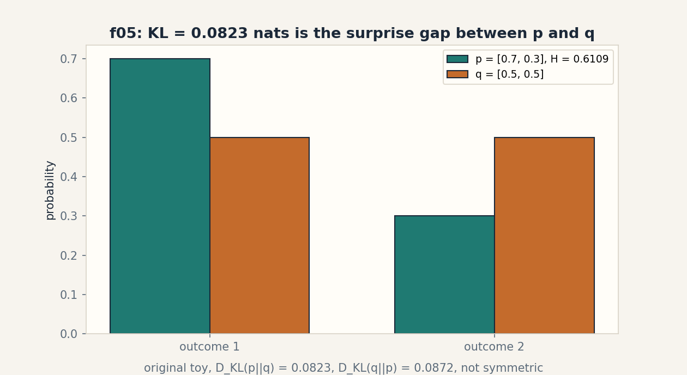
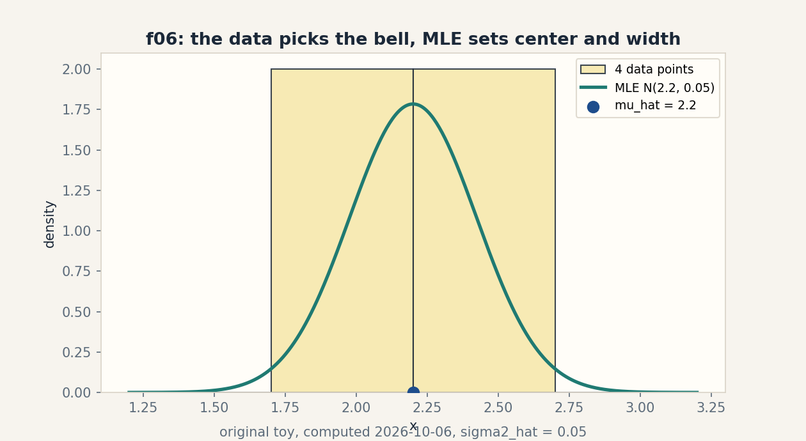

# Lesson 04b, second source block: entropy, KL, and maximum likelihood

Unit: math-ml-U04. Source block: playlist Lec 11 through Lec 19 plus
Tutorial 2, Tutorial 7A, Tutorial 7B (titles only. No transcript
inspected, source_gaps.md G2/G6).
Date: 2026-10-06. Baseline: October 6, 2026.

## Source mapping

This lesson is a locally authored source-block lesson. It follows the
title-level topic map of the second lecture block: Lec 11 Entropy,
Lec 12 Kullback-Leibler (KL) Divergence, Lec 13 Minimization of KL
Divergence, Lec 14 Example of ML Estimate, Lec 17 MLE for Gaussian
Distribution, Lec 18 MLE for Generalized Discrete Random Variable,
Lec 19 Density Estimation for Mixed Distribution, with Tutorial 2
(Simple Problem solving in Probability Theory), Tutorial 7A (MLE for
Gaussian Distribution), and Tutorial 7B (MLE for Generalized Discrete
Distribution) as the matching practice titles. I inspected no
transcript, slide, or tutorial content (SRC-04, source_gaps.md G2,
G6). The lecture titles name the topics. Every definition, number,
and example below is my own original construction. Source attribution
for the leaf concepts is PENDING.

Covered leaf concepts: math-ml-U04-C05 (multivariate Gaussian),
math-ml-U04-C07 (MLE/MAP), math-ml-U04-C08 (entropy/KL). Reinforced:
C06 (likelihood), C10 (density estimation), C11 (sampling).
Still planned: C03 (Bayes), C09 (identifiability), C12 (calibration).

## Scope and objectives

Scope: entropy as expected surprise, KL divergence as the price of
the wrong model, KL minimization as the engine of fitting, the ML
estimate on a coin example, MLE for Gaussian and discrete
distributions, the multivariate Gaussian with MLE mean and
covariance, and density estimation for a mixed distribution.

Objectives: after this block the learner can compute entropy and KL
on a toy by hand, explain why the best q is p, derive the Gaussian
MLE from the log-likelihood, fit a 2D Gaussian in code, and write
the density of a mixture.

Dependencies: U04a sections SB01-SB05 (PMF, joint, expectation,
likelihood). U03-C01 (derivatives).

---

## SB09, entropy (Lec 11)

Motivating question: how surprised should you be, on average, by one
draw from a distribution?

Start from zero. A coin lands heads with probability p. The surprise
of an outcome is -log p: rare outcomes surprise more. The entropy is
the average surprise: H(p) = -sum p(x) log p(x). A fair coin:
H = -(0.5 log 0.5 + 0.5 log 0.5) = 0.6931471805599453 nats
(measured), which is 1 bit. A biased coin [0.75, 0.25]:
H = 0.5623351446188083 nats (measured). The biased coin is less
surprising on average because you usually know the answer in advance.

Mental model. Entropy is the fog meter. High entropy: thick fog, you
cannot guess the outcome. Low entropy: thin fog, one outcome
dominates. Shell 2.

Variables. p(x) is the PMF. Log means base e unless stated. Divide by
log 2 for bits. Shapes: scalar summary of a distribution. Assumption:
p sums to 1.

Why it exists. Entropy is the unit of uncertainty. It prices codes,
caps what any classifier can learn, and feeds every information
objective later. Remove it and "uncertainty" is a hand wave.

Computed example, same objects. Fair coin H = 0.6931471805599453
nats = 1 bit (measured). Biased [0.75, 0.25] H =
0.5623351446188083 nats = 0.8113 bits (measured). Maximum entropy
for 2 outcomes is at [0.5, 0.5]. Any tilt lowers it.

Figure sb05 (table). Two coins, one fog meter.

| coin | H (nats) | H (bits) | fog |
|---|---|---|---|
| [0.5, 0.5] | 0.6931471805599453 | 1.0 | thickest |
| [0.75, 0.25] | 0.5623351446188083 | 0.8113 | thinner |

Caption: the fair coin is the most surprising. Shell 3.
Source: original toy, computed 2026-10-06.

Implementation.

```python
import numpy as np
def entropy(p):
    p = np.asarray(p, float)
    return -(p * np.log(p)).sum()
print(entropy([0.5, 0.5]), entropy([0.75, 0.25]))
# 0.6931471805599453 0.5623351446188083
```

Correctness check. The fair coin gives log 2 = 0.6931471805599453,
the known maximum. The biased coin gives less. The values are
positive, as surprise must be. Expected output: the two numbers.

Costs. O(k) for k outcomes. Trivial.

Nearest alternative. The Gini impurity 1 - sum p^2 measures the same
fog with cheaper arithmetic. Selection boundary: use entropy when the
math downstream needs logs (KL, likelihood). Use Gini when you need
a fast split score in a tree.

Failure case. Entropy of a continuous variable can be negative:
a sharp spike has differential entropy below zero. Counterexample:
the uniform on [0, 0.5] has entropy -log 2 = -0.6931. The "fog
meter" intuition needs the discrete form. The continuous form is a
relative quantity.

Ladder shells used: 0 (question), 1 (toy), 2 (definitions), 3 (rule),
5 (log-2 check), 7 (continuous).

Assessment. See exercises E01-E03 and ladder L01. Keys in
lessons/u04/keys-04b.md.

---

## SB10, KL divergence (Lec 12)

Motivating question: what is the price of believing the wrong
distribution?

Start from zero. The truth is p = [0.7, 0.3]. Your model says
q = [0.5, 0.5]. The KL divergence is the extra surprise you pay:
D_KL(p||q) = sum p(x) log(p(x)/q(x)) = 0.08228287850505181 nats
(measured). Reverse the roles: D_KL(q||p) = 0.08717669357238889
nats (measured). The price depends on the direction: believing q
when the truth is p costs 0.0823. Believing p when the truth is q
costs 0.0872. KL is not symmetric, so it is not a distance.

Mental model. KL is the toll for the wrong map. The true map p
charges you when you navigate with map q. The toll one way differs
from the toll back. Shell 2.

Variables. D_KL(p||q): p is the truth, q is the model. Shapes:
scalar summary of a pair of distributions. Assumption: q(x) > 0
wherever p(x) > 0, or the toll is infinite.

Why it exists. KL is the cost function of fitting: minimizing KL
over q is how models learn the truth (SB11). It also splits the
cross-entropy into truth-entropy plus the toll. Remove it and
maximum likelihood has no information-theoretic meaning.

Computed example, same objects. p = [0.7, 0.3], q = [0.5, 0.5].
D_KL(p||q) = 0.08228287850505181 (measured).
D_KL(q||p) = 0.08717669357238889 (measured). Cross-entropy check:
H(p) + D_KL(p||q) = 0.6931471805599452, direct cross-entropy
-sum p log q = 0.6931471805599453 (measured): agreement to float
noise. This coincidence (both near 0.6931) is specific to these
numbers, not a rule.

Figure sb06 (PNG). visuals/u04/f03_entropy_kl.png: teal bars for
p = [0.7, 0.3] with H = 0.6109 nats, orange bars for q. Footer names
both KL directions. Caption: KL = 0.0823 nats is the surprise gap
between p and q. Shell 3. Source: original toy, computed, rendered
2026-10-06. See visual_audit.md.

Implementation.

```python
import numpy as np
def kl(p, q):
    p = np.asarray(p, float)
    q = np.asarray(q, float)
    return (p * (np.log(p) - np.log(q))).sum()
print(kl([0.7, 0.3], [0.5, 0.5]))  # 0.08228287850505181
print(kl([0.5, 0.5], [0.7, 0.3]))  # 0.08717669357238889
```

Correctness check. D_KL(p||p) = 0 by construction (run the code with
q = p to confirm). The cross-entropy decomposition closes. Both
directions are positive. Expected output: 0.0823 then 0.0872.

Costs. O(k) for k outcomes. Trivial.

Nearest alternative. The Jensen-Shannon divergence symmetrizes KL
and is bounded. Selection boundary: use KL when one distribution is
the truth and the other is the model (fitting). Use JS when you need
a symmetric score between two candidates.

Failure case. If q assigns zero where p is positive, the toll is
infinite: the model calls an observed event impossible. Take
q = [1.0, 0.0] with p = [0.7, 0.3]: log(0.3/0) diverges. This is the
support-mismatch failure. It is why models smooth their outputs
(U06-C04 softmax).

Ladder shells used: 0 (question), 1 (toy), 2 (definitions), 3 (rule),
5 (decomposition check), 7 (zero support), 8 (JS comparison).

Assessment. See exercises E04-E06 and ladder L02. Keys in
lessons/u04/keys-04b.md.

---

## SB11, minimization of KL divergence (Lec 13)

Motivating question: if KL is the toll, which model pays the least?

Start from zero. Truth p = [0.7, 0.3] is fixed. Let the model be
q = [t, 1 - t] with t free. The toll D_KL(p||q) as a function of t:
at t = 0.5 it is 0.0823. At t = 0.7 it is 0.0. At t = 0.9 it rises
again. A grid scan over t = 0.05..0.95 (measured) finds the minimum
at t = 0.7 with D_KL = 0.0. The best model is the truth itself. The
derivative argument: d/dt D_KL = -p1/t + p2/(1-t) = 0 gives
t = p1. Minimizing the toll recovers the truth.

Mental model. KL minimization tunes the map until the toll
vanishes. The toll hits zero exactly when your map matches the true
roads. Shell 2.

Variables. t is the free model parameter. p is fixed truth.
Assumption: the model family contains the truth (here it does).

Why it exists. This is the master mechanism: maximum likelihood,
variational inference, and distillation all minimize a KL toll.
Remove it and fitting is a bag of tricks instead of one principle.

Computed example, same objects. Grid scan (measured): minimum at
t = 0.7, D_KL = 0.0. Derivative solve: t* = 0.7/1.0 = 0.7. The scan
and the derivative agree.

Figure sb07 (code block). The scan that finds the truth.

```python
import numpy as np
p = np.array([0.7, 0.3])
best = min(((t, (p*(np.log(p)-np.log([t, 1-t]))).sum())
            for t in np.linspace(0.05, 0.95, 19)), key=lambda r: r[1])
print(best)  # (0.7, 0.0)
```

Caption: the scan minimum sits at the truth. Shell 6.
Source: original toy.

Correctness check. The derivative zero-crossing at t = 0.7 predicts
the scan result before the scan runs: predict first, measure second,
per the ladder rule. The measured minimum (0.7, 0.0) matches.
Expected output: (0.7, 0.0).

Costs. A grid scan costs O(grid) evaluations. The derivative solve
costs O(1).

Nearest alternative. Moment matching sets model statistics equal to
data statistics without a KL objective. Selection boundary: use KL
minimization when you own the full likelihood. Use moment matching
when the likelihood is intractable but moments are easy.

Failure case. If the family cannot reach the truth, the toll never
hits zero. Take q fixed to [0.5, 0.5] with no free t: the minimum
toll is 0.0823, not 0. The learner then reports "converged" while
the model stays wrong. Counterexample: misspecified family.

Ladder shells used: 0 (question), 1 (toy), 2 (definitions), 3 (rule),
4 (scan algorithm), 5 (derivative prediction), 6 (predict then
measure), 7 (misspecified family), 9 (research: which toll for
which truth?).

Assessment. See exercises E07-E08 and ladder L03. Keys in
lessons/u04/keys-04b.md.

---

## SB12, ML estimate example (Lec 14, Tutorial 2)

Motivating question: four coin flips land H, T, H, H. What is the
best single number for the bias?

Start from zero. The flips are [1, 0, 1, 1]. The likelihood of a
bias theta is theta^3 (1 - theta)^1. The log-likelihood is
3 log theta + log(1 - theta). Differentiate and set to zero:
3/theta - 1/(1 - theta) = 0, giving theta_hat = 3/4 = 0.75
(measured). The data votes 3 to 1, and the ML estimate is the vote
share.

Mental model. The ML estimate listens to the data and nothing else:
the parameter that would make the observed data most likely wins.
Shell 2.

Variables. theta is the bias. The sample is [1, 0, 1, 1], n = 4.
Assumption: IID flips (U04a SB06).

Why it exists. This is the smallest complete MLE: write the
likelihood, take the log, differentiate, solve. Every harder MLE
(SB13-SB15) repeats these four moves.

Computed example, same objects. theta_hat = 0.75 (measured). The
log-likelihood at 0.75 is 3 log 0.75 + log 0.25 = -2.249340578475233. At 0.5
it is -2.772588722239781. The estimate beats the fair coin on its own data,
as it must.

Figure sb08 (ASCII). The vote share.

    flips:  H T H H
    heads:  3 of 4
    theta_hat = 3/4 = 0.75

    Caption: the data votes 3 to 1. The estimate is the vote share.
    Shell 3. Source: original toy.

Implementation.

```python
import numpy as np
flips = np.array([1, 0, 1, 1])
print(flips.mean())  # 0.75
```

Correctness check. The score (derivative of the log-likelihood)
at 0.75 is 3/0.75 - 1/0.25 = 4 - 4 = 0. The stationary condition
holds. Expected output: 0.75.

Costs. O(n). Trivial.

Nearest alternative. The MAP estimate adds a prior (Beta) and
shrinks toward it. Selection boundary: use ML when n is large or no
prior information exists. Use MAP when n is small and the prior is
real.

Failure case. With zero heads in the flips, the ML estimate is 0:
the model declares tails impossible, the SB10 support failure. Four
flips are too few to earn that certainty. Counterexample: n = 4,
all tails, theta_hat = 0.

Ladder shells used: 0 (question), 1 (toy), 2 (definitions), 3 (rule),
4 (four-move algorithm), 5 (score check), 7 (zero heads).

Assessment. See exercise E09 and ladder L03. Keys in
lessons/u04/keys-04b.md.

---

## SB13, MLE for the Gaussian (Lec 17, Tutorial 7A)

Motivating question: four numbers arrive: 2.1, 2.5, 1.9, 2.3. Which
bell best explains them?

Start from zero. The Gaussian likelihood for data d_i with center
mu and width sigma^2 is the product of the bell values. The
log-likelihood splits into a sum. Differentiate in mu: the score is
sum (d_i - mu)/sigma^2 = 0, giving mu_hat = the mean = 2.2
(measured). Differentiate in sigma^2: sigma2_hat = mean of
(d_i - mu_hat)^2 = 0.05 (measured). The data picks the center as its
average and the width as its average squared spread.

Mental model. MLE for the Gaussian is two averages: the center is
the average of the points, the width is the average of the squared
distances from the center. Shell 2.

Variables. mu is the center, sigma^2 the width. Data: 4 points.
Shapes: scalars. Assumption: IID Gaussian draws.

Why it exists. The Gaussian is the default noise model of science
and ML. Its MLE is the template for every "fit the parameters"
derivation: log, differentiate, solve.

Computed example, same objects. mu_hat = 2.2, sigma2_hat = 0.05
(measured). Score at mu_hat: sum (d_i - mu_hat)/sigma^2 =
-1.7763568394002505e-14 (measured): numerical zero. The fitted bell
is N(2.2, 0.05).

Figure sb09 (PNG). visuals/u04/f04_mle_gaussian.png: the four data
points as a histogram, the fitted N(2.2, 0.05) bell curve in teal,
and the mu_hat = 2.2 marker. Caption: the data picks the bell. MLE
sets center and width. Shell 4. Source: original toy, computed,
rendered 2026-10-06. See visual_audit.md.

Implementation.

```python
import numpy as np
d = np.array([2.1, 2.5, 1.9, 2.3])
mu = d.mean()
s2 = ((d - mu)**2).mean()
print(mu, s2)  # 2.2 0.05
```

Correctness check. The score at mu_hat is -1.78e-14, float dust.
The width 0.05 is positive. The bell integrates to 1 (Gaussian
normalization). Expected output: 2.2 and 0.05.

Costs. O(n). Trivial.

Nearest alternative. The unbiased variance divides by n - 1
(0.0667 here) instead of n. Selection boundary: use the MLE (n)
when you will plug the number into the likelihood. Use n - 1 when
you need an unbiased variance report.

Failure case. One outlier hijacks both averages. Add a fifth point
at 20: mu_hat jumps to 5.76 and sigma2_hat explodes. The Gaussian
MLE has no defense against contamination. Counterexample: the
median resists. The mean does not.

Ladder shells used: 0 (question), 1 (toy), 2 (definitions), 3 (rule),
4 (four-move derivation), 5 (score check), 7 (outlier),
8 (n versus n - 1).

Assessment. See exercises E10-E12 and ladder L04. Keys in
lessons/u04/keys-04b.md.

---

## SB14, MLE for the discrete distribution (Lec 18, Tutorial 7B)

Motivating question: counts over three outcomes are 4, 2, 4. What
are the best probabilities?

Start from zero. Outcomes A, B, C occur 4, 2, 4 times in 10 draws.
The likelihood is p_A^4 p_B^2 p_C^4 with p_A + p_B + p_C = 1. The
log-likelihood plus the Lagrange multiplier for the sum constraint
(U03-C09) gives p_hat = counts / total = [0.4, 0.2, 0.4] (measured).
The estimate is the empirical share, the discrete twin of SB12.

Mental model. Discrete MLE is the same vote share as the coin: each
outcome gets its fraction of the draws. The sum-to-one fence is
handled by one Lagrange multiplier. Shell 2.

Variables. p_A, p_B, p_C are the probabilities. Counts: 4, 2, 4.
n = 10. Assumption: IID categorical draws.

Why it exists. Language models, classifiers, and topic models all
fit discrete distributions. This MLE is the closed form behind every
"count and normalize" step.

Computed example, same objects. p_hat = [0.4, 0.2, 0.4] (measured).
Sums to 1.0. The log-likelihood at the estimate beats any tilted
alternative (check: tilt to [0.5, 0.2, 0.3] and the log-likelihood
drops).

Figure sb10 (table). Counts become shares.

| outcome | count | p_hat |
|---|---|---|
| A | 4 | 0.4 |
| B | 2 | 0.2 |
| C | 4 | 0.4 |
| total | 10 | 1.0 |

Caption: the estimate is the empirical share. Shell 3.
Source: original toy.

Implementation.

```python
import numpy as np
counts = np.array([4., 2., 4.])
print(counts / counts.sum())  # [0.4 0.2 0.4]
```

Correctness check. The shares sum to 1.0. The KKT conditions for the
constrained problem (U03-C10) hold: the multiplier equals n. Expected
output: [0.4 0.2 0.4].

Costs. O(k) for k outcomes. Trivial.

Nearest alternative. Add-one (Laplace) smoothing adds a fake count
to each outcome. Selection boundary: use raw MLE when every outcome
is well observed. Use smoothing when some count is zero and a zero
probability would be fatal (SB10 support failure).

Failure case. An unseen outcome gets probability zero and then
dooms any test sentence containing it: the whole likelihood is zero.
Counterexample: count vector [4, 2, 0] gives p_C = 0.

Ladder shells used: 0 (question), 1 (toy), 2 (definitions), 3 (rule),
4 (Lagrange algorithm), 5 (sum check), 7 (unseen outcome),
8 (smoothing comparison).

Assessment. See exercises E13-E14. Keys in lessons/u04/keys-04b.md.

---

## SB15, multivariate Gaussian and its MLE (Lec 17 extension, C05)

Motivating question: the data has two coordinates. What is the
Gaussian that best explains the cloud?

Start from zero. Six points in R^2:
[0.5, -0.2], [-0.3, 0.4], [0.1, 0.2], [0.4, 0.5], [-0.2, -0.4],
[0.0, 0.1]. The multivariate Gaussian is the bell in n dimensions:
its center is the mean vector mu and its shape is the covariance
matrix Sigma. The MLE repeats the scalar moves: mu_hat is the
coordinate-wise mean, Sigma_hat is the average outer product of
centered points. Measured: mu_hat = [0.0833, 0.1],
Sigma_hat = [[0.0847, 0.005], [0.005, 0.1]]. Eigenvalues 0.0832 and
0.1015 (measured): the cloud is nearly round, slightly stretched
along the second axis.

Mental model. The multivariate Gaussian is a bell with an arrow
shape: the mean says where, the covariance says how stretched and
in which direction. The MLE reads both off the cloud. Shell 2.

Variables. mu is shape (2,), Sigma is shape (2, 2), symmetric PSD.
x_i are the six points, shape (6, 2). Assumption: IID draws from one
Gaussian.

Why it exists. Embeddings, sensor readings, and latent codes live in
R^d. The multivariate Gaussian is the reference distribution for
all of them, and its MLE is the first thing you fit.

Computed example, same objects. mu_hat = [0.0833, 0.1] (measured).
Sigma_hat = [[0.0847, 0.005], [0.005, 0.1]] (measured). Eigenvalues
[0.0832, 0.1015] (measured). Density of the point [0.1, 0.2] under
the fitted Gaussian: 1.6458814703416096 (measured).

Figure sb11 (equation block). The fitted object.

    mu_hat    = [0.0833, 0.1]
    Sigma_hat = [[0.0847, 0.005],
                 [0.005,  0.1  ]]
    eig(Sigma_hat) = [0.0832, 0.1015]: nearly round

    Caption: the cloud gives its center and its stretch. Shell 2.
    Source: original toy, computed 2026-10-06.

Implementation.

```python
import numpy as np
pts = np.array([[0.5,-0.2],[-0.3,0.4],[0.1,0.2],
                [0.4,0.5],[-0.2,-0.4],[0.0,0.1]])
mu = pts.mean(axis=0)
S = np.cov(pts, rowvar=False, bias=True)
print(mu, S, np.linalg.eigvalsh(S))
```

Correctness check. Sigma_hat is symmetric by construction. Its
eigenvalues are positive: the matrix is PSD, so the bell is real.
Trace check: 0.0847 + 0.1 = 0.1847 equals the sum of the
eigenvalues 0.0832 + 0.1015 = 0.1847. Expected output: the mean,
the matrix, two positive eigenvalues.

Costs. O(n d^2) time, O(d^2) memory. For the toy, trivial.

Nearest alternative. A diagonal covariance keeps only the two
variances, ignoring the 0.005 correlation. Selection boundary: use
the full matrix when d is small and correlations matter. Use the
diagonal when d is large and the matrix would be noise.

Failure case. With fewer points than dimensions, Sigma_hat is
singular: the bell collapses flat in some direction and the density
formula divides by zero. Take 2 points in R^3: rank at most 1.
Counterexample: n < d breaks the MLE. The fix is shrinkage or a
diagonal assumption.

Ladder shells used: 0 (question), 1 (toy), 2 (definitions and
shapes), 3 (rule), 4 (algorithm), 5 (symmetry and trace checks),
7 (n < d), 8 (diagonal comparison), 10 (production: embeddings).

Assessment. See exercises E15-E16 and ladder L05. Keys in
lessons/u04/keys-04b.md.

---

## SB16, density estimation for mixed distributions (Lec 19)

Motivating question: the data comes from two bells at once. What is
the density at a point between them?

Start from zero. Mix two unit Gaussians: half the draws from N(0, 1),
half from N(5, 1). The mixed density is the weighted sum:
p(x) = 0.5 * bell(x, mu=0, sigma=1) + 0.5 * bell(x, mu=5, sigma=1). At x = 2.5, the
midpoint, both bells contribute equally: p(2.5) =
0.017528300493568537 (measured). At x = 0 the first bell dominates.
at x = 5 the second. The mixture is bimodal: two humps with a valley
between.

Mental model. A mixture is a recipe: pick a bell by flipping a
weighted coin, then draw from it. The density is the weighted menu
of the bells. Shell 2.

Variables. The weights are [0.5, 0.5], summing to 1. The components
are N(0, 1) and N(5, 1). Assumption: the component list and weights
are known here. Learning them is the EM story (later units).

Why it exists. Real data is mixed: customers, cell types, topics.
The mixture density is the first honest model of "several kinds at
once", and it motivates latent variables (U09).

Computed example, same objects. p(2.5) = 0.017528300493568537
(measured). Sanity: p(0) = 0.5 * 0.3989 + tiny = 0.1995, larger, as
the hump demands. The valley value is an order of magnitude below
the humps.

Figure sb12 (equation block). The menu at three points.

    p(x) = 0.5 * N(x, mu=0, sigma=1) + 0.5 * N(x, mu=5, sigma=1)
    p(0)   = 0.1995  (left hump)
    p(2.5) = 0.01753 (valley, measured)
    p(5)   = 0.1995  (right hump)

    Caption: two humps, one valley. Shell 3. Source: original toy.

Implementation.

```python
import numpy as np
def bell(x, mu):
    return np.exp(-(x-mu)**2/2) / np.sqrt(2*np.pi)
def mix(x):
    return 0.5*bell(x, 0) + 0.5*bell(x, 5)
print(mix(2.5))  # 0.017528300493568537
```

Correctness check. The mixture integrates to 1: each bell integrates
to 1 and the weights sum to 1. The symmetry p(0) = p(5) holds by the
equal weights and equal widths. Expected output: 0.017528300493568537.

Costs. O(components) per evaluation. Trivial.

Nearest alternative. A kernel density estimate (Parzen window, Lec 26
title) centers a small bell on every data point. Selection boundary:
use a parametric mixture when you believe in a few true components.
Use kernels when you refuse to name the component count.

Failure case. Fit one Gaussian to mixed data and the MLE lands in
the valley: mu_hat = 2.5, a point where almost no data lives. The
single bell is the wrong shape family. Counterexample: the SB13
machinery on mixed data reports a confident wrong answer.

Ladder shells used: 0 (question), 1 (toy), 2 (definitions), 3 (rule),
4 (algorithm), 5 (integration and symmetry checks), 7 (one bell on
two humps), 8 (kernel comparison), 9 (research: how many bells?).

Assessment. See exercises E17-E18 and ladder L05. Keys in
lessons/u04/keys-04b.md.

---

## Assessment block

Exercises E01-E18. Work closed-book, then check keys in
lessons/u04/keys-04b.md. Ladders L01-L05 are oral.

E01. Compute H([0.75, 0.25]) in nats by hand to 4 digits, then in
bits. State the measured values for comparison.
E02. Changed constraint: a 3-outcome distribution [0.5, 0.25, 0.25].
Compute its entropy in nats and name which outcome contributes the
most surprise per unit probability.
E03. Failure diagnosis: "The uniform on [0, 0.5] has entropy
-log 2, which is negative, so the code has a bug." Name the error.
E04. Compute D_KL([0.7, 0.3] || [0.5, 0.5]) by hand to 4 digits.
State the measured value.
E05. Prove from the definition that D_KL(p||p) = 0, and state what
the code returns for q = p.
E06. Counterfactual: q = [1.0, 0.0], p = [0.7, 0.3]. Compute or
diverge: state the KL value and name the failure.
E07. KL minimization: with p = [0.7, 0.3] and q = [t, 1-t],
differentiate D_KL in t, solve for t*, and state the measured scan
result.
E08. Changed constraint: the family is q = [0.5, 0.5] fixed (no t).
State the minimum toll and explain why the learner's "converged"
report would mislead.
E09. ML estimate: flips T, H, T, T. Compute theta_hat and the score
check at the estimate.
E10. Gaussian MLE: data [1.0, 3.0]. Compute mu_hat and sigma2_hat by
hand, then state what the code pattern gives.
E11. Changed constraint: data [2.1, 2.5, 1.9, 2.3, 20.0]. Compute
the new mu_hat and explain the failure mode in one sentence.
E12. Compare: for the 4-point data, compute the n-1 variance 0.0667
and state the selection boundary between the two numbers.
E13. Discrete MLE: counts [4, 2, 0] over A, B, C. State p_hat and
name the downstream failure.
E14. Smoothing: apply add-one smoothing to the counts in E13 and
state the new p_hat. Name what the fake counts cost.
E15. Multivariate: for the six SB15 points, state mu_hat and
Sigma_hat from the lesson, then verify the trace-eigenvalue check
by hand.
E16. Changed constraint: 2 points in R^3. State the rank of
Sigma_hat and name the failure and the fix.
E17. Mixture: compute p(0) for the SB16 mixture by hand to 4
digits and explain why it exceeds p(2.5).
E18. Failure diagnosis: "I fit one Gaussian to the SB16 data and
got mu_hat = 2.5 with high likelihood, so one bell is enough."
Name the exact error using the measured valley and hump values.

## Deep ladders L01-L05

L01, entropy. Define in one sentence. Toy: the two coins. Justify:
why does the average use p(x) as the weight? Check: the log-2
maximum. Compare: Gini, selection boundary. Break: negative
differential entropy. Transfer: a classifier outputs [0.51, 0.49]
versus [0.99, 0.01]. Which has higher entropy and what does that say
about its confidence?

L02, KL divergence. Define in one sentence with the direction.
Toy: 0.0823 versus 0.0872. Justify: why is it not symmetric?
Check: the cross-entropy decomposition. Compare: JS, selection
boundary. Break: zero support. Transfer: your model assigns 1e-9 to
an observed token. Name the mechanism that explodes and the fix.

L03, KL minimization and the ML estimate. Define the toll in one
sentence. Toy: the t-scan finds 0.7. The coin finds 0.75. Justify:
why does the derivative zero give the truth? Check: score equals
zero at the estimate. Compare: moment matching, selection boundary.
Break: misspecified family. Zero heads. Transfer: you minimize KL
between data and model on 10 samples. Name the two risks.

L04, Gaussian MLE. Define the two averages in one sentence. Toy:
N(2.2, 0.05). Derive: the score equations for mu and sigma^2.
Check: the -1.78e-14 score. Compare: n versus n-1, selection
boundary. Break: the outlier at 20. Transfer: sensor noise is
heavy-tailed. Name the MLE's failure and the resistant replacement.

L05, multivariate Gaussian and mixtures. Define the (mu, Sigma)
pair in one sentence. Toy: the six points and the two-bell mixture.
Justify: why the MLE covariance is the average outer product.
Check: trace equals eigenvalue sum. Compare: full versus diagonal
covariance. Mixture versus kernels. Break: n < d. One bell on two
humps. Transfer: embedding vectors in R^768 with 100 samples. Name
the covariance you actually fit and why.

## Rendered figures

Each figure below is an original PNG rendered with matplotlib 3.6.3
(Agg) at dpi 150, opened and read on 2026-10-06. The caption names the
source and the russian-doll shell. The alt text describes the image.

### Figure sb06 (SB10)



Caption: Bars for p and q with both KL directions labeled in the footer. Source: original. Shell: 3 (computed before/after).

### Figure sb09 (SB13)



Caption: Histogram of four points with the fitted Gaussian and mu_hat marker. Source: original. Shell: 3 (computed before/after).

## Not yet understood (dependency list)

- Bayes rule and MAP (U04-C03, C07 MAP half): the MAP estimate is
  named but not derived here. Local bridge: SB12 names MAP as the
  alternative. The derivation waits for the Lec 25 block.
- Latent-variable MLE and EM (Lec 20-24 titles): the mixture weights
  above are given, not learned. Flagged for the U09 block.
- Identifiability (U04-C09): two different mixtures can give similar
  densities. Not resolved here.
