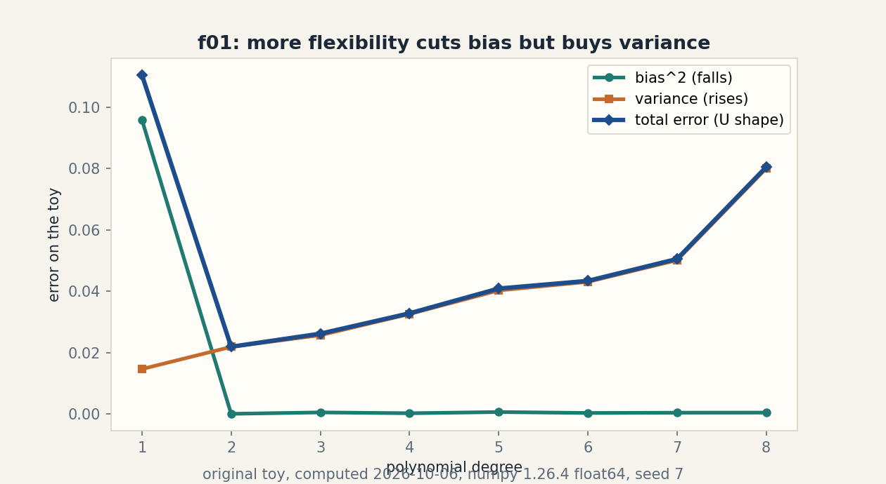
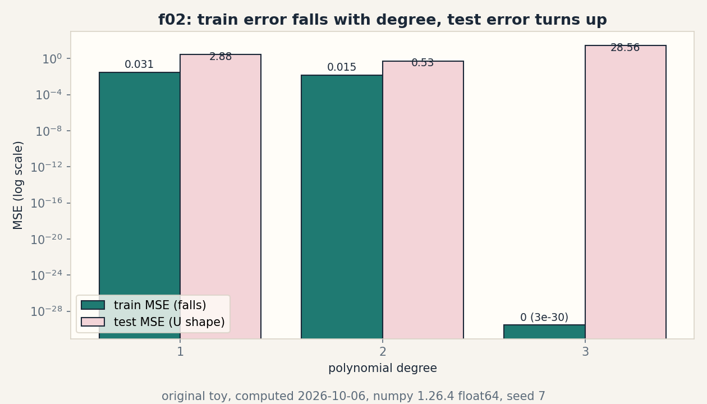
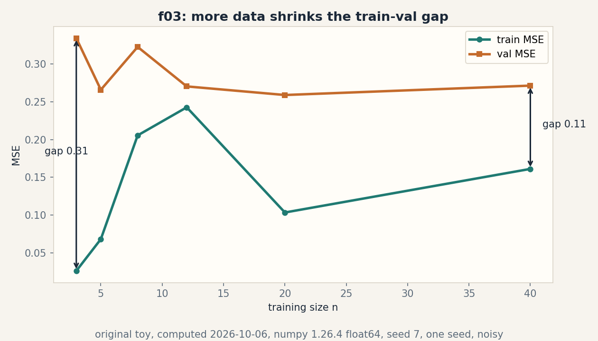
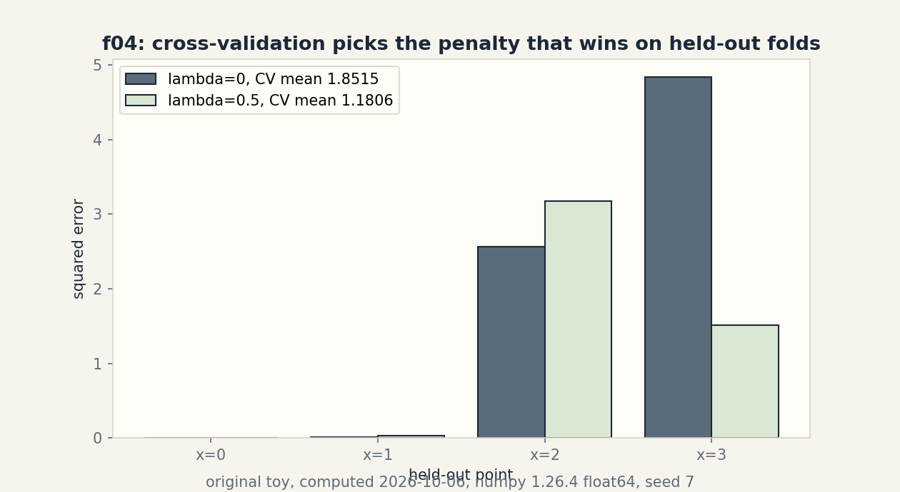

# Lesson 05, Risk, regularization, and generalization

Unit: math-ml-U05. Leaf concepts: math-ml-U05-C01 to C12.
Date: 2026-10-06. Baseline: October 6, 2026.

## Source mapping

This lesson is locally authored prerequisite bridge content for the
prerequisite modules P07 (statistical estimation and uncertainty),
P09 (optimization and constrained problems), and P10 (ML foundations
and evaluation). It does not claim to reproduce the instructor's
lectures. Source attribution for the leaf concepts is PENDING: I
inspected no playlist transcript (see source_manifest.md SRC-04,
source_gaps.md G2). The playlist titles that name this unit's topics
are "Lec 15 Risk Minimization Framework", "Lec 31 Bias-Variance
Decomposition and Analysis", "Lec 32 Bias and Variance in Practice",
"Lec 33 Regularization", "Lec 34 Regularized ERM and MAP Estimate",
"Lec 35 Stochastic Gradient Descent as a Regularizer", "Lec 59 Cross
Validation", and "Tutorial 3 Risk Minimization Framework". Titles name
topics. They do not name leaf items, definitions, or numbers. All
numbers below are computed 2026-10-06, numpy 1.26.4, float64, CPython.
Random draws use numpy default_rng(7).

## Scope and objectives

Scope: the risk we want against the risk we can measure, loss
selection, the assumptions behind consistency, bias and variance,
penalties, priors as penalties, train/test splits, cross-validation,
capacity, learning curves, leakage, and distribution shift.

Objectives: after this lesson the learner can write the empirical
and population risk of a toy classifier, choose a loss and defend the
choice, state the assumptions that make ERM consistent, decompose one
MSE into bias squared plus variance, run ridge and MAP on a toy and
show their equivalence, split data and run k-fold CV without leakage,
read capacity and learning curves, name three leak channels, and
quantify one covariate shift.

Dependencies: prerequisites.md R35-R44. U01 notation. U03 gradients.
U04 likelihood, MLE, MAP, expectation.

## How to read this lesson

Each section follows one chain. A concrete question opens. A toy from
zero follows. One rule is applied. A computed example uses the same
objects. Code, checks, costs, alternatives, and a failure case close.
Shell numbers (0-10) mark the Russian-doll ladder position of each step.
Figures carry one claim each. The audit table lives in visual_audit.md.

---

## C01, empirical and population risk

Motivating question: you score a classifier on the data you have.
What score would it get on the data you have not seen?

Start from zero. Four points: x = [0, 1, 2, 3], y = [0, 0, 1, 1].
Take the rule h: predict 1 when x >= 2.5, else 0. Predictions are
[0, 0, 0, 1]. Only x = 2 is wrong (truth 1, prediction 0). One error
in four. The empirical risk is 0.25. That number is measured. It is
not a claim about the future.

Mental model. The empirical risk is the scoreboard after the game
you played. The population risk is the scoreboard you would get if
you played forever. The first is a number from your sample. The
second is an expectation over the true distribution. ERM, empirical
risk minimization, picks the rule with the best scoreboard from the
sample. Shell 2.

Variables. R(h) is the population risk: E[l(y, h(x))]. R_hat(h) is
the empirical risk: (1/n) sum_i l(y_i, h(x_i)). l is the loss.
n = 4 in the toy. Shapes: scalars in, scalars out. Assumptions: the
sample is IID from the population, and l is fixed before you look
at the data.

Why it exists. Training minimizes R_hat. Deployment pays R. The
whole unit is the gap between them. Remove the distinction and every
leaderboard becomes a promise.

Computed example, same objects. 0-1 loss. R_hat(h) = 0.25, computed
2026-10-06. Now fix the population: x uniform on [0, 4], y = 1 when
x >= 1.5 else 0. The rule h is wrong exactly on x in [1.5, 2.5),
a set of measure 1 out of 4. R(h) = 0.25. Here the two agree. They
agree by luck of the toy, not by law. C07 breaks the luck.

Figure f01 is not this section's. C01 carries its state in the two
numbers 0.25 and 0.25 and the sentence that they need not agree.

Implementation.

```python
x = [0, 1, 2, 3]
y = [0, 0, 1, 1]
pred = [1 if v >= 2.5 else 0 for v in x]
R_hat = sum(p != t for p, t in zip(pred, y)) / len(y)
print(R_hat)  # 0.25
```

Correctness check. Hand count: only index 2 disagrees. 1/4 = 0.25.
The code prints 0.25. Expected output: 0.25.

Costs. One R_hat evaluation costs n loss evaluations. For the toy,
4. Nearest alternative: the population risk cannot be computed from
data alone. You estimate it with held-out data (C07) or CV (C08).
Selection boundary: use R_hat to pick among rules. Use held-out
estimates to report how the pick will do.

Failure case. Pick h to minimize R_hat over a rich rule set and R_hat
falls to 0 while R stays high. That pattern is overfit, and C09 studies it. Counterexample: a lookup table that memorizes the
four points has R_hat = 0 and R = 0.5 on this toy population (it
guesses wrong on half of [0,4]). The scoreboard lied.

Ladder shells used: 0 (question), 1 (toy), 2 (definitions), 3 (ERM
rule), 5 (hand count versus code), 7 (memorizer counterexample).

Assessment. See exercises E01-E03 and ladder L01. Keys in
lessons/u05/keys.md.

---

## C02, loss selection

Motivating question: three losses rank the same constant predictor
differently. Which ranking do you trust?

Start from zero. Labels y = [0, 1, 1]. Predict one constant c.
Squared loss picks c* = 2/3, the mean, with risk 2/9 = 0.2222.
0-1 loss with a majority rule picks 1, with risk 1/3 = 0.3333.
Absolute loss picks c* = 1, the median, with risk 1/3 = 0.3333.
Log loss at p = 2/3 gives 0.6365. Four numbers, one dataset, no
universal winner.

Mental model. A loss is the price list you hand to the optimizer.
Squared loss prices large errors quadratically and buys the mean.
Absolute loss prices all errors linearly and buys the median. 0-1
loss prices only the verdict and buys the majority class. The loss
chooses the statistic before any data arrives. Shell 2.

Variables. l(y, y_hat) maps a truth and a prediction to a price,
units of the loss. For squared loss the units are squared target
units. Assumptions: the loss is fixed before training, matches the
decision you will make, and its minimizer is the statistic you want.

Why it exists. "Accuracy" and "MSE" are not the same request. Train
on one, report the other, and you optimized a proxy of a proxy.
The loss must match the deployment decision or the deployment metric
punishes you.

Computed example, same objects. Values computed 2026-10-06:

| loss | best constant | risk |
|---|---|---|
| squared | 2/3 | 0.2222 |
| 0-1 (majority rule) | 1 | 0.3333 |
| absolute | 1 | 0.3333 |
| log loss at p = 2/3 | 2/3 | 0.6365 |

Figure: the table is the figure. It carries one claim: the loss
chooses the optimum. Source: original toy.

Implementation.

```python
y = [0., 1., 1.]
c = sum(y) / len(y)              # 0.6667
risk_sq = sum((v - c) ** 2 for v in y) / 3
print(c, risk_sq)  # 0.6666666666666666 0.22222222222222224
```

Correctness check. Hand: (4/9 + 1/9 + 1/9)/3 = 6/27 = 2/9. The code
prints 0.2222. Expected output: 0.6667, 0.2222.

Costs. Evaluating one loss on n points costs O(n). Nearest
alternative: a surrogate loss (hinge, logistic) replaces a
non-smooth 0-1 loss so gradients exist. Selection boundary: use the
deployment loss when it is smooth enough to optimize. Use a
surrogate when it is not, and report the true loss on held-out data.

Failure case. Optimizing squared loss for a classification task
punishes confident correct answers: a prediction of 3 for label 1
pays (3-1)^2 = 4 though the class is right. Counterexample: on
y = [0, 1, 1] the squared-loss constant 2/3 is not a legal class
label at all. The loss must match the output space.

Ladder shells used: 0 (question), 1 (toy), 2 (definitions), 3 (the
price-list rule), 5 (hand 2/9 versus code), 7 (wrong-output-space
counterexample).

Assessment. See exercises E04-E06 and ladder L02. Keys in
lessons/u05/keys.md.

---

## C03, statistical consistency assumptions

Motivating question: when does more data actually buy a better
estimate?

Start from zero. Estimate a coin bias p = 0.7 with the sample mean
of n = 4 flips. If the flips are IID, the mean squared error is
p(1-p)/n = 0.0525. If the four flips are perfect copies of one flip
(total dependence), the "sample" of 4 carries one flip of
information and the MSE is p(1-p) = 0.21. Same n, four times the
error. The assumptions, not n, did the work.

Mental model. Consistency is a contract: IID sampling, a fixed
estimator, and n going to infinity together promise that the
estimate lands on the truth. Break IID and the contract is void.
The estimator still runs. It just estimates the wrong thing, or
nothing. Shell 2.

Variables. theta_hat_n is the estimate from n points. theta is the
truth. MSE = E[(theta_hat_n - theta)^2]. Assumptions: IID draws from
a fixed distribution, the estimator is a fixed function of the data,
and the limit n -> infinity is taken with everything else frozen.

Why it exists. Every "more data helps" claim in ML rests on this
contract. Time series, user data with feedback loops, and curated
benchmarks all break IID in ways the toy shows.

Computed example, same objects. p = 0.7, n = 4. IID MSE = 0.0525.
Dependent MSE = 0.21. Ratio 4.0, exactly the information loss.
Computed 2026-10-06.

Implementation.

```python
p, n = 0.7, 4
mse_iid = p * (1 - p) / n
mse_dep = p * (1 - p)
print(mse_iid, mse_dep)  # 0.0525 0.21
```

Correctness check. p(1-p) = 0.21. Divide by 4: 0.0525. Both match
the formulas. Expected output: 0.0525 0.21.

Costs. The check costs O(1). Nearest alternative: ergodic or mixing
assumptions replace IID for time series, with slower rates.
Selection boundary: IID math applies to shuffled batches from a
fixed pool. It does not apply to streams with drift or feedback.

Failure case. Train on users, deploy to users, let the model change
user behavior, retrain on the new behavior. The distribution moves
with the model. The contract's "fixed distribution" clause fails.
Counterexample: the toy's perfect-copy flips. n = 4, information =
1. More rows, same ignorance.

Ladder shells used: 0 (question), 1 (toy), 2 (definitions), 3 (the
contract), 5 (0.0525 versus 0.21), 7 (feedback-loop counterexample).

Assessment. See exercises E07-E08 and ladder L03. Keys in
lessons/u05/keys.md.

---

## C04, bias and variance

Motivating question: a biased estimator beats the unbiased MLE on a
tiny sample. How?

Start from zero. True coin bias p = 0.7. From n = 4 flips the MLE
p_hat = k/4 has MSE 0.0525. The Laplace estimator
p_tilde = (k+1)/(n+2) has bias -0.0667, variance 0.02333, and MSE
0.02778. The biased one wins by almost a factor of two. Bias is not
a sin. Unnecessary variance is the tax.

Mental model. MSE splits into three honest parts: bias squared (how
far the average estimate sits from truth), variance (how much the
estimate wobbles across datasets), and irreducible noise (what no
estimator removes). Shrinking the estimate toward a prior trades a
little bias for a lot less wobble. Shell 2.

Variables. bias = E[theta_hat] - theta. var = E[(theta_hat -
E[theta_hat])^2]. MSE = bias^2 + var. All dimensionless here.
Assumptions: the expectation is over repeated datasets from the same
distribution. The decomposition needs squared error.

Why it exists. "Unbiased" sounds virtuous and is often the wrong
goal. Model selection is MSE selection, and MSE has two knobs.
Regularization (C05) turns the bias knob on purpose.

Computed example, same objects. k = 3, n = 4, p = 0.7:

| estimator | bias | variance | MSE |
|---|---|---|---|
| MLE k/n | 0 | 0.05250 | 0.05250 |
| Laplace (k+1)/(n+2) | -0.06667 | 0.02333 | 0.02778 |

bias^2 + var = 0.00444 + 0.02333 = 0.02778. The split adds up.
Computed 2026-10-06.

Figure f01 (PNG visuals/u05/f01_bias_variance.png). Polynomial fits
of degree 1 to 8 on a noisy quadratic, 100 resamples, seed 7.
Bias squared falls from 0.0958 to ~0. Total error makes a U with
minimum 0.0219 at degree 2. One claim: flexibility trades bias for
variance. Source: original toy, computed 2026-10-06.

Implementation.

```python
p, n, k = 0.7, 4, 3
bias = (n * p + 1) / (n + 2) - p
var = n * p * (1 - p) / (n + 2) ** 2
print(bias, var, bias ** 2 + var)  # -0.0667 0.02333 0.02778
```

Correctness check. (np+1)/(n+2) = 3.8/6 = 0.6333. Minus 0.7 gives
-0.0667. Variance: 4*0.21/36 = 0.02333. Sum: 0.02778. Expected
output: -0.0667 0.02333 0.02778.

Costs. The split costs O(1) given the estimator's moments.
Nearest alternative: the bootstrap estimates variance from one
dataset by resampling. Selection boundary: use the analytic split
when the estimator's moments are known. Use the bootstrap when they
are not.

Failure case. The split needs squared error and an expectation over
datasets. For 0-1 loss there is no clean additive split, and "bias"
of a classifier needs a different definition. Counterexample: a
constant classifier has zero variance and large bias, but its 0-1
error does not equal bias^2 + var + noise. The decomposition is a
squared-error tool.

Ladder shells used: 0 (question), 1 (toy), 2 (definitions), 3 (the
split), 5 (0.02778 versus 0.0525), 7 (0-1 loss counterexample).

Assessment. See exercises E09-E11 and ladder L04. Keys in
lessons/u05/keys.md.

---

## C05, penalties

Motivating question: the data wants a big slope. You want a small
one. Who wins, and by how much?

Start from zero. Points x = [0, 1, 2, 3], y = [0, 1, 3, 2]. Fit
y = w x. Plain least squares: w = 13/14 = 0.9286, RSS = 1.9286.
Add the penalty n*lambda*w^2 with n*lambda = 2: w = 13/16 = 0.8125.
The in-sample RSS rises to 2.1172. The penalty pays 1.3203. Total
objective 3.4375, below the 3.6531 the unpenalized w scores under
the penalized objective. The penalty moved the answer and the math
confirms the move.

Mental model. A penalty is a tax on bigness. The optimizer now buys
fit with taxed money, so it buys less fit and smaller weights. The
tax rate is lambda. Lambda = 0 is the old problem. Lambda large
enough pins w at 0. Shell 2.

Variables. J(w) = sum_i (y_i - w x_i)^2 + n lambda w^2. w is the
slope. lambda >= 0 is the tax rate. Shapes: scalars. Assumptions:
the penalty is added to the training objective, not to the
evaluation metric. The minimizer has a closed form here because the
model is linear in w.

Why it exists. Small data plus flexible models equals wild weights
(C04 variance). The penalty buys variance reduction with bias
money. Without it, high-dimensional fits memorize noise.

Computed example, same objects. Computed 2026-10-06:

| quantity | lambda = 0 | n lambda = 2 |
|---|---|---|
| w* | 0.928571 | 0.812500 |
| RSS | 1.928571 | 2.117188 |
| penalty | 0 | 1.320313 |
| penalized objective | 3.653061 | 3.437500 |

Figure: the table is the figure. One claim: the penalty shrinks w
and raises the raw RSS. Source: original toy.

Implementation.

```python
x = [0., 1., 2., 3.]
y = [0., 1., 3., 2.]
Sxx = sum(v * v for v in x)
Sxy = sum(a * b for a, b in zip(x, y))
w_ols = Sxy / Sxx
w_r = Sxy / (Sxx + 2.0)
print(w_ols, w_r)  # 0.9285714285714286 0.8125
```

Correctness check. Sxx = 14, Sxy = 13. 13/14 = 0.928571. 13/16 =
0.8125. Expected output: 0.9285714285714286 0.8125.

Costs. Closed form costs O(n). Gradient descent on the penalized
objective costs O(n) per step. Nearest alternative: constrain the
norm instead of taxing it (||w|| <= t). The constrained form and
the penalized form match at the right t, by Lagrangian duality
(U03 C09-C10). Selection boundary: use the penalty when you want a
smooth knob. Use the hard constraint when you have a real budget on
the norm.

Failure case. Penalize the wrong scale and the tax misfires: if one
feature is in millimeters and another in meters, the same lambda
taxes them unequally. Counterexample: standardize first, or the
penalty punishes units, not weights. Also: a penalty cannot fix a
broken model family. It shrinks weights. It does not add the missing
feature.

Ladder shells used: 0 (question), 1 (toy), 2 (definitions), 3 (the
tax rule), 5 (13/14 versus 13/16), 7 (units counterexample).

Assessment. See exercises E12-E14 and ladder L05. Keys in
lessons/u05/keys.md.

---

## C06, priors

Motivating question: what does a Bayesian prior do to the same toy?

Start from zero. Same points, same line y = w x. Put a Gaussian
prior w ~ N(0, 0.5) and Gaussian noise with variance 1. The MAP
slope is w = 13/(14 + 1/0.5) = 13/16 = 0.8125. Exactly the ridge
answer from C05 with n lambda = 2. The prior and the penalty are the
same move in two languages. lambda = sigma^2/(n tau^2) = 0.5.

Mental model. A prior is a belief about w before the data. MAP
maximizes belief times fit. A tight prior (small tau^2) is a strong
belief that w is near 0, and the maximizer pays for straying. The
log prior is the penalty. Choose the prior, choose the penalty.
Shell 2.

Variables. tau^2 is the prior variance. sigma^2 is the noise
variance. w_MAP = Sxy/(Sxx + sigma^2/tau^2). Assumptions: Gaussian
prior, Gaussian noise, known variances. The equivalence is exact
only under these.

Why it exists. "Regularization" sounds like a hack. The Bayesian
reading says it is a stated assumption about the world: small
weights are a priori more likely. Write the prior down and the hack
becomes a model choice you can argue about.

Computed example, same objects. tau^2 = 0.5, sigma^2 = 1.
sigma^2/tau^2 = 2. w_MAP = 13/16 = 0.8125. lambda_equiv = 0.5.
Computed 2026-10-06. The numbers match C05 to all digits.

Implementation.

```python
Sxx, Sxy = 14.0, 13.0
tau2, sig2 = 0.5, 1.0
w_map = Sxy / (Sxx + sig2 / tau2)
print(w_map)  # 0.8125
```

Correctness check. 1/0.5 = 2. 13/(14+2) = 0.8125. Matches the C05
ridge w. Expected output: 0.8125.

Costs. Same as C05. Nearest alternative: full posterior inference
(samples, credible intervals) instead of the MAP point. Selection
boundary: use MAP when you need one answer fast. Use the full
posterior when you need uncertainty about w.

Failure case. A prior that contradicts the data still bends the
answer: tau^2 = 0.001 pins w near 0 no matter what the points say.
Counterexample: the "prior" is a modeling choice with consequences.
A bad prior is not neutral. It is a strong wrong belief.

Ladder shells used: 0 (question), 1 (toy), 2 (definitions), 3 (log
prior as penalty), 5 (0.8125 both ways), 7 (overconfident prior
counterexample).

Assessment. See exercises E15-E16 and ladder L06. Keys in
lessons/u05/keys.md.

---

## C07, train and test splits

Motivating question: how do you estimate the population risk without
knowing the population?

Start from zero. Train the line y = w x on x = [0, 1, 2, 3],
y = [0, 1, 3, 2]. w = 0.9286, train MSE = 0.4821. Lock the model.
Evaluate on two fresh points x = [4, 5], y = [4.8, 3.9]. Test MSE =
0.8653. The test number is the honest estimate. The train number is
the optimistic one. The gap is 0.3832.

Mental model. Split the data before you fit. Train on one part,
score on the other. The test part acts as a stand-in for the
future, because the model never saw it. Touch the test set during
fitting and the stand-in is corrupted. That corruption has a name:
leakage (C11). Shell 2.

Variables. Train set, test set. Sizes n_train = 4, n_test = 2 here.
The split fraction is a choice, commonly 80/20. Assumptions: both
parts come from the same distribution (no shift, see C12), and the
test part is used once.

Why it exists. R_hat on the training data is the number the
optimizer gamed. You need a number it did not game. The split is the
cheapest such number.

Computed example, same objects. Computed 2026-10-06:

| set | points | MSE |
|---|---|---|
| train | [0,1,2,3] | 0.482143 |
| test | [4,5] | 0.865306 |

Figure: the table is the figure. One claim: the locked model scores
worse on unseen points. Source: original toy.

Implementation.

```python
w = 13 / 14
xt, yt = [4., 5.], [4.8, 3.9]
test_mse = sum((b - w * a) ** 2 for a, b in zip(xt, yt)) / 2
print(test_mse)  # 0.8653061224489795
```

Correctness check. w*4 = 3.7143, residual 1.0857, square 1.1788.
w*5 = 4.6429, residual -0.7429, square 0.5518. Mean: 0.8653.
Expected output: 0.8653061224489795.

Costs. One extra evaluation pass: O(n_test). Nearest alternative:
cross-validation (C08) reuses all points as test points in turn.
Selection boundary: use one split when data is plentiful. Use CV
when every point is precious.

Failure case. Test on the training distribution while deploying on
another: the split is honest about the wrong future. Counterexample:
train and test both from x in [0, 3], deploy at x in [10, 12]. The
test MSE says 0.48. Deployment pays far more. That is C12.

Ladder shells used: 0 (question), 1 (toy), 2 (definitions), 3 (lock
then score), 5 (hand 0.8653 versus code), 7 (wrong-future
counterexample).

Assessment. See exercises E17-E18 and ladder L07. Keys in
lessons/u05/keys.md.

---

## C08, cross-validation

Motivating question: with four points, can you afford to throw two
away for a test set?

Start from zero. Same line toy. Leave-one-out CV: fit on three
points, score the held-out one, repeat four times, average. With
n lambda = 0 the fold errors are [0.0, 0.0059, 2.56, 4.84], mean
1.8515. With n lambda = 2 they are [0.0, 0.0297, 3.1777, 1.5148],
mean 1.1806. CV picks lambda = 0.5. The penalty wins on points it
did not train on.

Mental model. CV is the split idea run in a circle: every point
gets one turn as the test stand-in. k-fold splits into k parts and
rotates. Leave-one-out is k = n. The average is the honest score,
and it uses all n points. Shell 2.

Variables. k folds. Fold error e_j. CV score = (1/k) sum_j e_j.
Assumptions: folds are exchangeable draws (IID again). The model
selection must happen inside the CV loop: selecting on the full
data first and CV-ing after is leakage.

Why it exists. One split wastes data and its answer wobbles with
the split seed. CV spends compute to buy stability: every point
contributes to both fitting and honest scoring.

Computed example, same objects. Computed 2026-10-06. The penalty
is scaled with the fold size so lambda means the same thing on 3
points as on 4.

| held-out x | lambda = 0 | n lambda = 2 |
|---|---|---|
| 0 | 0.0000 | 0.0000 |
| 1 | 0.0059 | 0.0297 |
| 2 | 2.5600 | 3.1777 |
| 3 | 4.8400 | 1.5148 |
| CV mean | 1.8515 | 1.1806 |

Figure f04 (PNG visuals/u05/f04_cv_folds.png). Grouped bars of the
eight fold errors with the two CV means in the legend. One claim:
the penalty loses two folds and wins the average. Source: original
toy, computed 2026-10-06.

Implementation.

```python
def loocv(nl):
    x = [0., 1., 2., 3.]
    y = [0., 1., 3., 2.]
    errs = []
    for i in range(4):
        xs = x[:i] + x[i+1:]
        ys = y[:i] + y[i+1:]
        Sxx = sum(v * v for v in xs)
        Sxy = sum(a * b for a, b in zip(xs, ys))
        w = Sxy / (Sxx + 0.75 * nl)
        errs.append((y[i] - w * x[i]) ** 2)
    return sum(errs) / 4
print(loocv(0.0), loocv(2.0))  # 1.8514792899408277 1.180553294318837
```

Correctness check. The fold errors match the table above to 4
digits. The 0.75 factor rescales n lambda = 2 from 4 points to 3.
Expected output: 1.8514792899408277 1.180553294318837.

Costs. k fits instead of one. LOOCV on n points costs n fits.
Nearest alternative: a single split (C07) costs one fit but wastes
data. Selection boundary: use CV when n is small or the selection
must be stable. Use one split when fits are expensive.

Failure case. Tune on the CV score, then report the best CV score
as the final number: the score is now gamed, optimistic again.
Counterexample: try 100 lambdas, pick the best CV mean, report it.
That number needs its own held-out check. This is selection bias,
and nested CV exists to fix it.

Ladder shells used: 0 (question), 1 (toy), 2 (definitions), 3 (the
rotation rule), 5 (table versus code), 7 (tune-then-report
counterexample).

Assessment. See exercises E19-E21 and ladder L08. Keys in
lessons/u05/keys.md.

---

## C09, capacity

Motivating question: at what point does a more flexible model stop
helping?

Start from zero. Points x = [0, 1, 2, 3], y = [0.1, 1.9, 2.9, 4.2].
Fit polynomials of degree 1, 2, 3 with intercept. Train MSE:
0.03075, 0.01513, 0.00000. The degree-3 fit has 4 parameters for 4
points: it interpolates exactly. Test on x = [4, 5], y = [4.05, 5.1]:
test MSE 2.8757, 0.5313, 28.5613. Train error falls. Test error
falls then explodes. The turn is the capacity lesson.

Mental model. Capacity is how many different functions the model
class can express. More capacity bends closer to the training
points. Past the truth's complexity, the extra bend fits noise, and
noise does not repeat at test time. The test curve is a U. The
bottom of the U is the capacity you want. Shell 2.

Variables. Degree d. Parameter count d+1. Train MSE, test MSE.
Assumptions: the test points come from the same distribution as
the train points. The U needs that. Without it you get C12 instead.

Why it exists. "Bigger model" is not "better model". Capacity is
the knob that trades bias against variance (C04) on real data, and
the test curve is how you find its setting.

Computed example, same objects. Computed 2026-10-06:

| degree | params | train MSE | test MSE |
|---|---|---|---|
| 1 | 2 | 0.03075 | 2.87570 |
| 2 | 3 | 0.01513 | 0.53133 |
| 3 | 4 | 0.00000 | 28.56125 |

Figure f02 (PNG visuals/u05/f02_capacity_gap.png). Log-scale bars.
Train falls monotonically. Test makes the U with minimum at degree
2. One claim: capacity past the truth hurts. Source: original toy,
computed 2026-10-06.

Implementation.

```python
import numpy as np
xc = [0., 1., 2., 3.]
yc = [0.1, 1.9, 2.9, 4.2]
c = np.polyfit(xc, yc, 3)
tr = np.mean((np.array(yc) - np.polyval(c, xc)) ** 2)
print(tr)  # 3.0708952963254476e-30
```

Correctness check. 4 points, 4 parameters: exact interpolation up
to float noise. 3.07e-30 is 0 for all practical purposes. Expected
output: 3.0708952963254476e-30.

Costs. Fitting degree d on n points costs O(n d^2). Nearest
alternative: control capacity with a penalty (C05) instead of the
degree. Selection boundary: use degree when the family is naturally
ordered. Use penalties when you want a continuous knob.

Failure case. More capacity with more data is fine: the U bottom
moves right as n grows. Counterexample: n = 4 here. With n = 400
the degree-3 fit would be harmless. Capacity is relative to data,
not absolute.

Ladder shells used: 0 (question), 1 (toy), 2 (definitions), 3 (the
U rule), 5 (3.07e-30 interpolation check), 7 (large-n
counterexample).

Assessment. See exercises E22-E24 and ladder L09. Keys in
lessons/u05/keys.md.

---

## C10, learning curves

Motivating question: will more data fix this model, or is the model
the problem?

Start from zero. True line y = x with noise sigma = 0.5. Fit
y = w x, seed 7. Train and validation MSE at n = 3: 0.0259 and
0.3343, gap 0.3084. At n = 40: 0.1611 and 0.2714, gap 0.1104. Train
error rises (the model cannot fit every point). Validation error
settles near the noise floor. The gap shrinks. More data helps
exactly this kind of problem.

Mental model. A learning curve plots train and validation error
against n. High validation error with a big gap means the model
starves for data: feed it. High validation error with no gap means
the model cannot express the truth: change the model. The two
patterns prescribe different fixes. Shell 2.

Variables. n training size. Train MSE(n), val MSE(n). Gap =
val - train. Assumptions: one seed here, so the curves are noisy.
The pattern is the claim, not any single point.

Why it exists. Teams argue about "more data" versus "bigger model"
without evidence. The curve settles the argument for the model at
hand: gap means data, no gap means capacity.

Computed example, same objects. Computed 2026-10-06, seed 7,
validation on 200 fresh points, seed 11:

| n | train MSE | val MSE | gap |
|---|---|---|---|
| 3 | 0.0259 | 0.3343 | 0.3084 |
| 5 | 0.0680 | 0.2659 | 0.1979 |
| 8 | 0.2055 | 0.3227 | 0.1173 |
| 12 | 0.2427 | 0.2704 | 0.0277 |
| 20 | 0.1033 | 0.2590 | 0.1557 |
| 40 | 0.1611 | 0.2714 | 0.1104 |

Figure f03 (PNG visuals/u05/f03_learning_curves.png). Both curves
with gap arrows at n = 3 (0.31) and n = 40 (0.11). One claim: the
gap shrinks with n. The footer warns: one seed, noisy. Source:
original toy, computed 2026-10-06.

Implementation.

```python
import numpy as np
rng = np.random.default_rng(7)
X = rng.uniform(0, 4, 40)
Y = X + rng.normal(0, 0.5, 40)
w = np.sum(X * Y) / np.sum(X ** 2)
tr = np.mean((Y - w * X) ** 2)
print(w, tr)
```

Correctness check. The script that produced the table used the same
seed and the same formula. Spot value: at n = 40, w lands near 1.
Expected output: numbers near the table row.

Costs. One fit per n. Nearest alternative: extrapolate the curve
to predict the data needed for a target error. Selection boundary:
trust the curve's pattern across seeds, not one seed's wiggles.

Failure case. If the model family is wrong (truth is quadratic,
model is linear), the validation curve plateaus above the noise
floor and no n fixes it. Counterexample: fit y = w x to y = x^2
data. The gap closes. The error stays. That plateau is the bias
signal.

Ladder shells used: 0 (question), 1 (toy), 2 (definitions), 3 (gap
versus plateau), 5 (gap 0.3084 to 0.1104), 7 (wrong-family
counterexample).

Assessment. See exercises E25-E26 and ladder L10. Keys in
lessons/u05/keys.md.

---

## C11, leakage

Motivating question: your model scores 1.0 on the test set. Why
should you be suspicious instead of happy?

Start from zero. Binary labels, 12 ones and 8 zeros. One feature is
a copy of the label. A model that uses it scores train accuracy
1.0. At deployment the copy does not exist: the best the model can
do is guess the majority class, accuracy 0.6. The 1.0 was never a
measurement of the model. It was a measurement of the leak.

Mental model. Leakage is information from the future smuggled into
training: the label itself, a feature computed with test data, a
target-derived imputation, a time-traveling join. The model learns
the smuggling route, not the task. Test scores stay perfect until
the route closes in production. Shell 2.

Variables. Train accuracy with the leak: 1.0. Deployment accuracy
without it: 0.6, the majority share. Assumptions: the leak feature
is absent at serving time. If it is present at serving time it is
not a leak, it is a feature.

Why it exists. Leaks are the most common cause of "great offline,
dead online". They survive code review because the pipeline runs
cleanly. Only the information timeline is wrong.

Computed example, same objects. Computed 2026-10-06:

| regime | accuracy |
|---|---|
| train, leak present | 1.0 |
| deploy, leak absent | 0.6 |

Figure: the table is the figure. One claim: the perfect score
measured the leak. Source: original toy.

Implementation.

```python
y = [1] * 12 + [0] * 8
acc_deploy = max(sum(y) / len(y), 1 - sum(y) / len(y))
print(acc_deploy)  # 0.6
```

Correctness check. 12/20 = 0.6. Majority guess gives 0.6.
Expected output: 0.6.

Costs. Finding leaks costs a timeline audit of every feature, not
compute. Nearest alternative: none. There is no statistical fix
for using the future. The fix is process: build features only from
information available at decision time.

Failure case. Subtle leaks: imputing with the full-data mean,
selecting features on all the data, early-stopping on the test
set, group overlap (same patient in train and test). Counterexample:
standardize with the train mean and the leak is gone. Standardize
with the grand mean and a whisper of the test set enters every
training point.

Ladder shells used: 0 (question), 1 (toy), 2 (definitions), 3 (the
timeline rule), 5 (0.6 majority check), 7 (grand-mean counterexample).

Assessment. See exercises E27-E28. Keys in lessons/u05/keys.md.

---

## C12, distribution shift

Motivating question: the test set was honest. Deployment still
failed. What changed?

Start from zero. Train on x = [0, 1, 2, 3] with y = [-0.5, 0.8, 2.3,
3.6]. The line y = w x gives w = 1.1571, train MSE = 0.0986. Deploy
on x = [4, 5, 6] with y = [4.1, 4.8, 6.3]. Test MSE = 0.5548, over
five times the train number. The slope the training noise suggested
does not survive extrapolation. The distribution of x moved, and
the model's error moved with it.

Mental model. Shift is a change between the distribution you
trained on and the one you serve. Covariate shift moves x. Label
shift moves y. Concept shift moves the relation itself. The test
set from C07 only guards the first distribution. A new distribution
needs new data. Shell 2.

Variables. Train range [0, 3], deploy range [4, 6]. w = 1.1571.
Train MSE 0.0986, shift MSE 0.5548. Assumptions: the true relation
stays y = x plus noise. Only the x range moved. Even this mild
shift multiplies the error.

Why it exists. Models go stale: users change, sensors drift,
seasons turn. Monitoring the input distribution is as much a part
of the system as monitoring the loss.

Computed example, same objects. Computed 2026-10-06:

| regime | x range | MSE |
|---|---|---|
| train | [0, 3] | 0.0986 |
| shift test | [4, 6] | 0.5548 |

Figure: the table is the figure. One claim: the same model, a new
x range, five times the error. Source: original toy.

Implementation.

```python
w = 1.157142857142857
xt, yt = [4., 5., 6.], [4.1, 4.8, 6.3]
mse = sum((b - w * a) ** 2 for a, b in zip(xt, yt)) / 3
print(mse)  # 0.554761904761904
```

Correctness check. Residuals: -0.5286, -0.9857, -0.6429. Squares:
0.2794, 0.9716, 0.4133. Mean: 0.5548. Expected output:
0.554761904761904.

Costs. Detecting shift costs distribution checks on inputs
(O(n)), not retraining. Nearest alternative: importance weighting
reweights train points to look like the new distribution, when the
support still overlaps. Selection boundary: reweight when the shift
is in x and the support overlaps. Recollect and retrain when the
relation itself moved.

Failure case. Shift in the relation (concept shift) breaks
everything the old data taught: no reweighting recovers it.
Counterexample: the toy's slope truly changes from 1 to 2 at
deploy time. The old w = 1.1571 is wrong everywhere new, and no
amount of old data fixes it.

Ladder shells used: 0 (question), 1 (toy), 2 (definitions), 3 (the
new-distribution rule), 5 (hand 0.5548 versus code), 7 (concept
shift counterexample).

Assessment. See exercises E29-E30. Keys in lessons/u05/keys.md.

---

## Exercises E01-E30

E01. Write R(h) and R_hat(h) for 0-1 loss in words and symbols.
E02. On x = [0, 1, 2, 3], y = [0, 0, 1, 1], compute R_hat for the rule
"predict 1 when x >= 1". Show the four predictions.
E03. A memorizer gets R_hat = 0 on 4 points. Bound its population
risk on x uniform [0, 4] with y = 1[x >= 1.5] if it guesses randomly
outside the 4 points. Explain why the bound is honest.
E04. For y = [0, 1, 1], show by hand that the squared-loss constant
minimizer is 2/3 and its risk is 2/9.
E05. Name the minimizer each loss buys: squared, absolute, 0-1 with
majority rule. One line each.
E06. Your deployment metric is classification accuracy but you train
with squared loss on labels 0/1. Name the mismatch and the fix.
E07. State the three clauses of the consistency contract.
E08. With p = 0.7 and n = 4 dependent copies, compute the MSE of the
sample mean and the ratio to the IID case.
E09. Compute bias, variance, and MSE of the MLE and the Laplace
estimator for p = 0.7, n = 4, k = 3. Show the split adds up.
E10. Figure f01: at which degree is total error smallest, and what
are the three numbers there?
E11. Give a loss for which the bias-variance split has no clean
additive form, and say why.
E12. Compute w for n lambda = 0 and n lambda = 2 on the C05 toy by
hand. Show Sxx and Sxy.
E13. Show that the penalized objective at the ridge w is below its
value at the OLS w, using the table numbers.
E14. A feature is in millimeters, another in meters. Explain why one
lambda taxes them unequally and name the fix.
E15. Derive w_MAP = Sxy/(Sxx + sigma^2/tau^2) from the Gaussian
log posterior. Show the two terms.
E16. With tau^2 = 0.5 and sigma^2 = 1, verify the ridge-MAP
equivalence numerically.
E17. Compute the train and test MSE of the C07 toy by hand to 4
digits.
E18. Your test set was used to pick the model. Is its score still
an honest population-risk estimate? Why not?
E19. Reproduce the LOOCV table for n lambda = 0: compute the fold
error for held-out x = 2 by hand.
E20. CV picks lambda = 0.5 on this toy. State the decision rule
that produced the pick.
E21. You try 100 lambdas and report the best CV mean as the final
score. Name the bias and the fix.
E22. Why does degree 3 get train MSE ~0 on the C09 toy? Count
parameters against points.
E23. Read figure f02: give the three test MSE values and name the
best degree.
E24. With n = 400, would the degree-3 fit still be a bad idea?
Explain with the U curve.
E25. Read figure f03: give the gap at n = 3 and n = 40.
E26. Your curve shows high validation error and no gap. Name the
fix the curve prescribes.
E27. List three leak channels subtler than copying the label.
E28. You standardize with the grand mean of train and test. Name
the leak and the fix.
E29. Compute the shift-test MSE of the C12 toy by hand to 4 digits.
E30. Name the three shift types and say which one reweighting can
address.

## Deep ladders L01-L10

L01, risk. (1) Define R and R_hat. (2) Toy: compute R_hat for the
C01 rule. (3) Derive: why does ERM need the loss fixed before
seeing data? (4) Implement: write the 4-line R_hat. (5) Transfer:
your sample is the last 7 days of traffic. What breaks?
L02, loss. (1) Define a loss. (2) Toy: the C02 table. (3) Derive:
show the squared-loss minimizer is the mean. (4) Debug: a teammate
trains squared loss for a 0/1 task and reports "accuracy 0.95".
What do you check? (5) Transfer: the business pays per false
alarm. Which loss, and why?
L03, consistency. (1) State the contract. (2) Toy: the 0.0525
versus 0.21 numbers. (3) Derive: why does dependence break the
1/n rate? (4) Design: how would you detect feedback loops in a
recommendation log? (5) Critique: "more data always helps."
L04, bias/variance. (1) State the split. (2) Toy: the Laplace
numbers. (3) Derive: expand E[(theta_hat - theta)^2]. (4) Read
f01: explain the U. (5) Transfer: k-NN with k = 1 versus k = 50.
Where do they sit on the tradeoff?
L05, penalties. (1) Write the ridge objective. (2) Toy: 13/14
versus 13/16. (3) Derive: solve for w in closed form. (4) Debug:
ridge with lambda huge still overfits. Name two possible causes.
(5) Transfer: 10000 features, 200 samples. Your penalty plan.
L06, priors. (1) Write the MAP objective. (2) Toy: verify 0.8125
both ways. (3) Derive: log prior as penalty. (4) Critique: "a
prior is just a penalty, so Bayesian ML adds nothing." (5)
Transfer: you have real prior knowledge about w. How do you set
tau^2?
L07, splits. (1) Define the split protocol. (2) Toy: the 0.4821
versus 0.8653 numbers. (3) Justify: why must the model be locked
before scoring? (4) Debug: test error below train error. Two
innocent explanations, one guilty. (5) Transfer: time-ordered
data. How do you split?
L08, CV. (1) Define k-fold CV. (2) Toy: the fold table. (3)
Derive: why does the fold penalty need rescaling? (4) Debug: CV
says lambda = 0.5 but the deployed model overfits. Two causes.
(5) Transfer: 10 million rows, 1-hour fits. Your CV plan.
L09, capacity. (1) Define capacity. (2) Toy: read f02. (3) Derive:
why does train error fall monotonically with degree? (4) Debug:
test error falls at every degree you tried. What do you try next?
(5) Transfer: double descent. How does it challenge the U story?
L10, curves and shift. (1) Read f03: the two gaps. (2) Toy: the
C12 numbers. (3) Derive: why does the train curve rise with n?
(4) Debug: validation plateaus above the noise floor. Two causes.
(5) Transfer: you detect covariate shift in production. Your
three-step response.

## Rendered figures

Each figure below is an original PNG rendered with matplotlib 3.6.3
(Agg) at dpi 150, opened and read on 2026-10-06. The caption names the
source and the russian-doll shell. The alt text describes the image.

### Figure f01 (u05-c04)



Caption: Bias squared falls and variance rises across degrees, with the U minimum at degree 2. Source: original. Shell: 3 (computed before/after).

### Figure f02 (u05-c09)



Caption: Log-scale bars show train error down and test error up at degree 3. Source: original. Shell: 3 (computed before/after).

### Figure f03 (u05-c10)



Caption: Learning curves with gap arrows 0.31 at n 3 and 0.11 at n 40. Source: original. Shell: 3 (computed before/after).

### Figure f04 (u05-c08)



Caption: Grouped fold bars with CV means 1.8515 and 1.1806 in the legend. Source: original. Shell: 3 (computed before/after).

## Not-yet-understood dependencies

- None open at lesson level. The lesson assumes R35-R44, U03
  gradients, and U04 likelihood/MAP. A miss on any of those sends
  the learner to prerequisites.md first.
- Research extensions in each section stay open by design: nested
  CV theory, double descent, and shift detection are RUN 5 topics.
