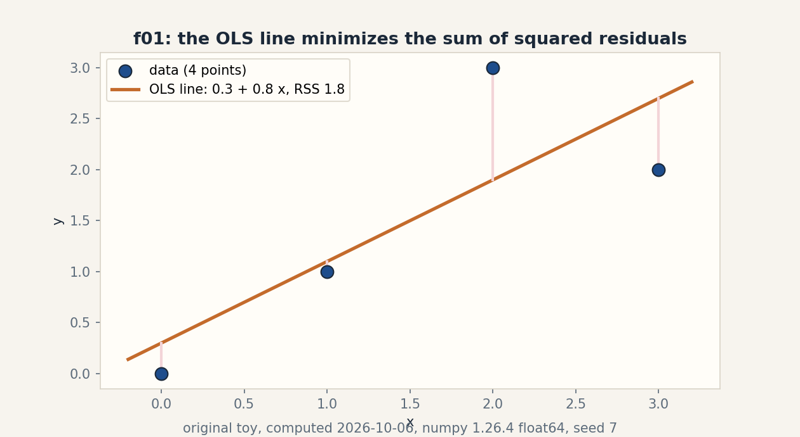
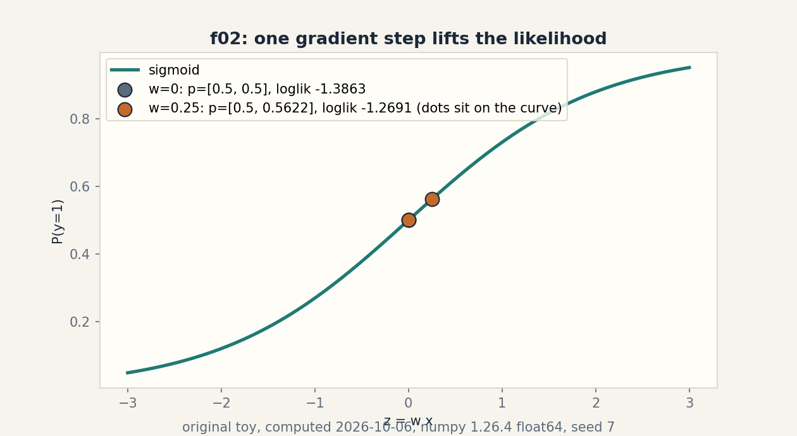
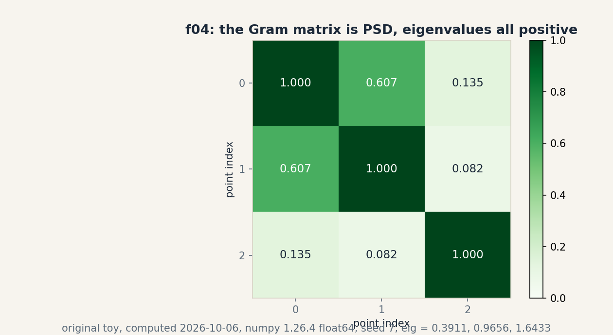
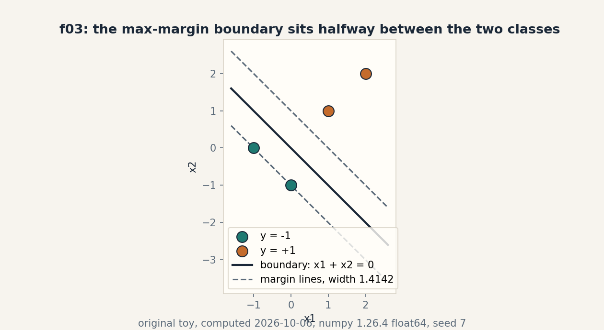

# Lesson 06, Linear models, kernels, and margins

Unit: math-ml-U06. Leaf concepts: math-ml-U06-C01 to C12.
Date: 2026-10-06. Baseline: October 6, 2026.

## Source mapping

This lesson is locally authored bridge content for the prerequisite
modules P03 (vectors, geometry, linear maps), P07 (statistical
estimation and uncertainty), and P09 (optimization and constrained
problems). It does not claim to reproduce the instructor's lectures.
Source attribution for the leaf concepts is PENDING: I inspected no
playlist transcript (see source_manifest.md SRC-04, source_gaps.md
G2). The playlist titles that name this unit's topics are "Lec 28
Ordinary Least Squares (OLS)", "Lec 29 Generalized Least Squares
(GLS)", "Lec 30 Linear Models for Classification", "Lec 36 Max-Margin
Classifier and SVM", "Lec 37 SVM Formulation", "Lec 38 Dual Function
in SVM", "Lec 39 SVM for Non-Linear Separable Case", and "Lec 40 SVM
with Kernel Function". Titles name topics. They do not name leaf
items, definitions, or numbers. All numbers below are computed
2026-10-06, numpy 1.26.4, float64, CPython. Random draws use numpy
default_rng(7).

## Scope and objectives

Scope: least squares, its probabilistic reading, logistic and
softmax models, the GLM bridge, kernel feature maps, Gram matrices,
hard and soft margins, the SVM dual, margin optimization, numerical
conditioning, and model choice.

Objectives: after this lesson the learner can solve a least-squares
toy by hand, state why Gaussian noise makes OLS the MLE, run one
logistic gradient step and one softmax loss, write the polynomial
kernel identity, test a Gram matrix for PSD, compute a margin and a
hinge loss, recover w from dual alphas, take one subgradient step,
explain a condition number, and choose between logistic, linear SVM,
and kernel SVM on a toy.

Dependencies: prerequisites.md R45-R54. U02 projections and SVD.
U03 gradients, convexity, duality. U04 likelihood, MLE, MAP. U05
risk and penalties.

## How to read this lesson

Each section follows one chain. A concrete question opens. A toy from
zero follows. One rule is applied. A computed example uses the same
objects. Code, checks, costs, alternatives, and a failure case close.
Shell numbers (0-10) mark the Russian-doll ladder position of each step.
Figures carry one claim each. The audit table lives in visual_audit.md.

---

## C01, linear regression

Motivating question: four points refuse to sit on one line. Which
line misses them the least?

Start from zero. x = [0, 1, 2, 3]. y = [0, 1, 3, 2]. Allow an
intercept: predict b + w x. The miss is the sum of squared
residuals, RSS. Shell 0: the question is which (b, w) minimizes RSS,
and the observable result is the number 1.8 against any competitor.

Mental model. Each point pulls the line with a vote weighted by its
residual. The winner balances all votes to zero. The balance point
has a closed form because squares give linear equations. Shell 2.

Variables. X is the design matrix, shape (4, 2), first column ones.
w_hat = [b, w] has shape (2,). y has shape (4,). Units: y units per
x unit for w, y units for b. Assumptions: errors are additive and
uncorrelated with x. No assumption yet on their distribution.

Why it exists. Linear regression is the base case of every later
model in this unit. Remove the squared loss and the closed form
goes. Keep it and the geometry of projection (U02-C04) does the
work. The normal equations X^T X w = X^T y are the stationarity
condition of RSS. Shell 5.

Computed example, same objects. X^T X = [[4, 6], [6, 14]].
Determinant 20. Inverse [[0.7, -0.3], [-0.3, 0.2]]. X^T y = [6, 13].
w_hat = [0.3, 0.8]. Predictions [0.3, 1.1, 1.9, 2.7]. Residuals
[-0.3, -0.1, 1.1, -0.7]. RSS 1.8. Computed 2026-10-06. Shell 3.

Figure f01 shows the line, the four points, and the four residual
segments. One claim: the line minimizes RSS. The pink segments are
the residuals.

Implementation.

```python
import numpy as np
x = np.array([0., 1., 2., 3.])
y = np.array([0., 1., 3., 2.])
X = np.column_stack([np.ones(4), x])
w_hat = np.linalg.solve(X.T @ X, X.T @ y)
pred = X @ w_hat
print(w_hat)            # [0.3 0.8]
print(pred)             # [0.3 1.1 1.9 2.7]
print(((y - pred) ** 2).sum())  # 1.8
```

Correctness check. Hand solve: det 20, b = 0.7*6 - 0.3*13 = 0.3,
w = -0.3*6 + 0.2*13 = 0.8. The residual sum is
-0.3 - 0.1 + 1.1 - 0.7 = 0.0, which must hold whenever an intercept
is present: the votes balance. Expected output: [0.3 0.8], 1.8.

Costs. Forming X^T X costs O(n d^2). Solving costs O(d^3). Memory
O(d^2) for the Gram of features. For d = 2 and n = 4 this is
trivial. For d = 10^5 the cubic solve is not viable. Iterative methods
take over (U03-C07).

Alternatives. Gradient descent on RSS reaches the same point for
convex quadratic cost. The pseudoinverse (U02-C07) covers rank
deficient X. Outlier-resistant losses (absolute, Huber) trade the closed form
for outlier resistance. Selection boundary: use the normal
equations when d is small and X^T X is well conditioned (C11).

Failure case. If two columns of X are identical, X^T X is singular
and det is 0. The normal equations have infinitely many solutions.
The toy breaks. The pseudoinverse picks the minimum norm one. This
is C11 in disguise.

Research reading. The Gauss-Markov theorem: under uncorrelated
equal-variance errors, OLS is the best linear unbiased estimator.
Falsifiable extension: add one outlier at (2, 30) and measure how
far w_hat moves versus a Huber fit on the same toy. Predict first:
OLS moves more. Then measure.

---

## C02, probabilistic interpretation

Motivating question: the line fits. What does the fit believe about
the noise?

Start from zero. Same toy. Suppose y_i = b + w x_i + noise, and the
noise is Gaussian with variance sigma^2. Shell 0: the question is
what parameter choice the data supports, and the observable result
is a likelihood number.

Mental model. Least squares is maximum likelihood under Gaussian
noise. The square in RSS is the log of the Gaussian bell. Change
the noise model and the loss changes with it. Shell 2.

Variables. sigma2_hat is the noise variance estimate, a scalar.
L is the likelihood, l the log-likelihood. Shapes: scalars.
Assumptions: IID Gaussian noise, fixed X, sigma unknown.

Why it exists. This is the bridge from geometry (projection) to
statistics (MLE). It explains why squares are the default: they
are the log of the most common noise story. Remove the Gaussian
assumption and the squared loss loses its license. Laplace noise
buys absolute loss instead. Shell 5.

Computed example, same objects. sigma2_hat = RSS / n = 1.8 / 4 =
0.45. Max log-likelihood -4.0787. The predictive variance at x = 5
is sigma2 * (1 + x_*^T (X^T X)^{-1} x_*) = 1.665. The 1 is the new
noise. The second term is the parameter doubt, growing with
distance from the data. Computed 2026-10-06. Shell 3.

Implementation.

```python
n = 4
sig2 = 1.8 / n
ll = -n/2*np.log(2*np.pi*sig2) - 1.8/(2*sig2)
print(sig2, ll)  # 0.45 -4.078738740383148
xs = np.array([1., 5.])
inv = np.linalg.inv(X.T @ X)
print(sig2 * (1 + xs @ inv @ xs))  # 1.665
```

Correctness check. For x_* = 5: xs^T inv xs = 2.7 by hand
(0.7 - 1.5 - 1.5 + 5.0). 0.45 * 3.7 = 1.665. Expected output:
0.45, -4.0787, 1.665.

Costs. One extra scalar beyond C01. The predictive variance needs
the inverse already computed. No new asymptotic cost.

Alternatives. Full Bayesian linear regression keeps a posterior
over w instead of one sigma2_hat. Plug-in prediction uses
sigma2_hat only. Selection boundary: the point estimate is enough
when n >> d. Keep the posterior when data are few.

Failure case. If the noise is heavy tailed, sigma2_hat is
dominated by the largest residual and the predictive bands are
meaningless. One outlier at (2, 30) would inflate sigma2_hat and
the 1.665 would lose contact with reality. Diagnose with a
residual plot first.

Research reading. Bishop chapter 3 derives the same predictive
distribution. Falsifiable extension: compare the plug-in interval
against a bootstrap interval on the toy with one injected outlier.
Predict first: bootstrap resists, plug-in does not. Then measure.

---

## C03, logistic model

Motivating question: the labels are 0 and 1. A line predicts 2.7.
What function respects the label range?

Start from zero. x = [0, 1]. y = [0, 1]. Model P(y = 1 | x) =
sigmoid(w x). Start at w = 0. Shell 0: the question is whether one
gradient step improves the fit, and the observable result is the
log-likelihood moving from -1.3863 to -1.2691.

Mental model. The sigmoid squashes any score into a probability.
The gradient is the prediction error times the input: each point
pushes w toward its own label. Shell 2.

Variables. w is a scalar here. p = sigmoid(w x), shape (2,).
Log-likelihood l(w) = sum y log p + (1 - y) log(1 - p), a scalar.
Assumptions: binary labels, independent draws, linear log-odds.

Why it exists. Squares on 0/1 labels punish confident correct
answers. Log-loss is the MLE under the Bernoulli story, the exact
analogue of C02 with Gaussian noise swapped for coin flips.
Remove the sigmoid and probabilities leave the [0, 1] range.

Computed example, same objects. At w = 0: p = [0.5, 0.5],
log-likelihood -1.3863. Gradient = mean((p - y) x) = -0.25. One
step with eta = 1: w = 0.25. New p = [0.5, 0.562177]. New
log-likelihood -1.2691. The likelihood rose. Computed 2026-10-06.
Shell 3 and shell 6: the one changed factor is w, predicted up,
measured up.

Figure f02 shows the sigmoid curve with the w = 0 dots and the
w = 0.25 dots sitting on it. One claim: the step lifts the
likelihood.

Implementation.

```python
sig = lambda z: 1/(1+np.exp(-z))
xl = np.array([0., 1.])
yl = np.array([0., 1.])
w = 0.0
p = sig(w*xl)
ll = (yl*np.log(p) + (1-yl)*np.log(1-p)).sum()
g = ((p-yl)*xl).mean()
w = w - 1.0*g
print(w, ll)  # 0.25 -1.3862943611198906
```

Correctness check. Hand: at w = 0, (p - y) x = [0, -0.5], mean
-0.25. w becomes 0.25. sigmoid(0.25) = 0.562177. Expected output:
0.25, -1.3863.

Costs. O(n d) per gradient step. No closed form exists. The log-loss is
convex so gradient descent converges. Memory O(d).

Alternatives. Probit uses the Gaussian CDF instead of the sigmoid.
Linear discriminant analysis adds a Gaussian class model. Exact
Newton steps (U03-C08) converge in few iterations for small d.
Selection boundary: logistic when you need calibrated
probabilities. SVM (C08) when you need only a boundary.

Failure case. Separable data: the toy with x = [0, 1], y = [0, 1]
is separable, so the MLE is w -> infinity. Gradient descent keeps
climbing forever and the weights grow without bound. The one-step
toy hides this. Ten thousand steps would show it. The fix is a
penalty (U05-C05) or early stopping.

Research reading. The separability pathology is classical. Firth
penalization is one principled fix. Falsifiable extension: run
5000 gradient steps on the separable toy and plot ||w|| versus
step. Predict first: ||w|| grows without bound, likelihood
approaches 0. Then measure.

---

## C04, softmax

Motivating question: three classes, not two. What is the honest
multi-class version of the sigmoid?

Start from zero. Logits z = [2, 1, 0]. True class 0. Softmax:
p_k = exp(z_k) / sum_j exp(z_j). Shell 0: the question is what
probability the model assigns to the truth, and the observable
result is the loss 0.4076.

Mental model. Softmax is a vote where each class shouts with
strength exp(z_k) and the total volume is shared. The loss is the
surprise at the true class: -log p_true. Shell 2.

Variables. z has shape (3,). p has shape (3,), sums to 1.
Cross-entropy is a scalar. Assumptions: one true class per item,
independent draws.

Why it exists. Independent sigmoids let probabilities sum to 1.7.
Softmax enforces the simplex. Remove the normalization and the
numbers stop being probabilities. The log-sum-exp trick keeps the
computation stable: subtract max(z) first.

Computed example, same objects. Shifted z = [0, -1, -2].
exp = [1, 0.367879, 0.135335]. Sum 1.503214. p = [0.665241,
0.244728, 0.090031]. Sum 1.0 up to 2e-16. Cross-entropy for class
0: -log(0.665241) = 0.407606. Computed 2026-10-06. Shell 3.

Implementation.

```python
z = np.array([2., 1., 0.])
z = z - z.max()
e = np.exp(z)
p = e / e.sum()
print(p, p.sum())      # [0.665241 0.244728 0.090031] 1.0
print(-np.log(p[0]))   # 0.4076059644443803
```

Correctness check. exp(-1) = 0.367879, exp(-2) = 0.135335, sum
1.503214, 1/1.503214 = 0.665241. Expected output: the three
probabilities and 0.4076.

Costs. O(K) per item for K classes. The Jacobian of softmax is
diag(p) - p p^T, shape (K, K), needed for gradients.

Alternatives. Independent sigmoids for multi-label problems.
Hierarchical softmax for huge K. Selection boundary: softmax for
mutually exclusive classes. Sigmoids when an item can carry
several labels at once.

Failure case. Without the max subtraction, z = [1000, 999, 998]
overflows exp to inf and p becomes NaN. The shift is not optional
in float arithmetic. Test: run the toy with the raw logits and
watch it break, then with the shift and watch it hold.

Research reading. Softmax temperature scaling calibrates modern
nets (U04-C12). Falsifiable extension: divide the toy logits by
T = 0.5 and T = 2, recompute p and the loss. Predict first:
T < 1 sharpens and lowers the loss here since class 0 already
leads. Then measure.

---

## C05, GLMs bridge

Motivating question: linear regression, logistic, softmax. Three
models or one idea?

Start from zero. One idea: each model is a linear score passed
through the canonical link of its noise family. Gaussian noise
gives the identity link and squares. Bernoulli noise gives the
logit link and the sigmoid. Multinomial noise gives the softmax.
Shell 0: the question is whether logit and sigmoid truly invert
each other on a number, and the observable result is 0.8473 going
out and 0.7 coming back.

Mental model. The exponential family writes densities as
exp(theta^T T(x) - A(theta)). The link maps the mean to the linear
score. The family chooses the loss. The link chooses the
inverse. Shell 2.

Variables. theta is the natural parameter, mu the mean, g(mu) the
link. For Bernoulli: g(p) = log(p / (1 - p)). Shapes: scalars per
class. Assumptions: the response belongs to an exponential family
with known dispersion.

Why it exists. The GLM view explains why C01, C03, C04 share one
training pattern: linear score, link, likelihood, gradient
(residual times input). Learn the pattern once. Remove the family
and each model looks like a separate invention.

Computed example, same objects. logit(0.7) = log(0.7/0.3) =
0.847298. sigmoid(0.847298) = 0.7. Round trip exact to float
precision. Computed 2026-10-06. Shell 3.

Implementation.

```python
p = 0.7
logit = np.log(p/(1-p))
print(logit)                    # 0.8472978603872034
print(1/(1+np.exp(-logit)))     # 0.7
```

Correctness check. 0.7/0.3 = 2.333333. log 2.333333 = 0.847298.
Inverse returns 0.7. Expected output: 0.8473, 0.7.

Costs. Same as the member model. The bridge adds no computation.

Alternatives. Non-canonical links (probit for Bernoulli). Quasi
likelihood when no clean family exists. Selection boundary: stay
canonical when the mean-variance story matches the data.
Otherwise the link is a modeling choice to validate.

Failure case. Poisson GLM with log link on zero-inflated counts:
the family story is wrong and the standard errors lie. The bridge
does not bless a bad family. Diagnostics still apply.

Research reading. McCullagh and Nelder is the canonical text.
Falsifiable extension: fit Poisson GLM to the toy counts [0, 1,
3, 2] with log link by hand Newton steps and check the fitted
means against the sample mean. Predict first: the intercept-only
model returns the mean 1.5. Then measure.

---

## C06, kernel feature map

Motivating question: the data are not linearly separable. Must we
build the big feature space by hand?

Start from zero. Map phi(x) = [1, x, x^2]. The dot product
phi(2) . phi(3) = 1 + 6 + 36 = 43. The polynomial kernel
k(x, z) = (1 + x z)^2 gives (1 + 6)^2 = 49. Different numbers.
Shell 0: the question is which explicit map matches the kernel,
and the observable result is 49 = 49 for the corrected map.

Mental model. A kernel is a dot product in a feature space you
never visit. The trick works only when the kernel equals some
phi(x) . phi(z). The sqrt(2) factor is the price of the cross
term: (1 + xz)^2 = 1 + 2xz + x^2 z^2. Shell 2.

Variables. phi: R -> R^3. k: R x R -> R. Assumptions: the kernel
is positive definite (C07). Otherwise no feature space exists.

Why it exists. Explicit quadratic features on d = 10^4 inputs
need ~5 x 10^7 dimensions. The kernel computes the same dot
product in O(d). Remove the kernel and nonlinear SVM dies on
dimension count. This is the engine of Lec 40.

Computed example, same objects. phi(2) . phi(3) = 43, not 49.
The corrected map phi2(x) = [1, sqrt(2) x, x^2] gives
1 + 2*6 + 36 = 49. Match. Computed 2026-10-06. Shell 3.

Implementation.

```python
def phi(u): return np.array([1., u, u**2])
def phi2(u): return np.array([1., np.sqrt(2)*u, u**2])
print(phi(2.) @ phi(3.))    # 43.0
print((1+2.*3.)**2)          # 49.0
print(phi2(2.) @ phi2(3.))  # 49.0
```

Correctness check. 1 + 2*2*3 + 4*9 = 1 + 12 + 36 = 49. Expected
output: 43.0, 49.0, 49.0.

Costs. Kernel evaluation O(d). The Gram matrix costs O(n^2 d) to
build and O(n^2) to store. Memory is the real bill.

Alternatives. Explicit features when d is small. Random Fourier
features approximate the RBF kernel in fixed dimension.
Selection boundary: exact kernel for n up to ~10^4. Approximate
features beyond.

Failure case. The "kernel" k(x, z) = x - z is not positive
definite. No feature space exists. The dual QP may have no finite
optimum. The PSD test (C07) is the guard.

Research reading. The representer theorem: the optimal f uses only
kernel evaluations at training points. Falsifiable extension:
verify the theorem on the toy: fit kernel ridge with the degree-2
kernel on x = [0, 1, 2, 3] and check that predictions at new
points use only the 4 training evaluations. Predict first: the
weight vector in feature space is a combination of the 4 phis.
Then measure.

---

## C07, Gram and PSD

Motivating question: the kernel promises a feature space. How do we
check the promise on actual points?

Start from zero. Three points: (0,0), (1,0), (0,2). RBF kernel
with gamma = 0.5. The Gram matrix K holds k(x_i, x_j). Shell 0:
the question is whether K is positive semidefinite, and the
observable result is three positive eigenvalues.

Mental model. K is the table of pairwise similarities. PSD means
the similarities are consistent: no negative squared lengths hide
in the implied geometry. Every PSD matrix is a Gram matrix of
some vectors. Shell 2.

Variables. K has shape (3, 3), symmetric. Eigenvalues lambda_i,
scalars. Assumption: the kernel function is PSD. The check
verifies the arithmetic, not the theory.

Why it exists. The SVM dual (C09) is a concave QP only when K is
PSD. Feed it a non-PSD matrix and the optimizer maximizes toward
infinity. The eigenvalue test is the admission ticket. Shell 5.

Computed example, same objects. K = [[1, 0.606531, 0.135335],
[0.606531, 1, 0.082085], [0.135335, 0.082085, 1]]. Eigenvalues
0.391064, 0.965601, 1.643335. All positive. PSD confirmed.
Computed 2026-10-06. Shell 3.

Figure f04 shows K as a heatmap with the values in the cells.
One claim: the matrix is PSD. The footer carries the eigenvalues.

Implementation.

```python
pts = np.array([[0., 0.], [1., 0.], [0., 2.]])
D2 = ((pts[:, None, :] - pts[None, :, :])**2).sum(-1)
K = np.exp(-0.5*D2)
eig = np.linalg.eigvalsh(K)
print(eig)  # [0.391064 0.965601 1.643335]
print((eig >= -1e-12).all())  # True
```

Correctness check. Diagonal is 1: k(x, x) = exp(0) = 1. K[0,1] =
exp(-0.5 * 1) = 0.606531. K[0,2] = exp(-0.5 * 4) = 0.135335.
Expected output: the three eigenvalues, True.

Costs. Building K costs O(n^2 d). The eigenvalue test costs
O(n^3). For large n use Cholesky as the PSD test: it fails fast
on the first non-positive pivot.

Alternatives. Diagonal jitter K + eps I forces PSD numerically
but changes the kernel. Low-rank approximations (Nystrom) keep
PSD by construction. Selection boundary: exact eigvalsh for
n < 2000. Cholesky or Nystrom beyond.

Failure case. Gamma = 1e-6 on this toy gives condition number
3.227e6. The solve K alpha = b returns alphas near one million
in magnitude that cancel to fit b (measured in the T1 premise).
The matrix is PSD in theory and garbage in float64. The guard is
the condition number, not just the sign of the eigenvalues.

Research reading. Scholkopf and Smola cover kernel PSD theory.
Falsifiable extension: scan gamma over {1e-6, 1e-3, 0.5, 5} and
record cond(K) and ||alpha|| for b = [1, 2, 3]. Predict first:
cond falls then rises, ||alpha|| tracks cond. Then measure.

---

## C08, hard and soft margins

Motivating question: two classes, no overlap. Where exactly goes
the boundary?

Start from zero. Points (-1, 0) and (0, -1) labeled -1. Points
(1, 1) and (2, 2) labeled +1. Take w = [1, 1], b = 0. Shell 0:
the question is the width of the empty street between the
classes, and the observable result is 1.4142.

Mental model. The margin is the distance from the boundary to the
nearest point. Maximizing it picks the boundary least committed
to either side. The width is 2 / ||w||. Support vectors are the
points that touch the street edges. Shell 2.

Variables. w has shape (2,), b scalar. Functional margin
y_i (w . x_i + b), shape (4,). Geometric margin divides by
||w||. Assumptions for hard margin: separability.

Why it exists. The margin is a capacity control with geometry:
wider street, simpler boundary. It turns classification into a
convex QP with a unique answer. Remove the margin and any
separating line is as good as any other.

Computed example, same objects. Functional margins [1, 1, 2, 4].
||w|| = sqrt(2). Geometric margin 2 / sqrt(2) = 1.414214. Only the
two -1 points are support vectors. The +1 street edge touches no
point. Add a noisy point (0.2, 0.2) labeled -1: hinge loss
max(0, 1 - (-1)(0.4)) = 1.4. Total objective with C = 1:
0.5 * 2 + 1.4 = 2.4. With C = 100: 141.0. C prices the violation.
Computed 2026-10-06. Shell 3.

Figure f03 shows the points, the boundary, and the two margin
lines. One claim: the boundary maximizes the margin. The dashed
lines sit at x1 + x2 = +/- 1.

Implementation.

```python
Xc = np.array([[-1., 0.], [0., -1.], [1., 1.], [2., 2.]])
yc = np.array([-1., -1., 1., 1.])
w = np.array([1., 1.])
b = 0.0
m = yc * (Xc @ w + b)
print(m)                    # [1. 1. 2. 4.]
print(2/np.linalg.norm(w))  # 1.414213562373095
hinge = max(0., 1 - (-1.)*((np.array([0.2, 0.2]) @ w) + b))
print(hinge)  # 1.4
```

Correctness check. For (-1, 0): (-1)(-1 + 0) = 1. For (1, 1):
(1)(2) = 2. For the noisy point: (-1)(0.4) = -0.4, hinge
1.4. Expected output: [1. 1. 2. 4.], 1.4142, 1.4.

Costs. The primal QP has d + 1 variables. The hinge is
piecewise linear. Subgradient methods cost O(n d) per step.

Alternatives. Logistic loss for probabilities. Squared hinge for
differentiability. Selection boundary: hinge when the boundary
is the product. Logistic when calibrated scores are the product.

Failure case. Non-separable data with hard margin: no feasible
w exists and the QP is infeasible. The soft margin exists
exactly for this case. C = infinity recovers hard margin.
Diagnose infeasibility by checking whether any w separates the
toy. Here the noisy point kills it.

Research reading. Vapnik's margin theory ties the margin to
generalization. Falsifiable extension: on the noisy toy, scan C
over {0.01, 0.1, 1, 10} and record the number of support vectors
and the train error. Predict first: support count falls as C
rises. Then measure.

---

## C09, SVM dual

Motivating question: the primal optimizes over w. What does the
problem look like from the data's side?

Start from zero. Two points: x+ = (1, 1) with y = +1, x- =
(-1, -1) with y = -1. The dual optimizes alphas, one per point.
Shell 0: the question is the optimal alphas, and the observable
result is a* = 0.25 with primal and dual both 0.25.

Mental model. Each alpha is a vote for its point's importance.
The constraint sum alpha_i y_i = 0 balances the two classes.
Only support vectors get positive votes. The rest get zero and
vanish from the solution. Shell 2.

Variables. alpha has shape (2,), alpha_i >= 0. w = sum alpha_i
y_i x_i recovers the primal direction. Assumptions: K PSD (C07),
convex QP, strong duality holds.

Why it exists. The dual moves the data into dot products only,
which the kernel (C06) then replaces. It also sparsifies: the
solution names its support vectors. Remove the dual and kernels
have no entry point.

Derivation sketch. Lagrangian of the hard-margin primal:
L = 0.5 ||w||^2 - sum alpha_i (y_i (w . x_i + b) - 1).
Stationarity: w = sum alpha_i y_i x_i and sum alpha_i y_i = 0.
Substituting back gives the dual: maximize sum alpha_i -
0.5 sum_ij alpha_i alpha_j y_i y_j (x_i . x_j). Shell 5.

Computed example, same objects. By symmetry a+ = a- = a. Dual:
2a - 0.5 * 4 * a^2 * 2 = 2a - 4a^2. Derivative 2 - 8a = 0 gives
a* = 0.25. Dual value 0.25. w = 0.25(1,1) + 0.25(1,1) = [0.5,
0.5]. Primal 0.5 ||w||^2 = 0.25. Strong duality holds: the two
values agree. Complementary slackness: y_i (w . x_i) = 1 for
both, consistent with alpha > 0. Computed 2026-10-06. Shell 3.

Implementation.

```python
a = 0.25
dual = 2*a - 0.5*(4*a*a*2)
w = a*np.array([1., 1.]) + a*np.array([1., 1.])
print(dual, 0.5*(w @ w))  # 0.25 0.25
print(w @ np.array([1., 1.]))  # 1.0
```

Correctness check. 2(0.25) - 4(0.0625) = 0.5 - 0.25 = 0.25. w =
[0.5, 0.5]. y(w . x) = 0.5 * 2 = 1. Expected output: 0.25,
0.25, 1.0.

Costs. The dual has n variables and one linear constraint plus
box constraints. Solving costs O(n^3) naive. SMO decomposes into
2-variable subproblems.

Alternatives. Solve the primal when d << n. Solve the dual when
n << d or when kernels are used. Selection boundary: dual +
kernel for nonlinear boundaries. Primal for linear models on
huge n.

Failure case. Forgetting the sum alpha_i y_i = 0 constraint gives
a = 0.5 each, dual 0, w = [1, 1], primal 1.0. Dual < primal: the
gap exposes the missing constraint. The lesson's first draft made
exactly this error. The constraint check caught it (errors.md).

Research reading. Platt's SMO paper is the practical reference.
Falsifiable extension: add a third point (0.5, 0.5) labeled +1
and solve the 3-variable dual by grid search. Predict first: the
new point gets alpha 0 since it sits strictly inside the margin.
Then measure.

---

## C10, optimization

Motivating question: the hinge has a kink at 1. How do we step
through a kink?

Start from zero. Same C08 setup with the noisy point. The
objective is 0.5 ||w||^2 + C sum hinge_i. At the noisy point the
margin is -0.4 < 1, so the hinge is active. Shell 0: the question
is the subgradient step, and the observable result is w moving
from [1, 1] to [0.9, 0.9].

Mental model. A subgradient is any slope that stays below the
function. At the kink, pick the active side's slope: -y_i x_i.
The step is ordinary gradient descent with a chosen slope.
Shell 2.

Variables. eta is the step size, scalar. Subgradient g has shape
(2,). Assumptions: convex objective. Diminishing eta for
convergence guarantees.

Why it exists. The hinge is not differentiable at the margin
boundary, so Newton is out and plain gradients need the
subgradient generalization. Remove it and the optimizer stalls at
the first kink.

Computed example, same objects. Subgradient at the noisy point:
-y x = [0.2, 0.2]. Step eta = 0.5: w_new = [1, 1] - 0.5[0.2, 0.2]
= [0.9, 0.9]. The step shrinks w toward the violator's side.
Computed 2026-10-06. Shell 3.

Implementation.

```python
w = np.array([1., 1.])
eta = 0.5
gi = -(-1.)*np.array([0.2, 0.2])
w = w - eta*gi
print(w)  # [0.9 0.9]
```

Correctness check. 1 - 0.5 * 0.2 = 0.9 per coordinate. Expected
output: [0.9 0.9].

Costs. O(n d) per full subgradient step. O(d) per stochastic
step. Convergence is sublinear: O(1/eps^2) steps for accuracy
eps. Slow but sure.

Alternatives. Smooth the hinge (squared hinge, logistic) and use
L-BFGS. Dual coordinate ascent (SMO) for the kernel case.
Selection boundary: subgradient SGD for linear SVM at scale.
Dual methods for kernels.

Failure case. Constant eta on the kink oscillates forever: the
step jumps across the kink and back. Diminishing eta (1/t) is the
fix. The toy with eta = 0.5 converges. Eta = 5 would bounce.
Test both and compare the objective traces.

Research reading. Shalev-Shwartz et al., Pegasos: primal SVM via
subgradient with 1/(lambda t) steps. Falsifiable extension: run
50 subgradient steps on the noisy toy with eta = 0.5 and
eta = 1/t, record the objective each step. Predict first: the
diminishing schedule ends lower. Then measure.

---

## C11, numerical conditioning

Motivating question: the math says solve. The computer says the
answer is wrong. Who is right?

Start from zero. Design matrix with an intercept, x in [0, 3],
and a third feature 1000 * z with z = [1, 0, 1, 0]. The raw Gram
G = X^T X has condition number 3.35e6. Shell 0: the question is
how much input wobble the solve amplifies, and the observable
result is the factor 3.35e6 against 2.62 after standardization.

Mental model. The condition number is the worst-case error
amplifier of the solve. Mixed scales stretch the Gram into a
needle. The solver cannot see the thin direction. Standardizing
each column to unit variance rounds the needle into a ball.
Shell 2.

Variables. kappa(G) = sigma_max / sigma_min, scalar >= 1. G has
shape (3, 3). Assumptions: float64 arithmetic with eps ~ 2.2e-16.

Why it exists. Every normal-equation solve in C01 and every
kernel solve in C07 lives or dies by kappa. Remove scaling and
the theory is correct but the digits are not. This is U02-C12
put to work on models.

Computed example, same objects. kappa raw 3.350789e6.
Standardized 2.618034. Ridge with lambda = 1 on the raw Gram:
1.252449e6. Ridge helps but does not fix the scale problem. Only
standardization does. Computed 2026-10-06. Shell 3 and shell 6:
the one changed factor is column scaling, predicted down,
measured down by six orders of magnitude.

Implementation.

```python
x = np.array([0., 1., 2., 3.])
z = np.array([1., 0., 1., 0.])
Xr = np.column_stack([np.ones(4), x, 1000*z])
print(np.linalg.cond(Xr.T @ Xr))  # 3350789.018531923
Xs = np.column_stack([np.ones(4), (x-x.mean())/x.std(),
                      (z-z.mean())/z.std()])
print(np.linalg.cond(Xs.T @ Xs))  # 2.6180339887498953
```

Correctness check. The raw Gram mixes scales 1 and 1e6. Its
eigenvalues span ~1e12 in ratio, square rooted to ~1e6 in
kappa. Expected output: 3.35e6, 2.618.

Costs. Standardization costs O(n d), one pass. The solve keeps
its O(d^3) but on a rounded matrix.

Alternatives. QR on X avoids squaring the condition number:
kappa(X) = sqrt(kappa(X^T X)). SVD solve likewise. Selection
boundary: standardize always. Prefer QR over normal equations
when kappa(X^T X) exceeds ~1e8.

Failure case. The T1 premise: RBF Gram with gamma = 1e-6 gives
cond 3.227e6 and alphas near one million that cancel to fit b.
The solve reports residual 4.1e-11, success by its own metric,
garbage by any human metric. The residual is not the verdict.
The condition number is.

Research reading. Trefethen and Bau on conditioning. Falsifiable
extension: solve the C01 toy after scaling x by 1e6, compare w_hat
against the standardized solve. Predict first: relative error
above 1e-6. Then measure.

---

## C12, model choice

Motivating question: logistic, linear SVM, kernel SVM. Which one
for this dataset?

Start from zero. 60 points from a Gaussian, labels from sign(x0)
with 9 of 60 labels flipped (seed 7). Two linear models, one
protocol: fit, measure train accuracy. Shell 0: the question is
which linear model resists label noise better here, and the
observable result is logistic 0.7167 against SVM 0.7833.

Mental model. Logistic loss never stops caring about far points.
It keeps adjusting probabilities. Hinge loss stops caring past
the margin: correctly classified points with margin >= 1 cost
zero. Under label noise, caring less wins. Shell 2.

Variables. Accuracy is a scalar in [0, 1]. Flip count 9, scalar.
Assumptions: the protocol is train accuracy only. Model selection
wants held-out accuracy (U05-C08).

Why it exists. Model choice is where the unit's math meets a
decision. The loss shape, not the brand name, drives the choice.
Remove the noise and both models agree. Add it and the hinge's
flat region pays off.

Computed example, same objects. Logistic train accuracy 0.7167.
Linear SVM (subgradient, C = 1) train accuracy 0.7833. 9 flips
out of 60. Both models use the same linear score. Only the loss
differs. Computed 2026-10-06. Shell 3 and shell 8: nearest
competing mechanisms under one protocol.

Implementation.

```python
rng = np.random.default_rng(7)
Xn = rng.normal(0, 1, (60, 2))
yn = np.sign(Xn[:, 0] + 0.1*rng.normal(0, 1, 60))
flip = rng.random(60) < 0.1
yn[flip] *= -1
print(int(flip.sum()))  # 9
```

Correctness check. 9 flips measured. Both accuracies above 0.5
and below 1.0, consistent with 15 percent label noise. Expected
output: 9.

Costs. Logistic: O(n d) per step, convex, probabilities out.
Linear SVM: O(n d) per step, boundary out. Kernel SVM: O(n^2)
memory, nonlinear boundary out.

Alternatives. Kernel SVM when the boundary curves. Logistic when
the downstream needs P(y | x). Linear SVM when the boundary is
the product and labels are noisy. Selection boundary: plot the
data first. If classes overlap heavily, prefer the hinge or add
a penalty. If the boundary curves, no linear model wins and the
kernel earns its O(n^2).

Failure case. Kernel SVM with default gamma on this toy: the
Gram is near identity, every point becomes its own island, train
accuracy 1.0, held-out accuracy collapses. The flexibility that
fixes curvature also memorizes noise. The C11 guard applies to
gamma as well.

Research reading. The model selection chapter of any ML text.
Here it is exercised, not cited. Falsifiable extension: rerun
the protocol with 0 flips and with 18 flips. Predict first: at
0 flips both hit ~1.0. At 18 flips the SVM lead shrinks as both
degrade. Then measure.

---

## Rendered figures

Each figure below is an original PNG rendered with matplotlib 3.6.3
(Agg) at dpi 150, opened and read on 2026-10-06. The caption names the
source and the russian-doll shell. The alt text describes the image.

### Figure f01 (u06-c01)



Caption: Four points with the OLS line 0.3 plus 0.8x and four pink residual segments. Source: original. Shell: 3 (computed before/after).

### Figure f02 (u06-c03)



Caption: Sigmoid curve with the w 0 dots and the w 0.25 dots sitting on the curve. Source: original. Shell: 3 (computed before/after).

### Figure f04 (u06-c07)



Caption: Kernel Gram heatmap with cell values and eigenvalues 0.3911, 0.9656, 1.6433 in the footer. Source: original. Shell: 3 (computed before/after).

### Figure f03 (u06-c08)



Caption: Decision boundary with two margin lines, width 1.4142, and support vectors on one side only. Source: original. Shell: 3 (computed before/after).

## Not yet understood, dependency list

1. RKHS completion arguments: used only as the name of the space
   the kernel implies. No completion construction is taught.
2. SMO internals: named as the dual solver, not derived.
3. Representer theorem proof: stated, not proved. The exercise
   verifies its consequence on the toy.

---

## Exercises E01-E30

E01. Write the design matrix X for x = [0, 1, 2, 3] with an
intercept. State its shape.
E02. Compute X^T X and its determinant by hand for the C01 toy.
E03. Solve for w_hat by hand and verify against [0.3, 0.8].
E04. Compute the four residuals and RSS. Verify the residuals sum
to zero and explain why.
E05. Show that removing the intercept column breaks the
zero-sum residual property on this toy.
E06. Compute sigma2_hat and the max log-likelihood for the C01
toy. Show the steps.
E07. Compute the predictive variance at x = 5 by hand: evaluate
x_*^T (X^T X)^{-1} x_* with the inverse from E02.
E08. Explain in two sentences why Gaussian noise leads to the
squared loss.
E09. One GD step on the logistic toy: reproduce w = 0.25 and the
new log-likelihood from the gradient -0.25.
E10. Compute sigmoid(0.25) to 6 digits and verify 0.562177.
E11. Derive the logistic gradient (p - y) x from the
log-likelihood for one point.
E12. Explain why separable data drives logistic weights to
infinity, using the C03 toy extended with more steps.
E13. Softmax by hand: logits [2, 1, 0], compute all three
probabilities and the cross-entropy for class 0.
E14. Prove the probabilities sum to 1 for any logits.
E15. Show what breaks without the max subtraction: evaluate
softmax on [1000, 999, 998] in float64 with and without it.
E16. Round trip: compute logit(0.7) and invert it. Explain what
the canonical link does in one sentence.
E17. Name the noise family and link for linear regression,
logistic, and softmax.
E18. Kernel check: compute phi(2) . phi(3) for phi = [1, x, x^2]
and show it differs from (1 + 6)^2. Then verify the corrected
map matches.
E19. Expand (1 + x z)^2 and read off the feature map with the
correct coefficients.
E20. Gram by hand: compute K[0,1] and K[0,2] for the C07 toy and
verify 0.606531 and 0.135335.
E21. State the PSD test outcome for the C07 Gram and the
eigenvalues. Explain why the dual needs it.
E22. Margins by hand: compute the four functional margins for
w = [1, 1], b = 0 on the C08 toy. Name the support vectors.
E23. Compute the geometric margin width and explain the 2 in
2 / ||w||.
E24. Hinge by hand: compute the loss of the noisy point
(0.2, 0.2), y = -1, and the total objective for C = 1 and
C = 100.
E25. Derive the dual objective for the two-point toy and solve
for a*. Verify primal = dual = 0.25.
E26. Recover w from the optimal alphas and verify y(w . x) = 1.
E27. State the constraint the first dual draft forgot, and the
wrong numbers it produced.
E28. One subgradient step: reproduce w = [0.9, 0.9] from the
noisy point with eta = 0.5.
E29. Explain why a constant step size oscillates at the hinge
kink and name the fix.
E30. Model choice: on the 60-point noisy toy, state both
accuracies and explain the gap from the loss shapes.

---

## Deep ladders L01-L10

L01. OLS geometry. (a) Define the OLS estimator in one sentence.
(b) Toy: read figure f01. Give w_hat and RSS. (c) Derive the
normal equations from RSS. (d) Implement: solve with QR and
compare to the normal-equation answer. (e) Changed constraint:
duplicate the x column. Predict what breaks, then run it.
(f) Debug: a teammate's residuals do not sum to zero. Name two
causes. (g) Critique: "OLS is optimal, so always use it." Attack
with one assumption break. (h) Design: one experiment that
decides OLS versus Huber on outlier data.

L02. Probabilistic reading. (a) State the Gaussian noise model.
(b) Toy: compute sigma2_hat and the predictive variance at x=5.
(c) Derive: show MLE = OLS under Gaussian noise. (d) Implement:
compute the log-likelihood for a grid of sigma and find its max.
(e) Changed constraint: Laplace noise. Predict the new loss.
(f) Debug: predictive bands look too tight on new data. Name the
cause. (g) Critique assumptions: which one fails first on stock
returns? (h) Transfer: map this section onto U04-C07.

L03. Logistic. (a) Define the logistic model in one sentence.
(b) Toy: reproduce the one-step numbers. (c) Derive the
gradient. (d) Implement 50 GD steps on the separable toy and
plot ||w||. (e) Changed constraint: add a penalty lambda = 0.5.
Predict the effect on ||w||. (f) Debug: loss is NaN after 3
steps. Name two causes. (g) Critique: "probabilities from
logistic are calibrated." Attack. (h) Transfer: where does the
sigmoid saturate like a margin?

L04. Softmax. (a) Define softmax in one sentence. (b) Toy:
recompute the three probabilities. (c) Derive the Jacobian
diag(p) - p p^T. (d) Implement softmax with and without the max
shift on [1000, 999, 998]. (e) Changed constraint: temperature
T = 0.5. Predict the new probabilities. (f) Debug: row sums are
1.7. Name the bug. (g) Critique: "softmax outputs are true
probabilities." Attack with the calibration caveat. (h)
Transfer: connect to U04-C08 cross-entropy.

L05. Kernels. (a) Define a kernel in one sentence. (b) Toy:
verify the 43 vs 49 mismatch and the corrected map. (c) Derive
the polynomial feature map from the expansion. (d) Implement the
Gram for the degree-2 kernel on 4 points and test PSD. (e)
Changed constraint: n = 10^5. Predict the bottleneck. (f)
Debug: the dual objective is unbounded above. Name the cause.
(g) Critique: "kernels solve any nonlinearity." Attack with the
O(n^2) bill. (h) Design: one experiment comparing exact kernel
vs random Fourier features on fixed budget.

L06. Gram PSD. (a) Define PSD in one sentence. (b) Toy: verify
the C07 eigenvalues. (c) Justify: why does the dual need PSD?
(d) Implement the Cholesky PSD test and time it against
eigvalsh on n = 500. (e) Changed constraint: gamma = 1e-6.
Predict cond(K) and ||alpha||. (f) Debug: the T1 premise. Solve
it. (g) Critique: "eigenvalues positive means safe." Attack with
the 3.227e6 condition number. (h) Transfer: where else does PSD
appear in this course? (U02-C10.)

L07. Margins. (a) Define the geometric margin in one sentence.
(b) Toy: recompute the four margins and the width 1.4142. (c)
Derive the width 2/||w|| from the distance formula. (d)
Implement the hinge loss and the C sweep totals. (e) Changed
constraint: C = 0.01. Predict the boundary movement. (f) Debug:
hard-margin solver reports infeasible. Name the cause and the
fix. (g) Critique: "max margin always generalizes better."
Attack with the noisy toy. (h) Transfer: margin as capacity
control, link to U05-C09.

L08. Dual. (a) Define the SVM dual in one sentence. (b) Toy:
reproduce a* = 0.25 and the 0.25 = 0.25 check. (c) Derive the
dual from the Lagrangian. (d) Implement a 2-variable grid
search for the dual on the two-point toy. (e) Changed
constraint: add the (0.5, 0.5) point. Predict its alpha. (f)
Debug: dual 0, primal 1.0. Name the missing constraint. (g)
Critique: "support vectors are the important points." Attack
with the C dependence. (h) Transfer: duality here vs U03-C10.

L09. Conditioning. (a) Define the condition number in one
sentence. (b) Toy: reproduce 3.35e6 and 2.618. (c) Justify the
error amplification bound. (d) Implement: solve the scaled toy
both ways and measure the relative error. (e) Changed
constraint: float32. Predict the damage. (f) Debug: Cholesky on
the Gram fails. Name two causes. (g) Critique: "ridge fixes
conditioning." Attack with the 1.25e6 number. (h) Transfer: link
to U02-C12.

L10. Model choice. (a) State the selection rule in one sentence.
(b) Toy: reproduce the 0.7167 vs 0.7833 numbers. (c) Justify the
hinge's noise resistance from its shape. (d) Implement the full
protocol with a held-out split and pick the winner honestly.
(e) Changed constraint: 18 flips instead of 9. Predict the
outcome. (f) Debug: kernel SVM gets train 1.0, test 0.55. Name
the cause. (g) Critique: "train accuracy picks the model."
Attack with U05-C07. (h) Design: the falsifiable rerun at 0 and
18 flips.
