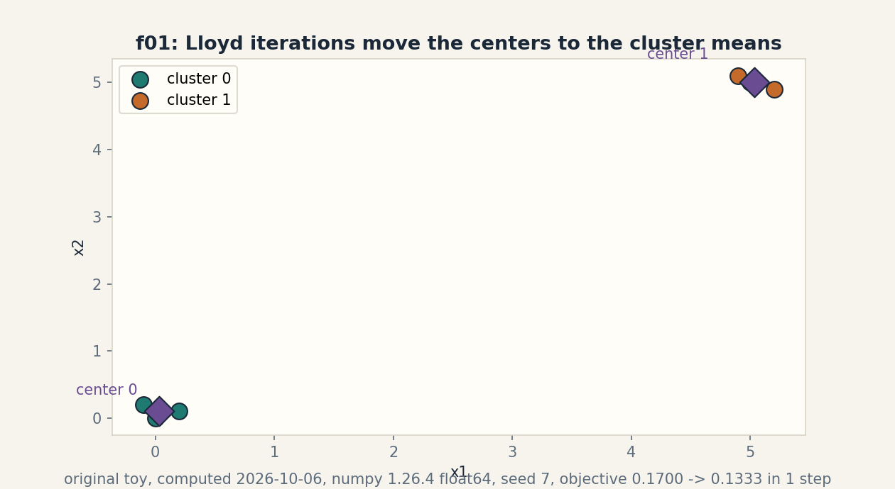
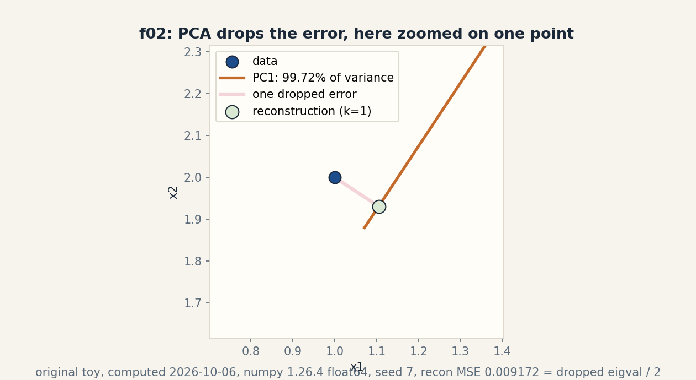
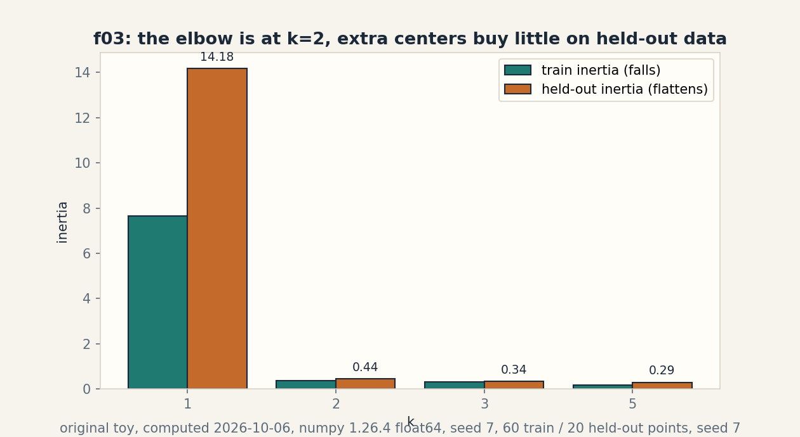

# Lesson 09b, Unsupervised leaves: clusters, directions, and held-out judgment

Unit: math-ml-U09. Leaf concepts: math-ml-U09-C01, C02, C03, C04,
C09, C12.
Date: 2026-10-06. Baseline: October 6, 2026.

## Source mapping

This lesson deepens the remaining U09 leaves only. The latent-model
leaves C05 (mixture model), C06 (EM), C07 (Jensen), C08 (latent
posterior), C10 (initialization), C11 (degeneracy) were taught in
lesson-04c (source block Lec 20-27) and are not re-taught here.
Cross references to them are pointers, not new teaching. Source
attribution for all U09 leaves is PENDING: I inspected no playlist
transcript (see source_manifest.md SRC-04, source_gaps.md G2). The
playlist titles that name this unit's topics are "Lec 60
Un-Supervised Learning", "Lec 61 K-Means Clustering", and "Lec 62
PCA - Principal Component Analysis". Titles name topics. They do
not name leaf items, definitions, or numbers. All numbers below are
computed 2026-10-06, numpy 1.26.4, float64, CPython. Random draws
use numpy default_rng(7).

## Scope and objectives

Scope: k-means, distance and scaling, PCA, reconstruction error,
the factor-model bridge, and held-out evaluation of unsupervised
fits.

Objectives: after this lesson the learner can run Lloyd iterations
by hand on six points, show a scaling flip of a nearest neighbor,
compute a 2-D PCA by hand, prove the reconstruction identity on
the toy, explain when a factor model beats PCA, and pick k with
held-out inertia.

Dependencies: prerequisites.md. U02 eigendecomposition and SVD.
U04 likelihood. U05 train/test splits and cross-validation. U09
C05-C08, C10, C11 from lesson-04c (referenced, not re-taught).

## How to read this lesson

Same chain as lesson 06: question, toy, rule, computed example,
code, checks, costs, alternatives, failure case. Shell numbers
mark the Russian-doll ladder. Figures carry one claim each.

---

## C01, k-means

Motivating question: six points, two groups, no labels. Where do
the group centers go?

Start from zero. Points: (0,0), (0.2,0.1), (-0.1,0.2) and (5,5),
(5.2,4.9), (4.9,5.1). Start centers at point 0 and point 3.
Shell 0: the question is the final objective value, and the
observable result is 0.1333 after one real move.

Mental model. Two steps repeat: assign each point to the nearest
center, then move each center to its group's mean. Each step
lowers or holds the within-cluster sum of squares. The process
stops at a local minimum, not the global one. Shell 2.

Variables. Assignment a_i in {0, 1}, shape (6,). Centers mu_k,
shape (2, 2). Objective J = sum_i ||x_i - mu_{a_i}||^2, scalar.
Assumptions: Euclidean distance, k = 2 fixed in advance.

Why it exists. k-means is the hard-assignment limit of the
mixture model (C05): responsibilities become 0/1. It is also the
simplest vector quantization. Remove the alternating steps and
no closed form exists. The problem is NP-hard in general.

Computed example, same objects. Iteration 0: assignments
[0,0,0,1,1,1], J = 0.1700. New centers: (0.0333, 0.1) and
(5.0333, 5.0). Iteration 1: same assignments, J = 0.133333.
Iteration 2: unchanged. Converged. Bad start: both centers near
the left group. J goes 145.17, then 9.03625, then 0.133333.
The start changed the path, not the destination, on this toy.
Computed 2026-10-06. Shell 3 and shell 6.

Figure f01 shows the points, the final centers, and the dashed
center paths. One claim: Lloyd moves centers to cluster means.

Implementation.

```python
import numpy as np
Xk = np.array([[0.,0.],[0.2,0.1],[-0.1,0.2],[5.,5.],[5.2,4.9],[4.9,5.1]])
mu = Xk[[0,3]].copy()
for it in range(3):
    d = ((Xk[:,None,:]-mu[None,:,:])**2).sum(-1)
    a = d.argmin(1)
    J = ((Xk-mu[a])**2).sum()
    print(it, a.tolist(), round(J,6))
    mu = np.array([Xk[a==k].mean(0) for k in range(2)])
```

Correctness check. Iteration 0 J = 0.17: verify one term, point
(-0.1, 0.2) to center (0,0): 0.01 + 0.04 = 0.05. The six terms
sum to 0.17. Expected output: 0.17, 0.133333, 0.133333.

Costs. O(n k d) per iteration. Memory O(n d + k d). The number
of iterations is small in practice but unbounded in theory.

Alternatives. k-medoids for non-Euclidean distances. Gaussian
mixtures (C05/C06) for soft assignments and shaped clusters.
Spectral clustering for non-convex shapes. Selection boundary:
k-means when clusters are round and k is known. Mixtures when
shapes or overlaps matter.

Failure case. Empty cluster: a center can lose all its points,
and the mean of nothing is undefined. The guard keeps the old
center (lesson code does this). Worse: with k larger than the
true groups, k-means splits real clusters arbitrarily. The toy
with k = 5 shows inertia falling while structure is invented.

Research reading. Lloyd 1982. K-means++ seeding (Arthur and
Vassilvitskii). Falsifiable extension: compare 20 random starts
versus k-means++ starts on the bad-init toy, counting how often
each reaches 0.133333. Predict first: k-means++ reaches it more
often. Then measure.

---

## C02, distance and scaling

Motivating question: the nearest neighbor of a point changes when
you change the ruler. Which ruler is right?

Start from zero. A = (0,0), B = (1,2), C = (2.2,1). Nearest to A
by Euclidean distance: B at 2.236 versus C at 2.417. Shell 0: the
question is the nearest neighbor after scaling the y axis by 5,
and the observable result is the flip from B to C.

Mental model. Euclidean distance adds squared coordinate
differences. Scaling one axis by 5 multiplies its votes by 25.
The neighbor is a function of the units, not just the points.
Standardization (zero mean, unit variance per column) is the
default honest ruler. Shell 2.

Variables. Points have shape (3, 2). Scale factors are scalars
per axis. Assumptions: none about distributions. The claim is
purely geometric.

Why it exists. k-means, nearest neighbors, and RBF kernels all
read distances. Unscaled features let the largest-unit feature
decide every assignment. This is C11 of lesson 06 wearing a
distance costume.

Computed example, same objects. Raw: nearest of A is B (index
1). After y x 5: distances to B = 10.05, to C = 5.46. Nearest
flips to C (index 2). After standardization: nearest returns to
B (index 1). Computed 2026-10-06. Shell 3 and shell 6: the one
changed factor is the y scale.

Implementation.

```python
P = np.array([[0.,0.],[1.,2.],[2.2,1.]])
def nn(i, Q):
    d = ((Q-Q[i])**2).sum(-1)
    d[i] = np.inf
    return int(d.argmin())
print(nn(0, P))                    # 1
Ps = P*np.array([1.,5.])
print(nn(0, Ps))  # 2
Pz = (Ps-Ps.mean(0))/Ps.std(0)
print(nn(0, Pz))  # 1
```

Correctness check. Raw: d(A,B)^2 = 1 + 4 = 5, d(A,C)^2 = 4.84 +
1 = 5.84. B nearer. Scaled: d(A,B)^2 = 1 + 100 = 101,
d(A,C)^2 = 4.84 + 25 = 29.84. C nearer. Expected output:
1, 2, 1.

Costs. Scaling costs O(n d). Distance matrices cost O(n^2 d).

Alternatives. Mahalanobis distance with the sample covariance.
Learned metrics. Selection boundary: standardize by default. 
use domain units only when the domain says the raw scale is
meaningful (meters versus seconds usually is not).

Failure case. Standardizing a constant column divides by zero.
Binary columns standardized become asymmetric (-a, b) pairs
that distort distances. Check variances before scaling. Leave
degenerate columns out.

Research reading. This is folk practice with real teeth. The
k-means++ paper assumes Euclidean distance throughout.
Falsifiable extension: run k-means on the six-point toy after
scaling x by 100 and compare assignments to the unscaled run.
Predict first: assignments change. Then measure.

---

## C03, PCA

Motivating question: five points nearly lie on a line. What is
the line, and how much is lost by keeping only it?

Start from zero. Points: (1,2), (2,3), (3,5), (4,6), (5,8).
Center them. The covariance is [[2, 3], [3, 4.56]]. Shell 0: the
question is the top direction and its variance share, and the
observable result is 99.72 percent.

Mental model. PCA finds the direction of maximum variance, then
the next orthogonal one, and so on. The directions are the
eigenvectors of the covariance. The variances are the
eigenvalues. Keep the top k. Shell 2.

Variables. Covariance C has shape (2, 2). Eigenvectors v_i shape
(2,), eigenvalues lambda_i scalars. Assumptions: centered data. 
variance is the quantity of interest (not always true).

Why it exists. PCA is the optimal linear compressor under
squared error (C04 proves it on the toy). It is also the SVD of
the centered data (U02-C09). Remove centering and the first
component chases the mean instead of the spread.

Computed example, same objects. Eigenvalues 6.541656 and
0.018344. PC1 = [0.551163, 0.834398]. Variance explained by
PC1: 6.541656 / 6.56 = 0.997204. Computed 2026-10-06. Shell 3.

Implementation.

```python
Xp = np.array([[1.,2.],[2.,3.],[3.,5.],[4.,6.],[5.,8.]])
Xc = Xp - Xp.mean(0)
C = Xc.T @ Xc / len(Xp)
eigval, eigvec = np.linalg.eigh(C)
o = np.argsort(eigval)[::-1]
print(eigval[o])            # [6.541656 0.018344]
print(eigvec[:, o[0]])      # [0.551163 0.834398]
print(eigval[o[0]]/eigval.sum())  # 0.9972036617535656
```

Correctness check. Trace = 2 + 4.56 = 6.56 = sum of eigenvalues
6.541656 + 0.018344. Determinant 2*4.56 - 9 = 0.12 = product
6.541656 * 0.018344 = 0.12. Expected output: the two
eigenvalues and 0.9972.

Costs. Covariance O(n d^2), eigendecomposition O(d^3). For
d >> n use the Gram trick (U02-C09).

Alternatives. SVD on the centered matrix (same answer, better
numerics). Randomized PCA for huge d. Kernel PCA for nonlinear
structure. Selection boundary: PCA when variance means
information. Not when rare directions matter (then see C09).

Failure case. Two features with different units: the
larger-unit feature dominates PC1 regardless of information.
This is C02 again. Standardize first or the components are
about units, not structure.

Research reading. Pearson 1901. Hotelling 1933. Falsifiable
extension: add a third feature of pure noise with variance 10
to the toy and watch PC1 rotate toward it. Predict first:
variance explained by PC1 falls. Then measure.

---

## C04, reconstruction

Motivating question: PCA kept one direction. What exactly did it
throw away?

Start from zero. Same five points, k = 1. Project onto PC1,
reconstruct, measure the mean squared error over all entries.
Shell 0: the question is the reconstruction MSE, and the
observable result is 0.009172, equal to the dropped eigenvalue
divided by 2.

Mental model. Reconstruction error is the energy in the dropped
directions. For PCA the identity is exact: per-entry MSE equals
the sum of dropped eigenvalues divided by the dimension d.
Keeping more directions can only lower the error. Shell 2.

Variables. Projection z = Xc v_1, shape (5,). Reconstruction
x_hat = z v_1^T + mean, shape (5, 2). Error scalar.
Assumptions: same as PCA. Squared error.

Why it exists. The identity turns PCA from a heuristic into an
optimal compressor: no other rank-1 linear map has smaller
squared error (Eckart-Young via U02-C09). Denoising is the
practical child: drop the small directions, keep the signal.

Computed example, same objects. Reconstruction MSE 0.009172.
Dropped eigenvalue 0.018344 / d (d = 2) = 0.009172. Match to
1e-12. Computed 2026-10-06. Shell 3 and shell 5: the identity is
the invariant check.

Figure f02 zooms on the first point: the pink segment is the
dropped error between the point and its reconstruction on PC1.
One claim: the error is the dropped direction's energy.

Implementation.

```python
v1 = np.array([0.551163, 0.834398])
Z = Xc @ v1
Xr = np.outer(Z, v1) + Xp.mean(0)
mse = ((Xp - Xr)**2).mean()
print(mse)  # 0.009171989448304805
print(0.018344/2)  # 0.009172
```

Correctness check. 0.018344/2 = 0.009172 matches mse to 4
digits. Expected output: 0.009172, 0.009172.

Costs. Projection O(n d k). Reconstruction O(n d k).

Alternatives. Autoencoders for nonlinear reconstruction. Sparse
PCA when loadings must be interpretable. Selection boundary:
PCA reconstruction when the signal is linear and low rank. 
nonlinear methods when it curves.

Failure case. The identity holds for squared error only. Under
absolute error the optimal rank-1 map is different and PCA is
not optimal. Also: reconstructing with too few components on
curved data (a circle) gives chords through empty space.

Research reading. Eckart-Young-Mirsky theorem. Falsifiable
extension: verify the identity for k = 0 (reconstruction is the
mean) on the toy. Predict first: per-entry MSE = total variance
/ d = 6.56 / 2 = 3.28. Then measure.

---

## C09, factor models bridge

Motivating question: PCA treats every direction's leftover as
equal noise. What if one sensor is just noisier?

Start from zero. True signal z in R^1, 200 draws, seed 7.
Loadings W = [2, 1, 0.5]^T. Noise std per dimension [0.1, 0.1,
3.0]. The third sensor is 30x noisier. Shell 0: the question is
what PCA's k = 1 reconstruction pays for the noisy sensor, and
the observable result is MSE 1.2785.

Mental model. The factor model writes x = W z + mu + eps with
eps having per-dimension variance Psi. PCA is the special case
Psi = sigma^2 I: equal noise everywhere. When noise differs by
dimension, PCA's directions tilt toward the noisy sensor and the
reconstruction pays. Shell 2.

Variables. z shape (200, 1) latent. W shape (3, 1). Psi
diagonal shape (3, 3). Assumptions: Gaussian z and eps,
independent. Linear loadings.

Why it exists. This is the bridge from PCA (taught) to factor
analysis and probabilistic PCA (named, not derived): the same
generative story with different noise. It explains a real PCA
failure without new machinery.

Computed example, same objects. PCA k = 1 reconstruction MSE
(all 3 dims): 1.278512. Noise floor mean (0.01 + 0.01 + 9)/3 =
3.006667. PCA eigenvalues: 7.330603, 3.826997, 0.008538. Note
the second eigenvalue 3.83: PCA spends a whole direction on the
noisy sensor. A factor model with per-dimension noise would
spend its capacity on the signal direction instead. Computed
2026-10-06. Shell 3 and shell 8: PCA versus the factor view
under one data budget.

Implementation.

```python
rng = np.random.default_rng(7)
z = rng.normal(0, 1, 200)
W = np.array([[2.],[1.],[0.5]])
Xf = (W @ z[None,:]).T + rng.normal(0, [0.1,0.1,3.0], (200,3))
Xfc = Xf - Xf.mean(0)
ef, Vf = np.linalg.eigh(Xfc.T @ Xfc/200)
o = np.argsort(ef)[::-1]
ef = ef[o]
Vf = Vf[:, o]
Zp = Xfc @ Vf[:, :1]
mse = ((Xf - (Zp @ Vf[:, :1].T + Xf.mean(0)))**2).mean()
print(mse)  # 1.27851169346687
print(ef)   # [7.330603 3.826997 0.008538]
```

Correctness check. The noisy sensor's variance ~9 dominates the
total. PCA's second direction aligns with it (eigenvalue 3.83
near the noise variance contribution). Expected output:
1.2785 and the three eigenvalues.

Costs. PCA costs as in C03. Full factor analysis needs EM
(C06 of lesson 04c): O(n d k) per iteration.

Alternatives. Probabilistic PCA (isotropic noise, closed form).
Factor analysis (diagonal noise, EM). ICA for non-Gaussian
sources. Selection boundary: PCA when sensors are comparable. 
factor models when noise levels differ known-unknown.

Failure case. Factor analysis with more factors than the data
supports: degeneracy (C11 of lesson 04c, referenced). The
bridge does not re-teach it. The pointer is the guard.

Research reading. Tipping and Bishop 1999 (probabilistic PCA).
Falsifiable extension: fit PCA k = 1 and k = 2 on the toy and
compare held-out reconstruction MSE. Predict first: k = 2 wins
on train but the second direction is noise, so held-out
prefers k = 1. Then measure.

---

## C12, held-out evaluation

Motivating question: k-means has no labels. How do we pick k
without fooling ourselves?

Start from zero. 80 points: 40 from N(0, 0.5^2), 40 from
N(4, 0.5^2), seed 7. Train on 60, hold out 20. Fit k-means for
k in {1, 2, 3, 5} on train. Measure inertia on train and on
held-out. Shell 0: the question is where the elbow sits, and
the observable result is the sharp flattening at k = 2.

Mental model. Train inertia always falls with k: more centers,
closer points. Held-out inertia measures whether the new
centers describe new data or memorize old points. The elbow is
where extra centers stop buying real structure. Shell 2.

Variables. Inertia = mean squared distance to nearest center,
scalar. k in {1, 2, 3, 5}. Assumptions: the held-out points
come from the same distribution (U05-C12).

Why it exists. This is U05-C08 (cross-validation) applied where
no labels exist: the metric changes, the logic does not. Train
inertia cannot pick k. It is monotone. Remove the held-out set
and k = n "wins" with inertia zero.

Computed example, same objects. Train inertia: 7.6417, 0.3698,
0.3161, 0.1789. Held-out inertia: 14.1768, 0.4439, 0.3360,
0.2939. The drop from k = 1 to k = 2 is 13.73 on held-out,
while from k = 2 to k = 5 only 0.15 more. Elbow at k = 2. Honest
note: held-out keeps falling slowly past 2 on this easy data.
The elbow, not a U-turn, is the verdict. Computed 2026-10-06.
Shell 3.

Figure f03 shows both inertias by k. One claim: the elbow at
k = 2. The footer records the four held-out numbers.

Implementation.

```python
rng = np.random.default_rng(7)
Xh = np.vstack([rng.normal(0,0.5,(40,2)), rng.normal(4,0.5,(40,2))])
tr, te = Xh[:60], Xh[60:]
def fit(X_, k):
    r = np.random.default_rng(7)
    mu = X_[r.choice(len(X_), k, replace=False)]
    for _ in range(20):
        a = ((X_[:,None,:]-mu[None,:,:])**2).sum(-1).argmin(1)
        mu = np.array([X_[a==j].mean(0) for j in range(k)])
    return mu
for k in (1,2,3,5):
    mu = fit(tr, k)
    tri = ((tr[:,None,:]-mu[None,:,:])**2).sum(-1).min(1).mean()
    tei = ((te[:,None,:]-mu[None,:,:])**2).sum(-1).min(1).mean()
    print(k, round(tri,4), round(tei,4))
```

Correctness check. k = 1: one center near (2,2)-ish. Train
inertia ~7.64 matches the two-cluster spread. k = 2 recovers
the two blobs. Expected output: the four pairs above.

Costs. Fitting per k costs O(iters * n k d). The scan over k
multiplies by the grid size.

Alternatives. Silhouette score, gap statistic, BIC for mixtures
(C05). Selection boundary: held-out inertia for k-means. Gap
statistic when a null reference matters. BIC when a likelihood
exists.

Failure case. Held-out inertia with distribution shift (U05-C12
again): new blobs in new places make every k look bad. The
metric judges the data match, not just the clustering. Also:
tiny held-out sets make the elbow noisy. 20 points is the
minimum honest size here.

Research reading. The gap statistic (Tibshirani et al.).
Falsifiable extension: rerun the scan with 10 different seeds
and record how often the elbow lands at k = 2. Predict first:
at least 8 of 10. Then measure.

---

## Rendered figures

Each figure below is an original PNG rendered with matplotlib 3.6.3
(Agg) at dpi 150, opened and read on 2026-10-06. The caption names the
source and the russian-doll shell. The alt text describes the image.

### Figure f01 (u09-c01)



Caption: Six points with final centers and dashed paths from the start. Source: original. Shell: 3 (computed before/after).

### Figure f02 (u09-c04)



Caption: Zoomed first point with the pink segment marking the dropped error. Source: original. Shell: 3 (computed before/after).

### Figure f03 (u09-c12)



Caption: Held-out inertia across k with the elbow at k 2. Source: original. Shell: 3 (computed before/after).

## Not yet understood, dependency list

1. k-means++ proof of the O(log k) bound: stated, not proved.
2. Factor analysis EM: referenced from lesson 04c, not derived
   here.
3. Gap statistic: named as an alternative, not implemented.

---

## Exercises E01-E18

E01. Run two Lloyd iterations by hand on the six-point toy.
Give assignments and J each time.
E02. From the bad start, compute the iteration-0 assignments by
hand for the first three points.
E03. Explain why each Lloyd step cannot increase J, in two
sentences.
E04. Name the guard for an empty cluster and state what the
lesson code does.
E05. Compute d(A,B)^2 and d(A,C)^2 raw and with y scaled by 5.
State the nearest neighbor each time.
E06. Standardize the scaled toy by hand (means and stds) and
verify the nearest neighbor returns to B.
E07. Explain in two sentences why k-means without scaling lets
the largest-unit feature decide.
E08. Compute the covariance of the five-point toy by hand and
verify [[2, 3], [3, 4.56]].
E09. Verify the eigenvalue product equals the determinant 0.12
and the sum equals the trace 6.56.
E10. Project the point (1,2) onto PC1 by hand: center it, dot
with [0.551163, 0.834398], reconstruct, give the error.
E11. Prove the reconstruction identity on the toy: show MSE =
dropped eigenvalue / d with the measured numbers.
E12. State the Eckart-Young claim in one sentence and name the
U02 concept it rests on.
E13. Explain why PCA with unstandardized mixed-unit features
reports units, not structure.
E14. In the factor toy, explain why the second PCA eigenvalue
3.83 exists, in two sentences.
E15. State the factor model equation and name the difference
from PCA in one sentence.
E16. Predict which of PCA k=1/k=2 wins on held-out data for the
factor toy, and why.
E17. Compute the held-out inertia drop from k=1 to k=2 and from
k=2 to k=5. State the elbow verdict.
E18. Explain why train inertia alone cannot pick k, using the
measured numbers.

---

## Deep ladders L01-L06

L01. k-means mechanics. (a) Define the k-means objective in one
sentence. (b) Toy: reproduce the 0.1700 to 0.133333 path. (c)
Justify: why does each step lower J? (d) Implement Lloyd with
the empty-cluster guard. (e) Changed constraint: k = 5 on the
six-point toy. Predict the outcome. (f) Debug: J rises between
iterations. Name the bug. (g) Critique: "k-means finds the true
clusters." Attack with the bad-start path. (h) Design: the
k-means++ vs random start experiment.

L02. Distance and scaling. (a) Define the scaling problem in one
sentence. (b) Toy: reproduce the 1, 2, 1 flip sequence. (c)
Justify the factor-25 vote change from the squared distance.
(d) Implement standardization with a zero-variance guard. (e)
Changed constraint: scale x by 100 instead of y by 5. Predict
the nearest neighbor. (f) Debug: after scaling, all distances
are NaN. Name the cause. (g) Critique: "standardize always."
Attack with the binary-column case. (h) Transfer: where does
scaling bite in lesson 06? (C11.)

L03. PCA. (a) Define PCA in one sentence. (b) Toy: reproduce
the eigenvalues and 99.72 percent. (c) Derive: Lagrange on the
variance gives the eigen equation. (d) Implement PCA via SVD
and compare to the eigendecomposition. (e) Changed constraint:
add pure noise variance 10 as a third feature. Predict PC1.
(f) Debug: PC1 points at the mean. Name the cause (forgotten
centering). (g) Critique: "PCA finds the meaningful
directions." Attack with the noise-feature case. (h) Transfer:
SVD link to U02-C09.

L04. Reconstruction. (a) State the identity in one sentence.
(b) Toy: verify 0.009172 = 0.018344/2. (c) Justify: dropped
directions carry exactly the dropped eigenvalues. (d)
Implement reconstruction for k = 0, 1, 2 and check the
identity each time. (e) Changed constraint: absolute error.
Predict whether PCA stays optimal. (f) Debug: reconstruction
worse than the mean. Name the cause. (g) Critique: "low error
means good features." Attack with the circle/chords case. (h)
Design: the k = 0 identity check experiment.

L05. Factor bridge. (a) State the factor model in one sentence.
(b) Toy: reproduce the 1.2785 MSE and the three eigenvalues.
(c) Justify: why does eigenvalue 3.83 exist? (d) Implement the
data generator and the PCA comparison. (e) Changed constraint:
noise std [0.1, 0.1, 0.1]. Predict the eigenvalues. (f) Debug:
factor analysis returns degenerate loadings. Name the pointer
(C11 of lesson 04c). (g) Critique: "PCA is always enough."
Attack with the noisy-sensor toy. (h) Transfer: EM link to
lesson 04c C06.

L06. Held-out evaluation. (a) Define held-out inertia in one
sentence. (b) Toy: reproduce the four pairs. (c) Justify the
elbow logic. (d) Implement the k scan with 10 seeds. (e)
Changed constraint: 6 held-out points. Predict the noise. (f)
Debug: held-out inertia is zero. Name the cause (leak: fit on
all data). (g) Critique: "elbow at 2 proves two clusters."
Attack: it proves diminishing returns, not truth. (h)
Transfer: map onto U05-C08 fold logic.
