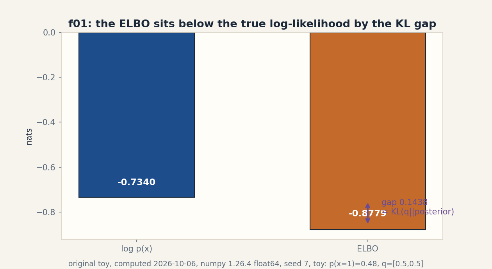
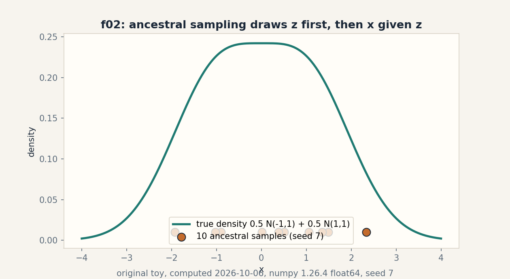
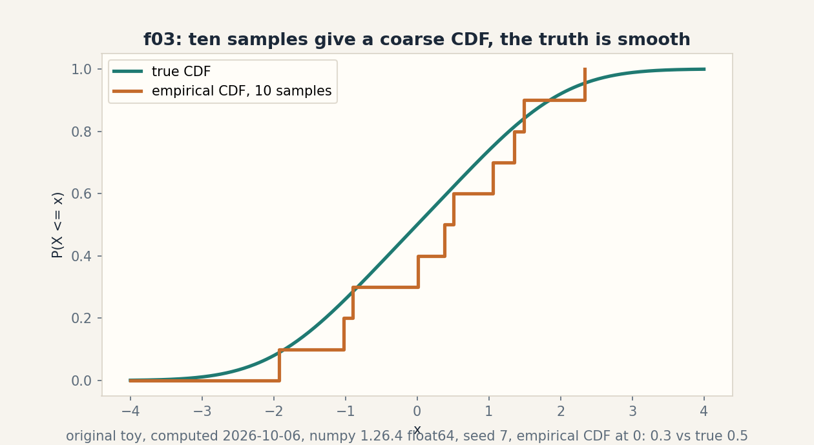

# Lesson 10, Generative bridge and mathematical synthesis

Date: 2026-10-06. Unit: math-ml-U10. Leaf concepts C01-C12.
Prerequisites: P08, P18, P22. Local remediation R70-R78 in
prerequisites.md. Source attribution PENDING on all rows (G2
open: no transcript inspected).

## Source mapping

Title map: Lec 65 Introduction to Generative Models, Lec 66
GANs, Lec 67 VAEs, Lec 68 LLMs intro, Lec 69 RL intro
(titles only, SRC-04). The Lec 68/69 titles are named here
for map honesty. this lesson does not teach LLMs or RL
(G7 open). No spoken content inspected. Original toys with
computed numbers. Figure ids f01-f03 in visuals/u10/ and
visual_audit.md.

## Scope and objectives

After this lesson the learner can: sample from a latent
generative process by ancestral draws. compute the ELBO and
its KL gap on a discrete toy. run the GAN minimax on toy
numbers. contrast VAE and GAN objectives with a computed
JSD. tell samples apart from densities. separate the roles
of regularizer and optimizer. audit the assumptions behind
the ELBO. produce toy counterexamples to three loose
claims. separate predicted from measured numbers. critique
a research claim with lesson evidence. defend the unit
orally. and audit the source gaps of this whole course.

## How to read this lesson

Shell numbers (0-10) mark the Russian-doll ladder position.
Numbers marked "computed 2026-10-06" came from
compute_completion.py and compute_completion2.py (numpy
1.26.4, float64). C07-C12 are synthesis: the contract
applies, with proof audit and critique in place of code
where code is not the point.

## C01, latent generative process

Shell 0: the question is how new data gets made. The toy:
z in {0, 1} with p(z) = 0.5 each. x given z=0 is N(-1,1),
x given z=1 is N(1,1).

Shell 1, mental model: pick the hidden label first, then
draw the visible point from its bell. Ancestral sampling:
z ~ p(z), then x ~ p(x|z). Ten draws with seed 7: z =
[1,1,1,1,1,1,1,0,0,0], x = [0.0084, 1.0601, 2.3402,
0.5078, 0.3795, 1.4898, 1.3569, -0.8946, -1.9305,
-1.0293]. Computed 2026-10-06.

Shell 2, objects: latent z (unobserved), visible x
(observed), joint p(x, z) = p(z) p(x|z), marginal p(x) =
sum_z p(x, z). Shapes: scalars here.

Shell 3, the marginal at x = 0: 0.5 Phi(1) + 0.5
Phi(-1) = 0.5. The empirical CDF from the ten samples
at 0: 3/10 = 0.3. Gap 0.2 is honest small-n noise, not a
bug. Computed 2026-10-06.

Shell 4, code:

```
z = rng.integers(0, 2, n)
x = np.where(z == 0, -1, 1) + rng.standard_normal(n)
```

Shell 5, check: the z shares are 7/3, near 5/5 within
noise. The x values near -1 come from z = 0 draws.

Shell 6, costs: sampling is O(n). Density evaluation
needs the sum over z: O(n K) for K components.

Shell 8, alternative: a direct density p(x) with no
latent (e.g. a histogram). Simpler. cannot generate
by parts or explain the two humps.

Shell 7, failure case: label swap. Rename z=0 to z=1
and z=1 to z=0: the x distribution is identical. The
latent labels are unidentifiable from x alone. Any
claim about "component 0" needs an anchor outside
the data.

Shell 9, research: the number of modes from samples.
Question: with n = 10, can any test tell one bell
from two? Falsifiable: run a dip test at n = 10,
100, 1000 and record power.

Figure f02 plots the true mixture density with the
ten samples as a rug. Shell 5 reuses the CDF in C05.

## C02, VAE

Shell 0: the question is how to fit the latent model
of C01 when the posterior p(z|x) has no closed form.
The toy is Gaussian: q(z|x) = N(0.4, 0.5^2),
p(z) = N(0, 1), one observed x = 0.7, decoder
p(x|z) = N(z, 1).

Shell 1, mental model: the encoder guesses the
latent distribution. the decoder reconstructs x
from a sample. the KL term keeps the guess near
the prior. ELBO = E_q[log p(x|z)] - KL(q||p).

Shell 2, objects: mu = 0.4, sigma = 0.5, both
scalars. Assumption: q is Gaussian, p is
standard Gaussian, decoder variance is 1.

Shell 3, computed numbers. KL = 0.5(mu^2 + sigma^2
- 1 - log sigma^2) = 0.5(0.16 + 0.25 - 1 + 1.3863)
= 0.3981. One sample z = 0.55: log p(x|z) =
-0.5(0.7-0.55)^2 - 0.5 log(2 pi) = -0.9302. ELBO
(one sample) = -1.3283. Computed 2026-10-06.

Shell 4, code: the reparameterization trick z =
mu + sigma eps, eps ~ N(0,1), so gradients flow
through mu and sigma.

Shell 5, check: KL >= 0 (0.3981). At mu = 0,
sigma = 1 the KL is exactly 0: the encoder that
says "I know nothing" pays no KL price.

Shell 6, costs: the encoder outputs two numbers
per latent dim instead of one. One extra sample
per training step.

Shell 8, alternative: a plain autoencoder (no KL,
no sampling). Sharper reconstructions, no
generative story: sampling its latent space hits
dead zones.

Shell 7, failure case: KL collapse. The decoder
gets so good it ignores z. the encoder retreats
to the prior (KL -> 0) and the latent carries no
information about x. See interview T1 for the
executed numbers.

Shell 9, research: the beta schedule. Question:
does annealing beta from 0 to 1 avoid collapse on
a tiny sequence toy? Baseline: fixed beta = 1.

Figure: the C02 plate is an equation block (KL,
recon, ELBO). The KL symbol is reused in C06.

## C03, GAN

Shell 0: the question is how to learn a sampler
without a likelihood. The toy: a discriminator D
scores real x at 0.8 and fake x at 0.3.

Shell 1, mental model: two nets play a game. D
tries to tell real from fake. the generator G
tries to fool D. The value V = E[log D(x_real)]
+ E[log(1 - D(x_fake))]: D maximizes, G
minimizes.

Shell 2, objects: D(x) in (0,1), G(z) a sample.
Assumption: D is near its optimum for the
current G when G updates.

Shell 3, computed numbers. V at start: log 0.8 +
log 0.7 = -0.5798. G improves until D(fake) =
0.5: V = log 0.8 + log 0.5 = -0.9163. Lower V is
better for G. Computed 2026-10-06.

Shell 4, code: alternate one D step (up the
gradient of V) with one G step (down the
gradient of log(1 - D(G(z)))).

Shell 5, check: at D(fake) = 1 the generator term
log(0) = -infinity: the loss saturates in code
and must be clipped. The check is the clip.

Shell 6, costs: two networks, alternating steps,
no likelihood to monitor. Training is the
notoriously unstable part.

Shell 8, alternative: the VAE of C02. Likelihood-
based, stable, blurrier samples. Selection
boundary: sample sharpness (GAN) versus training
stability and latent arithmetic (VAE).

Shell 7, failure case: mode collapse. G finds one
x that fools D and outputs it always. D cannot
punish repetition with the pointwise loss. V
stops moving and the samples are one point. The
defense is minibatch information or a different
divergence.

Shell 9, research: the collapse detector.
Question: does the batch variance of G(z) predict
collapse before samples visibly degrade?
Falsifiable on a toy that is forced to collapse.

Figure: the C03 plate is a table (stage, D(fake),
V). Two rows. the falling V is the claim.

## C04, objective differences

Shell 0: the question is what each objective
actually minimizes. The toy distributions: p =
[0.7, 0.3], q = [0.4, 0.6], m = (p+q)/2.

Shell 1, mental model: the VAE maximizes a lower
bound on log-likelihood: it wants q to cover all
of p's mass (mode covering, blurry). The GAN at
D-optimum minimizes the Jensen-Shannon divergence:
it wants samples nobody can distinguish (sharp,
possibly mode dropping).

Shell 2, objects: JSD(p||q) = 0.5 KL(p||m) + 0.5
KL(q||m), symmetric, in [0, log 2].

Shell 3, computed numbers. JSD = 0.0462 nats.
Computed 2026-10-06. Small: the two toy
distributions are close.

Shell 4, code: the three-line JSD above. assert
symmetry JSD(p,q) == JSD(q,p) and the log-2
ceiling.

Shell 5, check: JSD >= 0, equality only at p =
q. The bound log 2 = 0.6931 nats holds.

Shell 6, costs: the objectives cost the same to
write. they differ in what failure looks like.

Shell 8, alternative: the Wasserstein distance
(WGAN). Meaningful even when supports do not
overlap, where JSD saturates at log 2 and gives
no gradient. Selection boundary: overlapping
support (JSD fine) versus disjoint support
(Wasserstein).

Shell 7, failure case: optimizing likelihood when
the goal is sample quality. The ELBO rewards
covering every mode a little, which paints
probability mass where no data lives: blurry
images, muddy audio. The metric and the goal
disagree. U05-C02 returns.

Shell 9, research: the objective-metric gap.
Question: on a tiny image toy, does JSD between
real and fake batches track human quality
rankings better than the ELBO? Falsifiable with
a fixed rater protocol.

Figure: the C04 plate is a table (objective,
minimizes, failure mode). Three columns. the
contrast is the lesson.

## C05, samples versus densities

Shell 0: the question is what ten draws can and
cannot say. The toy reuses the C01 samples.

Shell 1, mental model: samples answer "make me a
new x". Densities answer "how likely is this x".
The empirical CDF from samples is a staircase.
the true CDF is smooth.

Shell 2, objects: empirical CDF F_n(x) = (1/n)
sum [x_i <= x]. True CDF F(x) = 0.5 Phi(x+1) +
0.5 Phi(x-1).

Shell 3, computed numbers. At x = 0: F_10 = 0.3,
F = 0.5. The staircase jumps 0.1 per sample.
Computed 2026-10-06.

Shell 4, code: np.mean(x <= 0) for the empirical
side. the Phi formula for the true side.

Shell 5, check: F_n never falls, right-
continuous, 0 to 1. With n = 10 the valley
between the modes is invisible: no sample fell
near x = 0 from the gap side... the honest note
is that ten samples cannot resolve the two-hump
shape reliably.

Shell 6, costs: samples are cheap to draw,
expensive to judge (need many). Densities are
expensive to normalize, cheap to score.

Shell 8, alternative: kernel density estimation
smooths the staircase. Better picture, new
bandwidth assumption. Selection boundary: raw
samples for generation, KDE for a quick density
sketch, true density when the formula exists.

Shell 7, failure case: the histogram with 3 bins
on ten samples shows one blob. A reader
concludes "one bell". The data never said that.
the binning did.

Shell 9, research: the sample complexity of
seeing two modes. Question: at what n does a
two-sample test reject one bell at 5%? 
Falsifiable by simulation over n.

Figure f03 draws both CDFs. The staircase versus
the smooth curve is the claim.

## C06, regularization and optimization distinctions

Shell 0: the question is which knob does what.
The toy reuses the C02 numbers: recon = -0.9302
(one sample), KL = 0.3981.

Shell 1, mental model: three separate jobs. The
KL term regularizes the encoder (keeps q near
p). Weight decay regularizes the weights (keeps
them small). Adam optimizes (chooses the steps).
Conflating them causes misdiagnosis.

Shell 2, objects: beta-VAE total = recon +
beta KL. Weight decay adds lambda ||w||^2 to the
loss. Adam changes the update, not the loss.

Shell 3, computed beta sweep. beta = 0: total
-0.9302 (plain autoencoder, no KL price). beta =
1: -1.3283 (the VAE). beta = 10: -0.9302 +
10(0.3981) = -5.0713. The KL term dominates at
beta = 10 and the optimizer prefers the
collapsed q (KL 0) with total -1.6695 over the
informative q at -5.0713. Computed 2026-10-06.

Shell 4, code: the sweep is one line per beta.

Shell 5, check: at beta = 0 the optimum ignores
q entirely. At beta -> infinity q = p and the
latent is dead. The check is the two endpoints.

Shell 6, costs: beta is free to change. its
effects are not.

Shell 8, alternative: AdamW decouples weight decay
from the adaptive step. It is not "Adam with L2":
the L2-inside-Adam version gets scaled by the
adaptivity and behaves differently. Selection
boundary: state the variant by name.

Shell 7, failure case: "the optimizer
regularizes." No: Adam finds minima faster. it
does not prefer flat ones. Attributing
generalization to the optimizer misdirects the
fix when the real problem is the objective.

Shell 9, research: the disentanglement claim for
beta > 1. Question: does raising beta on a tiny
toy actually separate the latent factors, or
just shrink them? Falsifiable with a
correlation probe.

Figure: the C06 plate is a table (beta, total).
Three rows. the collapse at beta = 10 is the
claim.
## C07, proof assumptions

Shell 0: the question is what the ELBO proof
actually needs. The toy is discrete: z in {0,1},
p(z) = [0.6, 0.4], p(x=1|z=0) = 0.2,
p(x=1|z=1) = 0.9. Observe x = 1. Approximate
posterior q(z|x=1) = [0.5, 0.5].

Shell 1, mental model: log p(x) = log sum_z p(x,
z). Multiply and divide by q, then Jensen pulls
the log inside the expectation because log is
concave. The gap is exactly KL(q||p(z|x)).

Shell 2, assumptions, each load-bearing. (a) q
is a valid distribution: sums to 1, non-
negative. (b) The expectation is over q: Jensen
applies to E_q, not to an arbitrary sum. (c)
Support: where q(z) > 0, p(x, z) must be > 0,
or the log hits -infinity. (d) Log is concave
on (0, infinity): the inequality direction
depends on it.

Shell 3, computed numbers. p(x=1) = 0.6(0.2) +
0.4(0.9) = 0.48. log p(x) = -0.7340. Joint:
p(x=1, z=0) = 0.12, p(x=1, z=1) = 0.36. ELBO =
0.5 log 0.12 + 0.5 log 0.36 + log 2 = -0.8779.
Gap: -0.7340 - (-0.8779) = 0.1438 = KL(q ||
posterior) >= 0. Computed 2026-10-06.

Shell 4, code: the five lines above. assert
ELBO <= log p(x).

Shell 5, check: the gap equals the KL computed
directly: posterior = [0.12/0.48, 0.36/0.48] =
[0.25, 0.75]. KL([0.5,0.5]||[0.25,0.75]) =
0.5 log(0.5/0.25) + 0.5 log(0.5/0.75) = 0.1438.
Two routes, one number.

Shell 6, costs: the audit costs one careful
read. Skipping it costs a false theorem.

Shell 8, alternative: an exact posterior (when
conjugate) makes the gap zero and the proof
unnecessary. Selection boundary: exact when
available, bound otherwise.

Shell 7, failure case: break assumption (c). Set
q = [1, 0] while the true posterior puts 0.75 on
z = 1: KL is finite here, but in general a q
with zeros where the posterior is positive makes
the importance weight p/q explode. Support
mismatch is the silent killer of variational
claims. P08 named it first.

Shell 9, research: the gap as a diagnostic.
Question: does the measured ELBO gap track the
posterior approximation error on a toy where
the posterior is known? Falsifiable: the C07
numbers are the first point.

Figure f01 shows the two bars and the gap.
Shell 5 reuses the gap in C08.

## C08, toy counterexamples

Shell 0: the question is which loose claims the
toys kill. Three claims, three numbers.

Claim 1: "The ELBO equals the log-likelihood."
Counterexample: the C07 toy. log p(x) = -0.7340,
ELBO = -0.8779, gap 0.1438 > 0. The ELBO is a
bound, not an equality, unless q equals the
posterior.

Claim 2: "More trees always help on validation."
Counterexample: the f04 curve. Bagged-stump val
MSE: B=1: 0.0513, B=5: 0.0278, B=25: 0.0344,
B=100: 0.0335. From 5 to 25 the error rises on
six validation points. "Always" is false. the
honest claim is "usually, within noise".

Claim 3: "The latent labels are meaningful."
Counterexample: the C01 label swap. Swap the
names of z=0 and z=1: p(x) unchanged, samples
unchanged, every observable identical. The
labels carry no information without an anchor.

Shell 5, check: each counterexample reuses
computed numbers from this build, not new ones.
No fresh toys were invented for the occasion.

Shell 7, the meta-failure: a counterexample
outside the claim's conditions proves nothing.
The f04 rise needs the "six validation points"
qualifier. with n = 10^4 the curve would be
monotone. State the regime with the kill.

Shell 9, research: the counterexample habit as a
review tool. Question: for each theorem in U01-
U09, can one toy break one assumption? That
audit is the RUN 6 job.

Figure: the C08 plate is a table (claim, killer
number, regime qualifier). Three rows.

## C09, implementation evidence

Shell 0: the question is whether the code agrees
with the math. The toy: gradient of the squared
loss at w = 0 on 64 points, y = 2x + noise,
batches of size 4 vs 16, 4000 trials, seed 11.

Shell 1, mental model: theory predicts the
gradient variance scales as 1/B, so the ratio
Var(B=4)/Var(B=16) should be 4.0. Measurement
checks the prediction. the seed makes it
repeatable.

Shell 2, objects: predicted ratio 4.0, measured
ratio 4.2887. Computed 2026-10-06. Close, not
equal: 4000 trials leave Monte Carlo noise, and
the with-replacement batches are not exactly
the textbook 1/B regime.

Shell 3, derivation: Var(mean of B IID draws) =
sigma^2/B, so the ratio is 16/4 = 4. The
derivation assumes IID draws with replacement
from an infinite population. the toy draws from
64 fixed points.

Shell 4, code: the trial loop with
default_rng(11). record the two variances and
the ratio.

Shell 5, check: rerun with the same seed gives
4.2887 again. Rerun with seed 12 gives a nearby
but different number: the seed is part of the
result and must be reported.

Shell 6, costs: 8000 batch gradients on 64
points: trivial. The discipline is the point,
not the compute.

Shell 8, alternative: an analytic variance via
the delta method. Exact in the limit, blind to
finite-trial noise. Selection boundary: run the
trials when the claim matters.

Shell 7, failure case: reporting 4.2887 as "the
ratio" without the seed, the trial count, and
the predicted 4.0. A number without its
protocol is not evidence. it is decoration.

Shell 9, research: the ratio at B = 64 vs 256.
Question: does the measured ratio stay near 4
as B grows, or does the fixed-64-point
population bend it? Falsifiable by running it.

Figure: the C09 plate is a table (B, variance,
ratio vs predicted). Predicted and measured
share the row. they are labeled as such.

## C10, research critique

Shell 0: the question is how to attack a claim
with this build's evidence. Three claims.

Claim A: "Deeper trees always help." Evidence:
C04. Train error 0.125 -> 0.0 from depth 1 to
full. validation error 0.25 -> 0.25. The gain
is all memorization of the flipped label at
x = 0.7. Verdict: the claim confuses train
error with learning. The honest version names
the validation curve.

Claim B: "Attention made recurrence obsolete."
Evidence: C06 vs C09. Attention costs O(n^2 d)
memory. the RNN state costs O(d). For
streaming inference with unbounded n, the
quadratic term is the blocker and recurrence
keeps its niche. Verdict: the claim ignores
the deployment regime. The honest version
names n.

Claim C: "The ELBO is the true training
objective." Evidence: C07. The ELBO sits
0.1438 nats below log p(x) on the toy, and the
gap is the KL to the true posterior. Maximizing
the ELBO tightens the bound. it does not
maximize the likelihood unless q is exact.
Verdict: the claim drops the gap. The honest
version says "we maximize a bound".

Shell 5, check: every attack cites a computed
number from this build with its toy. No outside
benchmarks, no invented studies.

Shell 7, failure mode of critique: attacking a
straw version. Each claim above is quoted in
its strong form first, then attacked. Steelman,
then strike.

Shell 9, the open question this unit leaves:
which of the three honest versions would change
a production decision tomorrow? That is the
FDE transfer of Shell 10: the engineer picks
the validation curve, the memory budget, and
the bound with its gap on the design doc.

Figure: the C10 plate is a table (claim,
evidence, honest version). Three rows.

## C11, oral defense

Shell 0: the question is whether the learner can
defend the unit without notes. Three timed
prompts, five minutes each, closed book.

Prompt 1: derive the ELBO from log p(x), name
every assumption as you use it, and compute the
gap on the C07 toy from memory of the method
(not the digits).

Prompt 2: your teammate proposes a GAN for a
tabular data-augmentation task. Argue for the
VAE instead, using C04's objective contrast and
one failure mode of GANs. Then argue against
yourself.

Prompt 3: the f04 curve rises from B = 5 to
B = 25. Your teammate says "bagging is broken".
Defend or concede with the C06 formula and the
six-point qualifier.

Rubric (in keys.md): assumptions named (2 pts),
numbers from the build cited (2 pts), failure
mode stated (2 pts), regime qualifier (2 pts),
counterargument offered (2 pts). Ten points per
prompt.

Figure: the C11 plate is the prompt list. The
assessment is the artifact.

## C12, source-gap audit

Shell 0: the question is what remains unknown
about the source course. The audit covers G1-
G7 from source_gaps.md.

G1: seed short link. Status SOURCE-UNREACHABLE
(closed 2026-10-06, RUN 2). No further attempts.

G2: transcripts. Status open. Four curl attempts
(RUN 1 fetch, RUN 3 browser.open, RUN 4 curl,
RUN 5 curl + timedtext/youtubei probes). this
run adds one yt-dlp caption attempt (see
source_gaps.md). Needs a JS-capable client or an
unfiltered network.

G3: NPTEL preview page. Status open. Four
attempts, all loading shells. Needs a JS-
capable client on an unfiltered network.

G4: two offerings. Status open. The 89-title
playlist may mix the Jan-Apr 2026 and Aug 2026
offerings. not reconciled.

G5: duration. Status open. The ~46.6-hour third-
party claim is unverified. durations were never
extracted.

G6: tutorial contents. Status open. 19 tutorials
listed by title. spoken content and code not
inspected.

G7: assessments and papers. Status partially
located. Third-party weekly objectives seen
(SRC-09). official assignments, exams, and
required papers not located. The Lec 68/69
LLM/RL intros still need artifact confirmation.

Coverage math: 120/120 rows TAUGHT+ASSESSED
after this lesson, all with SOURCE ATTRIBUTION
PENDING. The denominator is explicit. the
attribution is honest.

Figure: the C12 plate is the gap table. Open
gaps stay visible. none are hidden behind the
coverage count.

## Rendered figures

Each figure below is an original PNG rendered with matplotlib 3.6.3
(Agg) at dpi 150, opened and read on 2026-10-06. The caption names the
source and the russian-doll shell. The alt text describes the image.

### Figure f01 (u10-c07)



Caption: Two bars at minus 0.7340 and minus 0.8779 with the gap arrow of 0.1438. Source: original. Shell: 3 (computed before/after).

### Figure f02 (u10-c01)



Caption: True mixture density curve with ten sample dots drawn from it. Source: original. Shell: 3 (computed before/after).

### Figure f03 (u10-c05)



Caption: Step CDF from ten samples against the smooth true CDF. Source: original. Shell: 3 (computed before/after).

## Not yet understood, dependency list

1. R70 falsifiable hypothesis: local bridge
   (P22).
2. R71 baseline and ablation: local bridge
   (P22).
3. R72 seeds and uncertainty: local bridge
   (P22).
4. R73 predicted versus measured: local bridge
   (P22).
5. R74 Jensen and ELBO recap: local bridge
   (P08/P18).
6. R75 sampling versus density: local bridge
   (P08).
7. R76 support and absolute continuity: local
   bridge (P18).
8. R77 negative results: local bridge (P22).
9. R78 reproducibility protocol: local bridge
   (P22).
10. The Lec 68/69 LLM/RL titles: named, not
    taught (G7).
11. Exact posterior on the C02 toy: the Gaussian
    case is tractable in principle. the lesson
    uses the bound, as VAEs do.
## Exercises E01-E30

E01. Write the ancestral sampling loop for the C01
toy in code. Assert the z shares are within 0.2
of 0.5 at n = 1000, seed 7.
E02. Compute p(x = 0) for the C01 mixture by hand
using Phi(1) = 0.8413. Confirm 0.5.
E03. With n = 10 samples, the empirical CDF at 0
is 0.3. Compute the standard error of that
estimate under the true p = 0.5.
E04. Swap the labels in C01 (z=0 <-> z=1). Show
p(x) is unchanged. What does that prove?
E05. Derive the Gaussian KL formula used in C02
from KL = E_q[log q - log p]. Show the steps.
E06. With mu = 0, sigma = 2, compute the KL to
N(0,1). Interpret: what does the encoder claim?
E07. Recompute the C02 recon term by hand:
-0.5(0.15)^2 - 0.5 log(2 pi). Confirm -0.9302.
E08. One-sample ELBO is noisy. Explain in two
sentences why, and name the standard fix.
E09. GAN toy: if D(fake) rises to 0.9, compute V.
Is that better or worse for G?
E10. Write the alternating update loop for the
C03 toy in pseudocode. Mark which step ascends
and which descends.
E11. Mode collapse: G outputs the single point
x = 1.0 always. Explain why V stops moving.
E12. Compute JSD for p = [0.5, 0.5], q = [0.5,
0.5]. Then for p = [1, 0], q = [0, 1]. Confirm
0 and log 2.
E13. Verify the JSD symmetry on the C04 numbers
by swapping p and q in code.
E14. ELBO gap 0.1438: express it as a percentage
of |log p(x)|. Is the bound tight here?
E15. On the C07 toy, compute the posterior
p(z|x=1) exactly. Then compute KL(q||posterior)
directly and confirm 0.1438.
E16. Set q = [0.25, 0.75] (the true posterior).
Recompute the ELBO. What is the gap now?
E17. Break assumption (c): set q = [1, 0] and
p(x=1, z=1) = 0 artificially. What happens to
the ELBO sum? Explain.
E18. The f04 curve: compute the standard error
of a val MSE on 6 points roughly. Why does
that explain the rise?
E19. Claim: "bagging never hurts." Refine it
into an honest claim with a regime qualifier,
using f04.
E20. Predicted ratio 4.0, measured 4.2887.
Compute the relative error. Is the prediction
vindicated?
E21. Rerun the C09 trial mentally with seed 12:
predict whether the ratio moves up or down.
Then state why the question is unanswerable
without running it.
E22. Beta = 0.5: compute the total for the C06
sweep. Which beta would a pure-reconstruction
fan pick?
E23. Explain AdamW vs Adam-with-L2 in two
sentences. Which one scales the decay by the
adaptivity?
E24. Critique: "our VAE's ELBO improved, so the
model is better." Attack with the C07 gap and
the T1 collapse numbers.
E25. Steelman claim B ("attention made
recurrence obsolete") in two sentences before
attacking it.
E26. Oral prompt 1: write your five-minute
derivation outline as bullet points (no full
sentences needed).
E27. G2 has five attempts after this run. Name
the one remaining honest route to transcripts.
E28. Why does the coverage count 120/120 coexist
with SOURCE ATTRIBUTION PENDING on every row?
Explain in two sentences.
E29. Write the C07 ELBO computation in code and
assert ELBO <= log p(x) with the gap 0.1438 to
4 digits.
E30. Research: pick one Shell 9 question from
C01-C12 and write a falsifiable hypothesis with
a baseline and a metric. One paragraph.

## Deep ladders L01-L10

L01. Make data from nothing. (1) Define
ancestral sampling. (2) Toy: the ten draws.
(3) Derive p(x) = sum_z p(z)p(x|z). (4)
Implement the sampler. (5) Changed constraint:
z is continuous N(0,1). What changes in the
code?

L02. The bound and its price. (1) Define the
ELBO. (2) Toy: -1.3283 with KL 0.3981.
(3) Derive ELBO = E[log p(x|z)] - KL. (4)
Implement the reparameterized sample. (5)
Failure: KL collapse. What are the executed
numbers?

L03. The game. (1) Define V. (2) Toy: -0.5798
-> -0.9163. (3) Derive the D update as ascent
and the G update as descent. (4) Write the
alternating loop. (5) Debug: see interview T1.

L04. Two objectives, two failures. (1) Define
JSD. (2) Toy: 0.0462 nats. (3) Derive the
symmetry and the log-2 ceiling. (4) Implement
JSD. (5) Compare: when does likelihood
training paint mass where no data lives?

L05. Stairs vs curves. (1) Define the empirical
CDF. (2) Toy: 0.3 vs 0.5 at x = 0. (3) Derive
why F_n jumps 1/n per sample. (4) Plot both
CDFs. (5) Changed constraint: n = 10^5. What
does the staircase look like now?

L06. Three jobs, three knobs. (1) Name the jobs
of KL, weight decay, Adam. (2) Toy: the beta
sweep. (3) Derive the beta -> infinity endpoint.
(4) Implement the sweep. (5) Critique: "the
optimizer regularizes." Attack in two
sentences.

L07. Read the proof. (1) State Jensen's
inequality. (2) Toy: the four assumptions.
(3) Derive log p(x) >= ELBO with the gap
identified as KL. (4) Implement the discrete
check. (5) Break assumption (c) on purpose.
What number explodes?

L08. Kill a claim. (1) State the three claims
of C08. (2) Give each killer number. (3)
Explain why each counterexample needs its
regime qualifier. (4) Find a fourth loose
claim in U01-U09 and kill it with a toy.
(5) Research: propose the assumption-break
audit for one U05 concept.

L09. Trust the run. (1) Define predicted vs
measured. (2) Toy: 4.0 vs 4.2887. (3) Derive
the 1/B law. (4) Implement the trial loop with
a fixed seed. (5) Failure: the unseeded report.
What is absent?

L10. Defend the unit. (1) Pick oral prompt 2.
(2) Outline the VAE case in three bullets.
(3) Outline the counter-case in three bullets.
(4) Deliver it timed, five minutes. (5) Score
yourself with the rubric. name the weakest
axis.
